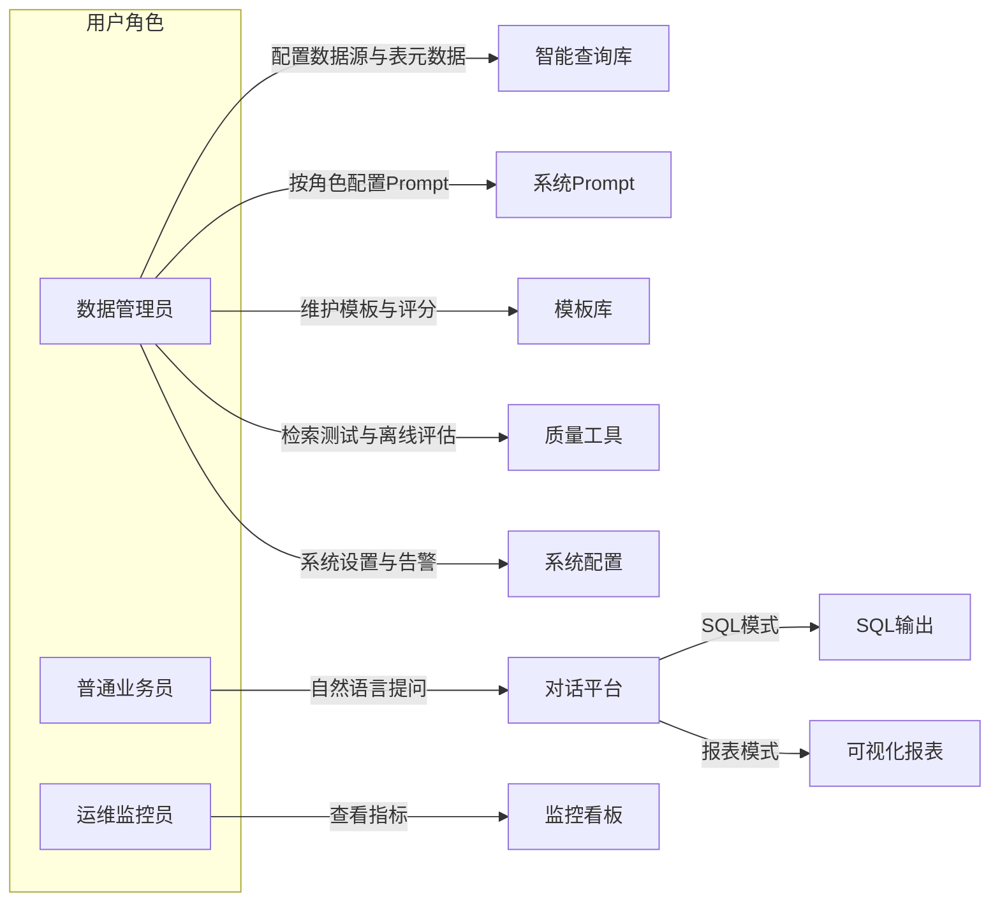
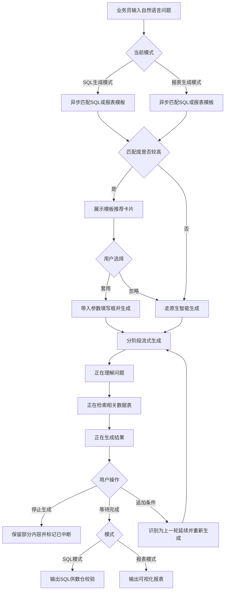
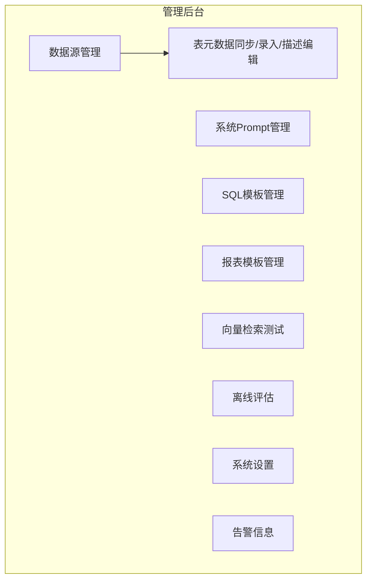

# 灵析（LingAnalytics）智能数据透视平台 — 业务需求规格说明书

| 属性 | 内容 |
|------|------|
| 文档名称 | 数据透视平台业务需求规格说明书（PRD） |
| 产品名称 | 灵析（LingAnalytics）/ 智能数据透视平台 |
| 文档版本 | v1.0 |
| 编写日期 | 2026-07-01 |
| 文档状态 | 初稿 |

---

## 1. 文档修订记录与术语定义

### 1.1 文档修订记录

| 版本 | 日期 | 修订人 | 修订说明 |
|------|------|--------|----------|
| v1.0 | 2026-07-01 | — | 初稿。覆盖管理后台（8 大功能域）、用户前端平台、监控平台三大模块 |

### 1.2 术语定义

| 术语 | 业务含义 | 使用场景 |
|------|----------|----------|
| **智能查询库** | 经数据管理员筛选并维护业务语义后的表/字段集合，供系统理解用户自然语言提问 | 用户提问时，系统仅在此范围内检索相关数据对象 |
| **数据源** | 一个可连接的业务数据库实例，包含连接地址、访问账号、目标库名等信息 | 管理后台接入公司各业务库的起点 |
| **表元数据同步** | 从已连接数据源自动拉取表名、字段名及基础类型信息，形成可维护的清单 | 数据源连接成功后，管理员触发或系统自动执行 |
| **业务中文名** | 表或字段面向业务人员的可读名称，如将 `user_id` 展示为「用户唯一标识」 | 元数据维护、检索结果展示、生成解释 |
| **字段描述** | 对字段业务含义的补充说明，帮助系统与用户理解字段用途 | 元数据维护界面编辑 |
| **字段同义词** | 同一字段可对应多个业务叫法，如 `created_at` 关联「下单时间」「注册日期」 | 用户用不同口语提问时，系统仍能匹配到正确字段 |
| **系统 Prompt** | 约束智能助手行为方式的指令集合，含角色设定与系统限制 | 管理后台按角色配置，影响生成语气与边界 |
| **角色 Prompt** | 针对某一用户角色单独配置的系统 Prompt，未配置时继承默认 Prompt | 不同角色可有不同的查询权限与回复策略 |
| **SQL 模板** | 预置的、带占位符参数的标准 SQL 语句及场景描述 | 高频取数场景复用，减少重复生成 |
| **报表模板** | 预置的图表类型、SQL 占位符及图表轴映射配置 | 高频报表场景复用 |
| **占位符参数** | SQL/报表模板中待用户填写的变量，如 `{{start_date}}` | 用户套用模板后，在参数填写框中补全 |
| **模板匹配度** | 系统衡量用户问题与已有模板相似程度的评分 | 决定是否向用户展示「套用模板」推荐卡片 |
| **语义检索** | 根据用户自然语言问题，从已维护的表/字段知识中找出最相关的数据对象 | 生成 SQL/报表前的关键步骤；管理端「向量检索测试」用于验证此能力 |
| **离线评估集** | 由管理员维护的一组标准测试问题及期望结果要点 | 批量验证系统理解质量，不依赖真实用户在线提问 |
| **评估报告** | 离线评估运行后输出的汇总结果，含命中率、低分样本等 | 管理后台质量复盘 |
| **流式回复** | 系统回答以逐字/逐句方式实时呈现，而非等待全部完成后一次性展示 | 用户前端对话体验 |
| **会话延续** | 用户在历史对话基础上追加条件，系统将其视为同一话题的延续 | 如「把地区换成华北」 |
| **缓存命中** | 相同或高度相似的问题复用已有生成结果，无需重新完整生成 | 监控看板统计查询重复率 |
| **检索相似度评分** | 系统对「问题—表/字段」匹配程度的内部量化结果 | 检索质量预警、语义检索测试展示 |
| **返回行数上限** | 管理员配置的单次查询结果最大允许行数 | 系统设置；超限时须提示用户收窄条件 |
| **告警事件** | 系统检测到的需关注业务异常，如检索低分集中、连接失败等 | 管理后台告警信息、监控看板预警 |
| **Token 消耗** | 智能生成过程中消耗的计费/token 用量（业务统计口径） | 监控看板成本趋势 |
| **满意度反馈** | 用户对单次生成结果进行的点赞或点踩 | 监控看板、模板评分参考 |

### 1.3 文档范围说明

本文档仅描述**用户要做什么**、**系统应如何响应**、**业务流程如何流转**及**界面交互规则**。

本文档**不包含**：技术选型、接口定义、数据库表结构设计、具体代码实现逻辑。

---

## 2. 用户角色定义

### 2.1 角色一览

| 角色 | 核心诉求 | 可访问模块 | 典型操作 |
|------|----------|------------|----------|
| **数据管理员** | 接入数据源、维护智能查询库、配置系统行为、管理模板、保障生成质量 | 管理后台 | 配置连接、同步元数据、编辑 Prompt、收入高分模板、运行离线评估、处理告警 |
| **普通业务员** | 用大白话灵活取数、制作报表，无需掌握 SQL | 用户前端平台 | 切换生成模式、自然语言提问、套用模板、查看历史会话 |
| **运维/监控员** | 掌握系统运行质量、成本与用户满意情况 | 监控平台 | 查看缓存命中、检索预警、Token 趋势、满意度统计 |

### 2.2 外部协作角色

| 角色 | 说明 |
|------|------|
| **数仓同事** | 非系统内建账号角色。在 SQL 生成模式下，业务员获得系统输出的 SQL 后，由数仓同事在线下或既有协作渠道中进行校验与执行。系统不负责数仓侧的审批流转。 |

### 2.3 角色与模块关系

### 2.4 权限原则（业务层）

- 普通业务员仅能查询其**权限范围内**的表与字段；超出范围时系统应拒绝并说明原因。
- 数据管理员可访问管理后台全部功能；其操作（含 Prompt 变更、系统设置修改）须留痕。
- 运维/监控员可查看监控看板，默认不可修改业务配置（除非兼任数据管理员）。

---

## 3. 业务总体流程

### 3.1 用户提问到获得结果 — 主流程

### 3.2 流程补充说明

**（1）管理侧准备流程（上线前/日常运维）**

数据管理员配置数据源 → 测试连接 → 同步或手动录入表元数据 → 编辑业务中文名、字段描述与同义词 → 将目标表纳入智能查询库 → 配置各角色 Prompt 与系统设置 → 维护 SQL/报表模板 → 通过语义检索测试与离线评估验证质量。

**（2）模板推荐分支**

用户输入问题后，系统在后台异步匹配已有模板。若匹配度达到「较高」阈值，在对话框上方或侧边展示推荐卡片，文案示例：「检测到已有相似报表模板，是否直接套用？」。用户点击「套用」则进入参数填写；点击「忽略」则继续原生智能生成，推荐卡片收起。

**（3）流式生成阶段**

系统须按顺序展示阶段状态：「正在理解问题…」→「正在检索相关数据表…」→「正在生成结果…」。各阶段下内容逐字流式呈现。

**（4）中断与延续**

- **中断**：生成过程中，原「发送」按钮变为「停止生成」；点击后本次生成立即终止，已生成内容保留在对话气泡中，并标记「已中断」。
- **延续**：用户在任意历史对话气泡下追加条件（如「把地区换成华北」），系统须识别为对上一轮次的延续，携带上下文重新生成，而非开启新话题。

**（5）结果反馈闭环**

用户对生成结果可点赞或点踩。反馈数据汇总至监控看板用户满意度模块，并作为模板评分的参考维度之一。检索相似度低分集中时，同步触发监控看板预警及管理后台告警信息。

**（6）历史会话**

左侧边栏展示历史会话列表，按日期倒序排列。用户可重命名会话标题、删除会话；删除后不可恢复。

### 3.3 管理后台导航结构

---

## 4. 功能性需求详细说明

以下各功能点均采用统一结构描述：**输入条件** → **处理规则** → **输出结果** → **界面交互规则**。

---

### 4.1 模块一：管理后台（数据管理员）

#### 4.1.1 数据源与表元数据管理

本功能域以**数据源**为入口，涵盖连接配置、表元数据同步、手动录入及业务描述编辑四类能力。

##### 4.1.1.1 数据源连接配置

**输入条件**

- 数据管理员已登录管理后台，具备数据源管理权限。
- 管理员持有目标数据库的连接地址、访问账号、目标库名。

**处理规则**

- 系统提供表单供管理员录入上述连接信息。
- 管理员点击「测试连接」后，系统验证连接是否可达、账号是否有效、目标库是否可访问。
- 连接测试**成功**后，方可触发元数据同步或进入表清单维护。
- 连接测试**失败**时，不触发同步，不更新已有元数据。

**输出结果**

- 测试成功：展示「连接成功」及最近一次测试时间。
- 测试失败：展示可读失败原因（如地址不可达、账号密码错误、库不存在等）。

**界面交互规则**

- 以数据源为列表入口；点击进入详情页，分 Tab 展示：「连接配置」「表清单」「字段详情」。
- 连接配置 Tab 底部固定「测试连接」「保存」按钮；保存前若未测试或测试失败，须二次确认。
- 支持对已有数据源编辑连接信息；修改后须重新测试连接方可再次同步。

##### 4.1.1.2 表元数据同步

**输入条件**

- 对应数据源连接测试已通过。

**处理规则**

- 管理员点击「同步元数据」后，系统自动拉取该库下全部表及字段清单（含字段基础类型信息）。
- 同步为**增量合并**逻辑：新增表/字段自动纳入清单；已删除的表/字段标记为「源端已不存在」，不自动从智能查询库移除，由管理员确认后处理。
- 同步过程中展示进度；同步完成后更新「最近同步时间」。

**输出结果**

- 以列表形式展示表清单；展开表可查看字段清单。
- 同步摘要：新增 N 张表、更新 M 个字段、标记移除 K 个对象。

**界面交互规则**

- 表清单支持按表名、业务中文名、是否已纳入智能查询库筛选。
- 支持搜索表名与字段名。
- 同步中禁止重复触发；同步失败展示原因并支持重试。

##### 4.1.1.3 表元数据手动录入

**输入条件**

- 管理员需在自动同步之外补充表/字段，或数据源暂不支持自动同步。

**处理规则**

- 管理员可手工新增表记录，填写物理表名、业务中文名、表描述。
- 在表下可手工新增字段，填写物理字段名、业务中文名、字段描述。
- 手工录入的对象须标记来源为「手动录入」，与「同步」来源区分。

**输出结果**

- 手工录入的表/字段出现在对应数据源的表清单与字段详情中，带来源标识。

**界面交互规则**

- 表清单页提供「新增表」「新增字段」入口。
- 手工录入项在列表中有明显来源标签（如「手动」）。
- 删除手工录入项须二次确认；同步来源的表/字段不可直接删除，仅可取消纳入智能查询库。

##### 4.1.1.4 表元数据描述编辑与智能查询库纳入

**输入条件**

- 表/字段已存在于清单中（同步或手动录入）。

**处理规则**

- 管理员可勾选「纳入智能查询库」；仅纳入的表及其字段参与用户提问时的语义检索。
- 管理员可编辑表/字段的**业务中文名**与**字段描述**。
- 管理员可为字段维护**同义词**列表（一对多），如 `created_at` 可关联「下单时间」「注册日期」「创建时间」。
- 同义词不可与智能查询库内其他字段的业务中文名或同义词冲突；冲突时系统提示并阻止保存。

**输出结果**

- 更新后的业务语义即时生效于后续用户提问的检索与生成。
- 已纳入/未纳入智能查询库的状态在列表中清晰展示。

**界面交互规则**

- 字段详情页提供同义词标签式编辑（输入后回车添加，点击标签删除）。
- 批量操作：支持批量勾选表纳入/移出智能查询库。
- 未保存离开页面时提示是否放弃修改。

---

#### 4.1.2 系统 Prompt 管理

**输入条件**

- 数据管理员已登录，具备 Prompt 管理权限。

**处理规则**

- 系统提供两类 Prompt 内容维护：
  - **角色设定**：定义智能助手以何种身份、语气、专业程度响应用户（如「你是熟悉电商业务的数据分析助手」）。
  - **系统限制**：定义禁止行为与边界约束（如「不得查询未纳入智能查询库的表」「不得输出用户权限范围外的字段」「遇到薪资相关提问须拒绝并说明」）。
- 支持**按用户角色分别配置** Prompt：左侧展示角色列表（含「默认/全局」与各业务角色），右侧分别编辑该角色的「角色设定」与「系统限制」。
- 未单独配置 Prompt 的角色，继承「默认/全局」配置。
- 每次保存生成新版本；管理员可查看历史版本列表并回滚至指定版本。
- 提供「预览」能力：管理员输入模拟问题，查看在当前 Prompt 配置下系统的预期响应风格与拒绝逻辑（预览不产生真实查询）。

**输出结果**

- 保存成功后，对应角色用户在下次提问时应用新 Prompt。
- 版本回滚后，立即恢复为历史版本内容。

**界面交互规则**

- 左侧角色列表 + 右侧双栏编辑区（角色设定 | 系统限制）。
- 编辑区支持多行文本；展示字数提示但不硬性截断（具体上限由实现阶段确定，业务上不限制管理员表达）。
- 保存、预览、回滚按钮固定在编辑区底部；回滚须二次确认。
- 页面展示「当前生效版本号」与「最近修改人/时间」。

---

#### 4.1.3 SQL 模板管理

**输入条件**

- 数据管理员持有待沉淀的标准 SQL 及业务场景描述。

**处理规则**

- 管理员可创建、编辑、停用、删除 SQL 模板。每条模板包含：
  - **模板名称**：简短标识，如「华东区月度销售额」。
  - **适用业务场景描述**：说明该模板解决什么问题，供匹配与检索使用。
  - **带占位符的 SQL 语句**：如 `SELECT SUM(amount) FROM orders WHERE region = {{region}} AND date >= {{start_date}}`。
- 系统自动对模板进行**评分**，评分维度（业务层）包括：使用频次、用户满意度、生成成功率等；综合展示为模板得分。
- 管理员可筛选高分模板，执行「收入模板库」操作，使其可被用户端模板推荐命中。
- 管理员亦可将模板从模板库中移出。

**输出结果**

- 模板列表展示名称、场景描述、得分、是否在库、最近使用时间。
- 收入模板库后，用户端异步匹配时可命中该模板。

**界面交互规则**

- 列表支持按名称搜索、按得分排序、按「是否在库」筛选。
- 编辑页提供 SQL 语法高亮（展示层）与占位符校验提示（占位符格式须为 `{{参数名}}`）。
- 删除模板须二次确认；已被用户频繁使用的模板删除前须额外警告。

---

#### 4.1.4 报表模板管理

**输入条件**

- 数据管理员持有待沉淀的标准报表配置及对应 SQL。

**处理规则**

- 管理员可创建、编辑、停用、删除报表模板。每条模板包含：
  - **模板名称**
  - **适用业务场景描述**
  - **图表类型**：折线图、柱状图、表格（首版支持以上三类）
  - **对应 SQL 语句**（可含占位符，规则同 SQL 模板）
  - **图表配置**：横轴字段映射、纵轴字段映射、系列分组（若适用）
- 评分、「收入模板库」、移出机制与 SQL 模板一致。

**输出结果**

- 模板列表展示名称、图表类型、得分、是否在库。
- 收入模板库后，用户端报表模式下可推荐命中。

**界面交互规则**

- 编辑页在配置图表轴映射时，以下拉方式选择 SQL 结果中的字段（业务层描述为「选择作为横轴的字段」等）。
- 提供「预览示意图」占位区，展示图表类型与轴配置的示意效果（不要求真实数据渲染）。
- 其余交互规则同 SQL 模板管理。

---

#### 4.1.5 向量检索测试（语义检索测试）

> 菜单名称保留「向量检索测试」；功能本质为验证**语义检索**质量，即用户自然语言能否正确匹配到表/字段。

**输入条件**

- 智能查询库中已有纳入的表/字段及业务语义维护。
- 管理员输入一条或多条模拟用户问题。

**处理规则**

- 管理员点击「开始测试」后，系统对输入问题执行与用户端一致的语义检索逻辑。
- 展示匹配到的表/字段列表，按相似度从高到低排序。
- 每条结果展示：表名、字段名、业务中文名、相似度等级（高/中/低）及简要匹配理由（业务可读描述，如「问题中的『销售额』命中字段同义词『销售金额』」）。
- 不触发完整 SQL 或报表生成，仅验证检索环节。
- 管理员可修改问题后重复测试，无需离开本页。

**输出结果**

- Top-N（默认 10）匹配结果列表。
- 若无有效匹配，展示「未找到相关表/字段」及建议（如「请检查是否已纳入智能查询库」「请补充同义词」）。

**界面交互规则**

- 页面布局：上方模拟问题输入框 +「开始测试」按钮；下方结果列表。
- 支持保存测试问题为「检索测试用例」，供后续回归使用（可选，首版建议支持）。
- 结果区提供「复制检索结果摘要」便于沟通。

---

#### 4.1.6 离线评估

**输入条件**

- 管理员已准备或选用一套**离线评估集**。
- 评估集中每条用例包含：标准问题、期望涉及的表（可选）、期望答案要点（可选）。

**处理规则**

- 管理员可创建、编辑、导入评估集；可复用系统预置的基础评估集。
- 管理员选择评估集后点击「开始评估」，系统对集内问题批量执行：语义检索 → 生成 SQL 或报表（按用例指定模式）→ 与期望要点比对。
- 评估过程中展示进度条及当前处理条数；支持取消运行。
- 评估完成后生成**评估报告**，包含：
  - 整体命中率（检索命中期望表的比例）
  - 生成成功率
  - 低分/未命中样本列表（可逐条展开查看问题、系统输出、期望要点、差异说明）
  - 与线上近期表现的一致性摘要（业务描述，如「80% 低分样本集中在订单域」）

**输出结果**

- 评估报告页，支持导出为文件供复盘会议使用。

**界面交互规则**

- 评估集列表 → 评估集详情（用例编辑）→ 确认运行 → 进度 → 报告页，分步流转。
- 运行中「取消」须二次确认。
- 报告页低分样本默认展开第一条，其余折叠。

---

#### 4.1.7 系统设置

**输入条件**

- 数据管理员具备系统设置权限。

**处理规则**

- 系统设置分两类：

**（1）SQL 生成策略（业务规则级）**

- 是否允许跨数据源关联查询（默认关闭）。
- 默认时间范围推断规则：如用户未指明时间时，默认取「近 7 天」「近 30 天」或「须用户明确指定」（可配置）。
- 其他业务级策略开关由后续版本扩展；首版至少包含以上两项。

**（2）返回数据行数上限**

- 管理员配置单次查询结果允许返回的最大行数（如 1000、5000）。
- 用户端生成 SQL 并执行后，若实际结果行数超过上限，系统**不得静默截断**；须明确提示「结果共 X 行，已超过上限 Y 行，请收窄查询条件」，并建议可行的收窄方向（如缩小时间范围、增加筛选条件）。
- 若行数超限事件在设定时段内频发，可触发告警（见 4.1.8）。

**输出结果**

- 保存成功后，新策略对后续所有用户提问生效。
- 设置变更记入审计日志。

**界面交互规则**

- 行数上限输入框旁展示建议范围与当前默认值。
- 修改任意设置项后，点击「保存」须二次确认弹窗，说明「将影响全体用户的查询行为」。
- 展示「最近修改人/时间」。

---

#### 4.1.8 告警信息

**输入条件**

- 系统运行过程中产生需关注的业务异常事件。

**处理规则**

- 管理后台集中展示**告警事件列表**，事件类型包括但不限于：
  - 检索质量低分集中（业务含义：系统频繁未能找到合适表/字段）
  - 数据源连接失败或同步失败
  - 离线评估任务异常终止
  - 返回行数超限频发
  - 模板匹配失败率异常升高
- 每条告警包含：级别（高/中/低）、发生时间、摘要描述、关联对象（如数据源名称、评估集名称）、处理状态（未读/已读/已处理）。
- 管理员可将告警标记为已读或已处理；已处理须可选填写处理备注。
- 告警与监控看板预警**事件同源**：监控看板侧重趋势与宏观展示；管理端侧重**事件列表与处置闭环**。

**输出结果**

- 告警列表及处理状态更新。
- 高优先级未处理告警在管理后台导航「告警信息」入口展示角标。

**界面交互规则**

- 支持按级别、类型、时间范围、处理状态筛选。
- 点击告警可跳转至关联配置页（如跳转至对应数据源的连接配置、元数据维护页）。
- 批量标记已读。

---

### 4.2 模块二：用户前端平台（普通业务员）

#### 4.2.1 双模式切换

**输入条件**

- 普通业务员已登录用户前端平台。

**处理规则**

- 对话框顶部提供模式切换控件：「SQL 生成模式」与「报表生成模式」。
- 切换模式后，当前会话上下文**保持不变**；下一轮提问按新模式生成对应类型结果。
- SQL 生成模式：输出可执行的 SQL 文本，供用户复制给数仓同事校验。
- 报表生成模式：输出可视化图表（折线/柱状/表格）及支撑数据的摘要说明。

**输出结果**

- 界面明确展示当前模式；后续生成结果类型与模式一致。

**界面交互规则**

- 模式切换为 Tab 或分段控件，置于对话框顶部居中或左侧显眼位置。
- 切换时若有进行中的生成任务，须提示「切换模式将中断当前生成」并确认。

---

#### 4.2.2 智能输入与模板推荐

**输入条件**

- 用户在对应对话会话中输入自然语言问题（可边输入边编辑）。

**处理规则**

- 用户输入过程中，系统**异步**匹配已有 SQL 模板与报表模板（按当前模式优先匹配对应类型模板）。
- 若最高匹配度达到「较高」阈值，在对话框**上方或侧边**以卡片形式温馨提醒，文案示例：
  - 「检测到已有相似 SQL 模板，是否直接套用？」
  - 「检测到已有相似报表模板，是否直接套用？」
- 卡片展示模板名称、场景描述摘要、匹配度等级。
- 用户点击「套用」：弹出参数填写框，自动识别模板中占位符并生成对应输入项；用户填写后确认生成。
- 用户点击「忽略」：卡片收起，走原生智能生成逻辑。
- 若用户未做选择且继续发送，视为忽略推荐。

**输出结果**

- 套用：进入参数填写 → 流式生成。
- 忽略：直接进入流式生成。

**界面交互规则**

- 推荐卡片不得遮挡输入框与发送按钮。
- 输入停顿后约 2 秒内应出现或更新推荐卡片（见非功能性需求）。
- 同一轮输入仅展示一条最佳推荐；可提供「查看更多相似模板」展开列表。

---

#### 4.2.3 流式交互

**输入条件**

- 用户已发送问题（或套用模板并确认参数）。

**处理规则**

- 系统回答须以**流式**方式呈现，逐字/逐句输出，体验类似主流对话产品。
- 推送过程分阶段展示状态文案，顺序固定：
  1. 「正在理解问题…」
  2. 「正在检索相关数据表…」
  3. 「正在生成结果…」
- 阶段切换时，前一阶段内容可收起或标记为已完成。
- 生成完成后，展示最终结果（SQL 文本或图表）及简要说明。

**输出结果**

- 对话气泡内流式呈现全过程及最终内容。

**界面交互规则**

- 首字出现时间须满足非功能性需求中的响应体验要求。
- 流式输出过程中，对话气泡内有加载动效或光标闪烁，提示仍在生成。

---

#### 4.2.4 中断与继续

**输入条件**

- **中断**：系统正在流式生成回复。
- **继续**：用户在任意历史对话气泡下输入追加内容。

**处理规则**

**中断**

- 生成过程中，原「发送」按钮变为「停止生成」。
- 用户点击「停止生成」后，本次生成立即终止；已输出内容保留在对话气泡中，并醒目标记「已中断」。
- 中断后，按钮恢复为「发送」，用户可重新提问或追加条件。

**继续**

- 用户在历史对话气泡下方输入追加条件（如「把地区换成华北」「只要 Top 10」），系统须识别为对**该轮对话的延续**，携带此前上下文（含原始问题、已确认条件、模式）重新生成。
- 延续识别失败时（极端情况），系统可澄清确认：「您是要修改上一轮的查询条件吗？」

**输出结果**

- 中断：部分结果 + 「已中断」标记。
- 继续：新一轮流式生成，回复中应体现对上一轮条件的引用或变更说明（如「已将地区由华东区调整为华北区」）。

**界面交互规则**

- 「发送」与「停止生成」互斥显示，不可同时出现。
- 每个对话气泡下方提供「继续追问」输入入口（或与底部统一输入框联动，自动关联上下文）。
- 已中断的气泡可展示「重新生成」快捷操作。

---

#### 4.2.5 历史记录

**输入条件**

- 用户已产生一条或多条历史会话。

**处理规则**

- 左侧边栏展示历史会话列表，按**日期倒序**排列（最新在上）。
- 每条会话展示：标题（默认取自首条问题摘要）、最后活跃时间。
- 用户可**重命名**会话标题。
- 用户可**删除**会话；删除后不可恢复，该会话内全部对话记录一并清除。

**输出结果**

- 侧边栏列表实时更新。
- 点击会话可切换至对应对话内容。

**界面交互规则**

- 重命名：点击标题或右键菜单进入编辑，回车保存，Esc 取消。
- 删除：二次确认弹窗，文案含「删除后无法恢复」。
- 当前会话在列表中高亮。
- 空状态展示引导文案：「开始您的第一次数据提问吧」。

---

#### 4.2.6 满意度反馈（用户前端）

**输入条件**

- 系统已完成一次生成（含用户主动中断前已产出实质结果的情况）。

**处理规则**

- 每条助手回复气泡提供「点赞」「点踩」操作。
- 用户点踩时，可选填不满意原因（简短文本，选填）。
- 反馈提交后不可修改，可再次点击取消反馈（首版可选支持）。

**输出结果**

- 反馈数据汇总至监控看板；作为模板评分参考。

**界面交互规则**

- 点赞/点踩图标置于气泡底部右侧，不遮挡内容。
- 点踩后展示可选原因输入框。

---

### 4.3 模块三：监控平台（运维/管理层）

#### 4.3.1 缓存命中看板

**输入条件**

- 运维/监控员已登录监控平台。

**处理规则**

- 展示近 **24 小时**内的**查询重复率**趋势，业务口径为：相同或高度相似的问题占总提问次数的比例。
- 支持按小时粒度查看曲线变化。

**输出结果**

- 折线图/面积图展示 24 小时重复率趋势。
- 展示当前重复率数值及较前一日的变化方向（升/降）。

**界面交互规则**

- 看板顶部固定时间范围为「近 24 小时」；悬停数据点展示具体时间段的数值。
- 重复率异常偏低或偏高时，展示简要解读提示（如「重复率上升说明缓存策略生效」）。

---

#### 4.3.2 检索质量预警

**输入条件**

- 系统持续统计语义检索的相似度评分分布。

**处理规则**

- 当「低相似度评分」占比在设定时段内超过阈值时，看板触发**高亮预警**。
- 业务含义：系统频繁未能为用户问题找到合适表/字段，可能导致生成质量下降。
- 预警展示：触发时间、低分占比、受影响最多的业务域（若有）、建议动作（如「检查元数据同义词」「运行离线评估」）。

**输出结果**

- 看板预警区域高亮展示；与管理后台告警信息事件同源。

**界面交互规则**

- 预警未解除前，看板顶部保持警示条。
- 点击预警可跳转至管理后台对应告警详情（若监控员有权限）或展示唯读详情。

---

#### 4.3.3 Token 消耗统计

**输入条件**

- 系统持续记录智能生成的 Token 消耗（业务统计口径）。

**处理规则**

- 展示近**一周**与近**一月**的 Token 消耗趋势，支持切换时间范围。
- 可按日聚合展示曲线。

**输出结果**

- 趋势图及区间内总消耗、日均消耗。

**界面交互规则**

- 时间范围切换为 Tab 或下拉：「近 7 天」「近 30 天」。
- 悬停展示当日消耗明细数值。

---

#### 4.3.4 用户满意度

**输入条件**

- 用户前端积累的点赞/点踩反馈数据。

**处理规则**

- 展示统计周期内（默认近 30 天，可切换）的点赞数、点踩数、满意度比例（点赞 / 总反馈）。
- 支持按生成模式（SQL / 报表）分别查看。

**输出结果**

- 数字卡片 + 占比饼图或条形图。
- 点踩原因词云或 Top 原因列表（若有足够样本）。

**界面交互规则**

- 与 Token 消耗等同屏或相邻板块展示，便于管理层一览系统健康度。
- 数据每日更新；展示最近更新时间。

---

## 5. 非功能性业务需求

以下要求均为**业务层面**表述，不涉及技术实现方案。

### 5.1 响应体验

| 指标 | 业务要求 |
|------|----------|
| 流式首字出现 | 用户发送问题后，首字/首阶段文案出现 ≤ **3 秒** |
| 模板推荐卡片 | 用户输入停顿后 ≤ **2 秒**内出现或更新推荐 |
| 完整生成耗时 | 常规情况下，单次 SQL 或报表完整生成 ≤ **60 秒**；超时须提示「生成时间较长，请稍后或尝试简化问题」，并提供停止入口 |
| 语义检索测试 | 管理端单次测试出结果 ≤ **5 秒** |
| 离线评估 | 单条用例平均处理时间应在报告中标示，100 条规模评估宜在 **30 分钟**内完成（业务期望，具体以验收为准） |

### 5.2 可用性

- 工作日 **8:00–20:00** 系统可用率 ≥ **99%**。
- 计划内维护须提前 **至少 1 个工作日**通知业务方，并在用户前端展示维护公告。
- 非计划故障恢复后，须在管理端告警信息中记录故障时段与影响范围摘要。

### 5.3 数据安全与权限

- 普通业务员仅能查询其**权限范围内**的表与字段；越权请求须拒绝并说明。
- 敏感字段（如手机号、身份证号）在查询结果中须**脱敏展示**（如中间位掩码）。
- 数据管理员在管理后台的所有配置变更须**留痕**（操作人、时间、变更摘要）。
- 用户会话数据仅对本人及授权管理员可见；运维/监控员默认不可查看具体对话内容，仅看汇总指标。

### 5.4 并发与公平

- 单用户同时仅允许 **1 个**进行中的生成任务；新提问须等待当前任务完成或中断后方可发送（追加延续除外，视为同一任务重跑）。
- 用户点击「停止生成」后，占用立即释放，可马上发起新提问。

### 5.5 审计

每次 SQL 或报表生成须记录：提问人、提问时间、所用模式、是否套用模板（含模板名称）、是否中断、满意度反馈（若有）。

Prompt 变更、系统设置变更、数据源连接变更须记录：操作人、操作时间、变更前后摘要。

### 5.6 结果可控

- 查询返回行数不得超过管理员在系统设置中配置的**返回行数上限**。
- 超限时系统须**明确提示**并建议收窄条件，**禁止静默截断**。
- 报表模式下，图表展示行数亦受同一上限约束；表格类报表超限按同上规则处理。

### 5.7 易用性

- 核心业务操作（提问、套用模板、停止生成、切换模式）须在 **3 次点击**内完成。
- 系统面向非技术人员，错误提示须使用**业务语言**，避免仅展示内部错误码。

---

## 6. 验收标准

以下用例为各模块**最核心**的业务验收项，采用步骤式描述。用例编号规则：`AC-M{模块号}-{序号}`。

### 6.1 模块一：管理后台

| 编号 | 验收用例 | 预期结果 |
|------|----------|----------|
| AC-M1-01 | 管理员录入有效连接信息并点击「测试连接」 | 展示「连接成功」；可点击「同步元数据」；表清单展示该库全部表及字段 |
| AC-M1-02 | 管理员手工新增一张表及两个字段，编辑业务中文名与同义词并纳入智能查询库 | 列表中显示「手动」来源标识；保存后语义检索测试可命中该同义词 |
| AC-M1-03 | 管理员为「普通业务员」角色配置系统限制「不得查询薪资相关表」 | 该角色用户提问薪资相关问题时，系统拒绝并给出与限制一致的说明 |
| AC-M1-04 | 管理员创建带 `{{start_date}}`、`{{region}}` 占位符的 SQL 模板并收入模板库 | 模板列表显示「已在库」；评分为数值或等级展示 |
| AC-M1-05 | 管理员在「向量检索测试」输入「上个月华东销售额」 | 展示匹配表/字段列表及相似度等级；结果与用户端同类问题的检索对象一致 |
| AC-M1-06 | 管理员运行含 20 条用例的离线评估集 | 生成评估报告，含命中率；低分样本可逐条展开查看 |
| AC-M1-07 | 管理员将返回行数上限设为 1000 | 保存成功；业务员后续查询超限结果时收到明确提示；频发时管理端告警列表出现对应事件 |
| AC-M1-08 | 数据源连接测试失败 | 展示明确失败原因；不触发元数据同步；不更新已有清单 |

### 6.2 模块二：用户前端平台

| 编号 | 验收用例 | 预期结果 |
|------|----------|----------|
| AC-M2-01 | 用户切换至「报表生成模式」，输入「上个月华东区销售额」并发送 | 依次展示三阶段状态文案；最终以流式方式输出图表及说明 |
| AC-M2-02 | 用户输入与库内高分报表模板高度相似的问题 | 约 2 秒内出现推荐卡片；点击「套用」弹出参数填写框；确认后按模板生成 |
| AC-M2-03 | 用户点击推荐卡片「忽略」 | 卡片收起；系统走原生智能生成，不强制套用模板 |
| AC-M2-04 | 生成过程中点击「停止生成」 | 生成立即终止；已输出内容保留；气泡标记「已中断」；按钮恢复为「发送」 |
| AC-M2-05 | 用户在上一轮回复下输入「把地区换成华北」 | 系统识别为延续；新回复体现地区变更；非全新独立话题 |
| AC-M2-06 | 用户在左侧历史列表重命名一条会话并删除另一条 | 重命名即时生效；删除后该会话从列表消失且不可恢复 |
| AC-M2-07 | 用户对生成结果点赞 | 反馈成功；监控看板满意度数据相应更新 |

### 6.3 模块三：监控平台

| 编号 | 验收用例 | 预期结果 |
|------|----------|----------|
| AC-M3-01 | 运维员打开监控看板 | 展示近 24 小时查询重复率趋势图及当前数值 |
| AC-M3-02 | 当低相似度评分占比超过配置阈值 | 看板出现高亮预警条；展示触发时间与简要建议 |
| AC-M3-03 | 运维员切换 Token 消耗统计为「近 30 天」 | 趋势图切换为月维度；展示区间总消耗与日均 |
| AC-M3-04 | 运维员查看用户满意度板块 | 展示点赞/点踩数量及满意度比例；可按 SQL/报表模式筛选 |
| AC-M3-05 | 管理端将一条检索质量告警标记为「已处理」 | 告警状态更新；未处理角标数量减少 |

---

## 7. 假设、风险与未覆盖项

### 7.1 假设

- 公司已有统一账号与角色体系；本 PRD 不展开登录、单点登录细节，权限按角色授权执行。
- 数仓同事通过线下或既有协作渠道校验 SQL；系统只负责输出 SQL 文本，不承担数仓审批流转。
- 报表模式下，系统具备执行查询并渲染图表的能力；具体数据权限与业务员角色绑定。

### 7.2 风险与未验证项

- 多数据源并存时，跨源关联的业务规则需在实际数据规模下进一步验证。
- 离线评估集的代表性直接影响评估结论的可信度，需业务方与管理员共同维护。
- 模板匹配「较高」阈值需在试运行期根据误推荐率调优。

### 7.3 首版未覆盖

- 移动端适配
- 多语言界面
- 批量导出、定时报表推送
- 用户自定义仪表盘

---

*文档结束*
