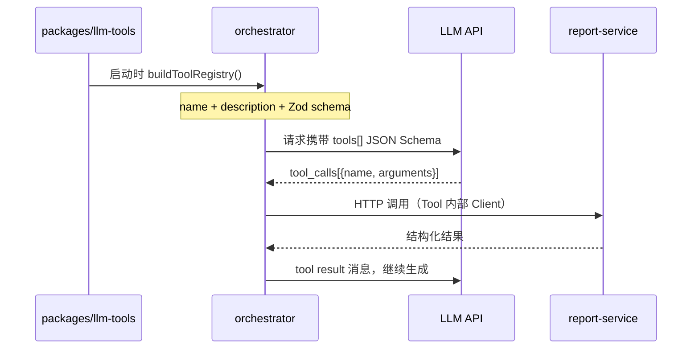
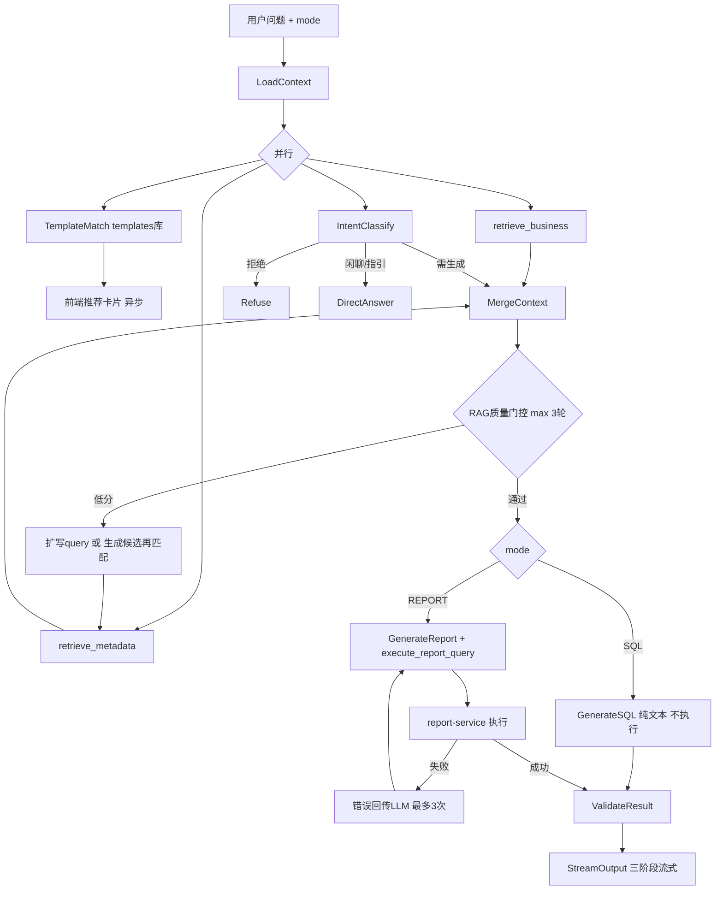

# System architecture design
_Exported on 7/1/2026 at 17:18:38 GMT+8 from Cursor (3.9.16)_

---

**User**

你是一个资深架构师，参考：@docs/PRD_业务需求文档_v1.0.md 
设计一下系统的架构，系统使用的技术栈，参考 @AGENTS.md 
系统需要包括：
- api层，对外提供服务（使用 Apollo GraphQL)
- orm层，关系数据库底层使用mysql
- rag系统
- 报表生成系统，对外提供服务，llm可以调用服务，查询模板、生成报表、报表的数据要能支持sql或者api（和我确认下方案，是提供mcp服务，还是怎么设计比较好）
- 业务层
- llm编排层，需要设计workflow，保证用户问题回答得准确性，eg:
  - 系统prompt，system，要限制系统角色，不能因为用户的引导，随意变更，数据安全要能够限定
  - prompt还需限制llm，防止幻觉，只能根据上下文回答。不能自己编造答案
  - 意图识别（判断是否需要查询知识库，用户问题是否能回答，或是直接llm回答等）
  - 判断是否需要查询rag系统
  - rag系统查询结果评分，是否需要扩写用户问题，或者先大模型生成回答，再用回答匹配，循环生成（要限定次数，跳出条件）
  - bm25 + 向量查询，rrf去topk，topk，要能配置，topk的重新排名。
  - 生成结果的判定
  - 如果要生成报表，调用报表生成系统，如果报错，需要选择报错信息，提供给llm，重新生成。（如果多次生成不成功，需要提示用户友好信息）
  - 结果返回
  - 工作流，需要能打断，能继续
- 前端，admin、监控、user 服务（拆分开，三个服务）
- 但愿测试
- 离线评估系统
帮我设计整体的框架，根据 技术框架，生成.gitignore，README.md
生成系统的整体架构代码。
系统使用docker部署，在 readme.md里需要生成系统部署命令，生成make文件，能一键启动服务
还有帮我拆分任务，输出一个待办，有哪些需要完成的。

---

**Cursor**

先阅读 PRD 与现有仓库结构，再整理整体架构方案并确认报表服务对外形态（MCP 或其它）。


仓库基本是空项目，我继续查阅技术规则与 mockup，以便设计完整架构。


仓库目前是文档与 mockup 为主，尚无应用代码。关于报表生成系统的对外形态，需要先确认你的偏好。


**报表生成系统对接方案确认**

> **LLM 编排层如何调用「报表生成系统」（查模板、生成报表、SQL/API 取数）？推荐方案 A：内部领域服务 + LangChain Tool，同进程低延迟、易做权限/审计/重试；MCP 可作为后续可选适配层供外部 Agent 使用。**
> - A. 内部 ReportService + LangChain Tool（推荐，主路径） ✔
> - B. 独立 HTTP/gRPC 微服务，编排层通过 Client 调用
> - C. MCP Server 作为主要对外接口（LLM 通过 MCP 调报表能力）
> - D. 混合：内部 ReportService 为主 + 可选 MCP 适配层

> **后端部署形态偏好？（三个前端已确认拆分）**
> - A. 模块化单体：一个 API 进程 + packages 分包（推荐首版）
> - B. API 与 Report 拆成两个后端服务
> - C. 完全微服务：API / RAG / Report / Eval 各自独立进程 ✔

已确认：报表走内部 ReportService + LangChain Tool，后端采用完全微服务。正在完善微服务间通信与目录结构设计。


已确认方案，正在生成完整架构与实施计划。


---

**User**

ques:
1. 报表生成系统对接，不提供mcp服务的话，怎么感知对应的tool？怎么知道如何调用？
2. 用户输入问题后，需要根据用户选择生成sql还是报表，走不同流程，workflow，需要查询表的元数据、业务数据、模板（分别保存不同向量表），元数据、业务数据可以作为prompt中的知识，模板，作为给llm的示例。和我确认下整体用户输入后的llm编排怎么设计的。
3. 核心表的设计，输出具体的字段。

---

**Cursor**

这三项会直接影响编排与表结构，我先读现有计划，再逐项补充 Tool 感知、SQL/报表分流 workflow 和核心表字段设计。


**业务数据向量库内容确认**

> **「业务数据」向量库的具体内容指什么？（影响索引 pipeline 与 prompt 组装方式）**
> - A. 业务知识库：指标定义、业务规则、口径说明、FAQ（管理员维护文本）
> - B. 业务数据样本：表内典型值/枚举/分布摘要（从数据源采样同步）
> - C. 两者都要：知识文档 + 数据样本（推荐） ✔

正在把 Tool 感知机制、三分流 workflow 与核心表字段设计写入计划文档。


这三个问题已写入架构计划，下面是精简版说明，便于你确认。

---

## 1. 不用 MCP，LLM 如何感知 Tool？

**Tool 不是“自动发现”的，而是开发者在代码里静态注册，通过 LLM Function Calling 注入。**



| 机制 | 说明 |
|------|------|
| **定义位置** | `packages/llm-tools/src/registry.ts`，每个 Tool 有 `name`、`description`（LLM 据此决定何时调用）、`schema`（Zod → JSON Schema） |
| **注册时机** | orchestrator 启动时注册，**不是** DB 动态加载 |
| **可见性** | LangGraph **按节点绑定 Tool 子集**：`GenerateReportNode` 才有 `execute_report_query`；`GenerateSQLNode` **不绑定**执行类 Tool |
| **与 MCP 关系** | 语义等价于 MCP 的 tool descriptor，只是走 HTTP 而非 MCP 协议；后续可加 MCP Adapter 复用同一套 schema |

**首版 Tool 清单：**

| Tool | 绑定节点 | 用途 |
|------|----------|------|
| `retrieve_metadata` | RagRetrieve | 检索表/字段元数据 |
| `retrieve_business_knowledge` | RagRetrieve | 检索业务知识 + 数据样本 |
| `retrieve_templates` | TemplateMatch / Generate* | 检索模板作 few-shot |
| `execute_report_query` | GenerateReport | 执行 SQL/API 取数 + 图表（**仅报表模式**） |
| `validate_sql` | ValidateResult | 语法/权限/行数预检 |

LLM 靠 **Tool 的 `description` + 当前节点的 System Prompt** 知道何时调用；workflow 图控制**哪些节点**暴露哪些 Tool。

---

## 2. 用户输入后的 LLM 编排（已确认：业务数据 = 知识文档 + 样本）

### 三向量库分工

| 向量库 | 索引内容 | 在 Prompt 中的角色 |
|--------|----------|-------------------|
| **metadata** | 智能查询库表/字段/同义词 | **Grounding** — `<schema_context>`，LLM **只能**引用此处表/字段 |
| **business** | 指标口径、规则、FAQ + 字段枚举/分布样本 | **补充知识** — `<business_knowledge>`，不可替代 schema |
| **templates** | 已入库 SQL/报表模板 | **Few-shot 示例** — `<examples>`，引导格式，字段仍须来自 schema |

### 模式分流原则

- **SQL / 报表模式由用户 Tab 选择**，写入 `WorkflowState.mode`，LLM **不切换模式**
- 意图识别只判断：能否回答 / 需检索 / 拒绝（越权、薪资等）

### 完整流程



### SQL vs 报表关键差异

| 维度 | SQL 模式 | 报表模式 |
|------|----------|----------|
| 输出 | SQL 文本 + 说明 | 图表 + 数据 + 说明 |
| 是否执行 | **否**（PRD：数仓线下校验） | **是** |
| Tools | 无执行类 Tool | `execute_report_query`, `validate_sql` |
| 模板 few-shot | 仅 `sql_templates` | 仅 `report_templates` |

**套用模板**：用户点「套用」→ 跳过 RAG 循环 → 加载模板 → 填参数 → 直接进入 GenerateSQL / GenerateReport。

---

## 3. 核心表字段设计

已在计划中展开，这里是表清单摘要：

### hermes_meta（metadata-service）

| 表 | 核心字段 |
|----|----------|
| `users` | id, username, email, display_name, role_id, status |
| `roles` | id, code, name, description |
| `role_table_permissions` | role_id, table_id, can_query |
| `role_field_permissions` | role_id, field_id, can_query, mask_type |
| `datasources` | name, host, port, database_name, username, password_encrypted, connection_status, last_tested_at, last_synced_at |
| `meta_tables` | datasource_id, physical_name, business_name, description, source, source_status, in_query_library |
| `meta_fields` | table_id, physical_name, business_name, description, data_type, is_sensitive, in_query_library |
| `field_synonyms` | field_id, synonym |
| `business_knowledge` | title, category(glossary/metric/rule/faq), content, vector_id |
| `field_samples` | field_id, sample_type, sample_data(JSON), vector_id |
| `prompt_versions` | role_id(NULL=默认), persona, constraints, version, is_active |
| `sql_templates` | name, scenario_description, sql_body, placeholders(JSON), score, in_library, vector_id |
| `report_templates` | + chart_type, chart_config(JSON) |
| `system_settings` | category, setting_key, setting_value(JSON) |
| `alerts` | type, level, title, message, ref_type, ref_id, status, resolved_* |
| `audit_logs` | actor_id, action, resource_*, before/after_snapshot, trace_id |

### hermes_chat（orchestrator）

| 表 | 核心字段 |
|----|----------|
| `conversations` | user_id, title, mode(sql/report), last_active_at |
| `messages` | conversation_id, role, content, mode, template_id, status, metadata(JSON) |
| `workflow_checkpoints` | conversation_id, run_id, graph_state, status |
| `message_feedback` | message_id, rating(up/down), reason |
| `generation_audit` | user_id, mode, used_template, interrupted, trace_id |

### hermes_eval（eval-service）

| 表 | 核心字段 |
|----|----------|
| `eval_sets` | name, description, is_preset |
| `eval_cases` | question, mode, expected_tables(JSON), expected_points |
| `eval_runs` | status, progress, total_cases, summary(JSON) |
| `eval_results` | retrieval_hit, generate_success, score, actual_output, diff_notes |

---

完整细节已更新到计划文档：[灵析系统架构设计](file:///Users/dezliu/.cursor/plans/灵析系统架构设计_86078467.plan.md)。

如果以上设计没有问题，回复「开始执行」即可进入 Phase 0 脚手架搭建；若需调整（例如 SQL 模式是否也要可选执行预览），告诉我即可继续迭代计划。

---

**User**

开始执行

---

**Cursor**

开始执行 Phase 0：搭建 monorepo 脚手架与基础基础设施。


正在创建 monorepo 根配置与共享包骨架。


计划模式无法写入代码文件，正在切换到 Agent 模式以开始实施。


Shell 可用，正在通过脚本批量搭建完整 monorepo 骨架。


## 完成情况

Phase 0 脚手架已搭建完成，monorepo 可构建、可测试。

### 修改/新增了哪些文件

**根目录**
- `package.json`, `pnpm-workspace.yaml`, `turbo.json`, `tsconfig.base.json`
- `.gitignore`, `.env.example`, `README.md`, `Makefile`
- `docker-compose.yml`, `docker-compose.dev.yml`, `pnpm-lock.yaml`

**后端微服务**（`apps/`）
- `gateway-api` — Apollo GraphQL + `/health`
- `metadata-service`, `orchestrator`, `rag-service`, `report-service`, `eval-service` — Express + health + API stub

**前端**（`apps/`）
- `web-user` (:3001), `web-admin` (:3002, basePath `/admin`), `web-monitor` (:3003, basePath `/monitor`)

**共享包**（`packages/`）
- `shared` — 服务启动工具、类型、常量
- `contracts` — 服务间契约类型
- `llm-tools` — Tool 注册表（5 个 Tool 定义）
- `workflow` — 工作流节点/状态类型
- `orm-schemas` — BaseModel + 表名常量
- `ui-shared` — AppShell 组件

**基础设施**
- `docker/nginx/nginx.conf`, `docker/Dockerfile.service`, `docker/Dockerfile.frontend`
- `docker/mysql/init/01-schemas.sql` — 三 schema 初始化
- `migrations/{meta,chat,eval}/` — Knex 迁移骨架

### 改了什么行为

- 从空仓库变为可运行的 monorepo 骨架
- 6 个后端服务均有 `/health`、`/ready` 端点
- gateway-api 提供 GraphQL 查询 `{ health, version }`
- 三前端可独立构建，展示 Phase 0 占位页

### 做了哪些验证

- `pnpm install` — 成功（347 packages）
- `pnpm build` — **15/15 packages 构建通过**
- `pnpm test` — **14/14 test tasks 通过**

### 如何启动

```bash
# Docker 全栈
cp .env.example .env
make up

# 本地开发（仅 infra + 热重载）
make install
make dev
```

| 服务 | 地址 |
|------|------|
| 用户平台 | http://localhost/ |
| 管理后台 | http://localhost/admin |
| 监控看板 | http://localhost/monitor |
| GraphQL | http://localhost/graphql |

### 后续待办（Phase 1+）

| Phase | 内容 | 状态 |
|-------|------|------|
| **1** | MySQL 完整 migration + 共享中间件（traceId、service auth） | 待开始 |
| **2** | metadata-service ORM + 数据源/元数据/Prompt API + admin 页 | 待开始 |
| **3** | rag-service BM25/Vector/RRF 检索管线 | 待开始 |
| **4** | report-service SQL/API 执行 + 模板匹配 | 待开始 |
| **5** | orchestrator LangGraph 全工作流 + 流式对话 | 待开始 |
| **6-9** | 模板推荐、监控、离线评估、测试/埋点 | 待开始 |

### 假设与风险

- **假设**：本机已安装 Node.js ≥ 20、pnpm（或通过 `npm i -g pnpm` 安装）、Docker
- **未验证**：`make up` Docker 全栈启动（需 Docker 环境；OpenSearch 内存 ≥ 512MB）
- **说明**：当前为骨架代码，业务逻辑在 Phase 1 起逐步实现

如需继续，我可以从 **Phase 1（完整数据库 migration + 中间件）** 或 **Phase 2（metadata-service + admin 数据源管理）** 开始。

