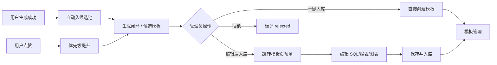
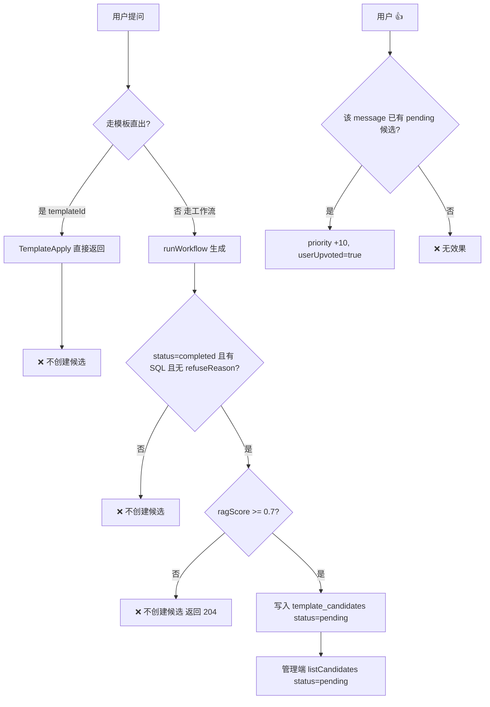

# Template selection functionality
_Exported on 7/3/2026 at 15:28:42 GMT+8 from Cursor (3.9.16)_

---

**User**

帮我确认下当前管理端，是否已经有候选模板选择入库的功能？
比如当用户点赞后，生成的模板，有没有地方，管理员可以编辑，和选择入模板库。
报表和sql的要能区分开。
和我确认下有没有，还有如果没有，再和我探讨下怎么添加这个功能，页面再哪里

---

**Cursor**

正在检索管理端与模板库相关实现，确认是否已有候选模板入库功能。


已发现「生成闭环」相关实现，正在读取管理端页面与导航的完整细节。


## 结论：**已有，但不完整**

管理端已经实现了「候选模板 → 审核入库」的闭环，入口在侧栏 **「生成闭环」**（路由 `/generation-closed-loop`），位于「模板管理」和「系统 Prompt」之间。

---

## 现有能力一览

### 1. 候选从哪里来

| 触发条件 | 行为 |
|---------|------|
| 生成成功 + `ragScore ≥ 0.7` | 自动写入候选池（`template_candidates`） |
| 用户 👍 | 候选 `priority +10`，列表置顶，显示 👍 标记 |
| 用户 👎（失败/中断） | 进入「生成反馈」Tab，不走候选池 |

后端在 orchestrator 生成完成后异步调用 `createCandidate`；点赞时调用 `boostCandidateOnUpvote`。

### 2. 管理端页面结构

**生成闭环** 页有两个 Tab：

**Tab 1 — 候选模板**
- 展示：用户提问、模式（`SQL` / `REPORT` Tag）、RAG 分、点赞、优先级
- 操作：SQL 预览、「创建 draft」、「入库」、「拒绝」
- 入库时按 `mode` 分别写入 `sql_templates` 或 `report_templates`

**Tab 2 — 生成反馈**（失败路径）
- 展示失败原因、用户反馈、SQL 草案
- 操作：**「去处理」** → 跳转 `/templates?tab=sql|report&prefill=...` 预填编辑表单

### 3. SQL / 报表区分

- 候选列表有 **模式** 列（`SQL` / `REPORT` Tag）
- 入库时后端按 `mode` 分别创建 SQL 模板或报表模板（含 `chartType` / `chartConfig`）
- **模板管理** 页本身也是 SQL / 报表两个 Tab

---

## 缺口（和你关心的「编辑后再入库」）

| 能力 | 候选模板 Tab | 生成反馈 Tab |
|------|-------------|-------------|
| 列表展示 | ✅ | ✅ |
| SQL / 报表区分 | ✅（Tag） | ✅ |
| 一键入库 | ✅ | — |
| **入库前编辑** | ❌ | ✅（「去处理」深链） |
| 编辑名称 / SQL / 场景 / 图表 | ❌ | ✅（模板页 Drawer） |

具体不足：

1. **候选 Tab 没有「编辑后入库」** — 只有一键「创建 draft」/「入库」，名称固定取 `userQuery` 前 64 字，SQL 等字段不可改。
2. **「去处理」深链只给了失败反馈**，成功候选没有同等能力。
3. **入库后若要改**，需去 **模板管理** 手动编辑；或先「创建 draft」再过去改。
4. **只展示 `pending`**，已批准/已拒绝的历史看不到。

---

## 若补全「编辑 + 选择入库」，建议方案

改动集中在 **`apps/web-admin/app/generation-closed-loop/page.tsx`**，后端 API 基本够用（`approveCandidate` 已支持 `name`、`inLibrary`）。

### 方案 A（推荐，改动最小）

在候选 Tab 增加 **「编辑后入库」** 按钮，复用模板页的 prefill 机制（与反馈 Tab 的 `handleProcessFeedback` 同模式）：

```typescript
// 类似 feedback 的 handleProcessFeedback
router.push(`/templates?tab=${row.mode}&prefill=${encodePrefill({
  name: row.userQuery.slice(0, 64),
  scenarioDescription: row.scenarioDescription,
  sqlBody: row.sqlBody,
  chartType: row.chartType,
  chartConfig: row.chartConfig,
  sourceCandidateId: row.id,  // 新增：保存后自动 approve + resolve
})}`);
```

模板页保存成功后，若有 `sourceCandidateId`，调用 `approveCandidate` 并标记候选为 approved。

**优点**：复用现有模板编辑 Drawer（名称、SQL、场景、图表、收入库开关），SQL/报表 Tab 天然分开。  
**改动面**：`generation-closed-loop/page.tsx` + `templates/page.tsx`（约 30–50 行）。

### 方案 B（候选页内嵌编辑）

在候选 Tab 加 Drawer，字段：名称、场景描述、SQL、图表类型（report 模式）、是否直接入库。  
保存时调 `approveCandidate({ name, inLibrary, ... })`。

**优点**：不离开当前页。  
**缺点**：与模板页表单重复，后续维护两套 UI。

### 方案 C（增强列表）

- 候选 Tab 加 **SQL / 报表** 筛选（或子 Tab）
- 增加 **已处理 / 已拒绝** 历史视图
- 可选：`PATCH /v1/template-candidates/:id` 支持仅编辑 pending 候选（不入库）

---

## 建议的管理员工作流（补全后）



---

## 总结

| 问题 | 答案 |
|------|------|
| 有没有候选入库功能？ | **有**，在 **生成闭环** 页 |
| 点赞后的模板能管理吗？ | **能看、能入库/拒绝**；**不能在入库前编辑** |
| SQL / 报表能区分吗？ | **能**（模式 Tag + 分别入库） |
| 编辑能力在哪？ | **失败反馈**有「去处理」；**成功候选**缺同等能力 |

如果你希望推进，我建议先做 **方案 A**（候选 Tab 加「编辑后入库」深链），成本最低且与现有反馈流程一致。需要的话我可以直接实现这一块。

---

**User**

先帮我实现方案A，还有现在管理端没有生成闭环 页，确认下为什么，帮我实现出来

---

**Cursor**

先排查管理端为何看不到「生成闭环」页，再实现方案 A 的「编辑后入库」深链。


构建已通过，路由存在。可能因 Docker 未重建或首页未展示入口。开始实现方案 A，并完善首页入口与后端 approve 扩展。


将 `ADMIN_NAV` 抽到独立文件，修复服务端组件导入客户端模块的问题。


## 完成情况

### 为什么你看不到「生成闭环」页？

代码其实**已经在 main 分支**（commit `542f3a9`），构建也包含该路由。你看不到，常见原因有：

1. **Docker 镜像是旧的** — `docker-compose` 不会自动重建前端，需要：
   ```bash
   docker compose build web-admin && docker compose up -d web-admin nginx
   ```
2. **访问路径要带 basePath** — 管理端 basePath 是 `/admin`，正确地址是：
   - `http://localhost/admin/generation-closed-loop`
   - 不是 `/generation-closed-loop`
3. **首页入口过时** — 之前首页只展示了 4 个旧卡片（数据源/元数据/Prompt/检索），**没有「生成闭环」**，容易误以为功能不存在。侧栏其实一直有，但不够显眼。

---

### 本次实现（方案 A + 入口修复）

| 文件 | 改动 |
|------|------|
| `apps/web-admin/app/generation-closed-loop/page.tsx` | 候选 Tab 新增 **「编辑后入库」** 按钮，深链跳转模板页 |
| `apps/web-admin/app/templates/page.tsx` | 支持 `sourceCandidateId` 预填；保存时调用 `approveCandidate` 完成编辑+入库 |
| `apps/web-admin/lib/prefill.ts` | 抽取 prefill 编解码工具 |
| `apps/web-admin/lib/admin-nav.ts` | 统一导航配置（侧栏 + 首页共用） |
| `apps/web-admin/app/page.tsx` | 首页展示全部 9 个管理入口，含「生成闭环」 |
| `apps/web-admin/lib/api.ts` | `approveCandidate` 支持更多编辑字段 |
| `apps/metadata-service/.../closed-loop-service.ts` | 后端 approve 支持覆盖 name/SQL/场景/图表/状态 |

---

### 新的管理员工作流

**候选模板 Tab：**
- **编辑后入库** → 跳转 `/templates?tab=sql|report&prefill=...` → 在 Drawer 里编辑名称/SQL/场景/图表/是否入库 → 保存即 approve
- **一键入库** / **创建 draft** — 保留原有快捷操作
- **拒绝** — 不变

**SQL / 报表区分：** 深链自动带 `tab=sql` 或 `tab=report`，报表模式会预填 `chartType` / `chartConfig`。

---

### 验证

- `pnpm --filter web-admin test` — 2 passed
- `pnpm --filter web-admin build` — 成功，含 `/generation-closed-loop` 路由

---

### 使用方式

1. 重建并启动 web-admin（若用 Docker）
2. 打开 `http://localhost/admin`
3. 侧栏点击 **「生成闭环」**，或首页卡片进入
4. 在候选列表点 **「编辑后入库」** 完成审核

若页面能打开但列表加载失败，可能是浏览器访问 `metadata-service`（默认 `localhost:4050`）的网络问题，需要确认 `NEXT_PUBLIC_METADATA_URL` 配置。需要的话我可以继续帮你排查 API 连通性。

---

**User**

生成闭环现在的候选逻辑是什么，我现在在用户界面，点赞结果，但是列表是空的。

---

**Cursor**

正在梳理候选模板的完整入池逻辑，并排查点赞后列表为空的原因。


## 当前候选逻辑（完整链路）

候选模板**不是点赞创建的**，而是**生成完成时**由 orchestrator 异步写入 metadata-service。点赞只影响**已有候选**的排序。



---

### 1. 入池条件（生成时，必须全部满足）

代码在 `chat-service.ts`：

```212:230:apps/orchestrator/src/services/chat-service.ts
      if (
        assistantStatus === 'completed' &&
        finalState.generatedSql &&
        !finalState.refuseReason &&
        this.opts.closedLoop
      ) {
        void this.opts.closedLoop.createCandidate({
          sourceMessageId: messageId,
          conversationId,
          mode: input.mode,
          userQuery: input.query,
          sqlBody: finalState.generatedSql,
          // ...
          ragScore: finalState.ragScore,
        });
      }
```

metadata-service 侧还有一道门槛：

```106:107:apps/metadata-service/src/services/closed-loop-service.ts
    const threshold = DEFAULT_CANDIDATE_RAG_THRESHOLD;
    if ((input.ragScore ?? 0) < threshold) return null;
```

`DEFAULT_CANDIDATE_RAG_THRESHOLD = 0.7`

| 条件 | 说明 |
|------|------|
| `status === 'completed'` | 失败/中断不算 |
| 有 `generatedSql` | 无 SQL 不入池 |
| 无 `refuseReason` | 被拒绝的不入池 |
| `ragScore >= 0.7` | **硬门槛** |
| 非模板直出 | 走 `TemplateApply` 的路径**不会**调 `createCandidate` |

---

### 2. 点赞做什么（不创建候选）

```27:28:apps/orchestrator/src/services/feedback-service.ts
    if (req.rating === 'up' && message.status === 'completed') {
      void this.closedLoop?.boostCandidate(req.messageId);
```

```128:136:apps/metadata-service/src/services/closed-loop-service.ts
  async boostCandidateOnUpvote(messageId: string, traceId?: string) {
    const row = await this.repo.findCandidateByMessageId(messageId);
    if (!row || row.status !== 'pending') return null;
    const updated = await this.repo.patchCandidate(row.id, {
      userUpvoted: true,
      priority: row.priority + UPVOTE_PRIORITY_BOOST, // +10
    });
```

要点：
- 只对 **`status=completed`** 的消息生效
- 只更新**已存在**的 pending 候选
- **不会**因点赞新建候选

---

### 3. 管理端列表展示什么

```40:44:apps/web-admin/app/generation-closed-loop/page.tsx
      const [cand, fb] = await Promise.all([
        closedLoopApi.listCandidates('pending'),
        closedLoopApi.listFeedback('open'),
      ]);
```

只显示 `status=pending` 的候选；已批准/已拒绝不会出现。

---

## 你点赞了但列表为空 — 最可能的原因

### 原因 1：`ragScore < 0.7`（最常见）

工作流允许生成的门槛是 **0.35**（或有 schema 时放宽到 **0.25**），但候选池门槛是 **0.7**，存在明显 gap：

- 生成成功 + 用户满意 + 点赞 ✅  
- `ragScore` 比如 0.45 ❌ → **从未入池**，点赞无效

可在用户消息的 `metadata.ragScore` 里确认（chat-service 会写入）。

---

### 原因 2：走了模板直出，没走工作流

若请求带了 `templateId`（命中已有模板），会走 `TemplateApply` 并提前 `return`，**不会**调用 `createCandidate`。这种结果可以点赞，但不会产生新候选。

metadata 里会有 `appliedTemplate: true`。

---

### 原因 3：迁移未跑 / 服务未连通

- `template_candidates` 表在 **meta DB**（迁移 `20260702000001_template_candidates.ts`）
- orchestrator → metadata 的 `createCandidate` 是 **fire-and-forget**，失败会静默吞掉（client 里 `catch` 返回 null）
- 若表不存在或 metadata-service 不可达，候选不会写入，管理端可能仍显示空列表（或 API 报错）

---

### 原因 4：管理端 API 连不上

管理端浏览器直连 `http://localhost:4050`（`NEXT_PUBLIC_METADATA_URL`）。Docker 全栈环境下，若未配置该环境变量，浏览器可能连不到 metadata-service。此时通常会弹出「加载失败」，而不是静默空列表——若完全无报错且列表为空，更可能是库里确实没有 pending 记录。

---

## 建议排查步骤

**1. 看该条消息的 ragScore**

在 chat DB 查最近点赞消息的 metadata，或在前端网络面板看生成完成时 SSE/GraphQL 返回的 `metadata.ragScore`。

**2. 直接查候选表**

```sql
-- meta DB
SELECT id, source_message_id, mode, rag_score, user_upvoted, priority, status, created_at
FROM template_candidates
ORDER BY created_at DESC
LIMIT 20;
```

**3. 查 orchestrator 日志**

搜索：
- `closed_loop.candidate.created` — 入池成功
- 无日志 + ragScore < 0.7 — 被阈值挡掉

**4. 确认迁移**

```bash
just migrate   # 或项目里对应的 migrate 命令
```

meta 和 chat 库都要有 `20260702000001` 相关迁移。

**5. 手动验证 API**

```bash
curl -H "x-service-token: hermes-dev-service-token" \
  "http://localhost:4050/v1/template-candidates?status=pending"
```

---

## 产品设计上的 gap

当前实现与直觉有偏差：

| 用户预期 | 实际行为 |
|---------|---------|
| 点赞 → 进入候选池 | 点赞只提升**已有**候选的优先级 |
| 生成成功 → 入池 | 还需 **ragScore ≥ 0.7** |
| 模板直出结果 | **不入池** |

若希望「点赞即入池」，需要改逻辑，例如：
- 点赞时若无候选，则根据 message metadata 补建候选（可不要求 0.7）
- 或把入池阈值从 0.7 降到与工作流一致（如 0.35）
- 模板直出成功 + 点赞也写入候选

---

你可以先告诉我：你点赞的那条结果，是**全新 LLM 生成**还是**命中已有模板**？如果方便，也可以贴一下该消息对应的 `ragScore`，我可以帮你判断是不是阈值问题。若要改逻辑（点赞补建候选、降低阈值等），需要切换到 Agent 模式我来改代码。

---

**User**

把入池阈值从 0.7 降到与工作流一致，另外，如果已有相似模板，就不要再推送到候选中。

---

**Cursor**

先梳理工作流阈值与模板匹配逻辑，再改入池条件并加上相似模板去重。


正在实现：在 orchestrator 侧用工作流同款 RAG 判定与模板匹配去重，并同步 metadata-service 的入池阈值。


## 完成情况

### 修改了哪些文件

- `packages/workflow/src/index.ts` — 导出 `isRagScoreAcceptable`
- `apps/orchestrator/src/lib/candidate-eligibility.ts` — 新增入池判定（RAG + 相似模板）
- `apps/orchestrator/src/lib/candidate-eligibility.test.ts` — 单元测试
- `apps/orchestrator/src/services/chat-service.ts` — 生成完成后调用新判定
- `apps/orchestrator/src/lib/metadata-closed-loop-client.ts` — 传递 `schemaContextCount`
- `apps/metadata-service/src/services/closed-loop-service.ts` — 阈值改为与工作流一致
- `apps/metadata-service/src/services/closed-loop-service.test.ts` — 单元测试

### 改了什么行为

**1. 入池 RAG 阈值：0.7 → 与工作流一致**

| 条件 | 是否入池 |
|------|---------|
| `ragScore >= 0.35` | ✅ |
| `ragScore >= 0.25` 且有 schema 上下文 | ✅ |
| `ragScore < 0.25`，或 `< 0.35` 且无 schema | ❌ |

**2. 已有相似模板则不入池**

工作流在 `TemplateMatch` 节点会用 **0.72** 阈值匹配库内 active 模板。若 `templateMatches.length > 0`，说明已有相似模板，**不再**写入候选池。

**3. 点赞逻辑不变**

点赞仍只提升已有候选的优先级，不会新建候选。

### 新的入池流程

```
生成成功 + 有 SQL
  → RAG 分达工作流门槛？
     否 → 不入池
     是 → 库内已匹配相似模板（score ≥ 0.72）？
           是 → 不入池
           否 → 写入 template_candidates
```

### 做了哪些验证

- `pnpm --filter @hermes/orchestrator test` — 17 passed（含 4 个 candidate-eligibility 测试）
- `pnpm --filter @hermes/metadata-service test` — 20 passed（含 4 个 closed-loop 测试）

### 使用说明

需要**重启 orchestrator 和 metadata-service** 后生效。之前因 `ragScore < 0.7` 被挡掉的生成，不会自动补入池；需要用户**重新提问生成**，或你在管理端手动建模板。

若重启后仍为空，可在浏览器 Network 里看 `GET /v1/template-candidates?status=pending` 是否报错，或查 meta DB 的 `template_candidates` 表。

---

**User**

怎么重启 orchestrator 和 metadata-service

---

**Cursor**

正在查看项目中 orchestrator 与 metadata-service 的启动方式。


---

**User**

帮我 commit & push 到 origin & gitee main branch

---

**Cursor**

正在查看 git 状态与远程配置，随后提交并推送到 origin 与 gitee 的 main 分支。


正在暂存相关文件（排除 `__pycache__`），提交并推送到 origin 与 gitee。


## 已完成

**Commit:** `b71809f`

```
feat(closed-loop): align candidate pool with workflow and improve admin intake

Lower candidate RAG threshold to match workflow gates, skip pool entries when
a similar in-library template already matched, and add edit-before-approve
flow in the admin closed-loop UI. Also improve schema grounding with column
types and INTERVAL WEEK handling.
```

**推送结果：**
- `origin` (GitHub) `main` — 成功 `ffc830a..b71809f`
- `gitee` `main` — 成功 `ffc830a..b71809f`

**未纳入提交：** `scripts/__pycache__/`（Python 缓存，已忽略）

本地 `main` 已与 `origin/main` 同步。若用 Docker 跑服务，记得重建 orchestrator 和 metadata-service 使改动生效。

