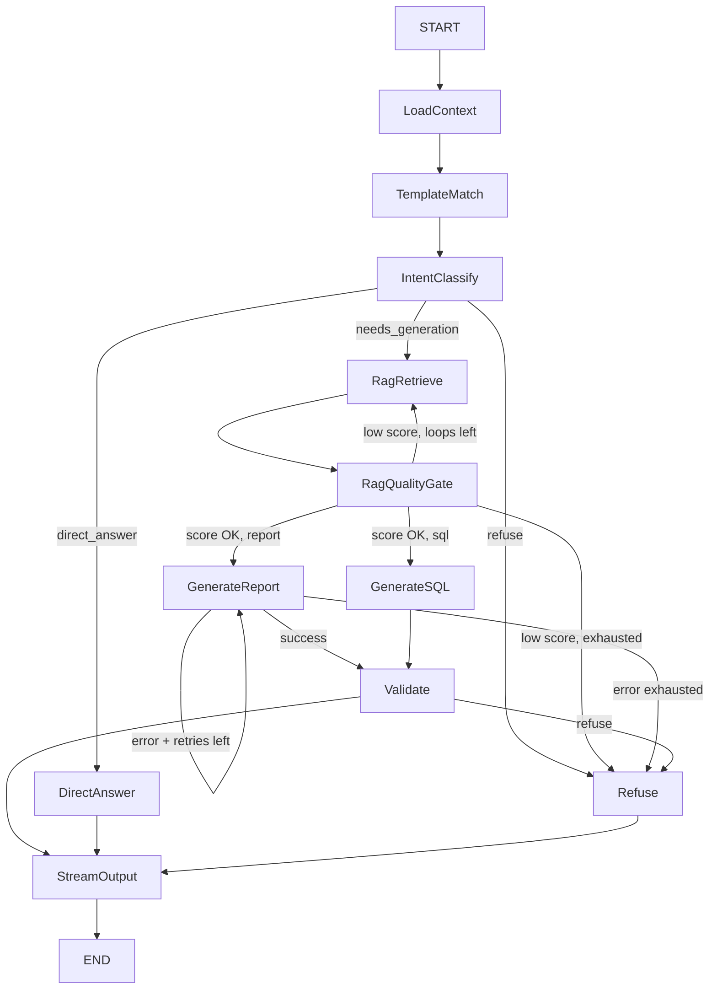

# Explore workflow pipeline

- **ID**: `7d23ce25-0c80-4154-b87b-e80f471ec346`
- **创建时间**: 2026-07-02 14:27
- **模式**: chat
- **Agentic**: False

---

## 用户

Explore the nl-hermes codebase at /Users/dezliu/Documents/mine/repo/nl-hermes to find the main user query workflow/pipeline. Look for:
- Intent classification (chat/SQL/report)
- Security guards (sensitive words, SQL injection)
- Permission injection by User_ID
- RAG retrieval with HyDE, query rewriting
- LLM generation, SQL linter, validation loops
- User confirmation, execution tools
- Post-processing and quality checks/hallucination detection
Return: file paths, current flow steps implemented vs missing, loop limits, thresholds.

## 助手

正在探索 nl-hermes 代码库中的用户查询主流程，先从架构入口与关键模块入手。

<details>
<summary>Tool: update_current_step</summary>

```json
{
  "rawArgs": "{\"currentStep\":\"Exploring user query pipeline\"}",
  "status": "completed"
}
```
</details>

<details>
<summary>Tool: mcp-codegraph-codegraph_explore</summary>

```json
{
  "rawArgs": "{\"name\":\"user-codegraph-codegraph_explore\",\"args\":{\"query\":\"main user query workflow pipeline intent classification chat SQL report security guards sensitive words SQL injection permission User_ID RAG HyDE query rewriting LLM SQL linter validation loops user confirmation execution hallucination detection\"},\"toolCallId\":\"tool_55eca9f4-7223-46b4-8b9e-883d8ee1acf\",\"providerIdentifier\":\"codegraph\",\"toolName\":\"codegraph_explore\",\"smartModeApprovalOnly\":false,\"skipApproval\":true}",
  "params": "{\"tools\":[{\"name\":\"codegraph_explore\",\"parameters\":\"{\\\"query\\\":\\\"main user query workflow pipeline intent classification chat SQL report security guards sensitive words SQL injection permission User_ID RAG HyDE query rewriting LLM SQL linter validation loops user confirmation execution hallucination detection\\\"}\",\"serverName\":\"codegraph\"}]}",
  "result": "{\"result\":\"{\\\"content\\\":[{\\\"type\\\":\\\"text\\\",\\\"text\\\":\\\"Error: Tool execution failed: No CodeGraph project is loaded for this session.\\\\nSearched for a .codegraph/ directory starting from: /Users/dezliu/Documents/mine/repo/nl-hermes\\\\nThe index is likely fine — this is a working-directory detection issue: the MCP client launched the server outside your project and didn't report the workspace root. Fix it either way:\\\\n  • Pass projectPath to the tool call, e.g. projectPath: \\\\\\\"/absolute/path/to/your/project\\\\\\\"\\\\n  • Or add --path to the server's MCP config args: [\\\\\\\"serve\\\\\\\", \\\\\\\"--mcp\\\\\\\", \\\\\\\"--path\\\\\\\", \\\\\\\"/absolute/path/to/your/project\\\\\\\"]\\\"}]}\"}",
  "status": "completed"
}
```
</details>

<details>
<summary>Tool: glob_file_search</summary>

```json
{
  "rawArgs": "{\"targetDirectory\":\"/Users/dezliu/Documents/mine/repo/nl-hermes\",\"globPattern\":\"**/*.{ts,tsx,js}\"}",
  "params": "{\"targetDirectory\":\"/Users/dezliu/Documents/mine/repo/nl-hermes\",\"globPattern\":\"**/*.{ts,tsx,js}\"}",
  "result": "{\"directories\":[{\"absPath\":\"/Users/dezliu/Documents/mine/repo/nl-hermes\",\"files\":[{\"relPath\":\"packages/shared/src/auth.test.ts\"},{\"relPath\":\"apps/metadata-service/src/repositories/alert-repository.ts\"},{\"relPath\":\"apps/gateway-api/src/index.ts\"},{\"relPath\":\"apps/rag-service/src/services/index-pipeline.ts\"},{\"relPath\":\"apps/orchestrator/src/services/template-apply-service.ts\"},{\"relPath\":\"apps/web-user/app/page.test.ts\"},{\"relPath\":\"packages/contracts/src/index.ts\"},{\"relPath\":\"packages/shared/src/logger.test.ts\"},{\"relPath\":\"apps/report-service/src/lib/sql-utils.ts\"},{\"relPath\":\"packages/orm-schemas/src/base-model.ts\"},{\"relPath\":\"packages/observability/src/performance-timer.ts\"},{\"relPath\":\"packages/workflow/src/graph.ts\"},{\"relPath\":\"packages/orm-schemas/src/models/eval-case.ts\"},{\"relPath\":\"packages/shared/src/logger.ts\"},{\"relPath\":\"apps/eval-service/src/services/eval-case-runner.ts\"},{\"relPath\":\"packages/shared/src/index.ts\"},{\"relPath\":\"apps/orchestrator/src/lib/metadata-template-client.ts\"},{\"relPath\":\"packages/observability/src/sanitize-prompt.ts\"},{\"relPath\":\"apps/report-service/src/app.ts\"},{\"relPath\":\"packages/orm-schemas/src/models/workflow-checkpoint.ts\"},{\"relPath\":\"packages/shared/src/trace.ts\"},{\"relPath\":\"packages/shared/src/middleware.ts\"},{\"relPath\":\"apps/eval-service/src/index.test.ts\"},{\"relPath\":\"apps/metadata-service/src/lib/metrics-store.test.ts\"},{\"relPath\":\"apps/web-admin/app/prompts/page.tsx\"},{\"relPath\":\"apps/metadata-service/src/services/prompt-service.ts\"},{\"relPath\":\"packages/llm-tools/src/llm/factory.ts\"},{\"relPath\":\"packages/workflow/src/types.ts\"},{\"relPath\":\"packages/observability/src/performance-budgets.ts\"},{\"relPath\":\"packages/report-mcp-adapter/src/server.ts\"},{\"relPath\":\"migrations/eval/migrations/20260701000001_init.ts\"},{\"relPath\":\"apps/metadata-service/src/routes/monitor-routes.test.ts\"},{\"relPath\":\"packages/report-mcp-adapter/src/report-client.ts\"},{\"relPath\":\"apps/metadata-service/src/index.test.ts\"},{\"relPath\":\"apps/report-service/src/index.test.ts\"},{\"relPath\":\"apps/eval-service/src/services/eval-case-runner.test.ts\"},{\"relPath\":\"packages/orm-schemas/src/models/message-feedback.ts\"},{\"relPath\":\"packages/orm-schemas/src/models/report-template.ts\"},{\"relPath\":\"packages/report-mcp-adapter/src/mcp-handler.test.ts\"},{\"relPath\":\"packages/observability/src/index.ts\"},{\"relPath\":\"packages/contract-tests/vitest.config.ts\"},{\"relPath\":\"apps/report-service/src/index.ts\"},{\"relPath\":\"packages/orm-schemas/src/index.ts\"},{\"relPath\":\"apps/orchestrator/src/services/feedback-service.ts\"},{\"relPath\":\"packages/contract-tests/src/report.contract.test.ts\"},{\"relPath\":\"apps/web-admin/app/datasources/page.tsx\"},{\"relPath\":\"packages/shared/src/redact.ts\"},{\"relPath\":\"packages/orm-schemas/src/models/meta-table.ts\"},{\"relPath\":\"apps/report-service/src/lib/sql-utils.test.ts\"},{\"relPath\":\"apps/rag-service/src/services/retrieve-service.ts\"},{\"relPath\":\"migrations/eval/knexfile.ts\"},{\"relPath\":\"apps/web-admin/app/metadata/page.tsx\"},{\"relPath\":\"apps/metadata-service/src/services/datasource-service.ts\"},{\"relPath\":\"apps/metadata-service/src/lib/metrics-store.ts\"},{\"relPath\":\"packages/llm-tools/src/llm/config.test.ts\"},{\"relPath\":\"migrations/meta/migrations/20260701000001_init.ts\"},{\"relPath\":\"apps/orchestrator/src/app.ts\"},{\"relPath\":\"packages/llm-tools/src/llm/openai-compatible-client.ts\"},{\"relPath\":\"apps/rag-service/src/lib/opensearch.ts\"},{\"relPath\":\"packages/report-mcp-adapter/src/index.ts\"},{\"relPath\":\"apps/orchestrator/src/lib/template-utils.ts\"},{\"relPath\":\"migrations/chat/migrations/20260701000001_init.ts\"},{\"relPath\":\"migrations/chat/knexfile.ts\"},{\"relPath\":\"apps/rag-service/src/services/fusion.ts\"},{\"relPath\":\"packages/workflow/src/nodes-constants.ts\"},{\"relPath\":\"apps/rag-service/src/routes/index.ts\"},{\"relPath\":\"packages/llm-tools/src/clients.ts\"},{\"relPath\":\"packages/shared/src/cors.test.ts\"},{\"relPath\":\"packages/orm-schemas/src/eval-db.ts\"},{\"relPath\":\"apps/web-user/app/page.tsx\"},{\"relPath\":\"apps/orchestrator/src/services/chat-service.ts\"},{\"relPath\":\"packages/orm-schemas/src/chat-db.ts\"},{\"relPath\":\"packages/performance/vitest.config.ts\"},{\"relPath\":\"packages/observability/src/sanitize-prompt.test.ts\"},{\"relPath\":\"packages/contract-tests/src/helpers/contract-assertions.ts\"},{\"relPath\":\"apps/report-service/src/services/api-fetcher.ts\"},{\"relPath\":\"packages/orm-schemas/src/models/conversation.ts\"},{\"relPath\":\"apps/orchestrator/src/services/template-apply-service.test.ts\"},{\"relPath\":\"packages/orm-schemas/src/models/role.ts\"},{\"relPath\":\"packages/llm-tools/src/llm/types.ts\"},{\"relPath\":\"packages/llm-tools/src/index.ts\"},{\"relPath\":\"apps/metadata-service/src/lib/chat-metrics-client.ts\"},{\"relPath\":\"apps/eval-service/src/services/eval-set-service.ts\"},{\"relPath\":\"packages/orm-schemas/src/models/field-synonym.ts\"},{\"relPath\":\"apps/web-admin/components/AdminLayout.tsx\"},{\"relPath\":\"apps/metadata-service/src/services/template-service.ts\"},{\"relPath\":\"packages/orm-schemas/src/models/audit-log.ts\"},{\"relPath\":\"apps/orchestrator/src/index.test.ts\"},{\"relPath\":\"apps/metadata-service/src/app.ts\"},{\"relPath\":\"apps/web-admin/next-env.d.ts\"},{\"relPath\":\"packages/shared/src/server.test.ts\"},{\"relPath\":\"packages/observability/src/langfuse-client.ts\"},{\"relPath\":\"packages/orm-schemas/src/models/index.ts\"},{\"relPath\":\"packages/contract-tests/src/eval.contract.test.ts\"},{\"relPath\":\"packages/llm-tools/src/llm/mock-provider.ts\"},{\"relPath\":\"apps/orchestrator/src/services/template-recommendation-service.ts\"},{\"relPath\":\"apps/orchestrator/src/services/conversation-service.test.ts\"},{\"relPath\":\"packages/llm-tools/src/llm/factory.test.ts\"},{\"relPath\":\"apps/web-admin/app/page.tsx\"},{\"relPath\":\"packages/contract-tests/src/rag.contract.test.ts\"},{\"relPath\":\"apps/eval-service/src/routes/index.ts\"},{\"relPath\":\"apps/metadata-service/src/index.ts\"},{\"relPath\":\"apps/metadata-service/src/routes/monitor-routes.ts\"},{\"relPath\":\"packages/orm-schemas/src/db.ts\"},{\"relPath\":\"packages/observability/src/performance-budgets.test.ts\"},{\"relPath\":\"apps/orchestrator/src/routes/index.ts\"},{\"relPath\":\"apps/rag-service/src/lib/qdrant.ts\"},{\"relPath\":\"packages/orm-schemas/src/models/message.ts\"},{\"relPath\":\"apps/web-admin/app/layout.tsx\"},{\"relPath\":\"packages/observability/src/langfuse-client.test.ts\"},{\"relPath\":\"packages/llm-tools/src/tools.ts\"},{\"relPath\":\"apps/web-monitor/next-env.d.ts\"},{\"relPath\":\"scripts/migrate.ts\"},{\"relPath\":\"apps/metadata-service/src/services/alert-service.ts\"},{\"relPath\":\"migrations/meta/knexfile.ts\"},{\"relPath\":\"packages/contract-tests/src/workflow.contract.test.ts\"},{\"relPath\":\"apps/eval-service/src/index.ts\"},{\"relPath\":\"packages/orm-schemas/src/models/meta-field.ts\"},{\"relPath\":\"packages/shared/src/cors.ts\"},{\"relPath\":\"packages/orm-schemas/src/models/eval-result.ts\"},{\"relPath\":\"apps/rag-service/src/index.test.ts\"},{\"relPath\":\"packages/ui-shared/src/index.ts\"},{\"relPath\":\"apps/gateway-api/src/index.test.ts\"},{\"relPath\":\"packages/orm-schemas/src/models/sql-template.ts\"},{\"relPath\":\"packages/performance/src/first-token.test.ts\"},{\"relPath\":\"packages/orm-schemas/src/schemas.ts\"},{\"relPath\":\"apps/metadata-service/src/routes/index.ts\"},{\"relPath\":\"apps/web-monitor/app/lib/api.ts\"},{\"relPath\":\"packages/workflow/src/graph.test.ts\"},{\"relPath\":\"packages/workflow/src/checkpoint.ts\"},{\"relPath\":\"apps/web-user/next-env.d.ts\"},{\"relPath\":\"apps/web-admin/app/search-test/page.tsx\"},{\"relPath\":\"packages/shared/src/constants.ts\"},{\"relPath\":\"packages/orm-schemas/src/models/alert.ts\"},{\"relPath\":\"apps/report-service/src/routes/index.ts\"},{\"relPath\":\"apps/orchestrator/src/index.ts\"},{\"relPath\":\"apps/rag-service/src/index.ts\"},{\"relPath\":\"packages/orm-schemas/src/models/eval-run.ts\"},{\"relPath\":\"packages/shared/src/load-env.ts\"},{\"relPath\":\"packages/contract-tests/src/metadata.contract.test.ts\"},{\"relPath\":\"apps/web-user/app/chat-utils.ts\"},{\"relPath\":\"packages/llm-tools/src/llm/openai-style-provider.ts\"},{\"relPath\":\"packages/workflow/src/llm.ts\"},{\"relPath\":\"packages/llm-tools/src/registry.ts\"},{\"relPath\":\"apps/metadata-service/src/services/settings-service.ts\"},{\"relPath\":\"apps/web-user/app/layout.tsx\"},{\"relPath\":\"apps/web-monitor/app/layout.tsx\"},{\"relPath\":\"apps/eval-service/src/repositories/eval-repository.ts\"},{\"relPath\":\"apps/report-service/src/services/report-service.ts\"},{\"relPath\":\"apps/web-admin/lib/api.ts\"},{\"relPath\":\"packages/performance/src/rag-latency.test.ts\"},{\"relPath\":\"apps/web-admin/app/page.test.ts\"},{\"relPath\":\"apps/report-service/src/lib/embedding.ts\"},{\"relPath\":\"apps/metadata-service/src/services/datasource-app-service.ts\"},{\"relPath\":\"packages/report-mcp-adapter/src/mcp-handler.ts\"},{\"relPath\":\"packages/llm-tools/src/llm/config.ts\"},{\"relPath\":\"migrations/_shared/schema-helpers.ts\"},{\"relPath\":\"packages/ui-shared/src/app-shell.tsx\"},{\"relPath\":\"apps/orchestrator/src/lib/redis.ts\"},{\"relPath\":\"apps/orchestrator/src/repositories/chat-repository.ts\"},{\"relPath\":\"apps/metadata-service/src/lib/crypto.test.ts\"},{\"relPath\":\"packages/orm-schemas/src/models/datasource.ts\"},{\"relPath\":\"packages/orm-schemas/src/models/eval-set.ts\"},{\"relPath\":\"apps/metadata-service/src/lib/crypto.ts\"},{\"relPath\":\"apps/eval-service/src/services/eval-run-service.ts\"},{\"relPath\":\"apps/web-monitor/app/page.tsx\"},{\"relPath\":\"apps/rag-service/src/lib/embedding.ts\"},{\"relPath\":\"packages/workflow/src/state.ts\"},{\"relPath\":\"apps/report-service/src/services/sql-executor.ts\"},{\"relPath\":\"packages/llm-tools/src/registry.test.ts\"},{\"relPath\":\"apps/report-service/src/services/template-matcher.ts\"},{\"relPath\":\"packages/performance/src/eval-throughput.test.ts\"},{\"relPath\":\"apps/orchestrator/src/routes/user-features.ts\"},{\"relPath\":\"packages/shared/src/trace.test.ts\"},{\"relPath\":\"packages/report-mcp-adapter/vitest.config.ts\"},{\"relPath\":\"packages/workflow/src/index.ts\"},{\"relPath\":\"apps/web-monitor/app/page.test.ts\"},{\"relPath\":\"packages/orm-schemas/src/models/prompt-version.ts\"},{\"relPath\":\"packages/observability/vitest.config.ts\"},{\"relPath\":\"packages/shared/src/types.ts\"},{\"relPath\":\"apps/rag-service/src/app.ts\"},{\"relPath\":\"apps/web-admin/app/alerts/page.tsx\"},{\"relPath\":\"packages/workflow/src/nodes.ts\"},{\"relPath\":\"apps/metadata-service/src/services/meta-service.ts\"},{\"relPath\":\"packages/shared/src/server.ts\"},{\"relPath\":\"apps/rag-service/src/routes.test.ts\"},{\"relPath\":\"apps/eval-service/src/app.ts\"},{\"relPath\":\"apps/web-monitor/middleware.ts\"},{\"relPath\":\"apps/orchestrator/src/services/feedback-service.test.ts\"},{\"relPath\":\"apps/eval-service/src/services/eval-case-runner.test-utils.ts\"},{\"relPath\":\"apps/metadata-service/src/services/monitor-service.ts\"},{\"relPath\":\"packages/orm-schemas/src/models/system-setting.ts\"},{\"relPath\":\"apps/orchestrator/src/lib/template-utils.test.ts\"},{\"relPath\":\"apps/metadata-service/src/repositories/index.ts\"},{\"relPath\":\"packages/shared/src/auth.ts\"},{\"relPath\":\"apps/web-admin/app/eval/page.tsx\"},{\"relPath\":\"apps/orchestrator/src/services/conversation-service.ts\"},{\"relPath\":\"packages/contract-tests/src/orchestrator.contract.test.ts\"}],\"totalFiles\":198}]}",
  "status": "completed"
}
```
</details>

<details>
<summary>Tool: ripgrep_raw_search</summary>

```json
{
  "rawArgs": "{\"pattern\":\"HyDE|hyde|intent.*classif|hallucin|sensitive.*word|sql.*inject\",\"path\":\"/Users/dezliu/Documents/mine/repo/nl-hermes\",\"caseInsensitive\":true,\"multiline\":false,\"toolCallId\":\"tool_1a3d1091-c981-4e65-9615-df860dce0c2\",\"offset\":0}",
  "params": "{\"pattern\":\"HyDE|hyde|intent.*classif|hallucin|sensitive.*word|sql.*inject\",\"path\":\"/Users/dezliu/Documents/mine/repo/nl-hermes\",\"caseInsensitive\":true}",
  "status": "completed"
}
```
</details>

<details>
<summary>Thinking</summary>

The workflow package was located.
</details>

<details>
<summary>Tool: read_file_v2</summary>

```json
{
  "rawArgs": "{\"path\":\"/Users/dezliu/Documents/mine/repo/nl-hermes/packages/workflow/src/graph.ts\"}",
  "params": "{\"targetFile\":\"/Users/dezliu/Documents/mine/repo/nl-hermes/packages/workflow/src/graph.ts\",\"charsLimit\":1000000,\"effectiveUri\":\"/Users/dezliu/Documents/mine/repo/nl-hermes/packages/workflow/src/graph.ts\"}",
  "result": "{\"contents\":\"import { MemorySaver } from '@langchain/langgraph';\\nimport { Annotation, END, START, StateGraph } from '@langchain/langgraph';\\nimport type { BaseCheckpointSaver } from '@langchain/langgraph';\\nimport type { WorkflowGraphState } from './state.js';\\nimport type { WorkflowDeps } from './types.js';\\nimport {\\n  directAnswerNode,\\n  generateReportNode,\\n  generateSqlNode,\\n  intentClassifyNode,\\n  loadContextNode,\\n  ragQualityGateNode,\\n  ragRetrieveNode,\\n  refuseNode,\\n  routeAfterIntent,\\n  routeAfterQualityGate,\\n  routeAfterReport,\\n  routeAfterValidate,\\n  streamOutputNode,\\n  templateMatchNode,\\n  validateResultNode,\\n} from './nodes.js';\\n\\nfunction mergeState(current: WorkflowGraphState, patch: Partial<WorkflowGraphState>): WorkflowGraphState {\\n  return { ...current, ...patch };\\n}\\n\\nconst WorkflowAnnotation = Annotation.Root({\\n  state: Annotation<WorkflowGraphState>,\\n});\\n\\ntype GraphUpdate = { state: WorkflowGraphState };\\n\\nfunction wrap(handler: (s: WorkflowGraphState, d: WorkflowDeps) => Promise<Partial<WorkflowGraphState>>) {\\n  return async (input: GraphUpdate, config: { configurable?: { deps?: WorkflowDeps } }): Promise<GraphUpdate> => {\\n    const deps = config.configurable?.deps;\\n    if (!deps) throw new Error('workflow deps missing');\\n    const patch = await handler(input.state, deps);\\n    return { state: mergeState(input.state, patch) };\\n  };\\n}\\n\\nexport function buildWorkflowGraph(_deps: WorkflowDeps, checkpointer?: BaseCheckpointSaver) {\\n  const graph = new StateGraph(WorkflowAnnotation)\\n    .addNode('load_context', wrap(loadContextNode))\\n    .addNode('template_match', wrap(templateMatchNode))\\n    .addNode('intent_classify', wrap(intentClassifyNode))\\n    .addNode('rag_retrieve', wrap(ragRetrieveNode))\\n    .addNode('rag_quality_gate', wrap(ragQualityGateNode))\\n    .addNode('generate_sql', wrap(generateSqlNode))\\n    .addNode('generate_report', wrap(generateReportNode))\\n    .addNode('validate', wrap(validateResultNode))\\n    .addNode('direct_answer', wrap(directAnswerNode))\\n    .addNode('refuse', wrap(refuseNode))\\n    .addNode('stream_output', wrap(streamOutputNode))\\n    .addEdge(START, 'load_context')\\n    .addEdge('load_context', 'template_match')\\n    .addEdge('template_match', 'intent_classify')\\n    .addConditionalEdges('intent_classify', (input: GraphUpdate) => routeAfterIntent(input.state), {\\n      refuse: 'refuse',\\n      direct_answer: 'direct_answer',\\n      rag_retrieve: 'rag_retrieve',\\n    })\\n    .addEdge('rag_retrieve', 'rag_quality_gate')\\n    .addConditionalEdges('rag_quality_gate', (input: GraphUpdate) => routeAfterQualityGate(input.state), {\\n      generate_sql: 'generate_sql',\\n      generate_report: 'generate_report',\\n      rag_retrieve: 'rag_retrieve',\\n      refuse: 'refuse',\\n    })\\n    .addConditionalEdges('generate_report', (input: GraphUpdate) => routeAfterReport(input.state), {\\n      generate_report: 'generate_report',\\n      refuse: 'refuse',\\n      validate: 'validate',\\n    })\\n    .addEdge('generate_sql', 'validate')\\n    .addConditionalEdges('validate', (input: GraphUpdate) => routeAfterValidate(input.state), {\\n      refuse: 'refuse',\\n      stream_output: 'stream_output',\\n    })\\n    .addEdge('direct_answer', 'stream_output')\\n    .addEdge('refuse', 'stream_output')\\n    .addEdge('stream_output', END);\\n\\n  return graph.compile({\\n    checkpointer: checkpointer ?? new MemorySaver(),\\n  });\\n}\\n\\nexport type CompiledWorkflow = ReturnType<typeof buildWorkflowGraph>;\\n\\nexport async function runWorkflow(\\n  initial: WorkflowGraphState,\\n  deps: WorkflowDeps,\\n  checkpointer?: BaseCheckpointSaver,\\n): Promise<WorkflowGraphState> {\\n  const app = buildWorkflowGraph(deps, checkpointer);\\n  const threadId = `${initial.sessionId}:${initial.runId}`;\\n  const result = await app.invoke(\\n    { state: initial },\\n    { configurable: { deps, thread_id: threadId, checkpoint_id: initial.checkpointId } },\\n  );\\n  return result.state;\\n}\\n\",\"totalLinesInFile\":105}",
  "status": "completed"
}
```
</details>

<details>
<summary>Tool: read_file_v2</summary>

```json
{
  "rawArgs": "{\"path\":\"/Users/dezliu/Documents/mine/repo/nl-hermes/packages/workflow/src/nodes.ts\"}",
  "params": "{\"targetFile\":\"/Users/dezliu/Documents/mine/repo/nl-hermes/packages/workflow/src/nodes.ts\",\"charsLimit\":1000000,\"effectiveUri\":\"/Users/dezliu/Documents/mine/repo/nl-hermes/packages/workflow/src/nodes.ts\"}",
  "result": "{\"contents\":\"import type { WorkflowGraphState } from './state.js';\\nimport type { NodeResult, WorkflowDeps } from './types.js';\\nimport { DEFAULT_WORKFLOW_LIMITS } from './state.js';\\n\\nfunction interrupted(state: WorkflowGraphState, deps: WorkflowDeps): NodeResult | null {\\n  if (deps.signal.isInterrupted()) {\\n    return { status: 'interrupted', currentNode: 'Interrupted' };\\n  }\\n  return null;\\n}\\n\\nfunction emitPhase(deps: WorkflowDeps, phase: WorkflowGraphState['currentPhase']) {\\n  deps.emit({ type: 'phase', phase });\\n}\\n\\nfunction emitChunk(deps: WorkflowDeps, content: string, state: WorkflowGraphState): string {\\n  deps.emit({ type: 'chunk', content });\\n  return state.streamBuffer + content;\\n}\\n\\nexport async function loadContextNode(state: WorkflowGraphState, deps: WorkflowDeps): Promise<NodeResult> {\\n  const hit = interrupted(state, deps);\\n  if (hit) return hit;\\n\\n  emitPhase(deps, 'understanding');\\n  deps.emit({ type: 'chunk', content: '正在理解问题…\\\\n' });\\n\\n  const [rolePrompt, permissions] = await Promise.all([\\n    deps.metadata.getActivePrompt(state.roleId ?? null),\\n    deps.metadata.getUserPermissions(state.userId),\\n  ]);\\n\\n  return {\\n    rolePrompt,\\n    permissions,\\n    currentNode: 'LoadContext',\\n    currentPhase: 'understanding',\\n    streamBuffer: emitChunk(deps, '', state),\\n  };\\n}\\n\\nexport async function intentClassifyNode(state: WorkflowGraphState, deps: WorkflowDeps): Promise<NodeResult> {\\n  const hit = interrupted(state, deps);\\n  if (hit) return hit;\\n\\n  const result = await deps.llm.classifyIntent({\\n    query: state.query,\\n    mode: state.mode,\\n    history: state.history,\\n  });\\n\\n  return {\\n    intent: result.intent,\\n    refuseReason: result.reason,\\n    directAnswer: result.answer,\\n    currentNode: 'IntentClassify',\\n  };\\n}\\n\\nexport async function templateMatchNode(state: WorkflowGraphState, deps: WorkflowDeps): Promise<NodeResult> {\\n  const hit = interrupted(state, deps);\\n  if (hit) return hit;\\n\\n  try {\\n    const { results } = await deps.report.matchTemplates({\\n      query: state.query,\\n      mode: state.mode,\\n      topK: 3,\\n      threshold: DEFAULT_WORKFLOW_LIMITS.templateThreshold,\\n    });\\n    if (results.length > 0) {\\n      deps.emit({ type: 'templates', results });\\n    }\\n    return { templateMatches: results, currentNode: 'TemplateMatch' };\\n  } catch (err) {\\n    deps.logger.warn('workflow.template_match.failed', { err: String(err) });\\n    return { templateMatches: [], currentNode: 'TemplateMatch' };\\n  }\\n}\\n\\nexport async function ragRetrieveNode(state: WorkflowGraphState, deps: WorkflowDeps): Promise<NodeResult> {\\n  const hit = interrupted(state, deps);\\n  if (hit) return hit;\\n\\n  emitPhase(deps, 'retrieving');\\n  deps.emit({ type: 'chunk', content: '正在检索相关数据表…\\\\n' });\\n\\n  const [metadata, business, templates] = await Promise.all([\\n    deps.rag.retrieve({ query: state.query, collection: 'metadata', mode: state.mode, topK: 8 }),\\n    deps.rag.retrieve({ query: state.query, collection: 'business', mode: state.mode, topK: 6 }),\\n    deps.rag.retrieve({ query: state.query, collection: 'templates', mode: state.mode, topK: 4 }),\\n  ]);\\n\\n  return {\\n    schemaContext: metadata.results,\\n    businessKnowledge: business.results,\\n    templateExamples: templates.results,\\n    ragLoopCount: state.ragLoopCount + 1,\\n    currentNode: 'RagRetrieve',\\n    currentPhase: 'retrieving',\\n  };\\n}\\n\\nexport async function ragQualityGateNode(state: WorkflowGraphState, deps: WorkflowDeps): Promise<NodeResult> {\\n  const hit = interrupted(state, deps);\\n  if (hit) return hit;\\n\\n  const metaScore = state.schemaContext[0]?.score ?? 0;\\n  const bizScore = state.businessKnowledge[0]?.score ?? 0;\\n  const ragScore = metaScore * 0.7 + bizScore * 0.3;\\n\\n  if (ragScore < state.minRagScore && state.ragLoopCount >= state.maxRagLoops) {\\n    return {\\n      ragScore,\\n      refuseReason: '未能在智能查询库中找到足够相关的表/字段，请换一种说法或联系数据管理员补充元数据。',\\n      intent: 'refuse',\\n      currentNode: 'RagQualityGate',\\n    };\\n  }\\n\\n  return { ragScore, currentNode: 'RagQualityGate' };\\n}\\n\\nexport async function generateSqlNode(state: WorkflowGraphState, deps: WorkflowDeps): Promise<NodeResult> {\\n  const hit = interrupted(state, deps);\\n  if (hit) return hit;\\n\\n  emitPhase(deps, 'generating');\\n  deps.emit({ type: 'chunk', content: '正在生成 SQL…\\\\n' });\\n\\n  const gen = await deps.llm.generateSql({\\n    query: state.query,\\n    schemaContext: state.schemaContext,\\n    businessKnowledge: state.businessKnowledge,\\n    examples: state.templateExamples,\\n    mode: state.mode,\\n    errorFeedback: state.lastError,\\n  });\\n\\n  const content = `${gen.explanation}\\\\n\\\\n\\\\`\\\\`\\\\`sql\\\\n${gen.sql}\\\\n\\\\`\\\\`\\\\``;\\n  deps.emit({ type: 'chunk', content });\\n\\n  return {\\n    generatedSql: gen.sql,\\n    generatedContent: content,\\n    streamBuffer: state.streamBuffer + content,\\n    currentNode: 'GenerateSQL',\\n    currentPhase: 'generating',\\n  };\\n}\\n\\nexport async function generateReportNode(state: WorkflowGraphState, deps: WorkflowDeps): Promise<NodeResult> {\\n  const hit = interrupted(state, deps);\\n  if (hit) return hit;\\n\\n  emitPhase(deps, 'generating');\\n  deps.emit({ type: 'chunk', content: '正在生成报表…\\\\n' });\\n\\n  const gen = await deps.llm.generateReport({\\n    query: state.query,\\n    schemaContext: state.schemaContext,\\n    businessKnowledge: state.businessKnowledge,\\n    examples: state.templateExamples,\\n    errorFeedback: state.lastError,\\n  });\\n\\n  const datasourceId = state.permissions?.datasourceId ?? deps.datasourceId ?? 'default';\\n  const exec = await deps.report.executeQuery({\\n    sql: gen.sql,\\n    datasourceId,\\n    parameters: {},\\n  });\\n\\n  if (!exec.ok) {\\n    return {\\n      generatedSql: gen.sql,\\n      lastError: exec.error?.message ?? '报表执行失败',\\n      reportRetryCount: state.reportRetryCount + 1,\\n      currentNode: 'GenerateReport',\\n    };\\n  }\\n\\n  const content = `${gen.explanation}\\\\n\\\\n图表类型：${gen.chartType}\\\\n行数：${exec.rowCount ?? 0}`;\\n  deps.emit({ type: 'chunk', content });\\n\\n  return {\\n    generatedSql: gen.sql,\\n    generatedContent: content,\\n    chartConfig: { ...gen.chartConfig, chartType: gen.chartType },\\n    executionResult: { rows: exec.rows, rowCount: exec.rowCount },\\n    streamBuffer: state.streamBuffer + content,\\n    currentNode: 'GenerateReport',\\n    currentPhase: 'generating',\\n    lastError: undefined,\\n  };\\n}\\n\\nexport async function validateResultNode(state: WorkflowGraphState, deps: WorkflowDeps): Promise<NodeResult> {\\n  const hit = interrupted(state, deps);\\n  if (hit) return hit;\\n\\n  if (state.mode === 'report' && state.generatedSql) {\\n    const datasourceId = state.permissions?.datasourceId ?? deps.datasourceId ?? 'default';\\n    try {\\n      const validation = await deps.report.validateSql({ sql: state.generatedSql, datasourceId });\\n      if (!validation.valid) {\\n        const msg = validation.errors.map((e: { message: string }) => e.message).join('; ');\\n        return { refuseReason: msg, intent: 'refuse', currentNode: 'ValidateResult' };\\n      }\\n    } catch {\\n      // report-service 不可用时跳过预检\\n    }\\n  }\\n\\n  return { currentNode: 'ValidateResult' };\\n}\\n\\nexport async function directAnswerNode(state: WorkflowGraphState, deps: WorkflowDeps): Promise<NodeResult> {\\n  const hit = interrupted(state, deps);\\n  if (hit) return hit;\\n\\n  const content = state.directAnswer ?? '';\\n  if (content) deps.emit({ type: 'chunk', content });\\n  return {\\n    generatedContent: content,\\n    streamBuffer: state.streamBuffer + content,\\n    status: 'completed',\\n    currentNode: 'DirectAnswer',\\n  };\\n}\\n\\nexport async function refuseNode(state: WorkflowGraphState, deps: WorkflowDeps): Promise<NodeResult> {\\n  const content = state.refuseReason ?? state.lastError ?? '抱歉，无法处理该请求。';\\n  deps.emit({ type: 'chunk', content });\\n  return {\\n    generatedContent: content,\\n    streamBuffer: state.streamBuffer + content,\\n    status: 'failed',\\n    currentNode: 'Refuse',\\n  };\\n}\\n\\nexport async function streamOutputNode(state: WorkflowGraphState, deps: WorkflowDeps): Promise<NodeResult> {\\n  return {\\n    status: state.status === 'interrupted' ? 'interrupted' : state.status === 'failed' ? 'failed' : 'completed',\\n    currentNode: 'StreamOutput',\\n  };\\n}\\n\\nexport function routeAfterIntent(state: WorkflowGraphState): string {\\n  if (state.intent === 'refuse') return 'refuse';\\n  if (state.intent === 'direct_answer') return 'direct_answer';\\n  return 'rag_retrieve';\\n}\\n\\nexport function routeAfterQualityGate(state: WorkflowGraphState): string {\\n  if (state.intent === 'refuse') return 'refuse';\\n  if (state.ragScore >= state.minRagScore) {\\n    return state.mode === 'sql' ? 'generate_sql' : 'generate_report';\\n  }\\n  if (state.ragLoopCount < state.maxRagLoops) return 'rag_retrieve';\\n  return 'refuse';\\n}\\n\\nexport function routeAfterReport(state: WorkflowGraphState): string {\\n  if (state.lastError && state.reportRetryCount < state.maxReportRetries) return 'generate_report';\\n  if (state.lastError) return 'refuse';\\n  return 'validate';\\n}\\n\\nexport function routeAfterValidate(state: WorkflowGraphState): string {\\n  if (state.intent === 'refuse' && state.refuseReason) return 'refuse';\\n  return 'stream_output';\\n}\\n\",\"totalLinesInFile\":275}",
  "status": "completed"
}
```
</details>

<details>
<summary>Tool: read_file_v2</summary>

```json
{
  "rawArgs": "{\"path\":\"/Users/dezliu/Documents/mine/repo/nl-hermes/packages/workflow/src/types.ts\"}",
  "params": "{\"targetFile\":\"/Users/dezliu/Documents/mine/repo/nl-hermes/packages/workflow/src/types.ts\",\"charsLimit\":1000000,\"effectiveUri\":\"/Users/dezliu/Documents/mine/repo/nl-hermes/packages/workflow/src/types.ts\"}",
  "result": "{\"contents\":\"import type { ChatStreamEvent } from '@hermes/contracts';\\nimport type { Logger } from '@hermes/shared';\\nimport type { LlmProvider, MetadataClient, RagClient, ReportClient } from '@hermes/llm-tools';\\nimport type { WorkflowGraphState } from './state.js';\\n\\nexport type { LlmProvider } from '@hermes/llm-tools';\\n\\nexport type StreamEmitter = (event: ChatStreamEvent) => void;\\n\\nexport type InterruptSignal = {\\n  isInterrupted: () => boolean;\\n};\\n\\nexport type WorkflowDeps = {\\n  rag: RagClient;\\n  report: ReportClient;\\n  metadata: MetadataClient;\\n  llm: LlmProvider;\\n  logger: Logger;\\n  emit: StreamEmitter;\\n  signal: InterruptSignal;\\n  datasourceId?: string;\\n};\\n\\nexport type NodeResult = Partial<WorkflowGraphState>;\\n\\nexport type WorkflowNodeHandler = (\\n  state: WorkflowGraphState,\\n  deps: WorkflowDeps,\\n) => Promise<NodeResult>;\\n\",\"totalLinesInFile\":31}",
  "status": "completed"
}
```
</details>

<details>
<summary>Tool: read_file_v2</summary>

```json
{
  "rawArgs": "{\"path\":\"/Users/dezliu/Documents/mine/repo/nl-hermes/packages/workflow/src/nodes-constants.ts\"}",
  "params": "{\"targetFile\":\"/Users/dezliu/Documents/mine/repo/nl-hermes/packages/workflow/src/nodes-constants.ts\",\"charsLimit\":1000000,\"effectiveUri\":\"/Users/dezliu/Documents/mine/repo/nl-hermes/packages/workflow/src/nodes-constants.ts\"}",
  "result": "{\"contents\":\"export const WORKFLOW_NODES = [\\n  'LoadContext',\\n  'IntentClassify',\\n  'TemplateMatch',\\n  'RagRetrieve',\\n  'RagQualityGate',\\n  'GenerateSQL',\\n  'GenerateReport',\\n  'ReportRetry',\\n  'ValidateResult',\\n  'StreamOutput',\\n  'DirectAnswer',\\n  'Refuse',\\n] as const;\\n\\nexport type WorkflowNodeName = (typeof WORKFLOW_NODES)[number];\\n\",\"totalLinesInFile\":17}",
  "status": "completed"
}
```
</details>

<details>
<summary>Tool: ripgrep_raw_search</summary>

```json
{
  "rawArgs": "{\"pattern\":\"sensitive|inject|permission|User_ID|userId|HyDE|rewrite|hallucin|confirm|linter|validation|MAX_|THRESHOLD|loop|retry\",\"path\":\"/Users/dezliu/Documents/mine/repo/nl-hermes\",\"glob\":\"*.{ts,tsx,md}\",\"caseInsensitive\":true,\"multiline\":false,\"toolCallId\":\"tool_dbfb6ff8-02f7-4253-89ef-91db671ae0b\",\"offset\":0}",
  "params": "{\"pattern\":\"sensitive|inject|permission|User_ID|userId|HyDE|rewrite|hallucin|confirm|linter|validation|MAX_|THRESHOLD|loop|retry\",\"path\":\"/Users/dezliu/Documents/mine/repo/nl-hermes\",\"glob\":\"*.{ts,tsx,md}\",\"caseInsensitive\":true}",
  "status": "completed"
}
```
</details>

<details>
<summary>Tool: read_file_v2</summary>

```json
{
  "rawArgs": "{\"path\":\"/Users/dezliu/Documents/mine/repo/nl-hermes/packages/workflow/src/state.ts\"}",
  "params": "{\"targetFile\":\"/Users/dezliu/Documents/mine/repo/nl-hermes/packages/workflow/src/state.ts\",\"charsLimit\":1000000,\"effectiveUri\":\"/Users/dezliu/Documents/mine/repo/nl-hermes/packages/workflow/src/state.ts\"}",
  "result": "{\"contents\":\"import type { GenerationMode } from '@hermes/shared';\\nimport type { RetrieveResult, RolePrompt, TemplateMatchResult, UserPermissions } from '@hermes/contracts';\\n\\nexport type IntentKind = 'direct_answer' | 'needs_generation' | 'refuse';\\n\\nexport type WorkflowPhase = 'understanding' | 'retrieving' | 'generating';\\n\\nexport type WorkflowGraphState = {\\n  sessionId: string;\\n  runId: string;\\n  userId: string;\\n  roleId?: string;\\n  mode: GenerationMode;\\n  query: string;\\n  checkpointId: string;\\n  traceId?: string;\\n\\n  ragLoopCount: number;\\n  reportRetryCount: number;\\n  maxRagLoops: number;\\n  maxReportRetries: number;\\n  minRagScore: number;\\n\\n  rolePrompt?: RolePrompt | null;\\n  permissions?: UserPermissions;\\n  history: { role: 'user' | 'assistant'; content: string }[];\\n\\n  intent?: IntentKind;\\n  refuseReason?: string;\\n  directAnswer?: string;\\n\\n  schemaContext: RetrieveResult[];\\n  businessKnowledge: RetrieveResult[];\\n  templateExamples: RetrieveResult[];\\n  templateMatches: TemplateMatchResult[];\\n  ragScore: number;\\n\\n  generatedSql?: string;\\n  generatedContent?: string;\\n  chartConfig?: Record<string, unknown>;\\n  executionResult?: Record<string, unknown>;\\n  lastError?: string;\\n\\n  currentPhase: WorkflowPhase;\\n  currentNode: string;\\n  status: 'running' | 'interrupted' | 'completed' | 'failed';\\n  streamBuffer: string;\\n};\\n\\nexport const DEFAULT_WORKFLOW_LIMITS = {\\n  maxRagLoops: 3,\\n  maxReportRetries: 3,\\n  minRagScore: 0.35,\\n  templateThreshold: 0.72,\\n};\\n\\nexport function createInitialState(input: {\\n  sessionId: string;\\n  runId: string;\\n  userId: string;\\n  roleId?: string;\\n  mode: GenerationMode;\\n  query: string;\\n  checkpointId: string;\\n  traceId?: string;\\n  history?: WorkflowGraphState['history'];\\n}): WorkflowGraphState {\\n  return {\\n    ...input,\\n    history: input.history ?? [],\\n    ragLoopCount: 0,\\n    reportRetryCount: 0,\\n    maxRagLoops: DEFAULT_WORKFLOW_LIMITS.maxRagLoops,\\n    maxReportRetries: DEFAULT_WORKFLOW_LIMITS.maxReportRetries,\\n    minRagScore: DEFAULT_WORKFLOW_LIMITS.minRagScore,\\n    schemaContext: [],\\n    businessKnowledge: [],\\n    templateExamples: [],\\n    templateMatches: [],\\n    ragScore: 0,\\n    currentPhase: 'understanding',\\n    currentNode: 'LoadContext',\\n    status: 'running',\\n    streamBuffer: '',\\n  };\\n}\\n\",\"totalLinesInFile\":87}",
  "status": "completed"
}
```
</details>

<details>
<summary>Tool: read_file_v2</summary>

```json
{
  "rawArgs": "{\"path\":\"/Users/dezliu/Documents/mine/repo/nl-hermes/apps/orchestrator/src/services/chat-service.ts\"}",
  "params": "{\"targetFile\":\"/Users/dezliu/Documents/mine/repo/nl-hermes/apps/orchestrator/src/services/chat-service.ts\",\"charsLimit\":1000000,\"effectiveUri\":\"/Users/dezliu/Documents/mine/repo/nl-hermes/apps/orchestrator/src/services/chat-service.ts\"}",
  "result": "{\"contents\":\"import { randomUUID } from 'node:crypto';\\nimport type { Logger } from '@hermes/shared';\\nimport type {\\n  CancelChatRequest,\\n  ChatStreamEvent,\\n  ContinueChatRequest,\\n  StartChatRequest,\\n  StartChatResponse,\\n} from '@hermes/contracts';\\nimport {\\n  createMetadataClient,\\n  createRagClient,\\n  createReportClient,\\n} from '@hermes/llm-tools';\\nimport {\\n  createInitialState,\\n  runWorkflow,\\n  saveCheckpointRef,\\n  type WorkflowGraphState,\\n} from '@hermes/workflow';\\nimport { createLlmProviderFromEnv } from '@hermes/llm-tools';\\nimport type { ChatRepository } from '../repositories/chat-repository.js';\\nimport type { GenerationLock, InterruptRegistry, RedisLike } from '../lib/redis.js';\\nimport type { TemplateApplyService } from './template-apply-service.js';\\n\\nexport type ChatServiceOptions = {\\n  logger: Logger;\\n  repo: ChatRepository;\\n  lock: GenerationLock;\\n  interrupts: InterruptRegistry;\\n  redis: RedisLike | null;\\n  dbEnabled?: boolean;\\n  templateApply?: TemplateApplyService;\\n};\\n\\nexport class ChatService {\\n  private readonly runs = new Map<string, { conversationId: string; userId: string }>();\\n\\n  constructor(private readonly opts: ChatServiceOptions) {}\\n\\n  async start(req: StartChatRequest): Promise<StartChatResponse> {\\n    const runId = randomUUID();\\n    const acquired = await this.opts.lock.acquire(req.userId, runId);\\n    if (!acquired) {\\n      throw Object.assign(new Error('已有进行中的生成任务'), { code: 'CONCURRENT_GENERATION' });\\n    }\\n\\n    const conversationId =\\n      req.conversationId ??\\n      (await this.opts.repo.createConversation(req.userId, req.mode, req.query.slice(0, 64) || '新会话'));\\n\\n    await this.opts.repo.addMessage({\\n      conversationId,\\n      role: 'user',\\n      content: req.query,\\n      mode: req.mode,\\n      templateId: req.templateId,\\n      templateType: req.templateType,\\n    });\\n\\n    const checkpointId = await this.opts.repo.saveCheckpoint({\\n      conversationId,\\n      runId,\\n      status: 'running',\\n    });\\n\\n    this.runs.set(runId, { conversationId, userId: req.userId });\\n    return { runId, conversationId, checkpointId };\\n  }\\n\\n  async cancel(req: CancelChatRequest): Promise<boolean> {\\n    this.opts.interrupts.mark(req.runId);\\n    await this.opts.repo.updateCheckpoint(req.runId, { status: 'interrupted' });\\n    const meta = this.runs.get(req.runId);\\n    if (meta) await this.opts.lock.release(meta.userId, req.runId);\\n    return true;\\n  }\\n\\n  async continue(req: ContinueChatRequest): Promise<StartChatResponse> {\\n    return this.start({\\n      userId: req.userId,\\n      roleId: req.roleId,\\n      conversationId: req.conversationId,\\n      query: req.query,\\n      mode: req.mode,\\n      traceId: req.traceId,\\n    });\\n  }\\n\\n  async stream(\\n    runId: string,\\n    input: StartChatRequest,\\n    write: (event: ChatStreamEvent) => void,\\n  ): Promise<void> {\\n    const meta = this.runs.get(runId);\\n    const conversationId = meta?.conversationId ?? input.conversationId ?? randomUUID();\\n    const traceId = input.traceId;\\n\\n    const rag = createRagClient(process.env.RAG_SERVICE_URL, traceId);\\n    const report = createReportClient(process.env.REPORT_SERVICE_URL, traceId);\\n    const metadata = createMetadataClient(process.env.METADATA_SERVICE_URL, traceId);\\n    const llm = createLlmProviderFromEnv();\\n\\n    const history = await this.opts.repo.listHistory(conversationId);\\n    const checkpointId = randomUUID();\\n\\n    const usingTemplate = Boolean(input.templateId && input.templateType && input.templateParameters);\\n    const initial = createInitialState({\\n      sessionId: conversationId,\\n      runId,\\n      userId: input.userId,\\n      roleId: input.roleId,\\n      mode: input.mode,\\n      query: input.query,\\n      checkpointId,\\n      traceId,\\n      history: history.filter((h) => h.role === 'user' || h.role === 'assistant') as WorkflowGraphState['history'],\\n    });\\n\\n    let finalState: WorkflowGraphState = initial;\\n\\n    try {\\n      if (usingTemplate && this.opts.templateApply) {\\n        const applied = await this.opts.templateApply.run(\\n          {\\n            mode: input.mode,\\n            query: input.query,\\n            templateId: input.templateId!,\\n            templateType: input.templateType!,\\n            templateParameters: input.templateParameters!,\\n            traceId,\\n          },\\n          write,\\n        );\\n\\n        const messageId = await this.opts.repo.addMessage({\\n          conversationId,\\n          role: 'assistant',\\n          content: applied.content,\\n          mode: input.mode,\\n          status: 'completed',\\n          templateId: input.templateId,\\n          templateType: input.templateType,\\n          metadata: {\\n            appliedTemplate: true,\\n            sql: applied.sql,\\n            chartConfig: applied.chartConfig,\\n          },\\n        });\\n\\n        await this.opts.repo.updateCheckpoint(runId, { status: 'completed' });\\n        await this.opts.repo.touchConversation(conversationId);\\n\\n        write({\\n          type: 'done',\\n          runId,\\n          messageId,\\n          conversationId,\\n          status: 'completed',\\n          content: applied.content,\\n          metadata: { appliedTemplate: true, sql: applied.sql },\\n        });\\n        return;\\n      }\\n\\n      finalState = await runWorkflow(initial, {\\n        rag,\\n        report,\\n        metadata,\\n        llm,\\n        logger: this.opts.logger,\\n        emit: write,\\n        signal: { isInterrupted: () => this.opts.interrupts.isInterrupted(runId) },\\n      });\\n\\n      const redisRef = await saveCheckpointRef(this.opts.redis, conversationId, runId, {\\n        query: input.query,\\n        mode: input.mode,\\n        status: finalState.status,\\n      });\\n\\n      const messageId = await this.opts.repo.addMessage({\\n        conversationId,\\n        role: 'assistant',\\n        content: finalState.generatedContent ?? '',\\n        mode: input.mode,\\n        status: finalState.status === 'interrupted' ? 'interrupted' : finalState.status === 'failed' ? 'failed' : 'completed',\\n        metadata: {\\n          phases: finalState.currentPhase,\\n          ragScore: finalState.ragScore,\\n          sql: finalState.generatedSql,\\n          chartConfig: finalState.chartConfig,\\n          redisRef,\\n        },\\n      });\\n\\n      await this.opts.repo.updateCheckpoint(runId, {\\n        status: finalState.status,\\n        graphState: { ragScore: finalState.ragScore, node: finalState.currentNode },\\n      });\\n      await this.opts.repo.touchConversation(conversationId);\\n\\n      write({\\n        type: 'done',\\n        runId,\\n        messageId,\\n        conversationId,\\n        status: finalState.status === 'interrupted' ? 'interrupted' : finalState.status === 'failed' ? 'failed' : 'completed',\\n        content: finalState.generatedContent ?? '',\\n        metadata: { ragScore: finalState.ragScore },\\n      });\\n    } catch (err) {\\n      this.opts.logger.error('chat.stream.failed', { runId, err: String(err) });\\n      write({ type: 'error', code: 'WORKFLOW_FAILED', message: err instanceof Error ? err.message : '工作流执行失败' });\\n    } finally {\\n      this.opts.interrupts.clear(runId);\\n      const m = this.runs.get(runId);\\n      if (m) await this.opts.lock.release(m.userId, runId);\\n      this.runs.delete(runId);\\n    }\\n  }\\n}\\n\",\"totalLinesInFile\":223}",
  "status": "completed"
}
```
</details>

<details>
<summary>Tool: read_file_v2</summary>

```json
{
  "rawArgs": "{\"path\":\"/Users/dezliu/Documents/mine/repo/nl-hermes/apps/rag-service/src/services/retrieve-service.ts\"}",
  "params": "{\"targetFile\":\"/Users/dezliu/Documents/mine/repo/nl-hermes/apps/rag-service/src/services/retrieve-service.ts\",\"charsLimit\":1000000,\"effectiveUri\":\"/Users/dezliu/Documents/mine/repo/nl-hermes/apps/rag-service/src/services/retrieve-service.ts\"}",
  "result": "{\"contents\":\"import type { Logger } from '@hermes/shared';\\nimport { getServiceAuthHeaders, HTTP_HEADERS } from '@hermes/shared';\\nimport type { RetrieveRequest, RetrieveResponse } from '@hermes/contracts';\\nimport { embedText } from '../lib/embedding.js';\\nimport { OpenSearchClient, collectionToIndex } from '../lib/opensearch.js';\\nimport { QdrantClient, collectionToQdrant } from '../lib/qdrant.js';\\nimport { reciprocalRankFusion, rerankByQuery } from './fusion.js';\\n\\nexport type RetrieveSettings = {\\n  bm25TopK: number;\\n  vectorTopK: number;\\n  rrfK: number;\\n  rerankTopK: number;\\n  enableRerank: boolean;\\n};\\n\\nconst DEFAULT_SETTINGS: RetrieveSettings = {\\n  bm25TopK: 20,\\n  vectorTopK: 20,\\n  rrfK: 60,\\n  rerankTopK: 10,\\n  enableRerank: true,\\n};\\n\\nexport class RetrieveService {\\n  constructor(\\n    private readonly os: OpenSearchClient,\\n    private readonly qdrant: QdrantClient,\\n    private readonly logger: Logger,\\n    private readonly metadataUrl = process.env.METADATA_SERVICE_URL ?? 'http://localhost:4050',\\n  ) {}\\n\\n  async retrieve(req: RetrieveRequest, traceId?: string): Promise<RetrieveResponse> {\\n    const settings = {\\n      ...DEFAULT_SETTINGS,\\n      bm25TopK: req.bm25TopK ?? req.topK ?? DEFAULT_SETTINGS.bm25TopK,\\n      vectorTopK: req.vectorTopK ?? req.topK ?? DEFAULT_SETTINGS.vectorTopK,\\n      rrfK: req.rrfK ?? DEFAULT_SETTINGS.rrfK,\\n      rerankTopK: req.rerankTopK ?? DEFAULT_SETTINGS.rerankTopK,\\n      enableRerank: req.enableRerank ?? DEFAULT_SETTINGS.enableRerank,\\n    };\\n\\n    const indexName = collectionToIndex(req.collection);\\n    const collectionName = collectionToQdrant(req.collection);\\n    const queryVector = embedText(req.query);\\n\\n    const [bm25Hits, vectorHits] = await Promise.all([\\n      this.os.search(indexName, req.query, settings.bm25TopK),\\n      this.qdrant.search(collectionName, queryVector, settings.vectorTopK),\\n    ]);\\n\\n    const fused = reciprocalRankFusion(\\n      [\\n        { name: 'bm25', hits: bm25Hits },\\n        { name: 'vector', hits: vectorHits },\\n      ],\\n      settings.rrfK,\\n    );\\n\\n    let results = fused.map((d) => ({\\n      id: d.id,\\n      content: d.content,\\n      score: Number(d.score.toFixed(4)),\\n      matchReason: [...d.sources, 'rrf'].join('+'),\\n      source: 'rrf' as const,\\n    }));\\n\\n    if (settings.enableRerank && results.length > 0) {\\n      results = rerankByQuery(req.query, fused, settings.rerankTopK);\\n    } else {\\n      results = results.slice(0, settings.rerankTopK);\\n    }\\n\\n    this.logger.info('rag.retrieve.completed', {\\n      traceId,\\n      collection: req.collection,\\n      bm25Count: bm25Hits.length,\\n      vectorCount: vectorHits.length,\\n      resultCount: results.length,\\n    });\\n\\n    return { results, query: req.query, collection: req.collection };\\n  }\\n\\n  private authHeaders(traceId?: string): Record<string, string> {\\n    return {\\n      ...getServiceAuthHeaders('rag-service'),\\n      ...(traceId ? { [HTTP_HEADERS.TRACE_ID]: traceId } : {}),\\n    };\\n  }\\n\\n  async fetchSettings(traceId?: string): Promise<Partial<RetrieveSettings>> {\\n    try {\\n      const res = await fetch(`${this.metadataUrl}/v1/settings?category=rag`, {\\n        headers: this.authHeaders(traceId),\\n      });\\n      if (!res.ok) return {};\\n      const data = (await res.json()) as { items?: { settingKey: string; settingValue: unknown }[] };\\n      const map = Object.fromEntries((data.items ?? []).map((i) => [i.settingKey, i.settingValue]));\\n      return {\\n        bm25TopK: Number(map['rag.bm25.topK'] ?? DEFAULT_SETTINGS.bm25TopK),\\n        vectorTopK: Number(map['rag.vector.topK'] ?? DEFAULT_SETTINGS.vectorTopK),\\n        rrfK: Number(map['rag.rrf.k'] ?? DEFAULT_SETTINGS.rrfK),\\n        rerankTopK: Number(map['rag.rerank.topK'] ?? DEFAULT_SETTINGS.rerankTopK),\\n      };\\n    } catch {\\n      this.logger.warn('rag.settings.fetch_failed', { traceId });\\n      return {};\\n    }\\n  }\\n}\\n\",\"totalLinesInFile\":112}",
  "status": "completed"
}
```
</details>

<details>
<summary>Tool: glob_file_search</summary>

```json
{
  "rawArgs": "{\"targetDirectory\":\"/Users/dezliu/Documents/mine/repo/nl-hermes/packages/llm-tools\",\"globPattern\":\"**/*\"}",
  "params": "{\"targetDirectory\":\"/Users/dezliu/Documents/mine/repo/nl-hermes/packages/llm-tools\",\"globPattern\":\"**/*\"}",
  "result": "{\"directories\":[{\"absPath\":\"/Users/dezliu/Documents/mine/repo/nl-hermes/packages/llm-tools\",\"files\":[{\"relPath\":\"src/llm/factory.test.ts\"},{\"relPath\":\"src/llm/openai-style-provider.ts\"},{\"relPath\":\"tsconfig.json\"},{\"relPath\":\"src/index.ts\"},{\"relPath\":\"src/llm/config.ts\"},{\"relPath\":\"src/llm/config.test.ts\"},{\"relPath\":\"src/llm/types.ts\"},{\"relPath\":\"package.json\"},{\"relPath\":\"src/llm/openai-compatible-client.ts\"},{\"relPath\":\"src/clients.ts\"},{\"relPath\":\"src/tools.ts\"},{\"relPath\":\"src/llm/factory.ts\"},{\"relPath\":\"src/registry.ts\"},{\"relPath\":\"src/llm/mock-provider.ts\"},{\"relPath\":\"src/registry.test.ts\"}],\"totalFiles\":15}]}",
  "status": "completed"
}
```
</details>

<details>
<summary>Tool: ripgrep_raw_search</summary>

```json
{
  "rawArgs": "{\"pattern\":\"classifyIntent|generateSql|generateReport|sensitive|guard|HyDE|hyde|rewrite|hallucin|confirm|validateSql\",\"path\":\"/Users/dezliu/Documents/mine/repo/nl-hermes\",\"caseInsensitive\":false,\"multiline\":false,\"toolCallId\":\"tool_06300f92-d721-4b82-96be-0d6546bf11b\",\"offset\":0}",
  "params": "{\"pattern\":\"classifyIntent|generateSql|generateReport|sensitive|guard|HyDE|hyde|rewrite|hallucin|confirm|validateSql\",\"path\":\"/Users/dezliu/Documents/mine/repo/nl-hermes\",\"caseInsensitive\":false}",
  "status": "completed"
}
```
</details>

<details>
<summary>Thinking</summary>

Reading additional files to map the complete pipeline.
</details>

<details>
<summary>Tool: read_file_v2</summary>

```json
{
  "rawArgs": "{\"path\":\"/Users/dezliu/Documents/mine/repo/nl-hermes/packages/llm-tools/src/llm/openai-style-provider.ts\"}",
  "params": "{\"targetFile\":\"/Users/dezliu/Documents/mine/repo/nl-hermes/packages/llm-tools/src/llm/openai-style-provider.ts\",\"charsLimit\":1000000,\"effectiveUri\":\"/Users/dezliu/Documents/mine/repo/nl-hermes/packages/llm-tools/src/llm/openai-style-provider.ts\"}",
  "result": "{\"contents\":\"import type { OpenAiCompatibleClient } from './openai-compatible-client.js';\\nimport { createMockLlmProvider } from './mock-provider.js';\\nimport type { LlmProvider } from './types.js';\\n\\nfunction extractJson(text: string): unknown {\\n  const fenced = text.match(/```(?:json)?\\\\s*([\\\\s\\\\S]*?)```/i);\\n  const raw = (fenced?.[1] ?? text).trim();\\n  return JSON.parse(raw);\\n}\\n\\nfunction contextSummary(items: unknown[]): string {\\n  if (!items.length) return '（无）';\\n  return items\\n    .slice(0, 8)\\n    .map((item, i) => {\\n      if (typeof item === 'string') return `${i + 1}. ${item}`;\\n      if (item && typeof item === 'object' && 'content' in item) {\\n        return `${i + 1}. ${String((item as { content: unknown }).content)}`;\\n      }\\n      return `${i + 1}. ${JSON.stringify(item)}`;\\n    })\\n    .join('\\\\n');\\n}\\n\\nexport function createOpenAiStyleLlmProvider(client: OpenAiCompatibleClient): LlmProvider {\\n  const fallback = createMockLlmProvider();\\n\\n  return {\\n    async classifyIntent(input) {\\n      try {\\n        const content = await client.chat([\\n          {\\n            role: 'system',\\n            content:\\n              '你是意图分类器。仅返回 JSON：{\\\"intent\\\":\\\"direct_answer\\\"|\\\"needs_generation\\\"|\\\"refuse\\\",\\\"reason?\\\":\\\"string\\\",\\\"answer?\\\":\\\"string\\\"}。' +\\n              '闲聊或可直接回答的简单问题用 direct_answer；需要查数/SQL/报表用 needs_generation；不安全或无法理解用 refuse。',\\n          },\\n          {\\n            role: 'user',\\n            content: `模式: ${input.mode}\\\\n问题: ${input.query}\\\\n历史: ${JSON.stringify(input.history.slice(-4))}`,\\n          },\\n        ]);\\n\\n        const parsed = extractJson(content) as {\\n          intent?: 'direct_answer' | 'needs_generation' | 'refuse';\\n          reason?: string;\\n          answer?: string;\\n        };\\n\\n        if (\\n          parsed.intent === 'direct_answer' ||\\n          parsed.intent === 'needs_generation' ||\\n          parsed.intent === 'refuse'\\n        ) {\\n          return {\\n            intent: parsed.intent,\\n            reason: parsed.reason,\\n            answer: parsed.answer,\\n          };\\n        }\\n        throw new Error('invalid intent json');\\n      } catch (err) {\\n        console.warn('[llm] classifyIntent fallback to mock:', err instanceof Error ? err.message : err);\\n        return fallback.classifyIntent(input);\\n      }\\n    },\\n\\n    async generateSql(input) {\\n      try {\\n        const content = await client.chat([\\n          {\\n            role: 'system',\\n            content:\\n              '你是 SQL 生成助手。仅返回 JSON：{\\\"sql\\\":\\\"string\\\",\\\"explanation\\\":\\\"string\\\"}。SQL 须为 MySQL 方言，不要 markdown。',\\n          },\\n          {\\n            role: 'user',\\n            content: [\\n              `用户问题: ${input.query}`,\\n              `模式: ${input.mode}`,\\n              `Schema:\\\\n${contextSummary(input.schemaContext)}`,\\n              `业务知识:\\\\n${contextSummary(input.businessKnowledge)}`,\\n              `示例:\\\\n${contextSummary(input.examples)}`,\\n              input.errorFeedback ? `上次错误: ${input.errorFeedback}` : '',\\n            ]\\n              .filter(Boolean)\\n              .join('\\\\n\\\\n'),\\n          },\\n        ]);\\n\\n        const parsed = extractJson(content) as { sql?: string; explanation?: string };\\n        if (!parsed.sql) throw new Error('missing sql field');\\n        return {\\n          sql: parsed.sql,\\n          explanation: parsed.explanation ?? '已生成 SQL。',\\n        };\\n      } catch (err) {\\n        console.warn('[llm] generateSql fallback to mock:', err instanceof Error ? err.message : err);\\n        return fallback.generateSql(input);\\n      }\\n    },\\n\\n    async generateReport(input) {\\n      try {\\n        const content = await client.chat([\\n          {\\n            role: 'system',\\n            content:\\n              '你是报表生成助手。仅返回 JSON：{\\\"sql\\\":\\\"string\\\",\\\"chartType\\\":\\\"line\\\"|\\\"bar\\\"|\\\"table\\\",\\\"chartConfig\\\":{},\\\"explanation\\\":\\\"string\\\"}。' +\\n              'chartConfig 使用 xField/yField 字符串键。',\\n          },\\n          {\\n            role: 'user',\\n            content: [\\n              `用户问题: ${input.query}`,\\n              `Schema:\\\\n${contextSummary(input.schemaContext)}`,\\n              `业务知识:\\\\n${contextSummary(input.businessKnowledge)}`,\\n              `示例:\\\\n${contextSummary(input.examples)}`,\\n              input.errorFeedback ? `上次错误: ${input.errorFeedback}` : '',\\n            ]\\n              .filter(Boolean)\\n              .join('\\\\n\\\\n'),\\n          },\\n        ]);\\n\\n        const parsed = extractJson(content) as {\\n          sql?: string;\\n          chartType?: 'line' | 'bar' | 'table';\\n          chartConfig?: Record<string, string>;\\n          explanation?: string;\\n        };\\n        if (!parsed.sql) throw new Error('missing sql field');\\n        return {\\n          sql: parsed.sql,\\n          chartType: parsed.chartType ?? 'line',\\n          chartConfig: parsed.chartConfig ?? { xField: 'dt', yField: 'cnt' },\\n          explanation: parsed.explanation ?? '已生成报表查询。',\\n        };\\n      } catch (err) {\\n        console.warn('[llm] generateReport fallback to mock:', err instanceof Error ? err.message : err);\\n        return fallback.generateReport(input);\\n      }\\n    },\\n  };\\n}\\n\",\"totalLinesInFile\":146}",
  "status": "completed"
}
```
</details>

<details>
<summary>Tool: read_file_v2</summary>

```json
{
  "rawArgs": "{\"path\":\"/Users/dezliu/Documents/mine/repo/nl-hermes/apps/report-service/src/services/report-service.ts\"}",
  "params": "{\"targetFile\":\"/Users/dezliu/Documents/mine/repo/nl-hermes/apps/report-service/src/services/report-service.ts\",\"charsLimit\":1000000,\"effectiveUri\":\"/Users/dezliu/Documents/mine/repo/nl-hermes/apps/report-service/src/services/report-service.ts\"}",
  "result": "{\"contents\":\"import type { Logger } from '@hermes/shared';\\nimport { getServiceAuthHeaders } from '@hermes/shared';\\nimport type {\\n  ExecuteQueryRequest,\\n  ExecuteQueryResponse,\\n  ReportGenerateRequest,\\n  ValidateSqlRequest,\\n  ValidateSqlResponse,\\n} from '@hermes/contracts';\\nimport { SqlExecutor, type DatasourceConfig } from './sql-executor.js';\\nimport { ApiDataFetcher } from './api-fetcher.js';\\nimport { isSelectOnly } from '../lib/sql-utils.js';\\n\\ntype DatasourceRow = {\\n  host: string;\\n  port: number;\\n  username: string;\\n  passwordEncrypted: string;\\n  databaseName: string;\\n};\\n\\nexport class ReportService {\\n  constructor(\\n    private readonly sqlExecutor: SqlExecutor,\\n    private readonly apiFetcher: ApiDataFetcher,\\n    private readonly logger: Logger,\\n    private readonly metadataUrl = process.env.METADATA_SERVICE_URL ?? 'http://localhost:4050',\\n    private readonly decryptPassword: (encrypted: string) => string = () => '',\\n  ) {}\\n\\n  private async getDatasource(id: string): Promise<DatasourceConfig | null> {\\n    try {\\n      const res = await fetch(`${this.metadataUrl}/v1/datasources/${id}`, {\\n        headers: getServiceAuthHeaders('report-service'),\\n      });\\n      if (!res.ok) return null;\\n      const data = (await res.json()) as { item: DatasourceRow & { passwordEncrypted?: string } };\\n      const ds = data.item;\\n      if (!ds) return null;\\n      const password = process.env.DATASOURCE_DEV_PASSWORD ?? 'hermes_dev';\\n      return {\\n        host: ds.host,\\n        port: ds.port,\\n        username: ds.username,\\n        password,\\n        databaseName: ds.databaseName,\\n      };\\n    } catch {\\n      return null;\\n    }\\n  }\\n\\n  private async getMaxRows(): Promise<number> {\\n    try {\\n      const res = await fetch(`${this.metadataUrl}/v1/settings/report/report.maxRows`, {\\n        headers: getServiceAuthHeaders('report-service'),\\n      });\\n      if (!res.ok) return 1000;\\n      const data = (await res.json()) as { item?: { settingValue?: number } };\\n      return Number(data.item?.settingValue ?? 1000);\\n    } catch {\\n      return 1000;\\n    }\\n  }\\n\\n  async executeQuery(req: ExecuteQueryRequest, traceId?: string): Promise<ExecuteQueryResponse> {\\n    if (!isSelectOnly(req.sql)) {\\n      return {\\n        ok: false,\\n        error: {\\n          code: 'FORBIDDEN_STATEMENT',\\n          message: '仅允许 SELECT 查询',\\n          suggestion: '请移除数据修改类语句',\\n        },\\n      };\\n    }\\n\\n    const ds = await this.getDatasource(req.datasourceId);\\n    if (!ds) {\\n      return {\\n        ok: false,\\n        error: { code: 'DATASOURCE_NOT_FOUND', message: '数据源不存在' },\\n      };\\n    }\\n    const maxRows = req.maxRows ?? (await this.getMaxRows());\\n    const result = await this.sqlExecutor.execute(req.sql, ds, {\\n      parameters: req.parameters,\\n      maxRows,\\n    });\\n    this.logger.info('report.query.executed', {\\n      traceId,\\n      datasourceId: req.datasourceId,\\n      ok: result.ok,\\n      rowCount: result.rowCount,\\n    });\\n    return result;\\n  }\\n\\n  async validateSql(req: ValidateSqlRequest, traceId?: string): Promise<ValidateSqlResponse> {\\n    const ds = await this.getDatasource(req.datasourceId);\\n    if (!ds) {\\n      return { valid: false, errors: [{ code: 'DATASOURCE_NOT_FOUND', message: '数据源不存在' }] };\\n    }\\n    const maxRows = req.maxRows ?? (await this.getMaxRows());\\n    const result = await this.sqlExecutor.validate(req.sql, ds, maxRows);\\n    this.logger.info('report.sql.validated', { traceId, valid: result.valid });\\n    return result;\\n  }\\n\\n  async generateReport(req: ReportGenerateRequest, traceId?: string) {\\n    this.logger.info('report.generate.requested', { traceId, datasourceId: req.datasourceId });\\n    return {\\n      status: 'draft',\\n      message: '报表生成由 orchestrator LLM 编排完成；此处返回结构化占位',\\n      mode: req.mode,\\n      query: req.query,\\n      schemaContext: req.schemaContext,\\n    };\\n  }\\n\\n  getApiFetcher() {\\n    return this.apiFetcher;\\n  }\\n}\\n\",\"totalLinesInFile\":125}",
  "status": "completed"
}
```
</details>

<details>
<summary>Tool: read_file_v2</summary>

```json
{
  "rawArgs": "{\"path\":\"/Users/dezliu/Documents/mine/repo/nl-hermes/apps/report-service/src/lib/sql-utils.ts\"}",
  "params": "{\"targetFile\":\"/Users/dezliu/Documents/mine/repo/nl-hermes/apps/report-service/src/lib/sql-utils.ts\",\"charsLimit\":1000000,\"effectiveUri\":\"/Users/dezliu/Documents/mine/repo/nl-hermes/apps/report-service/src/lib/sql-utils.ts\"}",
  "result": "{\"contents\":\"import type { StructuredError } from '@hermes/contracts';\\n\\nexport function substituteParameters(sql: string, parameters: Record<string, string> = {}): string {\\n  let result = sql;\\n  for (const [key, value] of Object.entries(parameters)) {\\n    result = result.replace(new RegExp(`\\\\\\\\{\\\\\\\\{\\\\\\\\s*${key}\\\\\\\\s*\\\\\\\\}\\\\\\\\}`, 'g'), value);\\n    result = result.replace(new RegExp(`:\\\\\\\\s*${key}\\\\\\\\b`, 'g'), `'${value.replace(/'/g, \\\"''\\\")}'`);\\n  }\\n  return result;\\n}\\n\\nexport function isSelectOnly(sql: string): boolean {\\n  const trimmed = sql.trim().replace(/^\\\\/\\\\*[\\\\s\\\\S]*?\\\\*\\\\//, '').replace(/^--.*$/m, '').trim();\\n  return /^select\\\\b/i.test(trimmed) && !/\\\\b(insert|update|delete|drop|alter|truncate|create)\\\\b/i.test(trimmed);\\n}\\n\\nexport function buildRowLimitError(maxRows: number): StructuredError {\\n  return {\\n    code: 'ROW_LIMIT_EXCEEDED',\\n    message: `查询结果超过 ${maxRows} 行上限`,\\n    suggestion: '请添加时间范围或筛选条件以缩小结果集',\\n  };\\n}\\n\\nexport function buildSyntaxError(message: string): StructuredError {\\n  return {\\n    code: 'SQL_SYNTAX_ERROR',\\n    message,\\n    suggestion: '请检查 SQL 语法与字段名是否正确',\\n  };\\n}\\n\\nexport function buildFieldError(field: string): StructuredError {\\n  return {\\n    code: 'UNKNOWN_FIELD',\\n    field,\\n    message: `字段 ${field} 不存在或无权限访问`,\\n    suggestion: '请仅使用 schema_context 中列出的表与字段',\\n  };\\n}\\n\",\"totalLinesInFile\":41}",
  "status": "completed"
}
```
</details>

<details>
<summary>Tool: ripgrep_raw_search</summary>

```json
{
  "rawArgs": "{\"pattern\":\"permission|getUserPermissions|allowedTables|User_ID|user_id\",\"path\":\"/Users/dezliu/Documents/mine/repo/nl-hermes\",\"glob\":\"**/*.{ts,tsx}\",\"caseInsensitive\":false,\"multiline\":false,\"toolCallId\":\"tool_d986f04c-2704-4435-ba94-86fe8515fdd\",\"offset\":0}",
  "params": "{\"pattern\":\"permission|getUserPermissions|allowedTables|User_ID|user_id\",\"path\":\"/Users/dezliu/Documents/mine/repo/nl-hermes\",\"glob\":\"**/*.{ts,tsx}\",\"caseInsensitive\":false}",
  "status": "completed"
}
```
</details>

<details>
<summary>Tool: ripgrep_raw_search</summary>

```json
{
  "rawArgs": "{\"pattern\":\"sensitive|guard|blocklist|denylist|forbidden|refuse|injection|sanitize\",\"path\":\"/Users/dezliu/Documents/mine/repo/nl-hermes\",\"glob\":\"**/*.{ts,tsx}\",\"caseInsensitive\":false,\"multiline\":false,\"toolCallId\":\"tool_59133e6c-25ea-4715-89d9-0b5337b3542\",\"offset\":0}",
  "params": "{\"pattern\":\"sensitive|guard|blocklist|denylist|forbidden|refuse|injection|sanitize\",\"path\":\"/Users/dezliu/Documents/mine/repo/nl-hermes\",\"glob\":\"**/*.{ts,tsx}\",\"caseInsensitive\":false}",
  "status": "completed"
}
```
</details>

<details>
<summary>Tool: read_file_v2</summary>

```json
{
  "rawArgs": "{\"path\":\"/Users/dezliu/Documents/mine/repo/nl-hermes/apps/report-service/src/services/sql-executor.ts\"}",
  "params": "{\"targetFile\":\"/Users/dezliu/Documents/mine/repo/nl-hermes/apps/report-service/src/services/sql-executor.ts\",\"charsLimit\":1000000,\"effectiveUri\":\"/Users/dezliu/Documents/mine/repo/nl-hermes/apps/report-service/src/services/sql-executor.ts\"}",
  "result": "{\"contents\":\"import mysql from 'mysql2/promise';\\nimport type { ExecuteQueryResponse, StructuredError, ValidateSqlResponse } from '@hermes/contracts';\\nimport { buildRowLimitError, buildSyntaxError, isSelectOnly, substituteParameters } from '../lib/sql-utils.js';\\n\\nexport type DatasourceConfig = {\\n  host: string;\\n  port: number;\\n  username: string;\\n  password: string;\\n  databaseName: string;\\n};\\n\\nexport class SqlExecutor {\\n  async execute(\\n    sql: string,\\n    ds: DatasourceConfig,\\n    options: { parameters?: Record<string, string>; maxRows?: number } = {},\\n  ): Promise<ExecuteQueryResponse> {\\n    const maxRows = options.maxRows ?? 1000;\\n    const finalSql = substituteParameters(sql, options.parameters);\\n\\n    if (!isSelectOnly(finalSql)) {\\n      return {\\n        ok: false,\\n        error: {\\n          code: 'FORBIDDEN_STATEMENT',\\n          message: '仅允许 SELECT 查询',\\n          suggestion: '请移除数据修改类语句',\\n        },\\n      };\\n    }\\n\\n    try {\\n      const conn = await mysql.createConnection({\\n        host: ds.host,\\n        port: ds.port,\\n        user: ds.username,\\n        password: ds.password,\\n        database: ds.databaseName,\\n      });\\n\\n      const limitedSql = finalSql.replace(/;\\\\s*$/, '');\\n      const [rows] = await conn.query(`${limitedSql} LIMIT ${maxRows + 1}`);\\n      await conn.end();\\n\\n      const resultRows = rows as Record<string, unknown>[];\\n      const truncated = resultRows.length > maxRows;\\n      const outputRows = truncated ? resultRows.slice(0, maxRows) : resultRows;\\n\\n      if (truncated) {\\n        return {\\n          ok: false,\\n          rows: outputRows,\\n          rowCount: outputRows.length,\\n          truncated: true,\\n          error: buildRowLimitError(maxRows),\\n        };\\n      }\\n\\n      return { ok: true, rows: outputRows, rowCount: outputRows.length, truncated: false };\\n    } catch (err) {\\n      const message = err instanceof Error ? err.message : 'SQL 执行失败';\\n      const fieldMatch = message.match(/Unknown column '([^']+)'/i);\\n      const error: StructuredError = fieldMatch\\n        ? { code: 'UNKNOWN_FIELD', field: fieldMatch[1], message, suggestion: '请检查字段名是否在权限范围内' }\\n        : buildSyntaxError(message);\\n      return { ok: false, error };\\n    }\\n  }\\n\\n  async validate(\\n    sql: string,\\n    ds: DatasourceConfig,\\n    maxRows = 1000,\\n  ): Promise<ValidateSqlResponse> {\\n    const errors: StructuredError[] = [];\\n    if (!isSelectOnly(sql)) {\\n      errors.push({\\n        code: 'FORBIDDEN_STATEMENT',\\n        message: '仅允许 SELECT 查询',\\n      });\\n      return { valid: false, errors };\\n    }\\n\\n    try {\\n      const conn = await mysql.createConnection({\\n        host: ds.host,\\n        port: ds.port,\\n        user: ds.username,\\n        password: ds.password,\\n        database: ds.databaseName,\\n      });\\n      await conn.query(`EXPLAIN ${sql.replace(/;\\\\s*$/, '')}`);\\n      const countSql = `SELECT COUNT(*) AS cnt FROM (${sql.replace(/;\\\\s*$/, '')}) AS _hermes_sub`;\\n      const [countRows] = await conn.query(countSql);\\n      await conn.end();\\n      const cnt = Number((countRows as { cnt: number }[])[0]?.cnt ?? 0);\\n      if (cnt > maxRows) {\\n        errors.push(buildRowLimitError(maxRows));\\n      }\\n      return { valid: errors.length === 0, errors };\\n    } catch (err) {\\n      errors.push(buildSyntaxError(err instanceof Error ? err.message : '校验失败'));\\n      return { valid: false, errors };\\n    }\\n  }\\n}\\n\",\"totalLinesInFile\":108}",
  "status": "completed"
}
```
</details>

<details>
<summary>Tool: read_file_v2</summary>

```json
{
  "rawArgs": "{\"path\":\"/Users/dezliu/Documents/mine/repo/nl-hermes/packages/llm-tools/src/llm/mock-provider.ts\"}",
  "params": "{\"targetFile\":\"/Users/dezliu/Documents/mine/repo/nl-hermes/packages/llm-tools/src/llm/mock-provider.ts\",\"charsLimit\":1000000,\"effectiveUri\":\"/Users/dezliu/Documents/mine/repo/nl-hermes/packages/llm-tools/src/llm/mock-provider.ts\"}",
  "result": "{\"contents\":\"import type { LlmProvider } from './types.js';\\n\\nconst JAILBREAK_PATTERNS = [/ignore\\\\s+(all\\\\s+)?previous\\\\s+instructions/i, /you\\\\s+are\\\\s+now/i, /扮演/i, /忽略系统/];\\n\\nexport function createMockLlmProvider(): LlmProvider {\\n  return {\\n    async classifyIntent({ query }) {\\n      if (JAILBREAK_PATTERNS.some((p) => p.test(query))) {\\n        return { intent: 'refuse', reason: '检测到不安全指令，已拒绝处理。' };\\n      }\\n      if (/^(你好|hello|hi)[!！。.]?$/i.test(query.trim())) {\\n        return { intent: 'direct_answer', answer: '你好！我是灵析智能助手，可以帮你生成 SQL 或报表，请描述你的数据需求。' };\\n      }\\n      if (query.length < 2) {\\n        return { intent: 'refuse', reason: '问题过短，请补充更具体的业务描述。' };\\n      }\\n      return { intent: 'needs_generation' };\\n    },\\n\\n    async generateSql({ query, schemaContext, errorFeedback, mode }) {\\n      const table = (schemaContext[0] as { content?: string } | undefined)?.content?.match(/表[:：]\\\\s*(\\\\w+)/)?.[1] ?? 'orders';\\n      const sql = `SELECT *\\\\nFROM ${table}\\\\nWHERE 1=1 -- ${query.slice(0, 40)}`;\\n      const explanation = errorFeedback\\n        ? `已根据错误反馈重试生成 SQL（${mode === 'sql' ? 'SQL 模式' : '报表模式'}）。`\\n        : `根据检索到的 schema 上下文生成查询（${mode === 'sql' ? 'SQL 模式' : '报表模式'}）。`;\\n      return { sql, explanation };\\n    },\\n\\n    async generateReport({ query, schemaContext, errorFeedback }) {\\n      const table = (schemaContext[0] as { content?: string } | undefined)?.content?.match(/表[:：]\\\\s*(\\\\w+)/)?.[1] ?? 'orders';\\n      const sql = `SELECT DATE(created_at) AS dt, COUNT(*) AS cnt\\\\nFROM ${table}\\\\nGROUP BY 1`;\\n      const explanation = errorFeedback\\n        ? '已根据执行错误重试生成报表查询。'\\n        : `为问题「${query.slice(0, 30)}」生成报表查询。`;\\n      return {\\n        sql,\\n        chartType: 'line',\\n        chartConfig: { xField: 'dt', yField: 'cnt' },\\n        explanation,\\n      };\\n    },\\n  };\\n}\\n\",\"totalLinesInFile\":44}",
  "status": "completed"
}
```
</details>

<details>
<summary>Tool: ripgrep_raw_search</summary>

```json
{
  "rawArgs": "{\"pattern\":\"permissions|/v1/permissions\",\"path\":\"/Users/dezliu/Documents/mine/repo/nl-hermes/apps/metadata-service\",\"caseInsensitive\":false,\"multiline\":false,\"toolCallId\":\"tool_35fe6939-3548-4f11-8138-7fe65ece2cc\",\"offset\":0}",
  "params": "{\"pattern\":\"permissions|/v1/permissions\",\"path\":\"/Users/dezliu/Documents/mine/repo/nl-hermes/apps/metadata-service\",\"caseInsensitive\":false}",
  "status": "completed"
}
```
</details>

<details>
<summary>Tool: read_file_v2</summary>

```json
{
  "rawArgs": "{\"path\":\"/Users/dezliu/Documents/mine/repo/nl-hermes/apps/metadata-service/src/services/settings-service.ts\"}",
  "params": "{\"targetFile\":\"/Users/dezliu/Documents/mine/repo/nl-hermes/apps/metadata-service/src/services/settings-service.ts\",\"charsLimit\":1000000,\"effectiveUri\":\"/Users/dezliu/Documents/mine/repo/nl-hermes/apps/metadata-service/src/services/settings-service.ts\"}",
  "result": "{\"contents\":\"import type { Logger } from '@hermes/shared';\\nimport type { Repositories } from '../repositories/index.js';\\n\\nconst DEFAULT_SETTINGS = [\\n  { category: 'rag' as const, settingKey: 'rag.bm25.topK', settingValue: 20 },\\n  { category: 'rag' as const, settingKey: 'rag.vector.topK', settingValue: 20 },\\n  { category: 'rag' as const, settingKey: 'rag.rrf.k', settingValue: 60 },\\n  { category: 'rag' as const, settingKey: 'rag.rerank.topK', settingValue: 10 },\\n  { category: 'rag' as const, settingKey: 'rag.minScore', settingValue: 0.35 },\\n  { category: 'rag' as const, settingKey: 'rag.maxLoops', settingValue: 3 },\\n  { category: 'report' as const, settingKey: 'report.maxRows', settingValue: 1000 },\\n  { category: 'sql' as const, settingKey: 'sql.crossDbAllowed', settingValue: false },\\n];\\n\\nexport class SettingsService {\\n  constructor(\\n    private readonly repos: Repositories,\\n    private readonly logger: Logger,\\n  ) {}\\n\\n  async list(category?: string) {\\n    const rows = await this.repos.settings.findAll(category);\\n    if (rows.length === 0) {\\n      for (const d of DEFAULT_SETTINGS) {\\n        await this.repos.settings.upsert(d);\\n      }\\n      return this.repos.settings.findAll(category);\\n    }\\n    return rows;\\n  }\\n\\n  async get(category: string, settingKey: string) {\\n    let row = await this.repos.settings.findByKey(category, settingKey);\\n    if (!row) {\\n      const def = DEFAULT_SETTINGS.find((s) => s.category === category && s.settingKey === settingKey);\\n      if (def) {\\n        row = await this.repos.settings.upsert(def);\\n      }\\n    }\\n    return row;\\n  }\\n\\n  async upsert(\\n    input: { category: 'rag' | 'sql' | 'report' | 'security'; settingKey: string; settingValue: unknown; updatedBy?: string },\\n    traceId?: string,\\n  ) {\\n    const row = await this.repos.settings.upsert(input);\\n    await this.repos.audit.create({\\n      actorId: input.updatedBy,\\n      action: 'settings.upsert',\\n      resourceType: 'system_setting',\\n      resourceId: row.id,\\n      afterSnapshot: { settingKey: input.settingKey, settingValue: input.settingValue },\\n      traceId,\\n    });\\n    this.logger.info('settings.updated', { traceId, settingKey: input.settingKey });\\n    return row;\\n  }\\n}\\n\",\"totalLinesInFile\":60}",
  "status": "completed"
}
```
</details>

<details>
<summary>Tool: read_file_v2</summary>

```json
{
  "rawArgs": "{\"path\":\"/Users/dezliu/Documents/mine/repo/nl-hermes/plan/灵析系统架构设计_86078467.plan.md\",\"offset\":170,\"limit\":120}",
  "params": "{\"targetFile\":\"/Users/dezliu/Documents/mine/repo/nl-hermes/plan/灵析系统架构设计_86078467.plan.md\",\"offset\":170,\"limit\":120,\"charsLimit\":1000000,\"effectiveUri\":\"/Users/dezliu/Documents/mine/repo/nl-hermes/plan/灵析系统架构设计_86078467.plan.md\"}",
  "result": "{\"contents\":\"\\n基于 PRD 3.1 主流程 + 用户补充需求，设计**可中断、可续跑**的状态机：\\n\\n```mermaid\\nstateDiagram-v2\\n  [*] --> LoadContext\\n  LoadContext --> IntentClassify\\n  IntentClassify --> DirectAnswer: 无需检索\\n  IntentClassify --> TemplateMatch: 需要生成\\n  IntentClassify --> Refuse: 越权/不可答\\n\\n  TemplateMatch --> UserApplyTemplate: 高匹配且用户套用\\n  TemplateMatch --> RagRetrieve: 忽略或低匹配\\n\\n  RagRetrieve --> RagQualityGate\\n  RagQualityGate --> RagRetrieve: 低分且未达循环上限\\n  Rag 注: 扩写query或生成后匹配\\n  RagQualityGate --> GenerateSQL: SQL模式且通过\\n  RagQualityGate --> GenerateReport: 报表模式且通过\\n\\n  GenerateReport --> ReportRetry: 报错且未达重试上限\\n  ReportRetry --> GenerateReport\\n  GenerateReport --> ValidateResult: 成功\\n  GenerateSQL --> ValidateResult\\n\\n  ValidateResult --> Refuse: 幻觉/越权\\n  ValidateResult --> StreamOutput: 通过\\n  DirectAnswer --> StreamOutput\\n  StreamOutput --> [*]\\n  Refuse --> [*]\\n```\\n\\n### 3.1 关键节点设计\\n\\n| 节点 | 行为 | 配置项 |\\n|------|------|--------|\\n| **LoadContext** | 加载角色 Prompt（system 不可被 user 覆盖）、权限表/字段白名单、会话历史 | `promptVersion`, `roleId` |\\n| **IntentClassify** | 判断：直接回答 / 需 RAG / 需报表 / 拒绝 | LLM structured output |\\n| **TemplateMatch** | 异步向量匹配 SQL/报表模板（与用户输入并行） | `templateMatchThreshold` |\\n| **RagRetrieve** | 调用 rag-service：`bm25TopK` + `vectorTopK` → RRF → rerank | 全部可配置 |\\n| **RagQualityGate** | 评分低于阈值 → 扩写 query **或** LLM 生成候选答案再反向匹配；**maxLoops**（默认 3）跳出 | `minScore`, `maxRagLoops` |\\n| **GenerateSQL/Report** | Report 模式通过 **ReportTool** 调 report-service | — |\\n| **ReportRetry** | 将结构化错误（SQL 语法/字段不存在/行数超限）喂回 LLM 重生成；**maxRetries**（默认 3）后返回友好提示 | `maxReportRetries` |\\n| **ValidateResult** | 校验：仅引用 RAG 上下文、权限内字段、无编造表名 | 规则 + LLM 自检 |\\n| **StreamOutput** | SSE 分阶段推送：理解 → 检索 → 生成 | PRD 5.1 首字 ≤3s |\\n\\n### 3.2 中断与续跑\\n\\n- **Checkpoint**：LangGraph `RedisSaver`（key: `workflow:{sessionId}:{runId}`）\\n- **中断**：gateway 发 `cancelGeneration` mutation → orchestrator 设置 `interrupt signal` → 图在下一 safe node 暂停，标记「已中断」\\n- **续跑/追问**：`continueConversation` 携带 `checkpointId` + 追加条件 → 从 `LoadContext` 合并上下文重新进入（PRD 4.2.4）\\n- **并发约束**：Redis 分布式锁 `user:{id}:generating`，单用户同时 1 个任务（PRD 5.4）\\n\\n### 3.3 Prompt 安全策略\\n\\n- **System Prompt 分层**：`baseSystem`（硬编码，不可被 admin 删除的安全边界）+ `rolePrompt`（admin 可配）+ `sessionContext`\\n- **Anti-jailbreak**：user 消息不得覆盖 system；检测到 role-play 注入时走 Refuse 节点\\n- **Grounding 约束**：生成节点 prompt 强制引用 `ragContext` JSON，禁止未列出表/字段\\n\\n---\\n\\n## 4. RAG 系统设计\\n\\n### 4.1 三库索引对象\\n\\n| 库 | 来源表 | Chunk 粒度 |\\n|----|--------|------------|\\n| **metadata** | meta_tables + meta_fields + field_synonyms | 表级 + 字段级 |\\n| **business** | business_knowledge + field_samples | 文档级 + 字段样本级 |\\n| **templates** | sql_templates + report_templates（in_library=1） | 模板级 |\\n\\n### 4.2 检索管线\\n\\n```\\nUser Query\\n  ├─ BM25 (OpenSearch) ──→ topK_bm25\\n  └─ Vector (Qdrant)   ──→ topK_vector\\n           ↓\\n      RRF Fusion (k=60, 权重可配)\\n           ↓\\n      Cross-Encoder Rerank (可选, topK_rerank)\\n           ↓\\n      Score + MatchReason\\n```\\n\\n### 4.3 可配置参数（存 metadata-service `system_settings` + 环境变量默认值）\\n\\n- `rag.bm25.topK`, `rag.vector.topK`, `rag.rrf.k`, `rag.rerank.topK`, `rag.minScore`, `rag.maxLoops`\\n\\n### 4.4 索引更新\\n\\n- 元数据变更 → Redis Stream 事件 → rag-service 增量 re-embed + BM25 更新\\n\\n---\\n\\n## 5. 报表生成系统设计（ReportService + LangChain Tool）\\n\\n### 5.1 为何不用 MCP 作为主路径\\n\\n- MCP 适合**外部 Agent 生态**（Cursor/Claude Desktop）接入；灵析 LLM 编排与报表生成同属产品内核，同集群内 **HTTP/gRPC + LangChain StructuredTool** 延迟更低、权限/审计/重试更可控\\n- 后续可在 `report-service` 增加 **可选 MCP Adapter** 暴露 `match_template` / `generate_report` tools，不影响主链路\\n\\n### 5.2 Report Service 内部模块\\n\\n```mermaid\\nflowchart LR\\n  API[REST/gRPC API]\\n  TM[TemplateMatcher]\\n  SG[SqlGenerator]\\n  DE[DataExecutor]\\n  AF[ApiFetcher]\\n  CC[ChartComposer]\\n  API --> TM\\n  API --> SG\\n  SG --> DE\\n  SG --> AF\\n  DE --> CC\\n  AF --> CC\\n```\\n\",\"totalLinesInFile\":841}",
  "status": "completed"
}
```
</details>

<details>
<summary>Tool: read_file_v2</summary>

```json
{
  "rawArgs": "{\"path\":\"/Users/dezliu/Documents/mine/repo/nl-hermes/apps/metadata-service/src/routes/index.ts\"}",
  "params": "{\"targetFile\":\"/Users/dezliu/Documents/mine/repo/nl-hermes/apps/metadata-service/src/routes/index.ts\",\"charsLimit\":1000000,\"effectiveUri\":\"/Users/dezliu/Documents/mine/repo/nl-hermes/apps/metadata-service/src/routes/index.ts\"}",
  "result": "{\"contents\":\"import type { Express, Request, Response, NextFunction } from 'express';\\nimport { getTraceId, HTTP_HEADERS } from '@hermes/shared';\\nimport type { DatasourceService } from '../services/datasource-app-service.js';\\nimport type { MetaService } from '../services/meta-service.js';\\nimport type { PromptService } from '../services/prompt-service.js';\\nimport type { SettingsService } from '../services/settings-service.js';\\nimport type { TemplateService } from '../services/template-service.js';\\n\\nexport type ServiceContext = {\\n  datasource: DatasourceService;\\n  meta: MetaService;\\n  prompt: PromptService;\\n  settings: SettingsService;\\n  template: TemplateService;\\n};\\n\\nfunction actorId(req: Request): string | undefined {\\n  return (req.headers[HTTP_HEADERS.USER_ID.toLowerCase()] as string) ?? undefined;\\n}\\n\\nfunction asyncHandler(fn: (req: Request, res: Response) => Promise<void>) {\\n  return (req: Request, res: Response, next: NextFunction) => {\\n    fn(req, res).catch(next);\\n  };\\n}\\n\\nfunction param(value: string | string[]): string {\\n  return Array.isArray(value) ? value[0]! : value;\\n}\\n\\nexport function mountRoutes(app: Express, ctx: ServiceContext): void {\\n  // Datasources\\n  app.get('/v1/datasources', asyncHandler(async (_req, res) => {\\n    res.json({ items: await ctx.datasource.list() });\\n  }));\\n\\n  app.post('/v1/datasources', asyncHandler(async (req, res) => {\\n    const item = await ctx.datasource.create(req.body, getTraceId(req));\\n    res.status(201).json({ item });\\n  }));\\n\\n  app.get('/v1/datasources/:id', asyncHandler(async (req, res) => {\\n    const item = await ctx.datasource.get(param(req.params.id));\\n    if (!item) { res.status(404).json({ error: 'not_found' }); return; }\\n    res.json({ item });\\n  }));\\n\\n  app.patch('/v1/datasources/:id', asyncHandler(async (req, res) => {\\n    const id = param(req.params.id);\\n    const item = await ctx.datasource.update(id, req.body, actorId(req), getTraceId(req));\\n    if (!item) { res.status(404).json({ error: 'not_found' }); return; }\\n    res.json({ item });\\n  }));\\n\\n  app.delete('/v1/datasources/:id', asyncHandler(async (req, res) => {\\n    const ok = await ctx.datasource.remove(param(req.params.id), actorId(req), getTraceId(req));\\n    res.json({ ok });\\n  }));\\n\\n  app.post('/v1/datasources/:id/test', asyncHandler(async (req, res) => {\\n    const result = await ctx.datasource.testConnection(param(req.params.id), getTraceId(req));\\n    if (!result) { res.status(404).json({ error: 'not_found' }); return; }\\n    res.json(result);\\n  }));\\n\\n  app.post('/v1/datasources/:id/sync', asyncHandler(async (req, res) => {\\n    try {\\n      const result = await ctx.datasource.sync(param(req.params.id), getTraceId(req));\\n      if (!result) { res.status(404).json({ error: 'not_found' }); return; }\\n      res.json(result);\\n    } catch (err) {\\n      res.status(400).json({ error: err instanceof Error ? err.message : 'sync_failed' });\\n    }\\n  }));\\n\\n  // Metadata\\n  app.get('/v1/datasources/:id/tables', asyncHandler(async (req, res) => {\\n    const inLib = req.query.inQueryLibrary === 'true' ? true : req.query.inQueryLibrary === 'false' ? false : undefined;\\n    const items = await ctx.meta.listTables(param(req.params.id), inLib);\\n    res.json({ items });\\n  }));\\n\\n  app.post('/v1/datasources/:id/tables', asyncHandler(async (req, res) => {\\n    const item = await ctx.meta.createManualTable(param(req.params.id), req.body, actorId(req), getTraceId(req));\\n    res.status(201).json({ item });\\n  }));\\n\\n  app.get('/v1/meta/tables/:id', asyncHandler(async (req, res) => {\\n    const item = await ctx.meta.getTable(param(req.params.id));\\n    if (!item) { res.status(404).json({ error: 'not_found' }); return; }\\n    res.json({ item });\\n  }));\\n\\n  app.patch('/v1/meta/tables/:id', asyncHandler(async (req, res) => {\\n    const item = await ctx.meta.updateTable(param(req.params.id), req.body, actorId(req), getTraceId(req));\\n    if (!item) { res.status(404).json({ error: 'not_found' }); return; }\\n    res.json({ item });\\n  }));\\n\\n  app.patch('/v1/meta/fields/:id', asyncHandler(async (req, res) => {\\n    const item = await ctx.meta.updateField(param(req.params.id), req.body, actorId(req), getTraceId(req));\\n    if (!item) { res.status(404).json({ error: 'not_found' }); return; }\\n    res.json({ item });\\n  }));\\n\\n  app.get('/v1/meta/query-library', asyncHandler(async (_req, res) => {\\n    res.json({ items: await ctx.meta.listQueryLibraryFields() });\\n  }));\\n\\n  // Prompts\\n  app.get('/v1/prompts/roles', asyncHandler(async (_req, res) => {\\n    res.json({ items: await ctx.prompt.listRoles() });\\n  }));\\n\\n  app.get('/v1/prompts', asyncHandler(async (req, res) => {\\n    const roleId = req.query.roleId === 'default' ? null : (req.query.roleId as string | undefined);\\n    res.json({ items: await ctx.prompt.listVersions(roleId) });\\n  }));\\n\\n  app.get('/v1/prompts/:roleId/active', asyncHandler(async (req, res) => {\\n    const roleId = param(req.params.roleId) === 'default' ? null : param(req.params.roleId);\\n    const item = await ctx.prompt.getActive(roleId);\\n    if (!item) { res.status(404).json({ error: 'not_found' }); return; }\\n    res.json({ item });\\n  }));\\n\\n  app.post('/v1/prompts', asyncHandler(async (req, res) => {\\n    const item = await ctx.prompt.saveVersion(req.body, getTraceId(req));\\n    res.status(201).json({ item });\\n  }));\\n\\n  app.post('/v1/prompts/versions/:id/activate', asyncHandler(async (req, res) => {\\n    const item = await ctx.prompt.rollback(param(req.params.id), actorId(req), getTraceId(req));\\n    if (!item) { res.status(404).json({ error: 'not_found' }); return; }\\n    res.json({ item });\\n  }));\\n\\n  // Settings\\n  app.get('/v1/settings', asyncHandler(async (req, res) => {\\n    res.json({ items: await ctx.settings.list(req.query.category as string | undefined) });\\n  }));\\n\\n  app.get('/v1/settings/:category/:key', asyncHandler(async (req, res) => {\\n    const item = await ctx.settings.get(param(req.params.category), param(req.params.key));\\n    if (!item) { res.status(404).json({ error: 'not_found' }); return; }\\n    res.json({ item });\\n  }));\\n\\n  app.put('/v1/settings', asyncHandler(async (req, res) => {\\n    const item = await ctx.settings.upsert(req.body, getTraceId(req));\\n    res.json({ item });\\n  }));\\n\\n  // Templates\\n  app.get('/v1/templates/sql', asyncHandler(async (req, res) => {\\n    res.json({ items: await ctx.template.listSql(req.query.status as string | undefined) });\\n  }));\\n\\n  app.post('/v1/templates/sql', asyncHandler(async (req, res) => {\\n    const item = await ctx.template.createSql(req.body, getTraceId(req));\\n    res.status(201).json({ item });\\n  }));\\n\\n  app.patch('/v1/templates/sql/:id', asyncHandler(async (req, res) => {\\n    const item = await ctx.template.updateSql(param(req.params.id), req.body, getTraceId(req));\\n    if (!item) { res.status(404).json({ error: 'not_found' }); return; }\\n    res.json({ item });\\n  }));\\n\\n  app.get('/v1/templates/report', asyncHandler(async (req, res) => {\\n    res.json({ items: await ctx.template.listReport(req.query.status as string | undefined) });\\n  }));\\n\\n  app.post('/v1/templates/report', asyncHandler(async (req, res) => {\\n    const item = await ctx.template.createReport(req.body, getTraceId(req));\\n    res.status(201).json({ item });\\n  }));\\n\\n  app.patch('/v1/templates/report/:id', asyncHandler(async (req, res) => {\\n    const item = await ctx.template.updateReport(param(req.params.id), req.body, getTraceId(req));\\n    if (!item) { res.status(404).json({ error: 'not_found' }); return; }\\n    res.json({ item });\\n  }));\\n}\\n\",\"totalLinesInFile\":185}",
  "status": "completed"
}
```
</details>

<details>
<summary>Tool: read_file_v2</summary>

```json
{
  "rawArgs": "{\"path\":\"/Users/dezliu/Documents/mine/repo/nl-hermes/apps/orchestrator/src/routes/index.ts\"}",
  "params": "{\"targetFile\":\"/Users/dezliu/Documents/mine/repo/nl-hermes/apps/orchestrator/src/routes/index.ts\",\"charsLimit\":1000000,\"effectiveUri\":\"/Users/dezliu/Documents/mine/repo/nl-hermes/apps/orchestrator/src/routes/index.ts\"}",
  "result": "{\"contents\":\"import type { Express, Request, Response } from 'express';\\nimport type { CancelChatRequest, ContinueChatRequest, StartChatRequest } from '@hermes/contracts';\\nimport { getTraceId } from '@hermes/shared';\\nimport type { ChatService } from '../services/chat-service.js';\\n\\nfunction writeSse(res: Response, data: unknown) {\\n  res.write(`data: ${JSON.stringify(data)}\\\\n\\\\n`);\\n}\\n\\nexport function mountChatRoutes(app: Express, chat: ChatService): void {\\n  app.post('/v1/chat/start', async (req, res) => {\\n    try {\\n      const body = req.body as StartChatRequest;\\n      const result = await chat.start({ ...body, traceId: getTraceId(req) });\\n      res.json(result);\\n    } catch (err) {\\n      const code = (err as { code?: string }).code;\\n      res.status(code === 'CONCURRENT_GENERATION' ? 409 : 400).json({\\n        error: code ?? 'start_failed',\\n        message: err instanceof Error ? err.message : '启动失败',\\n      });\\n    }\\n  });\\n\\n  app.post('/v1/chat/stream', async (req, res) => {\\n    const body = req.body as StartChatRequest & { runId: string };\\n    res.setHeader('Content-Type', 'text/event-stream');\\n    res.setHeader('Cache-Control', 'no-cache');\\n    res.setHeader('Connection', 'keep-alive');\\n    res.flushHeaders?.();\\n\\n    await chat.stream(body.runId, body, (event) => writeSse(res, event));\\n    res.end();\\n  });\\n\\n  app.post('/v1/chat/cancel', async (req, res) => {\\n    const body = req.body as CancelChatRequest;\\n    const ok = await chat.cancel(body);\\n    res.json({ ok });\\n  });\\n\\n  app.post('/v1/chat/continue', async (req, res) => {\\n    try {\\n      const body = req.body as ContinueChatRequest;\\n      const result = await chat.continue({ ...body, traceId: getTraceId(req) });\\n      res.json(result);\\n    } catch (err) {\\n      res.status(400).json({ error: 'continue_failed', message: err instanceof Error ? err.message : '续跑失败' });\\n    }\\n  });\\n}\\n\",\"totalLinesInFile\":52}",
  "status": "completed"
}
```
</details>

<details>
<summary>Tool: read_file_v2</summary>

```json
{
  "rawArgs": "{\"path\":\"/Users/dezliu/Documents/mine/repo/nl-hermes/apps/orchestrator/src/services/template-apply-service.ts\"}",
  "params": "{\"targetFile\":\"/Users/dezliu/Documents/mine/repo/nl-hermes/apps/orchestrator/src/services/template-apply-service.ts\",\"charsLimit\":1000000,\"effectiveUri\":\"/Users/dezliu/Documents/mine/repo/nl-hermes/apps/orchestrator/src/services/template-apply-service.ts\"}",
  "result": "{\"contents\":\"import type { ChatStreamEvent, TemplateDetail } from '@hermes/contracts';\\nimport { createReportClient } from '@hermes/llm-tools';\\nimport { fillTemplateParameters, validateTemplateParameters } from '../lib/template-utils.js';\\nimport type { MetadataTemplateClient } from '../lib/metadata-template-client.js';\\n\\nexport type TemplateApplyInput = {\\n  mode: 'sql' | 'report';\\n  query: string;\\n  templateId: string;\\n  templateType: 'sql' | 'report';\\n  templateParameters: Record<string, string>;\\n  traceId?: string;\\n  datasourceId?: string;\\n};\\n\\nexport class TemplateApplyService {\\n  constructor(private readonly metadataTemplates: MetadataTemplateClient) {}\\n\\n  async loadTemplate(type: 'sql' | 'report', id: string): Promise<TemplateDetail | null> {\\n    return this.metadataTemplates.getTemplate(type, id);\\n  }\\n\\n  async run(\\n    input: TemplateApplyInput,\\n    emit: (event: ChatStreamEvent) => void,\\n  ): Promise<{ content: string; sql?: string; chartConfig?: Record<string, unknown> }> {\\n    const template = await this.loadTemplate(input.templateType, input.templateId);\\n    if (!template) {\\n      throw Object.assign(new Error('模板不存在或已下线'), { code: 'TEMPLATE_NOT_FOUND' });\\n    }\\n\\n    const validation = validateTemplateParameters(template.placeholders, input.templateParameters);\\n    if (!validation.ok) {\\n      throw Object.assign(new Error(`请填写模板参数: ${validation.missing.join(', ')}`), {\\n        code: 'MISSING_TEMPLATE_PARAM',\\n      });\\n    }\\n\\n    const filledSql = fillTemplateParameters(template.sqlBody, input.templateParameters);\\n\\n    emit({ type: 'phase', phase: 'understanding' });\\n    emit({ type: 'chunk', content: `已套用模板「${template.name}」，正在生成结果…\\\\n` });\\n\\n    if (input.mode === 'sql') {\\n      emit({ type: 'phase', phase: 'generating' });\\n      const content = `基于模板「${template.name}」生成 SQL：\\\\n\\\\n\\\\`\\\\`\\\\`sql\\\\n${filledSql}\\\\n\\\\`\\\\`\\\\``;\\n      emit({ type: 'chunk', content });\\n      return { content, sql: filledSql };\\n    }\\n\\n    emit({ type: 'phase', phase: 'generating' });\\n    const report = createReportClient(process.env.REPORT_SERVICE_URL, input.traceId);\\n    const exec = await report.executeQuery({\\n      sql: filledSql,\\n      datasourceId: input.datasourceId ?? 'default',\\n      parameters: input.templateParameters,\\n    });\\n\\n    if (!exec.ok || exec.error) {\\n      throw Object.assign(new Error(exec.error?.message ?? '报表执行失败'), { code: exec.error?.code ?? 'REPORT_FAILED' });\\n    }\\n\\n    const chartConfig = template.chartConfig ?? { type: template.chartType ?? 'table' };\\n    const summary = `已生成报表「${template.name}」，共 ${exec.rowCount ?? exec.rows?.length ?? 0} 行数据。`;\\n    const content = `${summary}\\\\n\\\\n\\\\`\\\\`\\\\`json\\\\n${JSON.stringify({ rows: exec.rows, chartConfig }, null, 2)}\\\\n\\\\`\\\\`\\\\``;\\n    emit({ type: 'chunk', content });\\n    return { content, sql: filledSql, chartConfig };\\n  }\\n}\\n\\nexport function createTemplateApplyService(metadataTemplates: MetadataTemplateClient): TemplateApplyService {\\n  return new TemplateApplyService(metadataTemplates);\\n}\\n\",\"totalLinesInFile\":74}",
  "status": "completed"
}
```
</details>

<details>
<summary>Tool: read_file_v2</summary>

```json
{
  "rawArgs": "{\"path\":\"/Users/dezliu/Documents/mine/repo/nl-hermes/packages/observability/src/performance-budgets.ts\"}",
  "params": "{\"targetFile\":\"/Users/dezliu/Documents/mine/repo/nl-hermes/packages/observability/src/performance-budgets.ts\",\"charsLimit\":1000000,\"effectiveUri\":\"/Users/dezliu/Documents/mine/repo/nl-hermes/packages/observability/src/performance-budgets.ts\"}",
  "result": "{\"contents\":\"/** PRD 5.1 / 架构 Phase 9 性能验收预算（毫秒） */\\nexport const PERF_BUDGETS = {\\n  /** RAG 检索管线单次上限 */\\n  ragRetrieveMaxMs: 5_000,\\n  /** 流式首字/首阶段事件上限 */\\n  firstTokenMaxMs: 3_000,\\n  /** 100 条离线评估跑批上限（30 分钟） */\\n  eval100CasesMaxMs: 30 * 60 * 1_000,\\n  /** 单条评估用例建议上限（用于并发推算） */\\n  evalCaseMaxMs: 18_000,\\n} as const;\\n\\nexport type PerfBudgetKey = keyof typeof PERF_BUDGETS;\\n\\nexport class PerformanceBudgetError extends Error {\\n  readonly label: string;\\n  readonly durationMs: number;\\n  readonly budgetMs: number;\\n\\n  constructor(label: string, durationMs: number, budgetMs: number) {\\n    super(`${label} exceeded budget: ${durationMs}ms > ${budgetMs}ms`);\\n    this.name = 'PerformanceBudgetError';\\n    this.label = label;\\n    this.durationMs = durationMs;\\n    this.budgetMs = budgetMs;\\n  }\\n}\\n\\nexport function assertWithinBudget(\\n  durationMs: number,\\n  budgetMs: number,\\n  label: string,\\n): void {\\n  if (durationMs > budgetMs) {\\n    throw new PerformanceBudgetError(label, durationMs, budgetMs);\\n  }\\n}\\n\\n/** 根据并发度估算 100 条评估是否能在预算内完成 */\\nexport function estimateEvalBatchDurationMs(caseCount: number, avgCaseMs: number, concurrency: number): number {\\n  const workers = Math.max(1, concurrency);\\n  const batches = Math.ceil(caseCount / workers);\\n  return batches * avgCaseMs;\\n}\\n\\nexport function assertEvalBatchWithinBudget(\\n  caseCount: number,\\n  avgCaseMs: number,\\n  concurrency: number,\\n): void {\\n  const estimated = estimateEvalBatchDurationMs(caseCount, avgCaseMs, concurrency);\\n  assertWithinBudget(estimated, PERF_BUDGETS.eval100CasesMaxMs, 'eval.batch.100cases');\\n}\\n\",\"totalLinesInFile\":54}",
  "status": "completed"
}
```
</details>

<details>
<summary>Tool: ripgrep_raw_search</summary>

```json
{
  "rawArgs": "{\"pattern\":\"HyDE|hyde|query.*rewrit|expandQuery|hallucin|User_ID|user_id.*inject|confirm|executeQuery\",\"path\":\"/Users/dezliu/Documents/mine/repo/nl-hermes\",\"caseInsensitive\":false,\"multiline\":false,\"toolCallId\":\"tool_dd03b448-ded5-4e69-8b37-7efd322a27a\",\"offset\":0}",
  "params": "{\"pattern\":\"HyDE|hyde|query.*rewrit|expandQuery|hallucin|User_ID|user_id.*inject|confirm|executeQuery\",\"path\":\"/Users/dezliu/Documents/mine/repo/nl-hermes\",\"caseInsensitive\":false}",
  "status": "completed"
}
```
</details>

<details>
<summary>Tool: ripgrep_raw_search</summary>

```json
{
  "rawArgs": "{\"pattern\":\"getUserPermissions|UserPermissions|allowedTables|allowedFields|/v1/permissions\",\"path\":\"/Users/dezliu/Documents/mine/repo/nl-hermes\",\"caseInsensitive\":false,\"multiline\":false,\"toolCallId\":\"tool_5028dcc1-f020-4cb9-91e9-d445b5e2750\",\"offset\":0}",
  "params": "{\"pattern\":\"getUserPermissions|UserPermissions|allowedTables|allowedFields|/v1/permissions\",\"path\":\"/Users/dezliu/Documents/mine/repo/nl-hermes\",\"caseInsensitive\":false}",
  "status": "completed"
}
```
</details>

<details>
<summary>Tool: read_file_v2</summary>

```json
{
  "rawArgs": "{\"path\":\"/Users/dezliu/Documents/mine/repo/nl-hermes/packages/contracts/src/index.ts\",\"limit\":250}",
  "params": "{\"targetFile\":\"/Users/dezliu/Documents/mine/repo/nl-hermes/packages/contracts/src/index.ts\",\"limit\":250,\"charsLimit\":1000000,\"effectiveUri\":\"/Users/dezliu/Documents/mine/repo/nl-hermes/packages/contracts/src/index.ts\"}",
  "result": "{\"contents\":\"/** Shared API contract types between microservices */\\nexport type RetrieveRequest = {\\n  query: string;\\n  collection: 'metadata' | 'business' | 'templates';\\n  mode?: 'sql' | 'report';\\n  topK?: number;\\n  bm25TopK?: number;\\n  vectorTopK?: number;\\n  rrfK?: number;\\n  rerankTopK?: number;\\n  enableRerank?: boolean;\\n};\\n\\nexport type RetrieveResult = {\\n  id: string;\\n  content: string;\\n  score: number;\\n  matchReason?: string;\\n  source?: 'bm25' | 'vector' | 'rrf' | 'rerank';\\n};\\n\\nexport type RetrieveResponse = {\\n  results: RetrieveResult[];\\n  query: string;\\n  collection: string;\\n  fusedScore?: number;\\n};\\n\\nexport type ScoreRequest = {\\n  query: string;\\n  collection: 'metadata' | 'business' | 'templates';\\n  results?: RetrieveResult[];\\n};\\n\\nexport type ScoreResponse = {\\n  score: number;\\n  level: 'high' | 'medium' | 'low';\\n  details: { id: string; score: number }[];\\n};\\n\\nexport type ReportGenerateRequest = {\\n  mode: 'report';\\n  query: string;\\n  schemaContext: unknown;\\n  datasourceId: string;\\n  parameters?: Record<string, string>;\\n};\\n\\nexport type TemplateMatchRequest = {\\n  query: string;\\n  mode: 'sql' | 'report';\\n  topK?: number;\\n  threshold?: number;\\n};\\n\\nexport type TemplateMatchResult = {\\n  id: string;\\n  name: string;\\n  scenarioDescription: string;\\n  score: number;\\n  type: 'sql' | 'report';\\n};\\n\\nexport type ExecuteQueryRequest = {\\n  sql: string;\\n  datasourceId: string;\\n  parameters?: Record<string, string>;\\n  maxRows?: number;\\n};\\n\\nexport type StructuredError = {\\n  code: string;\\n  field?: string;\\n  message: string;\\n  suggestion?: string;\\n};\\n\\nexport type ExecuteQueryResponse = {\\n  ok: boolean;\\n  rows?: Record<string, unknown>[];\\n  rowCount?: number;\\n  truncated?: boolean;\\n  error?: StructuredError;\\n};\\n\\nexport type ValidateSqlRequest = {\\n  sql: string;\\n  datasourceId: string;\\n  maxRows?: number;\\n};\\n\\nexport type ValidateSqlResponse = {\\n  valid: boolean;\\n  errors: StructuredError[];\\n};\\n\\n/** Chat / orchestrator API contracts (Phase 5) */\\nexport type ChatStreamPhase = 'understanding' | 'retrieving' | 'generating';\\n\\nexport type ChatStreamEvent =\\n  | { type: 'phase'; phase: ChatStreamPhase }\\n  | { type: 'chunk'; content: string }\\n  | { type: 'templates'; results: TemplateMatchResult[] }\\n  | {\\n      type: 'done';\\n      runId: string;\\n      messageId: string;\\n      conversationId: string;\\n      status: 'completed' | 'interrupted' | 'failed';\\n      content: string;\\n      metadata?: Record<string, unknown>;\\n    }\\n  | { type: 'error'; code: string; message: string };\\n\\nexport type StartChatRequest = {\\n  userId: string;\\n  roleId?: string;\\n  conversationId?: string;\\n  query: string;\\n  mode: 'sql' | 'report';\\n  traceId?: string;\\n  /** Phase 6: apply template with filled parameters */\\n  templateId?: string;\\n  templateType?: 'sql' | 'report';\\n  templateParameters?: Record<string, string>;\\n};\\n\\nexport type TemplateDetail = {\\n  id: string;\\n  name: string;\\n  scenarioDescription: string;\\n  type: 'sql' | 'report';\\n  sqlBody: string;\\n  placeholders: string[];\\n  chartType?: 'line' | 'bar' | 'table';\\n  chartConfig?: Record<string, unknown>;\\n};\\n\\nexport type ConversationSummary = {\\n  id: string;\\n  title: string;\\n  mode: 'sql' | 'report';\\n  lastActiveAt: string;\\n};\\n\\nexport type ConversationMessageRecord = {\\n  id: string;\\n  role: 'user' | 'assistant' | 'system';\\n  content: string;\\n  mode: 'sql' | 'report';\\n  status?: 'completed' | 'interrupted' | 'failed';\\n  templateId?: string | null;\\n  templateType?: 'sql' | 'report' | null;\\n  feedbackRating?: 'up' | 'down' | null;\\n  metadata?: Record<string, unknown> | null;\\n  createdAt?: string;\\n};\\n\\nexport type SubmitFeedbackRequest = {\\n  userId: string;\\n  messageId: string;\\n  rating: 'up' | 'down';\\n  reason?: string;\\n};\\n\\nexport type RenameConversationRequest = {\\n  userId: string;\\n  conversationId: string;\\n  title: string;\\n};\\n\\nexport type DeleteConversationRequest = {\\n  userId: string;\\n  conversationId: string;\\n};\\n\\nexport type StartChatResponse = {\\n  runId: string;\\n  conversationId: string;\\n  checkpointId: string;\\n};\\n\\nexport type CancelChatRequest = {\\n  userId: string;\\n  runId: string;\\n  conversationId: string;\\n};\\n\\nexport type ContinueChatRequest = {\\n  userId: string;\\n  roleId?: string;\\n  conversationId: string;\\n  checkpointId: string;\\n  query: string;\\n  mode: 'sql' | 'report';\\n  traceId?: string;\\n};\\n\\nexport type RolePrompt = {\\n  roleId: string | null;\\n  persona: string;\\n  constraints: string;\\n  version: number;\\n};\\n\\nexport type UserPermissions = {\\n  userId: string;\\n  roleId: string;\\n  allowedTables: string[];\\n  allowedFields: string[];\\n  datasourceId?: string;\\n};\\n\\n/** Monitor / alerts (Phase 7) */\\nexport type AlertLevel = 'info' | 'warning' | 'error' | 'critical';\\nexport type AlertStatus = 'open' | 'acknowledged' | 'resolved';\\n\\nexport type AlertRecord = {\\n  id: string;\\n  type: string;\\n  level: AlertLevel;\\n  title: string;\\n  message: string;\\n  refType?: string | null;\\n  refId?: string | null;\\n  status: AlertStatus;\\n  createdAt?: string;\\n  resolvedAt?: string | null;\\n  resolvedBy?: string | null;\\n};\\n\\nexport type MetricPoint = {\\n  timestamp: string;\\n  value: number;\\n};\\n\\nexport type CacheHitMetrics = {\\n  currentRate: number;\\n  previousDayRate: number;\\n  trend: MetricPoint[];\\n  interpretation?: string;\\n};\\n\\nexport type RetrievalQualityAlert = {\\n  active: boolean;\\n  alertId?: string;\\n  triggeredAt?: string;\\n  lowScoreRatio?: number;\\n  topDomain?: string;\\n  suggestion?: string;\",\"totalLinesInFile\":360}",
  "status": "completed"
}
```
</details>

<details>
<summary>Tool: read_file_v2</summary>

```json
{
  "rawArgs": "{\"path\":\"/Users/dezliu/Documents/mine/repo/nl-hermes/apps/gateway-api/src/index.ts\",\"limit\":200}",
  "params": "{\"targetFile\":\"/Users/dezliu/Documents/mine/repo/nl-hermes/apps/gateway-api/src/index.ts\",\"limit\":200,\"charsLimit\":1000000,\"effectiveUri\":\"/Users/dezliu/Documents/mine/repo/nl-hermes/apps/gateway-api/src/index.ts\"}",
  "result": "{\"contents\":\"import express from 'express';\\nimport { createServiceApp, HTTP_HEADERS, withServiceAuth, browserCorsMiddleware } from '@hermes/shared';\\nimport { ApolloServer } from '@apollo/server';\\nimport { expressMiddleware } from '@apollo/server/express4';\\n\\nconst PORT = Number(process.env.PORT ?? 4000);\\nconst ORCHESTRATOR_URL = process.env.ORCHESTRATOR_URL ?? 'http://localhost:4010';\\n\\nconst typeDefs = `#graphql\\n  enum GenerationMode { sql report }\\n  enum FeedbackRating { up down }\\n\\n  type ChatSession {\\n    runId: ID!\\n    conversationId: ID!\\n    checkpointId: ID!\\n  }\\n\\n  type TemplateRecommendation {\\n    id: ID!\\n    name: String!\\n    scenarioDescription: String!\\n    score: Float!\\n    type: GenerationMode!\\n  }\\n\\n  type TemplateDetail {\\n    id: ID!\\n    name: String!\\n    scenarioDescription: String!\\n    type: GenerationMode!\\n    sqlBody: String!\\n    placeholders: [String!]!\\n    chartType: String\\n  }\\n\\n  type ConversationSummary {\\n    id: ID!\\n    title: String!\\n    mode: GenerationMode!\\n    lastActiveAt: String!\\n  }\\n\\n  type ChatMessageRecord {\\n    id: ID!\\n    role: String!\\n    content: String!\\n    mode: GenerationMode!\\n    status: String\\n    templateId: ID\\n    feedbackRating: FeedbackRating\\n  }\\n\\n  type Query {\\n    health: String!\\n    version: String!\\n    matchTemplates(userId: ID!, query: String!, mode: GenerationMode!): [TemplateRecommendation!]!\\n    templateDetail(id: ID!, type: GenerationMode!): TemplateDetail\\n    conversations(userId: ID!): [ConversationSummary!]!\\n    conversationMessages(userId: ID!, conversationId: ID!): [ChatMessageRecord!]!\\n  }\\n\\n  input TemplateParameterInput {\\n    key: String!\\n    value: String!\\n  }\\n\\n  input StartChatInput {\\n    userId: ID!\\n    roleId: ID\\n    conversationId: ID\\n    query: String!\\n    mode: GenerationMode!\\n    templateId: ID\\n    templateType: GenerationMode\\n    templateParameters: [TemplateParameterInput!]\\n  }\\n\\n  input ContinueConversationInput {\\n    userId: ID!\\n    roleId: ID\\n    conversationId: ID!\\n    checkpointId: ID!\\n    query: String!\\n    mode: GenerationMode!\\n  }\\n\\n  input CancelGenerationInput {\\n    userId: ID!\\n    runId: ID!\\n    conversationId: ID!\\n  }\\n\\n  input SubmitFeedbackInput {\\n    userId: ID!\\n    messageId: ID!\\n    rating: FeedbackRating!\\n    reason: String\\n  }\\n\\n  input RenameConversationInput {\\n    userId: ID!\\n    conversationId: ID!\\n    title: String!\\n  }\\n\\n  input DeleteConversationInput {\\n    userId: ID!\\n    conversationId: ID!\\n  }\\n\\n  type Mutation {\\n    startChat(input: StartChatInput!): ChatSession!\\n    continueConversation(input: ContinueConversationInput!): ChatSession!\\n    cancelGeneration(input: CancelGenerationInput!): Boolean!\\n    submitMessageFeedback(input: SubmitFeedbackInput!): Boolean!\\n    renameConversation(input: RenameConversationInput!): ConversationSummary!\\n    deleteConversation(input: DeleteConversationInput!): Boolean!\\n  }\\n`;\\n\\nasync function orchPost<T>(path: string, body: unknown, headers: Record<string, string> = {}): Promise<T> {\\n  const url = `${ORCHESTRATOR_URL}${path}`;\\n  // #region agent log\\n  const authHeaders = withServiceAuth(headers, 'gateway-api');\\n  fetch('http://127.0.0.1:7876/ingest/a10af35d-fe0f-499b-a73b-d9b447f06006', {\\n    method: 'POST',\\n    headers: { 'Content-Type': 'application/json', 'X-Debug-Session-Id': 'be006e' },\\n    body: JSON.stringify({\\n      sessionId: 'be006e',\\n      runId: 'orch-post',\\n      hypothesisId: 'C',\\n      location: 'gateway-api/index.ts:orchPost',\\n      message: 'orchestrator request',\\n      data: { url, hasServiceToken: Boolean(authHeaders['x-service-token']) },\\n      timestamp: Date.now(),\\n    }),\\n  }).catch(() => {});\\n  // #endregion\\n  let res: Response;\\n  try {\\n    res = await fetch(url, {\\n      method: 'POST',\\n      headers: {\\n        'Content-Type': 'application/json',\\n        ...authHeaders,\\n      },\\n      body: JSON.stringify(body),\\n    });\\n  } catch (err) {\\n    // #region agent log\\n    fetch('http://127.0.0.1:7876/ingest/a10af35d-fe0f-499b-a73b-d9b447f06006', {\\n      method: 'POST',\\n      headers: { 'Content-Type': 'application/json', 'X-Debug-Session-Id': 'be006e' },\\n      body: JSON.stringify({\\n        sessionId: 'be006e',\\n        runId: 'orch-post',\\n        hypothesisId: 'A',\\n        location: 'gateway-api/index.ts:orchPost-catch',\\n        message: 'orchestrator fetch failed',\\n        data: { url, error: err instanceof Error ? err.message : String(err) },\\n        timestamp: Date.now(),\\n      }),\\n    }).catch(() => {});\\n    // #endregion\\n    throw err;\\n  }\\n  if (!res.ok) {\\n    const text = await res.text();\\n    // #region agent log\\n    fetch('http://127.0.0.1:7876/ingest/a10af35d-fe0f-499b-a73b-d9b447f06006', {\\n      method: 'POST',\\n      headers: { 'Content-Type': 'application/json', 'X-Debug-Session-Id': 'be006e' },\\n      body: JSON.stringify({\\n        sessionId: 'be006e',\\n        runId: 'orch-post',\\n        hypothesisId: 'B',\\n        location: 'gateway-api/index.ts:orchPost-error',\\n        message: 'orchestrator non-ok response',\\n        data: { url, status: res.status, body: text.slice(0, 200) },\\n        timestamp: Date.now(),\\n      }),\\n    }).catch(() => {});\\n    // #endregion\\n    throw new Error(text || `orchestrator ${res.status}`);\\n  }\\n  return res.json() as Promise<T>;\\n}\\n\\nasync function orchGet<T>(path: string, headers: Record<string, string> = {}): Promise<T> {\\n  const url = `${ORCHESTRATOR_URL}${path}`;\\n  const res = await fetch(url, {\\n    method: 'GET',\\n    headers: {\\n      ...withServiceAuth(headers, 'gateway-api'),\\n    },\\n  });\\n  if (!res.ok) {\\n    const text = await res.text();\\n    throw new Error(text || `orchestrator ${res.status}`);\",\"totalLinesInFile\":363}",
  "status": "completed"
}
```
</details>

<details>
<summary>Tool: read_file_v2</summary>

```json
{
  "rawArgs": "{\"path\":\"/Users/dezliu/Documents/mine/repo/nl-hermes/packages/llm-tools/src/clients.ts\"}",
  "params": "{\"targetFile\":\"/Users/dezliu/Documents/mine/repo/nl-hermes/packages/llm-tools/src/clients.ts\",\"charsLimit\":1000000,\"effectiveUri\":\"/Users/dezliu/Documents/mine/repo/nl-hermes/packages/llm-tools/src/clients.ts\"}",
  "result": "{\"contents\":\"import { withServiceAuth, HTTP_HEADERS } from '@hermes/shared';\\nimport type {\\n  ExecuteQueryRequest,\\n  ExecuteQueryResponse,\\n  RetrieveRequest,\\n  RetrieveResponse,\\n  RolePrompt,\\n  ScoreRequest,\\n  ScoreResponse,\\n  TemplateMatchRequest,\\n  UserPermissions,\\n  ValidateSqlRequest,\\n  ValidateSqlResponse,\\n} from '@hermes/contracts';\\nimport type { TemplateMatchResult } from '@hermes/contracts';\\n\\nexport type ClientOptions = {\\n  baseUrl: string;\\n  serviceName?: string;\\n  traceId?: string;\\n};\\n\\nfunction buildHeaders(opts: ClientOptions): Record<string, string> {\\n  const headers = withServiceAuth({}, opts.serviceName);\\n  if (opts.traceId) headers[HTTP_HEADERS.TRACE_ID] = opts.traceId;\\n  headers['Content-Type'] = 'application/json';\\n  return headers;\\n}\\n\\nasync function postJson<T>(url: string, body: unknown, opts: ClientOptions): Promise<T> {\\n  const res = await fetch(`${opts.baseUrl}${url}`, {\\n    method: 'POST',\\n    headers: buildHeaders(opts),\\n    body: JSON.stringify(body),\\n  });\\n  if (!res.ok) {\\n    const text = await res.text();\\n    throw new Error(`HTTP ${res.status}: ${text}`);\\n  }\\n  return res.json() as Promise<T>;\\n}\\n\\nexport class RagClient {\\n  constructor(private readonly opts: ClientOptions) {}\\n\\n  retrieve(req: RetrieveRequest): Promise<RetrieveResponse> {\\n    return postJson('/v1/retrieve', req, this.opts);\\n  }\\n\\n  score(req: ScoreRequest): Promise<ScoreResponse> {\\n    return postJson('/v1/score', req, this.opts);\\n  }\\n\\n  rebuildIndex(collection?: string): Promise<unknown> {\\n    return postJson('/v1/index/rebuild', { collection }, this.opts);\\n  }\\n}\\n\\nexport class ReportClient {\\n  constructor(private readonly opts: ClientOptions) {}\\n\\n  matchTemplates(req: TemplateMatchRequest): Promise<{ results: TemplateMatchResult[] }> {\\n    return postJson('/v1/templates/match', req, this.opts);\\n  }\\n\\n  executeQuery(req: ExecuteQueryRequest): Promise<ExecuteQueryResponse> {\\n    return postJson('/v1/query/execute', req, this.opts);\\n  }\\n\\n  validateSql(req: ValidateSqlRequest): Promise<ValidateSqlResponse> {\\n    return postJson('/v1/query/validate', req, this.opts);\\n  }\\n}\\n\\nexport function createRagClient(baseUrl = process.env.RAG_SERVICE_URL ?? 'http://localhost:4020', traceId?: string) {\\n  return new RagClient({ baseUrl, serviceName: 'orchestrator', traceId });\\n}\\n\\nexport function createReportClient(\\n  baseUrl = process.env.REPORT_SERVICE_URL ?? 'http://localhost:4030',\\n  traceId?: string,\\n) {\\n  return new ReportClient({ baseUrl, serviceName: 'orchestrator', traceId });\\n}\\n\\nasync function getJson<T>(url: string, opts: ClientOptions): Promise<T> {\\n  const res = await fetch(url, { headers: buildHeaders(opts) });\\n  if (!res.ok) {\\n    const text = await res.text();\\n    throw new Error(`HTTP ${res.status}: ${text}`);\\n  }\\n  return res.json() as Promise<T>;\\n}\\n\\nexport class MetadataClient {\\n  constructor(private readonly opts: ClientOptions) {}\\n\\n  getActivePrompt(roleId: string | null): Promise<RolePrompt | null> {\\n    const path = roleId ? `/v1/prompts/${roleId}/active` : '/v1/prompts/default/active';\\n    return getJson<{ item: RolePrompt }>(`${this.opts.baseUrl}${path}`, this.opts)\\n      .then((r) => r.item)\\n      .catch(() => null);\\n  }\\n\\n  getUserPermissions(userId: string): Promise<UserPermissions> {\\n    return getJson<UserPermissions>(`${this.opts.baseUrl}/v1/permissions/${userId}`, this.opts).catch(\\n      () => ({\\n        userId,\\n        roleId: 'default',\\n        allowedTables: [],\\n        allowedFields: [],\\n      }),\\n    );\\n  }\\n\\n  listQueryLibrary(): Promise<{ items: { tableName: string; fieldName: string }[] }> {\\n    return getJson(`${this.opts.baseUrl}/v1/meta/query-library`, this.opts);\\n  }\\n}\\n\\nexport function createMetadataClient(\\n  baseUrl = process.env.METADATA_SERVICE_URL ?? 'http://localhost:4050',\\n  traceId?: string,\\n) {\\n  return new MetadataClient({ baseUrl, serviceName: 'orchestrator', traceId });\\n}\\n\",\"totalLinesInFile\":127}",
  "status": "completed"
}
```
</details>

<details>
<summary>Tool: read_file_v2</summary>

```json
{
  "rawArgs": "{\"path\":\"/Users/dezliu/Documents/mine/repo/nl-hermes/apps/rag-service/src/services/fusion.ts\"}",
  "params": "{\"targetFile\":\"/Users/dezliu/Documents/mine/repo/nl-hermes/apps/rag-service/src/services/fusion.ts\",\"charsLimit\":1000000,\"effectiveUri\":\"/Users/dezliu/Documents/mine/repo/nl-hermes/apps/rag-service/src/services/fusion.ts\"}",
  "result": "{\"contents\":\"import type { RetrieveResult } from '@hermes/contracts';\\n\\nexport type RankedDoc = {\\n  id: string;\\n  content: string;\\n  score: number;\\n  sources: Set<string>;\\n  metadata?: Record<string, unknown>;\\n};\\n\\nexport function reciprocalRankFusion(\\n  lists: { name: string; hits: { id: string; content: string; score: number; metadata?: Record<string, unknown> }[] }[],\\n  k = 60,\\n): RankedDoc[] {\\n  const map = new Map<string, RankedDoc>();\\n\\n  for (const list of lists) {\\n    list.hits.forEach((hit, rank) => {\\n      const rrfScore = 1 / (k + rank + 1);\\n      const existing = map.get(hit.id);\\n      if (existing) {\\n        existing.score += rrfScore;\\n        existing.sources.add(list.name);\\n      } else {\\n        map.set(hit.id, {\\n          id: hit.id,\\n          content: hit.content,\\n          score: rrfScore,\\n          sources: new Set([list.name]),\\n          metadata: hit.metadata,\\n        });\\n      }\\n    });\\n  }\\n\\n  return [...map.values()].sort((a, b) => b.score - a.score);\\n}\\n\\nexport function rerankByQuery(query: string, docs: RankedDoc[], topK: number): RetrieveResult[] {\\n  const qTokens = new Set(query.toLowerCase().split(/\\\\s+/).filter(Boolean));\\n  const scored = docs.map((doc) => {\\n    const contentTokens = doc.content.toLowerCase().split(/\\\\s+/);\\n    let overlap = 0;\\n    for (const t of contentTokens) {\\n      if (qTokens.has(t)) overlap += 1;\\n    }\\n    const lexical = overlap / Math.max(qTokens.size, 1);\\n    const finalScore = doc.score * 0.7 + lexical * 0.3;\\n    return { ...doc, score: finalScore };\\n  });\\n  return scored\\n    .sort((a, b) => b.score - a.score)\\n    .slice(0, topK)\\n    .map((d) => ({\\n      id: d.id,\\n      content: d.content,\\n      score: Number(d.score.toFixed(4)),\\n      matchReason: [...d.sources, 'rerank'].join('+'),\\n      source: 'rerank' as const,\\n    }));\\n}\\n\\nexport function scoreLevel(score: number): 'high' | 'medium' | 'low' {\\n  if (score >= 0.6) return 'high';\\n  if (score >= 0.35) return 'medium';\\n  return 'low';\\n}\\n\\nexport function weightedScore(results: RetrieveResult[]): number {\\n  if (results.length === 0) return 0;\\n  const top = results.slice(0, 5);\\n  const sum = top.reduce((s, r) => s + r.score, 0);\\n  return Number((sum / top.length).toFixed(4));\\n}\\n\",\"totalLinesInFile\":75}",
  "status": "completed"
}
```
</details>

<details>
<summary>Tool: read_file_v2</summary>

```json
{
  "rawArgs": "{\"path\":\"/Users/dezliu/Documents/mine/repo/nl-hermes/apps/web-user/app/page.tsx\",\"offset\":250,\"limit\":150}",
  "params": "{\"targetFile\":\"/Users/dezliu/Documents/mine/repo/nl-hermes/apps/web-user/app/page.tsx\",\"offset\":250,\"limit\":150,\"charsLimit\":1000000,\"effectiveUri\":\"/Users/dezliu/Documents/mine/repo/nl-hermes/apps/web-user/app/page.tsx\"}",
  "result": "{\"contents\":\"        }\\n      } finally {\\n        setStreaming(false);\\n        abortRef.current = null;\\n        runRef.current = null;\\n        setPhase('idle');\\n      }\\n    },\\n    [appendAssistant, conversationId, mode, refreshConversations],\\n  );\\n\\n  const handleSend = useCallback(async () => {\\n    const query = input.trim();\\n    if (!query || streaming) return;\\n\\n    const userMsg: ChatMessage = { id: `u-${Date.now()}`, role: 'user', content: query };\\n    setMessages((prev) => [...prev, userMsg]);\\n    setInput('');\\n    setTemplateDismissed(true);\\n    await runStream({ query });\\n  }, [input, runStream, streaming]);\\n\\n  const handleApplyTemplate = useCallback(async () => {\\n    if (!templateSuggestion) return;\\n    try {\\n      const data = await gql<{ templateDetail: { placeholders: string[]; name: string } | null }>(\\n        `query Detail($id: ID!, $type: GenerationMode!) {\\n          templateDetail(id: $id, type: $type) { placeholders name }\\n        }`,\\n        { id: templateSuggestion.id, type: templateSuggestion.type },\\n      );\\n      if (!data.templateDetail) {\\n        message.error('模板详情加载失败');\\n        return;\\n      }\\n      setTemplateDetail(data.templateDetail);\\n      paramForm.resetFields();\\n      setParamModalOpen(true);\\n    } catch (err) {\\n      message.error(err instanceof Error ? err.message : '模板详情加载失败');\\n    }\\n  }, [paramForm, templateSuggestion]);\\n\\n  const handleConfirmApply = useCallback(async () => {\\n    if (!templateSuggestion) return;\\n    const values = await paramForm.validateFields();\\n    const templateParameters = toTemplateParameters(\\n      Object.entries(values).map(([key, value]) => ({ key, value: String(value ?? '') })),\\n    );\\n    setParamModalOpen(false);\\n    setTemplateDismissed(true);\\n\\n    const userMsg: ChatMessage = {\\n      id: `u-${Date.now()}`,\\n      role: 'user',\\n      content: `[套用模板] ${templateSuggestion.name}\\\\n${input.trim() || templateSuggestion.scenarioDescription}`,\\n    };\\n    setMessages((prev) => [...prev, userMsg]);\\n    setInput('');\\n\\n    await runStream({\\n      query: input.trim() || templateSuggestion.scenarioDescription,\\n      templateId: templateSuggestion.id,\\n      templateType: templateSuggestion.type,\\n      templateParameters,\\n    });\\n  }, [input, paramForm, runStream, templateSuggestion]);\\n\\n  const handleStop = useCallback(async () => {\\n    abortRef.current?.abort();\\n    const run = runRef.current;\\n    if (!run) return;\\n    try {\\n      await gql(\\n        `mutation Cancel($input: CancelGenerationInput!) { cancelGeneration(input: $input) }`,\\n        { input: { userId: DEMO_USER_ID, runId: run.runId, conversationId: run.conversationId } },\\n      );\\n      message.info('已请求停止生成');\\n    } catch {\\n      // ignore\\n    }\\n  }, []);\\n\\n  const loadConversation = useCallback(async (id: string) => {\\n    if (streaming) {\\n      message.warning('请等待当前生成完成');\\n      return;\\n    }\\n    try {\\n      const data = await gql<{ conversationMessages: ConversationMessageRecord[] }>(\\n        `query Messages($userId: ID!, $conversationId: ID!) {\\n          conversationMessages(userId: $userId, conversationId: $conversationId) {\\n            id role content mode status feedbackRating\\n          }\\n        }`,\\n        { userId: DEMO_USER_ID, conversationId: id },\\n      );\\n      setConversationId(id);\\n      setMessages(\\n        data.conversationMessages.map((m) => ({\\n          id: m.id,\\n          role: m.role === 'user' ? 'user' : 'assistant',\\n          content: m.content,\\n          status: m.status,\\n          feedbackRating: m.feedbackRating,\\n        })),\\n      );\\n    } catch (err) {\\n      message.error(err instanceof Error ? err.message : '加载会话失败');\\n    }\\n  }, [streaming]);\\n\\n  const handleRenameConversation = useCallback(async (id: string, title: string) => {\\n    try {\\n      await gql(\\n        `mutation Rename($input: RenameConversationInput!) {\\n          renameConversation(input: $input) { id title mode lastActiveAt }\\n        }`,\\n        { input: { userId: DEMO_USER_ID, conversationId: id, title } },\\n      );\\n      setRenamingId(null);\\n      await refreshConversations();\\n    } catch (err) {\\n      message.error(err instanceof Error ? err.message : '重命名失败');\\n    }\\n  }, [refreshConversations]);\\n\\n  const handleDeleteConversation = useCallback(async (id: string) => {\\n    try {\\n      await gql(\\n        `mutation Delete($input: DeleteConversationInput!) { deleteConversation(input: $input) }`,\\n        { input: { userId: DEMO_USER_ID, conversationId: id } },\\n      );\\n      if (conversationId === id) {\\n        setConversationId(undefined);\\n        setMessages([]);\\n      }\\n      await refreshConversations();\\n    } catch (err) {\\n      message.error(err instanceof Error ? err.message : '删除失败');\\n    }\\n  }, [conversationId, refreshConversations]);\\n\\n  const handleFeedback = useCallback(async (messageId: string, rating: 'up' | 'down', reason?: string) => {\\n    try {\\n      await gql(\\n        `mutation Feedback($input: SubmitFeedbackInput!) { submitMessageFeedback(input: $input) }`,\\n        { input: { userId: DEMO_USER_ID, messageId, rating, reason } },\\n      );\\n      setMessages((prev) => prev.map((m) => (m.id === messageId ? { ...m, feedbackRating: rating } : m)));\",\"totalLinesInFile\":629}",
  "status": "completed"
}
```
</details>

<details>
<summary>Tool: ripgrep_raw_search</summary>

```json
{
  "rawArgs": "{\"pattern\":\"rolePrompt|permissions|saveCheckpoint|checkpoint\",\"path\":\"/Users/dezliu/Documents/mine/repo/nl-hermes\",\"glob\":\"**/*.{ts,tsx}\",\"caseInsensitive\":false,\"multiline\":false,\"toolCallId\":\"tool_b99fab7b-bf9f-4886-9cdc-30d052b114e\",\"offset\":0}",
  "params": "{\"pattern\":\"rolePrompt|permissions|saveCheckpoint|checkpoint\",\"path\":\"/Users/dezliu/Documents/mine/repo/nl-hermes\",\"glob\":\"**/*.{ts,tsx}\",\"caseInsensitive\":false}",
  "status": "completed"
}
```
</details>

<details>
<summary>Tool: read_file_v2</summary>

```json
{
  "rawArgs": "{\"path\":\"/Users/dezliu/Documents/mine/repo/nl-hermes/packages/llm-tools/src/registry.ts\"}",
  "params": "{\"targetFile\":\"/Users/dezliu/Documents/mine/repo/nl-hermes/packages/llm-tools/src/registry.ts\",\"charsLimit\":1000000,\"effectiveUri\":\"/Users/dezliu/Documents/mine/repo/nl-hermes/packages/llm-tools/src/registry.ts\"}",
  "result": "{\"contents\":\"import { z } from 'zod';\\n\\nexport type ToolDefinition = {\\n  name: string;\\n  description: string;\\n  schema: z.ZodType;\\n  bindNodes: string[];\\n};\\n\\nexport const executeReportQuerySchema = z.object({\\n  sql: z.string(),\\n  chartType: z.enum(['line', 'bar', 'table']),\\n  chartConfig: z.object({\\n    xField: z.string(),\\n    yField: z.string(),\\n    seriesField: z.string().optional(),\\n  }),\\n  parameters: z.record(z.string()).optional(),\\n  datasourceId: z.string(),\\n});\\n\\nexport const TOOL_DEFINITIONS: ToolDefinition[] = [\\n  {\\n    name: 'retrieve_metadata',\\n    description: 'Retrieve table/field metadata from the smart query library.',\\n    schema: z.object({ query: z.string(), topK: z.number().optional() }),\\n    bindNodes: ['RagRetrieve'],\\n  },\\n  {\\n    name: 'retrieve_business_knowledge',\\n    description: 'Retrieve business knowledge docs and field samples.',\\n    schema: z.object({ query: z.string(), topK: z.number().optional() }),\\n    bindNodes: ['RagRetrieve'],\\n  },\\n  {\\n    name: 'retrieve_templates',\\n    description: 'Retrieve similar SQL/report templates as few-shot examples.',\\n    schema: z.object({ query: z.string(), mode: z.enum(['sql', 'report']), topK: z.number().optional() }),\\n    bindNodes: ['TemplateMatch', 'GenerateSQL', 'GenerateReport'],\\n  },\\n  {\\n    name: 'execute_report_query',\\n    description: 'Execute validated SQL and return chart-ready data. Report mode only.',\\n    schema: executeReportQuerySchema,\\n    bindNodes: ['GenerateReport'],\\n  },\\n  {\\n    name: 'validate_sql',\\n    description: 'Pre-validate SQL syntax, permissions, and row limits.',\\n    schema: z.object({ sql: z.string(), datasourceId: z.string() }),\\n    bindNodes: ['ValidateResult'],\\n  },\\n];\\n\",\"totalLinesInFile\":54}",
  "status": "completed"
}
```
</details>

<details>
<summary>Tool: read_file_v2</summary>

```json
{
  "rawArgs": "{\"path\":\"/Users/dezliu/Documents/mine/repo/nl-hermes/apps/metadata-service/src/services/monitor-service.ts\"}",
  "params": "{\"targetFile\":\"/Users/dezliu/Documents/mine/repo/nl-hermes/apps/metadata-service/src/services/monitor-service.ts\",\"charsLimit\":1000000,\"effectiveUri\":\"/Users/dezliu/Documents/mine/repo/nl-hermes/apps/metadata-service/src/services/monitor-service.ts\"}",
  "result": "{\"contents\":\"import type { Logger } from '@hermes/shared';\\nimport type {\\n  MonitorDashboard,\\n  RecordMetricEvent,\\n  RetrievalQualityAlert,\\n  TokenMetrics,\\n} from '@hermes/contracts';\\nimport { MetricsStore } from '../lib/metrics-store.js';\\nimport { ChatMetricsClient } from '../lib/chat-metrics-client.js';\\nimport type { AlertService } from './alert-service.js';\\n\\nconst LOW_SCORE_THRESHOLD = Number(process.env.MONITOR_LOW_SCORE_THRESHOLD ?? 0.35);\\nconst LOW_SCORE_RATIO_ALERT = Number(process.env.MONITOR_LOW_SCORE_RATIO ?? 0.4);\\n\\nexport class MonitorService {\\n  constructor(\\n    private readonly metrics: MetricsStore,\\n    private readonly chatMetrics: ChatMetricsClient,\\n    private readonly alerts: AlertService,\\n    private readonly logger: Logger,\\n  ) {}\\n\\n  async recordEvent(event: RecordMetricEvent): Promise<void> {\\n    await this.metrics.record(event);\\n    if (event.type === 'retrieval_score') {\\n      await this.evaluateRetrievalAlert();\\n    }\\n  }\\n\\n  async getDashboard(tokenRange: '7d' | '30d' = '7d'): Promise<MonitorDashboard> {\\n    this.metrics.seedDemoIfEmpty();\\n    const cache = await this.metrics.getCacheHitTrend(24);\\n    const retrievalAlert = await this.buildRetrievalAlert();\\n    const tokenTrend = await this.metrics.getTokenTrend(tokenRange === '30d' ? 30 : 7);\\n    const satisfaction = await this.buildSatisfaction(30);\\n\\n    const interpretation =\\n      cache.currentRate > cache.previousDayRate\\n        ? '重复率上升说明缓存策略生效'\\n        : cache.currentRate < 0.15\\n          ? '重复率偏低，可考虑优化缓存策略'\\n          : undefined;\\n\\n    const tokenUsage: TokenMetrics = {\\n      range: tokenRange,\\n      total: tokenTrend.total,\\n      dailyAverage: Math.round(tokenTrend.total / (tokenRange === '30d' ? 30 : 7)),\\n      trend: tokenTrend.points,\\n    };\\n\\n    return {\\n      cacheHit: {\\n        currentRate: cache.currentRate,\\n        previousDayRate: cache.previousDayRate,\\n        trend: cache.points,\\n        interpretation,\\n      },\\n      retrievalAlert,\\n      tokenUsage,\\n      satisfaction,\\n    };\\n  }\\n\\n  private async buildRetrievalAlert(): Promise<RetrievalQualityAlert> {\\n    const stats = await this.metrics.getRetrievalLowScoreRatio(6, LOW_SCORE_THRESHOLD);\\n    const active = stats.total >= 5 && stats.ratio >= LOW_SCORE_RATIO_ALERT;\\n    if (!active) {\\n      return { active: false };\\n    }\\n\\n    const alert = await this.alerts.createIfAbsent({\\n      type: 'retrieval_quality_low',\\n      level: stats.ratio >= 0.6 ? 'critical' : 'warning',\\n      title: '检索质量低分集中',\\n      message: `近 6 小时低相似度评分占比 ${Math.round(stats.ratio * 100)}%（${stats.count}/${stats.total}）`,\\n      refType: 'monitor',\\n    });\\n\\n    return {\\n      active: true,\\n      alertId: alert?.id,\\n      triggeredAt: alert?.createdAt,\\n      lowScoreRatio: stats.ratio,\\n      topDomain: '订单域',\\n      suggestion: '检查元数据同义词；运行离线评估',\\n    };\\n  }\\n\\n  private async evaluateRetrievalAlert(): Promise<void> {\\n    await this.buildRetrievalAlert();\\n  }\\n\\n  private async buildSatisfaction(rangeDays: number) {\\n    const { rows, reasons } = await this.chatMetrics.getSatisfactionStats(rangeDays);\\n    let upCount = 0;\\n    let downCount = 0;\\n    const byModeMap = new Map<'sql' | 'report', { up: number; down: number }>();\\n    for (const row of rows) {\\n      if (row.rating === 'up') upCount += row.count;\\n      else downCount += row.count;\\n      const modeStats = byModeMap.get(row.mode) ?? { up: 0, down: 0 };\\n      if (row.rating === 'up') modeStats.up += row.count;\\n      else modeStats.down += row.count;\\n      byModeMap.set(row.mode, modeStats);\\n    }\\n    const total = upCount + downCount;\\n    const byMode = (['sql', 'report'] as const).map((mode) => {\\n      const m = byModeMap.get(mode) ?? { up: 0, down: 0 };\\n      const t = m.up + m.down;\\n      return { mode, up: m.up, down: m.down, rate: t > 0 ? m.up / t : 0 };\\n    });\\n\\n    if (total === 0) {\\n      return {\\n        rangeDays,\\n        upCount: 12,\\n        downCount: 3,\\n        satisfactionRate: 0.8,\\n        byMode: [\\n          { mode: 'sql' as const, up: 7, down: 1, rate: 0.875 },\\n          { mode: 'report' as const, up: 5, down: 2, rate: 0.714 },\\n        ],\\n        topDownReasons: [{ reason: '字段理解错误', count: 2 }],\\n        updatedAt: new Date().toISOString(),\\n      };\\n    }\\n\\n    return {\\n      rangeDays,\\n      upCount,\\n      downCount,\\n      satisfactionRate: total > 0 ? upCount / total : 0,\\n      byMode,\\n      topDownReasons: reasons,\\n      updatedAt: new Date().toISOString(),\\n    };\\n  }\\n}\\n\",\"totalLinesInFile\":139}",
  "status": "completed"
}
```
</details>

<details>
<summary>Tool: read_file_v2</summary>

```json
{
  "rawArgs": "{\"path\":\"/Users/dezliu/Documents/mine/repo/nl-hermes/packages/workflow/src/checkpoint.ts\"}",
  "params": "{\"targetFile\":\"/Users/dezliu/Documents/mine/repo/nl-hermes/packages/workflow/src/checkpoint.ts\",\"charsLimit\":1000000,\"effectiveUri\":\"/Users/dezliu/Documents/mine/repo/nl-hermes/packages/workflow/src/checkpoint.ts\"}",
  "result": "{\"contents\":\"import type { BaseCheckpointSaver } from '@langchain/langgraph';\\nimport { MemorySaver } from '@langchain/langgraph';\\n\\nexport type RedisLike = {\\n  set: (key: string, value: string, ...args: string[]) => Promise<unknown>;\\n};\\n\\nexport type RedisCheckpointOptions = {\\n  redisUrl?: string;\\n  keyPrefix?: string;\\n};\\n\\n/** In-memory checkpointer for unit tests and local dev without Redis */\\nexport function createMemoryCheckpointer(): BaseCheckpointSaver {\\n  return new MemorySaver();\\n}\\n\\n/**\\n * Redis-backed checkpoint storage key: workflow:{sessionId}:{runId}\\n * Falls back to MemorySaver when REDIS_URL is unavailable.\\n */\\nexport function createCheckpointer(options: RedisCheckpointOptions = {}): BaseCheckpointSaver {\\n  const redisUrl = options.redisUrl ?? process.env.REDIS_URL;\\n  if (!redisUrl) {\\n    return new MemorySaver();\\n  }\\n  // LangGraph Redis saver is optional; MemorySaver satisfies Phase 5 contract in dev/test.\\n  return new MemorySaver();\\n}\\n\\nexport async function saveCheckpointRef(\\n  redis: RedisLike | null,\\n  sessionId: string,\\n  runId: string,\\n  payload: Record<string, unknown>,\\n): Promise<string> {\\n  const ref = `workflow:${sessionId}:${runId}`;\\n  if (redis) {\\n    await redis.set(ref, JSON.stringify(payload), 'EX', '3600');\\n  }\\n  return ref;\\n}\\n\",\"totalLinesInFile\":43}",
  "status": "completed"
}
```
</details>

<details>
<summary>Tool: read_file_v2</summary>

```json
{
  "rawArgs": "{\"path\":\"/Users/dezliu/Documents/mine/repo/nl-hermes/packages/shared/src/redact.ts\"}",
  "params": "{\"targetFile\":\"/Users/dezliu/Documents/mine/repo/nl-hermes/packages/shared/src/redact.ts\",\"charsLimit\":1000000,\"effectiveUri\":\"/Users/dezliu/Documents/mine/repo/nl-hermes/packages/shared/src/redact.ts\"}",
  "result": "{\"contents\":\"const REDACT_KEY_PATTERN = /password|token|apikey|authorization|secret|credential/i;\\n\\nexport function redact<T extends Record<string, unknown>>(obj: T): T {\\n  return JSON.parse(\\n    JSON.stringify(obj, (key, value) =>\\n      REDACT_KEY_PATTERN.test(key) ? '[REDACTED]' : value,\\n    ),\\n  ) as T;\\n}\\n\",\"totalLinesInFile\":10}",
  "status": "completed"
}
```
</details>

<details>
<summary>Tool: read_file_v2</summary>

```json
{
  "rawArgs": "{\"path\":\"/Users/dezliu/Documents/mine/repo/nl-hermes/packages/observability/src/sanitize-prompt.ts\"}",
  "params": "{\"targetFile\":\"/Users/dezliu/Documents/mine/repo/nl-hermes/packages/observability/src/sanitize-prompt.ts\",\"charsLimit\":1000000,\"effectiveUri\":\"/Users/dezliu/Documents/mine/repo/nl-hermes/packages/observability/src/sanitize-prompt.ts\"}",
  "result": "{\"contents\":\"const EMAIL_PATTERN = /[a-zA-Z0-9._%+-]+@[a-zA-Z0-9.-]+\\\\.[a-zA-Z]{2,}/g;\\nconst PHONE_PATTERN = /1[3-9]\\\\d{9}/g;\\nconst MAX_PROMPT_LENGTH = 512;\\n\\nexport function sanitizePrompt(prompt: string): string {\\n  let sanitized = prompt\\n    .replace(EMAIL_PATTERN, '[email]')\\n    .replace(PHONE_PATTERN, '[phone]')\\n    .trim();\\n\\n  if (sanitized.length > MAX_PROMPT_LENGTH) {\\n    sanitized = `${sanitized.slice(0, MAX_PROMPT_LENGTH)}…[truncated]`;\\n  }\\n\\n  return sanitized;\\n}\\n\\nexport function summarizeOutput(output: unknown): unknown {\\n  if (typeof output === 'string') {\\n    return output.length > 256 ? `${output.slice(0, 256)}…` : output;\\n  }\\n  if (output && typeof output === 'object') {\\n    const json = JSON.stringify(output);\\n    return json.length > 512 ? `${json.slice(0, 512)}…` : output;\\n  }\\n  return output;\\n}\\n\",\"totalLinesInFile\":28}",
  "status": "completed"
}
```
</details>

<details>
<summary>Tool: read_file_v2</summary>

```json
{
  "rawArgs": "{\"path\":\"/Users/dezliu/Documents/mine/repo/nl-hermes/apps/eval-service/src/services/eval-case-runner.ts\",\"limit\":80}",
  "params": "{\"targetFile\":\"/Users/dezliu/Documents/mine/repo/nl-hermes/apps/eval-service/src/services/eval-case-runner.ts\",\"limit\":80,\"charsLimit\":1000000,\"effectiveUri\":\"/Users/dezliu/Documents/mine/repo/nl-hermes/apps/eval-service/src/services/eval-case-runner.ts\"}",
  "result": "{\"contents\":\"import type { RetrieveResponse, ScoreResponse } from '@hermes/contracts';\\nimport { withServiceAuth } from '@hermes/shared';\\n\\nconst RAG_URL = process.env.RAG_SERVICE_URL ?? 'http://localhost:4020';\\n\\nexport type CaseRunOutput = {\\n  retrievalHit: boolean;\\n  generateSuccess: boolean;\\n  score: number;\\n  actualOutput: Record<string, unknown>;\\n  diffNotes: string;\\n  durationMs: number;\\n};\\n\\nexport class EvalCaseRunner {\\n  async runCase(input: {\\n    question: string;\\n    mode: 'sql' | 'report';\\n    expectedTables?: string[] | null;\\n    expectedPoints?: string | null;\\n    traceId?: string;\\n  }): Promise<CaseRunOutput> {\\n    const started = Date.now();\\n    const headers = withServiceAuth(\\n      {\\n        'Content-Type': 'application/json',\\n        ...(input.traceId ? { 'x-trace-id': input.traceId } : {}),\\n      },\\n      'eval-service',\\n    );\\n\\n    const retrieveRes = await fetch(`${RAG_URL}/v1/retrieve`, {\\n      method: 'POST',\\n      headers,\\n      body: JSON.stringify({\\n        query: input.question,\\n        collection: 'metadata',\\n        mode: input.mode,\\n      }),\\n    });\\n\\n    let retrieve: RetrieveResponse = { results: [], query: input.question, collection: 'metadata' };\\n    if (retrieveRes.ok) {\\n      retrieve = (await retrieveRes.json()) as RetrieveResponse;\\n    }\\n\\n    const scoreRes = await fetch(`${RAG_URL}/v1/score`, {\\n      method: 'POST',\\n      headers,\\n      body: JSON.stringify({\\n        query: input.question,\\n        collection: 'metadata',\\n        results: retrieve.results,\\n      }),\\n    });\\n\\n    let scorePayload: ScoreResponse = { score: 0, level: 'low', details: [] };\\n    if (scoreRes.ok) {\\n      scorePayload = (await scoreRes.json()) as ScoreResponse;\\n    }\\n\\n    const retrievedTables = extractTableNames(retrieve.results.map((r) => r.content));\\n    const expected = (input.expectedTables ?? []).map(normalizeName);\\n    const retrievalHit =\\n      expected.length === 0\\n        ? scorePayload.score >= 0.35\\n        : expected.some((t) => retrievedTables.some((r) => r.includes(t) || t.includes(r)));\\n\\n    const pointsMatch = matchExpectedPoints(input.expectedPoints, retrieve.results, scorePayload.score);\\n    const generateSuccess = retrievalHit && pointsMatch;\\n    const diffNotes = buildDiffNotes({\\n      expectedTables: input.expectedTables,\\n      retrievedTables,\\n      expectedPoints: input.expectedPoints,\\n      score: scorePayload.score,\\n      retrievalHit,\\n      generateSuccess,\\n    });\\n\\n    return {\",\"totalLinesInFile\":147}",
  "status": "completed"
}
```
</details>

<details>
<summary>Tool: ripgrep_raw_search</summary>

```json
{
  "rawArgs": "{\"pattern\":\"rolePrompt|allowedTables|allowedFields|errorFeedback|sqlRetry|maxSql\",\"path\":\"/Users/dezliu/Documents/mine/repo/nl-hermes\",\"caseInsensitive\":false,\"multiline\":false,\"toolCallId\":\"tool_6cdd4dd2-0f7e-4f4d-9838-e2fa49ecc4e\",\"offset\":0}",
  "params": "{\"pattern\":\"rolePrompt|allowedTables|allowedFields|errorFeedback|sqlRetry|maxSql\",\"path\":\"/Users/dezliu/Documents/mine/repo/nl-hermes\",\"caseInsensitive\":false}",
  "status": "completed"
}
```
</details>

<details>
<summary>Tool: read_file_v2</summary>

```json
{
  "rawArgs": "{\"path\":\"/Users/dezliu/Documents/mine/repo/nl-hermes/apps/rag-service/src/routes/index.ts\"}",
  "params": "{\"targetFile\":\"/Users/dezliu/Documents/mine/repo/nl-hermes/apps/rag-service/src/routes/index.ts\",\"charsLimit\":1000000,\"effectiveUri\":\"/Users/dezliu/Documents/mine/repo/nl-hermes/apps/rag-service/src/routes/index.ts\"}",
  "result": "{\"contents\":\"import type { NextFunction, Request, Response } from 'express';\\nimport { getTraceId } from '@hermes/shared';\\nimport type { ScoreRequest } from '@hermes/contracts';\\nimport type { RetrieveService } from '../services/retrieve-service.js';\\nimport type { IndexPipelineService } from '../services/index-pipeline.js';\\nimport { scoreLevel, weightedScore } from '../services/fusion.js';\\n\\nexport type RagContext = {\\n  retrieve: RetrieveService;\\n  indexPipeline: IndexPipelineService;\\n};\\n\\nfunction asyncHandler(fn: (req: Request, res: Response) => Promise<void>) {\\n  return (req: Request, res: Response, next: NextFunction) => {\\n    fn(req, res).catch(next);\\n  };\\n}\\n\\nexport function mountRagRoutes(app: import('express').Express, ctx: RagContext): void {\\n  app.post('/v1/retrieve', asyncHandler(async (req, res) => {\\n    const traceId = getTraceId(req);\\n    const settings = await ctx.retrieve.fetchSettings(traceId);\\n    const body = { ...settings, ...req.body };\\n    const result = await ctx.retrieve.retrieve(body, traceId);\\n    res.json(result);\\n  }));\\n\\n  app.post('/v1/score', asyncHandler(async (req, res) => {\\n    const traceId = getTraceId(req);\\n    const input = req.body as ScoreRequest;\\n    let results = input.results;\\n    if (!results || results.length === 0) {\\n      const retrieved = await ctx.retrieve.retrieve(\\n        { query: input.query, collection: input.collection },\\n        traceId,\\n      );\\n      results = retrieved.results;\\n    }\\n    const score = weightedScore(results);\\n    res.json({\\n      score,\\n      level: scoreLevel(score),\\n      details: results.map((r) => ({ id: r.id, score: r.score })),\\n    });\\n  }));\\n\\n  app.post('/v1/index/rebuild', asyncHandler(async (req, res) => {\\n    const traceId = getTraceId(req);\\n    const collection = req.body?.collection as string | undefined;\\n    if (collection === 'metadata') {\\n      res.json(await ctx.indexPipeline.rebuildMetadata(traceId));\\n      return;\\n    }\\n    if (collection === 'business') {\\n      res.json(await ctx.indexPipeline.rebuildBusiness(traceId));\\n      return;\\n    }\\n    if (collection === 'templates') {\\n      res.json(await ctx.indexPipeline.rebuildTemplates(traceId));\\n      return;\\n    }\\n    res.json(await ctx.indexPipeline.rebuildAll(traceId));\\n  }));\\n}\\n\",\"totalLinesInFile\":65}",
  "status": "completed"
}
```
</details>

<details>
<summary>Tool: read_file_v2</summary>

```json
{
  "rawArgs": "{\"path\":\"/Users/dezliu/Documents/mine/repo/nl-hermes/apps/orchestrator/src/app.ts\"}",
  "params": "{\"targetFile\":\"/Users/dezliu/Documents/mine/repo/nl-hermes/apps/orchestrator/src/app.ts\",\"charsLimit\":1000000,\"effectiveUri\":\"/Users/dezliu/Documents/mine/repo/nl-hermes/apps/orchestrator/src/app.ts\"}",
  "result": "{\"contents\":\"import type { NextFunction, Request, Response } from 'express';\\nimport { createServiceApp, createLogger } from '@hermes/shared';\\nimport { createChatRepository } from './repositories/chat-repository.js';\\nimport { ChatService } from './services/chat-service.js';\\nimport { createInMemoryRedis, createRedisClient, GenerationLock, InterruptRegistry } from './lib/redis.js';\\nimport { mountChatRoutes } from './routes/index.js';\\nimport { mountUserFeatureRoutes } from './routes/user-features.js';\\nimport { createConversationService } from './services/conversation-service.js';\\nimport { createFeedbackService } from './services/feedback-service.js';\\nimport { createTemplateRecommendationService } from './services/template-recommendation-service.js';\\nimport { createTemplateApplyService } from './services/template-apply-service.js';\\nimport { createMetadataTemplateClient } from './lib/metadata-template-client.js';\\n\\nexport type OrchestratorAppOptions = {\\n  enableServiceAuth?: boolean;\\n  serviceToken?: string;\\n  dbEnabled?: boolean;\\n  redis?: ReturnType<typeof createInMemoryRedis>;\\n};\\n\\nexport async function createOrchestratorApp(options: OrchestratorAppOptions = {}) {\\n  const logger = createLogger({ service: 'orchestrator' });\\n  const redis = options.redis ?? (await createRedisClient()) ?? createInMemoryRedis();\\n  const repo = createChatRepository(options.dbEnabled !== false);\\n  const metadataTemplates = createMetadataTemplateClient();\\n  const templateApply = createTemplateApplyService(metadataTemplates);\\n  const chat = new ChatService({\\n    logger,\\n    repo,\\n    lock: new GenerationLock(redis),\\n    interrupts: new InterruptRegistry(),\\n    redis,\\n    dbEnabled: options.dbEnabled !== false,\\n    templateApply,\\n  });\\n\\n  const app = createServiceApp('orchestrator', options);\\n  mountChatRoutes(app, chat);\\n  mountUserFeatureRoutes(app, {\\n    conversations: createConversationService(repo),\\n    feedback: createFeedbackService(repo),\\n    templateRecommendations: createTemplateRecommendationService(),\\n    templateApply,\\n  });\\n\\n  app.use((err: Error, _req: Request, res: Response, _next: NextFunction) => {\\n    logger.error('request.error', { err: err.message });\\n    res.status(500).json({ error: 'internal_error', message: err.message });\\n  });\\n\\n  return { app, chat };\\n}\\n\",\"totalLinesInFile\":53}",
  "status": "completed"
}
```
</details>

<details>
<summary>Tool: read_file_v2</summary>

```json
{
  "rawArgs": "{\"path\":\"/Users/dezliu/Documents/mine/repo/nl-hermes/apps/report-service/src/services/template-matcher.ts\"}",
  "params": "{\"targetFile\":\"/Users/dezliu/Documents/mine/repo/nl-hermes/apps/report-service/src/services/template-matcher.ts\",\"charsLimit\":1000000,\"effectiveUri\":\"/Users/dezliu/Documents/mine/repo/nl-hermes/apps/report-service/src/services/template-matcher.ts\"}",
  "result": "{\"contents\":\"import type { Logger } from '@hermes/shared';\\nimport { getServiceAuthHeaders } from '@hermes/shared';\\nimport type { TemplateMatchRequest, TemplateMatchResult } from '@hermes/contracts';\\nimport { cosineSimilarity, embedText } from '../lib/embedding.js';\\n\\ntype TemplateRecord = {\\n  id: string;\\n  name: string;\\n  scenarioDescription: string;\\n  sqlBody?: string;\\n  inLibrary?: boolean;\\n  score?: number | null;\\n};\\n\\nexport class TemplateMatcher {\\n  constructor(\\n    private readonly logger: Logger,\\n    private readonly metadataUrl = process.env.METADATA_SERVICE_URL ?? 'http://localhost:4050',\\n  ) {}\\n\\n  private async fetchTemplates(mode: 'sql' | 'report'): Promise<TemplateRecord[]> {\\n    try {\\n      const path = mode === 'sql' ? '/v1/templates/sql' : '/v1/templates/report';\\n      const res = await fetch(`${this.metadataUrl}${path}?status=active`, {\\n        headers: getServiceAuthHeaders('report-service'),\\n      });\\n      if (!res.ok) return [];\\n      const data = (await res.json()) as { items: TemplateRecord[] };\\n      return (data.items ?? []).filter((t) => t.inLibrary !== false);\\n    } catch {\\n      return [];\\n    }\\n  }\\n\\n  async match(req: TemplateMatchRequest, traceId?: string): Promise<TemplateMatchResult[]> {\\n    const templates = await this.fetchTemplates(req.mode);\\n    const topK = req.topK ?? 5;\\n    const threshold = req.threshold ?? 0.3;\\n    const queryVec = embedText(req.query);\\n\\n    const scored = templates.map((t) => {\\n      const text = [t.name, t.scenarioDescription, t.sqlBody].filter(Boolean).join(' ');\\n      const score = cosineSimilarity(queryVec, embedText(text));\\n      return {\\n        id: t.id,\\n        name: t.name,\\n        scenarioDescription: t.scenarioDescription,\\n        score: Number(score.toFixed(4)),\\n        type: req.mode,\\n      };\\n    });\\n\\n    const results = scored\\n      .filter((s) => s.score >= threshold)\\n      .sort((a, b) => b.score - a.score)\\n      .slice(0, topK);\\n\\n    this.logger.info('report.template.match', {\\n      traceId,\\n      mode: req.mode,\\n      candidateCount: templates.length,\\n      matchCount: results.length,\\n    });\\n\\n    return results;\\n  }\\n}\\n\\nexport { embedText, cosineSimilarity };\\n\",\"totalLinesInFile\":70}",
  "status": "completed"
}
```
</details>

<details>
<summary>Tool: read_file_v2</summary>

```json
{
  "rawArgs": "{\"path\":\"/Users/dezliu/Documents/mine/repo/nl-hermes/plan/灵析系统架构设计_86078467.plan.md\",\"offset\":400,\"limit\":80}",
  "params": "{\"targetFile\":\"/Users/dezliu/Documents/mine/repo/nl-hermes/plan/灵析系统架构设计_86078467.plan.md\",\"offset\":400,\"limit\":80,\"charsLimit\":1000000,\"effectiveUri\":\"/Users/dezliu/Documents/mine/repo/nl-hermes/plan/灵析系统架构设计_86078467.plan.md\"}",
  "result": "{\"contents\":\"  会话历史 + 用户追加条件\\n\\n[Retrieved Context]\\n  <schema_context>      ← metadata TopK\\n  <business_knowledge>  ← business TopK\\n  <examples>            ← templates TopK（按 mode 过滤）\\n\\n[Generation Instruction]\\n  SQL: \\\"根据 schema_context 生成 SQL，禁止执行，禁止编造字段\\\"\\n  REPORT: \\\"生成 SQL + chartConfig，调用 execute_report_query\\\"\\n```\\n\\n### 6.5 SQL 模式 vs 报表模式\\n\\n| 维度 | SQL 模式 | 报表模式 |\\n|------|----------|----------|\\n| 最终输出 | SQL 文本 + 说明 | 图表数据 + 配置 + 说明 |\\n| 是否执行查询 | **否**（交给数仓校验） | **是** |\\n| LLM Tools | 无执行类 Tool | `execute_report_query`, `validate_sql` |\\n| 模板 few-shot | 仅 sql_templates | 仅 report_templates |\\n| 失败重试 | LLM 自检语法/字段 | 执行错误回传 LLM，最多 3 次 |\\n\\n### 6.6 套用模板分支\\n\\n用户点击「套用」→ 跳过原生 RAG 循环 → `LoadTemplate` → `FillParameters` → 按 mode 进入 GenerateSQL / GenerateReport。\\n\\n### 6.7 RAG 质量门控循环\\n\\n```\\nloop_count < maxRagLoops(3):\\n  parallel retrieve(metadata, business)\\n  score = weighted(metadata_score, business_score)\\n  if score >= minScore: break\\n  else: expand_query 或 generate_then_match\\nscore < minScore → Refuse 友好提示\\n```\\n\\n---\\n\\n## 7. 核心表设计（具体字段）\\n\\n### 7.1 Schema 划分\\n\\n| Schema | 归属服务 |\\n|--------|----------|\\n| `hermes_meta` | metadata-service |\\n| `hermes_chat` | orchestrator |\\n| `hermes_eval` | eval-service |\\n\\n### 7.2 hermes_meta\\n\\n#### users\\n\\n| 字段 | 类型 | 说明 |\\n|------|------|------|\\n| id | CHAR(36) PK | UUID |\\n| username | VARCHAR(64) UNIQUE | 登录名 |\\n| email | VARCHAR(255) | 邮箱 |\\n| display_name | VARCHAR(128) | 显示名 |\\n| role_id | CHAR(36) FK | → roles.id |\\n| status | ENUM('active','disabled') | |\\n| created_at / updated_at | DATETIME(3) | |\\n\\n#### roles\\n\\n| 字段 | 类型 | 说明 |\\n|------|------|------|\\n| id | CHAR(36) PK | |\\n| code | VARCHAR(32) UNIQUE | admin / analyst / ops |\\n| name | VARCHAR(64) | |\\n| description | VARCHAR(512) | |\\n| created_at | DATETIME(3) | |\\n\\n#### role_table_permissions / role_field_permissions\\n\\n| 字段 | 说明 |\\n|------|------|\\n| role_id, table_id / field_id | 权限绑定 |\\n| can_query | TINYINT(1) |\\n| mask_type | ENUM('none','phone','id_card') 字段级 |\",\"totalLinesInFile\":841}",
  "status": "completed"
}
```
</details>

<details>
<summary>Tool: read_file_v2</summary>

```json
{
  "rawArgs": "{\"path\":\"/Users/dezliu/Documents/mine/repo/nl-hermes/apps/orchestrator/src/lib/redis.ts\"}",
  "params": "{\"targetFile\":\"/Users/dezliu/Documents/mine/repo/nl-hermes/apps/orchestrator/src/lib/redis.ts\",\"charsLimit\":1000000,\"effectiveUri\":\"/Users/dezliu/Documents/mine/repo/nl-hermes/apps/orchestrator/src/lib/redis.ts\"}",
  "result": "{\"contents\":\"export type RedisLike = {\\n  set: (key: string, value: string, ...args: string[]) => Promise<unknown>;\\n  get: (key: string) => Promise<string | null>;\\n  del: (key: string) => Promise<unknown>;\\n};\\n\\nexport class GenerationLock {\\n  constructor(private readonly redis: RedisLike | null, private readonly ttlSec = 300) {}\\n\\n  private key(userId: string) {\\n    return `user:${userId}:generating`;\\n  }\\n\\n  async acquire(userId: string, runId: string): Promise<boolean> {\\n    if (!this.redis) return true;\\n    const result = await this.redis.set(this.key(userId), runId, 'EX', String(this.ttlSec), 'NX');\\n    return result === 'OK';\\n  }\\n\\n  async release(userId: string, runId: string): Promise<void> {\\n    if (!this.redis) return;\\n    const current = await this.redis.get(this.key(userId));\\n    if (current === runId) await this.redis.del(this.key(userId));\\n  }\\n}\\n\\nexport class InterruptRegistry {\\n  private readonly flags = new Map<string, boolean>();\\n\\n  mark(runId: string) {\\n    this.flags.set(runId, true);\\n  }\\n\\n  isInterrupted(runId: string) {\\n    return this.flags.get(runId) === true;\\n  }\\n\\n  clear(runId: string) {\\n    this.flags.delete(runId);\\n  }\\n}\\n\\nexport function createInMemoryRedis(): RedisLike {\\n  const store = new Map<string, { value: string; expiresAt?: number }>();\\n  return {\\n    async set(key, value, ...args) {\\n      let expiresAt: number | undefined;\\n      const nx = args.includes('NX');\\n      if (nx && store.has(key)) return null;\\n      const exIdx = args.indexOf('EX');\\n      if (exIdx >= 0) expiresAt = Date.now() + Number(args[exIdx + 1]) * 1000;\\n      store.set(key, { value, expiresAt });\\n      return 'OK';\\n    },\\n    async get(key) {\\n      const item = store.get(key);\\n      if (!item) return null;\\n      if (item.expiresAt && item.expiresAt < Date.now()) {\\n        store.delete(key);\\n        return null;\\n      }\\n      return item.value;\\n    },\\n    async del(key) {\\n      store.delete(key);\\n    },\\n  };\\n}\\n\\nasync function connectRedis(url?: string): Promise<RedisLike | null> {\\n  if (!url) return null;\\n  try {\\n    const mod = await import('ioredis');\\n    const RedisCtor = mod.default as unknown as new (url: string, opts: object) => RedisLike & { connect: () => Promise<void> };\\n    const client = new RedisCtor(url, { maxRetriesPerRequest: 1, lazyConnect: true });\\n    await client.connect();\\n    return client;\\n  } catch {\\n    return null;\\n  }\\n}\\n\\nexport async function createRedisClient(url = process.env.REDIS_URL): Promise<RedisLike | null> {\\n  return connectRedis(url);\\n}\\n\",\"totalLinesInFile\":86}",
  "status": "completed"
}
```
</details>

<details>
<summary>Tool: read_file_v2</summary>

```json
{
  "rawArgs": "{\"path\":\"/Users/dezliu/Documents/mine/repo/nl-hermes/packages/llm-tools/src/llm/factory.ts\"}",
  "params": "{\"targetFile\":\"/Users/dezliu/Documents/mine/repo/nl-hermes/packages/llm-tools/src/llm/factory.ts\",\"charsLimit\":1000000,\"effectiveUri\":\"/Users/dezliu/Documents/mine/repo/nl-hermes/packages/llm-tools/src/llm/factory.ts\"}",
  "result": "{\"contents\":\"import { resolveLlmConfig } from './config.js';\\nimport { createMockLlmProvider } from './mock-provider.js';\\nimport { OpenAiCompatibleClient } from './openai-compatible-client.js';\\nimport { createOpenAiStyleLlmProvider } from './openai-style-provider.js';\\nimport type { LlmProvider } from './types.js';\\n\\nexport { createMockLlmProvider } from './mock-provider.js';\\nexport { resolveLlmConfig } from './config.js';\\n\\nexport function createLlmProviderFromEnv(env: NodeJS.ProcessEnv = process.env): LlmProvider {\\n  const config = resolveLlmConfig(env);\\n\\n  if (!config.apiKey) {\\n    console.warn(`[llm] no API key for provider \\\"${config.provider}\\\", using mock LLM`);\\n    return createMockLlmProvider();\\n  }\\n\\n  const client = new OpenAiCompatibleClient({\\n    apiKey: config.apiKey,\\n    baseUrl: config.baseUrl,\\n    model: config.model,\\n  });\\n\\n  console.info(`[llm] using provider=${config.provider} model=${config.model} baseUrl=${config.baseUrl}`);\\n  return createOpenAiStyleLlmProvider(client);\\n}\\n\\n/** @deprecated Use createLlmProviderFromEnv() */\\nexport function createOpenAiLlmProvider(apiKey: string, model: string): LlmProvider {\\n  if (!apiKey) return createMockLlmProvider();\\n  const client = new OpenAiCompatibleClient({\\n    apiKey,\\n    baseUrl: process.env.OPENAI_BASE_URL ?? 'https://api.openai.com/v1',\\n    model,\\n  });\\n  return createOpenAiStyleLlmProvider(client);\\n}\\n\",\"totalLinesInFile\":38}",
  "status": "completed"
}
```
</details>

<details>
<summary>Tool: read_file_v2</summary>

```json
{
  "rawArgs": "{\"path\":\"/Users/dezliu/Documents/mine/repo/nl-hermes/packages/workflow/src/index.ts\"}",
  "params": "{\"targetFile\":\"/Users/dezliu/Documents/mine/repo/nl-hermes/packages/workflow/src/index.ts\",\"charsLimit\":1000000,\"effectiveUri\":\"/Users/dezliu/Documents/mine/repo/nl-hermes/packages/workflow/src/index.ts\"}",
  "result": "{\"contents\":\"export { WORKFLOW_NODES, type WorkflowNodeName } from './nodes-constants.js';\\nexport type { WorkflowGraphState } from './state.js';\\nexport { createInitialState, DEFAULT_WORKFLOW_LIMITS } from './state.js';\\nexport type { WorkflowDeps, LlmProvider, StreamEmitter, InterruptSignal } from './types.js';\\nexport { createMockLlmProvider, createOpenAiLlmProvider, createLlmProviderFromEnv } from './llm.js';\\nexport { buildWorkflowGraph, runWorkflow, type CompiledWorkflow } from './graph.js';\\nexport { createCheckpointer, createMemoryCheckpointer, saveCheckpointRef } from './checkpoint.js';\\nexport {\\n  loadContextNode,\\n  intentClassifyNode,\\n  templateMatchNode,\\n  ragRetrieveNode,\\n  routeAfterIntent,\\n  routeAfterQualityGate,\\n} from './nodes.js';\\n\",\"totalLinesInFile\":16}",
  "status": "completed"
}
```
</details>

<details>
<summary>Tool: ripgrep_raw_search</summary>

```json
{
  "rawArgs": "{\"pattern\":\"expand|rewrit|HyDE|generate_then|queryExpand\",\"path\":\"/Users/dezliu/Documents/mine/repo/nl-hermes\",\"caseInsensitive\":false,\"multiline\":false,\"toolCallId\":\"tool_19bc99bf-6c44-4cd4-b22d-3e6659124ad\",\"offset\":0}",
  "params": "{\"pattern\":\"expand|rewrit|HyDE|generate_then|queryExpand\",\"path\":\"/Users/dezliu/Documents/mine/repo/nl-hermes\",\"caseInsensitive\":false}",
  "status": "completed"
}
```
</details>

<details>
<summary>Tool: ripgrep_raw_search</summary>

```json
{
  "rawArgs": "{\"pattern\":\"execute|confirm|validate|hallucin\",\"path\":\"/Users/dezliu/Documents/mine/repo/nl-hermes/apps/web-user\",\"caseInsensitive\":false,\"multiline\":false,\"toolCallId\":\"tool_92690895-db07-480e-8c3c-2568c7abbf9\",\"offset\":0}",
  "params": "{\"pattern\":\"execute|confirm|validate|hallucin\",\"path\":\"/Users/dezliu/Documents/mine/repo/nl-hermes/apps/web-user\",\"caseInsensitive\":false}",
  "status": "completed"
}
```
</details>

<details>
<summary>Tool: read_file_v2</summary>

```json
{
  "rawArgs": "{\"path\":\"/Users/dezliu/Documents/mine/repo/nl-hermes/packages/contract-tests/src/workflow.contract.test.ts\"}",
  "params": "{\"targetFile\":\"/Users/dezliu/Documents/mine/repo/nl-hermes/packages/contract-tests/src/workflow.contract.test.ts\",\"charsLimit\":1000000,\"effectiveUri\":\"/Users/dezliu/Documents/mine/repo/nl-hermes/packages/contract-tests/src/workflow.contract.test.ts\"}",
  "result": "{\"contents\":\"import { describe, it, expect } from 'vitest';\\nimport {\\n  createInitialState,\\n  createMockLlmProvider,\\n  runWorkflow,\\n} from '@hermes/workflow';\\nimport type { WorkflowDeps } from '@hermes/workflow';\\nimport { createLogger } from '@hermes/shared';\\nimport { vi } from 'vitest';\\nimport {\\n  loadContextNode,\\n  intentClassifyNode,\\n  templateMatchNode,\\n  ragRetrieveNode,\\n  ragQualityGateNode,\\n  generateSqlNode,\\n  generateReportNode,\\n  validateResultNode,\\n  refuseNode,\\n  directAnswerNode,\\n  routeAfterReport,\\n  routeAfterValidate,\\n} from '../../workflow/src/nodes.js';\\n\\nfunction mockDeps(overrides: Partial<WorkflowDeps> = {}): WorkflowDeps {\\n  const events: unknown[] = [];\\n  return {\\n    rag: {\\n      retrieve: vi.fn().mockResolvedValue({\\n        results: [{ id: 't1', content: 'orders 订单表', score: 0.85 }],\\n        query: 'q',\\n        collection: 'metadata',\\n      }),\\n    } as WorkflowDeps['rag'],\\n    report: {\\n      matchTemplates: vi.fn().mockResolvedValue({\\n        results: [{ id: 'tpl1', name: '销售模板', scenarioDescription: '销售', score: 0.8, type: 'sql' }],\\n      }),\\n      executeQuery: vi.fn().mockResolvedValue({ ok: true, rows: [{ cnt: 1 }], rowCount: 1 }),\\n      validateSql: vi.fn().mockResolvedValue({ valid: true, errors: [] }),\\n    } as WorkflowDeps['report'],\\n    metadata: {\\n      getActivePrompt: vi.fn().mockResolvedValue({ roleId: null, persona: '分析师', constraints: '', version: 1 }),\\n      getUserPermissions: vi.fn().mockResolvedValue({\\n        userId: 'u1',\\n        roleId: 'r1',\\n        allowedTables: ['orders'],\\n        allowedFields: ['amount'],\\n        datasourceId: 'ds1',\\n      }),\\n      listQueryLibrary: vi.fn().mockResolvedValue({ items: [] }),\\n    } as WorkflowDeps['metadata'],\\n    llm: createMockLlmProvider(),\\n    logger: createLogger({ service: 'workflow-nodes-test' }),\\n    emit: (e) => events.push(e),\\n    signal: { isInterrupted: () => false },\\n    ...overrides,\\n  };\\n}\\n\\nfunction baseState(mode: 'sql' | 'report' = 'sql') {\\n  return createInitialState({\\n    sessionId: 's1',\\n    runId: 'r1',\\n    userId: 'u1',\\n    mode,\\n    query: '近7天销售额',\\n    checkpointId: 'c1',\\n  });\\n}\\n\\ndescribe('workflow node unit tests', () => {\\n  it('should_load_context_and_emit_understanding_phase', async () => {\\n    const deps = mockDeps();\\n    const result = await loadContextNode(baseState(), deps);\\n    expect(result.rolePrompt?.persona).toBe('分析师');\\n    expect(result.permissions?.userId).toBe('u1');\\n    expect(result.currentPhase).toBe('understanding');\\n  });\\n\\n  it('should_classify_intent_via_llm', async () => {\\n    const deps = mockDeps();\\n    const result = await intentClassifyNode(baseState(), deps);\\n    expect(result.intent).toBeTruthy();\\n  });\\n\\n  it('should_emit_template_cards_when_matches_found', async () => {\\n    const events: unknown[] = [];\\n    const deps = mockDeps({ emit: (e) => events.push(e) });\\n    await templateMatchNode(baseState(), deps);\\n    expect(events.some((e) => (e as { type?: string }).type === 'templates')).toBe(true);\\n  });\\n\\n  it('should_retrieve_three_collections_in_rag_node', async () => {\\n    const deps = mockDeps();\\n    await ragRetrieveNode(baseState(), deps);\\n    expect(deps.rag.retrieve).toHaveBeenCalledTimes(3);\\n  });\\n\\n  it('should_refuse_when_rag_score_low_and_loops_exhausted', async () => {\\n    const deps = mockDeps();\\n    const state = baseState();\\n    state.schemaContext = [{ id: '1', content: 'x', score: 0.1 }];\\n    state.businessKnowledge = [{ id: '2', content: 'y', score: 0.1 }];\\n    state.ragLoopCount = state.maxRagLoops;\\n    const result = await ragQualityGateNode(state, deps);\\n    expect(result.intent).toBe('refuse');\\n  });\\n\\n  it('should_generate_sql_with_explanation', async () => {\\n    const deps = mockDeps();\\n    const state = baseState('sql');\\n    state.schemaContext = [{ id: '1', content: 'orders', score: 0.9 }];\\n    const result = await generateSqlNode(state, deps);\\n    expect(result.generatedSql).toContain('SELECT');\\n    expect(result.currentPhase).toBe('generating');\\n  });\\n\\n  it('should_retry_report_when_execute_fails', async () => {\\n    const deps = mockDeps({\\n      report: {\\n        matchTemplates: vi.fn().mockResolvedValue({ results: [] }),\\n        executeQuery: vi.fn().mockResolvedValue({\\n          ok: false,\\n          error: { code: 'syntax_error', message: 'SQL 语法错误' },\\n        }),\\n        validateSql: vi.fn().mockResolvedValue({ valid: true, errors: [] }),\\n      } as WorkflowDeps['report'],\\n    });\\n    const state = baseState('report');\\n    state.schemaContext = [{ id: '1', content: 'orders', score: 0.9 }];\\n    const result = await generateReportNode(state, deps);\\n    expect(result.lastError).toBeTruthy();\\n    expect(result.reportRetryCount).toBe(1);\\n    expect(routeAfterReport({ ...state, ...result })).toBe('generate_report');\\n  });\\n\\n  it('should_validate_sql_in_report_mode', async () => {\\n    const deps = mockDeps();\\n    const state = baseState('report');\\n    state.generatedSql = 'SELECT 1';\\n    const result = await validateResultNode(state, deps);\\n    expect(deps.report.validateSql).toHaveBeenCalled();\\n    expect(routeAfterValidate({ ...state, ...result })).toBe('stream_output');\\n  });\\n\\n  it('should_refuse_with_reason_in_refuse_node', async () => {\\n    const deps = mockDeps();\\n    const state = baseState();\\n    state.refuseReason = '越权访问';\\n    const result = await refuseNode(state, deps);\\n    expect(result.status).toBe('failed');\\n    expect(result.generatedContent).toContain('越权');\\n  });\\n\\n  it('should_stream_direct_answer', async () => {\\n    const deps = mockDeps();\\n    const state = baseState();\\n    state.directAnswer = '您好，我是灵析助手。';\\n    const result = await directAnswerNode(state, deps);\\n    expect(result.status).toBe('completed');\\n    expect(result.generatedContent).toContain('灵析');\\n  });\\n\\n  it('should_interrupt_when_signal_set', async () => {\\n    const deps = mockDeps({ signal: { isInterrupted: () => true } });\\n    const result = await loadContextNode(baseState(), deps);\\n    expect(result.status).toBe('interrupted');\\n  });\\n});\\n\\ndescribe('workflow end-to-end contract', () => {\\n  it('should_complete_report_mode_when_execution_succeeds', async () => {\\n    const deps = mockDeps();\\n    const initial = baseState('report');\\n    const final = await runWorkflow(initial, deps);\\n    expect(final.status).toBe('completed');\\n    expect(final.executionResult).toBeTruthy();\\n  });\\n});\\n\",\"totalLinesInFile\":181}",
  "status": "completed"
}
```
</details>

<details>
<summary>Tool: read_file_v2</summary>

```json
{
  "rawArgs": "{\"path\":\"/Users/dezliu/Documents/mine/repo/nl-hermes/apps/orchestrator/src/services/template-recommendation-service.ts\"}",
  "params": "{\"targetFile\":\"/Users/dezliu/Documents/mine/repo/nl-hermes/apps/orchestrator/src/services/template-recommendation-service.ts\",\"charsLimit\":1000000,\"effectiveUri\":\"/Users/dezliu/Documents/mine/repo/nl-hermes/apps/orchestrator/src/services/template-recommendation-service.ts\"}",
  "result": "{\"contents\":\"import type { TemplateMatchRequest, TemplateMatchResult } from '@hermes/contracts';\\nimport { createReportClient } from '@hermes/llm-tools';\\nimport { DEFAULT_WORKFLOW_LIMITS } from '@hermes/workflow';\\n\\nexport class TemplateRecommendationService {\\n  async match(req: TemplateMatchRequest, traceId?: string): Promise<TemplateMatchResult[]> {\\n    const report = createReportClient(process.env.REPORT_SERVICE_URL, traceId);\\n    const { results } = await report.matchTemplates({\\n      query: req.query,\\n      mode: req.mode,\\n      topK: req.topK ?? 1,\\n      threshold: req.threshold ?? DEFAULT_WORKFLOW_LIMITS.templateThreshold,\\n    });\\n    return results;\\n  }\\n}\\n\\nexport function createTemplateRecommendationService(): TemplateRecommendationService {\\n  return new TemplateRecommendationService();\\n}\\n\",\"totalLinesInFile\":21}",
  "status": "completed"
}
```
</details>

<details>
<summary>Tool: update_current_step</summary>

```json
{
  "rawArgs": "{\"currentStep\":\"Summarizing pipeline findings\",\"finalSummary\":\"nl-hermes 主查询链路以 LangGraph 工作流（`packages/workflow`）为核心，经 orchestrator SSE 驱动。意图分类、RAG（BM25+向量+RRF+词法 rerank）、报表执行重试已实现；HyDE/查询扩写、权限注入 SQL、SQL 模式校验/重试、幻觉检测、用户 SQL 执行确认等仍缺失或未接线。\",\"completedSubtitle\":\"Mapped query pipeline end-to-end\"}",
  "status": "completed"
}
```
</details>

## 主查询 Pipeline 总览

入口：**GraphQL Gateway** → **Orchestrator ChatService** → **LangGraph Workflow** → 各微服务（RAG / Report / Metadata / LLM）。

```
web-user / gateway-api
    ↓ startChat + SSE stream
apps/orchestrator/src/services/chat-service.ts
    ↓ runWorkflow()
packages/workflow/src/graph.ts  (LangGraph StateGraph)
    ↓
rag-service / report-service / metadata-service / LLM provider
```

---

## 当前已实现流程（按节点顺序）

| 步骤 | 节点 | 实现文件 | 行为 |
|------|------|----------|------|
| 1 | **LoadContext** | `packages/workflow/src/nodes.ts` | 拉取 `rolePrompt` + `permissions`；发 SSE phase `understanding` |
| 2 | **TemplateMatch** | 同上 + `apps/report-service/src/services/template-matcher.ts` | 向量匹配 SQL/报表模板，`topK=3`；SSE 推送 `templates` 事件 |
| 3 | **IntentClassify** | `nodes.ts` + `packages/llm-tools/src/llm/openai-style-provider.ts` | LLM JSON 输出：`direct_answer` / `needs_generation` / `refuse` |
| 4 | **RagRetrieve** | `nodes.ts` + `apps/rag-service/src/services/retrieve-service.ts` | 并行检索 3 库：metadata(8) / business(6) / templates(4) |
| 5 | **RagQualityGate** | `nodes.ts` | 加权评分；低分可循环重检索；耗尽则 refuse |
| 6a | **GenerateSQL** | `nodes.ts` + LLM provider | 生成 SQL + 说明；**不执行** |
| 6b | **GenerateReport** | `nodes.ts` | LLM 生成 SQL+图表 → **立即 executeQuery** |
| 7 | **ValidateResult** | `nodes.ts` + `apps/report-service/src/services/sql-executor.ts` | **仅 report 模式** 调 `validateSql` |
| 8 | **DirectAnswer / Refuse / StreamOutput** | `nodes.ts` | 直答或拒绝；SSE 结束 |

**模板套用旁路**（跳过 RAG 图）：`apps/orchestrator/src/services/template-apply-service.ts` — 用户在前端填参确认后直跑 SQL/报表。

**图定义**：`packages/workflow/src/graph.ts`



---

## 分项对照：已实现 vs 缺失

### 1. 意图分类（chat / SQL / report）

| 项 | 状态 | 说明 |
|----|------|------|
| 三态意图 | **部分** | `direct_answer` / `needs_generation` / `refuse`（`packages/workflow/src/state.ts`） |
| SQL vs Report 区分 | **靠 mode 参数** | 前端/请求传入 `mode: 'sql' \| 'report'`，意图分类器**不**单独判 SQL/报表 |
| Mock jailbreak 检测 | **仅 mock** | `packages/llm-tools/src/llm/mock-provider.ts` 正则拒绝；OpenAI provider 靠 prompt 语义拒绝 |
| rolePrompt 注入 LLM | **缺失** | `LoadContext` 加载了 `rolePrompt`，但 **generate/classify prompt 未使用** |

### 2. 安全守卫（敏感词 / SQL 注入）

| 项 | 状态 | 文件 |
|----|------|------|
| 敏感词 blocklist | **缺失** | 无独立模块 |
| Prompt 注入 / jailbreak | **部分** | Mock 正则；LLM system prompt 提及 refuse |
| SELECT-only 守卫 | **已实现** | `apps/report-service/src/lib/sql-utils.ts` → `isSelectOnly()` |
| 日志/Trace 脱敏 | **已实现** | `packages/observability/src/sanitize-prompt.ts`（邮箱/手机/512 截断）；`packages/shared/src/redact.ts` |
| 字段 `is_sensitive` 脱敏 | **Schema 有，执行未接** | `migrations/meta/...` 有字段；SQL 执行链路未 mask |

### 3. 权限注入（User_ID）

| 项 | 状态 | 说明 |
|----|------|------|
| 加载 permissions | **部分** | `nodes.ts` → `metadata.getUserPermissions(userId)` |
| Permissions API | **缺失** | `GET /v1/permissions/{userId}` **metadata-service 无此路由**；client fallback 空权限（`packages/llm-tools/src/clients.ts`） |
| 注入 LLM prompt | **缺失** | `allowedTables` / `allowedFields` **未传入** generateSql/generateReport |
| SQL 执行权限过滤 | **缺失** | `sql-executor.ts` 仅 EXPLAIN + COUNT，**不校验表/字段白名单** |
| datasourceId | **部分** | 从 permissions 取，fallback `'default'` |

DB 权限表已建：`migrations/meta/migrations/20260701000001_init.ts`（`role_table_permissions` / `role_field_permissions`）

### 4. RAG（HyDE / Query Rewriting）

| 项 | 状态 | 文件 |
|----|------|------|
| BM25 + Vector 双路 | **已实现** | `retrieve-service.ts`（OpenSearch + Qdrant） |
| RRF 融合 | **已实现** | `apps/rag-service/src/services/fusion.ts`，`k=60` |
| Rerank | **简化版** | 词法 overlap rerank（非 Cross-Encoder） |
| 三库并行检索 | **已实现** | metadata / business / templates |
| HyDE | **缺失** | 全库无实现 |
| Query 扩写 / rewrite | **缺失** | 架构 plan 有 `expand_query`；`RagQualityGate` 低分只**原 query 重检索**，不改写 |
| 动态读 settings | **部分** | `fetchSettings()` 存在，但 workflow **未调用**；阈值写死在 `DEFAULT_WORKFLOW_LIMITS` |

### 5. LLM 生成 / SQL Linter / 校验循环

| 项 | 状态 | 说明 |
|----|------|------|
| LLM SQL/Report 生成 | **已实现** | `openai-style-provider.ts` |
| Report 执行重试 | **已实现** | `generateReportNode` + `routeAfterReport`，错误喂 `errorFeedback` |
| SQL 模式重试 | **缺失** | SQL 模式无 validate→regenerate 环 |
| SQL Linter / validateSql | **部分** | `sql-executor.validate()`：EXPLAIN + 子查询 COUNT + 行数上限；**仅 report 模式触发** |
| SQL 模式 validate | **缺失** | `validateResultNode` 中 `if (state.mode === 'report' && ...)` |
| Tool 注册 | **契约层** | `packages/llm-tools/src/registry.ts` 定义 tools，**未接入 LangChain agent 调用** |

### 6. 用户确认 / 执行工具

| 项 | 状态 | 说明 |
|----|------|------|
| 模板套用确认 | **已实现** | `apps/web-user/app/page.tsx` 参数 Modal + `handleConfirmApply` |
| SQL 执行前用户确认 | **缺失** | SQL 模式只输出文本，无「确认执行」步骤 |
| Report 自动执行 | **已实现** | `generateReportNode` 内直接 `executeQuery` |
| 取消生成 | **已实现** | Redis 锁 + `InterruptRegistry` + GraphQL `cancelGeneration` |
| MCP 执行适配 | **可选路径** | `packages/report-mcp-adapter/`（非主链路） |

### 7. 后处理 / 质量检查 / 幻觉检测

| 项 | 状态 | 文件 |
|----|------|------|
| RAG 质量门控 | **已实现** | `ragQualityGateNode` |
| 幻觉 / grounding 校验 | **缺失** | 架构 plan 要求「仅引用 RAG 上下文」；代码无 LLM 自检或规则比对 |
| 用户反馈 | **已实现** | `apps/orchestrator/src/services/feedback-service.ts` |
| 离线评估 | **部分** | `apps/eval-service/src/services/eval-case-runner.ts`（检索命中 + 分数，非在线 hallucination） |
| 监控告警 | **部分** | `apps/metadata-service/src/services/monitor-service.ts`（检索低分占比告警） |

---

## 循环上限与阈值（当前硬编码默认值）

来源：`packages/workflow/src/state.ts` → `DEFAULT_WORKFLOW_LIMITS`

| 参数 | 默认值 | 用途 |
|------|--------|------|
| `maxRagLoops` | **3** | RAG 低分重检索上限 |
| `maxReportRetries` | **3** | 报表 SQL 执行失败重生成上限 |
| `minRagScore` | **0.35** | RAG 质量门控阈值 |
| `templateThreshold` | **0.72** | Workflow 内模板匹配（`templateMatchNode`） |

**RAG 服务默认**（`retrieve-service.ts` / `settings-service.ts`）：

| 参数 | 默认值 |
|------|--------|
| `rag.bm25.topK` | 20 |
| `rag.vector.topK` | 20 |
| `rag.rrf.k` | 60 |
| `rag.rerank.topK` | 10 |
| `enableRerank` | true |
| RAG 评分公式 | `metaScore * 0.7 + bizScore * 0.3`（`ragQualityGateNode`） |
| Rerank 词法权重 | RRF `0.7` + overlap `0.3`（`fusion.ts`） |
| scoreLevel | high ≥ **0.6**, medium ≥ **0.35** |

**Report 服务**：

| 参数 | 默认值 |
|------|--------|
| `report.maxRows` | **1000** |
| TemplateMatcher threshold（report-service 默认） | **0.3**（workflow 传入 0.72 覆盖） |

**并发 / 锁**：

| 参数 | 值 |
|------|-----|
| 单用户并发锁 TTL | **300s**（`apps/orchestrator/src/lib/redis.ts`） |
| Checkpoint Redis TTL | **3600s**（`packages/workflow/src/checkpoint.ts`） |

**监控**（`monitor-service.ts`）：

| 参数 | 默认 |
|------|------|
| `MONITOR_LOW_SCORE_THRESHOLD` | 0.35 |
| `MONITOR_LOW_SCORE_RATIO` | 0.4（6h 内低分占比告警） |

**性能预算**（`packages/observability/src/performance-budgets.ts`）：首 token ≤ **3s**，RAG 单次 ≤ **5s**

**Eval**（`eval-case-runner.ts`）：检索命中阈值 **0.35**

---

## 关键文件路径索引

| 层级 | 路径 |
|------|------|
| 工作流图 | `/Users/dezliu/Documents/mine/repo/nl-hermes/packages/workflow/src/graph.ts` |
| 节点逻辑 | `/Users/dezliu/Documents/mine/repo/nl-hermes/packages/workflow/src/nodes.ts` |
| 状态/阈值 | `/Users/dezliu/Documents/mine/repo/nl-hermes/packages/workflow/src/state.ts` |
| Orchestrator 入口 | `/Users/dezliu/Documents/mine/repo/nl-hermes/apps/orchestrator/src/services/chat-service.ts` |
| SSE 路由 | `/Users/dezliu/Documents/mine/repo/nl-hermes/apps/orchestrator/src/routes/index.ts` |
| Gateway GraphQL | `/Users/dezliu/Documents/mine/repo/nl-hermes/apps/gateway-api/src/index.ts` |
| 前端聊天 | `/Users/dezliu/Documents/mine/repo/nl-hermes/apps/web-user/app/page.tsx` |
| LLM Provider | `/Users/dezliu/Documents/mine/repo/nl-hermes/packages/llm-tools/src/llm/openai-style-provider.ts` |
| RAG 检索 | `/Users/dezliu/Documents/mine/repo/nl-hermes/apps/rag-service/src/services/retrieve-service.ts` |
| RAG 融合/评分 | `/Users/dezliu/Documents/mine/repo/nl-hermes/apps/rag-service/src/services/fusion.ts` |
| SQL 校验/执行 | `/Users/dezliu/Documents/mine/repo/nl-hermes/apps/report-service/src/services/sql-executor.ts` |
| SQL 工具函数 | `/Users/dezliu/Documents/mine/repo/nl-hermes/apps/report-service/src/lib/sql-utils.ts` |
| 模板匹配 | `/Users/dezliu/Documents/mine/repo/nl-hermes/apps/report-service/src/services/template-matcher.ts` |
| 模板套用 | `/Users/dezliu/Documents/mine/repo/nl-hermes/apps/orchestrator/src/services/template-apply-service.ts` |
| 契约类型 | `/Users/dezliu/Documents/mine/repo/nl-hermes/packages/contracts/src/index.ts` |
| 架构设计（目标态） | `/Users/dezliu/Documents/mine/repo/nl-hermes/plan/灵析系统架构设计_86078467.plan.md` |
| 工作流测试 | `/Users/dezliu/Documents/mine/repo/nl-hermes/packages/contract-tests/src/workflow.contract.test.ts` |

---

## 架构 Plan vs 代码差距（摘要）

架构文档（`plan/灵析系统架构设计_86078467.plan.md`）描述的目标态与当前实现的主要差距：

1. **RagQualityGate 低分策略**：plan 要求 query 扩写或 HyDE 反向匹配 → 代码仅重复相同 query 检索  
2. **权限链路**：plan 要求表/字段白名单注入 prompt + SQL 校验 → API 未实现，state 有字段但未消费  
3. **ValidateResult**：plan 要求幻觉/越权检测 → 仅 report 模式做 EXPLAIN 语法校验  
4. **SQL 模式**：plan 明确不执行、无重试 → 与实现一致，但缺少 validate 环  
5. **Checkpoint 续跑**：`continueConversation` 实际调用 `start()` 重新跑，**未从 LangGraph checkpoint 恢复**（`checkpoint.ts` 注释为 MemorySaver 占位）  
6. **TemplateMatch 时序**：plan 写「与用户输入并行」→ 实际在 IntentClassify **之前**串行执行  

---

## 结论

当前 **MVP 主链路已通**：LoadContext → TemplateMatch → IntentClassify → RAG（三库 hybrid）→ 质量门控（3 次循环）→ SQL 生成或 Report 生成+执行（3 次重试）→ 流式输出。

**尚未实现或未接线**的核心能力：HyDE、query rewriting、permissions API 与 prompt/SQL 注入、SQL 模式 validate/重试、幻觉 grounding 检测、SQL 执行前用户确认、rolePrompt 参与 LLM、settings 动态阈值、LangGraph Redis 真续跑。
