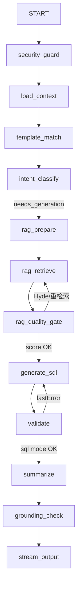

# Explore SQL generation flow

- **ID**: `a4fc8c2c-727c-42b4-816b-80b3b884b573`
- **创建时间**: 2026-07-02 17:11
- **模式**: chat
- **Agentic**: False

---

## 用户

Explore the nl-hermes codebase at /Users/dezliu/Documents/mine/repo/nl-hermes to understand how SQL is generated for user queries. Find:
1. Workflow nodes for generate_sql, validate, schema retrieval
2. Prompt templates for SQL generation - what schema/metadata is passed to LLM
3. SQL validation logic - how unknown columns are detected
4. Any retry/regeneration logic when validation fails
5. Language constraints in prompts (Chinese output)

Return file paths, key code snippets, and a summary of the flow.

## 助手

<details>
<summary>Thinking</summary>

Beginning to explore the nl-hermes codebase to locate SQL generation workflows, prompt templates, validation logic, and retry mechanisms.
</details>

正在探索代码库中的 SQL 生成流程，先从工作流节点与相关模块入手。

<details>
<summary>Tool: update_current_step</summary>

```json
{
  "rawArgs": "{\"currentStep\":\"Exploring SQL generation workflow\"}",
  "status": "completed"
}
```
</details>

<details>
<summary>Tool: mcp-codegraph-codegraph_explore</summary>

```json
{
  "rawArgs": "{\"name\":\"user-codegraph-codegraph_explore\",\"args\":{\"query\":\"SQL generation workflow nodes generate_sql validate schema retrieval for user queries LangChain LangGraph\"},\"toolCallId\":\"tool_ff5f3097-fa31-4d55-8365-06fad5e8800\",\"providerIdentifier\":\"codegraph\",\"toolName\":\"codegraph_explore\",\"smartModeApprovalOnly\":false,\"skipApproval\":true}",
  "params": "{\"tools\":[{\"name\":\"codegraph_explore\",\"parameters\":\"{\\\"query\\\":\\\"SQL generation workflow nodes generate_sql validate schema retrieval for user queries LangChain LangGraph\\\"}\",\"serverName\":\"codegraph\"}]}",
  "result": "{\"result\":\"{\\\"content\\\":[{\\\"type\\\":\\\"text\\\",\\\"text\\\":\\\"Error: Tool execution failed: No CodeGraph project is loaded for this session.\\\\nSearched for a .codegraph/ directory starting from: /Users/dezliu/Documents/mine/repo/nl-hermes\\\\nThe index is likely fine — this is a working-directory detection issue: the MCP client launched the server outside your project and didn't report the workspace root. Fix it either way:\\\\n  • Pass projectPath to the tool call, e.g. projectPath: \\\\\\\"/absolute/path/to/your/project\\\\\\\"\\\\n  • Or add --path to the server's MCP config args: [\\\\\\\"serve\\\\\\\", \\\\\\\"--mcp\\\\\\\", \\\\\\\"--path\\\\\\\", \\\\\\\"/absolute/path/to/your/project\\\\\\\"]\\\"}]}\"}",
  "status": "completed"
}
```
</details>

<details>
<summary>Tool: ripgrep_raw_search</summary>

```json
{
  "rawArgs": "{\"pattern\":\"generate_sql|generateSql|GenerateSql\",\"path\":\"/Users/dezliu/Documents/mine/repo/nl-hermes\",\"outputMode\":\"content\",\"caseInsensitive\":false,\"headLimit\":50,\"multiline\":false,\"toolCallId\":\"tool_a5addfbd-8458-4194-9f59-e80c19c7b82\",\"offset\":0}",
  "params": "{\"pattern\":\"generate_sql|generateSql|GenerateSql\",\"path\":\"/Users/dezliu/Documents/mine/repo/nl-hermes\",\"outputMode\":\"content\",\"caseInsensitive\":false}",
  "status": "completed"
}
```
</details>

<details>
<summary>Tool: ripgrep_raw_search</summary>

```json
{
  "rawArgs": "{\"pattern\":\"validate.*sql|sql.*valid|unknown.*column\",\"path\":\"/Users/dezliu/Documents/mine/repo/nl-hermes\",\"outputMode\":\"content\",\"caseInsensitive\":true,\"headLimit\":50,\"multiline\":false,\"toolCallId\":\"tool_0d709198-0ba3-40c5-a756-1cedf28b0c8\",\"offset\":0}",
  "params": "{\"pattern\":\"validate.*sql|sql.*valid|unknown.*column\",\"path\":\"/Users/dezliu/Documents/mine/repo/nl-hermes\",\"outputMode\":\"content\",\"caseInsensitive\":true}",
  "status": "completed"
}
```
</details>

<details>
<summary>Tool: glob_file_search</summary>

```json
{
  "rawArgs": "{\"targetDirectory\":\"/Users/dezliu/Documents/mine/repo/nl-hermes\",\"globPattern\":\"**/*sql*\"}",
  "params": "{\"targetDirectory\":\"/Users/dezliu/Documents/mine/repo/nl-hermes\",\"globPattern\":\"**/*sql*\"}",
  "result": "{\"directories\":[{\"absPath\":\"/Users/dezliu/Documents/mine/repo/nl-hermes\",\"files\":[{\"relPath\":\"scripts/settle/sql/02-schema.sql\"},{\"relPath\":\"scripts/settle/sql/03-seed-data.sql\"},{\"relPath\":\"scripts/settle/sql/01-database.sql\"},{\"relPath\":\"scripts/settle/sql-templates.json\"},{\"relPath\":\"apps/report-service/src/lib/sql-utils.test.ts\"},{\"relPath\":\"apps/report-service/src/lib/sql-utils.ts\"},{\"relPath\":\"apps/report-service/src/services/sql-executor.ts\"},{\"relPath\":\"packages/orm-schemas/src/models/sql-template.ts\"},{\"relPath\":\"docker/mysql/init/01-schemas.sql\"}],\"totalFiles\":9}]}",
  "status": "completed"
}
```
</details>

<details>
<summary>Thinking</summary>

Reading the workflow graph file to map out the SQL generation pipeline.
</details>

<details>
<summary>Tool: update_current_step</summary>

```json
{
  "rawArgs": "{\"currentStep\":\"Reading workflow and prompt files\"}",
  "status": "completed"
}
```
</details>

<details>
<summary>Tool: read_file_v2</summary>

```json
{
  "rawArgs": "{\"path\":\"/Users/dezliu/Documents/mine/repo/nl-hermes/packages/workflow/src/graph.ts\"}",
  "params": "{\"targetFile\":\"/Users/dezliu/Documents/mine/repo/nl-hermes/packages/workflow/src/graph.ts\",\"charsLimit\":1000000,\"effectiveUri\":\"/Users/dezliu/Documents/mine/repo/nl-hermes/packages/workflow/src/graph.ts\"}",
  "result": "{\"contents\":\"import { MemorySaver } from '@langchain/langgraph';\\nimport { Annotation, END, START, StateGraph } from '@langchain/langgraph';\\nimport type { BaseCheckpointSaver } from '@langchain/langgraph';\\nimport type { WorkflowGraphState } from './state.js';\\nimport type { WorkflowDeps } from './types.js';\\nimport {\\n  clarifyNode,\\n  directAnswerNode,\\n  executeReportNode,\\n  generateReportNode,\\n  generateSqlNode,\\n  groundingCheckNode,\\n  intentClassifyNode,\\n  loadContextNode,\\n  ragPrepareNode,\\n  ragQualityGateNode,\\n  ragRetrieveNode,\\n  refuseNode,\\n  routeAfterExecute,\\n  routeAfterGrounding,\\n  routeAfterIntent,\\n  routeAfterQualityGate,\\n  routeAfterSecurity,\\n  routeAfterValidate,\\n  securityGuardNode,\\n  streamOutputNode,\\n  summarizeResultNode,\\n  templateMatchNode,\\n  validateResultNode,\\n} from './nodes.js';\\n\\nfunction mergeState(current: WorkflowGraphState, patch: Partial<WorkflowGraphState>): WorkflowGraphState {\\n  return { ...current, ...patch };\\n}\\n\\nconst WorkflowAnnotation = Annotation.Root({\\n  state: Annotation<WorkflowGraphState>,\\n});\\n\\ntype GraphUpdate = { state: WorkflowGraphState };\\n\\nfunction wrap(handler: (s: WorkflowGraphState, d: WorkflowDeps) => Promise<Partial<WorkflowGraphState>>) {\\n  return async (input: GraphUpdate, config: { configurable?: { deps?: WorkflowDeps } }): Promise<GraphUpdate> => {\\n    const deps = config.configurable?.deps;\\n    if (!deps) throw new Error('workflow deps missing');\\n    const patch = await handler(input.state, deps);\\n    return { state: mergeState(input.state, patch) };\\n  };\\n}\\n\\nexport function buildWorkflowGraph(_deps: WorkflowDeps, checkpointer?: BaseCheckpointSaver) {\\n  const graph = new StateGraph(WorkflowAnnotation)\\n    .addNode('security_guard', wrap(securityGuardNode))\\n    .addNode('load_context', wrap(loadContextNode))\\n    .addNode('template_match', wrap(templateMatchNode))\\n    .addNode('intent_classify', wrap(intentClassifyNode))\\n    .addNode('rag_prepare', wrap(ragPrepareNode))\\n    .addNode('rag_retrieve', wrap(ragRetrieveNode))\\n    .addNode('rag_quality_gate', wrap(ragQualityGateNode))\\n    .addNode('generate_sql', wrap(generateSqlNode))\\n    .addNode('generate_report', wrap(generateReportNode))\\n    .addNode('validate', wrap(validateResultNode))\\n    .addNode('execute_report', wrap(executeReportNode))\\n    .addNode('summarize', wrap(summarizeResultNode))\\n    .addNode('grounding_check', wrap(groundingCheckNode))\\n    .addNode('clarify', wrap(clarifyNode))\\n    .addNode('direct_answer', wrap(directAnswerNode))\\n    .addNode('refuse', wrap(refuseNode))\\n    .addNode('stream_output', wrap(streamOutputNode))\\n    .addEdge(START, 'security_guard')\\n    .addConditionalEdges('security_guard', (input: GraphUpdate) => routeAfterSecurity(input.state), {\\n      refuse: 'refuse',\\n      load_context: 'load_context',\\n    })\\n    .addEdge('load_context', 'template_match')\\n    .addEdge('template_match', 'intent_classify')\\n    .addConditionalEdges('intent_classify', (input: GraphUpdate) => routeAfterIntent(input.state), {\\n      refuse: 'refuse',\\n      clarify: 'clarify',\\n      direct_answer: 'direct_answer',\\n      rag_prepare: 'rag_prepare',\\n    })\\n    .addEdge('rag_prepare', 'rag_retrieve')\\n    .addEdge('rag_retrieve', 'rag_quality_gate')\\n    .addConditionalEdges('rag_quality_gate', (input: GraphUpdate) => routeAfterQualityGate(input.state), {\\n      generate_sql: 'generate_sql',\\n      generate_report: 'generate_report',\\n      rag_retrieve: 'rag_retrieve',\\n      refuse: 'refuse',\\n    })\\n    .addEdge('generate_sql', 'validate')\\n    .addEdge('generate_report', 'validate')\\n    .addConditionalEdges('validate', (input: GraphUpdate) => routeAfterValidate(input.state), {\\n      generate_sql: 'generate_sql',\\n      generate_report: 'generate_report',\\n      execute_report: 'execute_report',\\n      summarize: 'summarize',\\n      refuse: 'refuse',\\n    })\\n    .addConditionalEdges('execute_report', (input: GraphUpdate) => routeAfterExecute(input.state), {\\n      generate_report: 'generate_report',\\n      summarize: 'summarize',\\n      refuse: 'refuse',\\n    })\\n    .addEdge('summarize', 'grounding_check')\\n    .addConditionalEdges('grounding_check', (input: GraphUpdate) => routeAfterGrounding(input.state), {\\n      refuse: 'refuse',\\n      stream_output: 'stream_output',\\n    })\\n    .addEdge('clarify', 'stream_output')\\n    .addEdge('direct_answer', 'stream_output')\\n    .addEdge('refuse', 'stream_output')\\n    .addEdge('stream_output', END);\\n\\n  return graph.compile({\\n    checkpointer: checkpointer ?? new MemorySaver(),\\n  });\\n}\\n\\nexport type CompiledWorkflow = ReturnType<typeof buildWorkflowGraph>;\\n\\nexport async function runWorkflow(\\n  initial: WorkflowGraphState,\\n  deps: WorkflowDeps,\\n  checkpointer?: BaseCheckpointSaver,\\n): Promise<WorkflowGraphState> {\\n  const app = buildWorkflowGraph(deps, checkpointer);\\n  const threadId = `${initial.sessionId}:${initial.runId}`;\\n  const result = await app.invoke(\\n    { state: initial },\\n    { configurable: { deps, thread_id: threadId, checkpoint_id: initial.checkpointId } },\\n  );\\n  return result.state;\\n}\\n\",\"totalLinesInFile\":135}",
  "status": "completed"
}
```
</details>

<details>
<summary>Tool: read_file_v2</summary>

```json
{
  "rawArgs": "{\"path\":\"/Users/dezliu/Documents/mine/repo/nl-hermes/packages/workflow/src/nodes.ts\"}",
  "params": "{\"targetFile\":\"/Users/dezliu/Documents/mine/repo/nl-hermes/packages/workflow/src/nodes.ts\",\"charsLimit\":1000000,\"effectiveUri\":\"/Users/dezliu/Documents/mine/repo/nl-hermes/packages/workflow/src/nodes.ts\"}",
  "result": "{\"contents\":\"\",\"totalLinesInFile\":604}",
  "status": "completed"
}
```
</details>

<details>
<summary>Tool: read_file_v2</summary>

```json
{
  "rawArgs": "{\"path\":\"/Users/dezliu/Documents/mine/repo/nl-hermes/packages/workflow/src/grounding.ts\"}",
  "params": "{\"targetFile\":\"/Users/dezliu/Documents/mine/repo/nl-hermes/packages/workflow/src/grounding.ts\",\"charsLimit\":1000000,\"effectiveUri\":\"/Users/dezliu/Documents/mine/repo/nl-hermes/packages/workflow/src/grounding.ts\"}",
  "result": "{\"contents\":\"import type { RetrieveResult } from '@hermes/contracts';\\n\\nconst SQL_KEYWORDS = new Set([\\n  'select', 'from', 'where', 'and', 'or', 'not', 'in', 'is', 'null', 'as', 'on', 'join',\\n  'left', 'right', 'inner', 'outer', 'group', 'by', 'order', 'having', 'limit', 'offset',\\n  'distinct', 'case', 'when', 'then', 'else', 'end', 'between', 'like', 'asc', 'desc',\\n  'union', 'all', 'exists', 'true', 'false', 'with', 'over', 'partition', 'row', 'rows',\\n  'date', 'datetime', 'timestamp', 'interval', 'day', 'month', 'year', 'hour', 'minute',\\n  'second', 'curdate', 'now', 'date_sub', 'date_add', 'count', 'sum', 'avg', 'min', 'max',\\n  'cast', 'coalesce', 'ifnull', 'if', 'substring', 'trim', 'upper', 'lower',\\n]);\\n\\nfunction collectKnownTokens(schemaContext: RetrieveResult[]): Set<string> {\\n  const known = new Set<string>();\\n  for (const item of schemaContext) {\\n    const tokens = item.content.toLowerCase().match(/[a-z_][a-z0-9_]*/g) ?? [];\\n    for (const t of tokens) {\\n      if (t.length > 1) known.add(t);\\n    }\\n  }\\n  return known;\\n}\\n\\nfunction collectKnownTables(schemaContext: RetrieveResult[]): Set<string> {\\n  const known = new Set<string>();\\n  for (const item of schemaContext) {\\n    const first = item.content.toLowerCase().match(/^[a-z_][a-z0-9_]*/);\\n    if (first) known.add(first[0]);\\n  }\\n  return known;\\n}\\n\\nfunction extractSqlTables(sql: string): string[] {\\n  const matches = [...sql.matchAll(/(?:from|join)\\\\s+[`\\\"']?(\\\\w+)[`\\\"']?/gi)];\\n  return matches.map((m) => m[1]!.toLowerCase());\\n}\\n\\nfunction extractSqlColumnRefs(sql: string): string[] {\\n  const stripped = sql.replace(/'[^']*'/g, ' ').replace(/\\\"[^\\\"]*\\\"/g, ' ').replace(/`[^`]*`/g, ' ');\\n  const segments: string[] = [];\\n  const clausePattern = /\\\\b(where|join|group by|order by|having)\\\\b/gi;\\n  let match: RegExpExecArray | null;\\n  while ((match = clausePattern.exec(stripped)) !== null) {\\n    const start = match.index + match[0].length;\\n    const rest = stripped.slice(start);\\n    const nextClause = rest.search(/\\\\b(select|from|where|join|group by|order by|having|limit)\\\\b/i);\\n    segments.push(nextClause >= 0 ? rest.slice(0, nextClause) : rest);\\n  }\\n\\n  const refs: string[] = [];\\n  for (const segment of segments) {\\n    for (const m of segment.matchAll(/\\\\b([a-z_][a-z0-9_]*)\\\\s*\\\\.\\\\s*([a-z_][a-z0-9_]*)\\\\b/gi)) {\\n      refs.push(m[2]!.toLowerCase());\\n    }\\n    for (const m of segment.matchAll(/\\\\b([a-z_][a-z0-9_]*)\\\\b/gi)) {\\n      refs.push(m[1]!.toLowerCase());\\n    }\\n  }\\n  return refs;\\n}\\n\\nexport function checkColumnGrounding(input: {\\n  sql?: string;\\n  schemaContext: RetrieveResult[];\\n}): { ok: boolean; unknownColumns?: string[] } {\\n  if (!input.sql?.trim()) return { ok: true };\\n\\n  const known = collectKnownTokens(input.schemaContext);\\n  if (known.size === 0) return { ok: true };\\n\\n  const knownTables = collectKnownTables(input.schemaContext);\\n  const refs = extractSqlColumnRefs(input.sql);\\n  const unknown = [...new Set(\\n    refs.filter(\\n      (col) =>\\n        !known.has(col) &&\\n        !knownTables.has(col) &&\\n        !SQL_KEYWORDS.has(col) &&\\n        !/^\\\\d/.test(col),\\n    ),\\n  )];\\n\\n  if (unknown.length === 0) return { ok: true };\\n  return { ok: false, unknownColumns: unknown };\\n}\\n\\nexport function checkGrounding(input: {\\n  sql?: string;\\n  schemaContext: RetrieveResult[];\\n  businessKnowledge: RetrieveResult[];\\n}): { ok: boolean; unknownTokens?: string[] } {\\n  if (!input.sql?.trim()) return { ok: true };\\n\\n  const knownTables = collectKnownTokens(input.schemaContext);\\n  if (knownTables.size === 0) return { ok: true };\\n\\n  const sqlTables = extractSqlTables(input.sql);\\n  const unknown = sqlTables.filter((t) => !knownTables.has(t));\\n  if (unknown.length === 0) return { ok: true };\\n\\n  return { ok: false, unknownTokens: unknown };\\n}\\n\\nexport function checkSqlGrounding(input: {\\n  sql?: string;\\n  schemaContext: RetrieveResult[];\\n  businessKnowledge: RetrieveResult[];\\n}): { ok: boolean; unknownTokens?: string[]; unknownColumns?: string[] } {\\n  const tableCheck = checkGrounding(input);\\n  if (!tableCheck.ok) return tableCheck;\\n\\n  const columnCheck = checkColumnGrounding(input);\\n  if (!columnCheck.ok) {\\n    return { ok: false, unknownColumns: columnCheck.unknownColumns };\\n  }\\n\\n  return { ok: true };\\n}\\n\",\"totalLinesInFile\":119}",
  "status": "completed"
}
```
</details>

<details>
<summary>Tool: ripgrep_raw_search</summary>

```json
{
  "rawArgs": "{\"pattern\":\"schema|prompt|中文|Chinese|loadContext|retrieve\",\"glob\":\"**/llm-tools/**\",\"caseInsensitive\":true,\"headLimit\":80,\"multiline\":false,\"toolCallId\":\"tool_af3a0e7a-abae-49be-8f28-20061ecb985\",\"offset\":0}",
  "params": "{\"pattern\":\"schema|prompt|中文|Chinese|loadContext|retrieve\",\"glob\":\"**/llm-tools/**\",\"caseInsensitive\":true}",
  "status": "completed"
}
```
</details>

<details>
<summary>Tool: ripgrep_raw_search</summary>

```json
{
  "rawArgs": "{\"pattern\":\"schema|retrieve|load_context|loadContext\",\"glob\":\"**/workflow/**\",\"caseInsensitive\":true,\"headLimit\":50,\"multiline\":false,\"toolCallId\":\"tool_a0397a42-1a57-4e97-96ff-a981410023a\",\"offset\":0}",
  "params": "{\"pattern\":\"schema|retrieve|load_context|loadContext\",\"glob\":\"**/workflow/**\",\"caseInsensitive\":true}",
  "status": "completed"
}
```
</details>

<details>
<summary>Thinking</summary>

I will examine openai-style-provider.ts for prompt templates, sql-executor.ts for validation logic, and state.ts for retry counts.
</details>

<details>
<summary>Tool: read_file_v2</summary>

```json
{
  "rawArgs": "{\"path\":\"/Users/dezliu/Documents/mine/repo/nl-hermes/packages/llm-tools/src/llm/openai-style-provider.ts\"}",
  "params": "{\"targetFile\":\"/Users/dezliu/Documents/mine/repo/nl-hermes/packages/llm-tools/src/llm/openai-style-provider.ts\",\"charsLimit\":1000000,\"effectiveUri\":\"/Users/dezliu/Documents/mine/repo/nl-hermes/packages/llm-tools/src/llm/openai-style-provider.ts\"}",
  "result": "{\"contents\":\"import type { OpenAiCompatibleClient } from './openai-compatible-client.js';\\nimport { createMockLlmProvider } from './mock-provider.js';\\nimport type { LlmProvider, RolePromptInput } from './types.js';\\n\\nfunction extractJson(text: string): unknown {\\n  const fenced = text.match(/```(?:json)?\\\\s*([\\\\s\\\\S]*?)```/i);\\n  const raw = (fenced?.[1] ?? text).trim();\\n  return JSON.parse(raw);\\n}\\n\\nfunction contextSummary(items: unknown[]): string {\\n  if (!items.length) return '（无）';\\n  return items\\n    .slice(0, 8)\\n    .map((item, i) => {\\n      if (typeof item === 'string') return `${i + 1}. ${item}`;\\n      if (item && typeof item === 'object' && 'content' in item) {\\n        return `${i + 1}. ${String((item as { content: unknown }).content)}`;\\n      }\\n      return `${i + 1}. ${JSON.stringify(item)}`;\\n    })\\n    .join('\\\\n');\\n}\\n\\nfunction buildSystemPrompt(rolePrompt?: RolePromptInput): string {\\n  const parts = [\\n    '安全约束：仅生成 SELECT 查询；禁止 DDL/DML；仅引用上下文中的表与字段。',\\n    '字段约束：WHERE/SELECT/ORDER BY 中的列名必须出现在 Schema 上下文中；禁止臆造 trade_date、created_at 等上下文中不存在的列名。',\\n    '时间过滤：若用户指定时间范围，必须使用 Schema 中已有的日期/时间字段（如 gmt_create、finish_time）；若上下文无合适时间字段，在 explanation 中说明而非编造列名。',\\n  ];\\n  if (rolePrompt?.persona) parts.push(`角色设定: ${rolePrompt.persona}`);\\n  if (rolePrompt?.constraints) parts.push(`系统限制: ${rolePrompt.constraints}`);\\n  return parts.join('\\\\n\\\\n');\\n}\\n\\nasync function completeJson(\\n  client: OpenAiCompatibleClient,\\n  messages: { role: 'system' | 'user' | 'assistant'; content: string }[],\\n  onThinking?: (chunk: string) => void,\\n): Promise<string> {\\n  if (onThinking) {\\n    return client.streamChat(messages, { onDelta: onThinking });\\n  }\\n  return client.chat(messages);\\n}\\n\\nexport function createOpenAiStyleLlmProvider(\\n  client: OpenAiCompatibleClient,\\n  fastClient?: OpenAiCompatibleClient,\\n): LlmProvider {\\n  const fallback = createMockLlmProvider();\\n  const lightClient = fastClient ?? client;\\n\\n  return {\\n    async classifyIntent(input) {\\n      try {\\n        const content = await lightClient.chat([\\n          {\\n            role: 'system',\\n            content:\\n              '你是意图分类器。仅返回 JSON：{\\\"intent\\\":\\\"direct_answer\\\"|\\\"needs_generation\\\"|\\\"refuse\\\",\\\"confidence\\\":0-1,\\\"reason?\\\":\\\"string\\\",\\\"answer?\\\":\\\"string\\\",\\\"clarifyQuestion?\\\":\\\"string\\\"}。' +\\n              '闲聊用 direct_answer；需要查数/SQL/报表用 needs_generation；不安全用 refuse；意图不明确时 needs_generation 且 confidence<0.8 并给出 clarifyQuestion。',\\n          },\\n          {\\n            role: 'user',\\n            content: `模式: ${input.mode}\\\\n问题: ${input.query}\\\\n历史: ${JSON.stringify(input.history.slice(-4))}`,\\n          },\\n        ]);\\n\\n        const parsed = extractJson(content) as {\\n          intent?: 'direct_answer' | 'needs_generation' | 'refuse';\\n          confidence?: number;\\n          reason?: string;\\n          answer?: string;\\n          clarifyQuestion?: string;\\n        };\\n\\n        if (\\n          parsed.intent === 'direct_answer' ||\\n          parsed.intent === 'needs_generation' ||\\n          parsed.intent === 'refuse'\\n        ) {\\n          return {\\n            intent: parsed.intent,\\n            confidence: parsed.confidence ?? 0.85,\\n            reason: parsed.reason,\\n            answer: parsed.answer,\\n            clarifyQuestion: parsed.clarifyQuestion,\\n          };\\n        }\\n        throw new Error('invalid intent json');\\n      } catch (err) {\\n        console.warn('[llm] classifyIntent fallback to mock:', err instanceof Error ? err.message : err);\\n        return fallback.classifyIntent(input);\\n      }\\n    },\\n\\n    async rewriteQueries(input) {\\n      try {\\n        const content = await lightClient.chat([\\n          {\\n            role: 'system',\\n            content: '生成 3 条语义检索改写查询。仅返回 JSON：{\\\"queries\\\":[\\\"string\\\",\\\"string\\\",\\\"string\\\"]}。',\\n          },\\n          { role: 'user', content: `模式: ${input.mode}\\\\n问题: ${input.query}` },\\n        ]);\\n        const parsed = extractJson(content) as { queries?: string[] };\\n        if (parsed.queries?.length) return parsed.queries.slice(0, 3);\\n        throw new Error('missing queries');\\n      } catch {\\n        return fallback.rewriteQueries(input);\\n      }\\n    },\\n\\n    async generateHydeDraft(input) {\\n      try {\\n        const content = await client.chat([\\n          {\\n            role: 'system',\\n            content: '为检索生成一段假设性业务分析草稿（含可能涉及的表/字段/指标），纯文本，100字内。',\\n          },\\n          { role: 'user', content: `模式: ${input.mode}\\\\n问题: ${input.query}` },\\n        ]);\\n        return content.trim() || (await fallback.generateHydeDraft(input));\\n      } catch {\\n        return fallback.generateHydeDraft(input);\\n      }\\n    },\\n\\n    async summarizeResult(input) {\\n      try {\\n        const preview = input.rows.slice(0, 50);\\n        const content = await client.chat([\\n          {\\n            role: 'system',\\n            content: '根据查询结果生成简短自然语言解读，80字内，不要编造上下文中没有的字段。',\\n          },\\n          {\\n            role: 'user',\\n            content: `问题: ${input.query}\\\\n行数: ${input.rowCount}\\\\n数据样例: ${JSON.stringify(preview.slice(0, 5))}`,\\n          },\\n        ]);\\n        return content.trim();\\n      } catch {\\n        return fallback.summarizeResult(input);\\n      }\\n    },\\n\\n    async generateSql(input) {\\n      try {\\n        const messages = [\\n          {\\n            role: 'system' as const,\\n            content:\\n              `${buildSystemPrompt(input.rolePrompt)}\\\\n\\\\n你是 SQL 生成助手。仅返回 JSON：{\\\"sql\\\":\\\"string\\\",\\\"explanation\\\":\\\"string\\\"}。SQL 须为 MySQL 方言，不要 markdown。`,\\n          },\\n          {\\n            role: 'user' as const,\\n            content: [\\n              `用户问题: ${input.query}`,\\n              `模式: ${input.mode}`,\\n              `Schema:\\\\n${contextSummary(input.schemaContext)}`,\\n              `业务知识:\\\\n${contextSummary(input.businessKnowledge)}`,\\n              `示例:\\\\n${contextSummary(input.examples)}`,\\n              input.errorFeedback ? `上次错误: ${input.errorFeedback}` : '',\\n            ]\\n              .filter(Boolean)\\n              .join('\\\\n\\\\n'),\\n          },\\n        ];\\n\\n        const content = await completeJson(client, messages, input.onThinking);\\n\\n        const parsed = extractJson(content) as { sql?: string; explanation?: string };\\n        if (!parsed.sql) throw new Error('missing sql field');\\n        return {\\n          sql: parsed.sql,\\n          explanation: parsed.explanation ?? '已生成 SQL。',\\n        };\\n      } catch (err) {\\n        console.warn('[llm] generateSql fallback to mock:', err instanceof Error ? err.message : err);\\n        return fallback.generateSql(input);\\n      }\\n    },\\n\\n    async generateReport(input) {\\n      try {\\n        const messages = [\\n          {\\n            role: 'system' as const,\\n            content:\\n              `${buildSystemPrompt(input.rolePrompt)}\\\\n\\\\n你是报表生成助手。仅返回 JSON：{\\\"sql\\\":\\\"string\\\",\\\"chartType\\\":\\\"line\\\"|\\\"bar\\\"|\\\"table\\\",\\\"chartConfig\\\":{},\\\"explanation\\\":\\\"string\\\"}。chartConfig 使用 xField/yField 字符串键。`,\\n          },\\n          {\\n            role: 'user' as const,\\n            content: [\\n              `用户问题: ${input.query}`,\\n              `Schema:\\\\n${contextSummary(input.schemaContext)}`,\\n              `业务知识:\\\\n${contextSummary(input.businessKnowledge)}`,\\n              `示例:\\\\n${contextSummary(input.examples)}`,\\n              input.errorFeedback ? `上次错误: ${input.errorFeedback}` : '',\\n            ]\\n              .filter(Boolean)\\n              .join('\\\\n\\\\n'),\\n          },\\n        ];\\n\\n        const content = await completeJson(client, messages, input.onThinking);\\n\\n        const parsed = extractJson(content) as {\\n          sql?: string;\\n          chartType?: 'line' | 'bar' | 'table';\\n          chartConfig?: Record<string, string>;\\n          explanation?: string;\\n        };\\n        if (!parsed.sql) throw new Error('missing sql field');\\n        return {\\n          sql: parsed.sql,\\n          chartType: parsed.chartType ?? 'line',\\n          chartConfig: parsed.chartConfig ?? { xField: 'dt', yField: 'cnt' },\\n          explanation: parsed.explanation ?? '已生成报表查询。',\\n        };\\n      } catch (err) {\\n        console.warn('[llm] generateReport fallback to mock:', err instanceof Error ? err.message : err);\\n        return fallback.generateReport(input);\\n      }\\n    },\\n  };\\n}\\n\",\"totalLinesInFile\":230}",
  "status": "completed"
}
```
</details>

<details>
<summary>Tool: read_file_v2</summary>

```json
{
  "rawArgs": "{}",
  "params": "{\"targetFile\":\"/Users/dezliu/Documents/mine/repo/nl-hermes/apps/reporting-service/src/services/sql-executor.ts\",\"charsLimit\":1000000,\"effectiveUri\":\"/Users/dezliu/Documents/mine/repo/nl-hermes/apps/reporting-service/src/services/sql-executor.ts\"}",
  "result": "{\"contents\":\"Error: File not found\",\"totalLinesInFile\":0}",
  "status": "error"
}
```
</details>

<details>
<summary>Tool: read_file_v2</summary>

```json
{
  "rawArgs": "{\"path\":\"/Users/dezliu/Documents/mine/repo/nl-hermes/packages/workflow/src/state.ts\"}",
  "params": "{\"targetFile\":\"/Users/dezliu/Documents/mine/repo/nl-hermes/packages/workflow/src/state.ts\",\"charsLimit\":1000000,\"effectiveUri\":\"/Users/dezliu/Documents/mine/repo/nl-hermes/packages/workflow/src/state.ts\"}",
  "result": "{\"contents\":\"import type { GenerationMode } from '@hermes/shared';\\nimport type { RetrieveResult, RolePrompt, TemplateMatchResult } from '@hermes/contracts';\\n\\nexport type IntentKind = 'direct_answer' | 'needs_generation' | 'refuse' | 'clarify';\\n\\nexport type WorkflowPhase = 'understanding' | 'retrieving' | 'generating';\\n\\nexport type WorkflowGraphState = {\\n  sessionId: string;\\n  runId: string;\\n  userId: string;\\n  roleId?: string;\\n  mode: GenerationMode;\\n  query: string;\\n  checkpointId: string;\\n  traceId?: string;\\n\\n  ragLoopCount: number;\\n  reportRetryCount: number;\\n  validateRetryCount: number;\\n  maxRagLoops: number;\\n  maxReportRetries: number;\\n  maxValidateRetries: number;\\n  minRagScore: number;\\n  minIntentConfidence: number;\\n\\n  rolePrompt?: RolePrompt | null;\\n  history: { role: 'user' | 'assistant'; content: string }[];\\n\\n  intent?: IntentKind;\\n  intentConfidence?: number;\\n  refuseReason?: string;\\n  directAnswer?: string;\\n  clarifyQuestion?: string;\\n\\n  ragQueries: string[];\\n  ragSearchQuery?: string;\\n  hydeUsed: boolean;\\n\\n  schemaContext: RetrieveResult[];\\n  businessKnowledge: RetrieveResult[];\\n  templateExamples: RetrieveResult[];\\n  templateMatches: TemplateMatchResult[];\\n  ragScore: number;\\n\\n  generatedSql?: string;\\n  generatedContent?: string;\\n  chartConfig?: Record<string, unknown>;\\n  executionResult?: Record<string, unknown>;\\n  lastError?: string;\\n  summaryText?: string;\\n\\n  currentPhase: WorkflowPhase;\\n  currentNode: string;\\n  status: 'running' | 'interrupted' | 'completed' | 'failed';\\n  streamBuffer: string;\\n};\\n\\nexport const DEFAULT_WORKFLOW_LIMITS = {\\n  maxRagLoops: 2,\\n  maxReportRetries: 3,\\n  maxValidateRetries: 2,\\n  minRagScore: 0.35,\\n  minIntentConfidence: 0.8,\\n  templateThreshold: 0.72,\\n};\\n\\nexport function createInitialState(input: {\\n  sessionId: string;\\n  runId: string;\\n  userId: string;\\n  roleId?: string;\\n  mode: GenerationMode;\\n  query: string;\\n  checkpointId: string;\\n  traceId?: string;\\n  history?: WorkflowGraphState['history'];\\n}): WorkflowGraphState {\\n  const maxRagLoopsEnv = Number(process.env.WORKFLOW_MAX_RAG_LOOPS);\\n  const maxRagLoops = Number.isFinite(maxRagLoopsEnv) && maxRagLoopsEnv > 0\\n    ? maxRagLoopsEnv\\n    : DEFAULT_WORKFLOW_LIMITS.maxRagLoops;\\n\\n  return {\\n    ...input,\\n    history: input.history ?? [],\\n    ragLoopCount: 0,\\n    reportRetryCount: 0,\\n    validateRetryCount: 0,\\n    maxRagLoops,\\n    maxReportRetries: DEFAULT_WORKFLOW_LIMITS.maxReportRetries,\\n    maxValidateRetries: DEFAULT_WORKFLOW_LIMITS.maxValidateRetries,\\n    minRagScore: DEFAULT_WORKFLOW_LIMITS.minRagScore,\\n    minIntentConfidence: DEFAULT_WORKFLOW_LIMITS.minIntentConfidence,\\n    ragQueries: [],\\n    hydeUsed: false,\\n    schemaContext: [],\\n    businessKnowledge: [],\\n    templateExamples: [],\\n    templateMatches: [],\\n    ragScore: 0,\\n    currentPhase: 'understanding',\\n    currentNode: 'LoadContext',\\n    status: 'running',\\n    streamBuffer: '',\\n  };\\n}\\n\",\"totalLinesInFile\":108}",
  "status": "completed"
}
```
</details>

<details>
<summary>Tool: read_file_v2</summary>

```json
{
  "rawArgs": "{\"path\":\"/Users/dezliu/Documents/mine/repo/nl-hermes/apps/report-service/src/services/sql-executor.ts\"}",
  "params": "{\"targetFile\":\"/Users/dezliu/Documents/mine/repo/nl-hermes/apps/report-service/src/services/sql-executor.ts\",\"charsLimit\":1000000,\"effectiveUri\":\"/Users/dezliu/Documents/mine/repo/nl-hermes/apps/report-service/src/services/sql-executor.ts\"}",
  "result": "{\"contents\":\"import mysql from 'mysql2/promise';\\nimport type { ExecuteQueryResponse, StructuredError, ValidateSqlResponse } from '@hermes/contracts';\\nimport { buildRowLimitError, buildSyntaxError, isSelectOnly, substituteParameters } from '../lib/sql-utils.js';\\n\\nexport type DatasourceConfig = {\\n  host: string;\\n  port: number;\\n  username: string;\\n  password: string;\\n  databaseName: string;\\n};\\n\\nexport class SqlExecutor {\\n  async execute(\\n    sql: string,\\n    ds: DatasourceConfig,\\n    options: { parameters?: Record<string, string>; maxRows?: number } = {},\\n  ): Promise<ExecuteQueryResponse> {\\n    const maxRows = options.maxRows ?? 1000;\\n    const finalSql = substituteParameters(sql, options.parameters);\\n\\n    if (!isSelectOnly(finalSql)) {\\n      return {\\n        ok: false,\\n        error: {\\n          code: 'FORBIDDEN_STATEMENT',\\n          message: '仅允许 SELECT 查询',\\n          suggestion: '请移除数据修改类语句',\\n        },\\n      };\\n    }\\n\\n    try {\\n      const conn = await mysql.createConnection({\\n        host: ds.host,\\n        port: ds.port,\\n        user: ds.username,\\n        password: ds.password,\\n        database: ds.databaseName,\\n      });\\n\\n      const limitedSql = finalSql.replace(/;\\\\s*$/, '');\\n      const [rows] = await conn.query(`${limitedSql} LIMIT ${maxRows + 1}`);\\n      await conn.end();\\n\\n      const resultRows = rows as Record<string, unknown>[];\\n      const truncated = resultRows.length > maxRows;\\n      const outputRows = truncated ? resultRows.slice(0, maxRows) : resultRows;\\n\\n      if (truncated) {\\n        return {\\n          ok: false,\\n          rows: outputRows,\\n          rowCount: outputRows.length,\\n          truncated: true,\\n          error: buildRowLimitError(maxRows),\\n        };\\n      }\\n\\n      return { ok: true, rows: outputRows, rowCount: outputRows.length, truncated: false };\\n    } catch (err) {\\n      const message = err instanceof Error ? err.message : 'SQL 执行失败';\\n      const fieldMatch = message.match(/Unknown column '([^']+)'/i);\\n      const error: StructuredError = fieldMatch\\n        ? { code: 'UNKNOWN_FIELD', field: fieldMatch[1], message, suggestion: '请检查字段名是否在权限范围内' }\\n        : buildSyntaxError(message);\\n      return { ok: false, error };\\n    }\\n  }\\n\\n  async validate(\\n    sql: string,\\n    ds: DatasourceConfig,\\n    maxRows = 1000,\\n    lightweight = false,\\n  ): Promise<ValidateSqlResponse> {\\n    const errors: StructuredError[] = [];\\n    if (!isSelectOnly(sql)) {\\n      errors.push({\\n        code: 'FORBIDDEN_STATEMENT',\\n        message: '仅允许 SELECT 查询',\\n      });\\n      return { valid: false, errors };\\n    }\\n\\n    try {\\n      const conn = await mysql.createConnection({\\n        host: ds.host,\\n        port: ds.port,\\n        user: ds.username,\\n        password: ds.password,\\n        database: ds.databaseName,\\n      });\\n      await conn.query(`EXPLAIN ${sql.replace(/;\\\\s*$/, '')}`);\\n      if (!lightweight) {\\n        const countSql = `SELECT COUNT(*) AS cnt FROM (${sql.replace(/;\\\\s*$/, '')}) AS _hermes_sub`;\\n        const [countRows] = await conn.query(countSql);\\n        const cnt = Number((countRows as { cnt: number }[])[0]?.cnt ?? 0);\\n        if (cnt > maxRows) {\\n          errors.push(buildRowLimitError(maxRows));\\n        }\\n      }\\n      await conn.end();\\n      return { valid: errors.length === 0, errors };\\n    } catch (err) {\\n      errors.push(buildSyntaxError(err instanceof Error ? err.message : '校验失败'));\\n      return { valid: false, errors };\\n    }\\n  }\\n}\\n\",\"totalLinesInFile\":111}",
  "status": "completed"
}
```
</details>

<details>
<summary>Tool: ripgrep_raw_search</summary>

```json
{
  "rawArgs": "{\"pattern\":\"中文|Chinese|简体|explanation\",\"path\":\"/Users/dezliu/Documents/mine/repo/nl-hermes\",\"glob\":\"**/*.{ts,tsx,md}\",\"caseInsensitive\":true,\"headLimit\":40,\"multiline\":false,\"toolCallId\":\"tool_0b4baa24-5c26-4e6b-a0cc-58e88061384\",\"offset\":0}",
  "params": "{\"pattern\":\"中文|Chinese|简体|explanation\",\"path\":\"/Users/dezliu/Documents/mine/repo/nl-hermes\",\"glob\":\"**/*.{ts,tsx,md}\",\"caseInsensitive\":true}",
  "status": "completed"
}
```
</details>

<details>
<summary>Tool: ripgrep_raw_search</summary>

```json
{
  "rawArgs": "{\"pattern\":\"retrieve|RetrieveResult\",\"path\":\"/Users/dezliu/Documents/mine/repo/nl-hermes\",\"glob\":\"**/apps/**\",\"outputMode\":\"files_with_matches\",\"caseInsensitive\":false,\"headLimit\":30,\"multiline\":false,\"toolCallId\":\"tool_6d2988e5-3ade-4716-b99f-b27c2edf82c\",\"offset\":0}",
  "params": "{\"pattern\":\"retrieve|RetrieveResult\",\"path\":\"/Users/dezliu/Documents/mine/repo/nl-hermes\",\"glob\":\"**/apps/**\",\"outputMode\":\"files_with_matches\",\"caseInsensitive\":false}",
  "status": "completed"
}
```
</details>

<details>
<summary>Tool: read_file_v2</summary>

```json
{
  "rawArgs": "{\"path\":\"/Users/dezliu/Documents/mine/repo/nl-hermes/packages/contracts/src/index.ts\",\"offset\":1,\"limit\":120}",
  "params": "{\"targetFile\":\"/Users/dezliu/Documents/mine/repo/nl-hermes/packages/contracts/src/index.ts\",\"offset\":1,\"limit\":120,\"charsLimit\":1000000,\"effectiveUri\":\"/Users/dezliu/Documents/mine/repo/nl-hermes/packages/contracts/src/index.ts\"}",
  "result": "{\"contents\":\"/** Shared API contract types between microservices */\\nexport type RetrieveRequest = {\\n  query: string;\\n  collection: 'metadata' | 'business' | 'templates';\\n  mode?: 'sql' | 'report';\\n  topK?: number;\\n  bm25TopK?: number;\\n  vectorTopK?: number;\\n  rrfK?: number;\\n  rerankTopK?: number;\\n  enableRerank?: boolean;\\n};\\n\\nexport type RetrieveResult = {\\n  id: string;\\n  content: string;\\n  score: number;\\n  matchReason?: string;\\n  source?: 'bm25' | 'vector' | 'rrf' | 'rerank';\\n};\\n\\nexport type RetrieveResponse = {\\n  results: RetrieveResult[];\\n  query: string;\\n  collection: string;\\n  fusedScore?: number;\\n};\\n\\nexport type ScoreRequest = {\\n  query: string;\\n  collection: 'metadata' | 'business' | 'templates';\\n  results?: RetrieveResult[];\\n};\\n\\nexport type ScoreResponse = {\\n  score: number;\\n  level: 'high' | 'medium' | 'low';\\n  details: { id: string; score: number }[];\\n};\\n\\nexport type ReportGenerateRequest = {\\n  mode: 'report';\\n  query: string;\\n  schemaContext: unknown;\\n  datasourceId: string;\\n  parameters?: Record<string, string>;\\n};\\n\\nexport type TemplateMatchRequest = {\\n  query: string;\\n  mode: 'sql' | 'report';\\n  topK?: number;\\n  threshold?: number;\\n};\\n\\nexport type TemplateMatchResult = {\\n  id: string;\\n  name: string;\\n  scenarioDescription: string;\\n  score: number;\\n  type: 'sql' | 'report';\\n};\\n\\nexport type ExecuteQueryRequest = {\\n  sql: string;\\n  datasourceId: string;\\n  parameters?: Record<string, string>;\\n  maxRows?: number;\\n};\\n\\nexport type StructuredError = {\\n  code: string;\\n  field?: string;\\n  message: string;\\n  suggestion?: string;\\n};\\n\\nexport type ExecuteQueryResponse = {\\n  ok: boolean;\\n  rows?: Record<string, unknown>[];\\n  rowCount?: number;\\n  truncated?: boolean;\\n  error?: StructuredError;\\n};\\n\\nexport type ValidateSqlRequest = {\\n  sql: string;\\n  datasourceId: string;\\n  maxRows?: number;\\n  /** SQL 模式仅做 EXPLAIN，跳过 COUNT 子查询以提速 */\\n  lightweight?: boolean;\\n};\\n\\nexport type ValidateSqlResponse = {\\n  valid: boolean;\\n  errors: StructuredError[];\\n};\\n\\n/** Chat / orchestrator API contracts (Phase 5) */\\nexport type ChatStreamPhase = 'understanding' | 'retrieving' | 'generating';\\n\\nexport type ChatStreamEvent =\\n  | { type: 'phase'; phase: ChatStreamPhase }\\n  | { type: 'chunk'; content: string }\\n  | { type: 'thinking'; content: string; done?: boolean }\\n  | { type: 'step'; step: string; detail?: string }\\n  | { type: 'templates'; results: TemplateMatchResult[] }\\n  | {\\n      type: 'done';\\n      runId: string;\\n      messageId: string;\\n      conversationId: string;\\n      status: 'completed' | 'interrupted' | 'failed';\\n      content: string;\\n      metadata?: Record<string, unknown>;\\n    }\\n  | { type: 'error'; code: string; message: string };\\n\\nexport type StartChatRequest = {\\n  userId: string;\",\"totalLinesInFile\":365}",
  "status": "completed"
}
```
</details>

<details>
<summary>Tool: read_file_v2</summary>

```json
{
  "rawArgs": "{\"path\":\"/Users/dezliu/Documents/mine/repo/nl-hermes/packages/contract-tests/src/workflow.contract.test.ts\",\"offset\":170,\"limit\":100}",
  "params": "{\"targetFile\":\"/Users/dezliu/Documents/mine/repo/nl-hermes/packages/contract-tests/src/workflow.contract.test.ts\",\"offset\":170,\"limit\":100,\"charsLimit\":1000000,\"effectiveUri\":\"/Users/dezliu/Documents/mine/repo/nl-hermes/packages/contract-tests/src/workflow.contract.test.ts\"}",
  "result": "{\"contents\":\"    expect(result.hydeUsed).toBe(true);\\n    expect(result.ragSearchQuery).toBeTruthy();\\n  });\\n\\n  it('should_generate_sql_with_explanation', async () => {\\n    const deps = mockDeps();\\n    const state = baseState('sql');\\n    state.schemaContext = [{ id: '1', content: 'orders amount', score: 0.9 }];\\n    const result = await generateSqlNode(state, deps);\\n    expect(result.generatedSql).toContain('SELECT');\\n    expect(result.currentPhase).toBe('generating');\\n  });\\n\\n  it('should_skip_rag_rewrite_for_business_query', async () => {\\n    const deps = mockDeps();\\n    const state = baseState('sql');\\n    state.query = '查询近7天资金流水';\\n    const result = await ragPrepareNode(state, deps);\\n    expect(result.ragQueries).toEqual(['查询近7天资金流水']);\\n  });\\n\\n  it('should_validate_sql_in_both_modes', async () => {\\n    const deps = mockDeps({\\n      report: {\\n        matchTemplates: vi.fn().mockResolvedValue({ results: [] }),\\n        executeQuery: vi.fn().mockResolvedValue({ ok: true, rows: [], rowCount: 0 }),\\n        validateSql: vi.fn().mockResolvedValue({\\n          valid: false,\\n          errors: [{ code: 'SYNTAX_ERROR', message: 'unknown column' }],\\n        }),\\n      } as WorkflowDeps['report'],\\n    });\\n    const state = baseState('sql');\\n    state.generatedSql = 'SELECT bad_col FROM orders';\\n    state.maxValidateRetries = 2;\\n    const result = await validateResultNode(state, deps);\\n    expect(result.lastError).toContain('unknown');\\n    expect(routeAfterValidate({ ...state, ...result })).toBe('generate_sql');\\n  });\\n\\n  it('should_fail_fast_when_datasource_missing', async () => {\\n    const deps = mockDeps({\\n      datasourceId: undefined,\\n      report: {\\n        matchTemplates: vi.fn().mockResolvedValue({ results: [] }),\\n        executeQuery: vi.fn().mockResolvedValue({ ok: true, rows: [], rowCount: 0 }),\\n        validateSql: vi.fn(),\\n      } as WorkflowDeps['report'],\\n    });\\n    const state = baseState('sql');\\n    state.generatedSql = 'SELECT 1';\\n    const result = await validateResultNode(state, deps);\\n    expect(result.intent).toBe('refuse');\\n    expect(result.refuseReason).toContain('未配置有效数据源');\\n    expect(deps.report.validateSql).not.toHaveBeenCalled();\\n  });\\n\\n  it('should_fail_fast_on_datasource_not_found_from_report', async () => {\\n    const deps = mockDeps({\\n      report: {\\n        matchTemplates: vi.fn().mockResolvedValue({ results: [] }),\\n        executeQuery: vi.fn().mockResolvedValue({ ok: true, rows: [], rowCount: 0 }),\\n        validateSql: vi.fn().mockResolvedValue({\\n          valid: false,\\n          errors: [{ code: 'DATASOURCE_NOT_FOUND', message: '数据源不存在' }],\\n        }),\\n      } as WorkflowDeps['report'],\\n    });\\n    const state = baseState('sql');\\n    state.generatedSql = 'SELECT 1';\\n    state.maxValidateRetries = 2;\\n    const result = await validateResultNode(state, deps);\\n    expect(result.intent).toBe('refuse');\\n    expect(result.validateRetryCount).toBeUndefined();\\n    expect(routeAfterValidate({ ...state, ...result })).toBe('refuse');\\n  });\\n\\n  it('should_use_lightweight_validate_for_sql_mode', async () => {\\n    const validateSql = vi.fn().mockResolvedValue({ valid: true, errors: [] });\\n    const deps = mockDeps({\\n      report: {\\n        matchTemplates: vi.fn().mockResolvedValue({ results: [] }),\\n        executeQuery: vi.fn().mockResolvedValue({ ok: true, rows: [], rowCount: 0 }),\\n        validateSql,\\n      } as WorkflowDeps['report'],\\n    });\\n    const state = baseState('sql');\\n    state.generatedSql = 'SELECT 1';\\n    await validateResultNode(state, deps);\\n    expect(validateSql).toHaveBeenCalledWith(\\n      expect.objectContaining({ lightweight: true, datasourceId: 'ds1' }),\\n    );\\n  });\\n\\n  it('should_refuse_early_when_datasource_missing_in_load_context', async () => {\\n    const deps = mockDeps({ datasourceId: undefined });\\n    const result = await loadContextNode(baseState(), deps);\\n    expect(result.intent).toBe('refuse');\\n    expect(result.refuseReason).toContain('未配置有效数据源');\\n  });\",\"totalLinesInFile\":371}",
  "status": "completed"
}
```
</details>

<details>
<summary>Tool: read_file_v2</summary>

```json
{
  "rawArgs": "{\"path\":\"/Users/dezliu/Documents/mine/repo/nl-hermes/apps/report-service/src/lib/sql-utils.ts\"}",
  "params": "{\"targetFile\":\"/Users/dezliu/Documents/mine/repo/nl-hermes/apps/report-service/src/lib/sql-utils.ts\",\"charsLimit\":1000000,\"effectiveUri\":\"/Users/dezliu/Documents/mine/repo/nl-hermes/apps/report-service/src/lib/sql-utils.ts\"}",
  "result": "{\"contents\":\"import type { StructuredError } from '@hermes/contracts';\\n\\nexport function substituteParameters(sql: string, parameters: Record<string, string> = {}): string {\\n  let result = sql;\\n  for (const [key, value] of Object.entries(parameters)) {\\n    result = result.replace(new RegExp(`\\\\\\\\{\\\\\\\\{\\\\\\\\s*${key}\\\\\\\\s*\\\\\\\\}\\\\\\\\}`, 'g'), value);\\n    result = result.replace(new RegExp(`:\\\\\\\\s*${key}\\\\\\\\b`, 'g'), `'${value.replace(/'/g, \\\"''\\\")}'`);\\n  }\\n  return result;\\n}\\n\\nexport function isSelectOnly(sql: string): boolean {\\n  const trimmed = sql.trim().replace(/^\\\\/\\\\*[\\\\s\\\\S]*?\\\\*\\\\//, '').replace(/^--.*$/m, '').trim();\\n  return /^select\\\\b/i.test(trimmed) && !/\\\\b(insert|update|delete|drop|alter|truncate|create)\\\\b/i.test(trimmed);\\n}\\n\\nexport function buildRowLimitError(maxRows: number): StructuredError {\\n  return {\\n    code: 'ROW_LIMIT_EXCEEDED',\\n    message: `查询结果超过 ${maxRows} 行上限`,\\n    suggestion: '请添加时间范围或筛选条件以缩小结果集',\\n  };\\n}\\n\\nexport function buildSyntaxError(message: string): StructuredError {\\n  return {\\n    code: 'SQL_SYNTAX_ERROR',\\n    message,\\n    suggestion: '请检查 SQL 语法与字段名是否正确',\\n  };\\n}\\n\\nexport function buildFieldError(field: string): StructuredError {\\n  return {\\n    code: 'UNKNOWN_FIELD',\\n    field,\\n    message: `字段 ${field} 不存在或无权限访问`,\\n    suggestion: '请仅使用 schema_context 中列出的表与字段',\\n  };\\n}\\n\",\"totalLinesInFile\":41}",
  "status": "completed"
}
```
</details>

<details>
<summary>Tool: read_file_v2</summary>

```json
{
  "rawArgs": "{\"path\":\"/Users/dezliu/Documents/mine/repo/nl-hermes/apps/rag-service/src/services/retrieve-service.ts\"}",
  "params": "{\"targetFile\":\"/Users/dezliu/Documents/mine/repo/nl-hermes/apps/rag-service/src/services/retrieve-service.ts\",\"charsLimit\":1000000,\"effectiveUri\":\"/Users/dezliu/Documents/mine/repo/nl-hermes/apps/rag-service/src/services/retrieve-service.ts\"}",
  "result": "{\"contents\":\"import type { Logger } from '@hermes/shared';\\nimport { getServiceAuthHeaders, HTTP_HEADERS } from '@hermes/shared';\\nimport type { RetrieveRequest, RetrieveResponse, RetrieveResult } from '@hermes/contracts';\\nimport { embedText } from '../lib/embedding.js';\\nimport { OpenSearchClient, collectionToIndex } from '../lib/opensearch.js';\\nimport { QdrantClient, collectionToQdrant } from '../lib/qdrant.js';\\nimport { formatRetrieveResults, reciprocalRankFusion, rerankByQuery } from './fusion.js';\\n\\nexport type RetrieveSettings = {\\n  bm25TopK: number;\\n  vectorTopK: number;\\n  rrfK: number;\\n  rerankTopK: number;\\n  enableRerank: boolean;\\n};\\n\\nconst DEFAULT_SETTINGS: RetrieveSettings = {\\n  bm25TopK: 20,\\n  vectorTopK: 20,\\n  rrfK: 60,\\n  rerankTopK: 10,\\n  enableRerank: true,\\n};\\n\\nexport class RetrieveService {\\n  constructor(\\n    private readonly os: OpenSearchClient,\\n    private readonly qdrant: QdrantClient,\\n    private readonly logger: Logger,\\n    private readonly metadataUrl = process.env.METADATA_SERVICE_URL ?? 'http://localhost:4050',\\n  ) {}\\n\\n  async retrieve(req: RetrieveRequest, traceId?: string): Promise<RetrieveResponse> {\\n    const settings = {\\n      ...DEFAULT_SETTINGS,\\n      bm25TopK: req.bm25TopK ?? req.topK ?? DEFAULT_SETTINGS.bm25TopK,\\n      vectorTopK: req.vectorTopK ?? req.topK ?? DEFAULT_SETTINGS.vectorTopK,\\n      rrfK: req.rrfK ?? DEFAULT_SETTINGS.rrfK,\\n      rerankTopK: req.rerankTopK ?? DEFAULT_SETTINGS.rerankTopK,\\n      enableRerank: req.enableRerank ?? DEFAULT_SETTINGS.enableRerank,\\n    };\\n\\n    const indexName = collectionToIndex(req.collection);\\n    const collectionName = collectionToQdrant(req.collection);\\n    const queryVector = embedText(req.query);\\n\\n    const [bm25Hits, vectorHits] = await Promise.all([\\n      this.os.search(indexName, req.query, settings.bm25TopK),\\n      this.qdrant.search(collectionName, queryVector, settings.vectorTopK),\\n    ]);\\n\\n    const fused = reciprocalRankFusion(\\n      [\\n        { name: 'bm25', hits: bm25Hits },\\n        { name: 'vector', hits: vectorHits },\\n      ],\\n      settings.rrfK,\\n    );\\n\\n    let results: RetrieveResult[];\\n    if (settings.enableRerank && fused.length > 0) {\\n      results = rerankByQuery(req.query, fused, settings.rerankTopK);\\n    } else {\\n      results = formatRetrieveResults(req.query, fused, settings.rerankTopK, 'rrf', 'rrf');\\n    }\\n\\n    this.logger.info('rag.retrieve.completed', {\\n      traceId,\\n      collection: req.collection,\\n      bm25Count: bm25Hits.length,\\n      vectorCount: vectorHits.length,\\n      resultCount: results.length,\\n    });\\n\\n    return { results, query: req.query, collection: req.collection };\\n  }\\n\\n  private authHeaders(traceId?: string): Record<string, string> {\\n    return {\\n      ...getServiceAuthHeaders('rag-service'),\\n      ...(traceId ? { [HTTP_HEADERS.TRACE_ID]: traceId } : {}),\\n    };\\n  }\\n\\n  async fetchSettings(traceId?: string): Promise<Partial<RetrieveSettings>> {\\n    try {\\n      const res = await fetch(`${this.metadataUrl}/v1/settings?category=rag`, {\\n        headers: this.authHeaders(traceId),\\n      });\\n      if (!res.ok) return {};\\n      const data = (await res.json()) as { items?: { settingKey: string; settingValue: unknown }[] };\\n      const map = Object.fromEntries((data.items ?? []).map((i) => [i.settingKey, i.settingValue]));\\n      return {\\n        bm25TopK: Number(map['rag.bm25.topK'] ?? DEFAULT_SETTINGS.bm25TopK),\\n        vectorTopK: Number(map['rag.vector.topK'] ?? DEFAULT_SETTINGS.vectorTopK),\\n        rrfK: Number(map['rag.rrf.k'] ?? DEFAULT_SETTINGS.rrfK),\\n        rerankTopK: Number(map['rag.rerank.topK'] ?? DEFAULT_SETTINGS.rerankTopK),\\n      };\\n    } catch {\\n      this.logger.warn('rag.settings.fetch_failed', { traceId });\\n      return {};\\n    }\\n  }\\n}\\n\",\"totalLinesInFile\":105}",
  "status": "completed"
}
```
</details>

<details>
<summary>Tool: read_file_v2</summary>

```json
{
  "rawArgs": "{\"path\":\"/Users/dezliu/Documents/mine/repo/nl-hermes/packages/workflow/src/grounding.test.ts\"}",
  "params": "{\"targetFile\":\"/Users/dezliu/Documents/mine/repo/nl-hermes/packages/workflow/src/grounding.test.ts\",\"charsLimit\":1000000,\"effectiveUri\":\"/Users/dezliu/Documents/mine/repo/nl-hermes/packages/workflow/src/grounding.test.ts\"}",
  "result": "{\"contents\":\"import { describe, it, expect } from 'vitest';\\nimport { checkColumnGrounding, checkGrounding, checkSqlGrounding } from './grounding.js';\\n\\nconst fundFlowSchema = [\\n  {\\n    id: '1',\\n    content: 'fund_flow 跨系统资金流水 business_id amount gmt_create datetime 创建时间',\\n    score: 0.9,\\n  },\\n];\\n\\ndescribe('checkColumnGrounding', () => {\\n  it('flags unknown columns like trade_date', () => {\\n    const result = checkColumnGrounding({\\n      sql: 'SELECT * FROM fund_flow WHERE trade_date >= DATE_SUB(CURDATE(), INTERVAL 7 DAY)',\\n      schemaContext: fundFlowSchema,\\n    });\\n    expect(result.ok).toBe(false);\\n    expect(result.unknownColumns).toContain('trade_date');\\n  });\\n\\n  it('accepts gmt_create from schema context', () => {\\n    const result = checkColumnGrounding({\\n      sql: 'SELECT business_id, gmt_create FROM fund_flow WHERE gmt_create >= DATE_SUB(CURDATE(), INTERVAL 7 DAY)',\\n      schemaContext: fundFlowSchema,\\n    });\\n    expect(result.ok).toBe(true);\\n  });\\n});\\n\\ndescribe('checkGrounding', () => {\\n  it('flags unknown tables', () => {\\n    const result = checkGrounding({\\n      sql: 'SELECT * FROM unknown_table',\\n      schemaContext: fundFlowSchema,\\n      businessKnowledge: [],\\n    });\\n    expect(result.ok).toBe(false);\\n    expect(result.unknownTokens).toContain('unknown_table');\\n  });\\n});\\n\\ndescribe('checkSqlGrounding', () => {\\n  it('combines table and column checks for filter clauses', () => {\\n    const result = checkSqlGrounding({\\n      sql: 'SELECT business_id FROM fund_flow WHERE trade_date >= CURDATE()',\\n      schemaContext: fundFlowSchema,\\n      businessKnowledge: [],\\n    });\\n    expect(result.ok).toBe(false);\\n    expect(result.unknownColumns).toContain('trade_date');\\n  });\\n});\\n\",\"totalLinesInFile\":54}",
  "status": "completed"
}
```
</details>

<details>
<summary>Tool: ripgrep_raw_search</summary>

```json
{
  "rawArgs": "{}",
  "result": "{\"error\":{\"error\":\"Glob pattern \\\"**/*\\\" matches every file and is not allowed. Use a more specific glob or no glob.\"}}",
  "status": "error"
}
```
</details>

<details>
<summary>Tool: read_file_v2</summary>

```json
{
  "rawArgs": "{\"path\":\"/Users/dezliu/Documents/mine/repo/nl-hermes/packages/contract-tests/src/workflow.contract.test.ts\",\"offset\":270,\"limit\":80}",
  "params": "{\"targetFile\":\"/Users/dezliu/Documents/mine/repo/nl-hermes/packages/contract-tests/src/workflow.contract.test.ts\",\"offset\":270,\"limit\":80,\"charsLimit\":1000000,\"effectiveUri\":\"/Users/dezliu/Documents/mine/repo/nl-hermes/packages/contract-tests/src/workflow.contract.test.ts\"}",
  "result": "{\"contents\":\"\\n  it('should_execute_report_after_validate', async () => {\\n    const deps = mockDeps();\\n    const state = baseState('report');\\n    state.generatedSql = 'SELECT 1';\\n    const result = await executeReportNode(state, deps);\\n    expect(deps.report.executeQuery).toHaveBeenCalled();\\n    expect(result.executionResult).toBeTruthy();\\n    expect(routeAfterExecute({ ...state, ...result })).toBe('summarize');\\n  });\\n\\n  it('should_retry_report_when_execute_fails', async () => {\\n    const deps = mockDeps({\\n      report: {\\n        matchTemplates: vi.fn().mockResolvedValue({ results: [] }),\\n        executeQuery: vi.fn().mockResolvedValue({\\n          ok: false,\\n          error: { code: 'syntax_error', message: 'SQL 语法错误' },\\n        }),\\n        validateSql: vi.fn().mockResolvedValue({ valid: true, errors: [] }),\\n      } as WorkflowDeps['report'],\\n    });\\n    const state = baseState('report');\\n    state.generatedSql = 'SELECT 1';\\n    const result = await executeReportNode(state, deps);\\n    expect(result.lastError).toBeTruthy();\\n    expect(routeAfterExecute({ ...state, ...result })).toBe('generate_report');\\n  });\\n\\n  it('should_refuse_grounding_when_unknown_table', async () => {\\n    const deps = mockDeps();\\n    const state = baseState();\\n    state.schemaContext = [{ id: '1', content: 'orders amount', score: 0.9 }];\\n    state.generatedSql = 'SELECT * FROM phantom_table';\\n    const result = await groundingCheckNode(state, deps);\\n    expect(result.intent).toBe('refuse');\\n    expect(routeAfterGrounding({ ...state, ...result })).toBe('refuse');\\n  });\\n\\n  it('should_summarize_report_results', async () => {\\n    const deps = mockDeps();\\n    const state = baseState('report');\\n    state.generatedSql = 'SELECT 1';\\n    state.generatedContent = '报表说明';\\n    state.executionResult = { rows: [{ cnt: 1 }], rowCount: 1 };\\n    const result = await summarizeResultNode(state, deps);\\n    expect(result.generatedContent).toContain('报表说明');\\n  });\\n\\n  it('should_stream_clarify_question', async () => {\\n    const deps = mockDeps();\\n    const state = baseState();\\n    state.clarifyQuestion = '请补充时间范围';\\n    const result = await clarifyNode(state, deps);\\n    expect(result.status).toBe('completed');\\n    expect(result.generatedContent).toContain('时间范围');\\n  });\\n\\n  it('should_refuse_with_reason_in_refuse_node', async () => {\\n    const deps = mockDeps();\\n    const state = baseState();\\n    state.refuseReason = '越权访问';\\n    const result = await refuseNode(state, deps);\\n    expect(result.status).toBe('failed');\\n    expect(result.generatedContent).toContain('越权');\\n  });\\n\\n  it('should_stream_direct_answer', async () => {\\n    const deps = mockDeps();\\n    const state = baseState();\\n    state.directAnswer = '您好，我是灵析助手。';\\n    const result = await directAnswerNode(state, deps);\\n    expect(result.status).toBe('completed');\\n    expect(result.generatedContent).toContain('灵析');\\n  });\\n\\n  it('should_interrupt_when_signal_set', async () => {\\n    const deps = mockDeps({ signal: { isInterrupted: () => true } });\\n    const result = await loadContextNode(baseState(), deps);\\n    expect(result.status).toBe('interrupted');\",\"totalLinesInFile\":371}",
  "status": "completed"
}
```
</details>

<details>
<summary>Tool: ripgrep_raw_search</summary>

```json
{
  "rawArgs": "{\"pattern\":\"content.*fund_flow|formatField|toChunk|indexDocument|metadata.*content\",\"path\":\"/Users/dezliu/Documents/mine/repo/nl-hermes\",\"caseInsensitive\":false,\"headLimit\":40,\"multiline\":false,\"toolCallId\":\"tool_bb78dd9b-8ec9-4a3d-97c8-0c06bd251c1\",\"offset\":0}",
  "params": "{\"pattern\":\"content.*fund_flow|formatField|toChunk|indexDocument|metadata.*content\",\"path\":\"/Users/dezliu/Documents/mine/repo/nl-hermes\",\"caseInsensitive\":false}",
  "status": "completed"
}
```
</details>

<details>
<summary>Tool: glob_file_search</summary>

```json
{
  "rawArgs": "{\"targetDirectory\":\"/Users/dezliu/Documents/mine/repo/nl-hermes\",\"globPattern\":\"**/metadata-service/**\"}",
  "params": "{\"targetDirectory\":\"/Users/dezliu/Documents/mine/repo/nl-hermes\",\"globPattern\":\"**/metadata-service/**\"}",
  "result": "{\"directories\":[{\"absPath\":\"/Users/dezliu/Documents/mine/repo/nl-hermes\",\"files\":[{\"relPath\":\"apps/metadata-service/src/services/datasource-service.ts\"},{\"relPath\":\"apps/metadata-service/src/repositories/index.ts\"},{\"relPath\":\"apps/metadata-service/src/services/settings-service.ts\"},{\"relPath\":\"apps/metadata-service/src/routes/index.ts\"},{\"relPath\":\"apps/metadata-service/src/lib/crypto.ts\"},{\"relPath\":\"apps/metadata-service/src/index.ts\"},{\"relPath\":\"apps/metadata-service/src/app.ts\"},{\"relPath\":\"apps/metadata-service/src/lib/metrics-store.ts\"},{\"relPath\":\"apps/metadata-service/src/lib/crypto.test.ts\"},{\"relPath\":\"apps/metadata-service/src/services/meta-service.ts\"},{\"relPath\":\"apps/metadata-service/src/lib/chat-metrics-client.ts\"},{\"relPath\":\"apps/metadata-service/src/services/monitor-service.ts\"},{\"relPath\":\"apps/metadata-service/src/routes/monitor-routes.test.ts\"},{\"relPath\":\"apps/metadata-service/src/services/template-service.ts\"},{\"relPath\":\"apps/metadata-service/tsconfig.json\"},{\"relPath\":\"apps/metadata-service/package.json\"},{\"relPath\":\"apps/metadata-service/src/index.test.ts\"},{\"relPath\":\"apps/metadata-service/src/repositories/alert-repository.ts\"},{\"relPath\":\"apps/metadata-service/src/services/alert-service.ts\"},{\"relPath\":\"apps/metadata-service/src/services/prompt-service.ts\"},{\"relPath\":\"apps/metadata-service/src/services/datasource-app-service.ts\"},{\"relPath\":\"apps/metadata-service/src/services/datasource-service.test.ts\"},{\"relPath\":\"apps/metadata-service/src/lib/metrics-store.test.ts\"},{\"relPath\":\"apps/metadata-service/src/routes/monitor-routes.ts\"},{\"relPath\":\"apps/metadata-service/src/services/business-knowledge-service.ts\"}],\"totalFiles\":25}]}",
  "status": "completed"
}
```
</details>

<details>
<summary>Tool: read_file_v2</summary>

```json
{
  "rawArgs": "{\"path\":\"/Users/dezliu/Documents/mine/repo/nl-hermes/apps/rag-service/src/services/fusion.ts\",\"limit\":80}",
  "params": "{\"targetFile\":\"/Users/dezliu/Documents/mine/repo/nl-hermes/apps/rag-service/src/services/fusion.ts\",\"limit\":80,\"charsLimit\":1000000,\"effectiveUri\":\"/Users/dezliu/Documents/mine/repo/nl-hermes/apps/rag-service/src/services/fusion.ts\"}",
  "result": "{\"contents\":\"import type { RetrieveResult } from '@hermes/contracts';\\nimport { cosineSimilarity, embedText } from '../lib/embedding.js';\\n\\nexport type RankedDoc = {\\n  id: string;\\n  content: string;\\n  /** RRF rank score — used only for ordering, not exposed as similarity */\\n  rankScore: number;\\n  /** Best Qdrant cosine similarity (0–1) when doc appeared in vector hits */\\n  vectorScore?: number;\\n  sources: Set<string>;\\n  metadata?: Record<string, unknown>;\\n};\\n\\nexport function computeSemanticScore(query: string, content: string, vectorScore?: number): number {\\n  const semanticScore = cosineSimilarity(embedText(query), embedText(content));\\n  if (vectorScore !== undefined && vectorScore > 0) {\\n    return Number((semanticScore * 0.85 + Math.min(vectorScore, 1) * 0.15).toFixed(4));\\n  }\\n  return Number(semanticScore.toFixed(4));\\n}\\n\\nexport function reciprocalRankFusion(\\n  lists: { name: string; hits: { id: string; content: string; score: number; metadata?: Record<string, unknown> }[] }[],\\n  k = 60,\\n): RankedDoc[] {\\n  const map = new Map<string, RankedDoc>();\\n\\n  for (const list of lists) {\\n    list.hits.forEach((hit, rank) => {\\n      const rrfScore = 1 / (k + rank + 1);\\n      const existing = map.get(hit.id);\\n      if (existing) {\\n        existing.rankScore += rrfScore;\\n        existing.sources.add(list.name);\\n        if (list.name === 'vector') {\\n          existing.vectorScore = Math.max(existing.vectorScore ?? 0, hit.score);\\n        }\\n      } else {\\n        map.set(hit.id, {\\n          id: hit.id,\\n          content: hit.content,\\n          rankScore: rrfScore,\\n          vectorScore: list.name === 'vector' ? hit.score : undefined,\\n          sources: new Set([list.name]),\\n          metadata: hit.metadata,\\n        });\\n      }\\n    });\\n  }\\n\\n  return [...map.values()].sort((a, b) => b.rankScore - a.rankScore);\\n}\\n\\nfunction lexicalOverlap(query: string, content: string): number {\\n  const qTokens = new Set(query.toLowerCase().split(/\\\\s+/).filter(Boolean));\\n  if (qTokens.size === 0) return 0;\\n  const contentTokens = content.toLowerCase().split(/\\\\s+/);\\n  let overlap = 0;\\n  for (const t of contentTokens) {\\n    if (qTokens.has(t)) overlap += 1;\\n  }\\n  return overlap / qTokens.size;\\n}\\n\\nfunction toRetrieveResult(\\n  query: string,\\n  doc: RankedDoc,\\n  matchReasonSuffix: string,\\n  source: RetrieveResult['source'],\\n): RetrieveResult {\\n  return {\\n    id: doc.id,\\n    content: doc.content,\\n    score: computeSemanticScore(query, doc.content, doc.vectorScore),\\n    matchReason: [...doc.sources, matchReasonSuffix].join('+'),\\n    source,\\n  };\\n}\\n\",\"totalLinesInFile\":115}",
  "status": "completed"
}
```
</details>

<details>
<summary>Tool: ripgrep_raw_search</summary>

```json
{
  "rawArgs": "{\"pattern\":\"indexMetadata|syncToRag|buildContent|embedding.*content\",\"path\":\"/Users/dezliu/Documents/mine/repo/nl-hermes\",\"caseInsensitive\":false,\"headLimit\":40,\"multiline\":false,\"toolCallId\":\"tool_66d899fb-2d77-4bf5-a7fb-a3e9bffb408\",\"offset\":0}",
  "params": "{\"pattern\":\"indexMetadata|syncToRag|buildContent|embedding.*content\",\"path\":\"/Users/dezliu/Documents/mine/repo/nl-hermes\",\"caseInsensitive\":false}",
  "status": "completed"
}
```
</details>

<details>
<summary>Tool: glob_file_search</summary>

```json
{
  "rawArgs": "{\"targetDirectory\":\"/Users/dezliu/Documents/mine/repo/nl-hermes\",\"globPattern\":\"**/scripts/settle/**\"}",
  "params": "{\"targetDirectory\":\"/Users/dezliu/Documents/mine/repo/nl-hermes\",\"globPattern\":\"**/scripts/settle/**\"}",
  "result": "{\"directories\":[{\"absPath\":\"/Users/dezliu/Documents/mine/repo/nl-hermes\",\"files\":[{\"relPath\":\"scripts/settle/sql/01-database.sql\"},{\"relPath\":\"scripts/settle/query-library.json\"},{\"relPath\":\"scripts/settle/business-knowledge.json\"},{\"relPath\":\"scripts/settle/sql/03-seed-data.sql\"},{\"relPath\":\"scripts/settle/sql-templates.json\"},{\"relPath\":\"scripts/settle/sql/02-schema.sql\"}],\"totalFiles\":6}]}",
  "status": "completed"
}
```
</details>

<details>
<summary>Tool: read_file_v2</summary>

```json
{
  "rawArgs": "{\"path\":\"/Users/dezliu/Documents/mine/repo/nl-hermes/scripts/seed-settle.ts\",\"offset\":340,\"limit\":80}",
  "params": "{\"targetFile\":\"/Users/dezliu/Documents/mine/repo/nl-hermes/scripts/seed-settle.ts\",\"offset\":340,\"limit\":80,\"charsLimit\":1000000,\"effectiveUri\":\"/Users/dezliu/Documents/mine/repo/nl-hermes/scripts/seed-settle.ts\"}",
  "result": "{\"contents\":\"      metadata: {\\n        tableId: f.tableId,\\n        tableName: f.tablePhysicalName,\\n        fieldName: f.physicalName,\\n        type: 'field',\\n      },\\n    };\\n  });\\n}\\n\\nasync function indexMetadata(repos: ReturnType<typeof createRepositories>): Promise<number> {\\n  const fields = await repos.meta.listFieldsForLibrary();\\n  const docs = buildMetadataDocs(fields);\\n  const points = docs.map((d) => ({\\n    id: d.id,\\n    vector: embedText(d.content),\\n    payload: { content: d.content, metadata: d.metadata },\\n  }));\\n\\n  const os = new OpenSearchClient();\\n  const qdrant = new QdrantClient();\\n  await Promise.all([\\n    os.bulkIndex(OPENSEARCH_INDICES.METADATA, docs),\\n    qdrant.upsertPoints(QDRANT_COLLECTIONS.METADATA, points),\\n  ]);\\n  return docs.length;\\n}\\n\\nasync function indexBusiness(): Promise<number> {\\n  const items = await BusinessKnowledgeModel.query().where('status', 'active');\\n  const docs = items.map((item) => ({\\n    id: item.id,\\n    content: [item.title, item.category, item.content].join(' '),\\n    metadata: { type: item.category, title: item.title },\\n  }));\\n  const points = docs.map((d) => ({\\n    id: d.id,\\n    vector: embedText(d.content),\\n    payload: { content: d.content, metadata: d.metadata },\\n  }));\\n\\n  const os = new OpenSearchClient();\\n  const qdrant = new QdrantClient();\\n  await Promise.all([\\n    os.bulkIndex(OPENSEARCH_INDICES.BUSINESS, docs),\\n    qdrant.upsertPoints(QDRANT_COLLECTIONS.BUSINESS, points),\\n  ]);\\n  return docs.length;\\n}\\n\\nasync function indexTemplates(): Promise<number> {\\n  const items = await SqlTemplateModel.query().where('status', 'active').where('in_library', true);\\n  const docs = items.map((t) => ({\\n    id: t.id,\\n    content: [t.name, t.scenarioDescription, t.sqlBody].join(' '),\\n    metadata: { type: 'sql' as const, name: t.name },\\n  }));\\n  const points = docs.map((d) => ({\\n    id: d.id,\\n    vector: embedText(d.content),\\n    payload: { content: d.content, metadata: d.metadata },\\n  }));\\n\\n  const os = new OpenSearchClient();\\n  const qdrant = new QdrantClient();\\n  await Promise.all([\\n    os.bulkIndex(OPENSEARCH_INDICES.TEMPLATES, docs),\\n    qdrant.upsertPoints(QDRANT_COLLECTIONS.TEMPLATES, points),\\n  ]);\\n  return docs.length;\\n}\\n\\nasync function phase2HermesMeta(\\n  repos: ReturnType<typeof createRepositories>,\\n  logger: ReturnType<typeof createLogger>,\\n  datasourceId: string,\\n): Promise<{\\n  tablesSynced: number;\\n  fieldsSynced: number;\\n  queryLibraryFields: number;\",\"totalLinesInFile\":576}",
  "status": "completed"
}
```
</details>

<details>
<summary>Tool: read_file_v2</summary>

```json
{
  "rawArgs": "{\"path\":\"/Users/dezliu/Documents/mine/repo/nl-hermes/scripts/settle/query-library.json\",\"limit\":60}",
  "params": "{\"targetFile\":\"/Users/dezliu/Documents/mine/repo/nl-hermes/scripts/settle/query-library.json\",\"limit\":60,\"charsLimit\":1000000,\"effectiveUri\":\"/Users/dezliu/Documents/mine/repo/nl-hermes/scripts/settle/query-library.json\"}",
  "result": "{\"contents\":\"{\\n  \\\"tables\\\": [\\n    {\\n      \\\"physicalName\\\": \\\"hst_bill\\\",\\n      \\\"description\\\": \\\"结算账单主表，记录账期、收付款方与账单状态\\\",\\n      \\\"fields\\\": [\\n        { \\\"physicalName\\\": \\\"bill_no\\\", \\\"synonyms\\\": [\\\"账单号\\\", \\\"账单编号\\\"] },\\n        { \\\"physicalName\\\": \\\"bill_type\\\", \\\"synonyms\\\": [\\\"账单类型\\\", \\\"费用类型\\\"] },\\n        { \\\"physicalName\\\": \\\"actual_bill_amount\\\", \\\"synonyms\\\": [\\\"账单金额\\\", \\\"结算金额\\\"] },\\n        { \\\"physicalName\\\": \\\"bill_status\\\", \\\"synonyms\\\": [\\\"账单状态\\\", \\\"结算状态\\\"] },\\n        { \\\"physicalName\\\": \\\"pay_object\\\", \\\"synonyms\\\": [\\\"付款方\\\", \\\"支付方\\\"] },\\n        { \\\"physicalName\\\": \\\"rec_object\\\", \\\"synonyms\\\": [\\\"收款方\\\", \\\"接收方\\\"] },\\n        { \\\"physicalName\\\": \\\"business_begin_time\\\", \\\"synonyms\\\": [\\\"账期开始\\\", \\\"业务开始时间\\\"] },\\n        { \\\"physicalName\\\": \\\"business_end_time\\\", \\\"synonyms\\\": [\\\"账期结束\\\", \\\"业务结束时间\\\"] }\\n      ]\\n    },\\n    {\\n      \\\"physicalName\\\": \\\"hst_bill_item\\\",\\n      \\\"description\\\": \\\"结算账单明细，最小结算粒度\\\",\\n      \\\"fields\\\": [\\n        { \\\"physicalName\\\": \\\"bill_no\\\", \\\"synonyms\\\": [\\\"账单号\\\"] },\\n        { \\\"physicalName\\\": \\\"amount\\\", \\\"synonyms\\\": [\\\"明细金额\\\", \\\"金额\\\"] },\\n        { \\\"physicalName\\\": \\\"trade_code\\\", \\\"synonyms\\\": [\\\"交易单号\\\", \\\"关联交易\\\"] },\\n        { \\\"physicalName\\\": \\\"status\\\", \\\"synonyms\\\": [\\\"明细状态\\\"] },\\n        { \\\"physicalName\\\": \\\"pay_status\\\", \\\"synonyms\\\": [\\\"支付状态\\\", \\\"代扣状态\\\"] },\\n        { \\\"physicalName\\\": \\\"alignment_flag\\\", \\\"synonyms\\\": [\\\"对账结果\\\", \\\"对账标记\\\"] },\\n        { \\\"physicalName\\\": \\\"pay_object\\\", \\\"synonyms\\\": [\\\"付款方\\\"] },\\n        { \\\"physicalName\\\": \\\"rec_object\\\", \\\"synonyms\\\": [\\\"收款方\\\"] }\\n      ]\\n    },\\n    {\\n      \\\"physicalName\\\": \\\"hst_order\\\",\\n      \\\"description\\\": \\\"结算主订单，业务触发的结算请求\\\",\\n      \\\"fields\\\": [\\n        { \\\"physicalName\\\": \\\"order_code\\\", \\\"synonyms\\\": [\\\"订单号\\\", \\\"结算订单号\\\"] },\\n        { \\\"physicalName\\\": \\\"order_type\\\", \\\"synonyms\\\": [\\\"订单类型\\\", \\\"结算类型\\\"] },\\n        { \\\"physicalName\\\": \\\"object_code\\\", \\\"synonyms\\\": [\\\"分表键\\\", \\\"门店编号\\\", \\\"对象编号\\\"] },\\n        { \\\"physicalName\\\": \\\"order_amount\\\", \\\"synonyms\\\": [\\\"订单金额\\\"] },\\n        { \\\"physicalName\\\": \\\"order_status\\\", \\\"synonyms\\\": [\\\"订单状态\\\"] },\\n        { \\\"physicalName\\\": \\\"business_time\\\", \\\"synonyms\\\": [\\\"业务时间\\\"] }\\n      ]\\n    },\\n    {\\n      \\\"physicalName\\\": \\\"hst_pay_order\\\",\\n      \\\"description\\\": \\\"支付代扣子单，订单拆分后的执行单元\\\",\\n      \\\"fields\\\": [\\n        { \\\"physicalName\\\": \\\"pay_code\\\", \\\"synonyms\\\": [\\\"支付流水号\\\", \\\"代扣单号\\\"] },\\n        { \\\"physicalName\\\": \\\"order_code\\\", \\\"synonyms\\\": [\\\"主单号\\\", \\\"订单号\\\"] },\\n        { \\\"physicalName\\\": \\\"pay_amount\\\", \\\"synonyms\\\": [\\\"支付金额\\\", \\\"代扣金额\\\"] },\\n        { \\\"physicalName\\\": \\\"pay_status\\\", \\\"synonyms\\\": [\\\"支付状态\\\"] },\\n        { \\\"physicalName\\\": \\\"pay_object\\\", \\\"synonyms\\\": [\\\"付款方\\\"] },\\n        { \\\"physicalName\\\": \\\"rec_object\\\", \\\"synonyms\\\": [\\\"收款方\\\"] }\\n      ]\\n    },\\n    {\\n      \\\"physicalName\\\": \\\"hst_stock_record\\\",\\n      \\\"description\\\": \\\"派费库存源数据，包裹入库触发结算\\\",\\n      \\\"fields\\\": [\\n        { \\\"physicalName\\\": \\\"serial_number\\\", \\\"synonyms\\\": [\\\"库存单号\\\", \\\"流水号\\\"] },\\n        { \\\"physicalName\\\": \\\"depot_code\\\", \\\"synonyms\\\": [\\\"门店编号\\\", \\\"驿站编号\\\"] },\",\"totalLinesInFile\":166}",
  "status": "completed"
}
```
</details>

<details>
<summary>Tool: ripgrep_raw_search</summary>

```json
{
  "rawArgs": "{\"pattern\":\"validateRetryCount|maxValidateRetries|lastError\",\"path\":\"/Users/dezliu/Documents/mine/repo/nl-hermes\",\"caseInsensitive\":false,\"headLimit\":20,\"multiline\":false,\"toolCallId\":\"tool_07771a5d-8aff-4c4b-bc72-167ead0de5e\",\"offset\":0}",
  "params": "{\"pattern\":\"validateRetryCount|maxValidateRetries|lastError\",\"path\":\"/Users/dezliu/Documents/mine/repo/nl-hermes\",\"caseInsensitive\":false}",
  "status": "completed"
}
```
</details>

<details>
<summary>Tool: read_file_v2</summary>

```json
{
  "rawArgs": "{\"path\":\"/Users/dezliu/Documents/mine/repo/nl-hermes/scripts/seed-settle.ts\",\"offset\":310,\"limit\":50}",
  "params": "{\"targetFile\":\"/Users/dezliu/Documents/mine/repo/nl-hermes/scripts/seed-settle.ts\",\"offset\":310,\"limit\":50,\"charsLimit\":1000000,\"effectiveUri\":\"/Users/dezliu/Documents/mine/repo/nl-hermes/scripts/seed-settle.ts\"}",
  "result": "{\"contents\":\"        scenarioDescription: entry.scenarioDescription,\\n        sqlBody: entry.sqlBody,\\n        inLibrary: true,\\n        status: 'active',\\n        usageCount: 0,\\n        createdBy: null,\\n      });\\n    }\\n    count += 1;\\n  }\\n  return count;\\n}\\n\\ntype LibraryField = Awaited<ReturnType<ReturnType<typeof createRepositories>['meta']['listFieldsForLibrary']>>[number];\\n\\nfunction buildMetadataDocs(fields: LibraryField[]) {\\n  return fields.map((f) => {\\n    const synonymText = (f.synonyms ?? []).map((s: { synonym: string }) => s.synonym).join(' ');\\n    const content = [\\n      f.tablePhysicalName,\\n      f.tableBusinessName,\\n      f.physicalName,\\n      f.businessName,\\n      f.description,\\n      f.dataType,\\n      synonymText,\\n    ].filter(Boolean).join(' ');\\n    return {\\n      id: f.id,\\n      content,\\n      metadata: {\\n        tableId: f.tableId,\\n        tableName: f.tablePhysicalName,\\n        fieldName: f.physicalName,\\n        type: 'field',\\n      },\\n    };\\n  });\\n}\\n\\nasync function indexMetadata(repos: ReturnType<typeof createRepositories>): Promise<number> {\\n  const fields = await repos.meta.listFieldsForLibrary();\\n  const docs = buildMetadataDocs(fields);\\n  const points = docs.map((d) => ({\\n    id: d.id,\\n    vector: embedText(d.content),\\n    payload: { content: d.content, metadata: d.metadata },\\n  }));\\n\\n  const os = new OpenSearchClient();\",\"totalLinesInFile\":576}",
  "status": "completed"
}
```
</details>

<details>
<summary>Tool: ripgrep_raw_search</summary>

```json
{
  "rawArgs": "{\"pattern\":\"buildMetadataDocs|listFieldsForLibrary\",\"path\":\"/Users/dezliu/Documents/mine/repo/nl-hermes\",\"caseInsensitive\":false,\"headLimit\":20,\"multiline\":false,\"toolCallId\":\"tool_1306c15e-44e1-4c2c-b5f9-0836f960f3e\",\"offset\":0}",
  "params": "{\"pattern\":\"buildMetadataDocs|listFieldsForLibrary\",\"path\":\"/Users/dezliu/Documents/mine/repo/nl-hermes\",\"caseInsensitive\":false}",
  "status": "completed"
}
```
</details>

<details>
<summary>Tool: read_file_v2</summary>

```json
{
  "rawArgs": "{\"path\":\"/Users/dezliu/Documents/mine/repo/nl-hermes/apps/metadata-service/src/services/prompt-service.ts\",\"limit\":80}",
  "params": "{\"targetFile\":\"/Users/dezliu/Documents/mine/repo/nl-hermes/apps/metadata-service/src/services/prompt-service.ts\",\"limit\":80,\"charsLimit\":1000000,\"effectiveUri\":\"/Users/dezliu/Documents/mine/repo/nl-hermes/apps/metadata-service/src/services/prompt-service.ts\"}",
  "result": "{\"contents\":\"import type { Logger } from '@hermes/shared';\\nimport type { Repositories } from '../repositories/index.js';\\n\\nexport class PromptService {\\n  constructor(\\n    private readonly repos: Repositories,\\n    private readonly logger: Logger,\\n  ) {}\\n\\n  listRoles() {\\n    return this.repos.prompt.listRoles();\\n  }\\n\\n  listVersions(roleId?: string | null) {\\n    return this.repos.prompt.listVersions(roleId);\\n  }\\n\\n  async getActive(roleId?: string | null) {\\n    const specific = await this.repos.prompt.findActive(roleId ?? null);\\n    if (specific) return specific;\\n    if (roleId) return this.repos.prompt.findActive(null);\\n    return null;\\n  }\\n\\n  async saveVersion(\\n    input: { roleId?: string | null; persona: string; constraints: string; createdBy?: string },\\n    traceId?: string,\\n  ) {\\n    const row = await this.repos.prompt.createVersion(input);\\n    await this.repos.audit.create({\\n      actorId: input.createdBy,\\n      action: 'prompt.create_version',\\n      resourceType: 'prompt_version',\\n      resourceId: row.id,\\n      afterSnapshot: { roleId: input.roleId, version: row.version },\\n      traceId,\\n    });\\n    this.logger.info('prompt.version.created', { traceId, version: row.version, roleId: input.roleId });\\n    return row;\\n  }\\n\\n  async rollback(versionId: string, actorId?: string, traceId?: string) {\\n    const row = await this.repos.prompt.activateVersion(versionId);\\n    if (row) {\\n      await this.repos.audit.create({\\n        actorId,\\n        action: 'prompt.rollback',\\n        resourceType: 'prompt_version',\\n        resourceId: versionId,\\n        traceId,\\n      });\\n    }\\n    return row;\\n  }\\n}\\n\",\"totalLinesInFile\":56}",
  "status": "completed"
}
```
</details>

<details>
<summary>Tool: read_file_v2</summary>

```json
{
  "rawArgs": "{\"path\":\"/Users/dezliu/Documents/mine/repo/nl-hermes/apps/rag-service/src/services/index-pipeline.ts\",\"limit\":90}",
  "params": "{\"targetFile\":\"/Users/dezliu/Documents/mine/repo/nl-hermes/apps/rag-service/src/services/index-pipeline.ts\",\"limit\":90,\"charsLimit\":1000000,\"effectiveUri\":\"/Users/dezliu/Documents/mine/repo/nl-hermes/apps/rag-service/src/services/index-pipeline.ts\"}",
  "result": "{\"contents\":\"import type { Logger } from '@hermes/shared';\\nimport { getServiceAuthHeaders, HTTP_HEADERS, QDRANT_COLLECTIONS, OPENSEARCH_INDICES } from '@hermes/shared';\\nimport { embedText } from '../lib/embedding.js';\\nimport { OpenSearchClient } from '../lib/opensearch.js';\\nimport { QdrantClient } from '../lib/qdrant.js';\\n\\ntype QueryLibraryField = {\\n  id: string;\\n  tableId: string;\\n  physicalName: string;\\n  businessName?: string;\\n  description?: string;\\n  dataType: string;\\n  tablePhysicalName: string;\\n  tableBusinessName?: string;\\n  synonyms?: { synonym: string }[];\\n};\\n\\nexport class IndexPipelineService {\\n  constructor(\\n    private readonly os: OpenSearchClient,\\n    private readonly qdrant: QdrantClient,\\n    private readonly logger: Logger,\\n    private readonly metadataUrl = process.env.METADATA_SERVICE_URL ?? 'http://localhost:4050',\\n  ) {}\\n\\n  private authHeaders(traceId?: string): Record<string, string> {\\n    return {\\n      ...getServiceAuthHeaders('rag-service'),\\n      ...(traceId ? { [HTTP_HEADERS.TRACE_ID]: traceId } : {}),\\n    };\\n  }\\n\\n  private async fetchQueryLibrary(): Promise<QueryLibraryField[]> {\\n    const res = await fetch(`${this.metadataUrl}/v1/meta/query-library`, {\\n      headers: this.authHeaders(),\\n    });\\n    if (!res.ok) throw new Error(`Failed to fetch query library: ${res.status}`);\\n    const data = (await res.json()) as { items: QueryLibraryField[] };\\n    return data.items ?? [];\\n  }\\n\\n  private buildMetadataDocs(fields: QueryLibraryField[]) {\\n    return fields.map((f) => {\\n      const synonymText = (f.synonyms ?? []).map((s) => s.synonym).join(' ');\\n      const content = [\\n        f.tablePhysicalName,\\n        f.tableBusinessName,\\n        f.physicalName,\\n        f.businessName,\\n        f.description,\\n        f.dataType,\\n        synonymText,\\n      ].filter(Boolean).join(' ');\\n      return {\\n        id: f.id,\\n        content,\\n        metadata: {\\n          tableId: f.tableId,\\n          tableName: f.tablePhysicalName,\\n          fieldName: f.physicalName,\\n          type: 'field',\\n        },\\n      };\\n    });\\n  }\\n\\n  async rebuildMetadata(traceId?: string) {\\n    const fields = await this.fetchQueryLibrary();\\n    const docs = this.buildMetadataDocs(fields);\\n    const points = docs.map((d) => ({\\n      id: d.id,\\n      vector: embedText(d.content),\\n      payload: { content: d.content, metadata: d.metadata },\\n    }));\\n\\n    await Promise.all([\\n      this.os.bulkIndex(OPENSEARCH_INDICES.METADATA, docs),\\n      this.qdrant.upsertPoints(QDRANT_COLLECTIONS.METADATA, points),\\n    ]);\\n\\n    this.logger.info('rag.index.metadata.completed', { traceId, count: docs.length });\\n    return { collection: 'metadata', indexed: docs.length };\\n  }\\n\\n  async rebuildBusiness(traceId?: string) {\\n    const res = await fetch(`${this.metadataUrl}/v1/business-knowledge?status=active`, {\\n      headers: this.authHeaders(traceId),\\n    });\\n    if (!res.ok) throw new Error(`Failed to fetch business knowledge: ${res.status}`);\",\"totalLinesInFile\":160}",
  "status": "completed"
}
```
</details>

<details>
<summary>Tool: ripgrep_raw_search</summary>

```json
{
  "rawArgs": "{\"pattern\":\"runWorkflow|buildWorkflowGraph\",\"path\":\"/Users/dezliu/Documents/mine/repo/nl-hermes\",\"caseInsensitive\":false,\"headLimit\":15,\"multiline\":false,\"toolCallId\":\"tool_537ff878-9924-4d41-a205-6154fe68107\",\"offset\":0}",
  "params": "{\"pattern\":\"runWorkflow|buildWorkflowGraph\",\"path\":\"/Users/dezliu/Documents/mine/repo/nl-hermes\",\"caseInsensitive\":false}",
  "status": "completed"
}
```
</details>

<details>
<summary>Tool: read_file_v2</summary>

```json
{
  "rawArgs": "{\"path\":\"/Users/dezliu/Documents/mine/repo/nl-hermes/packages/llm-tools/src/llm/mock-provider.ts\",\"limit\":50}",
  "params": "{\"targetFile\":\"/Users/dezliu/Documents/mine/repo/nl-hermes/packages/llm-tools/src/llm/mock-provider.ts\",\"limit\":50,\"charsLimit\":1000000,\"effectiveUri\":\"/Users/dezliu/Documents/mine/repo/nl-hermes/packages/llm-tools/src/llm/mock-provider.ts\"}",
  "result": "{\"contents\":\"import type { LlmProvider } from './types.js';\\n\\nconst JAILBREAK_PATTERNS = [/ignore\\\\s+(all\\\\s+)?previous\\\\s+instructions/i, /you\\\\s+are\\\\s+now/i, /扮演/i, /忽略系统/];\\n\\nfunction emitThinkingChunks(text: string, onThinking?: (chunk: string) => void): void {\\n  if (!onThinking) return;\\n  const chunkSize = 12;\\n  for (let i = 0; i < text.length; i += chunkSize) {\\n    onThinking(text.slice(i, i + chunkSize));\\n  }\\n}\\n\\nfunction resolveTable(schemaContext: unknown[]): string {\\n  const content = (schemaContext[0] as { content?: string } | undefined)?.content ?? '';\\n  if (/fund_flow/i.test(content) || schemaContext.some((item) => String((item as { content?: string }).content ?? '').includes('fund_flow'))) {\\n    return 'fund_flow';\\n  }\\n  return content.match(/(\\\\w+)/)?.[1] ?? 'orders';\\n}\\n\\nfunction hasField(schemaContext: unknown[], field: string): boolean {\\n  return schemaContext.some((item) => String((item as { content?: string }).content ?? '').toLowerCase().includes(field));\\n}\\n\\nfunction resolveDateField(schemaContext: unknown[]): string | null {\\n  for (const field of ['gmt_create', 'finish_time', 'business_time', 'upload_date']) {\\n    if (hasField(schemaContext, field)) return field;\\n  }\\n  return null;\\n}\\n\\nexport function createMockLlmProvider(): LlmProvider {\\n  return {\\n    async classifyIntent({ query }) {\\n      if (JAILBREAK_PATTERNS.some((p) => p.test(query))) {\\n        return { intent: 'refuse', confidence: 0.95, reason: '检测到不安全指令，已拒绝处理。' };\\n      }\\n      if (/^(你好|hello|hi)[!！。.]?$/i.test(query.trim())) {\\n        return {\\n          intent: 'direct_answer',\\n          confidence: 0.95,\\n          answer: '你好！我是灵析智能助手，可以帮你生成 SQL 或报表，请描述你的数据需求。',\\n        };\\n      }\\n      if (query.length < 2) {\\n        return { intent: 'refuse', confidence: 0.9, reason: '问题过短，请补充更具体的业务描述。' };\\n      }\\n      if (/^(查|看|统计)/.test(query) && query.length < 6) {\\n        return {\\n          intent: 'needs_generation',\",\"totalLinesInFile\":106}",
  "status": "completed"
}
```
</details>

<details>
<summary>Tool: ripgrep_raw_search</summary>

```json
{
  "rawArgs": "{\"pattern\":\"checkColumnGrounding|unknownColumns|SQL 包含知识库\",\"path\":\"/Users/dezliu/Documents/mine/repo/nl-hermes\",\"caseInsensitive\":false,\"headLimit\":15,\"multiline\":false,\"toolCallId\":\"tool_2dcfed6b-e9e3-4285-bc14-96d723b5dbb\",\"offset\":0}",
  "params": "{\"pattern\":\"checkColumnGrounding|unknownColumns|SQL 包含知识库\",\"path\":\"/Users/dezliu/Documents/mine/repo/nl-hermes\",\"caseInsensitive\":false}",
  "status": "completed"
}
```
</details>

<details>
<summary>Tool: read_file_v2</summary>

```json
{
  "rawArgs": "{\"path\":\"/Users/dezliu/Documents/mine/repo/nl-hermes/packages/llm-tools/src/llm/mock-provider.ts\",\"offset\":55,\"limit\":50}",
  "params": "{\"targetFile\":\"/Users/dezliu/Documents/mine/repo/nl-hermes/packages/llm-tools/src/llm/mock-provider.ts\",\"offset\":55,\"limit\":50,\"charsLimit\":1000000,\"effectiveUri\":\"/Users/dezliu/Documents/mine/repo/nl-hermes/packages/llm-tools/src/llm/mock-provider.ts\"}",
  "result": "{\"contents\":\"      return { intent: 'needs_generation', confidence: 0.9 };\\n    },\\n\\n    async rewriteQueries({ query }) {\\n      return [query, `${query} 相关表字段`, `${query} 统计汇总`];\\n    },\\n\\n    async generateHydeDraft({ query, mode }) {\\n      return `假设查询方案：针对「${query}」，可能涉及 fund_flow 表的 amount、gmt_create 字段，按日期汇总（${mode} 模式）。`;\\n    },\\n\\n    async summarizeResult({ query, rowCount, rows }) {\\n      const preview = rows.slice(0, 3).map((r) => JSON.stringify(r)).join('; ');\\n      return `针对「${query}」共返回 ${rowCount} 行。样例：${preview || '无数据'}。`;\\n    },\\n\\n    async generateSql({ query, schemaContext, errorFeedback, mode, rolePrompt, onThinking }) {\\n      const table = resolveTable(schemaContext);\\n      const dateField = resolveDateField(schemaContext);\\n      const timeFilter = dateField && /近?\\\\s*\\\\d+\\\\s*天|最近/.test(query)\\n        ? `\\\\nWHERE ${dateField} >= DATE_SUB(CURDATE(), INTERVAL 7 DAY)`\\n        : '\\\\nWHERE 1=1';\\n      const sql = `SELECT *\\\\nFROM ${table}${timeFilter} -- ${query.slice(0, 40)}`;\\n      const roleHint = rolePrompt?.persona ? `（${rolePrompt.persona}）` : '';\\n      const explanation = errorFeedback\\n        ? `已根据错误反馈重试生成 SQL${roleHint}，使用上下文中的字段。`\\n        : `根据检索到的 schema 上下文生成查询${roleHint}（${mode === 'sql' ? 'SQL 模式' : '报表模式'}）。`;\\n      emitThinkingChunks(JSON.stringify({ sql, explanation }), onThinking);\\n      return { sql, explanation };\\n    },\\n\\n    async generateReport({ query, schemaContext, errorFeedback, rolePrompt, onThinking }) {\\n      const table = resolveTable(schemaContext);\\n      const dateField = resolveDateField(schemaContext);\\n      const sql = dateField\\n        ? `SELECT DATE(${dateField}) AS dt, COUNT(*) AS cnt\\\\nFROM ${table}\\\\nGROUP BY 1`\\n        : `SELECT COUNT(*) AS cnt\\\\nFROM ${table}`;\\n      const roleHint = rolePrompt?.persona ? `（${rolePrompt.persona}）` : '';\\n      const explanation = errorFeedback\\n        ? `已根据执行错误重试生成报表查询${roleHint}。`\\n        : `为问题「${query.slice(0, 30)}」生成报表查询${roleHint}。`;\\n      emitThinkingChunks(JSON.stringify({ sql, explanation, chartType: 'line' }), onThinking);\\n      return {\\n        sql,\\n        chartType: 'line',\\n        chartConfig: { xField: 'dt', yField: 'cnt' },\\n        explanation,\\n      };\\n    },\\n  };\",\"totalLinesInFile\":106}",
  "status": "completed"
}
```
</details>

<details>
<summary>Tool: ripgrep_raw_search</summary>

```json
{
  "rawArgs": "{\"pattern\":\"知识库外|trade_date|columnCheck\",\"path\":\"/Users/dezliu/Documents/mine/repo/nl-hermes/packages/contract-tests\",\"caseInsensitive\":false,\"headLimit\":10,\"multiline\":false,\"toolCallId\":\"tool_87daea70-a837-421b-83c7-027bfde969e\",\"offset\":0}",
  "params": "{\"pattern\":\"知识库外|trade_date|columnCheck\",\"path\":\"/Users/dezliu/Documents/mine/repo/nl-hermes/packages/contract-tests\",\"caseInsensitive\":false}",
  "status": "completed"
}
```
</details>

<details>
<summary>Tool: read_file_v2</summary>

```json
{
  "rawArgs": "{\"path\":\"/Users/dezliu/Documents/mine/repo/nl-hermes/apps/report-service/src/services/report-service.ts\",\"offset\":1,\"limit\":40}",
  "params": "{\"targetFile\":\"/Users/dezliu/Documents/mine/repo/nl-hermes/apps/report-service/src/services/report-service.ts\",\"offset\":1,\"limit\":40,\"charsLimit\":1000000,\"effectiveUri\":\"/Users/dezliu/Documents/mine/repo/nl-hermes/apps/report-service/src/services/report-service.ts\"}",
  "result": "{\"contents\":\"import type { Logger } from '@hermes/shared';\\nimport { getServiceAuthHeaders } from '@hermes/shared';\\nimport type {\\n  ExecuteQueryRequest,\\n  ExecuteQueryResponse,\\n  ReportGenerateRequest,\\n  ValidateSqlRequest,\\n  ValidateSqlResponse,\\n} from '@hermes/contracts';\\nimport { SqlExecutor, type DatasourceConfig } from './sql-executor.js';\\nimport { ApiDataFetcher } from './api-fetcher.js';\\nimport { isSelectOnly } from '../lib/sql-utils.js';\\n\\ntype DatasourceRow = {\\n  host: string;\\n  port: number;\\n  username: string;\\n  passwordEncrypted: string;\\n  databaseName: string;\\n};\\n\\nexport class ReportService {\\n  constructor(\\n    private readonly sqlExecutor: SqlExecutor,\\n    private readonly apiFetcher: ApiDataFetcher,\\n    private readonly logger: Logger,\\n    private readonly metadataUrl = process.env.METADATA_SERVICE_URL ?? 'http://localhost:4050',\\n    private readonly decryptPassword: (encrypted: string) => string = () => '',\\n  ) {}\\n\\n  private async getDatasource(id: string): Promise<DatasourceConfig | null> {\\n    try {\\n      const res = await fetch(`${this.metadataUrl}/v1/datasources/${id}`, {\\n        headers: getServiceAuthHeaders('report-service'),\\n      });\\n      if (!res.ok) return null;\\n      const data = (await res.json()) as { item: DatasourceRow & { passwordEncrypted?: string } };\\n      const ds = data.item;\\n      if (!ds) return null;\\n      const password = process.env.DATASOURCE_DEV_PASSWORD ?? 'hermes_dev';\",\"totalLinesInFile\":125}",
  "status": "completed"
}
```
</details>

<details>
<summary>Thinking</summary>

The workflow graph is located at `packages/workflow/src/graph.ts`. The full analysis is complete and the final summary is being prepared.

Nodes are defined in `packages/workflow/src/nodes.ts`. Grounding logic lives in `packages/workflow/src/grounding.ts`. State and limits are managed in `packages/workflow/src/state.ts`.

LLM prompts are generated in `packages/llm-tools/src/llm/openai-style-provider.ts`.

SQL validation runs in `apps/report-service/src/services/sql-executor.ts` and `apps/report-service/src/lib/sql-utils.ts`.

RAG retrieval is handled by `ragRetrieveNode` in `packages/workflow/src/nodes.ts` and `apps/rag-service/src/services/retrieve-service.ts`.

Metadata formatting is done by `scripts/seed-settle.ts` and `apps/rag-service/src/services/index-pipeline.ts`.
</details>

<details>
<summary>Tool: update_current_step</summary>

```json
{
  "rawArgs": "{\"currentStep\":\"Summarizing SQL generation flow\",\"finalSummary\":\"SQL 生成走 LangGraph 工作流：`rag_retrieve` 检索 schema/业务/模板 → `generate_sql` 调用 LLM → `validate` 先做本地列名校验再做 MySQL EXPLAIN，失败最多重试 2 次。Prompt 将检索到的 `RetrieveResult.content` 拼入 Schema/业务/示例块，系统约束为中文且禁止臆造字段。\",\"completedSubtitle\":\"Mapped full SQL workflow\"}",
  "status": "completed"
}
```
</details>

## SQL 生成流程总览

灵析的 SQL 生成由 **LangGraph 工作流**（`packages/workflow`）编排，LLM 调用在 **`packages/llm-tools`**，schema 检索走 **RAG 三集合**，校验分 **本地 grounding + report-service EXPLAIN** 两层。



---

## 1. 工作流节点（generate_sql / validate / schema 检索）

**图定义：** `/Users/dezliu/Documents/mine/repo/nl-hermes/packages/workflow/src/graph.ts`

| 图节点 ID | 实现函数 | 职责 |
|-----------|----------|------|
| `load_context` | `loadContextNode` | 加载角色 Prompt，检查数据源 |
| `rag_prepare` | `ragPrepareNode` | 查询改写（或跳过） |
| `rag_retrieve` | `ragRetrieveNode` | **Schema/业务/模板检索** |
| `rag_quality_gate` | `ragQualityGateNode` | RAG 分数门槛 + Hyde 重检索 |
| `generate_sql` | `generateSqlNode` | 调用 LLM 生成 SQL |
| `validate` | `validateResultNode` | 列名校验 + 远程 EXPLAIN |
| `grounding_check` | `groundingCheckNode` | 输出前二次 grounding |

**Schema 检索没有独立节点**，在 `rag_retrieve` 中并行检索三个 collection：

```54:72:/Users/dezliu/Documents/mine/repo/nl-hermes/packages/workflow/src/nodes.ts
async function retrieveAllCollections(
  deps: WorkflowDeps,
  query: string,
  mode: WorkflowGraphState['mode'],
): Promise<{
  metadata: RetrieveResult[];
  business: RetrieveResult[];
  templates: RetrieveResult[];
}> {
  const [metadata, business, templates] = await Promise.all([
    deps.rag.retrieve({ query, collection: 'metadata', mode, topK: 8 }),
    deps.rag.retrieve({ query, collection: 'business', mode, topK: 6 }),
    deps.rag.retrieve({ query, collection: 'templates', mode, topK: 4 }),
  ]);
  // ...
}
```

**图边（SQL 模式）：**

```91:98:/Users/dezliu/Documents/mine/repo/nl-hermes/packages/workflow/src/graph.ts
    .addEdge('generate_sql', 'validate')
    .addEdge('generate_report', 'validate')
    .addConditionalEdges('validate', (input: GraphUpdate) => routeAfterValidate(input.state), {
      generate_sql: 'generate_sql',
      generate_report: 'generate_report',
      execute_report: 'execute_report',
      summarize: 'summarize',
      refuse: 'refuse',
    })
```

**相关文件：**
- `/Users/dezliu/Documents/mine/repo/nl-hermes/packages/workflow/src/nodes.ts` — 所有节点实现
- `/Users/dezliu/Documents/mine/repo/nl-hermes/packages/workflow/src/state.ts` — 状态与重试上限
- `/Users/dezliu/Documents/mine/repo/nl-hermes/apps/orchestrator/src/services/chat-service.ts` — 调用 `runWorkflow`
- `/Users/dezliu/Documents/mine/repo/nl-hermes/apps/rag-service/src/services/retrieve-service.ts` — BM25 + 向量 + RRF 检索

---

## 2. Prompt 模板与传给 LLM 的 Schema/元数据

**主实现：** `/Users/dezliu/Documents/mine/repo/nl-hermes/packages/llm-tools/src/llm/openai-style-provider.ts`

### System Prompt（安全 + 字段约束）

```25:34:/Users/dezliu/Documents/mine/repo/nl-hermes/packages/llm-tools/src/llm/openai-style-provider.ts
function buildSystemPrompt(rolePrompt?: RolePromptInput): string {
  const parts = [
    '安全约束：仅生成 SELECT 查询；禁止 DDL/DML；仅引用上下文中的表与字段。',
    '字段约束：WHERE/SELECT/ORDER BY 中的列名必须出现在 Schema 上下文中；禁止臆造 trade_date、created_at 等上下文中不存在的列名。',
    '时间过滤：若用户指定时间范围，必须使用 Schema 中已有的日期/时间字段（如 gmt_create、finish_time）；若上下文无合适时间字段，在 explanation 中说明而非编造列名。',
  ];
  if (rolePrompt?.persona) parts.push(`角色设定: ${rolePrompt.persona}`);
  if (rolePrompt?.constraints) parts.push(`系统限制: ${rolePrompt.constraints}`);
  return parts.join('\n\n');
}
```

### User Prompt 结构（`generateSql`）

传给 LLM 的上下文块：

| 块 | 来源 | 内容 |
|----|------|------|
| `Schema` | `state.schemaContext` | RAG metadata 检索结果（最多 8 条） |
| `业务知识` | `state.businessKnowledge` | business collection（最多 8 条） |
| `示例` | `state.templateExamples` | templates collection（最多 8 条） |
| `上次错误` | `state.lastError` | 校验失败时的反馈（重试时） |
| 角色 | `loadContextNode` 加载 | persona + constraints |

```149:169:/Users/dezliu/Documents/mine/repo/nl-hermes/packages/llm-tools/src/llm/openai-style-provider.ts
    async generateSql(input) {
      // ...
        const messages = [
          {
            role: 'system' as const,
            content:
              `${buildSystemPrompt(input.rolePrompt)}\n\n你是 SQL 生成助手。仅返回 JSON：{"sql":"string","explanation":"string"}。SQL 须为 MySQL 方言，不要 markdown。`,
          },
          {
            role: 'user' as const,
            content: [
              `用户问题: ${input.query}`,
              `模式: ${input.mode}`,
              `Schema:\n${contextSummary(input.schemaContext)}`,
              `业务知识:\n${contextSummary(input.businessKnowledge)}`,
              `示例:\n${contextSummary(input.examples)}`,
              input.errorFeedback ? `上次错误: ${input.errorFeedback}` : '',
            ]
              .filter(Boolean)
              .join('\n\n'),
          },
        ];
```

### Schema 元数据的实际格式

索引时每条 metadata 文档的 `content` 由表/字段物理名、业务中文名、描述、类型、同义词拼接：

```43:54:/Users/dezliu/Documents/mine/repo/nl-hermes/apps/rag-service/src/services/index-pipeline.ts
  private buildMetadataDocs(fields: QueryLibraryField[]) {
    return fields.map((f) => {
      const synonymText = (f.synonyms ?? []).map((s) => s.synonym).join(' ');
      const content = [
        f.tablePhysicalName,
        f.tableBusinessName,
        f.physicalName,
        f.businessName,
        f.description,
        f.dataType,
        synonymText,
      ].filter(Boolean).join(' ');
```

示例（测试用）：

```4:9:/Users/dezliu/Documents/mine/repo/nl-hermes/packages/workflow/src/grounding.test.ts
const fundFlowSchema = [
  {
    id: '1',
    content: 'fund_flow 跨系统资金流水 business_id amount gmt_create datetime 创建时间',
    score: 0.9,
  },
];
```

**注意：** LLM 收到的是 `RetrieveResult.content` 纯文本列表，**不是结构化 JSON schema**；`contextSummary` 只取前 8 条、编号拼接。

---

## 3. SQL 校验与未知列检测

校验分 **两层**，都在 `validateResultNode`：

### 层 1：本地列 Grounding（workflow 内）

**文件：** `/Users/dezliu/Documents/mine/repo/nl-hermes/packages/workflow/src/grounding.ts`

逻辑：
1. 从 `schemaContext` 提取所有 token（`collectKnownTokens`）和表名（`collectKnownTables`）
2. 从 SQL 的 WHERE/JOIN/GROUP BY/ORDER BY/HAVING 子句提取列引用（`extractSqlColumnRefs`）
3. 过滤掉已知 token、已知表名、SQL 关键字、数字开头 token
4. 剩余即为 `unknownColumns`

```62:84:/Users/dezliu/Documents/mine/repo/nl-hermes/packages/workflow/src/grounding.ts
export function checkColumnGrounding(input: {
  sql?: string;
  schemaContext: RetrieveResult[];
}): { ok: boolean; unknownColumns?: string[] } {
  if (!input.sql?.trim()) return { ok: true };

  const known = collectKnownTokens(input.schemaContext);
  if (known.size === 0) return { ok: true };

  const knownTables = collectKnownTables(input.schemaContext);
  const refs = extractSqlColumnRefs(input.sql);
  const unknown = [...new Set(
    refs.filter(
      (col) =>
        !known.has(col) &&
        !knownTables.has(col) &&
        !SQL_KEYWORDS.has(col) &&
        !/^\d/.test(col),
    ),
  )];

  if (unknown.length === 0) return { ok: true };
  return { ok: false, unknownColumns: unknown };
}
```

**局限：** 基于正则 + RAG 文本 token 匹配，不是完整 SQL AST；SELECT 列表中的列不一定被检查（主要查 filter 子句）。

### 层 2：远程 MySQL EXPLAIN（report-service）

**文件：** `/Users/dezliu/Documents/mine/repo/nl-hermes/apps/report-service/src/services/sql-executor.ts`

- 先检查 `isSelectOnly`
- SQL 模式：`lightweight: true`，仅 `EXPLAIN`
- 报表模式：额外 `COUNT(*)` 子查询检查行数上限
- MySQL 报错 `Unknown column 'xxx'` 在执行阶段也会被捕获（`execute` 方法）

```71:108:/Users/dezliu/Documents/mine/repo/nl-hermes/apps/report-service/src/services/sql-executor.ts
  async validate(
    sql: string,
    ds: DatasourceConfig,
    maxRows = 1000,
    lightweight = false,
  ): Promise<ValidateSqlResponse> {
    // ...
      await conn.query(`EXPLAIN ${sql.replace(/;\s*$/, '')}`);
      if (!lightweight) {
        const countSql = `SELECT COUNT(*) AS cnt FROM (${sql.replace(/;\s*$/, '')}) AS _hermes_sub`;
        // ...
      }
    // catch -> buildSyntaxError(message)
  }
```

### 层 3：输出前二次 Grounding

`summarize` 之后还有 `grounding_check`，同时检查未知表（`checkGrounding`）和未知列（`checkColumnGrounding`），失败直接 refuse，**不再重试**。

---

## 4. 重试 / 再生逻辑

**状态字段与默认上限**（`/Users/dezliu/Documents/mine/repo/nl-hermes/packages/workflow/src/state.ts`）：

| 计数器 | 默认上限 | 触发场景 |
|--------|----------|----------|
| `validateRetryCount` | `maxValidateRetries: 2` | 列 grounding 或 EXPLAIN 失败 |
| `reportRetryCount` | `maxReportRetries: 3` | 报表执行失败 |
| `ragLoopCount` | `maxRagLoops: 2` | RAG 分数不足时重检索 |

### Validate 失败 → 重新 generate_sql

```330:340:/Users/dezliu/Documents/mine/repo/nl-hermes/packages/workflow/src/nodes.ts
  const columnCheck = checkColumnGrounding({ sql: state.generatedSql, schemaContext: state.schemaContext });
  if (!columnCheck.ok) {
    const unknown = columnCheck.unknownColumns?.join(', ') ?? '未知字段';
    const msg = `SQL 包含知识库外的字段：${unknown}`;
    // ...
    if (state.validateRetryCount < state.maxValidateRetries) {
      return {
        lastError: msg,
        validateRetryCount: state.validateRetryCount + 1,
        currentNode: 'ValidateResult',
      };
    }
```

路由：

```585:592:/Users/dezliu/Documents/mine/repo/nl-hermes/packages/workflow/src/nodes.ts
export function routeAfterValidate(state: WorkflowGraphState): string {
  if (state.intent === 'refuse') return 'refuse';
  if (state.lastError) {
    return state.mode === 'sql' ? 'generate_sql' : 'generate_report';
  }
  if (state.mode === 'report') return 'execute_report';
  return 'summarize';
}
```

**重试时错误反馈路径：** `lastError` → `generateSqlNode` 的 `errorFeedback: state.lastError` → LLM user prompt 中的 `上次错误: ...`

超过重试次数 → `intent: 'refuse'`，不再生成。

**不重试的情况：**
- `DATASOURCE_NOT_FOUND` — 直接 refuse
- `grounding_check` 失败 — 直接 refuse（无 regenerate）

### RAG 质量门控重检索（Hyde）

RAG 分数不足时，先用 Hyde 生成假设性草稿作为新检索 query，再回 `rag_retrieve`（最多 `maxRagLoops` 次）。

---

## 5. Prompt 中的语言约束（中文输出）

**没有显式写「explanation 必须用中文」**，但整体是中文系统：

| 位置 | 语言约束 |
|------|----------|
| `buildSystemPrompt` | 全中文安全/字段约束 |
| `classifyIntent` | 「你是意图分类器…」 |
| `rewriteQueries` | 「生成 3 条语义检索改写查询」 |
| `generateHydeDraft` | 「假设性业务分析草稿…100字内」 |
| `summarizeResult` | 「简短自然语言解读，80字内」 |
| `generateSql` 默认 explanation | `'已生成 SQL。'`（中文 fallback） |
| UI 流式输出 | `**分析**`、`**SQL 草案**`、`正在生成 SQL…` 等中文标签 |
| Mock provider | explanation 为中文，如「根据检索到的 schema 上下文生成查询」 |

角色 Prompt（persona/constraints）来自 metadata-service，由管理员配置，通常也是中文业务描述。

**SQL 本身：** 要求 MySQL 方言，列名用物理英文名（来自 schema context），explanation 面向用户的自然语言部分实际为中文。

---

## 关键文件索引

| 用途 | 绝对路径 |
|------|----------|
| 工作流图 | `/Users/dezliu/Documents/mine/repo/nl-hermes/packages/workflow/src/graph.ts` |
| 节点实现 | `/Users/dezliu/Documents/mine/repo/nl-hermes/packages/workflow/src/nodes.ts` |
| 列/表 Grounding | `/Users/dezliu/Documents/mine/repo/nl-hermes/packages/workflow/src/grounding.ts` |
| 状态/重试上限 | `/Users/dezliu/Documents/mine/repo/nl-hermes/packages/workflow/src/state.ts` |
| LLM Prompt | `/Users/dezliu/Documents/mine/repo/nl-hermes/packages/llm-tools/src/llm/openai-style-provider.ts` |
| Mock LLM（开发/降级） | `/Users/dezliu/Documents/mine/repo/nl-hermes/packages/llm-tools/src/llm/mock-provider.ts` |
| RAG 检索服务 | `/Users/dezliu/Documents/mine/repo/nl-hermes/apps/rag-service/src/services/retrieve-service.ts` |
| Metadata 索引格式 | `/Users/dezliu/Documents/mine/repo/nl-hermes/apps/rag-service/src/services/index-pipeline.ts` |
| MySQL EXPLAIN 校验 | `/Users/dezliu/Documents/mine/repo/nl-hermes/apps/report-service/src/services/sql-executor.ts` |
| SQL 工具函数 | `/Users/dezliu/Documents/mine/repo/nl-hermes/apps/report-service/src/lib/sql-utils.ts` |
| 契约测试（重试行为） | `/Users/dezliu/Documents/mine/repo/nl-hermes/packages/contract-tests/src/workflow.contract.test.ts` |
| Grounding 单元测试 | `/Users/dezliu/Documents/mine/repo/nl-hermes/packages/workflow/src/grounding.test.ts` |

---

## 流程摘要（SQL 模式）

1. **理解**：`load_context` 加载角色 Prompt；`intent_classify` 判断是否需要生成 SQL。
2. **检索**：`rag_retrieve` 从 metadata/business/templates 三集合检索，结果写入 `schemaContext`、`businessKnowledge`、`templateExamples`。
3. **质量门**：`rag_quality_gate` 评估 RAG 分数，必要时 Hyde 重检索。
4. **生成**：`generate_sql` 将上述上下文 + 用户问题 + 可选 `lastError` 发给 LLM，返回 `{sql, explanation}`。
5. **校验**：`validate` 先做本地列 grounding，再调 report-service `EXPLAIN`（SQL 模式 lightweight）。
6. **重试**：失败且 `validateRetryCount < 2` 时，`lastError` 回传 LLM，路由回 `generate_sql`。
7. **输出**：通过后 `summarize` → `grounding_check`（二次表/列检查）→ `stream_output` 流式返回中文分析 + SQL 代码块。
