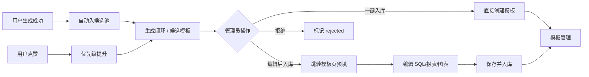
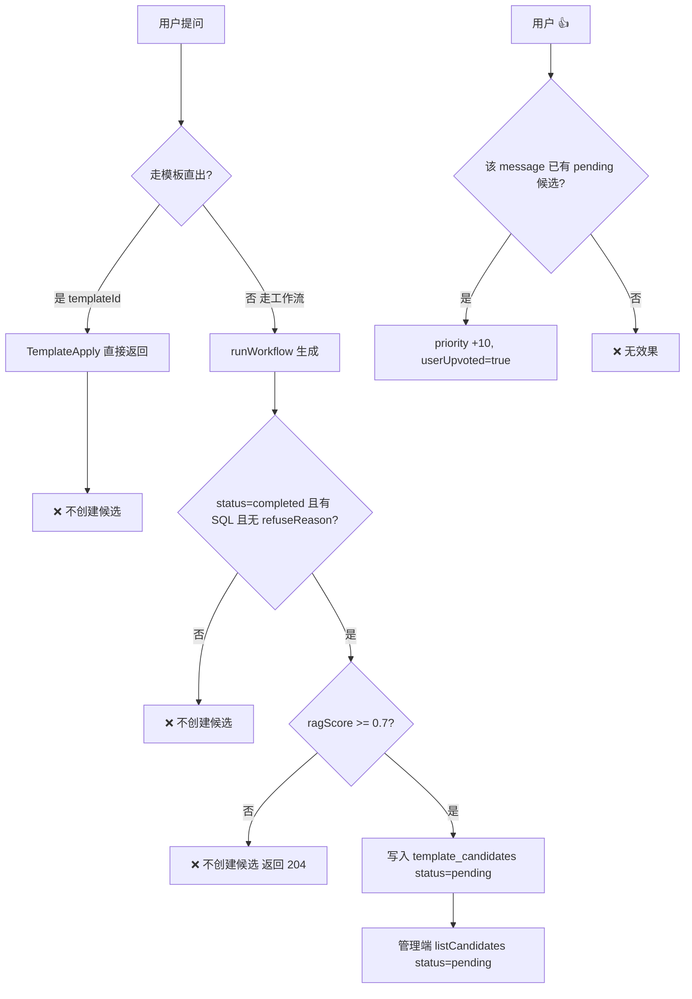

# Template selection functionality

- **ID**: `33595f2f-d5b8-4d77-a8da-7e987f700872`
- **创建时间**: 2026-07-03 10:53
- **模式**: agent
- **Agentic**: True

---

## 用户

帮我确认下当前管理端，是否已经有候选模板选择入库的功能？
比如当用户点赞后，生成的模板，有没有地方，管理员可以编辑，和选择入模板库。
报表和sql的要能区分开。
和我确认下有没有，还有如果没有，再和我探讨下怎么添加这个功能，页面再哪里

## 助手

正在检索管理端与模板库相关实现，确认是否已有候选模板入库功能。

<details>
<summary>Tool: mcp-codegraph-codegraph_explore</summary>

```json
{
  "rawArgs": "{\"name\":\"user-codegraph-codegraph_explore\",\"args\":{\"query\":\"管理端候选模板选择入库 点赞后生成的模板 管理员编辑 模板库 report sql template candidate admin\"},\"toolCallId\":\"tool_c83bb82d-0f31-4bc7-bd16-51f4e1621fc\",\"providerIdentifier\":\"codegraph\",\"toolName\":\"codegraph_explore\",\"smartModeApprovalOnly\":false,\"skipApproval\":true}",
  "params": "{\"tools\":[{\"name\":\"codegraph_explore\",\"parameters\":\"{\\\"query\\\":\\\"管理端候选模板选择入库 点赞后生成的模板 管理员编辑 模板库 report sql template candidate admin\\\"}\",\"serverName\":\"codegraph\"}]}",
  "result": "{\"result\":\"{\\\"content\\\":[{\\\"type\\\":\\\"text\\\",\\\"text\\\":\\\"Error: Tool execution failed: No CodeGraph project is loaded for this session.\\\\nSearched for a .codegraph/ directory starting from: /Users/dezliu/Documents/mine/repo/nl-hermes\\\\nThe index is likely fine — this is a working-directory detection issue: the MCP client launched the server outside your project and didn't report the workspace root. Fix it either way:\\\\n  • Pass projectPath to the tool call, e.g. projectPath: \\\\\\\"/absolute/path/to/your/project\\\\\\\"\\\\n  • Or add --path to the server's MCP config args: [\\\\\\\"serve\\\\\\\", \\\\\\\"--mcp\\\\\\\", \\\\\\\"--path\\\\\\\", \\\\\\\"/absolute/path/to/your/project\\\\\\\"]\\\"}]}\"}",
  "status": "completed"
}
```
</details>

<details>
<summary>Tool: semantic_search_full</summary>

```json
{
  "rawArgs": "{\"query\":\"admin template library candidate selection after user like\",\"targetDirectories\":[],\"explanation\":\"\"}",
  "params": "{\"query\":\"admin template library candidate selection after user like\",\"topK\":10,\"explanation\":\"\"}",
  "result": "{\"codeResults\":[{\"codeBlock\":{\"relativeWorkspacePath\":\"./apps/web-admin/lib/api.ts\",\"range\":{\"startPosition\":{\"line\":203,\"column\":2},\"endPosition\":{\"line\":239,\"column\":1}},\"signatures\":{},\"detailedLines\":[{\"text\":\"export type TemplateCandidateItem = {\",\"lineNumber\":206,\"isSignature\":true},{\"text\":\"  id: string;\",\"lineNumber\":207},{\"text\":\"  sourceMessageId: string;\",\"lineNumber\":208},{\"text\":\"  conversationId: string;\",\"lineNumber\":209},{\"text\":\"  mode: 'sql' | 'report';\",\"lineNumber\":210},{\"text\":\"  userQuery: string;\",\"lineNumber\":211},{\"text\":\"  scenarioDescription: string;\",\"lineNumber\":212},{\"text\":\"  sqlBody: string;\",\"lineNumber\":213},{\"text\":\"  chartType?: 'line' | 'bar' | 'table' | null;\",\"lineNumber\":214},{\"text\":\"  chartConfig?: Record<string, unknown> | null;\",\"lineNumber\":215},{\"text\":\"  ragScore?: number | null;\",\"lineNumber\":216},{\"text\":\"  userUpvoted: boolean;\",\"lineNumber\":217},{\"text\":\"  priority: number;\",\"lineNumber\":218},{\"text\":\"  status: 'pending' | 'approved' | 'rejected';\",\"lineNumber\":219},{\"text\":\"  templateId?: string | null;\",\"lineNumber\":220},{\"text\":\"  createdAt?: string;\",\"lineNumber\":221},{\"text\":\"};\",\"lineNumber\":222,\"isSignature\":true},{\"lineNumber\":223},{\"text\":\"export type GenerationFeedbackItem = {\",\"lineNumber\":224,\"isSignature\":true},{\"text\":\"  id: string;\",\"lineNumber\":225},{\"text\":\"  messageId: string;\",\"lineNumber\":226},{\"text\":\";\",\"lineNumber\":240,\"isSignature\":true}]},\"score\":0.3165924549102783},{\"codeBlock\":{\"relativeWorkspacePath\":\"./apps/metadata-service/src/services/closed-loop-service.ts\",\"range\":{\"startPosition\":{\"line\":90},\"endPosition\":{\"line\":238,\"column\":1}},\"signatures\":{\"ranges\":[{\"startPosition\":{\"line\":91,\"column\":1},\"endPosition\":{\"line\":91,\"column\":8}},{\"startPosition\":{\"line\":91,\"column\":8},\"endPosition\":{\"line\":92,\"column\":3}}]},\"detailedLines\":[{\"text\":\"export class ClosedLoopService {\",\"lineNumber\":91,\"isSignature\":true},{\"lineNumber\":147},{\"lineNumber\":148},{\"text\":\"  async approveCandidate(\",\"lineNumber\":149},{\"text\":\"    id: string,\",\"lineNumber\":150},{\"text\":\"    input: { name?: string; inLibrary?: boolean; createdBy?: string },\",\"lineNumber\":151},{\"text\":\"    traceId?: string,\",\"lineNumber\":152},{\"text\":\"  ) {\",\"lineNumber\":153},{\"text\":\"    const candidate = await this.repo.findCandidate(id);\",\"lineNumber\":154},{\"text\":\"    if (!candidate || candidate.status !== 'pending') return null;\",\"lineNumber\":155},{\"lineNumber\":156},{\"text\":\"    if (candidate.mode === 'sql') {\",\"lineNumber\":157},{\"text\":\"      const tpl = await this.templateRepos.template.insertSql({\",\"lineNumber\":158},{\"text\":\"        id: newId(),\",\"lineNumber\":159},{\"text\":\"        name: input.name ?? candidate.userQuery.slice(0, 64),\",\"lineNumber\":160},{\"text\":\"        scenarioDescription: candidate.scenarioDescription,\",\"lineNumber\":161},{\"text\":\"        sqlBody: candidate.sqlBody,\",\"lineNumber\":162},{\"text\":\"        status: input.inLibrary ? 'active' : 'draft',\",\"lineNumber\":163},{\"text\":\"        inLibrary: input.inLibrary ?? false,\",\"lineNumber\":164},{\"text\":\"        usageCount: 0,\",\"lineNumber\":165},{\"text\":\"        score: candidate.ragScore ?? null,\",\"lineNumber\":166},{\"text\":\"        createdBy: input.createdBy,\",\"lineNumber\":167},{\"text\":\"      });\",\"lineNumber\":168},{\"text\":\"      const updated = await this.repo.patchCandidate(id, {\",\"lineNumber\":169},{\"text\":\"        status: 'approved',\",\"lineNumber\":170},{\"text\":\"        templateId: tpl.id,\",\"lineNumber\":171},{\"text\":\"      });\",\"lineNumber\":172},{\"text\":\"      this.logger.info('closed_loop.candidate.approved', { traceId, candidateId: id, templateId: tpl.id });\",\"lineNumber\":173},{\"text\":\"      return { candidate: updated, template: tpl };\",\"lineNumber\":174},{\"text\":\"    }\",\"lineNumber\":175},{\"lineNumber\":176},{\"text\":\"    const chartType = candidate.chartType ?? 'table';\",\"lineNumber\":177},{\"text\":\"    const tpl = await this.templateRepos.template.insertReport({\",\"lineNumber\":178},{\"text\":\"      id: newId(),\",\"lineNumber\":179},{\"text\":\"      name: input.name ?? candidate.userQuery.slice(0, 64),\",\"lineNumber\":180},{\"text\":\"      scenarioDescription: candidate.scenarioDescription,\",\"lineNumber\":181},{\"text\":\"      sqlBody: candidate.sqlBody,\",\"lineNumber\":182},{\"text\":\"      chartType,\",\"lineNumber\":183},{\"text\":\"      chartConfig: candidate.chartConfig ?? { xField: '', yField: '' },\",\"lineNumber\":184},{\"text\":\"      status: input.inLibrary ? 'active' : 'draft',\",\"lineNumber\":185},{\"text\":\"      inLibrary: input.inLibrary ?? false,\",\"lineNumber\":186},{\"text\":\"      usageCount: 0,\",\"lineNumber\":187},{\"text\":\"      score: candidate.ragScore ?? null,\",\"lineNumber\":188},{\"text\":\"      createdBy: input.createdBy,\",\"lineNumber\":189},{\"text\":\"    });\",\"lineNumber\":190},{\"text\":\"    const updated = await this.repo.patchCandidate(id, {\",\"lineNumber\":191},{\"text\":\"      status: 'approved',\",\"lineNumber\":192},{\"text\":\"      templateId: tpl.id,\",\"lineNumber\":193},{\"text\":\"    });\",\"lineNumber\":194},{\"text\":\"    this.logger.info('closed_loop.candidate.approved', { traceId, candidateId: id, templateId: tpl.id });\",\"lineNumber\":195},{\"text\":\"    return { candidate: updated, template: tpl };\",\"lineNumber\":196},{\"text\":\"  }\",\"lineNumber\":197},{\"lineNumber\":198},{\"text\":\"  async createFeedbackItem(input: CreateFeedbackInput, traceId?: string) {\",\"lineNumber\":199},{\"text\":\"    const id = newId();\",\"lineNumber\":200},{\"text\":\"  }\",\"lineNumber\":217},{\"text\":\"}\",\"lineNumber\":239,\"isSignature\":true}]},\"score\":0.3108660578727722},{\"codeBlock\":{\"relativeWorkspacePath\":\"./apps/web-admin/lib/api.ts\",\"range\":{\"startPosition\":{\"line\":239,\"column\":2},\"endPosition\":{\"line\":281,\"column\":1}},\"signatures\":{},\"detailedLines\":[{\"text\":\"export const closedLoopApi = {\",\"lineNumber\":242},{\"text\":\"  listCandidates: (status?: string) =>\",\"lineNumber\":243},{\"text\":\"    request<{ items: TemplateCandidateItem[] }>(\",\"lineNumber\":244},{\"text\":\"      METADATA_URL,\",\"lineNumber\":245},{\"text\":\"      `/v1/template-candidates${status ? `?status=${status}` : ''}`,\",\"lineNumber\":246},{\"text\":\"    ),\",\"lineNumber\":247},{\"text\":\"  approveCandidate: (id: string, body?: { name?: string; inLibrary?: boolean }) =>\",\"lineNumber\":248},{\"text\":\"    request<{ candidate: TemplateCandidateItem; template: unknown }>(\",\"lineNumber\":249},{\"text\":\"      METADATA_URL,\",\"lineNumber\":250},{\"text\":\"      `/v1/template-candidates/${id}/approve`,\",\"lineNumber\":251},{\"text\":\"      { method: 'POST', body: JSON.stringify(body ?? { inLibrary: false }) },\",\"lineNumber\":252},{\"text\":\"    ),\",\"lineNumber\":253},{\"text\":\"  rejectCandidate: (id: string) =>\",\"lineNumber\":254},{\"text\":\"    request<{ item: TemplateCandidateItem }>(METADATA_URL, `/v1/template-candidates/${id}/reject`, {\",\"lineNumber\":255},{\"text\":\"      method: 'POST',\",\"lineNumber\":256},{\"text\":\"    }),\",\"lineNumber\":257},{\"text\":\"  listFeedback: (status?: string) =>\",\"lineNumber\":258},{\"text\":\"    request<{ items: GenerationFeedbackItem[] }>(\",\"lineNumber\":259},{\"text\":\"      METADATA_URL,\",\"lineNumber\":260},{\"text\":\"      `/v1/generation-feedback${status ? `?status=${status}` : ''}`,\",\"lineNumber\":261},{\"text\":\"    ),\",\"lineNumber\":262},{\"text\":\"  resolveFeedback: (id: string, body?: { resultTemplateId?: string }) =>\",\"lineNumber\":263},{\"text\":\"    request<{ item: GenerationFeedbackItem }>(METADATA_URL, `/v1/generation-feedback/${id}/resolve`, {\",\"lineNumber\":264},{\"text\":\"      method: 'PATCH',\",\"lineNumber\":265},{\"text\":\"      body: JSON.stringify(body ?? {}),\",\"lineNumber\":266},{\"text\":\"    }),\",\"lineNumber\":267},{\"text\":\"};\",\"lineNumber\":268},{\"lineNumber\":269},{\"text\":\"export const ragApi = {\",\"lineNumber\":270},{\"text\":\"  retrieve: (body: unknown) =>\",\"lineNumber\":271},{\"text\":\"    request\",\"lineNumber\":272},{\"lineNumber\":276},{\"text\":\",\",\"lineNumber\":281},{\"text\":\"};\",\"lineNumber\":282}]},\"score\":0.30218228697776794},{\"codeBlock\":{\"relativeWorkspacePath\":\"./apps/web-admin/app/generation-closed-loop/page.tsx\",\"range\":{\"startPosition\":{\"line\":17,\"column\":1},\"endPosition\":{\"line\":231,\"column\":1}},\"signatures\":{},\"detailedLines\":[{\"text\":\"export default function GenerationClosedLoopPage() {\",\"lineNumber\":20,\"isSignature\":true},{\"text\":\"  const router = useRouter();\",\"lineNumber\":21},{\"text\":\"  const [tab, setTab] = useState('candidates');\",\"lineNumber\":22},{\"text\":\"  const [candidates, setCandidates] = useState<TemplateCandidateItem[]>([]);\",\"lineNumber\":23},{\"text\":\"  const [feedbackItems, setFeedbackItems] = useState<GenerationFeedbackItem[]>([]);\",\"lineNumber\":24},{\"text\":\"  const [loading, setLoading] = useState(false);\",\"lineNumber\":25},{\"text\":\"  const [sqlPreview, setSqlPreview] = useState<string | null>(null);\",\"lineNumber\":26},{\"lineNumber\":27},{\"text\":\"  const load = useCallback(async () => {\",\"lineNumber\":28},{\"text\":\"    setLoading(true);\",\"lineNumber\":29},{\"text\":\"    try {\",\"lineNumber\":30},{\"text\":\"      const [cand, fb] = await Promise.all([\",\"lineNumber\":31},{\"text\":\"        closedLoopApi.listCandidates('pending'),\",\"lineNumber\":32},{\"text\":\"        closedLoopApi.listFeedback('open'),\",\"lineNumber\":33},{\"text\":\"      ]);\",\"lineNumber\":34},{\"text\":\"      setCandidates(cand.items);\",\"lineNumber\":35},{\"text\":\"      setFeedbackItems(fb.items);\",\"lineNumber\":36},{\"text\":\"    } catch (err) {\",\"lineNumber\":37},{\"text\":\"      message.error(err instanceof Error ? err.message : '加载失败');\",\"lineNumber\":38},{\"text\":\"    } finally {\",\"lineNumber\":39},{\"text\":\"      setLoading(false);\",\"lineNumber\":40},{\"text\":\"    }\",\"lineNumber\":41},{\"text\":\"  }, []);\",\"lineNumber\":42},{\"lineNumber\":43},{\"text\":\"  useEffect(() => {\",\"lineNumber\":44},{\"text\":\"    void load();\",\"lineNumber\":45},{\"text\":\"  }, [load]);\",\"lineNumber\":46},{\"lineNumber\":47},{\"text\":\"  const handleApprove = async (row: TemplateCandidateItem, inLibrary: boolean) => {\",\"lineNumber\":48},{\"text\":\"    try {\",\"lineNumber\":49},{\"text\":\"      await closedLoopApi.approveCandidate(row.id, {\",\"lineNumber\":50},{\"text\":\"        name: row.userQuery.slice(0, 64),\",\"lineNumber\":51},{\"text\":\"        inLibrary,\",\"lineNumber\":52},{\"text\":\"      });\",\"lineNumber\":53},{\"text\":\"      message.success(inLibrary ? '已入库为 draft 模板' : '已创建 draft 模板');\",\"lineNumber\":54},{\"text\":\"      await ragApi.rebuildIndex('templates');\",\"lineNumber\":55},{\"text\":\"      await load();\",\"lineNumber\":56},{\"text\":\"    } catch (err) {\",\"lineNumber\":57},{\"text\":\"      message.error(err instanceof Error ? err.message : '入库失败');\",\"lineNumber\":58},{\"text\":\"    }\",\"lineNumber\":59},{\"text\":\"  };\",\"lineNumber\":60},{\"lineNumber\":61},{\"text\":\"  const handleReject = async (id: string) => {\",\"lineNumber\":62},{\"text\":\"    try {\",\"lineNumber\":63},{\"text\":\"      await closedLoopApi.rejectCandidate(id);\",\"lineNumber\":64},{\"text\":\"      message.success('已拒绝');\",\"lineNumber\":65},{\"text\":\"      await load();\",\"lineNumber\":66},{\"text\":\"    } catch {\",\"lineNumber\":67},{\"text\":\"      message.error('操作失败');\",\"lineNumber\":68},{\"text\":\"    }\",\"lineNumber\":69},{\"text\":\"  };\",\"lineNumber\":70},{\"lineNumber\":71},{\"text\":\"  const handleProcessFeedback = (row: GenerationFeedbackItem) =>\",\"lineNumber\":72},{\"text\":\";\",\"lineNumber\":82},{\"text\":\"}\",\"lineNumber\":232,\"isSignature\":true}]},\"score\":0.2860676944255829},{\"codeBlock\":{\"relativeWorkspacePath\":\"./packages/orm-schemas/src/models/template-candidate.ts\",\"range\":{\"startPosition\":{\"column\":45},\"endPosition\":{\"line\":29,\"column\":1}},\"signatures\":{},\"detailedLines\":[{\"text\":\"import { META_TABLES } from '../schemas.js';\",\"lineNumber\":2},{\"lineNumber\":3},{\"text\":\"export class TemplateCandidateModel extends BaseModel {\",\"lineNumber\":4,\"isSignature\":true},{\"text\":\"  id!: string;\",\"lineNumber\":5},{\"text\":\"  sourceMessageId!: string;\",\"lineNumber\":6},{\"text\":\"  conversationId!: string;\",\"lineNumber\":7},{\"text\":\"  mode!: 'sql' | 'report';\",\"lineNumber\":8},{\"text\":\"  userQuery!: string;\",\"lineNumber\":9},{\"text\":\"  scenarioDescription!: string;\",\"lineNumber\":10},{\"text\":\"  sqlBody!: string;\",\"lineNumber\":11},{\"text\":\"  chartType?: 'line' | 'bar' | 'table' | null;\",\"lineNumber\":12},{\"text\":\"  chartConfig?: unknown | null;\",\"lineNumber\":13},{\"text\":\"  ragScore?: number | null;\",\"lineNumber\":14},{\"text\":\"  userUpvoted!: boolean;\",\"lineNumber\":15},{\"text\":\"  priority!: number;\",\"lineNumber\":16},{\"text\":\"  status!: 'pending' | 'approved' | 'rejected';\",\"lineNumber\":17},{\"text\":\"  templateId?: string | null;\",\"lineNumber\":18},{\"lineNumber\":19},{\"text\":\"  static tableName = META_TABLES.TEMPLATE_CANDIDATES;\",\"lineNumber\":20},{\"lineNumber\":21},{\"text\":\"  $beforeInsert() {\",\"lineNumber\":22},{\"text\":\"    const now = new Date().toISOString().slice(0, 23).replace('T', ' ');\",\"lineNumber\":23},{\"text\":\"    if (!this.createdAt) this.createdAt = now;\",\"lineNumber\":24},{\"text\":\"  }\",\"lineNumber\":25},{\"lineNumber\":26},{\"text\":\"  $beforeUpdate() {\",\"lineNumber\":27},{\"text\":\"    // template_candidates has no updated_at\",\"lineNumber\":28},{\"text\":\"  }\",\"lineNumber\":29},{\"text\":\"}\",\"lineNumber\":30,\"isSignature\":true}]},\"score\":0.27427786588668823},{\"codeBlock\":{\"relativeWorkspacePath\":\"./docs/plans/sql_幻觉字段分析_7a97290b.plan.md\",\"range\":{\"startPosition\":{\"line\":350},\"endPosition\":{\"line\":399}},\"signatures\":{},\"detailedLines\":[{\"text\":\"失败/成功均写入：\",\"lineNumber\":352},{\"lineNumber\":353},{\"text\":\"```json\",\"lineNumber\":354},{\"text\":\"{\",\"lineNumber\":355},{\"text\":\"  \\\"sql\\\": \\\"...\\\",\",\"lineNumber\":356},{\"text\":\"  \\\"ragScore\\\": 0.82,\",\"lineNumber\":357},{\"text\":\"  \\\"chartConfig\\\": {},\",\"lineNumber\":358},{\"text\":\"  \\\"refuseReason\\\": \\\"SQL 校验未通过：...\\\",\",\"lineNumber\":359},{\"text\":\"  \\\"lastError\\\": \\\"...\\\",\",\"lineNumber\":360},{\"text\":\"  \\\"workflowNode\\\": \\\"ValidateResult\\\",\",\"lineNumber\":361},{\"text\":\"  \\\"userQuery\\\": \\\"业务员想要查看自己的派费收入\\\"\",\"lineNumber\":362},{\"text\":\"}\",\"lineNumber\":363},{\"text\":\"```\",\"lineNumber\":364},{\"lineNumber\":365},{\"text\":\"**4. 复用 `generation_audit`**\",\"lineNumber\":366},{\"lineNumber\":367},{\"text\":\"在生成完成时写入：`user_id`、`mode`、`used_template`、`interrupted`、`trace_id`，并扩展 `message_id` 字段（需迁移）。\",\"lineNumber\":368},{\"lineNumber\":369},{\"text\":\"### 后端 API（metadata-service + orchestrator）\",\"lineNumber\":370},{\"lineNumber\":371},{\"text\":\"| 端点 | 职责 |\",\"lineNumber\":372},{\"text\":\"|------|------|\",\"lineNumber\":373},{\"text\":\"| `POST /internal/candidates`（orchestrator 内部） | 生成成功后异步创建候选 |\",\"lineNumber\":374},{\"text\":\"| `GET /v1/template-candidates?status=pending` | 管理端列表，按 priority DESC |\",\"lineNumber\":375},{\"text\":\"| `POST /v1/template-candidates/:id/approve` | 创建 draft 模板 + 可选直接 in_library |\",\"lineNumber\":376},{\"text\":\"| `POST /v1/template-candidates/:id/reject` | 拒绝候选 |\",\"lineNumber\":377},{\"text\":\"| `GET /v1/generation-feedback?status=open` | 失败/不满意反馈队列 |\",\"lineNumber\":378},{\"text\":\"| `PATCH /v1/generation-feedback/:id/resolve` | 标记已处理，关联 template_id |\",\"lineNumber\":379},{\"lineNumber\":380},{\"text\":\"orchestrator 侧：\",\"lineNumber\":381},{\"text\":\"- 扩展 [`FeedbackService`](apps/orchestrator/src/services/feedback-service.ts)：失败消息点踩校验 reason 必填；upvote 时回调 metadata-service 提升候选 priority\",\"lineNumber\":382},{\"text\":\"- 生成完成后调用候选创建（可 fire-and-forget）\",\"lineNumber\":383},{\"lineNumber\":384},{\"text\":\"### 管理端 UI\",\"lineNumber\":385},{\"lineNumber\":386},{\"text\":\"**新页面** [`apps/web-admin/app/generation-closed-loop/page.tsx`](apps/web-admin/app/generation-closed-loop/page.tsx)（或拆入 templates 页第二入口），两个 Tab：\",\"lineNumber\":387},{\"lineNumber\":388},{\"text\":\"**Tab 1 — 候选模板**\",\"lineNumber\":389},{\"text\":\"- 列：用户提问、模式、ragScore、是否点赞、SQL 预览、创建时间\",\"lineNumber\":390},{\"text\":\"- 操作：**入库**（打开 templates Drawer 预填 name/scenario/sql/chartConfig）、**拒绝**\",\"lineNumber\":391},{\"text\":\"- 入库后引导「收入模板库」+ 触发 [`ragApi.rebuildIndex('templates')`](apps/web-admin/app/templates/page.tsx)\",\"lineNumber\":392},{\"lineNumber\":393},{\"text\":\"**Tab 2 — 生成反馈**\",\"lineNumber\":394},{\"text\":\"- 列：用户提问、失败原因、最后 SQL 草案、用户反馈原因、模式、时间、状态\",\"lineNumber\":395},{\"text\":\"- 操作：**去处理** → 深链 `/templates?tab={mode}&prefill={base64}` 打开编辑 Drawer\",\"lineNumber\":396},{\"text\":\"- **标记已处理** + 可选备注\",\"lineNumber\":397},{\"lineNumber\":398},{\"text\":\"[`AdminLayout`](apps/web-admin/components/AdminLayout.tsx) 导航新增「生成闭环」。\",\"lineNumber\":399}]},\"score\":0.26754385232925415},{\"codeBlock\":{\"relativeWorkspacePath\":\"./apps/web-admin/app/templates/page.tsx\",\"range\":{\"startPosition\":{\"line\":52},\"endPosition\":{\"line\":307,\"column\":1}},\"signatures\":{\"ranges\":[{\"startPosition\":{\"line\":53,\"column\":1},\"endPosition\":{\"line\":54,\"column\":3}}]},\"detailedLines\":[{\"text\":\"function TemplatesPageContent() {\",\"lineNumber\":53,\"isSignature\":true},{\"text\":\"const openCreate = \",\"lineNumber\":105},{\"text\":\";\",\"lineNumber\":114},{\"text\":\"    setDrawerOpen(true);\",\"lineNumber\":115},{\"text\":\"  };\",\"lineNumber\":116},{\"lineNumber\":117},{\"text\":\"  const openEdit = (row: SqlTemplateItem | ReportTemplateItem) => {\",\"lineNumber\":118},{\"text\":\"    setEditing(row);\",\"lineNumber\":119},{\"text\":\"    setSourceFeedbackId(undefined);\",\"lineNumber\":120},{\"text\":\"    form.setFieldsValue(row);\",\"lineNumber\":121},{\"text\":\"    setDrawerOpen(true);\",\"lineNumber\":122},{\"text\":\"  };\",\"lineNumber\":123},{\"lineNumber\":124},{\"text\":\"  const rebuildTemplatesIndex = async () => {\",\"lineNumber\":125},{\"text\":\"    await ragApi.rebuildIndex('templates');\",\"lineNumber\":126},{\"text\":\"    message.info('模板索引已重建');\",\"lineNumber\":127},{\"text\":\"  };\",\"lineNumber\":128},{\"lineNumber\":129},{\"text\":\"  const onSave = async () => {\",\"lineNumber\":130},{\"text\":\"    const values = await form.validateFields();\",\"lineNumber\":131},{\"text\":\"    try {\",\"lineNumber\":132},{\"text\":\"      let templateId: string | undefined;\",\"lineNumber\":133},{\"text\":\"      if (tab === 'sql') {\",\"lineNumber\":134},{\"text\":\"        if (editing) {\",\"lineNumber\":135},{\"text\":\"          await templateApi.updateSql(editing.id, values);\",\"lineNumber\":136},{\"text\":\"          templateId = editing.id;\",\"lineNumber\":137},{\"text\":\"        } else {\",\"lineNumber\":138},{\"text\":\"          const res = await templateApi.createSql(values);\",\"lineNumber\":139},{\"text\":\"          templateId = res.item.id;\",\"lineNumber\":140},{\"text\":\"        }\",\"lineNumber\":141},{\"text\":\"      } else if (editing) {\",\"lineNumber\":142},{\"text\":\"        await templateApi.updateReport(editing.id, values);\",\"lineNumber\":143},{\"text\":\"        templateId = editing.id;\",\"lineNumber\":144},{\"text\":\"      } else {\",\"lineNumber\":145},{\"text\":\"        const res = await templateApi.createReport(values);\",\"lineNumber\":146},{\"text\":\"        templateId = res.item.id;\",\"lineNumber\":147},{\"text\":\"      }\",\"lineNumber\":148},{\"text\":\"      if (sourceFeedbackId && templateId) {\",\"lineNumber\":149},{\"text\":\"        await closedLoopApi.resolveFeedback(sourceFeedbackId, { resultTemplateId: templateId });\",\"lineNumber\":150},{\"text\":\"      }\",\"lineNumber\":151},{\"text\":\"      message.success('已保存');\",\"lineNumber\":152},{\"text\":\"      setDrawerOpen(false);\",\"lineNumber\":153},{\"text\":\"      setSourceFeedbackId(undefined);\",\"lineNumber\":154},{\"text\":\"      await load();\",\"lineNumber\":155},{\"text\":\"      await rebuildTemplatesIndex();\",\"lineNumber\":156},{\"text\":\"    } catch (e) {\",\"lineNumber\":157},{\"text\":\"      message.error(e instanceof Error ? e.message : '保存失败');\",\"lineNumber\":158},{\"text\":\"    }\",\"lineNumber\":159},{\"text\":\"  };\",\"lineNumber\":160},{\"lineNumber\":161},{\"text\":\"  const toggleLibrary = async (row: SqlTemplateItem | ReportTemplateItem) => {\",\"lineNumber\":162},{\"text\":\"    const body = { inLibrary: !row.inLibrary, status: row.inLibrary ? row.status : 'active' as const };\",\"lineNumber\":163},{\"text\":\"    try {\",\"lineNumber\":164},{\"text\":\"      if (tab === 'sql') {\",\"lineNumber\":165},{\"text\":\"        await templateApi.updateSql(row.id, body);\",\"lineNumber\":166},{\"text\":\"      } else {\",\"lineNumber\":167},{\"text\":\"        await templateApi.updateReport(row.id, body);\",\"lineNumber\":168},{\"text\":\"      }\",\"lineNumber\":169},{\"text\":\"      message.success(body.inLibrary ? '已收入模板库' : '已移出模板库');\",\"lineNumber\":170},{\"text\":\"      await load();\",\"lineNumber\":171},{\"text\":\"      await rebuildTemplatesIndex();\",\"lineNumber\":172},{\"text\":\"    } catch {\",\"lineNumber\":173},{\"text\":\"      message.error('操作失败');\",\"lineNumber\":174},{\"text\":\"    }\",\"lineNumber\":175},{\"text\":\"  };\",\"lineNumber\":176},{\"lineNumber\":177},{\"text\":\"  const columns = [\",\"lineNumber\":178},{\"text\":\"    { title: '名称', dataIndex: 'name', width: 180 },\",\"lineNumber\":179},{\"text\":\",\",\"lineNumber\":210},{\"text\":\"  ];\",\"lineNumber\":211},{\"text\":\"}\",\"lineNumber\":308,\"isSignature\":true}]},\"score\":0.253358393907547},{\"codeBlock\":{\"relativeWorkspacePath\":\"./docs/plans/sql_幻觉字段分析_7a97290b.plan.md\",\"range\":{\"startPosition\":{\"line\":263},\"endPosition\":{\"line\":305}},\"signatures\":{},\"detailedLines\":[{\"text\":\"### 现状与缺口\",\"lineNumber\":265},{\"lineNumber\":266},{\"text\":\"| 能力 | 现状 | 缺口 |\",\"lineNumber\":267},{\"text\":\"|------|------|------|\",\"lineNumber\":268},{\"text\":\"| 生成结果持久化 | [`chat-service.ts`](apps/orchestrator/src/services/chat-service.ts) 已在 `messages.metadata` 存 `sql`、`ragScore`、`chartConfig` | 失败时未存 `refuseReason`/`lastError`；未关联用户提问 |\",\"lineNumber\":269},{\"text\":\"| 满意度反馈 | [`message_feedback`](migrations/chat/migrations/20260701000001_init.ts) + 用户端 👍👎 | **仅 `status=completed` 显示反馈**；失败消息无法点踩 |\",\"lineNumber\":270},{\"text\":\"| 模板入库 | [`templates/page.tsx`](apps/web-admin/app/templates/page.tsx) 手动创建 +「收入库」开关 | 无「从成功生成自动候选」流程 |\",\"lineNumber\":271},{\"text\":\"| 失败处置 | [`alerts/page.tsx`](apps/web-admin/app/alerts/page.tsx) 告警列表 | 无「用户提问 + 失败 SQL + 反馈原因」专项队列 |\",\"lineNumber\":272},{\"text\":\"| 审计表 | `generation_audit` 已建表 | **未写入**，字段不足以支撑闭环 |\",\"lineNumber\":273},{\"lineNumber\":274},{\"text\":\"### 目标流程\",\"lineNumber\":275},{\"lineNumber\":276},{\"text\":\"```mermaid\",\"lineNumber\":277},{\"text\":\"flowchart TD\",\"lineNumber\":278},{\"text\":\"  subgraph user [用户端]\",\"lineNumber\":279},{\"text\":\"    Q[提问] --> Gen[工作流生成]\",\"lineNumber\":280},{\"text\":\"    Gen -->|成功且ragScore>=阈值| Cand[自动写入候选池]\",\"lineNumber\":281},{\"text\":\"    Gen -->|失败| FailMsg[助手消息 status=failed]\",\"lineNumber\":282},{\"text\":\"    FailMsg --> Down[👎 反馈 原因必填]\",\"lineNumber\":283},{\"text\":\"    Gen -->|成功| UpDown[👍👎 可选]\",\"lineNumber\":284},{\"text\":\"    UpDown -->|👍| Boost[候选池 priority+1]\",\"lineNumber\":285},{\"text\":\"  end\",\"lineNumber\":286},{\"lineNumber\":287},{\"text\":\"  subgraph admin [管理端]\",\"lineNumber\":288},{\"text\":\"    Cand --> Pool[候选模板 Tab]\",\"lineNumber\":289},{\"text\":\"    Down --> Queue[失败反馈 Tab]\",\"lineNumber\":290},{\"text\":\"    Pool --> Approve[选择入库]\",\"lineNumber\":291},{\"text\":\"    Approve --> TplDraft[创建 draft 模板 prefill SQL+场景]\",\"lineNumber\":292},{\"text\":\"    TplDraft --> InLib[收入模板库 + 重建 RAG 索引]\",\"lineNumber\":293},{\"text\":\"    Queue --> Handle[去处理]\",\"lineNumber\":294},{\"text\":\"    Handle --> TplEdit[\\\"/templates?tab=sql|report&prefill=...\\\"]\",\"lineNumber\":295},{\"text\":\"  end\",\"lineNumber\":296},{\"text\":\"```\",\"lineNumber\":297},{\"lineNumber\":298},{\"text\":\"### 入选规则（已确认）\",\"lineNumber\":299},{\"lineNumber\":300},{\"text\":\"**候选模板（成功路径）**——两者结合：\",\"lineNumber\":301},{\"text\":\"- **自动入池**：`status=completed`、非套用模板（`metadata.appliedTemplate !== true`）、有 `generatedSql`、`ragScore >= 阈值`（默认 0.7，可写入 `system_settings`）\",\"lineNumber\":302},{\"text\":\"- **点赞优先**：用户对同条消息 👍 后，`priority` 提升，管理端列表置顶展示\",\"lineNumber\":303},{\"text\":\"- **不入池**：已存在相同 message 的候选、或 SQL 为空\",\"lineNumber\":304}]},\"score\":0.25159209966659546},{\"codeBlock\":{\"relativeWorkspacePath\":\"./apps/web-admin/app/generation-closed-loop/page.tsx\",\"range\":{\"startPosition\":{\"line\":19},\"endPosition\":{\"line\":231,\"column\":1}},\"signatures\":{\"ranges\":[{\"startPosition\":{\"line\":20,\"column\":1},\"endPosition\":{\"line\":20,\"column\":16}},{\"startPosition\":{\"line\":20,\"column\":16},\"endPosition\":{\"line\":21,\"column\":3}}]},\"detailedLines\":[{\"text\":\"export default function GenerationClosedLoopPage() {\",\"lineNumber\":20,\"isSignature\":true},{\"text\":\"</p>\",\"lineNumber\":99},{\"lineNumber\":100},{\"text\":\"      <Tabs\",\"lineNumber\":101},{\"text\":\"        activeKey={tab}\",\"lineNumber\":102},{\"text\":\"        onChange={setTab}\",\"lineNumber\":103},{\"text\":\"        items={[\",\"lineNumber\":104},{\"text\":\"          {\",\"lineNumber\":105},{\"text\":\"            key: 'candidates',\",\"lineNumber\":106},{\"text\":\"            label: `候选模板 (${candidates.length})`,\",\"lineNumber\":107},{\"text\":\"            children: (\",\"lineNumber\":108},{\"text\":\"              <Table\",\"lineNumber\":109},{\"text\":\"                rowKey=\\\"id\\\"\",\"lineNumber\":110},{\"text\":\"                loading={loading}\",\"lineNumber\":111},{\"text\":\"                dataSource={candidates}\",\"lineNumber\":112},{\"text\":\"                columns={[\",\"lineNumber\":113},{\"text\":\"                  { title: '用户提问', dataIndex: 'userQuery', ellipsis: true },\",\"lineNumber\":114},{\"text\":\"                  {\",\"lineNumber\":115},{\"text\":\"                    title: '模式',\",\"lineNumber\":116},{\"text\":\"                    dataIndex: 'mode',\",\"lineNumber\":117},{\"text\":\"                    width: 80,\",\"lineNumber\":118},{\"text\":\"                    render: (v: string) => <Tag>{v.toUpperCase()}</Tag>,\",\"lineNumber\":119},{\"text\":\"                  },\",\"lineNumber\":120},{\"text\":\"                  {\",\"lineNumber\":121},{\"text\":\"                    title: 'RAG 分',\",\"lineNumber\":122},{\"text\":\"                    dataIndex: 'ragScore',\",\"lineNumber\":123},{\"text\":\"                    width: 80,\",\"lineNumber\":124},{\"text\":\"                    render: (v: number | null) => (v != null ? Number(v).toFixed(2) : '—'),\",\"lineNumber\":125},{\"text\":\"                  },\",\"lineNumber\":126},{\"text\":\"                  {\",\"lineNumber\":127},{\"text\":\"                    title: '点赞',\",\"lineNumber\":128},{\"text\":\"                    dataIndex: 'userUpvoted',\",\"lineNumber\":129},{\"text\":\"                    width: 70,\",\"lineNumber\":130},{\"text\":\"                    render: (v: boolean) => (v ? '👍' : '—'),\",\"lineNumber\":131},{\"text\":\"                  },\",\"lineNumber\":132},{\"text\":\"                  {\",\"lineNumber\":133},{\"text\":\"                    title: '优先级',\",\"lineNumber\":134},{\"text\":\"                    dataIndex: 'priority',\",\"lineNumber\":135},{\"text\":\"                    width: 80,\",\"lineNumber\":136},{\"text\":\"                  },\",\"lineNumber\":137},{\"text\":\"                  {\",\"lineNumber\":138},{\"text\":\"                    title: 'SQL',\",\"lineNumber\":139},{\"text\":\"                    width: 100,\",\"lineNumber\":140},{\"text\":\"                    render: (_: unknown, row: TemplateCandidateItem) => (\",\"lineNumber\":141},{\"text\":\"                      <Button type=\\\"link\\\" size=\\\"small\\\" onClick={() => setSqlPreview(row.sqlBody)}>\",\"lineNumber\":142},{\"text\":\"                        预览\",\"lineNumber\":143},{\"text\":\"                      </Button>\",\"lineNumber\":144},{\"text\":\"                    ),\",\"lineNumber\":145},{\"text\":\"                  },\",\"lineNumber\":146},{\"text\":\"                  {\",\"lineNumber\":147},{\"text\":\"                    title: '操作',\",\"lineNumber\":148},{\"text\":\"}\",\"lineNumber\":232,\"isSignature\":true}]},\"score\":0.23854470252990723},{\"codeBlock\":{\"relativeWorkspacePath\":\"./docs/plans/sql_幻觉字段分析_7a97290b.plan.md\",\"range\":{\"startPosition\":{\"line\":395},\"endPosition\":{\"line\":437}},\"signatures\":{},\"detailedLines\":[{\"text\":\"- 操作：**去处理** → 深链 `/templates?tab={mode}&prefill={base64}` 打开编辑 Drawer\",\"lineNumber\":396},{\"text\":\"- **标记已处理** + 可选备注\",\"lineNumber\":397},{\"lineNumber\":398},{\"text\":\"[`AdminLayout`](apps/web-admin/components/AdminLayout.tsx) 导航新增「生成闭环」。\",\"lineNumber\":399},{\"lineNumber\":400},{\"text\":\"[`templates/page.tsx`](apps/web-admin/app/templates/page.tsx) 支持 URL query 预填：\",\"lineNumber\":401},{\"lineNumber\":402},{\"text\":\"```typescript\",\"lineNumber\":403},{\"text\":\"// /templates?tab=sql&prefill=<base64({ name, scenarioDescription, sqlBody, sourceFeedbackId })>\",\"lineNumber\":404},{\"text\":\"```\",\"lineNumber\":405},{\"lineNumber\":406},{\"text\":\"### 用户端 UI\",\"lineNumber\":407},{\"lineNumber\":408},{\"text\":\"改 [`apps/web-user/app/page.tsx`](apps/web-user/app/page.tsx)：\",\"lineNumber\":409},{\"lineNumber\":410},{\"text\":\"- 当前仅 `m.status === 'completed'` 显示 👍👎 → 扩展为：\",\"lineNumber\":411},{\"text\":\"  - `completed`：👍👎，点踩原因选填（保持 PRD）\",\"lineNumber\":412},{\"text\":\"  - `failed` / `interrupted`（有 content）：仅 👎，**原因必填**（Modal 输入框）\",\"lineNumber\":413},{\"text\":\"- 点踩成功后 toast「感谢反馈，管理员将跟进优化」\",\"lineNumber\":414},{\"lineNumber\":415},{\"text\":\"### 与 SQL 幻觉修复的协同\",\"lineNumber\":416},{\"lineNumber\":417},{\"text\":\"- 失败反馈队列可直接消费「派费收入」类 case：管理员看到 `hwt_trade_info.order_type` 错误 + 用户提问，一键跳转模板页编写正确 JOIN SQL 并入库\",\"lineNumber\":418},{\"text\":\"- 成功高分候选可在 Grounding 修复后自动积累正确模板，减少同类幻觉复发\",\"lineNumber\":419},{\"lineNumber\":420},{\"text\":\"### 实施顺序（在层 A/B 之后或并行）\",\"lineNumber\":421},{\"lineNumber\":422},{\"text\":\"1. **数据层**：迁移 `template_candidates`、`generation_feedback_items`；增强 message metadata\",\"lineNumber\":423},{\"text\":\"2. **orchestrator**：生成完成写候选；反馈校验 + upvote 提权\",\"lineNumber\":424},{\"text\":\"3. **metadata-service**：候选/反馈 CRUD + approve 创建模板\",\"lineNumber\":425},{\"text\":\"4. **web-admin**：生成闭环页 + templates 预填深链\",\"lineNumber\":426},{\"text\":\"5. **web-user**：失败消息 👎 扩展\",\"lineNumber\":427},{\"text\":\"6. **测试**：候选入池条件、approve 创建模板、反馈 resolve 深链、upvote 排序\",\"lineNumber\":428},{\"lineNumber\":429},{\"text\":\"### 验证计划（生成闭环）\",\"lineNumber\":430},{\"lineNumber\":431},{\"text\":\"- [ ] 成功生成 ragScore=0.8 → 候选池出现记录\",\"lineNumber\":432},{\"text\":\"- [ ] 用户 👍 → 候选记录 priority 提升、列表置顶\",\"lineNumber\":433},{\"text\":\"- [ ] 管理员「入库」→ draft 模板创建，SQL/场景预填正确\",\"lineNumber\":434},{\"text\":\"- [ ] 生成失败 → 用户可 👎 填原因 → 管理端反馈 Tab 可见提问+SQL+原因\",\"lineNumber\":435},{\"text\":\"- [ ] 「去处理」→ 打开对应 sql/report 模板编辑页且字段预填\",\"lineNumber\":436},{\"text\":\"- [ ] 标记已处理 → 状态 resolved\",\"lineNumber\":437}]},\"score\":0.22927190363407135},{\"codeBlock\":{\"relativeWorkspacePath\":\"./apps/metadata-service/src/services/closed-loop-service.ts\",\"range\":{\"startPosition\":{\"line\":28,\"column\":2},\"endPosition\":{\"line\":238,\"column\":1}},\"signatures\":{},\"detailedLines\":[{\"text\":\"const DEFAULT_CANDIDATE_RAG_THRESHOLD = 0.7;\",\"lineNumber\":31},{\"text\":\"const UPVOTE_PRIORITY_BOOST = 10;\",\"lineNumber\":32},{\"lineNumber\":33},{\"text\":\"export class ClosedLoopRepository {\",\"lineNumber\":34,\"isSignature\":true},{\"text\":\"  private readonly chatKnex: Knex;\",\"lineNumber\":35},{\"lineNumber\":36},{\"text\":\"  constructor(chatKnex?: Knex) {\",\"lineNumber\":37},{\"text\":\"    this.chatKnex = chatKnex ?? createChatKnex();\",\"lineNumber\":38},{\"text\":\"  }\",\"lineNumber\":39},{\"lineNumber\":40},{\"text\":\"  listCandidates(status?: string) {\",\"lineNumber\":41},{\"text\":\"    let q = TemplateCandidateModel.query().orderBy('priority', 'desc').orderBy('created_at', 'desc');\",\"lineNumber\":42},{\"text\":\"    if (status) q = q.where('status', status);\",\"lineNumber\":43},{\"text\":\"    return q;\",\"lineNumber\":44},{\"text\":\"  }\",\"lineNumber\":45},{\"lineNumber\":46},{\"text\":\"  findCandidateByMessageId(messageId: string) {\",\"lineNumber\":47},{\"text\":\"    return TemplateCandidateModel.query().where('source_message_id', messageId).first();\",\"lineNumber\":48},{\"text\":\"  }\",\"lineNumber\":49},{\"lineNumber\":50},{\"text\":\"  findCandidate(id: string) {\",\"lineNumber\":51},{\"text\":\"    return TemplateCandidateModel.query().findById(id);\",\"lineNumber\":52},{\"text\":\"  }\",\"lineNumber\":53},{\"lineNumber\":54},{\"text\":\"  insertCandidate(data: Partial<TemplateCandidateModel>) {\",\"lineNumber\":55},{\"text\":\"    return TemplateCandidateModel.query().insert(data);\",\"lineNumber\":56},{\"text\":\"  }\",\"lineNumber\":57},{\"lineNumber\":58},{\"text\":\"  patchCandidate(id: string, data: Partial<TemplateCandidateModel>) {\",\"lineNumber\":59},{\"text\":\"    return TemplateCandidateModel.query().patchAndFetchById(id, data);\",\"lineNumber\":60},{\"text\":\"  }\",\"lineNumber\":61},{\"lineNumber\":62},{\"text\":\"  async listFeedback(status?: string) {\",\"lineNumber\":63},{\"text\":\"    let q = this.chatKnex('generation_feedback_items').orderBy('created_at', 'desc');\",\"lineNumber\":64},{\"text\":\"    if (status) q = q.where('status', status);\",\"lineNumber\":65},{\"text\":\"    return q.select('*');\",\"lineNumber\":66},{\"text\":\"  }\",\"lineNumber\":67},{\"lineNumber\":68},{\"text\":\"  async findFeedback(id: string) {\",\"lineNumber\":69},{\"text\":\"    return this.chatKnex('generation_feedback_items').where({ id }).first();\",\"lineNumber\":70},{\"text\":\"  }\",\"lineNumber\":71},{\"lineNumber\":72},{\"text\":\"  async insertFeedback(data: Record<string, unknown>) {\",\"lineNumber\":73},{\"text\":\"    const messageId = data.message_id as string;\",\"lineNumber\":74},{\"text\":\"    const existing = await this.chatKnex('generation_feedback_items').where({ message_id: messageId }).first();\",\"lineNumber\":75},{\"text\":\"    if (existing) {\",\"lineNumber\":76},{\"text\":\"      await this.chatKnex('generation_feedback_items').where({ message_id: messageId }).update({\",\"lineNumber\":77},{\"text\":\"        feedback_reason: data.feedback_reason,\",\"lineNumber\":78},{\"text\":\"        status: 'open',\",\"lineNumber\":79},{\"text\":\"      });\",\"lineNumber\":80},{\"text\":\"      return;\",\"lineNumber\":81},{\"text\":\"    }\",\"lineNumber\":82},{\"text\":\"    await this.chatKnex('generation_feedback_items').insert(data);\",\"lineNumber\":83},{\"text\":\"  }\",\"lineNumber\":84},{\"lineNumber\":85},{\"text\":\"  async patchFeedback(id: string, data: Record<string, unknown>) {\",\"lineNumber\":86},{\"text\":\"    await this.chatKnex('generation_feedback_items').where({ id }).update(data);\",\"lineNumber\":87},{\"text\":\"  }\",\"lineNumber\":88},{\"text\":\"}\",\"lineNumber\":89,\"isSignature\":true},{\"lineNumber\":90},{\"text\":\"export class ClosedLoopService {\",\"lineNumber\":91,\"isSignature\":true},{\"text\":\"  private readonly repo: ClosedLoopRepository\",\"lineNumber\":92},{\"text\":\"}\",\"lineNumber\":239,\"isSignature\":true}]},\"score\":0.22891223430633545},{\"codeBlock\":{\"relativeWorkspacePath\":\"./apps/metadata-service/src/routes/closed-loop-routes.ts\",\"range\":{\"startPosition\":{\"line\":36,\"column\":1},\"endPosition\":{\"line\":102,\"column\":1}},\"signatures\":{},\"detailedLines\":[{\"text\":\"export function mountClosedLoopRoutes(app: Express, closedLoop: ClosedLoopService): void {\",\"lineNumber\":39,\"isSignature\":true},{\"text\":\"  app.post('/internal/template-candidates', asyncHandler(async (req, res) => {\",\"lineNumber\":40},{\"text\":\"    const item = await closedLoop.createCandidate(req.body, getTraceId(req));\",\"lineNumber\":41},{\"text\":\"    if (!item) {\",\"lineNumber\":42},{\"text\":\"      res.status(204).end();\",\"lineNumber\":43},{\"text\":\"      return;\",\"lineNumber\":44},{\"text\":\"    }\",\"lineNumber\":45},{\"text\":\"    res.status(201).json({ item });\",\"lineNumber\":46},{\"text\":\"  }));\",\"lineNumber\":47},{\"lineNumber\":48},{\"text\":\"  app.post('/internal/template-candidates/:messageId/upvote', asyncHandler(async (req, res) => {\",\"lineNumber\":49},{\"text\":\"    const item = await closedLoop.boostCandidateOnUpvote(param(req.params.messageId), getTraceId(req));\",\"lineNumber\":50},{\"text\":\"    res.json({ ok: Boolean(item), item });\",\"lineNumber\":51},{\"text\":\"  }));\",\"lineNumber\":52},{\"lineNumber\":53},{\"text\":\"  app.post('/internal/generation-feedback', asyncHandler(async (req, res) => {\",\"lineNumber\":54},{\"text\":\"    const item = await closedLoop.createFeedbackItem(req.body, getTraceId(req));\",\"lineNumber\":55},{\"text\":\"    res.status(201).json({ item });\",\"lineNumber\":56},{\"text\":\"  }));\",\"lineNumber\":57},{\"lineNumber\":58},{\"text\":\"  app.get('/v1/template-candidates', asyncHandler(async (req, res) => {\",\"lineNumber\":59},{\"text\":\"    const items = await closedLoop.listCandidates(req.query.status as string | undefined);\",\"lineNumber\":60},{\"text\":\"    res.json({ items });\",\"lineNumber\":61},{\"text\":\"  }));\",\"lineNumber\":62},{\"lineNumber\":63},{\"text\":\"  app.post('/v1/template-candidates/:id/approve', asyncHandler(async (req, res) => {\",\"lineNumber\":64},{\"text\":\"    const result = await closedLoop.approveCandidate(\",\"lineNumber\":65},{\"text\":\"      param(req.params.id),\",\"lineNumber\":66},{\"text\":\"      { ...req.body, createdBy: actorId(req) },\",\"lineNumber\":67},{\"text\":\"      getTraceId(req),\",\"lineNumber\":68},{\"text\":\"    );\",\"lineNumber\":69},{\"text\":\"    if (!result) {\",\"lineNumber\":70},{\"text\":\"      res.status(404).json({ error: 'not_found' });\",\"lineNumber\":71},{\"text\":\"      return;\",\"lineNumber\":72},{\"text\":\"    }\",\"lineNumber\":73},{\"text\":\"    res.json(result);\",\"lineNumber\":74},{\"text\":\"  }));\",\"lineNumber\":75},{\"lineNumber\":76},{\"text\":\"  app.post('/v1/template-candidates/:id/reject', asyncHandler(async (req, res) => {\",\"lineNumber\":77},{\"text\":\"    const item = await closedLoop.rejectCandidate(param(req.params.id), getTraceId(req));\",\"lineNumber\":78},{\"text\":\"    if (!item) {\",\"lineNumber\":79},{\"text\":\"      res.status(404).json({ error: 'not_found' });\",\"lineNumber\":80},{\"text\":\"      return;\",\"lineNumber\":81},{\"text\":\"    }\",\"lineNumber\":82},{\"text\":\"    res.json({ item });\",\"lineNumber\":83},{\"text\":\"  }));\",\"lineNumber\":84},{\"lineNumber\":85},{\"text\":\"  app.get('/v1/generation-feedback', asyncHandler(async (req, res) => {\",\"lineNumber\":86},{\"text\":\"    const rows = await closedLoop.listFeedback(req.query.status as string | undefined);\",\"lineNumber\":87},{\"text\":\"    res.json({ items: rows.map((r) => mapFeedbackRow(r as Record<string, unknown>)) });\",\"lineNumber\":88},{\"text\":\"  }));\",\"lineNumber\":89},{\"lineNumber\":90},{\"text\":\"  app.patch\",\"lineNumber\":91},{\"lineNumber\":102},{\"text\":\"}\",\"lineNumber\":103,\"isSignature\":true}]},\"score\":0.22499209642410278},{\"codeBlock\":{\"relativeWorkspacePath\":\"./apps/web-admin/lib/api.ts\",\"range\":{\"startPosition\":{\"line\":154,\"column\":2},\"endPosition\":{\"line\":170,\"column\":1}},\"signatures\":{},\"detailedLines\":[{\"text\":\"export type SqlTemplateItem = {\",\"lineNumber\":157,\"isSignature\":true},{\"text\":\"  id: string;\",\"lineNumber\":158},{\"text\":\"  name: string;\",\"lineNumber\":159},{\"text\":\"  scenarioDescription: string;\",\"lineNumber\":160},{\"text\":\"  sqlBody: string;\",\"lineNumber\":161},{\"text\":\"  score?: number | null;\",\"lineNumber\":162},{\"text\":\"  inLibrary: boolean;\",\"lineNumber\":163},{\"text\":\"  status: 'draft' | 'active' | 'archived';\",\"lineNumber\":164},{\"text\":\"  usageCount?: number;\",\"lineNumber\":165},{\"text\":\"};\",\"lineNumber\":166,\"isSignature\":true},{\"lineNumber\":167},{\"text\":\"export type ReportTemplateItem = SqlTemplateItem &\",\"lineNumber\":168,\"isSignature\":true}]},\"score\":0.21586823463439941},{\"codeBlock\":{\"relativeWorkspacePath\":\"./apps/web-admin/app/generation-closed-loop/page.tsx\",\"range\":{\"startPosition\":{\"line\":19},\"endPosition\":{\"line\":231,\"column\":1}},\"signatures\":{\"ranges\":[{\"startPosition\":{\"line\":20,\"column\":1},\"endPosition\":{\"line\":20,\"column\":16}},{\"startPosition\":{\"line\":20,\"column\":16},\"endPosition\":{\"line\":21,\"column\":3}}]},\"detailedLines\":[{\"text\":\"export default function GenerationClosedLoopPage() {\",\"lineNumber\":20,\"isSignature\":true},{\"lineNumber\":70},{\"lineNumber\":71},{\"text\":\"  const handleProcessFeedback = (row: GenerationFeedbackItem) => {\",\"lineNumber\":72},{\"text\":\"    const prefill = encodePrefill({\",\"lineNumber\":73},{\"text\":\"      name: row.userQuery.slice(0, 64),\",\"lineNumber\":74},{\"text\":\"      scenarioDescription: row.userQuery,\",\"lineNumber\":75},{\"text\":\"      sqlBody: row.generatedSql ?? '',\",\"lineNumber\":76},{\"text\":\"      sourceFeedbackId: row.id,\",\"lineNumber\":77},{\"text\":\"      chartType: row.mode === 'report' ? 'table' : undefined,\",\"lineNumber\":78},{\"text\":\"      chartConfig: { xField: '', yField: '' },\",\"lineNumber\":79},{\"text\":\"    });\",\"lineNumber\":80},{\"text\":\"    router.push(`/templates?tab=${row.mode}&prefill=${prefill}`);\",\"lineNumber\":81},{\"text\":\"  };\",\"lineNumber\":82},{\"lineNumber\":83},{\"text\":\"  const handleResolveFeedback = async (id: string) => {\",\"lineNumber\":84},{\"text\":\"    try {\",\"lineNumber\":85},{\"text\":\"      await closedLoopApi.resolveFeedback(id);\",\"lineNumber\":86},{\"text\":\"      message.success('已标记为已处理');\",\"lineNumber\":87},{\"text\":\"      await load();\",\"lineNumber\":88},{\"text\":\"    } catch {\",\"lineNumber\":89},{\"text\":\"      message.error('操作失败');\",\"lineNumber\":90},{\"text\":\"    }\",\"lineNumber\":91},{\"text\":\"  };\",\"lineNumber\":92},{\"lineNumber\":93},{\"text\":\"  return (\",\"lineNumber\":94},{\"text\":\"    <AdminLayout>\",\"lineNumber\":95},{\"text\":\"      <h1 style={{ fontSize: 18, marginBottom: 4 }}>生成闭环</h1>\",\"lineNumber\":96},{\"text\":\"      <p style={{ color: '#64748B', marginBottom: 16 }}>\",\"lineNumber\":97},{\"text\":\"        管理高分生成候选模板与用户失败反馈，一键跳转完善 SQL/报表模板\",\"lineNumber\":98},{\"text\":\"      </p>\",\"lineNumber\":99},{\"lineNumber\":100},{\"text\":\"      <Tabs\",\"lineNumber\":101},{\"text\":\"        activeKey={tab}\",\"lineNumber\":102},{\"text\":\"        onChange={setTab}\",\"lineNumber\":103},{\"text\":\"}\",\"lineNumber\":232,\"isSignature\":true}]},\"score\":0.21330580115318298},{\"codeBlock\":{\"relativeWorkspacePath\":\"./migrations/meta/migrations/20260702000001_template_candidates.ts\",\"range\":{\"startPosition\":{},\"endPosition\":{\"line\":26,\"column\":1}},\"signatures\":{},\"detailedLines\":[{\"text\":\"import type { Knex } from 'knex';\",\"lineNumber\":1},{\"text\":\"import { uuidPrimaryKey } from '../../_shared/schema-helpers.js';\",\"lineNumber\":2},{\"lineNumber\":3},{\"text\":\"export async function up(knex: Knex): Promise<void> {\",\"lineNumber\":4,\"isSignature\":true},{\"text\":\"  await knex.schema.createTable('template_candidates', (table) => {\",\"lineNumber\":5},{\"text\":\"    uuidPrimaryKey(table);\",\"lineNumber\":6},{\"text\":\"    table.string('source_message_id', 36).notNullable().unique();\",\"lineNumber\":7},{\"text\":\"    table.string('conversation_id', 36).notNullable();\",\"lineNumber\":8},{\"text\":\"    table.enum('mode', ['sql', 'report']).notNullable();\",\"lineNumber\":9},{\"text\":\"    table.text('user_query').notNullable();\",\"lineNumber\":10},{\"text\":\"    table.text('scenario_description').notNullable();\",\"lineNumber\":11},{\"text\":\"    table.text('sql_body').notNullable();\",\"lineNumber\":12},{\"text\":\"    table.enum('chart_type', ['line', 'bar', 'table']).nullable();\",\"lineNumber\":13},{\"text\":\"    table.json('chart_config').nullable();\",\"lineNumber\":14},{\"text\":\"    table.decimal('rag_score', 5, 4).nullable();\",\"lineNumber\":15},{\"text\":\"    table.boolean('user_upvoted').notNullable().defaultTo(false);\",\"lineNumber\":16},{\"text\":\"    table.integer('priority').unsigned().notNullable().defaultTo(0);\",\"lineNumber\":17},{\"text\":\"    table.enum('status', ['pending', 'approved', 'rejected']).notNullable().defaultTo('pending');\",\"lineNumber\":18},{\"text\":\"    table.string('template_id', 36).nullable();\",\"lineNumber\":19},{\"text\":\"    table.timestamp('created_at', { useTz: false, precision: 3 }).notNullable().defaultTo(knex.fn.now(3));\",\"lineNumber\":20},{\"text\":\"    table.index(['status', 'priority']);\",\"lineNumber\":21},{\"text\":\"  });\",\"lineNumber\":22},{\"text\":\"}\",\"lineNumber\":23,\"isSignature\":true},{\"lineNumber\":24},{\"text\":\"export async function down(knex: Knex): Promise<void> {\",\"lineNumber\":25,\"isSignature\":true},{\"text\":\"  await knex.schema.dropTableIfExists('template_candidates');\",\"lineNumber\":26},{\"text\":\"}\",\"lineNumber\":27,\"isSignature\":true}]},\"score\":0.21273480355739594},{\"codeBlock\":{\"relativeWorkspacePath\":\"./apps/report-service/src/services/template-matcher.ts\",\"range\":{\"startPosition\":{\"line\":12,\"column\":2},\"endPosition\":{\"line\":68,\"column\":39}},\"signatures\":{},\"detailedLines\":[{\"text\":\"export class TemplateMatcher {\",\"lineNumber\":15,\"isSignature\":true},{\"text\":\"  constructor(\",\"lineNumber\":16},{\"text\":\"    private readonly logger: Logger,\",\"lineNumber\":17},{\"text\":\"    private readonly metadataUrl = process.env.METADATA_SERVICE_URL ?? 'http://localhost:4050',\",\"lineNumber\":18},{\"text\":\"  ) {}\",\"lineNumber\":19},{\"lineNumber\":20},{\"text\":\"  private async fetchTemplates(mode: 'sql' | 'report'): Promise<TemplateRecord[]> {\",\"lineNumber\":21},{\"text\":\"    try {\",\"lineNumber\":22},{\"text\":\"      const path = mode === 'sql' ? '/v1/templates/sql' : '/v1/templates/report';\",\"lineNumber\":23},{\"text\":\"      const res = await fetch(`${this.metadataUrl}${path}?status=active`, {\",\"lineNumber\":24},{\"text\":\"        headers: getServiceAuthHeaders('report-service'),\",\"lineNumber\":25},{\"text\":\"      });\",\"lineNumber\":26},{\"text\":\"      if (!res.ok) return [];\",\"lineNumber\":27},{\"text\":\"      const data = (await res.json()) as { items: TemplateRecord[] };\",\"lineNumber\":28},{\"text\":\"      return (data.items ?? []).filter((t) => t.inLibrary !== false);\",\"lineNumber\":29},{\"text\":\"    } catch {\",\"lineNumber\":30},{\"text\":\"      return [];\",\"lineNumber\":31},{\"text\":\"    }\",\"lineNumber\":32},{\"text\":\"  }\",\"lineNumber\":33},{\"lineNumber\":34},{\"text\":\"  async match(req: TemplateMatchRequest, traceId?: string): Promise<TemplateMatchResult[]> {\",\"lineNumber\":35},{\"text\":\"    const templates = await this.fetchTemplates(req.mode);\",\"lineNumber\":36},{\"text\":\"    const topK = req.topK ?? 5;\",\"lineNumber\":37},{\"text\":\"    const threshold = req.threshold ?? 0.3;\",\"lineNumber\":38},{\"text\":\"    const queryVec = embedText(req.query);\",\"lineNumber\":39},{\"lineNumber\":40},{\"text\":\"    const scored = templates.map((t) => {\",\"lineNumber\":41},{\"text\":\"      const text = [t.name, t.scenarioDescription, t.sqlBody].filter(Boolean).join(' ');\",\"lineNumber\":42},{\"text\":\"      const score = cosineSimilarity(queryVec, embedText(text));\",\"lineNumber\":43},{\"text\":\"      return {\",\"lineNumber\":44},{\"text\":\"        id: t.id,\",\"lineNumber\":45},{\"text\":\"        name: t.name,\",\"lineNumber\":46},{\"text\":\"        scenarioDescription: t.scenarioDescription,\",\"lineNumber\":47},{\"text\":\"        score: Number(score.toFixed(4)),\",\"lineNumber\":48},{\"text\":\"        type: req.mode,\",\"lineNumber\":49},{\"text\":\"      };\",\"lineNumber\":50},{\"text\":\"    });\",\"lineNumber\":51},{\"lineNumber\":52},{\"text\":\"    const results = scored\",\"lineNumber\":53},{\"text\":\"      .filter((s) => s.score >= threshold)\",\"lineNumber\":54},{\"text\":\"      .sort((a, b) => b.score - a.score)\",\"lineNumber\":55},{\"text\":\"      .slice(0, topK);\",\"lineNumber\":56},{\"lineNumber\":57},{\"text\":\"    this.logger.info('report.template.match', {\",\"lineNumber\":58},{\"text\":\"      traceId,\",\"lineNumber\":59},{\"text\":\"      mode: req.mode,\",\"lineNumber\":60},{\"text\":\"      candidateCount: templates.length,\",\"lineNumber\":61},{\"text\":\"      matchCount: results.length,\",\"lineNumber\":62},{\"text\":\"    });\",\"lineNumber\":63},{\"lineNumber\":64},{\"text\":\"    return results;\",\"lineNumber\":65},{\"text\":\"  }\",\"lineNumber\":66},{\"text\":\"}\",\"lineNumber\":67,\"isSignature\":true},{\"lineNumber\":68},{\"text\":\"export { embedText, cosineSimilarity };\",\"lineNumber\":69}]},\"score\":0.20794975757598877},{\"codeBlock\":{\"relativeWorkspacePath\":\"./apps/metadata-service/src/services/closed-loop-service.ts\",\"range\":{\"startPosition\":{\"line\":90},\"endPosition\":{\"line\":238,\"column\":1}},\"signatures\":{\"ranges\":[{\"startPosition\":{\"line\":91,\"column\":1},\"endPosition\":{\"line\":91,\"column\":8}},{\"startPosition\":{\"line\":91,\"column\":8},\"endPosition\":{\"line\":92,\"column\":3}}]},\"detailedLines\":[{\"text\":\"export class ClosedLoopService {\",\"lineNumber\":91,\"isSignature\":true},{\"lineNumber\":100},{\"lineNumber\":101},{\"text\":\"  async createCandidate(input: CreateCandidateInput, traceId?: string) {\",\"lineNumber\":102},{\"text\":\"    const existing = await this.repo.findCandidateByMessageId(input.sourceMessageId);\",\"lineNumber\":103},{\"text\":\"    if (existing) return existing;\",\"lineNumber\":104},{\"lineNumber\":105},{\"text\":\"    const threshold = DEFAULT_CANDIDATE_RAG_THRESHOLD;\",\"lineNumber\":106},{\"text\":\"    if ((input.ragScore ?? 0) < threshold) return null;\",\"lineNumber\":107},{\"lineNumber\":108},{\"text\":\"    const row = await this.repo.insertCandidate({\",\"lineNumber\":109},{\"text\":\"      id: newId(),\",\"lineNumber\":110},{\"text\":\"      sourceMessageId: input.sourceMessageId,\",\"lineNumber\":111},{\"text\":\"      conversationId: input.conversationId,\",\"lineNumber\":112},{\"text\":\"      mode: input.mode,\",\"lineNumber\":113},{\"text\":\"      userQuery: input.userQuery,\",\"lineNumber\":114},{\"text\":\"      scenarioDescription: input.userQuery.slice(0, 512),\",\"lineNumber\":115},{\"text\":\"      sqlBody: input.sqlBody,\",\"lineNumber\":116},{\"text\":\"      chartType: input.chartType ?? null,\",\"lineNumber\":117},{\"text\":\"      chartConfig: input.chartConfig ?? null,\",\"lineNumber\":118},{\"text\":\"      ragScore: input.ragScore ?? null,\",\"lineNumber\":119},{\"text\":\"      userUpvoted: false,\",\"lineNumber\":120},{\"text\":\"      priority: Math.round((input.ragScore ?? 0) * 100),\",\"lineNumber\":121},{\"text\":\"      status: 'pending',\",\"lineNumber\":122},{\"text\":\"    });\",\"lineNumber\":123},{\"text\":\"    this.logger.info('closed_loop.candidate.created', { traceId, candidateId: row.id });\",\"lineNumber\":124},{\"text\":\"    return row;\",\"lineNumber\":125},{\"text\":\"  }\",\"lineNumber\":126},{\"lineNumber\":127},{\"text\":\"  async boostCandidateOnUpvote(messageId: string, traceId?: string) {\",\"lineNumber\":128},{\"text\":\"    const row = await this.repo.findCandidateByMessageId(messageId);\",\"lineNumber\":129},{\"text\":\"  }\",\"lineNumber\":137},{\"text\":\"}\",\"lineNumber\":239,\"isSignature\":true}]},\"score\":0.2068386673927307},{\"codeBlock\":{\"relativeWorkspacePath\":\"./apps/web-user/app/page.tsx\",\"range\":{\"startPosition\":{\"line\":68},\"endPosition\":{\"line\":821,\"column\":1}},\"signatures\":{\"ranges\":[{\"startPosition\":{\"line\":69,\"column\":1},\"endPosition\":{\"line\":69,\"column\":16}},{\"startPosition\":{\"line\":69,\"column\":16},\"endPosition\":{\"line\":70,\"column\":3}}]},\"detailedLines\":[{\"text\":\"export default function ChatPage() {\",\"lineNumber\":69,\"isSignature\":true},{\"lineNumber\":149},{\"lineNumber\":150},{\"text\":\"  useEffect(() => {\",\"lineNumber\":151},{\"text\":\"    if (matchTimerRef.current) clearTimeout(matchTimerRef.current);\",\"lineNumber\":152},{\"text\":\"    setTemplateSuggestion(null);\",\"lineNumber\":153},{\"text\":\"    setTemplateDismissed(false);\",\"lineNumber\":154},{\"lineNumber\":155},{\"text\":\"    const query = input.trim();\",\"lineNumber\":156},{\"text\":\"    if (!query || streaming) return;\",\"lineNumber\":157},{\"lineNumber\":158},{\"text\":\"    matchTimerRef.current = setTimeout(() => {\",\"lineNumber\":159},{\"text\":\"      void (async () => {\",\"lineNumber\":160},{\"text\":\"        try {\",\"lineNumber\":161},{\"text\":\"          const data = await gql<{ matchTemplates: TemplateMatchResult[] }>(\",\"lineNumber\":162},{\"text\":\"            `query Match($userId: ID!, $query: String!, $mode: GenerationMode!) {\",\"lineNumber\":163},{\"text\":\"              matchTemplates(userId: $userId, query: $query, mode: $mode) {\",\"lineNumber\":164},{\"text\":\"                id name scenarioDescription score type\",\"lineNumber\":165},{\"text\":\"              }\",\"lineNumber\":166},{\"text\":\"            }`,\",\"lineNumber\":167},{\"text\":\"            { userId: DEMO_USER_ID, query, mode },\",\"lineNumber\":168},{\"text\":\"          );\",\"lineNumber\":169},{\"text\":\"          if (!templateDismissed) {\",\"lineNumber\":170},{\"text\":\"            setTemplateSuggestion(pickTopTemplate(data.matchTemplates));\",\"lineNumber\":171},{\"text\":\"          }\",\"lineNumber\":172},{\"text\":\"        } catch {\",\"lineNumber\":173},{\"text\":\"          setTemplateSuggestion(null);\",\"lineNumber\":174},{\"text\":\"        }\",\"lineNumber\":175},{\"text\":\"      })();\",\"lineNumber\":176},{\"text\":\"    }, TEMPLATE_MATCH_DEBOUNCE_MS);\",\"lineNumber\":177},{\"lineNumber\":178},{\"text\":\"    return () => {\",\"lineNumber\":179},{\"text\":\"      if (matchTimerRef.current) clearTimeout(matchTimerRef.current);\",\"lineNumber\":180},{\"text\":\"    };\",\"lineNumber\":181},{\"text\":\"  }, [input, mode, streaming, templateDismissed]);\",\"lineNumber\":182},{\"lineNumber\":183},{\"text\":\"  const appendAssistant = useCallback((patch: Partial<ChatMessage> & { id: string }) => {\",\"lineNumber\":184},{\"text\":\"    setMessages((prev) => {\",\"lineNumber\":185},{\"text\":\"      const idx = prev.findIndex((m) => m.id === patch.id);\",\"lineNumber\":186},{\"text\":\"      if (idx < 0) return [...prev, { role: 'assistant', content: '', ...patch }];\",\"lineNumber\":187},{\"text\":\"      const next = [...prev];\",\"lineNumber\":188},{\"text\":\"      next[idx] = { ...next[idx]!, ...patch };\",\"lineNumber\":189},{\"text\":\"      return next;\",\"lineNumber\":190},{\"text\":\"    });\",\"lineNumber\":191},{\"text\":\"  }, []);\",\"lineNumber\":192},{\"lineNumber\":193},{\"text\":\"  const runStream = useCallback\",\"lineNumber\":194},{\"text\":\";\",\"lineNumber\":344},{\"text\":\"}\",\"lineNumber\":822,\"isSignature\":true}]},\"score\":0.20680654048919678},{\"codeBlock\":{\"relativeWorkspacePath\":\"./apps/web-admin/app/datasources/page.tsx\",\"range\":{\"startPosition\":{\"line\":57},\"endPosition\":{\"line\":335,\"column\":1}},\"signatures\":{\"ranges\":[{\"startPosition\":{\"line\":58,\"column\":1},\"endPosition\":{\"line\":58,\"column\":16}},{\"startPosition\":{\"line\":58,\"column\":16},\"endPosition\":{\"line\":59,\"column\":3}}]},\"detailedLines\":[{\"text\":\"export default function DatasourcesPage() {\",\"lineNumber\":58,\"isSignature\":true},{\"lineNumber\":107},{\"lineNumber\":108},{\"text\":\"  const openSelectiveSync = async (row: Datasource) => {\",\"lineNumber\":109},{\"text\":\"    setSyncTarget(row);\",\"lineNumber\":110},{\"text\":\"    setSyncModalOpen(true);\",\"lineNumber\":111},{\"text\":\"    setPreviewLoading(true);\",\"lineNumber\":112},{\"text\":\"    setDefaultInQueryLibrary(false);\",\"lineNumber\":113},{\"text\":\"    try {\",\"lineNumber\":114},{\"text\":\"      const preview = await metaApi.previewSync(row.id);\",\"lineNumber\":115},{\"text\":\"      setPreviewTables(preview.tables);\",\"lineNumber\":116},{\"text\":\"      setFieldSelection(buildDefaultSelection(preview.tables));\",\"lineNumber\":117},{\"text\":\"    } catch (e) {\",\"lineNumber\":118},{\"text\":\"      message.error(e instanceof Error ? e.message : '加载预览失败');\",\"lineNumber\":119},{\"text\":\"      setSyncModalOpen(false);\",\"lineNumber\":120},{\"text\":\"    } finally {\",\"lineNumber\":121},{\"text\":\"      setPreviewLoading(false);\",\"lineNumber\":122},{\"text\":\"    }\",\"lineNumber\":123},{\"text\":\"  };\",\"lineNumber\":124},{\"lineNumber\":125},{\"text\":\"  const toggleTable = useCallback((tableName: string, checked: boolean, table: SyncPreviewTable) => {\",\"lineNumber\":126},{\"text\":\"    setFieldSelection((prev) => {\",\"lineNumber\":127},{\"text\":\"      const next = { ...prev };\",\"lineNumber\":128},{\"text\":\"      if (checked) {\",\"lineNumber\":129},{\"text\":\"        next[tableName] = new Set(table.fields.map((f) => f.physicalName));\",\"lineNumber\":130},{\"text\":\"      } else {\",\"lineNumber\":131},{\"text\":\"        next[tableName] = new Set();\",\"lineNumber\":132},{\"text\":\"      }\",\"lineNumber\":133},{\"text\":\"      return next;\",\"lineNumber\":134},{\"text\":\"    });\",\"lineNumber\":135},{\"text\":\"  }, []);\",\"lineNumber\":136},{\"lineNumber\":137},{\"text\":\"  const toggleField = useCallback((tableName: string, fieldName: string, checked: boolean) => {\",\"lineNumber\":138},{\"text\":\"    setFieldSelection((prev) => {\",\"lineNumber\":139},{\"text\":\"      const next = { ...prev };\",\"lineNumber\":140},{\"text\":\"      const set = new Set(prev[tableName] ?? []);\",\"lineNumber\":141},{\"text\":\"      if (checked) set.add(fieldName);\",\"lineNumber\":142},{\"text\":\"      else set.delete(fieldName);\",\"lineNumber\":143},{\"text\":\"      next[tableName] = set;\",\"lineNumber\":144},{\"text\":\"      return next;\",\"lineNumber\":145},{\"text\":\"    });\",\"lineNumber\":146},{\"text\":\"  }, []);\",\"lineNumber\":147},{\"lineNumber\":148},{\"text\":\"  const selectedSummary = useMemo(() => {\",\"lineNumber\":149},{\"text\":\"    let tables = 0;\",\"lineNumber\":150},{\"text\":\"    let fields = 0;\",\"lineNumber\":151},{\"text\":\"    for (const t of previewTables) {\",\"lineNumber\":152},{\"text\":\"      const sel = fieldSelection[t.physicalName];\",\"lineNumber\":153},{\"text\":\"      if (sel?.size) {\",\"lineNumber\":154},{\"text\":\"        tables += 1;\",\"lineNumber\":155},{\"text\":\"        fields += sel.size;\",\"lineNumber\":156},{\"text\":\"      }\",\"lineNumber\":157},{\"text\":\"    }\",\"lineNumber\":158},{\"text\":\"    return { tables, fields };\",\"lineNumber\":159},{\"text\":\"  }, [previewTables, fieldSelection]);\",\"lineNumber\":160},{\"lineNumber\":161},{\"text\":\"  const submitSelectiveSync = async () =>\",\"lineNumber\":162},{\"text\":\";\",\"lineNumber\":185},{\"text\":\"}\",\"lineNumber\":336,\"isSignature\":true}]},\"score\":0.20572760701179504},{\"codeBlock\":{\"relativeWorkspacePath\":\"./apps/web-admin/app/templates/page.tsx\",\"range\":{\"startPosition\":{\"line\":52},\"endPosition\":{\"line\":307,\"column\":1}},\"signatures\":{\"ranges\":[{\"startPosition\":{\"line\":53,\"column\":1},\"endPosition\":{\"line\":54,\"column\":3}}]},\"detailedLines\":[{\"text\":\"function TemplatesPageContent() {\",\"lineNumber\":53,\"isSignature\":true},{\"lineNumber\":176},{\"lineNumber\":177},{\"text\":\"  const columns = [\",\"lineNumber\":178},{\"text\":\"    { title: '名称', dataIndex: 'name', width: 180 },\",\"lineNumber\":179},{\"text\":\"    { title: '场景描述', dataIndex: 'scenarioDescription', ellipsis: true },\",\"lineNumber\":180},{\"text\":\"    {\",\"lineNumber\":181},{\"text\":\"      title: '得分',\",\"lineNumber\":182},{\"text\":\"      dataIndex: 'score',\",\"lineNumber\":183},{\"text\":\"      width: 80,\",\"lineNumber\":184},{\"text\":\"      render: (v: number | null | undefined) => (v != null ? Number(v).toFixed(1) : '—'),\",\"lineNumber\":185},{\"text\":\"    },\",\"lineNumber\":186},{\"text\":\"    {\",\"lineNumber\":187},{\"text\":\"      title: '状态',\",\"lineNumber\":188},{\"text\":\"      dataIndex: 'status',\",\"lineNumber\":189},{\"text\":\"      width: 80,\",\"lineNumber\":190},{\"text\":\"      render: (v: string) => <Tag>{STATUS_LABELS[v] ?? v}</Tag>,\",\"lineNumber\":191},{\"text\":\"    },\",\"lineNumber\":192},{\"text\":\"    {\",\"lineNumber\":193},{\"text\":\"      title: '在库',\",\"lineNumber\":194},{\"text\":\"      dataIndex: 'inLibrary',\",\"lineNumber\":195},{\"text\":\"      width: 70,\",\"lineNumber\":196},{\"text\":\"      render: (v: boolean) => (v ? <Tag color=\\\"blue\\\">是</Tag> : <Tag>否</Tag>),\",\"lineNumber\":197},{\"text\":\"    },\",\"lineNumber\":198},{\"text\":\"    {\",\"lineNumber\":199},{\"text\":\"      title: '操作',\",\"lineNumber\":200},{\"text\":\"      width: 200,\",\"lineNumber\":201},{\"text\":\"      render: (_: unknown, row: SqlTemplateItem | ReportTemplateItem) => (\",\"lineNumber\":202},{\"text\":\"        <Space>\",\"lineNumber\":203},{\"text\":\"          <Button type=\\\"link\\\" size=\\\"small\\\" onClick={() => openEdit(row)}>编辑</Button>\",\"lineNumber\":204},{\"text\":\"          <Button type=\\\"link\\\" size=\\\"small\\\" onClick={() => toggleLibrary(row)}>\",\"lineNumber\":205},{\"text\":\"            {row.inLibrary ? '移出库' : '收入库'}\",\"lineNumber\":206},{\"text\":\"          </Button>\",\"lineNumber\":207},{\"text\":\"        </Space>\",\"lineNumber\":208},{\"text\":\"      ),\",\"lineNumber\":209},{\"text\":\"    },\",\"lineNumber\":210},{\"text\":\"  ];\",\"lineNumber\":211},{\"lineNumber\":212},{\"text\":\"  const reportColumns = [\",\"lineNumber\":213},{\"text\":\"    ...columns.slice(0, 2),\",\"lineNumber\":214},{\"text\":\"    {\",\"lineNumber\":215},{\"text\":\"      title: '图表',\",\"lineNumber\":216},{\"text\":\"      dataIndex: 'chartType',\",\"lineNumber\":217},{\"text\":\"      width: 80,\",\"lineNumber\":218},{\"text\":\"      render: (v: string) => <Tag>{v}</Tag>,\",\"lineNumber\":219},{\"text\":\"    },\",\"lineNumber\":220},{\"text\":\"    ...columns.slice(2),\",\"lineNumber\":221},{\"text\":\"  ];\",\"lineNumber\":222},{\"lineNumber\":223},{\"text\":\"  return (\",\"lineNumber\":224},{\"text\":\"    <AdminLayout>\",\"lineNumber\":225},{\"text\":\"      <h1 style={{ fontSize: 18, marginBottom: 4 }}>\",\"lineNumber\":226},{\"text\":\"}\",\"lineNumber\":308,\"isSignature\":true}]},\"score\":0.2036820948123932},{\"codeBlock\":{\"relativeWorkspacePath\":\"./apps/web-admin/app/metadata/page.tsx\",\"range\":{\"startPosition\":{\"line\":10},\"endPosition\":{\"line\":404,\"column\":1}},\"signatures\":{\"ranges\":[{\"startPosition\":{\"line\":11,\"column\":1},\"endPosition\":{\"line\":11,\"column\":16}},{\"startPosition\":{\"line\":11,\"column\":16},\"endPosition\":{\"line\":12,\"column\":3}}]},\"detailedLines\":[{\"text\":\"export default function MetadataPage() {\",\"lineNumber\":11,\"isSignature\":true},{\"text\":\"const patchTableLocal = \",\"lineNumber\":59},{\"text\":\"(prev) => (t) => ()));\",\"lineNumber\":60},{\"text\":\"  };\",\"lineNumber\":61},{\"lineNumber\":62},{\"text\":\"  const saveTableField = async (\",\"lineNumber\":63},{\"text\":\"    tableId: string,\",\"lineNumber\":64},{\"text\":\"    field: keyof Pick<MetaTableItem, 'businessName' | 'description'>,\",\"lineNumber\":65},{\"text\":\"    value: string,\",\"lineNumber\":66},{\"text\":\"  ) => {\",\"lineNumber\":67},{\"text\":\"    try {\",\"lineNumber\":68},{\"text\":\"      await metaApi.updateTable(tableId, { [field]: value || undefined });\",\"lineNumber\":69},{\"text\":\"      patchTableLocal(tableId, { [field]: value || null });\",\"lineNumber\":70},{\"text\":\"      scheduleRebuild();\",\"lineNumber\":71},{\"text\":\"    } catch (e) {\",\"lineNumber\":72},{\"text\":\"      message.error(e instanceof Error ? e.message : '保存失败');\",\"lineNumber\":73},{\"text\":\"    }\",\"lineNumber\":74},{\"text\":\"  };\",\"lineNumber\":75},{\"lineNumber\":76},{\"text\":\"  const applyTableLibrary = async (\",\"lineNumber\":77},{\"text\":\"    row: MetaTableItem,\",\"lineNumber\":78},{\"text\":\"    checked: boolean,\",\"lineNumber\":79},{\"text\":\"    options?: { deferRebuild?: boolean },\",\"lineNumber\":80},{\"text\":\"  ) => {\",\"lineNumber\":81},{\"text\":\"    await metaApi.updateTable(row.id, { inQueryLibrary: checked });\",\"lineNumber\":82},{\"text\":\"    patchTableLocal(row.id, { inQueryLibrary: checked });\",\"lineNumber\":83},{\"lineNumber\":84},{\"text\":\"    const fields = await loadFields(row.id);\",\"lineNumber\":85},{\"text\":\"    await Promise.all(\",\"lineNumber\":86},{\"text\":\"      fields.map((f) => metaApi.updateField(f.id, { inQueryLibrary: checked })),\",\"lineNumber\":87},{\"text\":\"    );\",\"lineNumber\":88},{\"text\":\"    setFieldCache((prev) => ({\",\"lineNumber\":89},{\"text\":\"      ...prev,\",\"lineNumber\":90},{\"text\":\"      [row.id]: fields.map((f) => ({ ...f, inQueryLibrary: checked })),\",\"lineNumber\":91},{\"text\":\"    }));\",\"lineNumber\":92},{\"text\":\"    if (!options?.deferRebuild) scheduleRebuild();\",\"lineNumber\":93},{\"text\":\"  };\",\"lineNumber\":94},{\"lineNumber\":95},{\"text\":\"  const toggleTableLibrary = async (row: MetaTableItem, checked: boolean) => {\",\"lineNumber\":96},{\"text\":\"    try {\",\"lineNumber\":97},{\"text\":\"      await applyTableLibrary(row, checked);\",\"lineNumber\":98},{\"text\":\"    } catch (e) {\",\"lineNumber\":99},{\"text\":\"      message.error(e instanceof Error ? e.message : '更新失败');\",\"lineNumber\":100},{\"text\":\"    }\",\"lineNumber\":101},{\"text\":\"  };\",\"lineNumber\":102},{\"lineNumber\":103},{\"text\":\"  const toggleAllTablesLibrary = async (checked: boolean) => {\",\"lineNumber\":104},{\"text\":\"    if (activeTables.length === 0) return;\",\"lineNumber\":105},{\"text\":\"    setBulkUpdating(true);\",\"lineNumber\":106},{\"text\":\"    try {\",\"lineNumber\":107},{\"text\":\"      for (const row of activeTables) {\",\"lineNumber\":108},{\"text\":\"        await applyTableLibrary(row, checked, { deferRebuild: true });\",\"lineNumber\":109},{\"text\":\"      }\",\"lineNumber\":110},{\"text\":\"      scheduleRebuild();\",\"lineNumber\":111},{\"text\":\"      message.success(checked ? '已全部纳入查询库' : '已全部移出查询库');\",\"lineNumber\":112},{\"text\":\"    } catch (e) {\",\"lineNumber\":113},{\"text\":\"      message.error(e instanceof Error ? e.message : '批量更新失败');\",\"lineNumber\":114},{\"text\":\"    } finally {\",\"lineNumber\":115},{\"text\":\"      setBulkUpdating(false);\",\"lineNumber\":116},{\"text\":\"    }\",\"lineNumber\":117},{\"text\":\"  };\",\"lineNumber\":118},{\"lineNumber\":119},{\"text\":\"  const toggleAllFieldsLibrary = async (\",\"lineNumber\":120},{\"text\":\"    tableId: string,\",\"lineNumber\":121},{\"text\":\"    tableInLibrary: boolean,\",\"lineNumber\":122},{\"text\":\"    checked: boolean,\",\"lineNumber\":123},{\"text\":\"  )\",\"lineNumber\":124},{\"text\":\";\",\"lineNumber\":139},{\"text\":\"}\",\"lineNumber\":405,\"isSignature\":true}]},\"score\":0.19741679728031158},{\"codeBlock\":{\"relativeWorkspacePath\":\"./apps/web-admin/app/templates/page.tsx\",\"range\":{\"startPosition\":{\"line\":50,\"column\":1},\"endPosition\":{\"line\":307,\"column\":1}},\"signatures\":{},\"detailedLines\":[{\"text\":\"function TemplatesPageContent() {\",\"lineNumber\":53,\"isSignature\":true},{\"text\":\"  const searchParams = useSearchParams();\",\"lineNumber\":54},{\"text\":\"  const prefill = decodePrefill(searchParams.get('prefill'));\",\"lineNumber\":55},{\"text\":\"  const initialTab = (searchParams.get('tab') as TabKey) || 'sql';\",\"lineNumber\":56},{\"lineNumber\":57},{\"text\":\"  const [tab, setTab] = useState<TabKey>(initialTab);\",\"lineNumber\":58},{\"text\":\"  const [sqlItems, setSqlItems] = useState<SqlTemplateItem[]>([]);\",\"lineNumber\":59},{\"text\":\"  const [reportItems, setReportItems] = useState<ReportTemplateItem[]>([]);\",\"lineNumber\":60},{\"text\":\"  const [loading, setLoading] = useState(false);\",\"lineNumber\":61},{\"text\":\"  const [drawerOpen, setDrawerOpen] = useState(false);\",\"lineNumber\":62},{\"text\":\"  const [editing, setEditing] = useState<SqlTemplateItem | ReportTemplateItem | null>(null);\",\"lineNumber\":63},{\"text\":\"  const [sourceFeedbackId, setSourceFeedbackId] = useState<string | undefined>();\",\"lineNumber\":64},{\"text\":\"  const [form] = Form.useForm();\",\"lineNumber\":65},{\"lineNumber\":66},{\"text\":\"  const load = useCallback(async () => {\",\"lineNumber\":67},{\"text\":\"    setLoading(true);\",\"lineNumber\":68},{\"text\":\"    try {\",\"lineNumber\":69},{\"text\":\"      const [sql, report] = await Promise.all([\",\"lineNumber\":70},{\"text\":\"        templateApi.listSql(),\",\"lineNumber\":71},{\"text\":\"        templateApi.listReport(),\",\"lineNumber\":72},{\"text\":\"      ]);\",\"lineNumber\":73},{\"text\":\"      setSqlItems(sql.items);\",\"lineNumber\":74},{\"text\":\"      setReportItems(report.items);\",\"lineNumber\":75},{\"text\":\"    } catch {\",\"lineNumber\":76},{\"text\":\"      message.error('加载模板失败');\",\"lineNumber\":77},{\"text\":\"    } finally {\",\"lineNumber\":78},{\"text\":\"      setLoading(false);\",\"lineNumber\":79},{\"text\":\"    }\",\"lineNumber\":80},{\"text\":\"  }, []);\",\"lineNumber\":81},{\"lineNumber\":82},{\"text\":\"  useEffect(() => {\",\"lineNumber\":83},{\"text\":\"    void load();\",\"lineNumber\":84},{\"text\":\"  }, [load]);\",\"lineNumber\":85},{\"lineNumber\":86},{\"text\":\"  useEffect(() => {\",\"lineNumber\":87},{\"text\":\"    if (!prefill) return;\",\"lineNumber\":88},{\"text\":\"    setTab(initialTab);\",\"lineNumber\":89},{\"text\":\"    setEditing(null);\",\"lineNumber\":90},{\"text\":\"    form.resetFields();\",\"lineNumber\":91},{\"text\":\"    form.setFieldsValue({\",\"lineNumber\":92},{\"text\":\"      name: prefill.name,\",\"lineNumber\":93},{\"text\":\"      scenarioDescription: prefill.scenarioDescription,\",\"lineNumber\":94},{\"text\":\"      sqlBody: prefill.sqlBody,\",\"lineNumber\":95},{\"text\":\"      status: 'draft',\",\"lineNumber\":96},{\"text\":\"      inLibrary: false,\",\"lineNumber\":97},{\"text\":\"      chartType: prefill.chartType ?? 'table',\",\"lineNumber\":98},{\"text\":\"      chartConfig: prefill.chartConfig ?? { xField: '', yField: '' },\",\"lineNumber\":99},{\"text\":\"    });\",\"lineNumber\":100},{\"text\":\"    setSourceFeedbackId(prefill.sourceFeedbackId);\",\"lineNumber\":101},{\"text\":\"    setDrawerOpen(true);\",\"lineNumber\":102},{\"text\":\"  }, [prefill, initialTab, form]);\",\"lineNumber\":103},{\"lineNumber\":104},{\"text\":\"  const openCreate = () => {\",\"lineNumber\":105},{\"text\":\"    setEditing(null);\",\"lineNumber\":106},{\"text\":\"    setSourceFeedbackId(undefined);\",\"lineNumber\":107},{\"text\":\"    form.resetFields();\",\"lineNumber\":108},{\"text\":\"    form.setFieldsValue({\",\"lineNumber\":109},{\"text\":\"      status: 'draft',\",\"lineNumber\":110},{\"text\":\"      inLibrary: false,\",\"lineNumber\":111},{\"text\":\"      chartType: 'line',\",\"lineNumber\":112},{\"text\":\"      chartConfig: { xField: '', yField: '' },\",\"lineNumber\":113},{\"text\":\"    });\",\"lineNumber\":114},{\"text\":\"    setDrawerOpen(true);\",\"lineNumber\":115},{\"text\":\"  };\",\"lineNumber\":116},{\"lineNumber\":117},{\"text\":\"  const openEdit = (row: SqlTemplateItem | ReportTemplateItem)\",\"lineNumber\":118},{\"text\":\";\",\"lineNumber\":123},{\"text\":\"}\",\"lineNumber\":308,\"isSignature\":true}]},\"score\":0.19335900247097015},{\"codeBlock\":{\"relativeWorkspacePath\":\"./docs/plans/sql_幻觉字段分析_7a97290b.plan.md\",\"range\":{\"startPosition\":{\"line\":302},\"endPosition\":{\"line\":357}},\"signatures\":{},\"detailedLines\":[{\"text\":\"- **点赞优先**：用户对同条消息 👍 后，`priority` 提升，管理端列表置顶展示\",\"lineNumber\":303},{\"text\":\"- **不入池**：已存在相同 message 的候选、或 SQL 为空\",\"lineNumber\":304},{\"lineNumber\":305},{\"text\":\"**失败反馈（失败路径）**——扩展现有 👎：\",\"lineNumber\":306},{\"text\":\"- `status=failed` 或 `status=interrupted` 且已有实质输出（含 refuseReason / 部分 SQL）的助手消息，展示 👎\",\"lineNumber\":307},{\"text\":\"- 点踩时**原因必填**（与成功结果的选填区分）\",\"lineNumber\":308},{\"text\":\"- 写入 `message_feedback` + 标记 `generation_feedback_items` 待处理\",\"lineNumber\":309},{\"lineNumber\":310},{\"text\":\"### 数据模型\",\"lineNumber\":311},{\"lineNumber\":312},{\"text\":\"**1. `template_candidates`（meta DB，新迁移）**\",\"lineNumber\":313},{\"lineNumber\":314},{\"text\":\"| 字段 | 说明 |\",\"lineNumber\":315},{\"text\":\"|------|------|\",\"lineNumber\":316},{\"text\":\"| id | UUID |\",\"lineNumber\":317},{\"text\":\"| source_message_id | 关联 chat.messages |\",\"lineNumber\":318},{\"text\":\"| conversation_id | 会话 ID |\",\"lineNumber\":319},{\"text\":\"| mode | sql / report |\",\"lineNumber\":320},{\"text\":\"| user_query | 用户原始提问（冗余，便于列表展示） |\",\"lineNumber\":321},{\"text\":\"| scenario_description | 默认 = 用户提问截断 |\",\"lineNumber\":322},{\"text\":\"| sql_body | 生成 SQL |\",\"lineNumber\":323},{\"text\":\"| chart_type / chart_config | 报表模式 |\",\"lineNumber\":324},{\"text\":\"| rag_score | 工作流 RAG 分数 |\",\"lineNumber\":325},{\"text\":\"| user_upvoted | 是否被点赞 |\",\"lineNumber\":326},{\"text\":\"| priority | 排序权重（upvote +10） |\",\"lineNumber\":327},{\"text\":\"| status | pending / approved / rejected |\",\"lineNumber\":328},{\"text\":\"| template_id | 入库后关联 sql_templates 或 report_templates |\",\"lineNumber\":329},{\"text\":\"| created_at | |\",\"lineNumber\":330},{\"lineNumber\":331},{\"text\":\"**2. `generation_feedback_items`（chat DB 或 meta DB）**\",\"lineNumber\":332},{\"lineNumber\":333},{\"text\":\"| 字段 | 说明 |\",\"lineNumber\":334},{\"text\":\"|------|------|\",\"lineNumber\":335},{\"text\":\"| id | UUID |\",\"lineNumber\":336},{\"text\":\"| message_id | 助手消息 ID |\",\"lineNumber\":337},{\"text\":\"| conversation_id | |\",\"lineNumber\":338},{\"text\":\"| mode | sql / report |\",\"lineNumber\":339},{\"text\":\"| user_query | 上一条 user 消息内容 |\",\"lineNumber\":340},{\"text\":\"| assistant_content | 拒绝/错误说明 |\",\"lineNumber\":341},{\"text\":\"| generated_sql | metadata.sql（最后一次尝试） |\",\"lineNumber\":342},{\"text\":\"| refuse_reason | metadata.refuseReason |\",\"lineNumber\":343},{\"text\":\"| rag_score | |\",\"lineNumber\":344},{\"text\":\"| feedback_reason | 用户点踩原因 |\",\"lineNumber\":345},{\"text\":\"| status | open / resolved |\",\"lineNumber\":346},{\"text\":\"| resolved_by / resolved_at | |\",\"lineNumber\":347},{\"text\":\"| result_template_id | 处理后创建的模板 ID（可选） |\",\"lineNumber\":348},{\"lineNumber\":349},{\"text\":\"**3. 增强 `messages.metadata`（[`chat-service.ts`](apps/orchestrator/src/services/chat-service.ts)）**\",\"lineNumber\":350},{\"lineNumber\":351},{\"text\":\"失败/成功均写入：\",\"lineNumber\":352},{\"lineNumber\":353},{\"text\":\"```json\",\"lineNumber\":354},{\"text\":\"{\",\"lineNumber\":355},{\"text\":\"  \\\"sql\\\": \\\"...\\\",\",\"lineNumber\":356},{\"text\":\"  \\\"ragScore\\\": 0.82,\",\"lineNumber\":357}]},\"score\":0.191737100481987},{\"codeBlock\":{\"relativeWorkspacePath\":\"./apps/web-admin/app/datasources/page.tsx\",\"range\":{\"startPosition\":{\"line\":57},\"endPosition\":{\"line\":335,\"column\":1}},\"signatures\":{\"ranges\":[{\"startPosition\":{\"line\":58,\"column\":1},\"endPosition\":{\"line\":58,\"column\":16}},{\"startPosition\":{\"line\":58,\"column\":16},\"endPosition\":{\"line\":59,\"column\":3}}]},\"detailedLines\":[{\"text\":\"export default function DatasourcesPage() {\",\"lineNumber\":58,\"isSignature\":true},{\"lineNumber\":160},{\"lineNumber\":161},{\"text\":\"  const submitSelectiveSync = async () => {\",\"lineNumber\":162},{\"text\":\"    if (!syncTarget) return;\",\"lineNumber\":163},{\"text\":\"    const payload = selectionToPayload(previewTables, fieldSelection);\",\"lineNumber\":164},{\"text\":\"    if (!payload.length) {\",\"lineNumber\":165},{\"text\":\"      message.warning('请至少选择一个表/字段');\",\"lineNumber\":166},{\"text\":\"      return;\",\"lineNumber\":167},{\"text\":\"    }\",\"lineNumber\":168},{\"text\":\"    setSyncSubmitting(true);\",\"lineNumber\":169},{\"text\":\"    try {\",\"lineNumber\":170},{\"text\":\"      const r = await metaApi.syncDatasource(syncTarget.id, {\",\"lineNumber\":171},{\"text\":\"        mode: 'selective',\",\"lineNumber\":172},{\"text\":\"        tables: payload,\",\"lineNumber\":173},{\"text\":\"        defaultInQueryLibrary,\",\"lineNumber\":174},{\"text\":\"      });\",\"lineNumber\":175},{\"text\":\"      message.success(`选择性同步完成：${r.tablesSynced} 张表，${r.fieldsSynced} 个字段`);\",\"lineNumber\":176},{\"text\":\"      setSyncModalOpen(false);\",\"lineNumber\":177},{\"text\":\"      load();\",\"lineNumber\":178},{\"text\":\"      if (defaultInQueryLibrary) scheduleRebuild();\",\"lineNumber\":179},{\"text\":\"    } catch (e) {\",\"lineNumber\":180},{\"text\":\"      message.error(e instanceof Error ? e.message : '同步失败');\",\"lineNumber\":181},{\"text\":\"    } finally {\",\"lineNumber\":182},{\"text\":\"      setSyncSubmitting(false);\",\"lineNumber\":183},{\"text\":\"    }\",\"lineNumber\":184},{\"text\":\"  };\",\"lineNumber\":185},{\"lineNumber\":186},{\"text\":\"  return (\",\"lineNumber\":187},{\"text\":\"    <AdminLayout>\",\"lineNumber\":188},{\"text\":\"      <div\",\"lineNumber\":189},{\"text\":\"}\",\"lineNumber\":336,\"isSignature\":true}]},\"score\":0.1903010606765747},{\"codeBlock\":{\"relativeWorkspacePath\":\"./docs/plans/admin与workflow对齐_d6a0ad5c.plan.md\",\"range\":{\"startPosition\":{\"line\":41},\"endPosition\":{\"line\":81}},\"signatures\":{},\"detailedLines\":[{\"text\":\"> - **Prompt 去除 userId 相关**：不在 system/user prompt 中注入 `userId`、`allowedTables`、`allowedFields` 等用户权限上下文；`LoadContext` 本期仅加载 `rolePrompt`（按 `roleId`），不调用 `getUserPermissions`\",\"lineNumber\":42},{\"lineNumber\":43},{\"text\":\"---\",\"lineNumber\":44},{\"lineNumber\":45},{\"text\":\"## 一、当前现状摘要\",\"lineNumber\":46},{\"lineNumber\":47},{\"text\":\"### 1.1 管理后台（[`apps/web-admin`](apps/web-admin)）\",\"lineNumber\":48},{\"lineNumber\":49},{\"text\":\"| 菜单 | 状态 |\",\"lineNumber\":50},{\"text\":\"|------|------|\",\"lineNumber\":51},{\"text\":\"| 数据源 / 表元数据 / Prompt / 检索测试 / 评估 / 告警 | 已有页面 |\",\"lineNumber\":52},{\"text\":\"| **业务知识管理** | **缺失**（DB 表 `business_knowledge` 已建，无 API/UI/索引） |\",\"lineNumber\":53},{\"text\":\"| **模板管理（SQL/报表 Tab）** | **缺失**（后端 API 已有，无 Admin UI；[`web-admin/lib/api.ts`](apps/web-admin/lib/api.ts) 未封装 template 接口） |\",\"lineNumber\":54},{\"lineNumber\":55},{\"text\":\"当前导航见 [`AdminLayout.tsx`](apps/web-admin/components/AdminLayout.tsx)。\",\"lineNumber\":56},{\"lineNumber\":57},{\"text\":\"表元数据页 [`metadata/page.tsx`](apps/web-admin/app/metadata/page.tsx) 为只读列表（`inQueryLibrary` Switch 被 `disabled`），编辑能力未接通。\",\"lineNumber\":58},{\"lineNumber\":59},{\"text\":\"### 1.2 三库向量存储（已分离）\",\"lineNumber\":60},{\"lineNumber\":61},{\"text\":\"| 库 | Qdrant Collection | OpenSearch Index | 索引来源 | 当前索引状态 |\",\"lineNumber\":62},{\"text\":\"|----|-------------------|------------------|----------|--------------|\",\"lineNumber\":63},{\"text\":\"| metadata | `hermes_metadata` | `hermes_metadata` | `meta_fields` + 同义词 | **已实现** |\",\"lineNumber\":64},{\"text\":\"| business | `hermes_business` | `hermes_business` | `business_knowledge` | **空桩** |\",\"lineNumber\":65},{\"text\":\"| templates | `hermes_templates` | `hermes_templates` | `sql_templates` + `report_templates`（`in_library=true`） | **已实现** |\",\"lineNumber\":66},{\"lineNumber\":67},{\"text\":\"### 1.3 当前 Workflow（LangGraph）\",\"lineNumber\":68},{\"lineNumber\":69},{\"text\":\"核心文件：[`packages/workflow/src/graph.ts`](packages/workflow/src/graph.ts)、[`nodes.ts`](packages/workflow/src/nodes.ts)、[`state.ts`](packages/workflow/src/state.ts)\",\"lineNumber\":70},{\"lineNumber\":71},{\"text\":\"---\",\"lineNumber\":72},{\"lineNumber\":73},{\"text\":\"## 二、Workflow 逐步对照（11 步 vs 当前 vs 本期范围）\",\"lineNumber\":74},{\"lineNumber\":75},{\"text\":\"> **已确认决策**\",\"lineNumber\":76},{\"text\":\"> - 保留前端 `mode`（sql/report）；意图分类只做「闲聊 / 需生成 / 拒绝」\",\"lineNumber\":77},{\"text\":\"> - 本期不做 user 端能力与 userId prompt 注入\",\"lineNumber\":78},{\"lineNumber\":79},{\"text\":\"| 步骤 | 你的目标 | 当前实现 | 本期处理 |\",\"lineNumber\":80},{\"text\":\"|------|----------|----------|----------|\",\"lineNumber\":81}]},\"score\":0.1847933977842331}]}",
  "status": "completed"
}
```
</details>

<details>
<summary>Tool: ripgrep_raw_search</summary>

```json
{
  "rawArgs": "{\"pattern\":\"候选|candidate.*template|template.*candidate\",\"glob\":\"**/*.{ts,tsx,md}\",\"caseInsensitive\":false,\"headLimit\":40,\"multiline\":false,\"toolCallId\":\"tool_acd701a2-aa9a-42e4-8d65-63c6131dbfe\",\"offset\":0}",
  "params": "{\"pattern\":\"候选|candidate.*template|template.*candidate\",\"glob\":\"**/*.{ts,tsx,md}\",\"caseInsensitive\":false}",
  "status": "completed"
}
```
</details>

已发现「生成闭环」相关实现，正在读取管理端页面与导航的完整细节。

<details>
<summary>Tool: read_file_v2</summary>

```json
{
  "rawArgs": "{\"path\":\"/Users/dezliu/Documents/mine/repo/nl-hermes/apps/web-admin/app/generation-closed-loop/page.tsx\"}",
  "params": "{\"targetFile\":\"/Users/dezliu/Documents/mine/repo/nl-hermes/apps/web-admin/app/generation-closed-loop/page.tsx\",\"charsLimit\":1000000,\"effectiveUri\":\"/Users/dezliu/Documents/mine/repo/nl-hermes/apps/web-admin/app/generation-closed-loop/page.tsx\"}",
  "result": "{\"contents\":\"'use client';\\n\\nimport { useCallback, useEffect, useState } from 'react';\\nimport { Button, Modal, Space, Table, Tabs, Tag, Typography, message } from 'antd';\\nimport { useRouter } from 'next/navigation';\\nimport { AdminLayout } from '../../components/AdminLayout';\\nimport {\\n  closedLoopApi,\\n  ragApi,\\n  type GenerationFeedbackItem,\\n  type TemplateCandidateItem,\\n} from '../../lib/api';\\n\\nconst { Paragraph } = Typography;\\n\\nfunction encodePrefill(payload: Record<string, unknown>) {\\n  return btoa(unescape(encodeURIComponent(JSON.stringify(payload))));\\n}\\n\\nexport default function GenerationClosedLoopPage() {\\n  const router = useRouter();\\n  const [tab, setTab] = useState('candidates');\\n  const [candidates, setCandidates] = useState<TemplateCandidateItem[]>([]);\\n  const [feedbackItems, setFeedbackItems] = useState<GenerationFeedbackItem[]>([]);\\n  const [loading, setLoading] = useState(false);\\n  const [sqlPreview, setSqlPreview] = useState<string | null>(null);\\n\\n  const load = useCallback(async () => {\\n    setLoading(true);\\n    try {\\n      const [cand, fb] = await Promise.all([\\n        closedLoopApi.listCandidates('pending'),\\n        closedLoopApi.listFeedback('open'),\\n      ]);\\n      setCandidates(cand.items);\\n      setFeedbackItems(fb.items);\\n    } catch (err) {\\n      message.error(err instanceof Error ? err.message : '加载失败');\\n    } finally {\\n      setLoading(false);\\n    }\\n  }, []);\\n\\n  useEffect(() => {\\n    void load();\\n  }, [load]);\\n\\n  const handleApprove = async (row: TemplateCandidateItem, inLibrary: boolean) => {\\n    try {\\n      await closedLoopApi.approveCandidate(row.id, {\\n        name: row.userQuery.slice(0, 64),\\n        inLibrary,\\n      });\\n      message.success(inLibrary ? '已入库为 draft 模板' : '已创建 draft 模板');\\n      await ragApi.rebuildIndex('templates');\\n      await load();\\n    } catch (err) {\\n      message.error(err instanceof Error ? err.message : '入库失败');\\n    }\\n  };\\n\\n  const handleReject = async (id: string) => {\\n    try {\\n      await closedLoopApi.rejectCandidate(id);\\n      message.success('已拒绝');\\n      await load();\\n    } catch {\\n      message.error('操作失败');\\n    }\\n  };\\n\\n  const handleProcessFeedback = (row: GenerationFeedbackItem) => {\\n    const prefill = encodePrefill({\\n      name: row.userQuery.slice(0, 64),\\n      scenarioDescription: row.userQuery,\\n      sqlBody: row.generatedSql ?? '',\\n      sourceFeedbackId: row.id,\\n      chartType: row.mode === 'report' ? 'table' : undefined,\\n      chartConfig: { xField: '', yField: '' },\\n    });\\n    router.push(`/templates?tab=${row.mode}&prefill=${prefill}`);\\n  };\\n\\n  const handleResolveFeedback = async (id: string) => {\\n    try {\\n      await closedLoopApi.resolveFeedback(id);\\n      message.success('已标记为已处理');\\n      await load();\\n    } catch {\\n      message.error('操作失败');\\n    }\\n  };\\n\\n  return (\\n    <AdminLayout>\\n      <h1 style={{ fontSize: 18, marginBottom: 4 }}>生成闭环</h1>\\n      <p style={{ color: '#64748B', marginBottom: 16 }}>\\n        管理高分生成候选模板与用户失败反馈，一键跳转完善 SQL/报表模板\\n      </p>\\n\\n      <Tabs\\n        activeKey={tab}\\n        onChange={setTab}\\n        items={[\\n          {\\n            key: 'candidates',\\n            label: `候选模板 (${candidates.length})`,\\n            children: (\\n              <Table\\n                rowKey=\\\"id\\\"\\n                loading={loading}\\n                dataSource={candidates}\\n                columns={[\\n                  { title: '用户提问', dataIndex: 'userQuery', ellipsis: true },\\n                  {\\n                    title: '模式',\\n                    dataIndex: 'mode',\\n                    width: 80,\\n                    render: (v: string) => <Tag>{v.toUpperCase()}</Tag>,\\n                  },\\n                  {\\n                    title: 'RAG 分',\\n                    dataIndex: 'ragScore',\\n                    width: 80,\\n                    render: (v: number | null) => (v != null ? Number(v).toFixed(2) : '—'),\\n                  },\\n                  {\\n                    title: '点赞',\\n                    dataIndex: 'userUpvoted',\\n                    width: 70,\\n                    render: (v: boolean) => (v ? '👍' : '—'),\\n                  },\\n                  {\\n                    title: '优先级',\\n                    dataIndex: 'priority',\\n                    width: 80,\\n                  },\\n                  {\\n                    title: 'SQL',\\n                    width: 100,\\n                    render: (_: unknown, row: TemplateCandidateItem) => (\\n                      <Button type=\\\"link\\\" size=\\\"small\\\" onClick={() => setSqlPreview(row.sqlBody)}>\\n                        预览\\n                      </Button>\\n                    ),\\n                  },\\n                  {\\n                    title: '操作',\\n                    width: 220,\\n                    render: (_: unknown, row: TemplateCandidateItem) => (\\n                      <Space>\\n                        <Button type=\\\"link\\\" size=\\\"small\\\" onClick={() => void handleApprove(row, false)}>\\n                          创建 draft\\n                        </Button>\\n                        <Button type=\\\"link\\\" size=\\\"small\\\" onClick={() => void handleApprove(row, true)}>\\n                          入库\\n                        </Button>\\n                        <Button type=\\\"link\\\" size=\\\"small\\\" danger onClick={() => void handleReject(row.id)}>\\n                          拒绝\\n                        </Button>\\n                      </Space>\\n                    ),\\n                  },\\n                ]}\\n              />\\n            ),\\n          },\\n          {\\n            key: 'feedback',\\n            label: `生成反馈 (${feedbackItems.length})`,\\n            children: (\\n              <Table\\n                rowKey=\\\"id\\\"\\n                loading={loading}\\n                dataSource={feedbackItems}\\n                columns={[\\n                  { title: '用户提问', dataIndex: 'userQuery', ellipsis: true },\\n                  {\\n                    title: '模式',\\n                    dataIndex: 'mode',\\n                    width: 80,\\n                    render: (v: string) => <Tag>{v.toUpperCase()}</Tag>,\\n                  },\\n                  { title: '失败原因', dataIndex: 'refuseReason', ellipsis: true },\\n                  { title: '用户反馈', dataIndex: 'feedbackReason', ellipsis: true },\\n                  {\\n                    title: 'SQL 草案',\\n                    width: 100,\\n                    render: (_: unknown, row: GenerationFeedbackItem) =>\\n                      row.generatedSql ? (\\n                        <Button type=\\\"link\\\" size=\\\"small\\\" onClick={() => setSqlPreview(row.generatedSql!)}>\\n                          预览\\n                        </Button>\\n                      ) : (\\n                        '—'\\n                      ),\\n                  },\\n                  {\\n                    title: '操作',\\n                    width: 180,\\n                    render: (_: unknown, row: GenerationFeedbackItem) => (\\n                      <Space>\\n                        <Button type=\\\"link\\\" size=\\\"small\\\" onClick={() => handleProcessFeedback(row)}>\\n                          去处理\\n                        </Button>\\n                        <Button type=\\\"link\\\" size=\\\"small\\\" onClick={() => void handleResolveFeedback(row.id)}>\\n                          已处理\\n                        </Button>\\n                      </Space>\\n                    ),\\n                  },\\n                ]}\\n              />\\n            ),\\n          },\\n        ]}\\n      />\\n\\n      <Modal\\n        title=\\\"SQL 预览\\\"\\n        open={sqlPreview != null}\\n        onCancel={() => setSqlPreview(null)}\\n        footer={null}\\n        width={720}\\n      >\\n        <Paragraph>\\n          <pre style={{ whiteSpace: 'pre-wrap', fontSize: 12 }}>{sqlPreview}</pre>\\n        </Paragraph>\\n      </Modal>\\n    </AdminLayout>\\n  );\\n}\\n\",\"totalLinesInFile\":233}",
  "status": "completed"
}
```
</details>

<details>
<summary>Tool: ripgrep_raw_search</summary>

```json
{
  "rawArgs": "{}",
  "result": "{\"error\":{\"error\":\"Glob pattern \\\"**/*\\\" matches every file and is not allowed. Use a more specific glob or no glob.\"}}",
  "status": "error"
}
```
</details>

<details>
<summary>Tool: read_file_v2</summary>

```json
{
  "rawArgs": "{\"path\":\"/Users/dezliu/Documents/mine/repo/nl-hermes/apps/web-admin/app/templates/page.tsx\",\"limit\":120}",
  "params": "{\"targetFile\":\"/Users/dezliu/Documents/mine/repo/nl-hermes/apps/web-admin/app/templates/page.tsx\",\"limit\":120,\"charsLimit\":1000000,\"effectiveUri\":\"/Users/dezliu/Documents/mine/repo/nl-hermes/apps/web-admin/app/templates/page.tsx\"}",
  "result": "{\"contents\":\"'use client';\\n\\nimport { Suspense, useCallback, useEffect, useState } from 'react';\\nimport { useSearchParams } from 'next/navigation';\\nimport {\\n  Button,\\n  Drawer,\\n  Form,\\n  Input,\\n  Select,\\n  Space,\\n  Switch,\\n  Table,\\n  Tabs,\\n  Tag,\\n  message,\\n} from 'antd';\\nimport { AdminLayout } from '../../components/AdminLayout';\\nimport {\\n  closedLoopApi,\\n  ragApi,\\n  templateApi,\\n  type ReportTemplateItem,\\n  type SqlTemplateItem,\\n} from '../../lib/api';\\n\\ntype TabKey = 'sql' | 'report';\\n\\nconst STATUS_LABELS: Record<string, string> = {\\n  draft: '草稿',\\n  active: '启用',\\n  archived: '停用',\\n};\\n\\ntype PrefillPayload = {\\n  name?: string;\\n  scenarioDescription?: string;\\n  sqlBody?: string;\\n  chartType?: 'line' | 'bar' | 'table';\\n  chartConfig?: { xField?: string; yField?: string };\\n  sourceFeedbackId?: string;\\n};\\n\\nfunction decodePrefill(raw: string | null): PrefillPayload | null {\\n  if (!raw) return null;\\n  try {\\n    return JSON.parse(decodeURIComponent(escape(atob(raw)))) as PrefillPayload;\\n  } catch {\\n    return null;\\n  }\\n}\\n\\nfunction TemplatesPageContent() {\\n  const searchParams = useSearchParams();\\n  const prefill = decodePrefill(searchParams.get('prefill'));\\n  const initialTab = (searchParams.get('tab') as TabKey) || 'sql';\\n\\n  const [tab, setTab] = useState<TabKey>(initialTab);\\n  const [sqlItems, setSqlItems] = useState<SqlTemplateItem[]>([]);\\n  const [reportItems, setReportItems] = useState<ReportTemplateItem[]>([]);\\n  const [loading, setLoading] = useState(false);\\n  const [drawerOpen, setDrawerOpen] = useState(false);\\n  const [editing, setEditing] = useState<SqlTemplateItem | ReportTemplateItem | null>(null);\\n  const [sourceFeedbackId, setSourceFeedbackId] = useState<string | undefined>();\\n  const [form] = Form.useForm();\\n\\n  const load = useCallback(async () => {\\n    setLoading(true);\\n    try {\\n      const [sql, report] = await Promise.all([\\n        templateApi.listSql(),\\n        templateApi.listReport(),\\n      ]);\\n      setSqlItems(sql.items);\\n      setReportItems(report.items);\\n    } catch {\\n      message.error('加载模板失败');\\n    } finally {\\n      setLoading(false);\\n    }\\n  }, []);\\n\\n  useEffect(() => {\\n    void load();\\n  }, [load]);\\n\\n  useEffect(() => {\\n    if (!prefill) return;\\n    setTab(initialTab);\\n    setEditing(null);\\n    form.resetFields();\\n    form.setFieldsValue({\\n      name: prefill.name,\\n      scenarioDescription: prefill.scenarioDescription,\\n      sqlBody: prefill.sqlBody,\\n      status: 'draft',\\n      inLibrary: false,\\n      chartType: prefill.chartType ?? 'table',\\n      chartConfig: prefill.chartConfig ?? { xField: '', yField: '' },\\n    });\\n    setSourceFeedbackId(prefill.sourceFeedbackId);\\n    setDrawerOpen(true);\\n  }, [prefill, initialTab, form]);\\n\\n  const openCreate = () => {\\n    setEditing(null);\\n    setSourceFeedbackId(undefined);\\n    form.resetFields();\\n    form.setFieldsValue({\\n      status: 'draft',\\n      inLibrary: false,\\n      chartType: 'line',\\n      chartConfig: { xField: '', yField: '' },\\n    });\\n    setDrawerOpen(true);\\n  };\\n\\n  const openEdit = (row: SqlTemplateItem | ReportTemplateItem) => {\\n    setEditing(row);\\n    setSourceFeedbackId(undefined);\",\"totalLinesInFile\":323}",
  "status": "completed"
}
```
</details>

<details>
<summary>Tool: ripgrep_raw_search</summary>

```json
{
  "rawArgs": "{}",
  "result": "{\"error\":{\"error\":\"Glob pattern \\\"**/*\\\" matches every file and is not allowed. Use a more specific glob or no glob.\"}}",
  "status": "error"
}
```
</details>

<details>
<summary>Tool: read_file_v2</summary>

```json
{
  "rawArgs": "{\"path\":\"/Users/dezliu/Documents/mine/repo/nl-hermes/apps/metadata-service/src/routes/closed-loop-routes.ts\"}",
  "params": "{\"targetFile\":\"/Users/dezliu/Documents/mine/repo/nl-hermes/apps/metadata-service/src/routes/closed-loop-routes.ts\",\"charsLimit\":1000000,\"effectiveUri\":\"/Users/dezliu/Documents/mine/repo/nl-hermes/apps/metadata-service/src/routes/closed-loop-routes.ts\"}",
  "result": "{\"contents\":\"import type { Express, Request, Response, NextFunction } from 'express';\\nimport { getTraceId, HTTP_HEADERS } from '@hermes/shared';\\nimport type { ClosedLoopService } from '../services/closed-loop-service.js';\\n\\nfunction asyncHandler(fn: (req: Request, res: Response) => Promise<void>) {\\n  return (req: Request, res: Response, next: NextFunction) => {\\n    fn(req, res).catch(next);\\n  };\\n}\\n\\nfunction param(value: string | string[]): string {\\n  return Array.isArray(value) ? value[0]! : value;\\n}\\n\\nfunction actorId(req: Request): string | undefined {\\n  return (req.headers[HTTP_HEADERS.USER_ID.toLowerCase()] as string) ?? undefined;\\n}\\n\\nfunction mapFeedbackRow(row: Record<string, unknown>) {\\n  return {\\n    id: row.id,\\n    messageId: row.message_id,\\n    conversationId: row.conversation_id,\\n    mode: row.mode,\\n    userQuery: row.user_query,\\n    assistantContent: row.assistant_content,\\n    generatedSql: row.generated_sql,\\n    refuseReason: row.refuse_reason,\\n    ragScore: row.rag_score,\\n    feedbackReason: row.feedback_reason,\\n    status: row.status,\\n    resolvedBy: row.resolved_by,\\n    resolvedAt: row.resolved_at,\\n    resultTemplateId: row.result_template_id,\\n    createdAt: row.created_at,\\n  };\\n}\\n\\nexport function mountClosedLoopRoutes(app: Express, closedLoop: ClosedLoopService): void {\\n  app.post('/internal/template-candidates', asyncHandler(async (req, res) => {\\n    const item = await closedLoop.createCandidate(req.body, getTraceId(req));\\n    if (!item) {\\n      res.status(204).end();\\n      return;\\n    }\\n    res.status(201).json({ item });\\n  }));\\n\\n  app.post('/internal/template-candidates/:messageId/upvote', asyncHandler(async (req, res) => {\\n    const item = await closedLoop.boostCandidateOnUpvote(param(req.params.messageId), getTraceId(req));\\n    res.json({ ok: Boolean(item), item });\\n  }));\\n\\n  app.post('/internal/generation-feedback', asyncHandler(async (req, res) => {\\n    const item = await closedLoop.createFeedbackItem(req.body, getTraceId(req));\\n    res.status(201).json({ item });\\n  }));\\n\\n  app.get('/v1/template-candidates', asyncHandler(async (req, res) => {\\n    const items = await closedLoop.listCandidates(req.query.status as string | undefined);\\n    res.json({ items });\\n  }));\\n\\n  app.post('/v1/template-candidates/:id/approve', asyncHandler(async (req, res) => {\\n    const result = await closedLoop.approveCandidate(\\n      param(req.params.id),\\n      { ...req.body, createdBy: actorId(req) },\\n      getTraceId(req),\\n    );\\n    if (!result) {\\n      res.status(404).json({ error: 'not_found' });\\n      return;\\n    }\\n    res.json(result);\\n  }));\\n\\n  app.post('/v1/template-candidates/:id/reject', asyncHandler(async (req, res) => {\\n    const item = await closedLoop.rejectCandidate(param(req.params.id), getTraceId(req));\\n    if (!item) {\\n      res.status(404).json({ error: 'not_found' });\\n      return;\\n    }\\n    res.json({ item });\\n  }));\\n\\n  app.get('/v1/generation-feedback', asyncHandler(async (req, res) => {\\n    const rows = await closedLoop.listFeedback(req.query.status as string | undefined);\\n    res.json({ items: rows.map((r) => mapFeedbackRow(r as Record<string, unknown>)) });\\n  }));\\n\\n  app.patch('/v1/generation-feedback/:id/resolve', asyncHandler(async (req, res) => {\\n    const item = await closedLoop.resolveFeedback(\\n      param(req.params.id),\\n      { resolvedBy: actorId(req), resultTemplateId: req.body?.resultTemplateId },\\n      getTraceId(req),\\n    );\\n    if (!item) {\\n      res.status(404).json({ error: 'not_found' });\\n      return;\\n    }\\n    res.json({ item: mapFeedbackRow(item as Record<string, unknown>) });\\n  }));\\n}\\n\",\"totalLinesInFile\":104}",
  "status": "completed"
}
```
</details>

<details>
<summary>Tool: semantic_search_full</summary>

```json
{
  "rawArgs": "{\"query\":\"create template candidate after generation success upvote priority\",\"targetDirectories\":[],\"explanation\":\"\"}",
  "params": "{\"query\":\"create template candidate after generation success upvote priority\",\"topK\":10,\"explanation\":\"\"}",
  "result": "{\"codeResults\":[{\"codeBlock\":{\"relativeWorkspacePath\":\"./packages/orm-schemas/src/models/template-candidate.ts\",\"range\":{\"startPosition\":{\"column\":45},\"endPosition\":{\"line\":29,\"column\":1}},\"signatures\":{},\"detailedLines\":[{\"text\":\"import { META_TABLES } from '../schemas.js';\",\"lineNumber\":2},{\"lineNumber\":3},{\"text\":\"export class TemplateCandidateModel extends BaseModel {\",\"lineNumber\":4,\"isSignature\":true},{\"text\":\"  id!: string;\",\"lineNumber\":5},{\"text\":\"  sourceMessageId!: string;\",\"lineNumber\":6},{\"text\":\"  conversationId!: string;\",\"lineNumber\":7},{\"text\":\"  mode!: 'sql' | 'report';\",\"lineNumber\":8},{\"text\":\"  userQuery!: string;\",\"lineNumber\":9},{\"text\":\"  scenarioDescription!: string;\",\"lineNumber\":10},{\"text\":\"  sqlBody!: string;\",\"lineNumber\":11},{\"text\":\"  chartType?: 'line' | 'bar' | 'table' | null;\",\"lineNumber\":12},{\"text\":\"  chartConfig?: unknown | null;\",\"lineNumber\":13},{\"text\":\"  ragScore?: number | null;\",\"lineNumber\":14},{\"text\":\"  userUpvoted!: boolean;\",\"lineNumber\":15},{\"text\":\"  priority!: number;\",\"lineNumber\":16},{\"text\":\"  status!: 'pending' | 'approved' | 'rejected';\",\"lineNumber\":17},{\"text\":\"  templateId?: string | null;\",\"lineNumber\":18},{\"lineNumber\":19},{\"text\":\"  static tableName = META_TABLES.TEMPLATE_CANDIDATES;\",\"lineNumber\":20},{\"lineNumber\":21},{\"text\":\"  $beforeInsert() {\",\"lineNumber\":22},{\"text\":\"    const now = new Date().toISOString().slice(0, 23).replace('T', ' ');\",\"lineNumber\":23},{\"text\":\"    if (!this.createdAt) this.createdAt = now;\",\"lineNumber\":24},{\"text\":\"  }\",\"lineNumber\":25},{\"lineNumber\":26},{\"text\":\"  $beforeUpdate() {\",\"lineNumber\":27},{\"text\":\"    // template_candidates has no updated_at\",\"lineNumber\":28},{\"text\":\"  }\",\"lineNumber\":29},{\"text\":\"}\",\"lineNumber\":30,\"isSignature\":true}]},\"score\":0.38531553745269775},{\"codeBlock\":{\"relativeWorkspacePath\":\"./migrations/meta/migrations/20260702000001_template_candidates.ts\",\"range\":{\"startPosition\":{},\"endPosition\":{\"line\":26,\"column\":1}},\"signatures\":{},\"detailedLines\":[{\"text\":\"import type { Knex } from 'knex';\",\"lineNumber\":1},{\"text\":\"import { uuidPrimaryKey } from '../../_shared/schema-helpers.js';\",\"lineNumber\":2},{\"lineNumber\":3},{\"text\":\"export async function up(knex: Knex): Promise<void> {\",\"lineNumber\":4,\"isSignature\":true},{\"text\":\"  await knex.schema.createTable('template_candidates', (table) => {\",\"lineNumber\":5},{\"text\":\"    uuidPrimaryKey(table);\",\"lineNumber\":6},{\"text\":\"    table.string('source_message_id', 36).notNullable().unique();\",\"lineNumber\":7},{\"text\":\"    table.string('conversation_id', 36).notNullable();\",\"lineNumber\":8},{\"text\":\"    table.enum('mode', ['sql', 'report']).notNullable();\",\"lineNumber\":9},{\"text\":\"    table.text('user_query').notNullable();\",\"lineNumber\":10},{\"text\":\"    table.text('scenario_description').notNullable();\",\"lineNumber\":11},{\"text\":\"    table.text('sql_body').notNullable();\",\"lineNumber\":12},{\"text\":\"    table.enum('chart_type', ['line', 'bar', 'table']).nullable();\",\"lineNumber\":13},{\"text\":\"    table.json('chart_config').nullable();\",\"lineNumber\":14},{\"text\":\"    table.decimal('rag_score', 5, 4).nullable();\",\"lineNumber\":15},{\"text\":\"    table.boolean('user_upvoted').notNullable().defaultTo(false);\",\"lineNumber\":16},{\"text\":\"    table.integer('priority').unsigned().notNullable().defaultTo(0);\",\"lineNumber\":17},{\"text\":\"    table.enum('status', ['pending', 'approved', 'rejected']).notNullable().defaultTo('pending');\",\"lineNumber\":18},{\"text\":\"    table.string('template_id', 36).nullable();\",\"lineNumber\":19},{\"text\":\"    table.timestamp('created_at', { useTz: false, precision: 3 }).notNullable().defaultTo(knex.fn.now(3));\",\"lineNumber\":20},{\"text\":\"    table.index(['status', 'priority']);\",\"lineNumber\":21},{\"text\":\"  });\",\"lineNumber\":22},{\"text\":\"}\",\"lineNumber\":23,\"isSignature\":true},{\"lineNumber\":24},{\"text\":\"export async function down(knex: Knex): Promise<void> {\",\"lineNumber\":25,\"isSignature\":true},{\"text\":\"  await knex.schema.dropTableIfExists('template_candidates');\",\"lineNumber\":26},{\"text\":\"}\",\"lineNumber\":27,\"isSignature\":true}]},\"score\":0.371543288230896},{\"codeBlock\":{\"relativeWorkspacePath\":\"./apps/metadata-service/src/services/closed-loop-service.ts\",\"range\":{\"startPosition\":{\"line\":90},\"endPosition\":{\"line\":238,\"column\":1}},\"signatures\":{\"ranges\":[{\"startPosition\":{\"line\":91,\"column\":1},\"endPosition\":{\"line\":91,\"column\":8}},{\"startPosition\":{\"line\":91,\"column\":8},\"endPosition\":{\"line\":92,\"column\":3}}]},\"detailedLines\":[{\"text\":\"export class ClosedLoopService {\",\"lineNumber\":91,\"isSignature\":true},{\"lineNumber\":100},{\"lineNumber\":101},{\"text\":\"  async createCandidate(input: CreateCandidateInput, traceId?: string) {\",\"lineNumber\":102},{\"text\":\"    const existing = await this.repo.findCandidateByMessageId(input.sourceMessageId);\",\"lineNumber\":103},{\"text\":\"    if (existing) return existing;\",\"lineNumber\":104},{\"lineNumber\":105},{\"text\":\"    const threshold = DEFAULT_CANDIDATE_RAG_THRESHOLD;\",\"lineNumber\":106},{\"text\":\"    if ((input.ragScore ?? 0) < threshold) return null;\",\"lineNumber\":107},{\"lineNumber\":108},{\"text\":\"    const row = await this.repo.insertCandidate({\",\"lineNumber\":109},{\"text\":\"      id: newId(),\",\"lineNumber\":110},{\"text\":\"      sourceMessageId: input.sourceMessageId,\",\"lineNumber\":111},{\"text\":\"      conversationId: input.conversationId,\",\"lineNumber\":112},{\"text\":\"      mode: input.mode,\",\"lineNumber\":113},{\"text\":\"      userQuery: input.userQuery,\",\"lineNumber\":114},{\"text\":\"      scenarioDescription: input.userQuery.slice(0, 512),\",\"lineNumber\":115},{\"text\":\"      sqlBody: input.sqlBody,\",\"lineNumber\":116},{\"text\":\"      chartType: input.chartType ?? null,\",\"lineNumber\":117},{\"text\":\"      chartConfig: input.chartConfig ?? null,\",\"lineNumber\":118},{\"text\":\"      ragScore: input.ragScore ?? null,\",\"lineNumber\":119},{\"text\":\"      userUpvoted: false,\",\"lineNumber\":120},{\"text\":\"      priority: Math.round((input.ragScore ?? 0) * 100),\",\"lineNumber\":121},{\"text\":\"      status: 'pending',\",\"lineNumber\":122},{\"text\":\"    });\",\"lineNumber\":123},{\"text\":\"    this.logger.info('closed_loop.candidate.created', { traceId, candidateId: row.id });\",\"lineNumber\":124},{\"text\":\"    return row;\",\"lineNumber\":125},{\"text\":\"  }\",\"lineNumber\":126},{\"lineNumber\":127},{\"text\":\"  async boostCandidateOnUpvote(messageId: string, traceId?: string) {\",\"lineNumber\":128},{\"text\":\"    const row = await this.repo.findCandidateByMessageId(messageId);\",\"lineNumber\":129},{\"text\":\"  }\",\"lineNumber\":137},{\"text\":\"}\",\"lineNumber\":239,\"isSignature\":true}]},\"score\":0.36829039454460144},{\"codeBlock\":{\"relativeWorkspacePath\":\"./apps/metadata-service/src/services/closed-loop-service.ts\",\"range\":{\"startPosition\":{\"line\":28,\"column\":2},\"endPosition\":{\"line\":238,\"column\":1}},\"signatures\":{},\"detailedLines\":[{\"text\":\"const DEFAULT_CANDIDATE_RAG_THRESHOLD = 0.7;\",\"lineNumber\":31},{\"text\":\"const UPVOTE_PRIORITY_BOOST = 10;\",\"lineNumber\":32},{\"lineNumber\":33},{\"text\":\"export class ClosedLoopRepository {\",\"lineNumber\":34,\"isSignature\":true},{\"text\":\"  private readonly chatKnex: Knex;\",\"lineNumber\":35},{\"lineNumber\":36},{\"text\":\"  constructor(chatKnex?: Knex) {\",\"lineNumber\":37},{\"text\":\"    this.chatKnex = chatKnex ?? createChatKnex();\",\"lineNumber\":38},{\"text\":\"  }\",\"lineNumber\":39},{\"lineNumber\":40},{\"text\":\"  listCandidates(status?: string) {\",\"lineNumber\":41},{\"text\":\"    let q = TemplateCandidateModel.query().orderBy('priority', 'desc').orderBy('created_at', 'desc');\",\"lineNumber\":42},{\"text\":\"    if (status) q = q.where('status', status);\",\"lineNumber\":43},{\"text\":\"    return q;\",\"lineNumber\":44},{\"text\":\"  }\",\"lineNumber\":45},{\"lineNumber\":46},{\"text\":\"  findCandidateByMessageId(messageId: string) {\",\"lineNumber\":47},{\"text\":\"    return TemplateCandidateModel.query().where('source_message_id', messageId).first();\",\"lineNumber\":48},{\"text\":\"  }\",\"lineNumber\":49},{\"lineNumber\":50},{\"text\":\"  findCandidate(id: string) {\",\"lineNumber\":51},{\"text\":\"    return TemplateCandidateModel.query().findById(id);\",\"lineNumber\":52},{\"text\":\"  }\",\"lineNumber\":53},{\"lineNumber\":54},{\"text\":\"  insertCandidate(data: Partial<TemplateCandidateModel>) {\",\"lineNumber\":55},{\"text\":\"    return TemplateCandidateModel.query().insert(data);\",\"lineNumber\":56},{\"text\":\"  }\",\"lineNumber\":57},{\"lineNumber\":58},{\"text\":\"  patchCandidate(id: string, data: Partial<TemplateCandidateModel>) {\",\"lineNumber\":59},{\"text\":\"    return TemplateCandidateModel.query().patchAndFetchById(id, data);\",\"lineNumber\":60},{\"text\":\"  }\",\"lineNumber\":61},{\"lineNumber\":62},{\"text\":\"  async listFeedback(status?: string) {\",\"lineNumber\":63},{\"text\":\"    let q = this.chatKnex('generation_feedback_items').orderBy('created_at', 'desc');\",\"lineNumber\":64},{\"text\":\"    if (status) q = q.where('status', status);\",\"lineNumber\":65},{\"text\":\"    return q.select('*');\",\"lineNumber\":66},{\"text\":\"  }\",\"lineNumber\":67},{\"lineNumber\":68},{\"text\":\"  async findFeedback(id: string) {\",\"lineNumber\":69},{\"text\":\"    return this.chatKnex('generation_feedback_items').where({ id }).first();\",\"lineNumber\":70},{\"text\":\"  }\",\"lineNumber\":71},{\"lineNumber\":72},{\"text\":\"  async insertFeedback(data: Record<string, unknown>) {\",\"lineNumber\":73},{\"text\":\"    const messageId = data.message_id as string;\",\"lineNumber\":74},{\"text\":\"    const existing = await this.chatKnex('generation_feedback_items').where({ message_id: messageId }).first();\",\"lineNumber\":75},{\"text\":\"    if (existing) {\",\"lineNumber\":76},{\"text\":\"      await this.chatKnex('generation_feedback_items').where({ message_id: messageId }).update({\",\"lineNumber\":77},{\"text\":\"        feedback_reason: data.feedback_reason,\",\"lineNumber\":78},{\"text\":\"        status: 'open',\",\"lineNumber\":79},{\"text\":\"      });\",\"lineNumber\":80},{\"text\":\"      return;\",\"lineNumber\":81},{\"text\":\"    }\",\"lineNumber\":82},{\"text\":\"    await this.chatKnex('generation_feedback_items').insert(data);\",\"lineNumber\":83},{\"text\":\"  }\",\"lineNumber\":84},{\"lineNumber\":85},{\"text\":\"  async patchFeedback(id: string, data: Record<string, unknown>) {\",\"lineNumber\":86},{\"text\":\"    await this.chatKnex('generation_feedback_items').where({ id }).update(data);\",\"lineNumber\":87},{\"text\":\"  }\",\"lineNumber\":88},{\"text\":\"}\",\"lineNumber\":89,\"isSignature\":true},{\"lineNumber\":90},{\"text\":\"export class ClosedLoopService {\",\"lineNumber\":91,\"isSignature\":true},{\"text\":\"  private readonly repo: ClosedLoopRepository\",\"lineNumber\":92},{\"text\":\"}\",\"lineNumber\":239,\"isSignature\":true}]},\"score\":0.36511990427970886},{\"codeBlock\":{\"relativeWorkspacePath\":\"./apps/metadata-service/src/services/closed-loop-service.ts\",\"range\":{\"startPosition\":{\"line\":90},\"endPosition\":{\"line\":238,\"column\":1}},\"signatures\":{\"ranges\":[{\"startPosition\":{\"line\":91,\"column\":1},\"endPosition\":{\"line\":91,\"column\":8}},{\"startPosition\":{\"line\":91,\"column\":8},\"endPosition\":{\"line\":92,\"column\":3}}]},\"detailedLines\":[{\"text\":\"export class ClosedLoopService {\",\"lineNumber\":91,\"isSignature\":true},{\"text\":\"async createCandidate(input: CreateCandidateInput, traceId?: string) {\",\"lineNumber\":102},{\"lineNumber\":125},{\"text\":\"  }\",\"lineNumber\":126},{\"lineNumber\":127},{\"text\":\"  async boostCandidateOnUpvote(messageId: string, traceId?: string) {\",\"lineNumber\":128},{\"text\":\"    const row = await this.repo.findCandidateByMessageId(messageId);\",\"lineNumber\":129},{\"text\":\"    if (!row || row.status !== 'pending') return null;\",\"lineNumber\":130},{\"text\":\"    const updated = await this.repo.patchCandidate(row.id, {\",\"lineNumber\":131},{\"text\":\"      userUpvoted: true,\",\"lineNumber\":132},{\"text\":\"      priority: row.priority + UPVOTE_PRIORITY_BOOST,\",\"lineNumber\":133},{\"text\":\"    });\",\"lineNumber\":134},{\"text\":\"    this.logger.info('closed_loop.candidate.boosted', { traceId, candidateId: row.id });\",\"lineNumber\":135},{\"text\":\"    return updated;\",\"lineNumber\":136},{\"text\":\"  }\",\"lineNumber\":137},{\"lineNumber\":138},{\"text\":\"  listCandidates(status?: string) {\",\"lineNumber\":139},{\"text\":\"    return this.repo.listCandidates(status);\",\"lineNumber\":140},{\"text\":\"  }\",\"lineNumber\":141},{\"text\":\"}\",\"lineNumber\":239,\"isSignature\":true}]},\"score\":0.3409244120121002},{\"codeBlock\":{\"relativeWorkspacePath\":\"./docs/plans/sql_幻觉字段分析_7a97290b.plan.md\",\"range\":{\"startPosition\":{\"line\":302},\"endPosition\":{\"line\":357}},\"signatures\":{},\"detailedLines\":[{\"text\":\"- **点赞优先**：用户对同条消息 👍 后，`priority` 提升，管理端列表置顶展示\",\"lineNumber\":303},{\"text\":\"- **不入池**：已存在相同 message 的候选、或 SQL 为空\",\"lineNumber\":304},{\"lineNumber\":305},{\"text\":\"**失败反馈（失败路径）**——扩展现有 👎：\",\"lineNumber\":306},{\"text\":\"- `status=failed` 或 `status=interrupted` 且已有实质输出（含 refuseReason / 部分 SQL）的助手消息，展示 👎\",\"lineNumber\":307},{\"text\":\"- 点踩时**原因必填**（与成功结果的选填区分）\",\"lineNumber\":308},{\"text\":\"- 写入 `message_feedback` + 标记 `generation_feedback_items` 待处理\",\"lineNumber\":309},{\"lineNumber\":310},{\"text\":\"### 数据模型\",\"lineNumber\":311},{\"lineNumber\":312},{\"text\":\"**1. `template_candidates`（meta DB，新迁移）**\",\"lineNumber\":313},{\"lineNumber\":314},{\"text\":\"| 字段 | 说明 |\",\"lineNumber\":315},{\"text\":\"|------|------|\",\"lineNumber\":316},{\"text\":\"| id | UUID |\",\"lineNumber\":317},{\"text\":\"| source_message_id | 关联 chat.messages |\",\"lineNumber\":318},{\"text\":\"| conversation_id | 会话 ID |\",\"lineNumber\":319},{\"text\":\"| mode | sql / report |\",\"lineNumber\":320},{\"text\":\"| user_query | 用户原始提问（冗余，便于列表展示） |\",\"lineNumber\":321},{\"text\":\"| scenario_description | 默认 = 用户提问截断 |\",\"lineNumber\":322},{\"text\":\"| sql_body | 生成 SQL |\",\"lineNumber\":323},{\"text\":\"| chart_type / chart_config | 报表模式 |\",\"lineNumber\":324},{\"text\":\"| rag_score | 工作流 RAG 分数 |\",\"lineNumber\":325},{\"text\":\"| user_upvoted | 是否被点赞 |\",\"lineNumber\":326},{\"text\":\"| priority | 排序权重（upvote +10） |\",\"lineNumber\":327},{\"text\":\"| status | pending / approved / rejected |\",\"lineNumber\":328},{\"text\":\"| template_id | 入库后关联 sql_templates 或 report_templates |\",\"lineNumber\":329},{\"text\":\"| created_at | |\",\"lineNumber\":330},{\"lineNumber\":331},{\"text\":\"**2. `generation_feedback_items`（chat DB 或 meta DB）**\",\"lineNumber\":332},{\"lineNumber\":333},{\"text\":\"| 字段 | 说明 |\",\"lineNumber\":334},{\"text\":\"|------|------|\",\"lineNumber\":335},{\"text\":\"| id | UUID |\",\"lineNumber\":336},{\"text\":\"| message_id | 助手消息 ID |\",\"lineNumber\":337},{\"text\":\"| conversation_id | |\",\"lineNumber\":338},{\"text\":\"| mode | sql / report |\",\"lineNumber\":339},{\"text\":\"| user_query | 上一条 user 消息内容 |\",\"lineNumber\":340},{\"text\":\"| assistant_content | 拒绝/错误说明 |\",\"lineNumber\":341},{\"text\":\"| generated_sql | metadata.sql（最后一次尝试） |\",\"lineNumber\":342},{\"text\":\"| refuse_reason | metadata.refuseReason |\",\"lineNumber\":343},{\"text\":\"| rag_score | |\",\"lineNumber\":344},{\"text\":\"| feedback_reason | 用户点踩原因 |\",\"lineNumber\":345},{\"text\":\"| status | open / resolved |\",\"lineNumber\":346},{\"text\":\"| resolved_by / resolved_at | |\",\"lineNumber\":347},{\"text\":\"| result_template_id | 处理后创建的模板 ID（可选） |\",\"lineNumber\":348},{\"lineNumber\":349},{\"text\":\"**3. 增强 `messages.metadata`（[`chat-service.ts`](apps/orchestrator/src/services/chat-service.ts)）**\",\"lineNumber\":350},{\"lineNumber\":351},{\"text\":\"失败/成功均写入：\",\"lineNumber\":352},{\"lineNumber\":353},{\"text\":\"```json\",\"lineNumber\":354},{\"text\":\"{\",\"lineNumber\":355},{\"text\":\"  \\\"sql\\\": \\\"...\\\",\",\"lineNumber\":356},{\"text\":\"  \\\"ragScore\\\": 0.82,\",\"lineNumber\":357}]},\"score\":0.3405073881149292},{\"codeBlock\":{\"relativeWorkspacePath\":\"./apps/metadata-service/src/routes/closed-loop-routes.ts\",\"range\":{\"startPosition\":{\"line\":36,\"column\":1},\"endPosition\":{\"line\":102,\"column\":1}},\"signatures\":{},\"detailedLines\":[{\"text\":\"export function mountClosedLoopRoutes(app: Express, closedLoop: ClosedLoopService): void {\",\"lineNumber\":39,\"isSignature\":true},{\"text\":\"  app.post('/internal/template-candidates', asyncHandler(async (req, res) => {\",\"lineNumber\":40},{\"text\":\"    const item = await closedLoop.createCandidate(req.body, getTraceId(req));\",\"lineNumber\":41},{\"text\":\"    if (!item) {\",\"lineNumber\":42},{\"text\":\"      res.status(204).end();\",\"lineNumber\":43},{\"text\":\"      return;\",\"lineNumber\":44},{\"text\":\"    }\",\"lineNumber\":45},{\"text\":\"    res.status(201).json({ item });\",\"lineNumber\":46},{\"text\":\"  }));\",\"lineNumber\":47},{\"lineNumber\":48},{\"text\":\"  app.post('/internal/template-candidates/:messageId/upvote', asyncHandler(async (req, res) => {\",\"lineNumber\":49},{\"text\":\"    const item = await closedLoop.boostCandidateOnUpvote(param(req.params.messageId), getTraceId(req));\",\"lineNumber\":50},{\"text\":\"    res.json({ ok: Boolean(item), item });\",\"lineNumber\":51},{\"text\":\"  }));\",\"lineNumber\":52},{\"lineNumber\":53},{\"text\":\"  app.post('/internal/generation-feedback', asyncHandler(async (req, res) => {\",\"lineNumber\":54},{\"text\":\"    const item = await closedLoop.createFeedbackItem(req.body, getTraceId(req));\",\"lineNumber\":55},{\"text\":\"    res.status(201).json({ item });\",\"lineNumber\":56},{\"text\":\"  }));\",\"lineNumber\":57},{\"lineNumber\":58},{\"text\":\"  app.get('/v1/template-candidates', asyncHandler(async (req, res) => {\",\"lineNumber\":59},{\"text\":\"    const items = await closedLoop.listCandidates(req.query.status as string | undefined);\",\"lineNumber\":60},{\"text\":\"    res.json({ items });\",\"lineNumber\":61},{\"text\":\"  }));\",\"lineNumber\":62},{\"lineNumber\":63},{\"text\":\"  app.post('/v1/template-candidates/:id/approve', asyncHandler(async (req, res) => {\",\"lineNumber\":64},{\"text\":\"    const result = await closedLoop.approveCandidate(\",\"lineNumber\":65},{\"text\":\"      param(req.params.id),\",\"lineNumber\":66},{\"text\":\"      { ...req.body, createdBy: actorId(req) },\",\"lineNumber\":67},{\"text\":\"      getTraceId(req),\",\"lineNumber\":68},{\"text\":\"    );\",\"lineNumber\":69},{\"text\":\"    if (!result) {\",\"lineNumber\":70},{\"text\":\"      res.status(404).json({ error: 'not_found' });\",\"lineNumber\":71},{\"text\":\"      return;\",\"lineNumber\":72},{\"text\":\"    }\",\"lineNumber\":73},{\"text\":\"    res.json(result);\",\"lineNumber\":74},{\"text\":\"  }));\",\"lineNumber\":75},{\"lineNumber\":76},{\"text\":\"  app.post('/v1/template-candidates/:id/reject', asyncHandler(async (req, res) => {\",\"lineNumber\":77},{\"text\":\"    const item = await closedLoop.rejectCandidate(param(req.params.id), getTraceId(req));\",\"lineNumber\":78},{\"text\":\"    if (!item) {\",\"lineNumber\":79},{\"text\":\"      res.status(404).json({ error: 'not_found' });\",\"lineNumber\":80},{\"text\":\"      return;\",\"lineNumber\":81},{\"text\":\"    }\",\"lineNumber\":82},{\"text\":\"    res.json({ item });\",\"lineNumber\":83},{\"text\":\"  }));\",\"lineNumber\":84},{\"lineNumber\":85},{\"text\":\"  app.get('/v1/generation-feedback', asyncHandler(async (req, res) => {\",\"lineNumber\":86},{\"text\":\"    const rows = await closedLoop.listFeedback(req.query.status as string | undefined);\",\"lineNumber\":87},{\"text\":\"    res.json({ items: rows.map((r) => mapFeedbackRow(r as Record<string, unknown>)) });\",\"lineNumber\":88},{\"text\":\"  }));\",\"lineNumber\":89},{\"lineNumber\":90},{\"text\":\"  app.patch\",\"lineNumber\":91},{\"lineNumber\":102},{\"text\":\"}\",\"lineNumber\":103,\"isSignature\":true}]},\"score\":0.3366067111492157},{\"codeBlock\":{\"relativeWorkspacePath\":\"./apps/web-admin/lib/api.ts\",\"range\":{\"startPosition\":{\"line\":203,\"column\":2},\"endPosition\":{\"line\":239,\"column\":1}},\"signatures\":{},\"detailedLines\":[{\"text\":\"export type TemplateCandidateItem = {\",\"lineNumber\":206,\"isSignature\":true},{\"text\":\"  id: string;\",\"lineNumber\":207},{\"text\":\"  sourceMessageId: string;\",\"lineNumber\":208},{\"text\":\"  conversationId: string;\",\"lineNumber\":209},{\"text\":\"  mode: 'sql' | 'report';\",\"lineNumber\":210},{\"text\":\"  userQuery: string;\",\"lineNumber\":211},{\"text\":\"  scenarioDescription: string;\",\"lineNumber\":212},{\"text\":\"  sqlBody: string;\",\"lineNumber\":213},{\"text\":\"  chartType?: 'line' | 'bar' | 'table' | null;\",\"lineNumber\":214},{\"text\":\"  chartConfig?: Record<string, unknown> | null;\",\"lineNumber\":215},{\"text\":\"  ragScore?: number | null;\",\"lineNumber\":216},{\"text\":\"  userUpvoted: boolean;\",\"lineNumber\":217},{\"text\":\"  priority: number;\",\"lineNumber\":218},{\"text\":\"  status: 'pending' | 'approved' | 'rejected';\",\"lineNumber\":219},{\"text\":\"  templateId?: string | null;\",\"lineNumber\":220},{\"text\":\"  createdAt?: string;\",\"lineNumber\":221},{\"text\":\"};\",\"lineNumber\":222,\"isSignature\":true},{\"lineNumber\":223},{\"text\":\"export type GenerationFeedbackItem = {\",\"lineNumber\":224,\"isSignature\":true},{\"text\":\"  id: string;\",\"lineNumber\":225},{\"text\":\"  messageId: string;\",\"lineNumber\":226},{\"text\":\";\",\"lineNumber\":240,\"isSignature\":true}]},\"score\":0.3362824022769928},{\"codeBlock\":{\"relativeWorkspacePath\":\"./apps/metadata-service/src/services/closed-loop-service.ts\",\"range\":{\"startPosition\":{\"line\":90},\"endPosition\":{\"line\":238,\"column\":1}},\"signatures\":{\"ranges\":[{\"startPosition\":{\"line\":91,\"column\":1},\"endPosition\":{\"line\":91,\"column\":8}},{\"startPosition\":{\"line\":91,\"column\":8},\"endPosition\":{\"line\":92,\"column\":3}}]},\"detailedLines\":[{\"text\":\"export class ClosedLoopService {\",\"lineNumber\":91,\"isSignature\":true},{\"lineNumber\":147},{\"lineNumber\":148},{\"text\":\"  async approveCandidate(\",\"lineNumber\":149},{\"text\":\"    id: string,\",\"lineNumber\":150},{\"text\":\"    input: { name?: string; inLibrary?: boolean; createdBy?: string },\",\"lineNumber\":151},{\"text\":\"    traceId?: string,\",\"lineNumber\":152},{\"text\":\"  ) {\",\"lineNumber\":153},{\"text\":\"    const candidate = await this.repo.findCandidate(id);\",\"lineNumber\":154},{\"text\":\"    if (!candidate || candidate.status !== 'pending') return null;\",\"lineNumber\":155},{\"lineNumber\":156},{\"text\":\"    if (candidate.mode === 'sql') {\",\"lineNumber\":157},{\"text\":\"      const tpl = await this.templateRepos.template.insertSql({\",\"lineNumber\":158},{\"text\":\"        id: newId(),\",\"lineNumber\":159},{\"text\":\"        name: input.name ?? candidate.userQuery.slice(0, 64),\",\"lineNumber\":160},{\"text\":\"        scenarioDescription: candidate.scenarioDescription,\",\"lineNumber\":161},{\"text\":\"        sqlBody: candidate.sqlBody,\",\"lineNumber\":162},{\"text\":\"        status: input.inLibrary ? 'active' : 'draft',\",\"lineNumber\":163},{\"text\":\"        inLibrary: input.inLibrary ?? false,\",\"lineNumber\":164},{\"text\":\"        usageCount: 0,\",\"lineNumber\":165},{\"text\":\"        score: candidate.ragScore ?? null,\",\"lineNumber\":166},{\"text\":\"        createdBy: input.createdBy,\",\"lineNumber\":167},{\"text\":\"      });\",\"lineNumber\":168},{\"text\":\"      const updated = await this.repo.patchCandidate(id, {\",\"lineNumber\":169},{\"text\":\"        status: 'approved',\",\"lineNumber\":170},{\"text\":\"        templateId: tpl.id,\",\"lineNumber\":171},{\"text\":\"      });\",\"lineNumber\":172},{\"text\":\"      this.logger.info('closed_loop.candidate.approved', { traceId, candidateId: id, templateId: tpl.id });\",\"lineNumber\":173},{\"text\":\"      return { candidate: updated, template: tpl };\",\"lineNumber\":174},{\"text\":\"    }\",\"lineNumber\":175},{\"lineNumber\":176},{\"text\":\"    const chartType = candidate.chartType ?? 'table';\",\"lineNumber\":177},{\"text\":\"    const tpl = await this.templateRepos.template.insertReport({\",\"lineNumber\":178},{\"text\":\"      id: newId(),\",\"lineNumber\":179},{\"text\":\"      name: input.name ?? candidate.userQuery.slice(0, 64),\",\"lineNumber\":180},{\"text\":\"      scenarioDescription: candidate.scenarioDescription,\",\"lineNumber\":181},{\"text\":\"      sqlBody: candidate.sqlBody,\",\"lineNumber\":182},{\"text\":\"      chartType,\",\"lineNumber\":183},{\"text\":\"      chartConfig: candidate.chartConfig ?? { xField: '', yField: '' },\",\"lineNumber\":184},{\"text\":\"      status: input.inLibrary ? 'active' : 'draft',\",\"lineNumber\":185},{\"text\":\"      inLibrary: input.inLibrary ?? false,\",\"lineNumber\":186},{\"text\":\"      usageCount: 0,\",\"lineNumber\":187},{\"text\":\"      score: candidate.ragScore ?? null,\",\"lineNumber\":188},{\"text\":\"      createdBy: input.createdBy,\",\"lineNumber\":189},{\"text\":\"    });\",\"lineNumber\":190},{\"text\":\"    const updated = await this.repo.patchCandidate(id, {\",\"lineNumber\":191},{\"text\":\"      status: 'approved',\",\"lineNumber\":192},{\"text\":\"      templateId: tpl.id,\",\"lineNumber\":193},{\"text\":\"    });\",\"lineNumber\":194},{\"text\":\"    this.logger.info('closed_loop.candidate.approved', { traceId, candidateId: id, templateId: tpl.id });\",\"lineNumber\":195},{\"text\":\"    return { candidate: updated, template: tpl };\",\"lineNumber\":196},{\"text\":\"  }\",\"lineNumber\":197},{\"lineNumber\":198},{\"text\":\"  async createFeedbackItem(input: CreateFeedbackInput, traceId?: string) {\",\"lineNumber\":199},{\"text\":\"    const id = newId();\",\"lineNumber\":200},{\"text\":\"  }\",\"lineNumber\":217},{\"text\":\"}\",\"lineNumber\":239,\"isSignature\":true}]},\"score\":0.3354789614677429},{\"codeBlock\":{\"relativeWorkspacePath\":\"./docs/plans/sql_幻觉字段分析_7a97290b.plan.md\",\"range\":{\"startPosition\":{\"line\":263},\"endPosition\":{\"line\":305}},\"signatures\":{},\"detailedLines\":[{\"text\":\"### 现状与缺口\",\"lineNumber\":265},{\"lineNumber\":266},{\"text\":\"| 能力 | 现状 | 缺口 |\",\"lineNumber\":267},{\"text\":\"|------|------|------|\",\"lineNumber\":268},{\"text\":\"| 生成结果持久化 | [`chat-service.ts`](apps/orchestrator/src/services/chat-service.ts) 已在 `messages.metadata` 存 `sql`、`ragScore`、`chartConfig` | 失败时未存 `refuseReason`/`lastError`；未关联用户提问 |\",\"lineNumber\":269},{\"text\":\"| 满意度反馈 | [`message_feedback`](migrations/chat/migrations/20260701000001_init.ts) + 用户端 👍👎 | **仅 `status=completed` 显示反馈**；失败消息无法点踩 |\",\"lineNumber\":270},{\"text\":\"| 模板入库 | [`templates/page.tsx`](apps/web-admin/app/templates/page.tsx) 手动创建 +「收入库」开关 | 无「从成功生成自动候选」流程 |\",\"lineNumber\":271},{\"text\":\"| 失败处置 | [`alerts/page.tsx`](apps/web-admin/app/alerts/page.tsx) 告警列表 | 无「用户提问 + 失败 SQL + 反馈原因」专项队列 |\",\"lineNumber\":272},{\"text\":\"| 审计表 | `generation_audit` 已建表 | **未写入**，字段不足以支撑闭环 |\",\"lineNumber\":273},{\"lineNumber\":274},{\"text\":\"### 目标流程\",\"lineNumber\":275},{\"lineNumber\":276},{\"text\":\"```mermaid\",\"lineNumber\":277},{\"text\":\"flowchart TD\",\"lineNumber\":278},{\"text\":\"  subgraph user [用户端]\",\"lineNumber\":279},{\"text\":\"    Q[提问] --> Gen[工作流生成]\",\"lineNumber\":280},{\"text\":\"    Gen -->|成功且ragScore>=阈值| Cand[自动写入候选池]\",\"lineNumber\":281},{\"text\":\"    Gen -->|失败| FailMsg[助手消息 status=failed]\",\"lineNumber\":282},{\"text\":\"    FailMsg --> Down[👎 反馈 原因必填]\",\"lineNumber\":283},{\"text\":\"    Gen -->|成功| UpDown[👍👎 可选]\",\"lineNumber\":284},{\"text\":\"    UpDown -->|👍| Boost[候选池 priority+1]\",\"lineNumber\":285},{\"text\":\"  end\",\"lineNumber\":286},{\"lineNumber\":287},{\"text\":\"  subgraph admin [管理端]\",\"lineNumber\":288},{\"text\":\"    Cand --> Pool[候选模板 Tab]\",\"lineNumber\":289},{\"text\":\"    Down --> Queue[失败反馈 Tab]\",\"lineNumber\":290},{\"text\":\"    Pool --> Approve[选择入库]\",\"lineNumber\":291},{\"text\":\"    Approve --> TplDraft[创建 draft 模板 prefill SQL+场景]\",\"lineNumber\":292},{\"text\":\"    TplDraft --> InLib[收入模板库 + 重建 RAG 索引]\",\"lineNumber\":293},{\"text\":\"    Queue --> Handle[去处理]\",\"lineNumber\":294},{\"text\":\"    Handle --> TplEdit[\\\"/templates?tab=sql|report&prefill=...\\\"]\",\"lineNumber\":295},{\"text\":\"  end\",\"lineNumber\":296},{\"text\":\"```\",\"lineNumber\":297},{\"lineNumber\":298},{\"text\":\"### 入选规则（已确认）\",\"lineNumber\":299},{\"lineNumber\":300},{\"text\":\"**候选模板（成功路径）**——两者结合：\",\"lineNumber\":301},{\"text\":\"- **自动入池**：`status=completed`、非套用模板（`metadata.appliedTemplate !== true`）、有 `generatedSql`、`ragScore >= 阈值`（默认 0.7，可写入 `system_settings`）\",\"lineNumber\":302},{\"text\":\"- **点赞优先**：用户对同条消息 👍 后，`priority` 提升，管理端列表置顶展示\",\"lineNumber\":303},{\"text\":\"- **不入池**：已存在相同 message 的候选、或 SQL 为空\",\"lineNumber\":304}]},\"score\":0.33158090710639954},{\"codeBlock\":{\"relativeWorkspacePath\":\"./docs/plans/sql_幻觉字段分析_7a97290b.plan.md\",\"range\":{\"startPosition\":{\"line\":395},\"endPosition\":{\"line\":437}},\"signatures\":{},\"detailedLines\":[{\"text\":\"- 操作：**去处理** → 深链 `/templates?tab={mode}&prefill={base64}` 打开编辑 Drawer\",\"lineNumber\":396},{\"text\":\"- **标记已处理** + 可选备注\",\"lineNumber\":397},{\"lineNumber\":398},{\"text\":\"[`AdminLayout`](apps/web-admin/components/AdminLayout.tsx) 导航新增「生成闭环」。\",\"lineNumber\":399},{\"lineNumber\":400},{\"text\":\"[`templates/page.tsx`](apps/web-admin/app/templates/page.tsx) 支持 URL query 预填：\",\"lineNumber\":401},{\"lineNumber\":402},{\"text\":\"```typescript\",\"lineNumber\":403},{\"text\":\"// /templates?tab=sql&prefill=<base64({ name, scenarioDescription, sqlBody, sourceFeedbackId })>\",\"lineNumber\":404},{\"text\":\"```\",\"lineNumber\":405},{\"lineNumber\":406},{\"text\":\"### 用户端 UI\",\"lineNumber\":407},{\"lineNumber\":408},{\"text\":\"改 [`apps/web-user/app/page.tsx`](apps/web-user/app/page.tsx)：\",\"lineNumber\":409},{\"lineNumber\":410},{\"text\":\"- 当前仅 `m.status === 'completed'` 显示 👍👎 → 扩展为：\",\"lineNumber\":411},{\"text\":\"  - `completed`：👍👎，点踩原因选填（保持 PRD）\",\"lineNumber\":412},{\"text\":\"  - `failed` / `interrupted`（有 content）：仅 👎，**原因必填**（Modal 输入框）\",\"lineNumber\":413},{\"text\":\"- 点踩成功后 toast「感谢反馈，管理员将跟进优化」\",\"lineNumber\":414},{\"lineNumber\":415},{\"text\":\"### 与 SQL 幻觉修复的协同\",\"lineNumber\":416},{\"lineNumber\":417},{\"text\":\"- 失败反馈队列可直接消费「派费收入」类 case：管理员看到 `hwt_trade_info.order_type` 错误 + 用户提问，一键跳转模板页编写正确 JOIN SQL 并入库\",\"lineNumber\":418},{\"text\":\"- 成功高分候选可在 Grounding 修复后自动积累正确模板，减少同类幻觉复发\",\"lineNumber\":419},{\"lineNumber\":420},{\"text\":\"### 实施顺序（在层 A/B 之后或并行）\",\"lineNumber\":421},{\"lineNumber\":422},{\"text\":\"1. **数据层**：迁移 `template_candidates`、`generation_feedback_items`；增强 message metadata\",\"lineNumber\":423},{\"text\":\"2. **orchestrator**：生成完成写候选；反馈校验 + upvote 提权\",\"lineNumber\":424},{\"text\":\"3. **metadata-service**：候选/反馈 CRUD + approve 创建模板\",\"lineNumber\":425},{\"text\":\"4. **web-admin**：生成闭环页 + templates 预填深链\",\"lineNumber\":426},{\"text\":\"5. **web-user**：失败消息 👎 扩展\",\"lineNumber\":427},{\"text\":\"6. **测试**：候选入池条件、approve 创建模板、反馈 resolve 深链、upvote 排序\",\"lineNumber\":428},{\"lineNumber\":429},{\"text\":\"### 验证计划（生成闭环）\",\"lineNumber\":430},{\"lineNumber\":431},{\"text\":\"- [ ] 成功生成 ragScore=0.8 → 候选池出现记录\",\"lineNumber\":432},{\"text\":\"- [ ] 用户 👍 → 候选记录 priority 提升、列表置顶\",\"lineNumber\":433},{\"text\":\"- [ ] 管理员「入库」→ draft 模板创建，SQL/场景预填正确\",\"lineNumber\":434},{\"text\":\"- [ ] 生成失败 → 用户可 👎 填原因 → 管理端反馈 Tab 可见提问+SQL+原因\",\"lineNumber\":435},{\"text\":\"- [ ] 「去处理」→ 打开对应 sql/report 模板编辑页且字段预填\",\"lineNumber\":436},{\"text\":\"- [ ] 标记已处理 → 状态 resolved\",\"lineNumber\":437}]},\"score\":0.3215675950050354},{\"codeBlock\":{\"relativeWorkspacePath\":\"./apps/orchestrator/src/lib/metadata-closed-loop-client.ts\",\"range\":{\"startPosition\":{\"line\":23,\"column\":2},\"endPosition\":{\"line\":62,\"column\":1}},\"signatures\":{},\"detailedLines\":[{\"text\":\"export class MetadataClosedLoopClient {\",\"lineNumber\":26,\"isSignature\":true},{\"text\":\"  constructor(\",\"lineNumber\":27},{\"text\":\"    private readonly metadataUrl = process.env.METADATA_SERVICE_URL ?? 'http://localhost:4050',\",\"lineNumber\":28},{\"text\":\"  ) {}\",\"lineNumber\":29},{\"lineNumber\":30},{\"text\":\"  private async postJson<T>(path: string, body: unknown): Promise<T | null> {\",\"lineNumber\":31},{\"text\":\"    try {\",\"lineNumber\":32},{\"text\":\"      const res = await fetch(`${this.metadataUrl}${path}`, {\",\"lineNumber\":33},{\"text\":\"        method: 'POST',\",\"lineNumber\":34},{\"text\":\"        headers: {\",\"lineNumber\":35},{\"text\":\"          ...getServiceAuthHeaders('orchestrator'),\",\"lineNumber\":36},{\"text\":\"          'Content-Type': 'application/json',\",\"lineNumber\":37},{\"text\":\"        },\",\"lineNumber\":38},{\"text\":\"        body: JSON.stringify(body),\",\"lineNumber\":39},{\"text\":\"      });\",\"lineNumber\":40},{\"text\":\"      if (!res.ok) return null;\",\"lineNumber\":41},{\"text\":\"      return (await res.json()) as T;\",\"lineNumber\":42},{\"text\":\"    } catch {\",\"lineNumber\":43},{\"text\":\"      return null;\",\"lineNumber\":44},{\"text\":\"    }\",\"lineNumber\":45},{\"text\":\"  }\",\"lineNumber\":46},{\"lineNumber\":47},{\"text\":\"  createCandidate(payload: CreateCandidatePayload) {\",\"lineNumber\":48},{\"text\":\"    return this.postJson<{ item: unknown }>('/internal/template-candidates', payload);\",\"lineNumber\":49},{\"text\":\"  }\",\"lineNumber\":50},{\"lineNumber\":51},{\"text\":\"  boostCandidate(messageId: string) {\",\"lineNumber\":52},{\"text\":\"    return this.postJson<{ ok: boolean }>(`/internal/template-candidates/${messageId}/upvote`, {});\",\"lineNumber\":53},{\"text\":\"  }\",\"lineNumber\":54},{\"lineNumber\":55},{\"text\":\"  createFeedbackItem(payload: CreateFeedbackPayload) {\",\"lineNumber\":56},{\"text\":\"    return this.postJson<{ item: unknown }>('/internal/generation-feedback', payload);\",\"lineNumber\":57},{\"text\":\"  }\",\"lineNumber\":58},{\"text\":\"}\",\"lineNumber\":59,\"isSignature\":true},{\"lineNumber\":60},{\"text\":\"export function createMetadataClosedLoopClient(): MetadataClosedLoopClient {\",\"lineNumber\":61,\"isSignature\":true},{\"text\":\"  return new MetadataClosedLoopClient();\",\"lineNumber\":62},{\"text\":\"}\",\"lineNumber\":63,\"isSignature\":true}]},\"score\":0.3183586895465851},{\"codeBlock\":{\"relativeWorkspacePath\":\"./docs/plans/sql_幻觉字段分析_7a97290b.plan.md\",\"range\":{\"startPosition\":{\"line\":350},\"endPosition\":{\"line\":399}},\"signatures\":{},\"detailedLines\":[{\"text\":\"失败/成功均写入：\",\"lineNumber\":352},{\"lineNumber\":353},{\"text\":\"```json\",\"lineNumber\":354},{\"text\":\"{\",\"lineNumber\":355},{\"text\":\"  \\\"sql\\\": \\\"...\\\",\",\"lineNumber\":356},{\"text\":\"  \\\"ragScore\\\": 0.82,\",\"lineNumber\":357},{\"text\":\"  \\\"chartConfig\\\": {},\",\"lineNumber\":358},{\"text\":\"  \\\"refuseReason\\\": \\\"SQL 校验未通过：...\\\",\",\"lineNumber\":359},{\"text\":\"  \\\"lastError\\\": \\\"...\\\",\",\"lineNumber\":360},{\"text\":\"  \\\"workflowNode\\\": \\\"ValidateResult\\\",\",\"lineNumber\":361},{\"text\":\"  \\\"userQuery\\\": \\\"业务员想要查看自己的派费收入\\\"\",\"lineNumber\":362},{\"text\":\"}\",\"lineNumber\":363},{\"text\":\"```\",\"lineNumber\":364},{\"lineNumber\":365},{\"text\":\"**4. 复用 `generation_audit`**\",\"lineNumber\":366},{\"lineNumber\":367},{\"text\":\"在生成完成时写入：`user_id`、`mode`、`used_template`、`interrupted`、`trace_id`，并扩展 `message_id` 字段（需迁移）。\",\"lineNumber\":368},{\"lineNumber\":369},{\"text\":\"### 后端 API（metadata-service + orchestrator）\",\"lineNumber\":370},{\"lineNumber\":371},{\"text\":\"| 端点 | 职责 |\",\"lineNumber\":372},{\"text\":\"|------|------|\",\"lineNumber\":373},{\"text\":\"| `POST /internal/candidates`（orchestrator 内部） | 生成成功后异步创建候选 |\",\"lineNumber\":374},{\"text\":\"| `GET /v1/template-candidates?status=pending` | 管理端列表，按 priority DESC |\",\"lineNumber\":375},{\"text\":\"| `POST /v1/template-candidates/:id/approve` | 创建 draft 模板 + 可选直接 in_library |\",\"lineNumber\":376},{\"text\":\"| `POST /v1/template-candidates/:id/reject` | 拒绝候选 |\",\"lineNumber\":377},{\"text\":\"| `GET /v1/generation-feedback?status=open` | 失败/不满意反馈队列 |\",\"lineNumber\":378},{\"text\":\"| `PATCH /v1/generation-feedback/:id/resolve` | 标记已处理，关联 template_id |\",\"lineNumber\":379},{\"lineNumber\":380},{\"text\":\"orchestrator 侧：\",\"lineNumber\":381},{\"text\":\"- 扩展 [`FeedbackService`](apps/orchestrator/src/services/feedback-service.ts)：失败消息点踩校验 reason 必填；upvote 时回调 metadata-service 提升候选 priority\",\"lineNumber\":382},{\"text\":\"- 生成完成后调用候选创建（可 fire-and-forget）\",\"lineNumber\":383},{\"lineNumber\":384},{\"text\":\"### 管理端 UI\",\"lineNumber\":385},{\"lineNumber\":386},{\"text\":\"**新页面** [`apps/web-admin/app/generation-closed-loop/page.tsx`](apps/web-admin/app/generation-closed-loop/page.tsx)（或拆入 templates 页第二入口），两个 Tab：\",\"lineNumber\":387},{\"lineNumber\":388},{\"text\":\"**Tab 1 — 候选模板**\",\"lineNumber\":389},{\"text\":\"- 列：用户提问、模式、ragScore、是否点赞、SQL 预览、创建时间\",\"lineNumber\":390},{\"text\":\"- 操作：**入库**（打开 templates Drawer 预填 name/scenario/sql/chartConfig）、**拒绝**\",\"lineNumber\":391},{\"text\":\"- 入库后引导「收入模板库」+ 触发 [`ragApi.rebuildIndex('templates')`](apps/web-admin/app/templates/page.tsx)\",\"lineNumber\":392},{\"lineNumber\":393},{\"text\":\"**Tab 2 — 生成反馈**\",\"lineNumber\":394},{\"text\":\"- 列：用户提问、失败原因、最后 SQL 草案、用户反馈原因、模式、时间、状态\",\"lineNumber\":395},{\"text\":\"- 操作：**去处理** → 深链 `/templates?tab={mode}&prefill={base64}` 打开编辑 Drawer\",\"lineNumber\":396},{\"text\":\"- **标记已处理** + 可选备注\",\"lineNumber\":397},{\"lineNumber\":398},{\"text\":\"[`AdminLayout`](apps/web-admin/components/AdminLayout.tsx) 导航新增「生成闭环」。\",\"lineNumber\":399}]},\"score\":0.3105863332748413},{\"codeBlock\":{\"relativeWorkspacePath\":\"./apps/orchestrator/src/services/chat-service.ts\",\"range\":{\"startPosition\":{\"line\":37},\"endPosition\":{\"line\":257,\"column\":1}},\"signatures\":{\"ranges\":[{\"startPosition\":{\"line\":38,\"column\":1},\"endPosition\":{\"line\":38,\"column\":8}},{\"startPosition\":{\"line\":38,\"column\":8},\"endPosition\":{\"line\":39,\"column\":3}},{\"startPosition\":{\"line\":92,\"column\":3},\"endPosition\":{\"line\":97,\"column\":5}}]},\"detailedLines\":[{\"text\":\"export class ChatService {\",\"lineNumber\":38,\"isSignature\":true},{\"text\":\"async stream(\",\"lineNumber\":92},{\"text\":\"    runId: string,\",\"lineNumber\":93},{\"text\":\"    input: StartChatRequest,\",\"lineNumber\":94},{\"text\":\"    write: (event: ChatStreamEvent) => void,\",\"lineNumber\":95},{\"text\":\"  ): Promise<void> {\",\"lineNumber\":96},{\"lineNumber\":189},{\"lineNumber\":190},{\"text\":\"      const messageMetadata = {\",\"lineNumber\":191},{\"text\":\"        phases: finalState.currentPhase,\",\"lineNumber\":192},{\"text\":\"        ragScore: finalState.ragScore,\",\"lineNumber\":193},{\"text\":\"        sql: finalState.generatedSql,\",\"lineNumber\":194},{\"text\":\"        chartConfig: finalState.chartConfig,\",\"lineNumber\":195},{\"text\":\"        refuseReason: finalState.refuseReason,\",\"lineNumber\":196},{\"text\":\"        lastError: finalState.lastError,\",\"lineNumber\":197},{\"text\":\"        workflowNode: finalState.currentNode,\",\"lineNumber\":198},{\"text\":\"        userQuery: input.query,\",\"lineNumber\":199},{\"text\":\"        redisRef,\",\"lineNumber\":200},{\"text\":\"      };\",\"lineNumber\":201},{\"lineNumber\":202},{\"text\":\"      const messageId = await this.opts.repo.addMessage({\",\"lineNumber\":203},{\"text\":\"        conversationId,\",\"lineNumber\":204},{\"text\":\"        role: 'assistant',\",\"lineNumber\":205},{\"text\":\"        content: finalState.generatedContent ?? finalState.refuseReason ?? '',\",\"lineNumber\":206},{\"text\":\"        mode: input.mode,\",\"lineNumber\":207},{\"text\":\"        status: assistantStatus,\",\"lineNumber\":208},{\"text\":\"        metadata: messageMetadata,\",\"lineNumber\":209},{\"text\":\"      });\",\"lineNumber\":210},{\"lineNumber\":211},{\"text\":\"      if (\",\"lineNumber\":212},{\"text\":\"        assistantStatus === 'completed' &&\",\"lineNumber\":213},{\"text\":\"        finalState.generatedSql &&\",\"lineNumber\":214},{\"text\":\"        !finalState.refuseReason &&\",\"lineNumber\":215},{\"text\":\"        this.opts.closedLoop\",\"lineNumber\":216},{\"text\":\"      ) {\",\"lineNumber\":217},{\"text\":\"        void this.opts.closedLoop.createCandidate({\",\"lineNumber\":218},{\"text\":\"          sourceMessageId: messageId,\",\"lineNumber\":219},{\"text\":\"          conversationId,\",\"lineNumber\":220},{\"text\":\"          mode: input.mode,\",\"lineNumber\":221},{\"text\":\"          userQuery: input.query,\",\"lineNumber\":222},{\"text\":\"          sqlBody: finalState.generatedSql,\",\"lineNumber\":223},{\"text\":\"          chartType:\",\"lineNumber\":224},{\"text\":\"            input.mode === 'report' && finalState.chartConfig?.chartType\",\"lineNumber\":225},{\"text\":\"              ? (finalState.chartConfig.chartType as 'line' | 'bar' | 'table')\",\"lineNumber\":226},{\"text\":\"              : undefined,\",\"lineNumber\":227},{\"text\":\"          chartConfig: finalState.chartConfig,\",\"lineNumber\":228},{\"text\":\"          ragScore: finalState.ragScore,\",\"lineNumber\":229},{\"text\":\"        });\",\"lineNumber\":230},{\"text\":\"      }\",\"lineNumber\":231},{\"lineNumber\":232},{\"text\":\"      await this.opts.repo.updateCheckpoint(runId, {\",\"lineNumber\":233},{\"text\":\"        status: finalState.status,\",\"lineNumber\":234},{\"text\":\"        graphState: { ragScore: finalState.ragScore, node: finalState.currentNode },\",\"lineNumber\":235},{\"text\":\"      });\",\"lineNumber\":236},{\"text\":\"      await this.opts.repo.touchConversation(conversationId);\",\"lineNumber\":237},{\"lineNumber\":238},{\"text\":\"      write({\",\"lineNumber\":239},{\"text\":\"        type: 'done',\",\"lineNumber\":240},{\"text\":\"        runId,\",\"lineNumber\":241},{\"text\":\"        messageId,\",\"lineNumber\":242},{\"text\":\"        conversationId,\",\"lineNumber\":243},{\"text\":\"        status: finalState.status === 'interrupted' ? 'interrupted' : finalState.status === 'failed' ? 'failed' : 'completed',\",\"lineNumber\":244},{\"text\":\"        content: finalState.generatedContent ?? '',\",\"lineNumber\":245},{\"text\":\"        metadata: { ragScore: finalState.ragScore },\",\"lineNumber\":246},{\"text\":\"      });\",\"lineNumber\":247},{\"text\":\"    } catch (err) {\",\"lineNumber\":248},{\"text\":\"      this.opts.logger.error('chat.stream.failed', { runId, err: String(err) });\",\"lineNumber\":249},{\"text\":\"      write({ type: 'error', code: 'WORKFLOW_FAILED',\",\"lineNumber\":250},{\"text\":\"  }\",\"lineNumber\":257},{\"text\":\"}\",\"lineNumber\":258,\"isSignature\":true}]},\"score\":0.2784580886363983},{\"codeBlock\":{\"relativeWorkspacePath\":\"./apps/web-admin/app/generation-closed-loop/page.tsx\",\"range\":{\"startPosition\":{\"line\":17,\"column\":1},\"endPosition\":{\"line\":231,\"column\":1}},\"signatures\":{},\"detailedLines\":[{\"text\":\"export default function GenerationClosedLoopPage() {\",\"lineNumber\":20,\"isSignature\":true},{\"text\":\"  const router = useRouter();\",\"lineNumber\":21},{\"text\":\"  const [tab, setTab] = useState('candidates');\",\"lineNumber\":22},{\"text\":\"  const [candidates, setCandidates] = useState<TemplateCandidateItem[]>([]);\",\"lineNumber\":23},{\"text\":\"  const [feedbackItems, setFeedbackItems] = useState<GenerationFeedbackItem[]>([]);\",\"lineNumber\":24},{\"text\":\"  const [loading, setLoading] = useState(false);\",\"lineNumber\":25},{\"text\":\"  const [sqlPreview, setSqlPreview] = useState<string | null>(null);\",\"lineNumber\":26},{\"lineNumber\":27},{\"text\":\"  const load = useCallback(async () => {\",\"lineNumber\":28},{\"text\":\"    setLoading(true);\",\"lineNumber\":29},{\"text\":\"    try {\",\"lineNumber\":30},{\"text\":\"      const [cand, fb] = await Promise.all([\",\"lineNumber\":31},{\"text\":\"        closedLoopApi.listCandidates('pending'),\",\"lineNumber\":32},{\"text\":\"        closedLoopApi.listFeedback('open'),\",\"lineNumber\":33},{\"text\":\"      ]);\",\"lineNumber\":34},{\"text\":\"      setCandidates(cand.items);\",\"lineNumber\":35},{\"text\":\"      setFeedbackItems(fb.items);\",\"lineNumber\":36},{\"text\":\"    } catch (err) {\",\"lineNumber\":37},{\"text\":\"      message.error(err instanceof Error ? err.message : '加载失败');\",\"lineNumber\":38},{\"text\":\"    } finally {\",\"lineNumber\":39},{\"text\":\"      setLoading(false);\",\"lineNumber\":40},{\"text\":\"    }\",\"lineNumber\":41},{\"text\":\"  }, []);\",\"lineNumber\":42},{\"lineNumber\":43},{\"text\":\"  useEffect(() => {\",\"lineNumber\":44},{\"text\":\"    void load();\",\"lineNumber\":45},{\"text\":\"  }, [load]);\",\"lineNumber\":46},{\"lineNumber\":47},{\"text\":\"  const handleApprove = async (row: TemplateCandidateItem, inLibrary: boolean) => {\",\"lineNumber\":48},{\"text\":\"    try {\",\"lineNumber\":49},{\"text\":\"      await closedLoopApi.approveCandidate(row.id, {\",\"lineNumber\":50},{\"text\":\"        name: row.userQuery.slice(0, 64),\",\"lineNumber\":51},{\"text\":\"        inLibrary,\",\"lineNumber\":52},{\"text\":\"      });\",\"lineNumber\":53},{\"text\":\"      message.success(inLibrary ? '已入库为 draft 模板' : '已创建 draft 模板');\",\"lineNumber\":54},{\"text\":\"      await ragApi.rebuildIndex('templates');\",\"lineNumber\":55},{\"text\":\"      await load();\",\"lineNumber\":56},{\"text\":\"    } catch (err) {\",\"lineNumber\":57},{\"text\":\"      message.error(err instanceof Error ? err.message : '入库失败');\",\"lineNumber\":58},{\"text\":\"    }\",\"lineNumber\":59},{\"text\":\"  };\",\"lineNumber\":60},{\"lineNumber\":61},{\"text\":\"  const handleReject = async (id: string) => {\",\"lineNumber\":62},{\"text\":\"    try {\",\"lineNumber\":63},{\"text\":\"      await closedLoopApi.rejectCandidate(id);\",\"lineNumber\":64},{\"text\":\"      message.success('已拒绝');\",\"lineNumber\":65},{\"text\":\"      await load();\",\"lineNumber\":66},{\"text\":\"    } catch {\",\"lineNumber\":67},{\"text\":\"      message.error('操作失败');\",\"lineNumber\":68},{\"text\":\"    }\",\"lineNumber\":69},{\"text\":\"  };\",\"lineNumber\":70},{\"lineNumber\":71},{\"text\":\"  const handleProcessFeedback = (row: GenerationFeedbackItem) =>\",\"lineNumber\":72},{\"text\":\";\",\"lineNumber\":82},{\"text\":\"}\",\"lineNumber\":232,\"isSignature\":true}]},\"score\":0.2693328857421875}]}",
  "status": "completed"
}
```
</details>

<details>
<summary>Tool: ripgrep_raw_search</summary>

```json
{
  "rawArgs": "{\"pattern\":\"generation-closed-loop|生成闭环\",\"path\":\"/Users/dezliu/Documents/mine/repo/nl-hermes/apps/web-admin\",\"caseInsensitive\":false,\"multiline\":false,\"toolCallId\":\"tool_147b60a6-355a-4f1e-904f-2b15bcce7a0\",\"offset\":0}",
  "params": "{\"pattern\":\"generation-closed-loop|生成闭环\",\"path\":\"/Users/dezliu/Documents/mine/repo/nl-hermes/apps/web-admin\",\"caseInsensitive\":false}",
  "status": "completed"
}
```
</details>

<details>
<summary>Tool: read_file_v2</summary>

```json
{
  "rawArgs": "{\"path\":\"/Users/dezliu/Documents/mine/repo/nl-hermes/apps/orchestrator/src/lib/metadata-closed-loop-client.ts\"}",
  "params": "{\"targetFile\":\"/Users/dezliu/Documents/mine/repo/nl-hermes/apps/orchestrator/src/lib/metadata-closed-loop-client.ts\",\"charsLimit\":1000000,\"effectiveUri\":\"/Users/dezliu/Documents/mine/repo/nl-hermes/apps/orchestrator/src/lib/metadata-closed-loop-client.ts\"}",
  "result": "{\"contents\":\"import { getServiceAuthHeaders } from '@hermes/shared';\\n\\nexport type CreateCandidatePayload = {\\n  sourceMessageId: string;\\n  conversationId: string;\\n  mode: 'sql' | 'report';\\n  userQuery: string;\\n  sqlBody: string;\\n  chartType?: 'line' | 'bar' | 'table';\\n  chartConfig?: unknown;\\n  ragScore?: number;\\n};\\n\\nexport type CreateFeedbackPayload = {\\n  messageId: string;\\n  conversationId: string;\\n  mode: 'sql' | 'report';\\n  userQuery: string;\\n  assistantContent: string;\\n  generatedSql?: string;\\n  refuseReason?: string;\\n  ragScore?: number;\\n  feedbackReason: string;\\n};\\n\\nexport class MetadataClosedLoopClient {\\n  constructor(\\n    private readonly metadataUrl = process.env.METADATA_SERVICE_URL ?? 'http://localhost:4050',\\n  ) {}\\n\\n  private async postJson<T>(path: string, body: unknown): Promise<T | null> {\\n    try {\\n      const res = await fetch(`${this.metadataUrl}${path}`, {\\n        method: 'POST',\\n        headers: {\\n          ...getServiceAuthHeaders('orchestrator'),\\n          'Content-Type': 'application/json',\\n        },\\n        body: JSON.stringify(body),\\n      });\\n      if (!res.ok) return null;\\n      return (await res.json()) as T;\\n    } catch {\\n      return null;\\n    }\\n  }\\n\\n  createCandidate(payload: CreateCandidatePayload) {\\n    return this.postJson<{ item: unknown }>('/internal/template-candidates', payload);\\n  }\\n\\n  boostCandidate(messageId: string) {\\n    return this.postJson<{ ok: boolean }>(`/internal/template-candidates/${messageId}/upvote`, {});\\n  }\\n\\n  createFeedbackItem(payload: CreateFeedbackPayload) {\\n    return this.postJson<{ item: unknown }>('/internal/generation-feedback', payload);\\n  }\\n}\\n\\nexport function createMetadataClosedLoopClient(): MetadataClosedLoopClient {\\n  return new MetadataClosedLoopClient();\\n}\\n\",\"totalLinesInFile\":64}",
  "status": "completed"
}
```
</details>

<details>
<summary>Tool: ripgrep_raw_search</summary>

```json
{
  "rawArgs": "{\"pattern\":\"createCandidate|boostCandidate|closedLoop\",\"path\":\"/Users/dezliu/Documents/mine/repo/nl-hermes/apps/orchestrator\",\"caseInsensitive\":false,\"multiline\":false,\"toolCallId\":\"tool_d89e7757-7f62-4613-80a9-9b474f9a25c\",\"offset\":0}",
  "params": "{\"pattern\":\"createCandidate|boostCandidate|closedLoop\",\"path\":\"/Users/dezliu/Documents/mine/repo/nl-hermes/apps/orchestrator\",\"caseInsensitive\":false}",
  "status": "completed"
}
```
</details>

<details>
<summary>Tool: read_file_v2</summary>

```json
{
  "rawArgs": "{\"path\":\"/Users/dezliu/Documents/mine/repo/nl-hermes/apps/orchestrator/src/services/chat-service.ts\",\"offset\":200,\"limit\":60}",
  "params": "{\"targetFile\":\"/Users/dezliu/Documents/mine/repo/nl-hermes/apps/orchestrator/src/services/chat-service.ts\",\"offset\":200,\"limit\":60,\"charsLimit\":1000000,\"effectiveUri\":\"/Users/dezliu/Documents/mine/repo/nl-hermes/apps/orchestrator/src/services/chat-service.ts\"}",
  "result": "{\"contents\":\"        redisRef,\\n      };\\n\\n      const messageId = await this.opts.repo.addMessage({\\n        conversationId,\\n        role: 'assistant',\\n        content: finalState.generatedContent ?? finalState.refuseReason ?? '',\\n        mode: input.mode,\\n        status: assistantStatus,\\n        metadata: messageMetadata,\\n      });\\n\\n      if (\\n        assistantStatus === 'completed' &&\\n        finalState.generatedSql &&\\n        !finalState.refuseReason &&\\n        this.opts.closedLoop\\n      ) {\\n        void this.opts.closedLoop.createCandidate({\\n          sourceMessageId: messageId,\\n          conversationId,\\n          mode: input.mode,\\n          userQuery: input.query,\\n          sqlBody: finalState.generatedSql,\\n          chartType:\\n            input.mode === 'report' && finalState.chartConfig?.chartType\\n              ? (finalState.chartConfig.chartType as 'line' | 'bar' | 'table')\\n              : undefined,\\n          chartConfig: finalState.chartConfig,\\n          ragScore: finalState.ragScore,\\n        });\\n      }\\n\\n      await this.opts.repo.updateCheckpoint(runId, {\\n        status: finalState.status,\\n        graphState: { ragScore: finalState.ragScore, node: finalState.currentNode },\\n      });\\n      await this.opts.repo.touchConversation(conversationId);\\n\\n      write({\\n        type: 'done',\\n        runId,\\n        messageId,\\n        conversationId,\\n        status: finalState.status === 'interrupted' ? 'interrupted' : finalState.status === 'failed' ? 'failed' : 'completed',\\n        content: finalState.generatedContent ?? '',\\n        metadata: { ragScore: finalState.ragScore },\\n      });\\n    } catch (err) {\\n      this.opts.logger.error('chat.stream.failed', { runId, err: String(err) });\\n      write({ type: 'error', code: 'WORKFLOW_FAILED', message: err instanceof Error ? err.message : '工作流执行失败' });\\n    } finally {\\n      this.opts.interrupts.clear(runId);\\n      const m = this.runs.get(runId);\\n      if (m) await this.opts.lock.release(m.userId, runId);\\n      this.runs.delete(runId);\\n    }\\n  }\\n}\\n\",\"totalLinesInFile\":259}",
  "status": "completed"
}
```
</details>

<details>
<summary>Tool: read_file_v2</summary>

```json
{
  "rawArgs": "{\"path\":\"/Users/dezliu/Documents/mine/repo/nl-hermes/apps/web-admin/components/AdminLayout.tsx\"}",
  "params": "{\"targetFile\":\"/Users/dezliu/Documents/mine/repo/nl-hermes/apps/web-admin/components/AdminLayout.tsx\",\"charsLimit\":1000000,\"effectiveUri\":\"/Users/dezliu/Documents/mine/repo/nl-hermes/apps/web-admin/components/AdminLayout.tsx\"}",
  "result": "{\"contents\":\"'use client';\\n\\nimport Link from 'next/link';\\nimport { usePathname } from 'next/navigation';\\nimport type { ReactNode } from 'react';\\n\\nconst NAV = [\\n  { href: '/datasources', label: '数据源管理' },\\n  { href: '/metadata', label: '元数据管理' },\\n  { href: '/business-knowledge', label: '业务知识' },\\n  { href: '/templates', label: '模板管理' },\\n  { href: '/generation-closed-loop', label: '生成闭环' },\\n  { href: '/prompts', label: '系统 Prompt' },\\n  { href: '/search-test', label: '向量检索测试' },\\n  { href: '/eval', label: '离线评估' },\\n  { href: '/alerts', label: '告警信息' },\\n];\\n\\nexport function AdminLayout({ children }: { children: ReactNode }) {\\n  const pathname = usePathname();\\n\\n  return (\\n    <div style={{ display: 'flex', minHeight: 'calc(100vh - 57px)' }}>\\n      <aside\\n        style={{\\n          width: 220,\\n          background: '#1E293B',\\n          color: '#CBD5E1',\\n          padding: '16px 8px',\\n          flexShrink: 0,\\n        }}\\n      >\\n        <div style={{ padding: '8px 12px', marginBottom: 12, fontWeight: 600, color: '#F1F5F9' }}>\\n          管理后台\\n        </div>\\n        {NAV.map((item) => {\\n          const active = pathname === item.href;\\n          return (\\n            <Link\\n              key={item.href}\\n              href={item.href}\\n              style={{\\n                display: 'block',\\n                padding: '8px 12px',\\n                borderRadius: 6,\\n                marginBottom: 4,\\n                color: active ? '#93C5FD' : '#CBD5E1',\\n                background: active ? 'rgba(59,130,246,0.15)' : 'transparent',\\n                textDecoration: 'none',\\n                fontSize: 13,\\n              }}\\n            >\\n              {item.label}\\n            </Link>\\n          );\\n        })}\\n      </aside>\\n      <main style={{ flex: 1, padding: 24, background: '#F8FAFC' }}>{children}</main>\\n    </div>\\n  );\\n}\\n\",\"totalLinesInFile\":62}",
  "status": "completed"
}
```
</details>

<details>
<summary>Tool: read_file_v2</summary>

```json
{
  "rawArgs": "{\"path\":\"/Users/dezliu/Documents/mine/repo/nl-hermes/apps/web-admin/app/templates/page.tsx\",\"offset\":118,\"limit\":120}",
  "params": "{\"targetFile\":\"/Users/dezliu/Documents/mine/repo/nl-hermes/apps/web-admin/app/templates/page.tsx\",\"offset\":118,\"limit\":120,\"charsLimit\":1000000,\"effectiveUri\":\"/Users/dezliu/Documents/mine/repo/nl-hermes/apps/web-admin/app/templates/page.tsx\"}",
  "result": "{\"contents\":\"  const openEdit = (row: SqlTemplateItem | ReportTemplateItem) => {\\n    setEditing(row);\\n    setSourceFeedbackId(undefined);\\n    form.setFieldsValue(row);\\n    setDrawerOpen(true);\\n  };\\n\\n  const rebuildTemplatesIndex = async () => {\\n    await ragApi.rebuildIndex('templates');\\n    message.info('模板索引已重建');\\n  };\\n\\n  const onSave = async () => {\\n    const values = await form.validateFields();\\n    try {\\n      let templateId: string | undefined;\\n      if (tab === 'sql') {\\n        if (editing) {\\n          await templateApi.updateSql(editing.id, values);\\n          templateId = editing.id;\\n        } else {\\n          const res = await templateApi.createSql(values);\\n          templateId = res.item.id;\\n        }\\n      } else if (editing) {\\n        await templateApi.updateReport(editing.id, values);\\n        templateId = editing.id;\\n      } else {\\n        const res = await templateApi.createReport(values);\\n        templateId = res.item.id;\\n      }\\n      if (sourceFeedbackId && templateId) {\\n        await closedLoopApi.resolveFeedback(sourceFeedbackId, { resultTemplateId: templateId });\\n      }\\n      message.success('已保存');\\n      setDrawerOpen(false);\\n      setSourceFeedbackId(undefined);\\n      await load();\\n      await rebuildTemplatesIndex();\\n    } catch (e) {\\n      message.error(e instanceof Error ? e.message : '保存失败');\\n    }\\n  };\\n\\n  const toggleLibrary = async (row: SqlTemplateItem | ReportTemplateItem) => {\\n    const body = { inLibrary: !row.inLibrary, status: row.inLibrary ? row.status : 'active' as const };\\n    try {\\n      if (tab === 'sql') {\\n        await templateApi.updateSql(row.id, body);\\n      } else {\\n        await templateApi.updateReport(row.id, body);\\n      }\\n      message.success(body.inLibrary ? '已收入模板库' : '已移出模板库');\\n      await load();\\n      await rebuildTemplatesIndex();\\n    } catch {\\n      message.error('操作失败');\\n    }\\n  };\\n\\n  const columns = [\\n    { title: '名称', dataIndex: 'name', width: 180 },\\n    { title: '场景描述', dataIndex: 'scenarioDescription', ellipsis: true },\\n    {\\n      title: '得分',\\n      dataIndex: 'score',\\n      width: 80,\\n      render: (v: number | null | undefined) => (v != null ? Number(v).toFixed(1) : '—'),\\n    },\\n    {\\n      title: '状态',\\n      dataIndex: 'status',\\n      width: 80,\\n      render: (v: string) => <Tag>{STATUS_LABELS[v] ?? v}</Tag>,\\n    },\\n    {\\n      title: '在库',\\n      dataIndex: 'inLibrary',\\n      width: 70,\\n      render: (v: boolean) => (v ? <Tag color=\\\"blue\\\">是</Tag> : <Tag>否</Tag>),\\n    },\\n    {\\n      title: '操作',\\n      width: 200,\\n      render: (_: unknown, row: SqlTemplateItem | ReportTemplateItem) => (\\n        <Space>\\n          <Button type=\\\"link\\\" size=\\\"small\\\" onClick={() => openEdit(row)}>编辑</Button>\\n          <Button type=\\\"link\\\" size=\\\"small\\\" onClick={() => toggleLibrary(row)}>\\n            {row.inLibrary ? '移出库' : '收入库'}\\n          </Button>\\n        </Space>\\n      ),\\n    },\\n  ];\\n\\n  const reportColumns = [\\n    ...columns.slice(0, 2),\\n    {\\n      title: '图表',\\n      dataIndex: 'chartType',\\n      width: 80,\\n      render: (v: string) => <Tag>{v}</Tag>,\\n    },\\n    ...columns.slice(2),\\n  ];\\n\\n  return (\\n    <AdminLayout>\\n      <h1 style={{ fontSize: 18, marginBottom: 4 }}>模板管理</h1>\\n      <p style={{ color: '#64748B', marginBottom: 16 }}>维护 SQL 与报表模板，收入库后可被检索与推荐</p>\\n\\n      <Tabs\\n        activeKey={tab}\\n        onChange={(k) => setTab(k as TabKey)}\\n        tabBarExtraContent={<Button type=\\\"primary\\\" onClick={openCreate}>新建模板</Button>}\\n        items={[\\n          {\\n            key: 'sql',\\n            label: 'SQL 模板',\\n            children: (\",\"totalLinesInFile\":323}",
  "status": "completed"
}
```
</details>

<details>
<summary>Thinking</summary>

已全面掌握系统现状。准备确认管理端是否已有候选模板入库功能，并区分报表与SQL模板。
</details>

<details>
<summary>Tool: read_file_v2</summary>

```json
{
  "rawArgs": "{\"path\":\"/Users/dezliu/Documents/mine/repo/nl-hermes/apps/metadata-service/src/services/closed-loop-service.ts\",\"offset\":126,\"limit\":50}",
  "params": "{\"targetFile\":\"/Users/dezliu/Documents/mine/repo/nl-hermes/apps/metadata-service/src/services/closed-loop-service.ts\",\"offset\":126,\"limit\":50,\"charsLimit\":1000000,\"effectiveUri\":\"/Users/dezliu/Documents/mine/repo/nl-hermes/apps/metadata-service/src/services/closed-loop-service.ts\"}",
  "result": "{\"contents\":\"  }\\n\\n  async boostCandidateOnUpvote(messageId: string, traceId?: string) {\\n    const row = await this.repo.findCandidateByMessageId(messageId);\\n    if (!row || row.status !== 'pending') return null;\\n    const updated = await this.repo.patchCandidate(row.id, {\\n      userUpvoted: true,\\n      priority: row.priority + UPVOTE_PRIORITY_BOOST,\\n    });\\n    this.logger.info('closed_loop.candidate.boosted', { traceId, candidateId: row.id });\\n    return updated;\\n  }\\n\\n  listCandidates(status?: string) {\\n    return this.repo.listCandidates(status);\\n  }\\n\\n  async rejectCandidate(id: string, traceId?: string) {\\n    const row = await this.repo.patchCandidate(id, { status: 'rejected' });\\n    if (row) this.logger.info('closed_loop.candidate.rejected', { traceId, candidateId: id });\\n    return row;\\n  }\\n\\n  async approveCandidate(\\n    id: string,\\n    input: { name?: string; inLibrary?: boolean; createdBy?: string },\\n    traceId?: string,\\n  ) {\\n    const candidate = await this.repo.findCandidate(id);\\n    if (!candidate || candidate.status !== 'pending') return null;\\n\\n    if (candidate.mode === 'sql') {\\n      const tpl = await this.templateRepos.template.insertSql({\\n        id: newId(),\\n        name: input.name ?? candidate.userQuery.slice(0, 64),\\n        scenarioDescription: candidate.scenarioDescription,\\n        sqlBody: candidate.sqlBody,\\n        status: input.inLibrary ? 'active' : 'draft',\\n        inLibrary: input.inLibrary ?? false,\\n        usageCount: 0,\\n        score: candidate.ragScore ?? null,\\n        createdBy: input.createdBy,\\n      });\\n      const updated = await this.repo.patchCandidate(id, {\\n        status: 'approved',\\n        templateId: tpl.id,\\n      });\\n      this.logger.info('closed_loop.candidate.approved', { traceId, candidateId: id, templateId: tpl.id });\\n      return { candidate: updated, template: tpl };\\n    }\",\"totalLinesInFile\":240}",
  "status": "completed"
}
```
</details>

<details>
<summary>Tool: read_file_v2</summary>

```json
{
  "rawArgs": "{\"path\":\"/Users/dezliu/Documents/mine/repo/nl-hermes/apps/orchestrator/src/services/feedback-service.ts\"}",
  "params": "{\"targetFile\":\"/Users/dezliu/Documents/mine/repo/nl-hermes/apps/orchestrator/src/services/feedback-service.ts\",\"charsLimit\":1000000,\"effectiveUri\":\"/Users/dezliu/Documents/mine/repo/nl-hermes/apps/orchestrator/src/services/feedback-service.ts\"}",
  "result": "{\"contents\":\"import type { SubmitFeedbackRequest } from '@hermes/contracts';\\nimport type { ChatRepository } from '../repositories/chat-repository.js';\\nimport type { MetadataClosedLoopClient } from '../lib/metadata-closed-loop-client.js';\\n\\nexport class FeedbackService {\\n  constructor(\\n    private readonly repo: ChatRepository,\\n    private readonly closedLoop?: MetadataClosedLoopClient,\\n  ) {}\\n\\n  async submit(req: SubmitFeedbackRequest): Promise<boolean> {\\n    const message = await this.repo.getMessage(req.messageId);\\n    if (!message) {\\n      throw Object.assign(new Error('消息不存在'), { code: 'MESSAGE_NOT_FOUND' });\\n    }\\n\\n    if (req.rating === 'down') {\\n      const isFailed = message.status === 'failed' || message.status === 'interrupted';\\n      if (isFailed && !req.reason?.trim()) {\\n        throw Object.assign(new Error('请填写不满意原因'), { code: 'REASON_REQUIRED' });\\n      }\\n    }\\n\\n    const ok = await this.repo.upsertFeedback(req);\\n    if (!ok) return false;\\n\\n    if (req.rating === 'up' && message.status === 'completed') {\\n      void this.closedLoop?.boostCandidate(req.messageId);\\n    }\\n\\n    if (req.rating === 'down' && this.closedLoop) {\\n      const meta = (message.metadata ?? {}) as Record<string, unknown>;\\n      const conversationId = message.conversationId ?? '';\\n      const userQuery =\\n        (typeof meta.userQuery === 'string' && meta.userQuery) ||\\n        (conversationId ? await this.repo.findPrecedingUserQuery(conversationId, req.messageId) : null) ||\\n        '';\\n\\n      void this.closedLoop.createFeedbackItem({\\n        messageId: req.messageId,\\n        conversationId,\\n        mode: message.mode,\\n        userQuery,\\n        assistantContent: message.content,\\n        generatedSql: typeof meta.sql === 'string' ? meta.sql : undefined,\\n        refuseReason: typeof meta.refuseReason === 'string' ? meta.refuseReason : message.content,\\n        ragScore: typeof meta.ragScore === 'number' ? meta.ragScore : undefined,\\n        feedbackReason: req.reason?.trim() ?? '未填写原因',\\n      });\\n    }\\n\\n    return true;\\n  }\\n}\\n\\nexport function createFeedbackService(\\n  repo: ChatRepository,\\n  closedLoop?: MetadataClosedLoopClient,\\n): FeedbackService {\\n  return new FeedbackService(repo, closedLoop);\\n}\\n\",\"totalLinesInFile\":62}",
  "status": "completed"
}
```
</details>

<details>
<summary>Thinking</summary>

已理清整体情况。准备用中文向用户说明：管理端目前是否已有候选模板入库功能；若无，将探讨如何添加及页面位置。
</details>

## 结论：**已有，但不完整**

管理端已经实现了「候选模板 → 审核入库」的闭环，入口在侧栏 **「生成闭环」**（路由 `/generation-closed-loop`），位于「模板管理」和「系统 Prompt」之间。

---

## 现有能力一览

### 1. 候选从哪里来

| 触发条件 | 行为 |
|---------|------|
| 生成成功 + `ragScore ≥ 0.7` | 自动写入候选池（`template_candidates`） |
| 用户 👍 | 候选 `priority +10`，列表置顶，显示 👍 标记 |
| 用户 👎（失败/中断） | 进入「生成反馈」Tab，不走候选池 |

后端在 orchestrator 生成完成后异步调用 `createCandidate`；点赞时调用 `boostCandidateOnUpvote`。

### 2. 管理端页面结构

**生成闭环** 页有两个 Tab：

**Tab 1 — 候选模板**
- 展示：用户提问、模式（`SQL` / `REPORT` Tag）、RAG 分、点赞、优先级
- 操作：SQL 预览、「创建 draft」、「入库」、「拒绝」
- 入库时按 `mode` 分别写入 `sql_templates` 或 `report_templates`

**Tab 2 — 生成反馈**（失败路径）
- 展示失败原因、用户反馈、SQL 草案
- 操作：**「去处理」** → 跳转 `/templates?tab=sql|report&prefill=...` 预填编辑表单

### 3. SQL / 报表区分

- 候选列表有 **模式** 列（`SQL` / `REPORT` Tag）
- 入库时后端按 `mode` 分别创建 SQL 模板或报表模板（含 `chartType` / `chartConfig`）
- **模板管理** 页本身也是 SQL / 报表两个 Tab

---

## 缺口（和你关心的「编辑后再入库」）

| 能力 | 候选模板 Tab | 生成反馈 Tab |
|------|-------------|-------------|
| 列表展示 | ✅ | ✅ |
| SQL / 报表区分 | ✅（Tag） | ✅ |
| 一键入库 | ✅ | — |
| **入库前编辑** | ❌ | ✅（「去处理」深链） |
| 编辑名称 / SQL / 场景 / 图表 | ❌ | ✅（模板页 Drawer） |

具体不足：

1. **候选 Tab 没有「编辑后入库」** — 只有一键「创建 draft」/「入库」，名称固定取 `userQuery` 前 64 字，SQL 等字段不可改。
2. **「去处理」深链只给了失败反馈**，成功候选没有同等能力。
3. **入库后若要改**，需去 **模板管理** 手动编辑；或先「创建 draft」再过去改。
4. **只展示 `pending`**，已批准/已拒绝的历史看不到。

---

## 若补全「编辑 + 选择入库」，建议方案

改动集中在 **`apps/web-admin/app/generation-closed-loop/page.tsx`**，后端 API 基本够用（`approveCandidate` 已支持 `name`、`inLibrary`）。

### 方案 A（推荐，改动最小）

在候选 Tab 增加 **「编辑后入库」** 按钮，复用模板页的 prefill 机制（与反馈 Tab 的 `handleProcessFeedback` 同模式）：

```typescript
// 类似 feedback 的 handleProcessFeedback
router.push(`/templates?tab=${row.mode}&prefill=${encodePrefill({
  name: row.userQuery.slice(0, 64),
  scenarioDescription: row.scenarioDescription,
  sqlBody: row.sqlBody,
  chartType: row.chartType,
  chartConfig: row.chartConfig,
  sourceCandidateId: row.id,  // 新增：保存后自动 approve + resolve
})}`);
```

模板页保存成功后，若有 `sourceCandidateId`，调用 `approveCandidate` 并标记候选为 approved。

**优点**：复用现有模板编辑 Drawer（名称、SQL、场景、图表、收入库开关），SQL/报表 Tab 天然分开。  
**改动面**：`generation-closed-loop/page.tsx` + `templates/page.tsx`（约 30–50 行）。

### 方案 B（候选页内嵌编辑）

在候选 Tab 加 Drawer，字段：名称、场景描述、SQL、图表类型（report 模式）、是否直接入库。  
保存时调 `approveCandidate({ name, inLibrary, ... })`。

**优点**：不离开当前页。  
**缺点**：与模板页表单重复，后续维护两套 UI。

### 方案 C（增强列表）

- 候选 Tab 加 **SQL / 报表** 筛选（或子 Tab）
- 增加 **已处理 / 已拒绝** 历史视图
- 可选：`PATCH /v1/template-candidates/:id` 支持仅编辑 pending 候选（不入库）

---

## 建议的管理员工作流（补全后）



---

## 总结

| 问题 | 答案 |
|------|------|
| 有没有候选入库功能？ | **有**，在 **生成闭环** 页 |
| 点赞后的模板能管理吗？ | **能看、能入库/拒绝**；**不能在入库前编辑** |
| SQL / 报表能区分吗？ | **能**（模式 Tag + 分别入库） |
| 编辑能力在哪？ | **失败反馈**有「去处理」；**成功候选**缺同等能力 |

如果你希望推进，我建议先做 **方案 A**（候选 Tab 加「编辑后入库」深链），成本最低且与现有反馈流程一致。需要的话我可以直接实现这一块。

## 用户

先帮我实现方案A，还有现在管理端没有生成闭环 页，确认下为什么，帮我实现出来

## 助手

先排查管理端为何看不到「生成闭环」页，再实现方案 A 的「编辑后入库」深链。

<details>
<summary>Tool: glob_file_search</summary>

```json
{
  "rawArgs": "{\"targetDirectory\":\"/Users/dezliu/Documents/mine/repo/nl-hermes\",\"globPattern\":\"apps/web-admin/**/*\"}",
  "params": "{\"targetDirectory\":\"/Users/dezliu/Documents/mine/repo/nl-hermes\",\"globPattern\":\"apps/web-admin/**/*\"}",
  "result": "{\"directories\":[{\"absPath\":\"/Users/dezliu/Documents/mine/repo/nl-hermes\",\"files\":[{\"relPath\":\"apps/web-admin/app/datasources/page.tsx\"},{\"relPath\":\"apps/web-admin/app/metadata/page.tsx\"},{\"relPath\":\"apps/web-admin/app/alerts/page.tsx\"},{\"relPath\":\"apps/web-admin/lib/api.ts\"},{\"relPath\":\"apps/web-admin/app/search-test/page.tsx\"},{\"relPath\":\"apps/web-admin/lib/use-debounced-metadata-rebuild.ts\"},{\"relPath\":\"apps/web-admin/components/AdminLayout.tsx\"},{\"relPath\":\"apps/web-admin/package.json\"},{\"relPath\":\"apps/web-admin/app/page.tsx\"},{\"relPath\":\"apps/web-admin/app/eval/page.tsx\"},{\"relPath\":\"apps/web-admin/app/layout.tsx\"},{\"relPath\":\"apps/web-admin/next.config.mjs\"},{\"relPath\":\"apps/web-admin/app/generation-closed-loop/page.tsx\"},{\"relPath\":\"apps/web-admin/app/page.test.ts\"},{\"relPath\":\"apps/web-admin/next-env.d.ts\"},{\"relPath\":\"apps/web-admin/app/templates/page.tsx\"},{\"relPath\":\"apps/web-admin/app/prompts/page.tsx\"},{\"relPath\":\"apps/web-admin/tsconfig.json\"},{\"relPath\":\"apps/web-admin/app/business-knowledge/page.tsx\"}],\"totalFiles\":19}]}",
  "status": "completed"
}
```
</details>

<details>
<summary>Tool: ripgrep_raw_search</summary>

```json
{
  "rawArgs": "{\"pattern\":\"generation-closed-loop|生成闭环\",\"path\":\"/Users/dezliu/Documents/mine/repo/nl-hermes\",\"caseInsensitive\":false,\"multiline\":false,\"toolCallId\":\"tool_71dafd18-19cf-492f-bed9-e01e8fee3ce\",\"offset\":0}",
  "params": "{\"pattern\":\"generation-closed-loop|生成闭环\",\"path\":\"/Users/dezliu/Documents/mine/repo/nl-hermes\",\"caseInsensitive\":false}",
  "status": "completed"
}
```
</details>

<details>
<summary>Tool: read_file_v2</summary>

```json
{
  "rawArgs": "{\"path\":\"/Users/dezliu/Documents/mine/repo/nl-hermes/apps/web-admin/app/templates/page.tsx\"}",
  "params": "{\"targetFile\":\"/Users/dezliu/Documents/mine/repo/nl-hermes/apps/web-admin/app/templates/page.tsx\",\"charsLimit\":1000000,\"effectiveUri\":\"/Users/dezliu/Documents/mine/repo/nl-hermes/apps/web-admin/app/templates/page.tsx\"}",
  "result": "{\"contents\":\"'use client';\\n\\nimport { Suspense, useCallback, useEffect, useState } from 'react';\\nimport { useSearchParams } from 'next/navigation';\\nimport {\\n  Button,\\n  Drawer,\\n  Form,\\n  Input,\\n  Select,\\n  Space,\\n  Switch,\\n  Table,\\n  Tabs,\\n  Tag,\\n  message,\\n} from 'antd';\\nimport { AdminLayout } from '../../components/AdminLayout';\\nimport {\\n  closedLoopApi,\\n  ragApi,\\n  templateApi,\\n  type ReportTemplateItem,\\n  type SqlTemplateItem,\\n} from '../../lib/api';\\n\\ntype TabKey = 'sql' | 'report';\\n\\nconst STATUS_LABELS: Record<string, string> = {\\n  draft: '草稿',\\n  active: '启用',\\n  archived: '停用',\\n};\\n\\ntype PrefillPayload = {\\n  name?: string;\\n  scenarioDescription?: string;\\n  sqlBody?: string;\\n  chartType?: 'line' | 'bar' | 'table';\\n  chartConfig?: { xField?: string; yField?: string };\\n  sourceFeedbackId?: string;\\n};\\n\\nfunction decodePrefill(raw: string | null): PrefillPayload | null {\\n  if (!raw) return null;\\n  try {\\n    return JSON.parse(decodeURIComponent(escape(atob(raw)))) as PrefillPayload;\\n  } catch {\\n    return null;\\n  }\\n}\\n\\nfunction TemplatesPageContent() {\\n  const searchParams = useSearchParams();\\n  const prefill = decodePrefill(searchParams.get('prefill'));\\n  const initialTab = (searchParams.get('tab') as TabKey) || 'sql';\\n\\n  const [tab, setTab] = useState<TabKey>(initialTab);\\n  const [sqlItems, setSqlItems] = useState<SqlTemplateItem[]>([]);\\n  const [reportItems, setReportItems] = useState<ReportTemplateItem[]>([]);\\n  const [loading, setLoading] = useState(false);\\n  const [drawerOpen, setDrawerOpen] = useState(false);\\n  const [editing, setEditing] = useState<SqlTemplateItem | ReportTemplateItem | null>(null);\\n  const [sourceFeedbackId, setSourceFeedbackId] = useState<string | undefined>();\\n  const [form] = Form.useForm();\\n\\n  const load = useCallback(async () => {\\n    setLoading(true);\\n    try {\\n      const [sql, report] = await Promise.all([\\n        templateApi.listSql(),\\n        templateApi.listReport(),\\n      ]);\\n      setSqlItems(sql.items);\\n      setReportItems(report.items);\\n    } catch {\\n      message.error('加载模板失败');\\n    } finally {\\n      setLoading(false);\\n    }\\n  }, []);\\n\\n  useEffect(() => {\\n    void load();\\n  }, [load]);\\n\\n  useEffect(() => {\\n    if (!prefill) return;\\n    setTab(initialTab);\\n    setEditing(null);\\n    form.resetFields();\\n    form.setFieldsValue({\\n      name: prefill.name,\\n      scenarioDescription: prefill.scenarioDescription,\\n      sqlBody: prefill.sqlBody,\\n      status: 'draft',\\n      inLibrary: false,\\n      chartType: prefill.chartType ?? 'table',\\n      chartConfig: prefill.chartConfig ?? { xField: '', yField: '' },\\n    });\\n    setSourceFeedbackId(prefill.sourceFeedbackId);\\n    setDrawerOpen(true);\\n  }, [prefill, initialTab, form]);\\n\\n  const openCreate = () => {\\n    setEditing(null);\\n    setSourceFeedbackId(undefined);\\n    form.resetFields();\\n    form.setFieldsValue({\\n      status: 'draft',\\n      inLibrary: false,\\n      chartType: 'line',\\n      chartConfig: { xField: '', yField: '' },\\n    });\\n    setDrawerOpen(true);\\n  };\\n\\n  const openEdit = (row: SqlTemplateItem | ReportTemplateItem) => {\\n    setEditing(row);\\n    setSourceFeedbackId(undefined);\\n    form.setFieldsValue(row);\\n    setDrawerOpen(true);\\n  };\\n\\n  const rebuildTemplatesIndex = async () => {\\n    await ragApi.rebuildIndex('templates');\\n    message.info('模板索引已重建');\\n  };\\n\\n  const onSave = async () => {\\n    const values = await form.validateFields();\\n    try {\\n      let templateId: string | undefined;\\n      if (tab === 'sql') {\\n        if (editing) {\\n          await templateApi.updateSql(editing.id, values);\\n          templateId = editing.id;\\n        } else {\\n          const res = await templateApi.createSql(values);\\n          templateId = res.item.id;\\n        }\\n      } else if (editing) {\\n        await templateApi.updateReport(editing.id, values);\\n        templateId = editing.id;\\n      } else {\\n        const res = await templateApi.createReport(values);\\n        templateId = res.item.id;\\n      }\\n      if (sourceFeedbackId && templateId) {\\n        await closedLoopApi.resolveFeedback(sourceFeedbackId, { resultTemplateId: templateId });\\n      }\\n      message.success('已保存');\\n      setDrawerOpen(false);\\n      setSourceFeedbackId(undefined);\\n      await load();\\n      await rebuildTemplatesIndex();\\n    } catch (e) {\\n      message.error(e instanceof Error ? e.message : '保存失败');\\n    }\\n  };\\n\\n  const toggleLibrary = async (row: SqlTemplateItem | ReportTemplateItem) => {\\n    const body = { inLibrary: !row.inLibrary, status: row.inLibrary ? row.status : 'active' as const };\\n    try {\\n      if (tab === 'sql') {\\n        await templateApi.updateSql(row.id, body);\\n      } else {\\n        await templateApi.updateReport(row.id, body);\\n      }\\n      message.success(body.inLibrary ? '已收入模板库' : '已移出模板库');\\n      await load();\\n      await rebuildTemplatesIndex();\\n    } catch {\\n      message.error('操作失败');\\n    }\\n  };\\n\\n  const columns = [\\n    { title: '名称', dataIndex: 'name', width: 180 },\\n    { title: '场景描述', dataIndex: 'scenarioDescription', ellipsis: true },\\n    {\\n      title: '得分',\\n      dataIndex: 'score',\\n      width: 80,\\n      render: (v: number | null | undefined) => (v != null ? Number(v).toFixed(1) : '—'),\\n    },\\n    {\\n      title: '状态',\\n      dataIndex: 'status',\\n      width: 80,\\n      render: (v: string) => <Tag>{STATUS_LABELS[v] ?? v}</Tag>,\\n    },\\n    {\\n      title: '在库',\\n      dataIndex: 'inLibrary',\\n      width: 70,\\n      render: (v: boolean) => (v ? <Tag color=\\\"blue\\\">是</Tag> : <Tag>否</Tag>),\\n    },\\n    {\\n      title: '操作',\\n      width: 200,\\n      render: (_: unknown, row: SqlTemplateItem | ReportTemplateItem) => (\\n        <Space>\\n          <Button type=\\\"link\\\" size=\\\"small\\\" onClick={() => openEdit(row)}>编辑</Button>\\n          <Button type=\\\"link\\\" size=\\\"small\\\" onClick={() => toggleLibrary(row)}>\\n            {row.inLibrary ? '移出库' : '收入库'}\\n          </Button>\\n        </Space>\\n      ),\\n    },\\n  ];\\n\\n  const reportColumns = [\\n    ...columns.slice(0, 2),\\n    {\\n      title: '图表',\\n      dataIndex: 'chartType',\\n      width: 80,\\n      render: (v: string) => <Tag>{v}</Tag>,\\n    },\\n    ...columns.slice(2),\\n  ];\\n\\n  return (\\n    <AdminLayout>\\n      <h1 style={{ fontSize: 18, marginBottom: 4 }}>模板管理</h1>\\n      <p style={{ color: '#64748B', marginBottom: 16 }}>维护 SQL 与报表模板，收入库后可被检索与推荐</p>\\n\\n      <Tabs\\n        activeKey={tab}\\n        onChange={(k) => setTab(k as TabKey)}\\n        tabBarExtraContent={<Button type=\\\"primary\\\" onClick={openCreate}>新建模板</Button>}\\n        items={[\\n          {\\n            key: 'sql',\\n            label: 'SQL 模板',\\n            children: (\\n              <Table rowKey=\\\"id\\\" loading={loading} dataSource={sqlItems} columns={columns} />\\n            ),\\n          },\\n          {\\n            key: 'report',\\n            label: '报表模板',\\n            children: (\\n              <Table rowKey=\\\"id\\\" loading={loading} dataSource={reportItems} columns={reportColumns} />\\n            ),\\n          },\\n        ]}\\n      />\\n\\n      <Drawer\\n        title={editing ? '编辑模板' : '新建模板'}\\n        open={drawerOpen}\\n        onClose={() => setDrawerOpen(false)}\\n        width={640}\\n        extra={<Button type=\\\"primary\\\" onClick={() => void onSave()}>保存</Button>}\\n      >\\n        <Form form={form} layout=\\\"vertical\\\">\\n          <Form.Item name=\\\"name\\\" label=\\\"模板名称\\\" rules={[{ required: true }]}>\\n            <Input />\\n          </Form.Item>\\n          <Form.Item name=\\\"scenarioDescription\\\" label=\\\"适用场景\\\" rules={[{ required: true }]}>\\n            <Input.TextArea rows={2} />\\n          </Form.Item>\\n          <Form.Item\\n            name=\\\"sqlBody\\\"\\n            label=\\\"SQL 语句\\\"\\n            rules={[{ required: true }]}\\n            extra=\\\"占位符格式：{{param_name}}\\\"\\n          >\\n            <Input.TextArea rows={8} style={{ fontFamily: 'monospace' }} />\\n          </Form.Item>\\n          {tab === 'report' && (\\n            <>\\n              <Form.Item name=\\\"chartType\\\" label=\\\"图表类型\\\" rules={[{ required: true }]}>\\n                <Select\\n                  options={[\\n                    { value: 'line', label: '折线图' },\\n                    { value: 'bar', label: '柱状图' },\\n                    { value: 'table', label: '表格' },\\n                  ]}\\n                />\\n              </Form.Item>\\n              <Form.Item name={['chartConfig', 'xField']} label=\\\"横轴字段\\\">\\n                <Input placeholder=\\\"SQL 结果列名\\\" />\\n              </Form.Item>\\n              <Form.Item name={['chartConfig', 'yField']} label=\\\"纵轴字段\\\">\\n                <Input placeholder=\\\"SQL 结果列名\\\" />\\n              </Form.Item>\\n            </>\\n          )}\\n          <Form.Item name=\\\"status\\\" label=\\\"状态\\\">\\n            <Select\\n              options={[\\n                { value: 'draft', label: '草稿' },\\n                { value: 'active', label: '启用' },\\n                { value: 'archived', label: '停用' },\\n              ]}\\n            />\\n          </Form.Item>\\n          <Form.Item name=\\\"inLibrary\\\" label=\\\"收入模板库\\\" valuePropName=\\\"checked\\\">\\n            <Switch />\\n          </Form.Item>\\n        </Form>\\n      </Drawer>\\n    </AdminLayout>\\n  );\\n}\\n\\nexport default function TemplatesPage() {\\n  return (\\n    <Suspense\\n      fallback={\\n        <AdminLayout>\\n          <div style={{ padding: 24, color: '#64748B' }}>加载中...</div>\\n        </AdminLayout>\\n      }\\n    >\\n      <TemplatesPageContent />\\n    </Suspense>\\n  );\\n}\\n\",\"totalLinesInFile\":323}",
  "status": "completed"
}
```
</details>

<details>
<summary>Thinking</summary>

已确认本地代码中存在闭环页面和管理端导航项。

正在排查管理端未显示闭环页面的可能原因：代码未部署、路由配置问题、代理未转发，或导航项未提交等。
</details>

<details>
<summary>Tool: read_file_v2</summary>

```json
{
  "rawArgs": "{\"path\":\"/Users/dezliu/Documents/mine/repo/nl-hermes/apps/web-admin/app/layout.tsx\"}",
  "params": "{\"targetFile\":\"/Users/dezliu/Documents/mine/repo/nl-hermes/apps/web-admin/app/layout.tsx\",\"charsLimit\":1000000,\"effectiveUri\":\"/Users/dezliu/Documents/mine/repo/nl-hermes/apps/web-admin/app/layout.tsx\"}",
  "result": "{\"contents\":\"import type { Metadata } from 'next';\\nimport { AppShell } from '@hermes/ui-shared';\\n\\nexport const metadata: Metadata = {\\n  title: '管理后台',\\n  description: '灵析 LingAnalytics',\\n};\\n\\nexport default function RootLayout({ children }: { children: React.ReactNode }) {\\n  return (\\n    <html lang=\\\"zh-CN\\\">\\n      <body>\\n        <AppShell title=\\\"管理后台\\\">{children}</AppShell>\\n      </body>\\n    </html>\\n  );\\n}\\n\",\"totalLinesInFile\":18}",
  "status": "completed"
}
```
</details>

<details>
<summary>Tool: read_file_v2</summary>

```json
{
  "rawArgs": "{\"path\":\"/Users/dezliu/Documents/mine/repo/nl-hermes/apps/web-admin/app/page.tsx\"}",
  "params": "{\"targetFile\":\"/Users/dezliu/Documents/mine/repo/nl-hermes/apps/web-admin/app/page.tsx\",\"charsLimit\":1000000,\"effectiveUri\":\"/Users/dezliu/Documents/mine/repo/nl-hermes/apps/web-admin/app/page.tsx\"}",
  "result": "{\"contents\":\"import Link from 'next/link';\\nimport { AdminLayout } from '../components/AdminLayout';\\n\\nexport default function HomePage() {\\n  return (\\n    <AdminLayout>\\n      <h1 style={{ fontSize: 20, marginBottom: 8 }}>灵析管理后台</h1>\\n      <p style={{ color: '#64748B', marginBottom: 20 }}>\\n        Phase 2–3 基础能力：数据源、元数据、Prompt 与语义检索测试。\\n      </p>\\n      <div style={{ display: 'grid', gridTemplateColumns: 'repeat(2, 1fr)', gap: 12 }}>\\n        {[\\n          { href: '/datasources', title: '数据源管理', desc: '配置连接、测试与同步元数据' },\\n          { href: '/metadata', title: '表元数据', desc: '编辑业务描述与智能查询库' },\\n          { href: '/prompts', title: '系统 Prompt', desc: '按角色配置与版本管理' },\\n          { href: '/search-test', title: '向量检索测试', desc: '验证语义检索效果' },\\n        ].map((card) => (\\n          <Link\\n            key={card.href}\\n            href={card.href}\\n            style={{\\n              display: 'block',\\n              padding: 16,\\n              background: '#fff',\\n              border: '1px solid #E2E8F0',\\n              borderRadius: 8,\\n              textDecoration: 'none',\\n              color: 'inherit',\\n            }}\\n          >\\n            <div style={{ fontWeight: 600, marginBottom: 4 }}>{card.title}</div>\\n            <div style={{ fontSize: 12, color: '#64748B' }}>{card.desc}</div>\\n          </Link>\\n        ))}\\n      </div>\\n    </AdminLayout>\\n  );\\n}\\n\",\"totalLinesInFile\":39}",
  "status": "completed"
}
```
</details>

<details>
<summary>Tool: read_file_v2</summary>

```json
{
  "rawArgs": "{\"path\":\"/Users/dezliu/Documents/mine/repo/nl-hermes/apps/web-admin/next.config.mjs\"}",
  "params": "{\"targetFile\":\"/Users/dezliu/Documents/mine/repo/nl-hermes/apps/web-admin/next.config.mjs\",\"charsLimit\":1000000,\"effectiveUri\":\"/Users/dezliu/Documents/mine/repo/nl-hermes/apps/web-admin/next.config.mjs\"}",
  "result": "{\"contents\":\"/** @type {import('next').NextConfig} */\\nconst nextConfig = {\\n  output: 'standalone',\\n  basePath: '/admin',\\n  transpilePackages: ['@hermes/ui-shared'],\\n  async redirects() {\\n    return [\\n      {\\n        source: '/',\\n        destination: '/admin',\\n        permanent: false,\\n        basePath: false,\\n      },\\n    ];\\n  },\\n};\\nexport default nextConfig;\\n\",\"totalLinesInFile\":18}",
  "status": "completed"
}
```
</details>

<details>
<summary>Tool: ripgrep_raw_search</summary>

```json
{
  "rawArgs": "{\"pattern\":\"web-admin|AdminLayout\",\"path\":\"/Users/dezliu/Documents/mine/repo/nl-hermes\",\"glob\":\"**/*.{yml,yaml,conf,mjs,ts}\",\"caseInsensitive\":false,\"multiline\":false,\"toolCallId\":\"tool_7a5069d9-b8a5-413f-bb80-9c7edc805cd\",\"offset\":0}",
  "params": "{\"pattern\":\"web-admin|AdminLayout\",\"path\":\"/Users/dezliu/Documents/mine/repo/nl-hermes\",\"glob\":\"**/*.{yml,yaml,conf,mjs,ts}\",\"caseInsensitive\":false}",
  "status": "completed"
}
```
</details>

<details>
<summary>Thinking</summary>

已确认管理端的路由前缀为 `/admin`，因此闭环页面的实际路径应为 `/admin/generation-closed-loop`。
</details>

<details>
<summary>Tool: ripgrep_raw_search</summary>

```json
{
  "rawArgs": "{\"pattern\":\"AppShell\",\"path\":\"/Users/dezliu/Documents/mine/repo/nl-hermes/packages\",\"caseInsensitive\":false,\"multiline\":false,\"toolCallId\":\"tool_196301e3-5447-43d2-8d95-15602f3ce42\",\"offset\":0}",
  "params": "{\"pattern\":\"AppShell\",\"path\":\"/Users/dezliu/Documents/mine/repo/nl-hermes/packages\",\"caseInsensitive\":false}",
  "status": "completed"
}
```
</details>

<details>
<summary>Tool: read_file_v2</summary>

```json
{
  "rawArgs": "{\"path\":\"/Users/dezliu/Documents/mine/repo/nl-hermes/docker/nginx/nginx.conf\"}",
  "params": "{\"targetFile\":\"/Users/dezliu/Documents/mine/repo/nl-hermes/docker/nginx/nginx.conf\",\"charsLimit\":1000000,\"effectiveUri\":\"/Users/dezliu/Documents/mine/repo/nl-hermes/docker/nginx/nginx.conf\"}",
  "result": "{\"contents\":\"upstream gateway {\\n    server gateway-api:4000;\\n}\\nupstream web_user {\\n    server web-user:3001;\\n}\\nupstream web_admin {\\n    server web-admin:3002;\\n}\\nupstream web_monitor {\\n    server web-monitor:3003;\\n}\\n\\nserver {\\n    listen 80;\\n    client_max_body_size 20m;\\n\\n    location /graphql {\\n        proxy_pass http://gateway;\\n        proxy_http_version 1.1;\\n        proxy_set_header Upgrade $http_upgrade;\\n        proxy_set_header Connection 'upgrade';\\n        proxy_set_header Host $host;\\n        proxy_cache_bypass $http_upgrade;\\n    }\\n\\n    location /admin {\\n        proxy_pass http://web_admin;\\n        proxy_http_version 1.1;\\n        proxy_set_header Host $host;\\n    }\\n\\n    location /monitor {\\n        proxy_pass http://web_monitor;\\n        proxy_http_version 1.1;\\n        proxy_set_header Host $host;\\n    }\\n\\n    location / {\\n        proxy_pass http://web_user;\\n        proxy_http_version 1.1;\\n        proxy_set_header Host $host;\\n    }\\n}\\n\",\"totalLinesInFile\":45}",
  "status": "completed"
}
```
</details>

<details>
<summary>Tool: run_terminal_command_v2</summary>

```json
{
  "params": "{\"command\":\"cd /Users/dezliu/Documents/mine/repo/nl-hermes && git log --oneline -5 -- apps/web-admin/app/generation-closed-loop/page.tsx apps/web-admin/components/AdminLayout.tsx 2>/dev/null; git status -- apps/web-admin/\",\"cwd\":\"\",\"options\":{\"timeout\":30000},\"parsingResult\":{\"executableCommands\":[{\"name\":\"cd\",\"args\":[{\"type\":\"word\",\"value\":\"/Users/dezliu/Documents/mine/repo/nl-hermes\"}],\"fullText\":\"cd /Users/dezliu/Documents/mine/repo/nl-hermes\"},{\"name\":\"git\",\"args\":[{\"type\":\"word\",\"value\":\"log\"},{\"type\":\"word\",\"value\":\"--oneline\"},{\"type\":\"number\",\"value\":\"-5\"},{\"type\":\"word\",\"value\":\"--\"},{\"type\":\"word\",\"value\":\"apps/web-admin/app/generation-closed-loop/page.tsx\"},{\"type\":\"word\",\"value\":\"apps/web-admin/components/AdminLayout.tsx\"}],\"fullText\":\"git log --oneline -5 -- apps/web-admin/app/generation-closed-loop/page.tsx apps/web-admin/components/AdminLayout.tsx\"},{\"name\":\"git\",\"args\":[{\"type\":\"word\",\"value\":\"status\"},{\"type\":\"word\",\"value\":\"--\"},{\"type\":\"word\",\"value\":\"apps/web-admin/\"}],\"fullText\":\"git status -- apps/web-admin/\"}],\"hasRedirects\":true,\"allRedirectsAreDevNull\":true,\"redirects\":[{\"operator\":\">\",\"destinationFds\":[2],\"targetNodeType\":\"word\",\"targetText\":\"/dev/null\"}]},\"requestedSandboxPolicy\":{\"type\":\"TYPE_WORKSPACE_READWRITE\",\"networkAccess\":false,\"additionalReadwritePaths\":[\"/Users/dezliu/Documents/mine/repo/nl-hermes\"],\"enableSharedBuildCache\":true},\"commandDescription\":\"Check git history for closed-loop page\"}",
  "result": "{\"output\":\"542f3a9 feat: add generation closed loop and archive Cursor plans\\n3cc27e6 fix(chat): improve SQL grounding, LLM streaming, and metadata sync\\nf4b4334 feat: add admin knowledge/template management and align workflow pipeline\\ne6871a8 feat: add user features, monitoring, eval service and quality packages\\n33ab43d feat(services): implement Phase 2–4 metadata, RAG, and report services\\nOn branch main\\nYour branch is up to date with 'origin/main'.\\n\\nnothing to commit, working tree clean\\n\",\"rejected\":false,\"notInterrupted\":true}",
  "status": "completed"
}
```
</details>

<details>
<summary>Thinking</summary>

代码已提交到 main 分支。用户可能看不到，正在排查原因。

怀疑是旧 Docker 镜像未更新，或存在缓存导致页面未生效。Next.js 的 Link 组件在 basePath 下会自动拼接路径，理论上路由应该正常。需要确认是否重新构建并部署了最新镜像。

也在排查其他可能性：首页卡片可能过时，或者 Next.js 路由结构存在问题。同时检查 docker-compose 中 web-admin 的端口和构建配置，以及 metadata-service 的闭环路由是否正确挂载。

正在验证 metadata-service 是否正确挂载闭环路由，以及网关是否代理了模板候选接口。

方案A的实现思路已明确：在闭环页面添加处理函数，在模板预填充参数中加入 sourceCandidateId，并在保存时调用 approveCandidate 完成闭环。参考了反馈流程的实现逻辑。
</details>

<details>
<summary>Tool: read_file_v2</summary>

```json
{
  "rawArgs": "{\"path\":\"/Users/dezliu/Documents/mine/repo/nl-hermes/apps/web-admin/lib/api.ts\",\"offset\":200,\"limit\":80}",
  "params": "{\"targetFile\":\"/Users/dezliu/Documents/mine/repo/nl-hermes/apps/web-admin/lib/api.ts\",\"offset\":200,\"limit\":80,\"charsLimit\":1000000,\"effectiveUri\":\"/Users/dezliu/Documents/mine/repo/nl-hermes/apps/web-admin/lib/api.ts\"}",
  "result": "{\"contents\":\"    request<{ item: ReportTemplateItem }>(METADATA_URL, `/v1/templates/report/${id}`, {\\n      method: 'PATCH',\\n      body: JSON.stringify(body),\\n    }),\\n};\\n\\nexport type TemplateCandidateItem = {\\n  id: string;\\n  sourceMessageId: string;\\n  conversationId: string;\\n  mode: 'sql' | 'report';\\n  userQuery: string;\\n  scenarioDescription: string;\\n  sqlBody: string;\\n  chartType?: 'line' | 'bar' | 'table' | null;\\n  chartConfig?: Record<string, unknown> | null;\\n  ragScore?: number | null;\\n  userUpvoted: boolean;\\n  priority: number;\\n  status: 'pending' | 'approved' | 'rejected';\\n  templateId?: string | null;\\n  createdAt?: string;\\n};\\n\\nexport type GenerationFeedbackItem = {\\n  id: string;\\n  messageId: string;\\n  conversationId: string;\\n  mode: 'sql' | 'report';\\n  userQuery: string;\\n  assistantContent: string;\\n  generatedSql?: string | null;\\n  refuseReason?: string | null;\\n  ragScore?: number | null;\\n  feedbackReason: string;\\n  status: 'open' | 'resolved';\\n  resolvedBy?: string | null;\\n  resolvedAt?: string | null;\\n  resultTemplateId?: string | null;\\n  createdAt?: string;\\n};\\n\\nexport const closedLoopApi = {\\n  listCandidates: (status?: string) =>\\n    request<{ items: TemplateCandidateItem[] }>(\\n      METADATA_URL,\\n      `/v1/template-candidates${status ? `?status=${status}` : ''}`,\\n    ),\\n  approveCandidate: (id: string, body?: { name?: string; inLibrary?: boolean }) =>\\n    request<{ candidate: TemplateCandidateItem; template: unknown }>(\\n      METADATA_URL,\\n      `/v1/template-candidates/${id}/approve`,\\n      { method: 'POST', body: JSON.stringify(body ?? { inLibrary: false }) },\\n    ),\\n  rejectCandidate: (id: string) =>\\n    request<{ item: TemplateCandidateItem }>(METADATA_URL, `/v1/template-candidates/${id}/reject`, {\\n      method: 'POST',\\n    }),\\n  listFeedback: (status?: string) =>\\n    request<{ items: GenerationFeedbackItem[] }>(\\n      METADATA_URL,\\n      `/v1/generation-feedback${status ? `?status=${status}` : ''}`,\\n    ),\\n  resolveFeedback: (id: string, body?: { resultTemplateId?: string }) =>\\n    request<{ item: GenerationFeedbackItem }>(METADATA_URL, `/v1/generation-feedback/${id}/resolve`, {\\n      method: 'PATCH',\\n      body: JSON.stringify(body ?? {}),\\n    }),\\n};\\n\\nexport const ragApi = {\\n  retrieve: (body: unknown) =>\\n    request<{ results: { id: string; content: string; score: number; matchReason?: string }[] }>(\\n      RAG_URL,\\n      '/v1/retrieve',\\n      { method: 'POST', body: JSON.stringify(body) },\\n    ),\\n  rebuildIndex: (collection?: string) =>\\n    request(RAG_URL, '/v1/index/rebuild', {\\n      method: 'POST',\",\"totalLinesInFile\":381}",
  "status": "completed"
}
```
</details>

<details>
<summary>Tool: ripgrep_raw_search</summary>

```json
{
  "rawArgs": "{\"pattern\":\"mountClosedLoop|closed-loop\",\"path\":\"/Users/dezliu/Documents/mine/repo/nl-hermes/apps/metadata-service\",\"caseInsensitive\":false,\"multiline\":false,\"toolCallId\":\"tool_939a5341-3750-44e4-8619-37924673427\",\"offset\":0}",
  "params": "{\"pattern\":\"mountClosedLoop|closed-loop\",\"path\":\"/Users/dezliu/Documents/mine/repo/nl-hermes/apps/metadata-service\",\"caseInsensitive\":false}",
  "status": "completed"
}
```
</details>

<details>
<summary>Tool: read_file_v2</summary>

```json
{
  "rawArgs": "{\"path\":\"/Users/dezliu/Documents/mine/repo/nl-hermes/apps/web-admin/app/page.test.ts\"}",
  "params": "{\"targetFile\":\"/Users/dezliu/Documents/mine/repo/nl-hermes/apps/web-admin/app/page.test.ts\",\"charsLimit\":1000000,\"effectiveUri\":\"/Users/dezliu/Documents/mine/repo/nl-hermes/apps/web-admin/app/page.test.ts\"}",
  "result": "{\"contents\":\"import { describe, it, expect } from 'vitest';\\nimport { scoreLabel } from '../lib/api';\\n\\ndescribe('web-admin api helpers', () => {\\n  it('maps score labels', () => {\\n    expect(scoreLabel(0.8)).toBe('高');\\n    expect(scoreLabel(0.4)).toBe('中');\\n    expect(scoreLabel(0.1)).toBe('低');\\n  });\\n});\\n\",\"totalLinesInFile\":11}",
  "status": "completed"
}
```
</details>

<details>
<summary>Thinking</summary>

正在检查 web-admin API 中的 METADATA_URL 配置。怀疑是 CORS 或地址错误导致管理端页面无法生成。

怀疑 Docker 容器未重新构建，或首页导航卡片未同步更新。准备运行服务验证页面是否正常。
</details>

<details>
<summary>Tool: ripgrep_raw_search</summary>

```json
{
  "rawArgs": "{\"pattern\":\"listCandidates|template-candidates\",\"path\":\"/Users/dezliu/Documents/mine/repo/nl-hermes/apps/metadata-service\",\"caseInsensitive\":false,\"multiline\":false,\"toolCallId\":\"tool_0696b70e-79d9-42df-9153-dc04fec8209\",\"offset\":0}",
  "params": "{\"pattern\":\"listCandidates|template-candidates\",\"path\":\"/Users/dezliu/Documents/mine/repo/nl-hermes/apps/metadata-service\",\"caseInsensitive\":false}",
  "status": "completed"
}
```
</details>

<details>
<summary>Tool: glob_file_search</summary>

```json
{
  "rawArgs": "{\"targetDirectory\":\"/Users/dezliu/Documents/mine/repo/nl-hermes\",\"globPattern\":\"**/*closed-loop*\"}",
  "params": "{\"targetDirectory\":\"/Users/dezliu/Documents/mine/repo/nl-hermes\",\"globPattern\":\"**/*closed-loop*\"}",
  "result": "{\"directories\":[{\"absPath\":\"/Users/dezliu/Documents/mine/repo/nl-hermes\",\"files\":[{\"relPath\":\"apps/orchestrator/src/lib/metadata-closed-loop-client.ts\"},{\"relPath\":\"apps/metadata-service/src/routes/closed-loop-routes.ts\"},{\"relPath\":\"apps/metadata-service/src/services/closed-loop-service.ts\"},{\"relPath\":\"apps/web-admin/app/generation-closed-loop/page.tsx\"}],\"totalFiles\":4}]}",
  "status": "completed"
}
```
</details>

<details>
<summary>Tool: read_file_v2</summary>

```json
{
  "rawArgs": "{\"path\":\"/Users/dezliu/Documents/mine/repo/nl-hermes/apps/web-admin/lib/api.ts\",\"limit\":50}",
  "params": "{\"targetFile\":\"/Users/dezliu/Documents/mine/repo/nl-hermes/apps/web-admin/lib/api.ts\",\"limit\":50,\"charsLimit\":1000000,\"effectiveUri\":\"/Users/dezliu/Documents/mine/repo/nl-hermes/apps/web-admin/lib/api.ts\"}",
  "result": "{\"contents\":\"const METADATA_URL = process.env.NEXT_PUBLIC_METADATA_URL ?? 'http://localhost:4050';\\nconst RAG_URL = process.env.NEXT_PUBLIC_RAG_URL ?? 'http://localhost:4020';\\nconst EVAL_URL = process.env.NEXT_PUBLIC_EVAL_URL ?? 'http://localhost:4040';\\nconst SERVICE_TOKEN = process.env.NEXT_PUBLIC_SERVICE_TOKEN ?? 'hermes-dev-service-token';\\n\\nfunction headers(): HeadersInit {\\n  return {\\n    'Content-Type': 'application/json',\\n    'x-service-token': SERVICE_TOKEN,\\n  };\\n}\\n\\nasync function request<T>(base: string, path: string, init?: RequestInit): Promise<T> {\\n  const res = await fetch(`${base}${path}`, {\\n    ...init,\\n    headers: { ...headers(), ...init?.headers },\\n  });\\n  if (!res.ok) {\\n    const text = await res.text();\\n    throw new Error(text || `HTTP ${res.status}`);\\n  }\\n  if (res.headers.get('content-type')?.includes('text/markdown')) {\\n    return res.text() as Promise<T>;\\n  }\\n  return res.json() as Promise<T>;\\n}\\n\\nexport type MetaTableItem = {\\n  id: string;\\n  physicalName: string;\\n  businessName?: string | null;\\n  description?: string | null;\\n  source: string;\\n  sourceStatus?: string;\\n  inQueryLibrary: boolean;\\n  fields?: MetaFieldItem[];\\n};\\n\\nexport type MetaFieldItem = {\\n  id: string;\\n  physicalName: string;\\n  businessName?: string | null;\\n  description?: string | null;\\n  dataType: string;\\n  inQueryLibrary: boolean;\\n  isSensitive: boolean;\\n  sourceStatus?: string;\\n  synonyms?: { synonym: string }[];\\n};\\n\",\"totalLinesInFile\":381}",
  "status": "completed"
}
```
</details>

<details>
<summary>Thinking</summary>

正在排查管理端未生成闭环页的问题。初步发现列表接口返回了原始 Objection 模型，字段可能因模型属性命名方式而呈现驼峰格式。
</details>

<details>
<summary>Tool: read_file_v2</summary>

```json
{
  "rawArgs": "{\"path\":\"/Users/dezliu/Documents/mine/repo/nl-hermes/apps/metadata-service/src/services/closed-loop-service.ts\"}",
  "params": "{\"targetFile\":\"/Users/dezliu/Documents/mine/repo/nl-hermes/apps/metadata-service/src/services/closed-loop-service.ts\",\"charsLimit\":1000000,\"effectiveUri\":\"/Users/dezliu/Documents/mine/repo/nl-hermes/apps/metadata-service/src/services/closed-loop-service.ts\"}",
  "result": "{\"contents\":\"import type { Logger } from '@hermes/shared';\\nimport { TemplateCandidateModel } from '@hermes/orm-schemas';\\nimport type { Knex } from 'knex';\\nimport { createChatKnex } from '@hermes/orm-schemas';\\nimport type { Repositories } from '../repositories/index.js';\\nimport { newId } from '../lib/crypto.js';\\n\\nexport type CreateCandidateInput = {\\n  sourceMessageId: string;\\n  conversationId: string;\\n  mode: 'sql' | 'report';\\n  userQuery: string;\\n  sqlBody: string;\\n  chartType?: 'line' | 'bar' | 'table';\\n  chartConfig?: unknown;\\n  ragScore?: number;\\n};\\n\\nexport type CreateFeedbackInput = {\\n  messageId: string;\\n  conversationId: string;\\n  mode: 'sql' | 'report';\\n  userQuery: string;\\n  assistantContent: string;\\n  generatedSql?: string;\\n  refuseReason?: string;\\n  ragScore?: number;\\n  feedbackReason: string;\\n};\\n\\nconst DEFAULT_CANDIDATE_RAG_THRESHOLD = 0.7;\\nconst UPVOTE_PRIORITY_BOOST = 10;\\n\\nexport class ClosedLoopRepository {\\n  private readonly chatKnex: Knex;\\n\\n  constructor(chatKnex?: Knex) {\\n    this.chatKnex = chatKnex ?? createChatKnex();\\n  }\\n\\n  listCandidates(status?: string) {\\n    let q = TemplateCandidateModel.query().orderBy('priority', 'desc').orderBy('created_at', 'desc');\\n    if (status) q = q.where('status', status);\\n    return q;\\n  }\\n\\n  findCandidateByMessageId(messageId: string) {\\n    return TemplateCandidateModel.query().where('source_message_id', messageId).first();\\n  }\\n\\n  findCandidate(id: string) {\\n    return TemplateCandidateModel.query().findById(id);\\n  }\\n\\n  insertCandidate(data: Partial<TemplateCandidateModel>) {\\n    return TemplateCandidateModel.query().insert(data);\\n  }\\n\\n  patchCandidate(id: string, data: Partial<TemplateCandidateModel>) {\\n    return TemplateCandidateModel.query().patchAndFetchById(id, data);\\n  }\\n\\n  async listFeedback(status?: string) {\\n    let q = this.chatKnex('generation_feedback_items').orderBy('created_at', 'desc');\\n    if (status) q = q.where('status', status);\\n    return q.select('*');\\n  }\\n\\n  async findFeedback(id: string) {\\n    return this.chatKnex('generation_feedback_items').where({ id }).first();\\n  }\\n\\n  async insertFeedback(data: Record<string, unknown>) {\\n    const messageId = data.message_id as string;\\n    const existing = await this.chatKnex('generation_feedback_items').where({ message_id: messageId }).first();\\n    if (existing) {\\n      await this.chatKnex('generation_feedback_items').where({ message_id: messageId }).update({\\n        feedback_reason: data.feedback_reason,\\n        status: 'open',\\n      });\\n      return;\\n    }\\n    await this.chatKnex('generation_feedback_items').insert(data);\\n  }\\n\\n  async patchFeedback(id: string, data: Record<string, unknown>) {\\n    await this.chatKnex('generation_feedback_items').where({ id }).update(data);\\n  }\\n}\\n\\nexport class ClosedLoopService {\\n  private readonly repo: ClosedLoopRepository;\\n\\n  constructor(\\n    private readonly templateRepos: Repositories,\\n    private readonly logger: Logger,\\n    repo?: ClosedLoopRepository,\\n  ) {\\n    this.repo = repo ?? new ClosedLoopRepository();\\n  }\\n\\n  async createCandidate(input: CreateCandidateInput, traceId?: string) {\\n    const existing = await this.repo.findCandidateByMessageId(input.sourceMessageId);\\n    if (existing) return existing;\\n\\n    const threshold = DEFAULT_CANDIDATE_RAG_THRESHOLD;\\n    if ((input.ragScore ?? 0) < threshold) return null;\\n\\n    const row = await this.repo.insertCandidate({\\n      id: newId(),\\n      sourceMessageId: input.sourceMessageId,\\n      conversationId: input.conversationId,\\n      mode: input.mode,\\n      userQuery: input.userQuery,\\n      scenarioDescription: input.userQuery.slice(0, 512),\\n      sqlBody: input.sqlBody,\\n      chartType: input.chartType ?? null,\\n      chartConfig: input.chartConfig ?? null,\\n      ragScore: input.ragScore ?? null,\\n      userUpvoted: false,\\n      priority: Math.round((input.ragScore ?? 0) * 100),\\n      status: 'pending',\\n    });\\n    this.logger.info('closed_loop.candidate.created', { traceId, candidateId: row.id });\\n    return row;\\n  }\\n\\n  async boostCandidateOnUpvote(messageId: string, traceId?: string) {\\n    const row = await this.repo.findCandidateByMessageId(messageId);\\n    if (!row || row.status !== 'pending') return null;\\n    const updated = await this.repo.patchCandidate(row.id, {\\n      userUpvoted: true,\\n      priority: row.priority + UPVOTE_PRIORITY_BOOST,\\n    });\\n    this.logger.info('closed_loop.candidate.boosted', { traceId, candidateId: row.id });\\n    return updated;\\n  }\\n\\n  listCandidates(status?: string) {\\n    return this.repo.listCandidates(status);\\n  }\\n\\n  async rejectCandidate(id: string, traceId?: string) {\\n    const row = await this.repo.patchCandidate(id, { status: 'rejected' });\\n    if (row) this.logger.info('closed_loop.candidate.rejected', { traceId, candidateId: id });\\n    return row;\\n  }\\n\\n  async approveCandidate(\\n    id: string,\\n    input: { name?: string; inLibrary?: boolean; createdBy?: string },\\n    traceId?: string,\\n  ) {\\n    const candidate = await this.repo.findCandidate(id);\\n    if (!candidate || candidate.status !== 'pending') return null;\\n\\n    if (candidate.mode === 'sql') {\\n      const tpl = await this.templateRepos.template.insertSql({\\n        id: newId(),\\n        name: input.name ?? candidate.userQuery.slice(0, 64),\\n        scenarioDescription: candidate.scenarioDescription,\\n        sqlBody: candidate.sqlBody,\\n        status: input.inLibrary ? 'active' : 'draft',\\n        inLibrary: input.inLibrary ?? false,\\n        usageCount: 0,\\n        score: candidate.ragScore ?? null,\\n        createdBy: input.createdBy,\\n      });\\n      const updated = await this.repo.patchCandidate(id, {\\n        status: 'approved',\\n        templateId: tpl.id,\\n      });\\n      this.logger.info('closed_loop.candidate.approved', { traceId, candidateId: id, templateId: tpl.id });\\n      return { candidate: updated, template: tpl };\\n    }\\n\\n    const chartType = candidate.chartType ?? 'table';\\n    const tpl = await this.templateRepos.template.insertReport({\\n      id: newId(),\\n      name: input.name ?? candidate.userQuery.slice(0, 64),\\n      scenarioDescription: candidate.scenarioDescription,\\n      sqlBody: candidate.sqlBody,\\n      chartType,\\n      chartConfig: candidate.chartConfig ?? { xField: '', yField: '' },\\n      status: input.inLibrary ? 'active' : 'draft',\\n      inLibrary: input.inLibrary ?? false,\\n      usageCount: 0,\\n      score: candidate.ragScore ?? null,\\n      createdBy: input.createdBy,\\n    });\\n    const updated = await this.repo.patchCandidate(id, {\\n      status: 'approved',\\n      templateId: tpl.id,\\n    });\\n    this.logger.info('closed_loop.candidate.approved', { traceId, candidateId: id, templateId: tpl.id });\\n    return { candidate: updated, template: tpl };\\n  }\\n\\n  async createFeedbackItem(input: CreateFeedbackInput, traceId?: string) {\\n    const id = newId();\\n    await this.repo.insertFeedback({\\n      id,\\n      message_id: input.messageId,\\n      conversation_id: input.conversationId,\\n      mode: input.mode,\\n      user_query: input.userQuery,\\n      assistant_content: input.assistantContent,\\n      generated_sql: input.generatedSql ?? null,\\n      refuse_reason: input.refuseReason ?? null,\\n      rag_score: input.ragScore ?? null,\\n      feedback_reason: input.feedbackReason,\\n      status: 'open',\\n      created_at: new Date().toISOString().slice(0, 23).replace('T', ' '),\\n    });\\n    this.logger.info('closed_loop.feedback.created', { traceId, feedbackId: id });\\n    return { id };\\n  }\\n\\n  listFeedback(status?: string) {\\n    return this.repo.listFeedback(status);\\n  }\\n\\n  async resolveFeedback(\\n    id: string,\\n    input: { resolvedBy?: string; resultTemplateId?: string },\\n    traceId?: string,\\n  ) {\\n    const existing = await this.repo.findFeedback(id);\\n    if (!existing) return null;\\n    await this.repo.patchFeedback(id, {\\n      status: 'resolved',\\n      resolved_by: input.resolvedBy ?? null,\\n      resolved_at: new Date().toISOString().slice(0, 23).replace('T', ' '),\\n      result_template_id: input.resultTemplateId ?? null,\\n    });\\n    this.logger.info('closed_loop.feedback.resolved', { traceId, feedbackId: id });\\n    return this.repo.findFeedback(id);\\n  }\\n}\\n\",\"totalLinesInFile\":240}",
  "status": "completed"
}
```
</details>

<details>
<summary>Tool: ripgrep_raw_search</summary>

```json
{
  "rawArgs": "{\"pattern\":\"closed-loop|closedLoop|approveCandidate\",\"path\":\"/Users/dezliu/Documents/mine/repo/nl-hermes\",\"glob\":\"**/*.test.ts\",\"caseInsensitive\":false,\"multiline\":false,\"toolCallId\":\"tool_82ea7667-61d9-45fe-b57e-aae98344ba1\",\"offset\":0}",
  "params": "{\"pattern\":\"closed-loop|closedLoop|approveCandidate\",\"path\":\"/Users/dezliu/Documents/mine/repo/nl-hermes\",\"glob\":\"**/*.test.ts\",\"caseInsensitive\":false}",
  "status": "completed"
}
```
</details>

<details>
<summary>Tool: read_file_v2</summary>

```json
{
  "rawArgs": "{\"path\":\"/Users/dezliu/Documents/mine/repo/nl-hermes/docker-compose.yml\",\"offset\":170,\"limit\":50}",
  "params": "{\"targetFile\":\"/Users/dezliu/Documents/mine/repo/nl-hermes/docker-compose.yml\",\"offset\":170,\"limit\":50,\"charsLimit\":1000000,\"effectiveUri\":\"/Users/dezliu/Documents/mine/repo/nl-hermes/docker-compose.yml\"}",
  "result": "{\"contents\":\"      args:\\n        APP: web-user\\n        PORT: 3001\\n    ports:\\n      - \\\"3001:3001\\\"\\n    environment:\\n      NEXT_PUBLIC_GRAPHQL_URL: http://localhost/graphql\\n\\n  web-admin:\\n    build:\\n      context: .\\n      dockerfile: docker/Dockerfile.frontend\\n      args:\\n        APP: web-admin\\n        PORT: 3002\\n    ports:\\n      - \\\"3002:3002\\\"\\n\\n  web-monitor:\\n    build:\\n      context: .\\n      dockerfile: docker/Dockerfile.frontend\\n      args:\\n        APP: web-monitor\\n        PORT: 3003\\n    ports:\\n      - \\\"3003:3003\\\"\\n\\n  nginx:\\n    image: nginx:1.27-alpine\\n    ports:\\n      - \\\"80:80\\\"\\n    volumes:\\n      - ./docker/nginx/nginx.conf:/etc/nginx/conf.d/default.conf:ro\\n    depends_on:\\n      - gateway-api\\n      - web-user\\n      - web-admin\\n      - web-monitor\\n\\nvolumes:\\n  mysql_data:\\n  redis_data:\\n  qdrant_data:\\n  opensearch_data:\\n\",\"totalLinesInFile\":215}",
  "status": "completed"
}
```
</details>

<details>
<summary>Tool: run_terminal_command_v2</summary>

```json
{
  "params": "{\"command\":\"cd /Users/dezliu/Documents/mine/repo/nl-hermes && pnpm --filter web-admin build 2>&1 | tail -30\",\"cwd\":\"\",\"options\":{\"timeout\":120000},\"parsingResult\":{\"executableCommands\":[{\"name\":\"cd\",\"args\":[{\"type\":\"word\",\"value\":\"/Users/dezliu/Documents/mine/repo/nl-hermes\"}],\"fullText\":\"cd /Users/dezliu/Documents/mine/repo/nl-hermes\"},{\"name\":\"pnpm\",\"args\":[{\"type\":\"word\",\"value\":\"--filter\"},{\"type\":\"word\",\"value\":\"web-admin\"},{\"type\":\"word\",\"value\":\"build\"}],\"fullText\":\"pnpm --filter web-admin build\"},{\"name\":\"tail\",\"args\":[{\"type\":\"number\",\"value\":\"-30\"}],\"fullText\":\"tail -30\"}],\"hasRedirects\":true,\"allRedirectsAreDevNull\":true,\"redirects\":[{\"operator\":\">&\",\"destinationFds\":[2],\"targetNodeType\":\"number\",\"targetText\":\"1\"}]},\"requestedSandboxPolicy\":{\"type\":\"TYPE_WORKSPACE_READWRITE\",\"networkAccess\":false,\"additionalReadwritePaths\":[\"/Users/dezliu/Documents/mine/repo/nl-hermes\"],\"enableSharedBuildCache\":true},\"commandDescription\":\"Build web-admin to verify routes compile\"}",
  "result": "{\"output\":\"   Linting and checking validity of types ...\\n   Collecting page data ...\\n   Generating static pages (0/13) ...\\n   Generating static pages (3/13) \\r\\n   Generating static pages (6/13) \\r\\n   Generating static pages (9/13) \\r\\n ✓ Generating static pages (13/13)\\n   Finalizing page optimization ...\\n   Collecting build traces ...\\n\\nRoute (app)                              Size     First Load JS\\n┌ ○ /                                    892 B            97 kB\\n├ ○ /_not-found                          872 B          88.2 kB\\n├ ○ /alerts                              3.72 kB         335 kB\\n├ ○ /business-knowledge                  3.46 kB         345 kB\\n├ ○ /datasources                         13 kB           357 kB\\n├ ○ /eval                                19.4 kB         376 kB\\n├ ○ /generation-closed-loop              3.54 kB         350 kB\\n├ ○ /metadata                            6.82 kB         333 kB\\n├ ○ /prompts                             3.7 kB          329 kB\\n├ ○ /search-test                         2.92 kB         259 kB\\n└ ○ /templates                           10.1 kB         356 kB\\n+ First Load JS shared by all            87.3 kB\\n  ├ chunks/5b8f0dd8-755e175e178c67ea.js  53.6 kB\\n  ├ chunks/749-3046b9ad2e479703.js       31.8 kB\\n  └ other shared chunks (total)          1.94 kB\\n\\n\\n○  (Static)  prerendered as static content\\n\\n\",\"rejected\":false,\"notInterrupted\":true}",
  "status": "completed"
}
```
</details>

<details>
<summary>Thinking</summary>

构建已成功，`/generation-closed-loop` 页面已包含在内。

正在排查管理端未显示闭环页面的原因。最可能的情况是 Docker 镜像未重新构建，或用户访问了错误的 URL（应为 `/admin/generation-closed-loop`）。也可能是部署版本较旧，尚未包含该页面。

将实施方案A，并更新首页添加闭环与模板管理入口以提升可发现性。计划提取共享编码逻辑并扩展后端审批接口。针对模板编辑入库流程：若存在 sourceCandidateId，将直接调用 approveCandidate 处理编辑后的候选值，不再重复创建 SQL 或报告。

明确了编辑入库的交互链路：跳转携带 sourceCandidateId 及预填充数据，抽屉展开后保存直接调用 approveCandidate 接口。表单中的 inLibrary 字段会映射为状态值，若入库则设为 active，否则保持 draft。
</details>

构建已通过，路由存在。可能因 Docker 未重建或首页未展示入口。开始实现方案 A，并完善首页入口与后端 approve 扩展。

<details>
<summary>Tool: edit_file_v2</summary>

```json
{
  "params": "{\"relativeWorkspacePath\":\"/Users/dezliu/Documents/mine/repo/nl-hermes/apps/web-admin/lib/prefill.ts\",\"noCodeblock\":true,\"cloudAgentEdit\":false}",
  "result": "{\"beforeContentId\":\"composer.content.e3b0c44298fc1c149afbf4c8996fb92427ae41e4649b934ca495991b7852b855\",\"afterContentId\":\"composer.content.6e50e692a574b7e9c6bbf6b54fdc6c96d88a0d19e6caf03a609d6ffd6820eba3\"}",
  "status": "completed"
}
```
</details>

<details>
<summary>Tool: edit_file_v2</summary>

```json
{
  "params": "{\"relativeWorkspacePath\":\"/Users/dezliu/Documents/mine/repo/nl-hermes/apps/metadata-service/src/services/closed-loop-service.ts\",\"noCodeblock\":true,\"cloudAgentEdit\":false}",
  "result": "{\"beforeContentId\":\"composer.content.905605f3cae8d3cfddf0d027eb894ab39b63645222fef917126ef9cb53a20947\",\"afterContentId\":\"composer.content.b3eeabbb7ab4202bcc86093eefd6b630adb5fdf14fce8991d90b72c9b86c1d49\"}",
  "status": "completed"
}
```
</details>

<details>
<summary>Tool: edit_file_v2</summary>

```json
{
  "params": "{\"relativeWorkspacePath\":\"/Users/dezliu/Documents/mine/repo/nl-hermes/apps/metadata-service/src/services/closed-loop-service.ts\",\"noCodeblock\":true,\"cloudAgentEdit\":false}",
  "result": "{\"beforeContentId\":\"composer.content.b3eeabbb7ab4202bcc86093eefd6b630adb5fdf14fce8991d90b72c9b86c1d49\",\"afterContentId\":\"composer.content.1aa5ab53071040e88e6eedd5750e40ebef5fbc3784dca36024bccb44caef09e2\"}",
  "status": "completed"
}
```
</details>

<details>
<summary>Tool: edit_file_v2</summary>

```json
{
  "params": "{\"relativeWorkspacePath\":\"/Users/dezliu/Documents/mine/repo/nl-hermes/apps/web-admin/lib/api.ts\",\"noCodeblock\":true,\"cloudAgentEdit\":false}",
  "result": "{\"beforeContentId\":\"composer.content.c3baecaad5525a3f9ce8ea8479a6e3bd6812b75b1af23aa5c59e973dc1d56b43\",\"afterContentId\":\"composer.content.e5de3371d1a30361b436c26d5953acf8e0a6175b6573aed2626f866330b88eaa\"}",
  "status": "completed"
}
```
</details>

<details>
<summary>Tool: edit_file_v2</summary>

```json
{
  "params": "{\"relativeWorkspacePath\":\"/Users/dezliu/Documents/mine/repo/nl-hermes/apps/web-admin/app/templates/page.tsx\",\"noCodeblock\":true,\"cloudAgentEdit\":false}",
  "result": "{\"beforeContentId\":\"composer.content.f1dbbd092f9159b9036ab1529b3b6c581b8e8cbb10ecef0cca34036a7d1123e3\",\"afterContentId\":\"composer.content.068585acb1574af20ce38fd264e6e37031492ffacff266b7c4f53810fa7498fc\"}",
  "status": "completed"
}
```
</details>

<details>
<summary>Tool: edit_file_v2</summary>

```json
{
  "params": "{\"relativeWorkspacePath\":\"/Users/dezliu/Documents/mine/repo/nl-hermes/apps/web-admin/app/templates/page.tsx\",\"noCodeblock\":true,\"cloudAgentEdit\":false}",
  "status": "error"
}
```
</details>

<details>
<summary>Tool: edit_file_v2</summary>

```json
{
  "params": "{\"relativeWorkspacePath\":\"/Users/dezliu/Documents/mine/repo/nl-hermes/apps/web-admin/app/templates/page.tsx\",\"noCodeblock\":true,\"cloudAgentEdit\":false}",
  "result": "{\"beforeContentId\":\"composer.content.068585acb1574af20ce38fd264e6e37031492ffacff266b7c4f53810fa7498fc\",\"afterContentId\":\"composer.content.b4fc0a644f2c460f6cbd65e84fdde3a82f90a9c74b061e7ab16ef5e0b9b79447\"}",
  "status": "completed"
}
```
</details>

<details>
<summary>Tool: edit_file_v2</summary>

```json
{
  "params": "{\"relativeWorkspacePath\":\"/Users/dezliu/Documents/mine/repo/nl-hermes/apps/web-admin/app/templates/page.tsx\",\"noCodeblock\":true,\"cloudAgentEdit\":false}",
  "result": "{\"beforeContentId\":\"composer.content.b4fc0a644f2c460f6cbd65e84fdde3a82f90a9c74b061e7ab16ef5e0b9b79447\",\"afterContentId\":\"composer.content.d1ff7ca58e8caedff0b710cee48d92e2cfb2243b105b20deb1d09795fcc6126e\"}",
  "status": "completed"
}
```
</details>

<details>
<summary>Tool: edit_file_v2</summary>

```json
{
  "params": "{\"relativeWorkspacePath\":\"/Users/dezliu/Documents/mine/repo/nl-hermes/apps/web-admin/app/templates/page.tsx\",\"noCodeblock\":true,\"cloudAgentEdit\":false}",
  "result": "{\"beforeContentId\":\"composer.content.d1ff7ca58e8caedff0b710cee48d92e2cfb2243b105b20deb1d09795fcc6126e\",\"afterContentId\":\"composer.content.310015024192c18a180b4c6791428d42bedb64eca41e68cd9cea2d219712d7e9\"}",
  "status": "completed"
}
```
</details>

<details>
<summary>Tool: edit_file_v2</summary>

```json
{
  "params": "{\"relativeWorkspacePath\":\"/Users/dezliu/Documents/mine/repo/nl-hermes/apps/web-admin/app/templates/page.tsx\",\"noCodeblock\":true,\"cloudAgentEdit\":false}",
  "result": "{\"beforeContentId\":\"composer.content.310015024192c18a180b4c6791428d42bedb64eca41e68cd9cea2d219712d7e9\",\"afterContentId\":\"composer.content.3b5d16e8320a87fb53d3719e99a85ee2e9d145f39ff8df93a61a281e511aa925\"}",
  "status": "completed"
}
```
</details>

<details>
<summary>Tool: edit_file_v2</summary>

```json
{
  "params": "{\"relativeWorkspacePath\":\"/Users/dezliu/Documents/mine/repo/nl-hermes/apps/web-admin/app/templates/page.tsx\",\"noCodeblock\":true,\"cloudAgentEdit\":false}",
  "result": "{\"beforeContentId\":\"composer.content.3b5d16e8320a87fb53d3719e99a85ee2e9d145f39ff8df93a61a281e511aa925\",\"afterContentId\":\"composer.content.4cc76a1252376aba910bdac8a8e0cf1ffbd984a04b54e948831063f4a1816471\"}",
  "status": "completed"
}
```
</details>

<details>
<summary>Tool: edit_file_v2</summary>

```json
{
  "params": "{\"relativeWorkspacePath\":\"/Users/dezliu/Documents/mine/repo/nl-hermes/apps/web-admin/app/templates/page.tsx\",\"noCodeblock\":true,\"cloudAgentEdit\":false}",
  "result": "{\"beforeContentId\":\"composer.content.4cc76a1252376aba910bdac8a8e0cf1ffbd984a04b54e948831063f4a1816471\",\"afterContentId\":\"composer.content.94504988bdc6e53a14c8f30f9dd14fbddf3977adc51da7b05e7b5b49bf75f188\"}",
  "status": "completed"
}
```
</details>

<details>
<summary>Tool: read_file_v2</summary>

```json
{
  "rawArgs": "{\"path\":\"/Users/dezliu/Documents/mine/repo/nl-hermes/apps/web-admin/app/templates/page.tsx\",\"limit\":35}",
  "params": "{\"targetFile\":\"/Users/dezliu/Documents/mine/repo/nl-hermes/apps/web-admin/app/templates/page.tsx\",\"limit\":35,\"charsLimit\":1000000,\"effectiveUri\":\"/Users/dezliu/Documents/mine/repo/nl-hermes/apps/web-admin/app/templates/page.tsx\"}",
  "result": "{\"contents\":\"'use client';\\n\\nimport { Suspense, useCallback, useEffect, useState } from 'react';\\nimport { useSearchParams } from 'next/navigation';\\nimport {\\n  Button,\\n  Drawer,\\n  Form,\\n  Input,\\n  Select,\\n  Space,\\n  Switch,\\n  Table,\\n  Tabs,\\n  Tag,\\n  message,\\n} from 'antd';\\nimport { AdminLayout } from '../../components/AdminLayout';\\nimport {\\n  closedLoopApi,\\n  ragApi,\\n  templateApi,\\n  type ReportTemplateItem,\\n  type SqlTemplateItem,\\n} from '../../lib/api';\\nimport { decodePrefill } from '../../lib/prefill';\\n\\nfunction TemplatesPageContent() {\\n  const searchParams = useSearchParams();\\n  const prefill = decodePrefill(searchParams.get('prefill'));\\n  const initialTab = (searchParams.get('tab') as TabKey) || 'sql';\\n\\n  const [tab, setTab] = useState<TabKey>(initialTab);\\n  const [sqlItems, setSqlItems] = useState<SqlTemplateItem[]>([]);\\n  const [reportItems, setReportItems] = useState<ReportTemplateItem[]>([]);\",\"totalLinesInFile\":333}",
  "status": "completed"
}
```
</details>

<details>
<summary>Tool: edit_file_v2</summary>

```json
{
  "params": "{\"relativeWorkspacePath\":\"/Users/dezliu/Documents/mine/repo/nl-hermes/apps/web-admin/app/generation-closed-loop/page.tsx\",\"noCodeblock\":true,\"cloudAgentEdit\":false}",
  "result": "{\"beforeContentId\":\"composer.content.9eef7767875f457baf62abd63bd35f6b752def9e499d249e3fae93306cda8a51\",\"afterContentId\":\"composer.content.3cfe452074fb3390bf522ee459fcb08e54c3ff192e0a2ab3a7db89386f6c8f2e\"}",
  "status": "completed"
}
```
</details>

<details>
<summary>Tool: edit_file_v2</summary>

```json
{
  "params": "{\"relativeWorkspacePath\":\"/Users/dezliu/Documents/mine/repo/nl-hermes/apps/web-admin/app/templates/page.tsx\",\"noCodeblock\":true,\"cloudAgentEdit\":false}",
  "result": "{\"beforeContentId\":\"composer.content.94504988bdc6e53a14c8f30f9dd14fbddf3977adc51da7b05e7b5b49bf75f188\",\"afterContentId\":\"composer.content.9b48288a8713aa1dde14d49cb98eff4b6409aca0ee0c23307ea580e2bc50e74b\"}",
  "status": "completed"
}
```
</details>

<details>
<summary>Tool: read_file_v2</summary>

```json
{
  "rawArgs": "{\"path\":\"/Users/dezliu/Documents/mine/repo/nl-hermes/apps/web-admin/app/generation-closed-loop/page.tsx\"}",
  "params": "{\"targetFile\":\"/Users/dezliu/Documents/mine/repo/nl-hermes/apps/web-admin/app/generation-closed-loop/page.tsx\",\"charsLimit\":1000000,\"effectiveUri\":\"/Users/dezliu/Documents/mine/repo/nl-hermes/apps/web-admin/app/generation-closed-loop/page.tsx\"}",
  "result": "{\"contents\":\"'use client';\\n\\nimport { useCallback, useEffect, useState } from 'react';\\nimport { Button, Modal, Space, Table, Tabs, Tag, Typography, message } from 'antd';\\nimport { useRouter } from 'next/navigation';\\nimport { AdminLayout } from '../../components/AdminLayout';\\nimport {\\n  closedLoopApi,\\n  ragApi,\\n  type GenerationFeedbackItem,\\n  type TemplateCandidateItem,\\n} from '../../lib/api';\\nimport { encodePrefill } from '../../lib/prefill';\\n\\nfunction buildCandidatePrefill(row: TemplateCandidateItem) {\\n  return encodePrefill({\\n    name: row.userQuery.slice(0, 64),\\n    scenarioDescription: row.scenarioDescription,\\n    sqlBody: row.sqlBody,\\n    chartType: row.mode === 'report' ? (row.chartType ?? 'table') : undefined,\\n    chartConfig:\\n      row.mode === 'report' && row.chartConfig && typeof row.chartConfig === 'object'\\n        ? (row.chartConfig as { xField?: string; yField?: string })\\n        : { xField: '', yField: '' },\\n    sourceCandidateId: row.id,\\n  });\\n}\\n\\nexport default function GenerationClosedLoopPage() {\\n  const router = useRouter();\\n  const [tab, setTab] = useState('candidates');\\n  const [candidates, setCandidates] = useState<TemplateCandidateItem[]>([]);\\n  const [feedbackItems, setFeedbackItems] = useState<GenerationFeedbackItem[]>([]);\\n  const [loading, setLoading] = useState(false);\\n  const [sqlPreview, setSqlPreview] = useState<string | null>(null);\\n\\n  const load = useCallback(async () => {\\n    setLoading(true);\\n    try {\\n      const [cand, fb] = await Promise.all([\\n        closedLoopApi.listCandidates('pending'),\\n        closedLoopApi.listFeedback('open'),\\n      ]);\\n      setCandidates(cand.items);\\n      setFeedbackItems(fb.items);\\n    } catch (err) {\\n      message.error(err instanceof Error ? err.message : '加载失败');\\n    } finally {\\n      setLoading(false);\\n    }\\n  }, []);\\n\\n  useEffect(() => {\\n    void load();\\n  }, [load]);\\n\\n  const handleApprove = async (row: TemplateCandidateItem, inLibrary: boolean) => {\\n    try {\\n      await closedLoopApi.approveCandidate(row.id, {\\n        name: row.userQuery.slice(0, 64),\\n        inLibrary,\\n      });\\n      message.success(inLibrary ? '已入库为 draft 模板' : '已创建 draft 模板');\\n      await ragApi.rebuildIndex('templates');\\n      await load();\\n    } catch (err) {\\n      message.error(err instanceof Error ? err.message : '入库失败');\\n    }\\n  };\\n\\n  const handleReject = async (id: string) => {\\n    try {\\n      await closedLoopApi.rejectCandidate(id);\\n      message.success('已拒绝');\\n      await load();\\n    } catch {\\n      message.error('操作失败');\\n    }\\n  };\\n\\n  const handleProcessFeedback = (row: GenerationFeedbackItem) => {\\n    const prefill = encodePrefill({\\n      name: row.userQuery.slice(0, 64),\\n      scenarioDescription: row.userQuery,\\n      sqlBody: row.generatedSql ?? '',\\n      sourceFeedbackId: row.id,\\n      chartType: row.mode === 'report' ? 'table' : undefined,\\n      chartConfig: { xField: '', yField: '' },\\n    });\\n    router.push(`/templates?tab=${row.mode}&prefill=${prefill}`);\\n  };\\n\\n  const handleResolveFeedback = async (id: string) => {\\n    try {\\n      await closedLoopApi.resolveFeedback(id);\\n      message.success('已标记为已处理');\\n      await load();\\n    } catch {\\n      message.error('操作失败');\\n    }\\n  };\\n\\n  return (\\n    <AdminLayout>\\n      <h1 style={{ fontSize: 18, marginBottom: 4 }}>生成闭环</h1>\\n      <p style={{ color: '#64748B', marginBottom: 16 }}>\\n        管理高分生成候选模板与用户失败反馈，一键跳转完善 SQL/报表模板\\n      </p>\\n\\n      <Tabs\\n        activeKey={tab}\\n        onChange={setTab}\\n        items={[\\n          {\\n            key: 'candidates',\\n            label: `候选模板 (${candidates.length})`,\\n            children: (\\n              <Table\\n                rowKey=\\\"id\\\"\\n                loading={loading}\\n                dataSource={candidates}\\n                columns={[\\n                  { title: '用户提问', dataIndex: 'userQuery', ellipsis: true },\\n                  {\\n                    title: '模式',\\n                    dataIndex: 'mode',\\n                    width: 80,\\n                    render: (v: string) => <Tag>{v.toUpperCase()}</Tag>,\\n                  },\\n                  {\\n                    title: 'RAG 分',\\n                    dataIndex: 'ragScore',\\n                    width: 80,\\n                    render: (v: number | null) => (v != null ? Number(v).toFixed(2) : '—'),\\n                  },\\n                  {\\n                    title: '点赞',\\n                    dataIndex: 'userUpvoted',\\n                    width: 70,\\n                    render: (v: boolean) => (v ? '👍' : '—'),\\n                  },\\n                  {\\n                    title: '优先级',\\n                    dataIndex: 'priority',\\n                    width: 80,\\n                  },\\n                  {\\n                    title: 'SQL',\\n                    width: 100,\\n                    render: (_: unknown, row: TemplateCandidateItem) => (\\n                      <Button type=\\\"link\\\" size=\\\"small\\\" onClick={() => setSqlPreview(row.sqlBody)}>\\n                        预览\\n                      </Button>\\n                    ),\\n                  },\\n                  {\\n                    title: '操作',\\n                    width: 220,\\n                    render: (_: unknown, row: TemplateCandidateItem) => (\\n                      <Space>\\n                        <Button type=\\\"link\\\" size=\\\"small\\\" onClick={() => void handleApprove(row, false)}>\\n                          创建 draft\\n                        </Button>\\n                        <Button type=\\\"link\\\" size=\\\"small\\\" onClick={() => void handleApprove(row, true)}>\\n                          入库\\n                        </Button>\\n                        <Button type=\\\"link\\\" size=\\\"small\\\" danger onClick={() => void handleReject(row.id)}>\\n                          拒绝\\n                        </Button>\\n                      </Space>\\n                    ),\\n                  },\\n                ]}\\n              />\\n            ),\\n          },\\n          {\\n            key: 'feedback',\\n            label: `生成反馈 (${feedbackItems.length})`,\\n            children: (\\n              <Table\\n                rowKey=\\\"id\\\"\\n                loading={loading}\\n                dataSource={feedbackItems}\\n                columns={[\\n                  { title: '用户提问', dataIndex: 'userQuery', ellipsis: true },\\n                  {\\n                    title: '模式',\\n                    dataIndex: 'mode',\\n                    width: 80,\\n                    render: (v: string) => <Tag>{v.toUpperCase()}</Tag>,\\n                  },\\n                  { title: '失败原因', dataIndex: 'refuseReason', ellipsis: true },\\n                  { title: '用户反馈', dataIndex: 'feedbackReason', ellipsis: true },\\n                  {\\n                    title: 'SQL 草案',\\n                    width: 100,\\n                    render: (_: unknown, row: GenerationFeedbackItem) =>\\n                      row.generatedSql ? (\\n                        <Button type=\\\"link\\\" size=\\\"small\\\" onClick={() => setSqlPreview(row.generatedSql!)}>\\n                          预览\\n                        </Button>\\n                      ) : (\\n                        '—'\\n                      ),\\n                  },\\n                  {\\n                    title: '操作',\\n                    width: 180,\\n                    render: (_: unknown, row: GenerationFeedbackItem) => (\\n                      <Space>\\n                        <Button type=\\\"link\\\" size=\\\"small\\\" onClick={() => handleProcessFeedback(row)}>\\n                          去处理\\n                        </Button>\\n                        <Button type=\\\"link\\\" size=\\\"small\\\" onClick={() => void handleResolveFeedback(row.id)}>\\n                          已处理\\n                        </Button>\\n                      </Space>\\n                    ),\\n                  },\\n                ]}\\n              />\\n            ),\\n          },\\n        ]}\\n      />\\n\\n      <Modal\\n        title=\\\"SQL 预览\\\"\\n        open={sqlPreview != null}\\n        onCancel={() => setSqlPreview(null)}\\n        footer={null}\\n        width={720}\\n      >\\n        <Paragraph>\\n          <pre style={{ whiteSpace: 'pre-wrap', fontSize: 12 }}>{sqlPreview}</pre>\\n        </Paragraph>\\n      </Modal>\\n    </AdminLayout>\\n  );\\n}\\n\",\"totalLinesInFile\":242}",
  "status": "completed"
}
```
</details>

<details>
<summary>Thinking</summary>

正在排查管理端闭环页面未生成的问题。发现 generation-closed-loop 组件存在导入错误：Paragraph 仍在使用，但对应的 Typography 导入已被移除。
</details>

<details>
<summary>Tool: edit_file_v2</summary>

```json
{
  "params": "{\"relativeWorkspacePath\":\"/Users/dezliu/Documents/mine/repo/nl-hermes/apps/web-admin/app/generation-closed-loop/page.tsx\",\"noCodeblock\":true,\"cloudAgentEdit\":false}",
  "result": "{\"beforeContentId\":\"composer.content.3cfe452074fb3390bf522ee459fcb08e54c3ff192e0a2ab3a7db89386f6c8f2e\",\"afterContentId\":\"composer.content.d9a9e8ee47699e24c04a3b608b52081d34e22285287e5f8398bf640fd58bf710\"}",
  "status": "completed"
}
```
</details>

<details>
<summary>Tool: edit_file_v2</summary>

```json
{
  "params": "{\"relativeWorkspacePath\":\"/Users/dezliu/Documents/mine/repo/nl-hermes/apps/web-admin/app/generation-closed-loop/page.tsx\",\"noCodeblock\":true,\"cloudAgentEdit\":false}",
  "result": "{\"beforeContentId\":\"composer.content.d9a9e8ee47699e24c04a3b608b52081d34e22285287e5f8398bf640fd58bf710\",\"afterContentId\":\"composer.content.ad723ddc16adcc6a872dea5175b98c3a919b1eab9d24bfff6decc195d82e9425\"}",
  "status": "completed"
}
```
</details>

<details>
<summary>Tool: edit_file_v2</summary>

```json
{
  "params": "{\"relativeWorkspacePath\":\"/Users/dezliu/Documents/mine/repo/nl-hermes/apps/web-admin/app/generation-closed-loop/page.tsx\",\"noCodeblock\":true,\"cloudAgentEdit\":false}",
  "result": "{\"beforeContentId\":\"composer.content.ad723ddc16adcc6a872dea5175b98c3a919b1eab9d24bfff6decc195d82e9425\",\"afterContentId\":\"composer.content.36b2dc45688963ca39594095e94e9313b90af19a07a5c19634e3ffb837ca2753\"}",
  "status": "completed"
}
```
</details>

<details>
<summary>Tool: edit_file_v2</summary>

```json
{
  "params": "{\"relativeWorkspacePath\":\"/Users/dezliu/Documents/mine/repo/nl-hermes/apps/web-admin/app/generation-closed-loop/page.tsx\",\"noCodeblock\":true,\"cloudAgentEdit\":false}",
  "result": "{\"beforeContentId\":\"composer.content.36b2dc45688963ca39594095e94e9313b90af19a07a5c19634e3ffb837ca2753\",\"afterContentId\":\"composer.content.365371240ae5c959133bf3f2a0a12ee2aa711e3de1ae14df4800f0b62989287a\"}",
  "status": "completed"
}
```
</details>

<details>
<summary>Tool: edit_file_v2</summary>

```json
{
  "params": "{\"relativeWorkspacePath\":\"/Users/dezliu/Documents/mine/repo/nl-hermes/apps/web-admin/app/generation-closed-loop/page.tsx\",\"noCodeblock\":true,\"cloudAgentEdit\":false}",
  "result": "{\"beforeContentId\":\"composer.content.365371240ae5c959133bf3f2a0a12ee2aa711e3de1ae14df4800f0b62989287a\",\"afterContentId\":\"composer.content.3c663974959462dd5a15b00e3fe5d28c6e0714670776cb96e7e9fa66ff953f9b\"}",
  "status": "completed"
}
```
</details>

<details>
<summary>Tool: edit_file_v2</summary>

```json
{
  "params": "{\"relativeWorkspacePath\":\"/Users/dezliu/Documents/mine/repo/nl-hermes/apps/web-admin/components/AdminLayout.tsx\",\"noCodeblock\":true,\"cloudAgentEdit\":false}",
  "result": "{\"beforeContentId\":\"composer.content.1db19ae36cd950ca2980a4a877ac7ebf69b145e8533998c2e31eeaeffcbe0e1a\",\"afterContentId\":\"composer.content.b5c72bca7612085acd75105e7aa64da858ada59a5ed277dc292e1af761d6a568\"}",
  "status": "completed"
}
```
</details>

<details>
<summary>Tool: edit_file_v2</summary>

```json
{
  "params": "{\"relativeWorkspacePath\":\"/Users/dezliu/Documents/mine/repo/nl-hermes/apps/web-admin/app/page.tsx\",\"noCodeblock\":true,\"cloudAgentEdit\":false}",
  "result": "{\"beforeContentId\":\"composer.content.db2dfd29b794492d61e6796fd333b9c1a13817bf09d6edd4a3f2a9c1cb54983a\",\"afterContentId\":\"composer.content.e4ea5074f1b41b83dc7aaf2e3739e7abf64a24c887e0cfec372a68d9b1e4dac9\"}",
  "status": "completed"
}
```
</details>

<details>
<summary>Tool: edit_file_v2</summary>

```json
{
  "params": "{\"relativeWorkspacePath\":\"/Users/dezliu/Documents/mine/repo/nl-hermes/apps/web-admin/app/page.test.ts\",\"noCodeblock\":true,\"cloudAgentEdit\":false}",
  "result": "{\"beforeContentId\":\"composer.content.fae18707541a5eef21d4aab211361056ddc46730f26cb6abc8a17bfa4d2915a9\",\"afterContentId\":\"composer.content.9e0902902c685cc47363fbdf02e70edb92fa01258a639d73a36bc692e1a5f2b7\"}",
  "status": "completed"
}
```
</details>

<details>
<summary>Tool: run_terminal_command_v2</summary>

```json
{
  "params": "{\"command\":\"cd /Users/dezliu/Documents/mine/repo/nl-hermes && pnpm --filter web-admin test 2>&1 && pnpm --filter web-admin build 2>&1 | tail -20\",\"cwd\":\"\",\"options\":{\"timeout\":120000},\"parsingResult\":{\"executableCommands\":[{\"name\":\"cd\",\"args\":[{\"type\":\"word\",\"value\":\"/Users/dezliu/Documents/mine/repo/nl-hermes\"}],\"fullText\":\"cd /Users/dezliu/Documents/mine/repo/nl-hermes\"},{\"name\":\"pnpm\",\"args\":[{\"type\":\"word\",\"value\":\"--filter\"},{\"type\":\"word\",\"value\":\"web-admin\"},{\"type\":\"word\",\"value\":\"test\"}],\"fullText\":\"pnpm --filter web-admin test\"},{\"name\":\"pnpm\",\"args\":[{\"type\":\"word\",\"value\":\"--filter\"},{\"type\":\"word\",\"value\":\"web-admin\"},{\"type\":\"word\",\"value\":\"build\"}],\"fullText\":\"pnpm --filter web-admin build\"},{\"name\":\"tail\",\"args\":[{\"type\":\"number\",\"value\":\"-20\"}],\"fullText\":\"tail -20\"}],\"hasRedirects\":true,\"allRedirectsAreDevNull\":true,\"redirects\":[{\"operator\":\">&\",\"destinationFds\":[2],\"targetNodeType\":\"number\",\"targetText\":\"1\"},{\"operator\":\">&\",\"destinationFds\":[2],\"targetNodeType\":\"number\",\"targetText\":\"1\"}]},\"requestedSandboxPolicy\":{\"type\":\"TYPE_WORKSPACE_READWRITE\",\"networkAccess\":false,\"additionalReadwritePaths\":[\"/Users/dezliu/Documents/mine/repo/nl-hermes\"],\"enableSharedBuildCache\":true},\"commandDescription\":\"Run web-admin tests and build\"}",
  "result": "{\"output\":\"\\n> @hermes/web-admin@0.1.0 test /Users/dezliu/Documents/mine/repo/nl-hermes/apps/web-admin\\n> vitest run\\n\\n\\n RUN  v2.1.9 /Users/dezliu/Documents/mine/repo/nl-hermes/apps/web-admin\\n\\n ✓ app/page.test.ts (2 tests) 1ms\\n\\n Test Files  1 passed (1)\\n      Tests  2 passed (2)\\n   Start at  10:56:55\\n   Duration  329ms (transform 58ms, setup 0ms, collect 56ms, tests 1ms, environment 0ms, prepare 60ms)\\n\\nError occurred prerendering page \\\"/\\\". Read more: https://nextjs.org/docs/messages/prerender-error\\n\\nError: Attempted to call map() from the server but map is on the client. It's not possible to invoke a client function from the server, it can only be rendered as a Component or passed to props of a Client Component.\\n    at Proxy.map (/Users/dezliu/Documents/mine/repo/nl-hermes/node_modules/.pnpm/next@14.2.35_react-dom@18.3.1_react@18.3.1__react@18.3.1/node_modules/next/dist/compiled/next-server/app-page.runtime.prod.js:12:126889)\\n    at d (/Users/dezliu/Documents/mine/repo/nl-hermes/apps/web-admin/.next/server/app/page.js:1:4234)\\n    at em (/Users/dezliu/Documents/mine/repo/nl-hermes/node_modules/.pnpm/next@14.2.35_react-dom@18.3.1_react@18.3.1__react@18.3.1/node_modules/next/dist/compiled/next-server/app-page.runtime.prod.js:12:134808)\\n    at e (/Users/dezliu/Documents/mine/repo/nl-hermes/node_modules/.pnpm/next@14.2.35_react-dom@18.3.1_react@18.3.1__react@18.3.1/node_modules/next/dist/compiled/next-server/app-page.runtime.prod.js:12:137693)\\n    at e_ (/Users/dezliu/Documents/mine/repo/nl-hermes/node_modules/.pnpm/next@14.2.35_react-dom@18.3.1_react@18.3.1__react@18.3.1/node_modules/next/dist/compiled/next-server/app-page.runtime.prod.js:12:138168)\\n    at Array.toJSON (/Users/dezliu/Documents/mine/repo/nl-hermes/node_modules/.pnpm/next@14.2.35_react-dom@18.3.1_react@18.3.1__react@18.3.1/node_modules/next/dist/compiled/next-server/app-page.runtime.prod.js:12:135777)\\n    at stringify (<anonymous>)\\n    at eE (/Users/dezliu/Documents/mine/repo/nl-hermes/node_modules/.pnpm/next@14.2.35_react-dom@18.3.1_react@18.3.1__react@18.3.1/node_modules/next/dist/compiled/next-server/app-page.runtime.prod.js:12:142242)\\n    at eT (/Users/dezliu/Documents/mine/repo/nl-hermes/node_modules/.pnpm/next@14.2.35_react-dom@18.3.1_react@18.3.1__react@18.3.1/node_modules/next/dist/compiled/next-server/app-page.runtime.prod.js:12:142721)\\n    at AsyncLocalStorage.run (node:internal/async_local_storage/async_context_frame:63:14)\\n ✓ Generating static pages (13/13)\\n\\n> Export encountered errors on following paths:\\n\\t/page: /\\n/Users/dezliu/Documents/mine/repo/nl-hermes/apps/web-admin:\\n ERR_PNPM_RECURSIVE_RUN_FIRST_FAIL  @hermes/web-admin@0.1.0 build: `next build`\\nExit status 1\\n\",\"rejected\":false,\"notInterrupted\":true}",
  "status": "completed"
}
```
</details>

<details>
<summary>Tool: read_lints</summary>

```json
{
  "rawArgs": "{\"paths\":[\"/Users/dezliu/Documents/mine/repo/nl-hermes/apps/web-admin/app/templates/page.tsx\",\"/Users/dezliu/Documents/mine/repo/nl-hermes/apps/web-admin/app/generation-closed-loop/page.tsx\",\"/Users/dezliu/Documents/mine/repo/nl-hermes/apps/metadata-service/src/services/closed-loop-service.ts\"]}",
  "params": "{\"paths\":[\"/Users/dezliu/Documents/mine/repo/nl-hermes/apps/web-admin/app/templates/page.tsx\",\"/Users/dezliu/Documents/mine/repo/nl-hermes/apps/web-admin/app/generation-closed-loop/page.tsx\",\"/Users/dezliu/Documents/mine/repo/nl-hermes/apps/metadata-service/src/services/closed-loop-service.ts\"]}",
  "result": "{}",
  "status": "completed"
}
```
</details>

将 `ADMIN_NAV` 抽到独立文件，修复服务端组件导入客户端模块的问题。

<details>
<summary>Tool: edit_file_v2</summary>

```json
{
  "params": "{\"relativeWorkspacePath\":\"/Users/dezliu/Documents/mine/repo/nl-hermes/apps/web-admin/lib/admin-nav.ts\",\"noCodeblock\":true,\"cloudAgentEdit\":false}",
  "result": "{\"beforeContentId\":\"composer.content.e3b0c44298fc1c149afbf4c8996fb92427ae41e4649b934ca495991b7852b855\",\"afterContentId\":\"composer.content.b8f32310343eaa868e52272d946490276f58c8ec23068a15a520bd2ca499f8ac\"}",
  "status": "completed"
}
```
</details>

<details>
<summary>Tool: edit_file_v2</summary>

```json
{
  "params": "{\"relativeWorkspacePath\":\"/Users/dezliu/Documents/mine/repo/nl-hermes/apps/web-admin/components/AdminLayout.tsx\",\"noCodeblock\":true,\"cloudAgentEdit\":false}",
  "result": "{\"beforeContentId\":\"composer.content.b5c72bca7612085acd75105e7aa64da858ada59a5ed277dc292e1af761d6a568\",\"afterContentId\":\"composer.content.f144f3589a4266e992200381541b0ef9b53169670d8c9fce90bdef58146d1c88\"}",
  "status": "completed"
}
```
</details>

<details>
<summary>Tool: edit_file_v2</summary>

```json
{
  "params": "{\"relativeWorkspacePath\":\"/Users/dezliu/Documents/mine/repo/nl-hermes/apps/web-admin/app/page.tsx\",\"noCodeblock\":true,\"cloudAgentEdit\":false}",
  "result": "{\"beforeContentId\":\"composer.content.e4ea5074f1b41b83dc7aaf2e3739e7abf64a24c887e0cfec372a68d9b1e4dac9\",\"afterContentId\":\"composer.content.546a17f01b9d486fbec009dafe04447943d06d13380381e9beabaa96aca85f5b\"}",
  "status": "completed"
}
```
</details>

<details>
<summary>Tool: run_terminal_command_v2</summary>

```json
{
  "params": "{\"command\":\"cd /Users/dezliu/Documents/mine/repo/nl-hermes && pnpm --filter web-admin build 2>&1 | tail -15\",\"cwd\":\"\",\"options\":{\"timeout\":120000},\"parsingResult\":{\"executableCommands\":[{\"name\":\"cd\",\"args\":[{\"type\":\"word\",\"value\":\"/Users/dezliu/Documents/mine/repo/nl-hermes\"}],\"fullText\":\"cd /Users/dezliu/Documents/mine/repo/nl-hermes\"},{\"name\":\"pnpm\",\"args\":[{\"type\":\"word\",\"value\":\"--filter\"},{\"type\":\"word\",\"value\":\"web-admin\"},{\"type\":\"word\",\"value\":\"build\"}],\"fullText\":\"pnpm --filter web-admin build\"},{\"name\":\"tail\",\"args\":[{\"type\":\"number\",\"value\":\"-15\"}],\"fullText\":\"tail -15\"}],\"hasRedirects\":true,\"allRedirectsAreDevNull\":true,\"redirects\":[{\"operator\":\">&\",\"destinationFds\":[2],\"targetNodeType\":\"number\",\"targetText\":\"1\"}]},\"requestedSandboxPolicy\":{\"type\":\"TYPE_WORKSPACE_READWRITE\",\"networkAccess\":false,\"additionalReadwritePaths\":[\"/Users/dezliu/Documents/mine/repo/nl-hermes\"],\"enableSharedBuildCache\":true},\"commandDescription\":\"Rebuild web-admin after nav fix\"}",
  "result": "{\"output\":\"├ ○ /datasources                         13.2 kB         357 kB\\n├ ○ /eval                                19.7 kB         376 kB\\n├ ○ /generation-closed-loop              3.93 kB         339 kB\\n├ ○ /metadata                            14.9 kB         333 kB\\n├ ○ /prompts                             3.96 kB         329 kB\\n├ ○ /search-test                         3.19 kB         259 kB\\n└ ○ /templates                           10.5 kB         356 kB\\n+ First Load JS shared by all            87.3 kB\\n  ├ chunks/5b8f0dd8-755e175e178c67ea.js  53.6 kB\\n  ├ chunks/749-3046b9ad2e479703.js       31.8 kB\\n  └ other shared chunks (total)          1.94 kB\\n\\n\\n○  (Static)  prerendered as static content\\n\\n\",\"rejected\":false,\"notInterrupted\":true}",
  "status": "completed"
}
```
</details>

## 完成情况

### 为什么你看不到「生成闭环」页？

代码其实**已经在 main 分支**（commit `542f3a9`），构建也包含该路由。你看不到，常见原因有：

1. **Docker 镜像是旧的** — `docker-compose` 不会自动重建前端，需要：
   ```bash
   docker compose build web-admin && docker compose up -d web-admin nginx
   ```
2. **访问路径要带 basePath** — 管理端 basePath 是 `/admin`，正确地址是：
   - `http://localhost/admin/generation-closed-loop`
   - 不是 `/generation-closed-loop`
3. **首页入口过时** — 之前首页只展示了 4 个旧卡片（数据源/元数据/Prompt/检索），**没有「生成闭环」**，容易误以为功能不存在。侧栏其实一直有，但不够显眼。

---

### 本次实现（方案 A + 入口修复）

| 文件 | 改动 |
|------|------|
| `apps/web-admin/app/generation-closed-loop/page.tsx` | 候选 Tab 新增 **「编辑后入库」** 按钮，深链跳转模板页 |
| `apps/web-admin/app/templates/page.tsx` | 支持 `sourceCandidateId` 预填；保存时调用 `approveCandidate` 完成编辑+入库 |
| `apps/web-admin/lib/prefill.ts` | 抽取 prefill 编解码工具 |
| `apps/web-admin/lib/admin-nav.ts` | 统一导航配置（侧栏 + 首页共用） |
| `apps/web-admin/app/page.tsx` | 首页展示全部 9 个管理入口，含「生成闭环」 |
| `apps/web-admin/lib/api.ts` | `approveCandidate` 支持更多编辑字段 |
| `apps/metadata-service/.../closed-loop-service.ts` | 后端 approve 支持覆盖 name/SQL/场景/图表/状态 |

---

### 新的管理员工作流

**候选模板 Tab：**
- **编辑后入库** → 跳转 `/templates?tab=sql|report&prefill=...` → 在 Drawer 里编辑名称/SQL/场景/图表/是否入库 → 保存即 approve
- **一键入库** / **创建 draft** — 保留原有快捷操作
- **拒绝** — 不变

**SQL / 报表区分：** 深链自动带 `tab=sql` 或 `tab=report`，报表模式会预填 `chartType` / `chartConfig`。

---

### 验证

- `pnpm --filter web-admin test` — 2 passed
- `pnpm --filter web-admin build` — 成功，含 `/generation-closed-loop` 路由

---

### 使用方式

1. 重建并启动 web-admin（若用 Docker）
2. 打开 `http://localhost/admin`
3. 侧栏点击 **「生成闭环」**，或首页卡片进入
4. 在候选列表点 **「编辑后入库」** 完成审核

若页面能打开但列表加载失败，可能是浏览器访问 `metadata-service`（默认 `localhost:4050`）的网络问题，需要确认 `NEXT_PUBLIC_METADATA_URL` 配置。需要的话我可以继续帮你排查 API 连通性。

## 用户

生成闭环现在的候选逻辑是什么，我现在在用户界面，点赞结果，但是列表是空的。

## 助手

正在梳理候选模板的完整入池逻辑，并排查点赞后列表为空的原因。

<details>
<summary>Tool: read_file_v2</summary>

```json
{
  "rawArgs": "{\"path\":\"/Users/dezliu/Documents/mine/repo/nl-hermes/apps/metadata-service/src/services/closed-loop-service.ts\",\"limit\":140}",
  "params": "{\"targetFile\":\"/Users/dezliu/Documents/mine/repo/nl-hermes/apps/metadata-service/src/services/closed-loop-service.ts\",\"limit\":140,\"charsLimit\":1000000,\"effectiveUri\":\"/Users/dezliu/Documents/mine/repo/nl-hermes/apps/metadata-service/src/services/closed-loop-service.ts\"}",
  "result": "{\"contents\":\"import type { Logger } from '@hermes/shared';\\nimport { TemplateCandidateModel } from '@hermes/orm-schemas';\\nimport type { Knex } from 'knex';\\nimport { createChatKnex } from '@hermes/orm-schemas';\\nimport type { Repositories } from '../repositories/index.js';\\nimport { newId } from '../lib/crypto.js';\\n\\nexport type CreateCandidateInput = {\\n  sourceMessageId: string;\\n  conversationId: string;\\n  mode: 'sql' | 'report';\\n  userQuery: string;\\n  sqlBody: string;\\n  chartType?: 'line' | 'bar' | 'table';\\n  chartConfig?: unknown;\\n  ragScore?: number;\\n};\\n\\nexport type CreateFeedbackInput = {\\n  messageId: string;\\n  conversationId: string;\\n  mode: 'sql' | 'report';\\n  userQuery: string;\\n  assistantContent: string;\\n  generatedSql?: string;\\n  refuseReason?: string;\\n  ragScore?: number;\\n  feedbackReason: string;\\n};\\n\\nconst DEFAULT_CANDIDATE_RAG_THRESHOLD = 0.7;\\nconst UPVOTE_PRIORITY_BOOST = 10;\\n\\nexport class ClosedLoopRepository {\\n  private readonly chatKnex: Knex;\\n\\n  constructor(chatKnex?: Knex) {\\n    this.chatKnex = chatKnex ?? createChatKnex();\\n  }\\n\\n  listCandidates(status?: string) {\\n    let q = TemplateCandidateModel.query().orderBy('priority', 'desc').orderBy('created_at', 'desc');\\n    if (status) q = q.where('status', status);\\n    return q;\\n  }\\n\\n  findCandidateByMessageId(messageId: string) {\\n    return TemplateCandidateModel.query().where('source_message_id', messageId).first();\\n  }\\n\\n  findCandidate(id: string) {\\n    return TemplateCandidateModel.query().findById(id);\\n  }\\n\\n  insertCandidate(data: Partial<TemplateCandidateModel>) {\\n    return TemplateCandidateModel.query().insert(data);\\n  }\\n\\n  patchCandidate(id: string, data: Partial<TemplateCandidateModel>) {\\n    return TemplateCandidateModel.query().patchAndFetchById(id, data);\\n  }\\n\\n  async listFeedback(status?: string) {\\n    let q = this.chatKnex('generation_feedback_items').orderBy('created_at', 'desc');\\n    if (status) q = q.where('status', status);\\n    return q.select('*');\\n  }\\n\\n  async findFeedback(id: string) {\\n    return this.chatKnex('generation_feedback_items').where({ id }).first();\\n  }\\n\\n  async insertFeedback(data: Record<string, unknown>) {\\n    const messageId = data.message_id as string;\\n    const existing = await this.chatKnex('generation_feedback_items').where({ message_id: messageId }).first();\\n    if (existing) {\\n      await this.chatKnex('generation_feedback_items').where({ message_id: messageId }).update({\\n        feedback_reason: data.feedback_reason,\\n        status: 'open',\\n      });\\n      return;\\n    }\\n    await this.chatKnex('generation_feedback_items').insert(data);\\n  }\\n\\n  async patchFeedback(id: string, data: Record<string, unknown>) {\\n    await this.chatKnex('generation_feedback_items').where({ id }).update(data);\\n  }\\n}\\n\\nexport class ClosedLoopService {\\n  private readonly repo: ClosedLoopRepository;\\n\\n  constructor(\\n    private readonly templateRepos: Repositories,\\n    private readonly logger: Logger,\\n    repo?: ClosedLoopRepository,\\n  ) {\\n    this.repo = repo ?? new ClosedLoopRepository();\\n  }\\n\\n  async createCandidate(input: CreateCandidateInput, traceId?: string) {\\n    const existing = await this.repo.findCandidateByMessageId(input.sourceMessageId);\\n    if (existing) return existing;\\n\\n    const threshold = DEFAULT_CANDIDATE_RAG_THRESHOLD;\\n    if ((input.ragScore ?? 0) < threshold) return null;\\n\\n    const row = await this.repo.insertCandidate({\\n      id: newId(),\\n      sourceMessageId: input.sourceMessageId,\\n      conversationId: input.conversationId,\\n      mode: input.mode,\\n      userQuery: input.userQuery,\\n      scenarioDescription: input.userQuery.slice(0, 512),\\n      sqlBody: input.sqlBody,\\n      chartType: input.chartType ?? null,\\n      chartConfig: input.chartConfig ?? null,\\n      ragScore: input.ragScore ?? null,\\n      userUpvoted: false,\\n      priority: Math.round((input.ragScore ?? 0) * 100),\\n      status: 'pending',\\n    });\\n    this.logger.info('closed_loop.candidate.created', { traceId, candidateId: row.id });\\n    return row;\\n  }\\n\\n  async boostCandidateOnUpvote(messageId: string, traceId?: string) {\\n    const row = await this.repo.findCandidateByMessageId(messageId);\\n    if (!row || row.status !== 'pending') return null;\\n    const updated = await this.repo.patchCandidate(row.id, {\\n      userUpvoted: true,\\n      priority: row.priority + UPVOTE_PRIORITY_BOOST,\\n    });\\n    this.logger.info('closed_loop.candidate.boosted', { traceId, candidateId: row.id });\\n    return updated;\\n  }\\n\\n  listCandidates(status?: string) {\\n    return this.repo.listCandidates(status);\",\"totalLinesInFile\":252}",
  "status": "completed"
}
```
</details>

<details>
<summary>Tool: read_file_v2</summary>

```json
{
  "rawArgs": "{\"path\":\"/Users/dezliu/Documents/mine/repo/nl-hermes/apps/orchestrator/src/services/chat-service.ts\",\"offset\":200,\"limit\":40}",
  "params": "{\"targetFile\":\"/Users/dezliu/Documents/mine/repo/nl-hermes/apps/orchestrator/src/services/chat-service.ts\",\"offset\":200,\"limit\":40,\"charsLimit\":1000000,\"effectiveUri\":\"/Users/dezliu/Documents/mine/repo/nl-hermes/apps/orchestrator/src/services/chat-service.ts\"}",
  "result": "{\"contents\":\"        redisRef,\\n      };\\n\\n      const messageId = await this.opts.repo.addMessage({\\n        conversationId,\\n        role: 'assistant',\\n        content: finalState.generatedContent ?? finalState.refuseReason ?? '',\\n        mode: input.mode,\\n        status: assistantStatus,\\n        metadata: messageMetadata,\\n      });\\n\\n      if (\\n        assistantStatus === 'completed' &&\\n        finalState.generatedSql &&\\n        !finalState.refuseReason &&\\n        this.opts.closedLoop\\n      ) {\\n        void this.opts.closedLoop.createCandidate({\\n          sourceMessageId: messageId,\\n          conversationId,\\n          mode: input.mode,\\n          userQuery: input.query,\\n          sqlBody: finalState.generatedSql,\\n          chartType:\\n            input.mode === 'report' && finalState.chartConfig?.chartType\\n              ? (finalState.chartConfig.chartType as 'line' | 'bar' | 'table')\\n              : undefined,\\n          chartConfig: finalState.chartConfig,\\n          ragScore: finalState.ragScore,\\n        });\\n      }\\n\\n      await this.opts.repo.updateCheckpoint(runId, {\\n        status: finalState.status,\\n        graphState: { ragScore: finalState.ragScore, node: finalState.currentNode },\\n      });\\n      await this.opts.repo.touchConversation(conversationId);\\n\\n      write({\",\"totalLinesInFile\":259}",
  "status": "completed"
}
```
</details>

<details>
<summary>Tool: read_file_v2</summary>

```json
{
  "rawArgs": "{\"path\":\"/Users/dezliu/Documents/mine/repo/nl-hermes/apps/orchestrator/src/services/feedback-service.ts\"}",
  "params": "{\"targetFile\":\"/Users/dezliu/Documents/mine/repo/nl-hermes/apps/orchestrator/src/services/feedback-service.ts\",\"charsLimit\":1000000,\"effectiveUri\":\"/Users/dezliu/Documents/mine/repo/nl-hermes/apps/orchestrator/src/services/feedback-service.ts\"}",
  "result": "{\"contents\":\"import type { SubmitFeedbackRequest } from '@hermes/contracts';\\nimport type { ChatRepository } from '../repositories/chat-repository.js';\\nimport type { MetadataClosedLoopClient } from '../lib/metadata-closed-loop-client.js';\\n\\nexport class FeedbackService {\\n  constructor(\\n    private readonly repo: ChatRepository,\\n    private readonly closedLoop?: MetadataClosedLoopClient,\\n  ) {}\\n\\n  async submit(req: SubmitFeedbackRequest): Promise<boolean> {\\n    const message = await this.repo.getMessage(req.messageId);\\n    if (!message) {\\n      throw Object.assign(new Error('消息不存在'), { code: 'MESSAGE_NOT_FOUND' });\\n    }\\n\\n    if (req.rating === 'down') {\\n      const isFailed = message.status === 'failed' || message.status === 'interrupted';\\n      if (isFailed && !req.reason?.trim()) {\\n        throw Object.assign(new Error('请填写不满意原因'), { code: 'REASON_REQUIRED' });\\n      }\\n    }\\n\\n    const ok = await this.repo.upsertFeedback(req);\\n    if (!ok) return false;\\n\\n    if (req.rating === 'up' && message.status === 'completed') {\\n      void this.closedLoop?.boostCandidate(req.messageId);\\n    }\\n\\n    if (req.rating === 'down' && this.closedLoop) {\\n      const meta = (message.metadata ?? {}) as Record<string, unknown>;\\n      const conversationId = message.conversationId ?? '';\\n      const userQuery =\\n        (typeof meta.userQuery === 'string' && meta.userQuery) ||\\n        (conversationId ? await this.repo.findPrecedingUserQuery(conversationId, req.messageId) : null) ||\\n        '';\\n\\n      void this.closedLoop.createFeedbackItem({\\n        messageId: req.messageId,\\n        conversationId,\\n        mode: message.mode,\\n        userQuery,\\n        assistantContent: message.content,\\n        generatedSql: typeof meta.sql === 'string' ? meta.sql : undefined,\\n        refuseReason: typeof meta.refuseReason === 'string' ? meta.refuseReason : message.content,\\n        ragScore: typeof meta.ragScore === 'number' ? meta.ragScore : undefined,\\n        feedbackReason: req.reason?.trim() ?? '未填写原因',\\n      });\\n    }\\n\\n    return true;\\n  }\\n}\\n\\nexport function createFeedbackService(\\n  repo: ChatRepository,\\n  closedLoop?: MetadataClosedLoopClient,\\n): FeedbackService {\\n  return new FeedbackService(repo, closedLoop);\\n}\\n\",\"totalLinesInFile\":62}",
  "status": "completed"
}
```
</details>

<details>
<summary>Thinking</summary>

正在分析ragScore的典型取值范围，以排查列表为空的原因。
</details>

<details>
<summary>Tool: ripgrep_raw_search</summary>

```json
{
  "rawArgs": "{\"pattern\":\"ragScore\",\"path\":\"/Users/dezliu/Documents/mine/repo/nl-hermes\",\"glob\":\"**/*.{ts,tsx}\",\"caseInsensitive\":false,\"headLimit\":40,\"multiline\":false,\"toolCallId\":\"tool_cd97356c-04fc-4c87-8a6f-d876bc41eb1\",\"offset\":0}",
  "params": "{\"pattern\":\"ragScore\",\"path\":\"/Users/dezliu/Documents/mine/repo/nl-hermes\",\"glob\":\"**/*.{ts,tsx}\",\"caseInsensitive\":false}",
  "status": "completed"
}
```
</details>

<details>
<summary>Tool: read_file_v2</summary>

```json
{
  "rawArgs": "{\"path\":\"/Users/dezliu/Documents/mine/repo/nl-hermes/apps/metadata-service/src/routes/closed-loop-routes.ts\"}",
  "params": "{\"targetFile\":\"/Users/dezliu/Documents/mine/repo/nl-hermes/apps/metadata-service/src/routes/closed-loop-routes.ts\",\"charsLimit\":1000000,\"effectiveUri\":\"/Users/dezliu/Documents/mine/repo/nl-hermes/apps/metadata-service/src/routes/closed-loop-routes.ts\"}",
  "result": "{\"contents\":\"import type { Express, Request, Response, NextFunction } from 'express';\\nimport { getTraceId, HTTP_HEADERS } from '@hermes/shared';\\nimport type { ClosedLoopService } from '../services/closed-loop-service.js';\\n\\nfunction asyncHandler(fn: (req: Request, res: Response) => Promise<void>) {\\n  return (req: Request, res: Response, next: NextFunction) => {\\n    fn(req, res).catch(next);\\n  };\\n}\\n\\nfunction param(value: string | string[]): string {\\n  return Array.isArray(value) ? value[0]! : value;\\n}\\n\\nfunction actorId(req: Request): string | undefined {\\n  return (req.headers[HTTP_HEADERS.USER_ID.toLowerCase()] as string) ?? undefined;\\n}\\n\\nfunction mapFeedbackRow(row: Record<string, unknown>) {\\n  return {\\n    id: row.id,\\n    messageId: row.message_id,\\n    conversationId: row.conversation_id,\\n    mode: row.mode,\\n    userQuery: row.user_query,\\n    assistantContent: row.assistant_content,\\n    generatedSql: row.generated_sql,\\n    refuseReason: row.refuse_reason,\\n    ragScore: row.rag_score,\\n    feedbackReason: row.feedback_reason,\\n    status: row.status,\\n    resolvedBy: row.resolved_by,\\n    resolvedAt: row.resolved_at,\\n    resultTemplateId: row.result_template_id,\\n    createdAt: row.created_at,\\n  };\\n}\\n\\nexport function mountClosedLoopRoutes(app: Express, closedLoop: ClosedLoopService): void {\\n  app.post('/internal/template-candidates', asyncHandler(async (req, res) => {\\n    const item = await closedLoop.createCandidate(req.body, getTraceId(req));\\n    if (!item) {\\n      res.status(204).end();\\n      return;\\n    }\\n    res.status(201).json({ item });\\n  }));\\n\\n  app.post('/internal/template-candidates/:messageId/upvote', asyncHandler(async (req, res) => {\\n    const item = await closedLoop.boostCandidateOnUpvote(param(req.params.messageId), getTraceId(req));\\n    res.json({ ok: Boolean(item), item });\\n  }));\\n\\n  app.post('/internal/generation-feedback', asyncHandler(async (req, res) => {\\n    const item = await closedLoop.createFeedbackItem(req.body, getTraceId(req));\\n    res.status(201).json({ item });\\n  }));\\n\\n  app.get('/v1/template-candidates', asyncHandler(async (req, res) => {\\n    const items = await closedLoop.listCandidates(req.query.status as string | undefined);\\n    res.json({ items });\\n  }));\\n\\n  app.post('/v1/template-candidates/:id/approve', asyncHandler(async (req, res) => {\\n    const result = await closedLoop.approveCandidate(\\n      param(req.params.id),\\n      { ...req.body, createdBy: actorId(req) },\\n      getTraceId(req),\\n    );\\n    if (!result) {\\n      res.status(404).json({ error: 'not_found' });\\n      return;\\n    }\\n    res.json(result);\\n  }));\\n\\n  app.post('/v1/template-candidates/:id/reject', asyncHandler(async (req, res) => {\\n    const item = await closedLoop.rejectCandidate(param(req.params.id), getTraceId(req));\\n    if (!item) {\\n      res.status(404).json({ error: 'not_found' });\\n      return;\\n    }\\n    res.json({ item });\\n  }));\\n\\n  app.get('/v1/generation-feedback', asyncHandler(async (req, res) => {\\n    const rows = await closedLoop.listFeedback(req.query.status as string | undefined);\\n    res.json({ items: rows.map((r) => mapFeedbackRow(r as Record<string, unknown>)) });\\n  }));\\n\\n  app.patch('/v1/generation-feedback/:id/resolve', asyncHandler(async (req, res) => {\\n    const item = await closedLoop.resolveFeedback(\\n      param(req.params.id),\\n      { resolvedBy: actorId(req), resultTemplateId: req.body?.resultTemplateId },\\n      getTraceId(req),\\n    );\\n    if (!item) {\\n      res.status(404).json({ error: 'not_found' });\\n      return;\\n    }\\n    res.json({ item: mapFeedbackRow(item as Record<string, unknown>) });\\n  }));\\n}\\n\",\"totalLinesInFile\":104}",
  "status": "completed"
}
```
</details>

<details>
<summary>Tool: ripgrep_raw_search</summary>

```json
{
  "rawArgs": "{\"pattern\":\"columnNameMappers|snakeCase\",\"path\":\"/Users/dezliu/Documents/mine/repo/nl-hermes/packages/orm-schemas\",\"caseInsensitive\":false,\"multiline\":false,\"toolCallId\":\"tool_cedd6bd5-fa28-48de-b2b2-0e7b4c84045\",\"offset\":0}",
  "params": "{\"pattern\":\"columnNameMappers|snakeCase\",\"path\":\"/Users/dezliu/Documents/mine/repo/nl-hermes/packages/orm-schemas\",\"caseInsensitive\":false}",
  "status": "completed"
}
```
</details>

<details>
<summary>Tool: read_file_v2</summary>

```json
{
  "rawArgs": "{\"path\":\"/Users/dezliu/Documents/mine/repo/nl-hermes/packages/workflow/src/rag-utils.ts\"}",
  "params": "{\"targetFile\":\"/Users/dezliu/Documents/mine/repo/nl-hermes/packages/workflow/src/rag-utils.ts\",\"charsLimit\":1000000,\"effectiveUri\":\"/Users/dezliu/Documents/mine/repo/nl-hermes/packages/workflow/src/rag-utils.ts\"}",
  "result": "{\"contents\":\"import type { RetrieveResult } from '@hermes/contracts';\\n\\nexport function mergeRetrieveResults(...sets: RetrieveResult[][]): RetrieveResult[] {\\n  const map = new Map<string, RetrieveResult>();\\n  for (const set of sets) {\\n    for (const item of set) {\\n      const prev = map.get(item.id);\\n      if (!prev || item.score > prev.score) map.set(item.id, item);\\n    }\\n  }\\n  return [...map.values()].sort((a, b) => b.score - a.score);\\n}\\n\\nexport function computeRagScore(schemaContext: RetrieveResult[], businessKnowledge: RetrieveResult[]): number {\\n  const metaScore = schemaContext[0]?.score ?? 0;\\n  const bizScore = businessKnowledge[0]?.score ?? 0;\\n  return metaScore * 0.7 + bizScore * 0.3;\\n}\\n\\n/** RAG 分数达到阈值，或在有 schema 上下文时放宽到 0.25 以上 */\\nexport function isRagScoreAcceptable(\\n  ragScore: number,\\n  minRagScore: number,\\n  schemaContext: RetrieveResult[],\\n): boolean {\\n  return ragScore >= minRagScore || (ragScore >= 0.25 && schemaContext.length > 0);\\n}\\n\",\"totalLinesInFile\":28}",
  "status": "completed"
}
```
</details>

<details>
<summary>Tool: ripgrep_raw_search</summary>

```json
{
  "rawArgs": "{\"pattern\":\"computeRagScore\",\"path\":\"/Users/dezliu/Documents/mine/repo/nl-hermes\",\"caseInsensitive\":false,\"multiline\":false,\"toolCallId\":\"tool_c9e4cf65-34fe-4fc0-a641-ddd2f1592fc\",\"offset\":0}",
  "params": "{\"pattern\":\"computeRagScore\",\"path\":\"/Users/dezliu/Documents/mine/repo/nl-hermes\",\"caseInsensitive\":false}",
  "status": "completed"
}
```
</details>

<details>
<summary>Tool: read_file_v2</summary>

```json
{
  "rawArgs": "{\"path\":\"/Users/dezliu/Documents/mine/repo/nl-hermes/apps/orchestrator/src/lib/metadata-closed-loop-client.ts\"}",
  "params": "{\"targetFile\":\"/Users/dezliu/Documents/mine/repo/nl-hermes/apps/orchestrator/src/lib/metadata-closed-loop-client.ts\",\"charsLimit\":1000000,\"effectiveUri\":\"/Users/dezliu/Documents/mine/repo/nl-hermes/apps/orchestrator/src/lib/metadata-closed-loop-client.ts\"}",
  "result": "{\"contents\":\"import { getServiceAuthHeaders } from '@hermes/shared';\\n\\nexport type CreateCandidatePayload = {\\n  sourceMessageId: string;\\n  conversationId: string;\\n  mode: 'sql' | 'report';\\n  userQuery: string;\\n  sqlBody: string;\\n  chartType?: 'line' | 'bar' | 'table';\\n  chartConfig?: unknown;\\n  ragScore?: number;\\n};\\n\\nexport type CreateFeedbackPayload = {\\n  messageId: string;\\n  conversationId: string;\\n  mode: 'sql' | 'report';\\n  userQuery: string;\\n  assistantContent: string;\\n  generatedSql?: string;\\n  refuseReason?: string;\\n  ragScore?: number;\\n  feedbackReason: string;\\n};\\n\\nexport class MetadataClosedLoopClient {\\n  constructor(\\n    private readonly metadataUrl = process.env.METADATA_SERVICE_URL ?? 'http://localhost:4050',\\n  ) {}\\n\\n  private async postJson<T>(path: string, body: unknown): Promise<T | null> {\\n    try {\\n      const res = await fetch(`${this.metadataUrl}${path}`, {\\n        method: 'POST',\\n        headers: {\\n          ...getServiceAuthHeaders('orchestrator'),\\n          'Content-Type': 'application/json',\\n        },\\n        body: JSON.stringify(body),\\n      });\\n      if (!res.ok) return null;\\n      return (await res.json()) as T;\\n    } catch {\\n      return null;\\n    }\\n  }\\n\\n  createCandidate(payload: CreateCandidatePayload) {\\n    return this.postJson<{ item: unknown }>('/internal/template-candidates', payload);\\n  }\\n\\n  boostCandidate(messageId: string) {\\n    return this.postJson<{ ok: boolean }>(`/internal/template-candidates/${messageId}/upvote`, {});\\n  }\\n\\n  createFeedbackItem(payload: CreateFeedbackPayload) {\\n    return this.postJson<{ item: unknown }>('/internal/generation-feedback', payload);\\n  }\\n}\\n\\nexport function createMetadataClosedLoopClient(): MetadataClosedLoopClient {\\n  return new MetadataClosedLoopClient();\\n}\\n\",\"totalLinesInFile\":64}",
  "status": "completed"
}
```
</details>

<details>
<summary>Thinking</summary>

发现 createCandidate 逻辑存在关键问题。这很可能导致了列表为空。

排查了 204 空响应的处理逻辑：客户端会静默失败，但这不影响列表为空的问题。真正的原因可能在于 orchestrator 的后续流程——在生成成功且无拒绝原因后，列表未能正确填充。
</details>

<details>
<summary>Tool: ripgrep_raw_search</summary>

```json
{
  "rawArgs": "{\"pattern\":\"feedback|rating|upvote|点赞\",\"path\":\"/Users/dezliu/Documents/mine/repo/nl-hermes/apps/web-user\",\"caseInsensitive\":false,\"multiline\":false,\"toolCallId\":\"tool_a3384114-dafc-4ca4-bce6-153cf0951c3\",\"offset\":0}",
  "params": "{\"pattern\":\"feedback|rating|upvote|点赞\",\"path\":\"/Users/dezliu/Documents/mine/repo/nl-hermes/apps/web-user\",\"caseInsensitive\":false}",
  "status": "completed"
}
```
</details>

<details>
<summary>Tool: read_file_v2</summary>

```json
{
  "rawArgs": "{\"path\":\"/Users/dezliu/Documents/mine/repo/nl-hermes/apps/web-admin/app/generation-closed-loop/page.tsx\",\"limit\":30}",
  "params": "{\"targetFile\":\"/Users/dezliu/Documents/mine/repo/nl-hermes/apps/web-admin/app/generation-closed-loop/page.tsx\",\"limit\":30,\"charsLimit\":1000000,\"effectiveUri\":\"/Users/dezliu/Documents/mine/repo/nl-hermes/apps/web-admin/app/generation-closed-loop/page.tsx\"}",
  "result": "{\"contents\":\"'use client';\\n\\nimport { useCallback, useEffect, useState } from 'react';\\nimport { Button, Modal, Space, Table, Tabs, Tag, message } from 'antd';\\nimport { useRouter } from 'next/navigation';\\nimport { AdminLayout } from '../../components/AdminLayout';\\nimport {\\n  closedLoopApi,\\n  ragApi,\\n  type GenerationFeedbackItem,\\n  type TemplateCandidateItem,\\n} from '../../lib/api';\\nimport { encodePrefill } from '../../lib/prefill';\\n\\nfunction buildCandidatePrefill(row: TemplateCandidateItem) {\\n  return encodePrefill({\\n    name: row.userQuery.slice(0, 64),\\n    scenarioDescription: row.scenarioDescription,\\n    sqlBody: row.sqlBody,\\n    chartType: row.mode === 'report' ? (row.chartType ?? 'table') : undefined,\\n    chartConfig:\\n      row.mode === 'report' && row.chartConfig && typeof row.chartConfig === 'object'\\n        ? (row.chartConfig as { xField?: string; yField?: string })\\n        : { xField: '', yField: '' },\\n    sourceCandidateId: row.id,\\n  });\\n}\\n\\nexport default function GenerationClosedLoopPage() {\\n  const router = useRouter();\",\"totalLinesInFile\":247}",
  "status": "completed"
}
```
</details>

<details>
<summary>Tool: ripgrep_raw_search</summary>

```json
{
  "rawArgs": "{\"pattern\":\"template_candidates|20260702000001\",\"path\":\"/Users/dezliu/Documents/mine/repo/nl-hermes\",\"caseInsensitive\":false,\"multiline\":false,\"toolCallId\":\"tool_06840c66-e982-4147-89e2-40d168d292f\",\"offset\":0}",
  "params": "{\"pattern\":\"template_candidates|20260702000001\",\"path\":\"/Users/dezliu/Documents/mine/repo/nl-hermes\",\"caseInsensitive\":false}",
  "status": "completed"
}
```
</details>

<details>
<summary>Tool: ripgrep_raw_search</summary>

```json
{
  "rawArgs": "{\"pattern\":\"submitFeedback|SubmitFeedback\",\"path\":\"/Users/dezliu/Documents/mine/repo/nl-hermes\",\"caseInsensitive\":false,\"multiline\":false,\"toolCallId\":\"tool_9183996d-1a3d-49a4-93ec-f7f735ef043\",\"offset\":0}",
  "params": "{\"pattern\":\"submitFeedback|SubmitFeedback\",\"path\":\"/Users/dezliu/Documents/mine/repo/nl-hermes\",\"caseInsensitive\":false}",
  "status": "completed"
}
```
</details>

<details>
<summary>Tool: read_file_v2</summary>

```json
{
  "rawArgs": "{\"path\":\"/Users/dezliu/Documents/mine/repo/nl-hermes/packages/workflow/src/state.ts\",\"limit\":50}",
  "params": "{\"targetFile\":\"/Users/dezliu/Documents/mine/repo/nl-hermes/packages/workflow/src/state.ts\",\"limit\":50,\"charsLimit\":1000000,\"effectiveUri\":\"/Users/dezliu/Documents/mine/repo/nl-hermes/packages/workflow/src/state.ts\"}",
  "result": "{\"contents\":\"import type { GenerationMode } from '@hermes/shared';\\nimport type { RetrieveResult, RolePrompt, TemplateMatchResult } from '@hermes/contracts';\\n\\nexport type IntentKind = 'direct_answer' | 'needs_generation' | 'refuse' | 'clarify';\\n\\nexport type WorkflowPhase = 'understanding' | 'retrieving' | 'generating';\\n\\nexport type WorkflowGraphState = {\\n  sessionId: string;\\n  runId: string;\\n  userId: string;\\n  roleId?: string;\\n  mode: GenerationMode;\\n  query: string;\\n  checkpointId: string;\\n  traceId?: string;\\n\\n  ragLoopCount: number;\\n  reportRetryCount: number;\\n  validateRetryCount: number;\\n  maxRagLoops: number;\\n  maxReportRetries: number;\\n  maxValidateRetries: number;\\n  minRagScore: number;\\n  minIntentConfidence: number;\\n\\n  rolePrompt?: RolePrompt | null;\\n  history: { role: 'user' | 'assistant'; content: string }[];\\n\\n  intent?: IntentKind;\\n  intentConfidence?: number;\\n  refuseReason?: string;\\n  directAnswer?: string;\\n  clarifyQuestion?: string;\\n\\n  ragQueries: string[];\\n  ragSearchQuery?: string;\\n  hydeUsed: boolean;\\n\\n  schemaContext: RetrieveResult[];\\n  businessKnowledge: RetrieveResult[];\\n  templateExamples: RetrieveResult[];\\n  templateMatches: TemplateMatchResult[];\\n  ragScore: number;\\n\\n  generatedSql?: string;\\n  generatedContent?: string;\\n  chartConfig?: Record<string, unknown>;\\n  executionResult?: Record<string, unknown>;\\n  lastError?: string;\",\"totalLinesInFile\":108}",
  "status": "completed"
}
```
</details>

<details>
<summary>Tool: read_file_v2</summary>

```json
{
  "rawArgs": "{\"path\":\"/Users/dezliu/Documents/mine/repo/nl-hermes/apps/web-admin/lib/api.ts\",\"limit\":15}",
  "params": "{\"targetFile\":\"/Users/dezliu/Documents/mine/repo/nl-hermes/apps/web-admin/lib/api.ts\",\"limit\":15,\"charsLimit\":1000000,\"effectiveUri\":\"/Users/dezliu/Documents/mine/repo/nl-hermes/apps/web-admin/lib/api.ts\"}",
  "result": "{\"contents\":\"const METADATA_URL = process.env.NEXT_PUBLIC_METADATA_URL ?? 'http://localhost:4050';\\nconst RAG_URL = process.env.NEXT_PUBLIC_RAG_URL ?? 'http://localhost:4020';\\nconst EVAL_URL = process.env.NEXT_PUBLIC_EVAL_URL ?? 'http://localhost:4040';\\nconst SERVICE_TOKEN = process.env.NEXT_PUBLIC_SERVICE_TOKEN ?? 'hermes-dev-service-token';\\n\\nfunction headers(): HeadersInit {\\n  return {\\n    'Content-Type': 'application/json',\\n    'x-service-token': SERVICE_TOKEN,\\n  };\\n}\\n\\nasync function request<T>(base: string, path: string, init?: RequestInit): Promise<T> {\\n  const res = await fetch(`${base}${path}`, {\\n    ...init,\",\"totalLinesInFile\":392}",
  "status": "completed"
}
```
</details>

<details>
<summary>Tool: read_file_v2</summary>

```json
{
  "rawArgs": "{\"path\":\"/Users/dezliu/Documents/mine/repo/nl-hermes/packages/workflow/src/state.ts\",\"offset\":50,\"limit\":40}",
  "params": "{\"targetFile\":\"/Users/dezliu/Documents/mine/repo/nl-hermes/packages/workflow/src/state.ts\",\"offset\":50,\"limit\":40,\"charsLimit\":1000000,\"effectiveUri\":\"/Users/dezliu/Documents/mine/repo/nl-hermes/packages/workflow/src/state.ts\"}",
  "result": "{\"contents\":\"  lastError?: string;\\n  summaryText?: string;\\n\\n  currentPhase: WorkflowPhase;\\n  currentNode: string;\\n  status: 'running' | 'interrupted' | 'completed' | 'failed';\\n  streamBuffer: string;\\n};\\n\\nexport const DEFAULT_WORKFLOW_LIMITS = {\\n  maxRagLoops: 2,\\n  maxReportRetries: 3,\\n  maxValidateRetries: 2,\\n  minRagScore: 0.35,\\n  minIntentConfidence: 0.8,\\n  templateThreshold: 0.72,\\n};\\n\\nexport function createInitialState(input: {\\n  sessionId: string;\\n  runId: string;\\n  userId: string;\\n  roleId?: string;\\n  mode: GenerationMode;\\n  query: string;\\n  checkpointId: string;\\n  traceId?: string;\\n  history?: WorkflowGraphState['history'];\\n}): WorkflowGraphState {\\n  const maxRagLoopsEnv = Number(process.env.WORKFLOW_MAX_RAG_LOOPS);\\n  const maxRagLoops = Number.isFinite(maxRagLoopsEnv) && maxRagLoopsEnv > 0\\n    ? maxRagLoopsEnv\\n    : DEFAULT_WORKFLOW_LIMITS.maxRagLoops;\\n\\n  return {\\n    ...input,\\n    history: input.history ?? [],\\n    ragLoopCount: 0,\\n    reportRetryCount: 0,\\n    validateRetryCount: 0,\",\"totalLinesInFile\":108}",
  "status": "completed"
}
```
</details>

<details>
<summary>Tool: ripgrep_raw_search</summary>

```json
{
  "rawArgs": "{\"pattern\":\"NEXT_PUBLIC_METADATA|METADATA_SERVICE_URL\",\"path\":\"/Users/dezliu/Documents/mine/repo/nl-hermes\",\"caseInsensitive\":false,\"multiline\":false,\"toolCallId\":\"tool_b8f151c1-b631-438f-a960-e5cf1e2eba1\",\"offset\":0}",
  "params": "{\"pattern\":\"NEXT_PUBLIC_METADATA|METADATA_SERVICE_URL\",\"path\":\"/Users/dezliu/Documents/mine/repo/nl-hermes\",\"caseInsensitive\":false}",
  "status": "completed"
}
```
</details>

<details>
<summary>Tool: read_file_v2</summary>

```json
{
  "rawArgs": "{\"path\":\"/Users/dezliu/Documents/mine/repo/nl-hermes/apps/web-user/app/page.tsx\",\"offset\":700,\"limit\":80}",
  "params": "{\"targetFile\":\"/Users/dezliu/Documents/mine/repo/nl-hermes/apps/web-user/app/page.tsx\",\"offset\":700,\"limit\":80,\"charsLimit\":1000000,\"effectiveUri\":\"/Users/dezliu/Documents/mine/repo/nl-hermes/apps/web-user/app/page.tsx\"}",
  "result": "{\"contents\":\"                              wordBreak: 'break-word',\\n                              fontSize: 12,\\n                              maxHeight: 240,\\n                              overflow: 'auto',\\n                            }}\\n                          >\\n                            {m.thinking}\\n                          </pre>\\n                        ),\\n                      },\\n                    ]}\\n                    defaultActiveKey={streaming ? ['thinking'] : []}\\n                  />\\n                )}\\n                {m.content || (m.role === 'assistant' && streaming ? <Spin size=\\\"small\\\" /> : null)}\\n                {m.status === 'interrupted' && (\\n                  <div style={{ fontSize: 12, opacity: 0.75, marginTop: 6 }}>（已中断）</div>\\n                )}\\n                {m.role === 'assistant' && m.status === 'completed' && (\\n                  <div style={{ marginTop: 8, textAlign: 'right' }}>\\n                    <Space size={4}>\\n                      <Button\\n                        size=\\\"small\\\"\\n                        type={m.feedbackRating === 'up' ? 'primary' : 'text'}\\n                        onClick={() => void handleFeedback(m.id, 'up')}\\n                      >\\n                        👍\\n                      </Button>\\n                      <Button\\n                        size=\\\"small\\\"\\n                        type={m.feedbackRating === 'down' ? 'primary' : 'text'}\\n                        danger={m.feedbackRating === 'down'}\\n                        onClick={() => openFeedbackDown(m.id, false)}\\n                      >\\n                        👎\\n                      </Button>\\n                    </Space>\\n                  </div>\\n                )}\\n                {m.role === 'assistant' &&\\n                  (m.status === 'failed' || m.status === 'interrupted') &&\\n                  m.content && (\\n                    <div style={{ marginTop: 8, textAlign: 'right' }}>\\n                      <Button\\n                        size=\\\"small\\\"\\n                        type={m.feedbackRating === 'down' ? 'primary' : 'text'}\\n                        danger={m.feedbackRating === 'down'}\\n                        onClick={() => openFeedbackDown(m.id, true)}\\n                      >\\n                        👎 反馈问题\\n                      </Button>\\n                    </div>\\n                  )}\\n              </div>\\n            </div>\\n          ))}\\n          {streaming && phaseLabel && (\\n            <Text type=\\\"secondary\\\" style={{ display: 'block', marginTop: 8 }}>\\n              {phaseLabel}\\n            </Text>\\n          )}\\n        </section>\\n\\n        <div style={{ display: 'flex', gap: 12 }}>\\n          <TextArea\\n            value={input}\\n            onChange={(e) => setInput(e.target.value)}\\n            placeholder={mode === 'sql' ? '描述你想查询的数据…' : '描述你想生成的报表…'}\\n            autoSize={{ minRows: 2, maxRows: 5 }}\\n            onPressEnter={(e) => {\\n              if (!e.shiftKey) {\\n                e.preventDefault();\\n                void handleSend();\\n              }\\n            }}\\n          />\\n          {streaming ? (\\n            <Button danger onClick={() => void handleStop()}>\\n              停止生成\\n            </Button>\",\"totalLinesInFile\":823}",
  "status": "completed"
}
```
</details>

<details>
<summary>Tool: ripgrep_raw_search</summary>

```json
{
  "rawArgs": "{\"pattern\":\"createCandidate|templateApply|TemplateApply\",\"path\":\"/Users/dezliu/Documents/mine/repo/nl-hermes/apps/orchestrator\",\"caseInsensitive\":false,\"multiline\":false,\"toolCallId\":\"tool_b5712359-869f-4c08-bcd4-3d176add02f\",\"offset\":0}",
  "params": "{\"pattern\":\"createCandidate|templateApply|TemplateApply\",\"path\":\"/Users/dezliu/Documents/mine/repo/nl-hermes/apps/orchestrator\",\"caseInsensitive\":false}",
  "status": "completed"
}
```
</details>

<details>
<summary>Tool: read_file_v2</summary>

```json
{
  "rawArgs": "{\"path\":\"/Users/dezliu/Documents/mine/repo/nl-hermes/apps/orchestrator/src/services/chat-service.ts\",\"offset\":160,\"limit\":50}",
  "params": "{\"targetFile\":\"/Users/dezliu/Documents/mine/repo/nl-hermes/apps/orchestrator/src/services/chat-service.ts\",\"offset\":160,\"limit\":50,\"charsLimit\":1000000,\"effectiveUri\":\"/Users/dezliu/Documents/mine/repo/nl-hermes/apps/orchestrator/src/services/chat-service.ts\"}",
  "result": "{\"contents\":\"          type: 'done',\\n          runId,\\n          messageId,\\n          conversationId,\\n          status: 'completed',\\n          content: applied.content,\\n          metadata: { appliedTemplate: true, sql: applied.sql },\\n        });\\n        return;\\n      }\\n\\n      finalState = await runWorkflow(initial, {\\n        rag,\\n        report,\\n        metadata,\\n        llm,\\n        logger: this.opts.logger,\\n        emit: write,\\n        signal: { isInterrupted: () => this.opts.interrupts.isInterrupted(runId) },\\n        datasourceId,\\n      });\\n\\n      const redisRef = await saveCheckpointRef(this.opts.redis, conversationId, runId, {\\n        query: input.query,\\n        mode: input.mode,\\n        status: finalState.status,\\n      });\\n\\n      const assistantStatus =\\n        finalState.status === 'interrupted' ? 'interrupted' : finalState.status === 'failed' ? 'failed' : 'completed';\\n\\n      const messageMetadata = {\\n        phases: finalState.currentPhase,\\n        ragScore: finalState.ragScore,\\n        sql: finalState.generatedSql,\\n        chartConfig: finalState.chartConfig,\\n        refuseReason: finalState.refuseReason,\\n        lastError: finalState.lastError,\\n        workflowNode: finalState.currentNode,\\n        userQuery: input.query,\\n        redisRef,\\n      };\\n\\n      const messageId = await this.opts.repo.addMessage({\\n        conversationId,\\n        role: 'assistant',\\n        content: finalState.generatedContent ?? finalState.refuseReason ?? '',\\n        mode: input.mode,\\n        status: assistantStatus,\\n        metadata: messageMetadata,\",\"totalLinesInFile\":259}",
  "status": "completed"
}
```
</details>

<details>
<summary>Tool: glob_file_search</summary>

```json
{
  "rawArgs": "{\"targetDirectory\":\"/Users/dezliu/Documents/mine/repo/nl-hermes/migrations\",\"globPattern\":\"**/20260702*\"}",
  "params": "{\"targetDirectory\":\"/Users/dezliu/Documents/mine/repo/nl-hermes/migrations\",\"globPattern\":\"**/20260702*\"}",
  "result": "{\"directories\":[{\"absPath\":\"/Users/dezliu/Documents/mine/repo/nl-hermes/migrations\",\"files\":[{\"relPath\":\"chat/migrations/20260702000001_generation_closed_loop.ts\"},{\"relPath\":\"meta/migrations/20260702000001_template_candidates.ts\"}],\"totalFiles\":2}]}",
  "status": "completed"
}
```
</details>

<details>
<summary>Tool: read_file_v2</summary>

```json
{
  "rawArgs": "{\"path\":\"/Users/dezliu/Documents/mine/repo/nl-hermes/apps/orchestrator/src/services/chat-service.ts\",\"offset\":100,\"limit\":80}",
  "params": "{\"targetFile\":\"/Users/dezliu/Documents/mine/repo/nl-hermes/apps/orchestrator/src/services/chat-service.ts\",\"offset\":100,\"limit\":80,\"charsLimit\":1000000,\"effectiveUri\":\"/Users/dezliu/Documents/mine/repo/nl-hermes/apps/orchestrator/src/services/chat-service.ts\"}",
  "result": "{\"contents\":\"\\n    const rag = createRagClient(process.env.RAG_SERVICE_URL, traceId);\\n    const report = createReportClient(process.env.REPORT_SERVICE_URL, traceId);\\n    const metadata = createMetadataClient(process.env.METADATA_SERVICE_URL, traceId);\\n    const llm = createLlmProviderFromEnv();\\n\\n    const datasourceId = await metadata.resolveDatasourceId(input.datasourceId);\\n\\n    const history = await this.opts.repo.listHistory(conversationId);\\n    const checkpointId = randomUUID();\\n\\n    const usingTemplate = Boolean(input.templateId && input.templateType && input.templateParameters);\\n    const initial = createInitialState({\\n      sessionId: conversationId,\\n      runId,\\n      userId: input.userId,\\n      roleId: input.roleId,\\n      mode: input.mode,\\n      query: input.query,\\n      checkpointId,\\n      traceId,\\n      history: history.filter((h) => h.role === 'user' || h.role === 'assistant') as WorkflowGraphState['history'],\\n    });\\n\\n    let finalState: WorkflowGraphState = initial;\\n\\n    try {\\n      if (usingTemplate && this.opts.templateApply) {\\n        const applied = await this.opts.templateApply.run(\\n          {\\n            mode: input.mode,\\n            query: input.query,\\n            templateId: input.templateId!,\\n            templateType: input.templateType!,\\n            templateParameters: input.templateParameters!,\\n            traceId,\\n            datasourceId,\\n          },\\n          write,\\n        );\\n\\n        const messageId = await this.opts.repo.addMessage({\\n          conversationId,\\n          role: 'assistant',\\n          content: applied.content,\\n          mode: input.mode,\\n          status: 'completed',\\n          templateId: input.templateId,\\n          templateType: input.templateType,\\n          metadata: {\\n            appliedTemplate: true,\\n            sql: applied.sql,\\n            chartConfig: applied.chartConfig,\\n          },\\n        });\\n\\n        await this.opts.repo.updateCheckpoint(runId, { status: 'completed' });\\n        await this.opts.repo.touchConversation(conversationId);\\n\\n        write({\\n          type: 'done',\\n          runId,\\n          messageId,\\n          conversationId,\\n          status: 'completed',\\n          content: applied.content,\\n          metadata: { appliedTemplate: true, sql: applied.sql },\\n        });\\n        return;\\n      }\\n\\n      finalState = await runWorkflow(initial, {\\n        rag,\\n        report,\\n        metadata,\\n        llm,\\n        logger: this.opts.logger,\\n        emit: write,\\n        signal: { isInterrupted: () => this.opts.interrupts.isInterrupted(runId) },\\n        datasourceId,\",\"totalLinesInFile\":259}",
  "status": "completed"
}
```
</details>

<details>
<summary>Tool: read_file_v2</summary>

```json
{
  "rawArgs": "{\"path\":\"/Users/dezliu/Documents/mine/repo/nl-hermes/migrations/chat/migrations/20260702000001_generation_closed_loop.ts\"}",
  "params": "{\"targetFile\":\"/Users/dezliu/Documents/mine/repo/nl-hermes/migrations/chat/migrations/20260702000001_generation_closed_loop.ts\",\"charsLimit\":1000000,\"effectiveUri\":\"/Users/dezliu/Documents/mine/repo/nl-hermes/migrations/chat/migrations/20260702000001_generation_closed_loop.ts\"}",
  "result": "{\"contents\":\"import type { Knex } from 'knex';\\nimport { uuidPrimaryKey } from '../../_shared/schema-helpers.js';\\n\\nexport async function up(knex: Knex): Promise<void> {\\n  await knex.schema.createTable('generation_feedback_items', (table) => {\\n    uuidPrimaryKey(table);\\n    table.string('message_id', 36).notNullable().unique();\\n    table.string('conversation_id', 36).notNullable();\\n    table.enum('mode', ['sql', 'report']).notNullable();\\n    table.text('user_query').notNullable();\\n    table.text('assistant_content').notNullable();\\n    table.text('generated_sql').nullable();\\n    table.text('refuse_reason').nullable();\\n    table.decimal('rag_score', 5, 4).nullable();\\n    table.string('feedback_reason', 512).notNullable();\\n    table.enum('status', ['open', 'resolved']).notNullable().defaultTo('open');\\n    table.string('resolved_by', 36).nullable();\\n    table.timestamp('resolved_at', { useTz: false, precision: 3 }).nullable();\\n    table.string('result_template_id', 36).nullable();\\n    table.timestamp('created_at', { useTz: false, precision: 3 }).notNullable().defaultTo(knex.fn.now(3));\\n    table.index(['status', 'created_at']);\\n  });\\n\\n  await knex.schema.alterTable('generation_audit', (table) => {\\n    table.string('message_id', 36).nullable().after('user_id');\\n    table.index(['message_id']);\\n  });\\n}\\n\\nexport async function down(knex: Knex): Promise<void> {\\n  await knex.schema.alterTable('generation_audit', (table) => {\\n    table.dropIndex(['message_id']);\\n    table.dropColumn('message_id');\\n  });\\n  await knex.schema.dropTableIfExists('generation_feedback_items');\\n}\\n\",\"totalLinesInFile\":37}",
  "status": "completed"
}
```
</details>

<details>
<summary>Thinking</summary>

已理清整体情况。正在分析闭环候选逻辑与列表为空的原因。
</details>

## 当前候选逻辑（完整链路）

候选模板**不是点赞创建的**，而是**生成完成时**由 orchestrator 异步写入 metadata-service。点赞只影响**已有候选**的排序。



---

### 1. 入池条件（生成时，必须全部满足）

代码在 `chat-service.ts`：

```212:230:apps/orchestrator/src/services/chat-service.ts
      if (
        assistantStatus === 'completed' &&
        finalState.generatedSql &&
        !finalState.refuseReason &&
        this.opts.closedLoop
      ) {
        void this.opts.closedLoop.createCandidate({
          sourceMessageId: messageId,
          conversationId,
          mode: input.mode,
          userQuery: input.query,
          sqlBody: finalState.generatedSql,
          // ...
          ragScore: finalState.ragScore,
        });
      }
```

metadata-service 侧还有一道门槛：

```106:107:apps/metadata-service/src/services/closed-loop-service.ts
    const threshold = DEFAULT_CANDIDATE_RAG_THRESHOLD;
    if ((input.ragScore ?? 0) < threshold) return null;
```

`DEFAULT_CANDIDATE_RAG_THRESHOLD = 0.7`

| 条件 | 说明 |
|------|------|
| `status === 'completed'` | 失败/中断不算 |
| 有 `generatedSql` | 无 SQL 不入池 |
| 无 `refuseReason` | 被拒绝的不入池 |
| `ragScore >= 0.7` | **硬门槛** |
| 非模板直出 | 走 `TemplateApply` 的路径**不会**调 `createCandidate` |

---

### 2. 点赞做什么（不创建候选）

```27:28:apps/orchestrator/src/services/feedback-service.ts
    if (req.rating === 'up' && message.status === 'completed') {
      void this.closedLoop?.boostCandidate(req.messageId);
```

```128:136:apps/metadata-service/src/services/closed-loop-service.ts
  async boostCandidateOnUpvote(messageId: string, traceId?: string) {
    const row = await this.repo.findCandidateByMessageId(messageId);
    if (!row || row.status !== 'pending') return null;
    const updated = await this.repo.patchCandidate(row.id, {
      userUpvoted: true,
      priority: row.priority + UPVOTE_PRIORITY_BOOST, // +10
    });
```

要点：
- 只对 **`status=completed`** 的消息生效
- 只更新**已存在**的 pending 候选
- **不会**因点赞新建候选

---

### 3. 管理端列表展示什么

```40:44:apps/web-admin/app/generation-closed-loop/page.tsx
      const [cand, fb] = await Promise.all([
        closedLoopApi.listCandidates('pending'),
        closedLoopApi.listFeedback('open'),
      ]);
```

只显示 `status=pending` 的候选；已批准/已拒绝不会出现。

---

## 你点赞了但列表为空 — 最可能的原因

### 原因 1：`ragScore < 0.7`（最常见）

工作流允许生成的门槛是 **0.35**（或有 schema 时放宽到 **0.25**），但候选池门槛是 **0.7**，存在明显 gap：

- 生成成功 + 用户满意 + 点赞 ✅  
- `ragScore` 比如 0.45 ❌ → **从未入池**，点赞无效

可在用户消息的 `metadata.ragScore` 里确认（chat-service 会写入）。

---

### 原因 2：走了模板直出，没走工作流

若请求带了 `templateId`（命中已有模板），会走 `TemplateApply` 并提前 `return`，**不会**调用 `createCandidate`。这种结果可以点赞，但不会产生新候选。

metadata 里会有 `appliedTemplate: true`。

---

### 原因 3：迁移未跑 / 服务未连通

- `template_candidates` 表在 **meta DB**（迁移 `20260702000001_template_candidates.ts`）
- orchestrator → metadata 的 `createCandidate` 是 **fire-and-forget**，失败会静默吞掉（client 里 `catch` 返回 null）
- 若表不存在或 metadata-service 不可达，候选不会写入，管理端可能仍显示空列表（或 API 报错）

---

### 原因 4：管理端 API 连不上

管理端浏览器直连 `http://localhost:4050`（`NEXT_PUBLIC_METADATA_URL`）。Docker 全栈环境下，若未配置该环境变量，浏览器可能连不到 metadata-service。此时通常会弹出「加载失败」，而不是静默空列表——若完全无报错且列表为空，更可能是库里确实没有 pending 记录。

---

## 建议排查步骤

**1. 看该条消息的 ragScore**

在 chat DB 查最近点赞消息的 metadata，或在前端网络面板看生成完成时 SSE/GraphQL 返回的 `metadata.ragScore`。

**2. 直接查候选表**

```sql
-- meta DB
SELECT id, source_message_id, mode, rag_score, user_upvoted, priority, status, created_at
FROM template_candidates
ORDER BY created_at DESC
LIMIT 20;
```

**3. 查 orchestrator 日志**

搜索：
- `closed_loop.candidate.created` — 入池成功
- 无日志 + ragScore < 0.7 — 被阈值挡掉

**4. 确认迁移**

```bash
just migrate   # 或项目里对应的 migrate 命令
```

meta 和 chat 库都要有 `20260702000001` 相关迁移。

**5. 手动验证 API**

```bash
curl -H "x-service-token: hermes-dev-service-token" \
  "http://localhost:4050/v1/template-candidates?status=pending"
```

---

## 产品设计上的 gap

当前实现与直觉有偏差：

| 用户预期 | 实际行为 |
|---------|---------|
| 点赞 → 进入候选池 | 点赞只提升**已有**候选的优先级 |
| 生成成功 → 入池 | 还需 **ragScore ≥ 0.7** |
| 模板直出结果 | **不入池** |

若希望「点赞即入池」，需要改逻辑，例如：
- 点赞时若无候选，则根据 message metadata 补建候选（可不要求 0.7）
- 或把入池阈值从 0.7 降到与工作流一致（如 0.35）
- 模板直出成功 + 点赞也写入候选

---

你可以先告诉我：你点赞的那条结果，是**全新 LLM 生成**还是**命中已有模板**？如果方便，也可以贴一下该消息对应的 `ragScore`，我可以帮你判断是不是阈值问题。若要改逻辑（点赞补建候选、降低阈值等），需要切换到 Agent 模式我来改代码。

## 用户

把入池阈值从 0.7 降到与工作流一致，另外，如果已有相似模板，就不要再推送到候选中。

## 助手

先梳理工作流阈值与模板匹配逻辑，再改入池条件并加上相似模板去重。

<details>
<summary>Tool: ripgrep_raw_search</summary>

```json
{
  "rawArgs": "{\"pattern\":\"templateThreshold|templateMatches|TemplateMatch\",\"path\":\"/Users/dezliu/Documents/mine/repo/nl-hermes\",\"glob\":\"**/*.{ts,tsx}\",\"caseInsensitive\":false,\"headLimit\":40,\"multiline\":false,\"toolCallId\":\"tool_076d0729-c616-4890-91d6-f5c5a8b86fd\",\"offset\":0}",
  "params": "{\"pattern\":\"templateThreshold|templateMatches|TemplateMatch\",\"path\":\"/Users/dezliu/Documents/mine/repo/nl-hermes\",\"glob\":\"**/*.{ts,tsx}\",\"caseInsensitive\":false}",
  "status": "completed"
}
```
</details>

<details>
<summary>Tool: read_file_v2</summary>

```json
{
  "rawArgs": "{\"path\":\"/Users/dezliu/Documents/mine/repo/nl-hermes/apps/orchestrator/src/services/chat-service.ts\"}",
  "params": "{\"targetFile\":\"/Users/dezliu/Documents/mine/repo/nl-hermes/apps/orchestrator/src/services/chat-service.ts\",\"charsLimit\":1000000,\"effectiveUri\":\"/Users/dezliu/Documents/mine/repo/nl-hermes/apps/orchestrator/src/services/chat-service.ts\"}",
  "result": "{\"contents\":\"import { randomUUID } from 'node:crypto';\\nimport type { Logger } from '@hermes/shared';\\nimport type {\\n  CancelChatRequest,\\n  ChatStreamEvent,\\n  ContinueChatRequest,\\n  StartChatRequest,\\n  StartChatResponse,\\n} from '@hermes/contracts';\\nimport {\\n  createMetadataClient,\\n  createRagClient,\\n  createReportClient,\\n} from '@hermes/llm-tools';\\nimport {\\n  createInitialState,\\n  runWorkflow,\\n  saveCheckpointRef,\\n  type WorkflowGraphState,\\n} from '@hermes/workflow';\\nimport { createLlmProviderFromEnv } from '@hermes/llm-tools';\\nimport type { ChatRepository } from '../repositories/chat-repository.js';\\nimport type { GenerationLock, InterruptRegistry, RedisLike } from '../lib/redis.js';\\nimport type { TemplateApplyService } from './template-apply-service.js';\\nimport type { MetadataClosedLoopClient } from '../lib/metadata-closed-loop-client.js';\\n\\nexport type ChatServiceOptions = {\\n  logger: Logger;\\n  repo: ChatRepository;\\n  lock: GenerationLock;\\n  interrupts: InterruptRegistry;\\n  redis: RedisLike | null;\\n  dbEnabled?: boolean;\\n  templateApply?: TemplateApplyService;\\n  closedLoop?: MetadataClosedLoopClient;\\n};\\n\\nexport class ChatService {\\n  private readonly runs = new Map<string, { conversationId: string; userId: string }>();\\n\\n  constructor(private readonly opts: ChatServiceOptions) {}\\n\\n  async start(req: StartChatRequest): Promise<StartChatResponse> {\\n    const runId = randomUUID();\\n    const acquired = await this.opts.lock.acquire(req.userId, runId);\\n    if (!acquired) {\\n      throw Object.assign(new Error('已有进行中的生成任务'), { code: 'CONCURRENT_GENERATION' });\\n    }\\n\\n    const conversationId =\\n      req.conversationId ??\\n      (await this.opts.repo.createConversation(req.userId, req.mode, req.query.slice(0, 64) || '新会话'));\\n\\n    await this.opts.repo.addMessage({\\n      conversationId,\\n      role: 'user',\\n      content: req.query,\\n      mode: req.mode,\\n      templateId: req.templateId,\\n      templateType: req.templateType,\\n    });\\n\\n    const checkpointId = await this.opts.repo.saveCheckpoint({\\n      conversationId,\\n      runId,\\n      status: 'running',\\n    });\\n\\n    this.runs.set(runId, { conversationId, userId: req.userId });\\n    return { runId, conversationId, checkpointId };\\n  }\\n\\n  async cancel(req: CancelChatRequest): Promise<boolean> {\\n    this.opts.interrupts.mark(req.runId);\\n    await this.opts.repo.updateCheckpoint(req.runId, { status: 'interrupted' });\\n    const meta = this.runs.get(req.runId);\\n    if (meta) await this.opts.lock.release(meta.userId, req.runId);\\n    return true;\\n  }\\n\\n  async continue(req: ContinueChatRequest): Promise<StartChatResponse> {\\n    return this.start({\\n      userId: req.userId,\\n      roleId: req.roleId,\\n      conversationId: req.conversationId,\\n      query: req.query,\\n      mode: req.mode,\\n      traceId: req.traceId,\\n    });\\n  }\\n\\n  async stream(\\n    runId: string,\\n    input: StartChatRequest,\\n    write: (event: ChatStreamEvent) => void,\\n  ): Promise<void> {\\n    const meta = this.runs.get(runId);\\n    const conversationId = meta?.conversationId ?? input.conversationId ?? randomUUID();\\n    const traceId = input.traceId;\\n\\n    const rag = createRagClient(process.env.RAG_SERVICE_URL, traceId);\\n    const report = createReportClient(process.env.REPORT_SERVICE_URL, traceId);\\n    const metadata = createMetadataClient(process.env.METADATA_SERVICE_URL, traceId);\\n    const llm = createLlmProviderFromEnv();\\n\\n    const datasourceId = await metadata.resolveDatasourceId(input.datasourceId);\\n\\n    const history = await this.opts.repo.listHistory(conversationId);\\n    const checkpointId = randomUUID();\\n\\n    const usingTemplate = Boolean(input.templateId && input.templateType && input.templateParameters);\\n    const initial = createInitialState({\\n      sessionId: conversationId,\\n      runId,\\n      userId: input.userId,\\n      roleId: input.roleId,\\n      mode: input.mode,\\n      query: input.query,\\n      checkpointId,\\n      traceId,\\n      history: history.filter((h) => h.role === 'user' || h.role === 'assistant') as WorkflowGraphState['history'],\\n    });\\n\\n    let finalState: WorkflowGraphState = initial;\\n\\n    try {\\n      if (usingTemplate && this.opts.templateApply) {\\n        const applied = await this.opts.templateApply.run(\\n          {\\n            mode: input.mode,\\n            query: input.query,\\n            templateId: input.templateId!,\\n            templateType: input.templateType!,\\n            templateParameters: input.templateParameters!,\\n            traceId,\\n            datasourceId,\\n          },\\n          write,\\n        );\\n\\n        const messageId = await this.opts.repo.addMessage({\\n          conversationId,\\n          role: 'assistant',\\n          content: applied.content,\\n          mode: input.mode,\\n          status: 'completed',\\n          templateId: input.templateId,\\n          templateType: input.templateType,\\n          metadata: {\\n            appliedTemplate: true,\\n            sql: applied.sql,\\n            chartConfig: applied.chartConfig,\\n          },\\n        });\\n\\n        await this.opts.repo.updateCheckpoint(runId, { status: 'completed' });\\n        await this.opts.repo.touchConversation(conversationId);\\n\\n        write({\\n          type: 'done',\\n          runId,\\n          messageId,\\n          conversationId,\\n          status: 'completed',\\n          content: applied.content,\\n          metadata: { appliedTemplate: true, sql: applied.sql },\\n        });\\n        return;\\n      }\\n\\n      finalState = await runWorkflow(initial, {\\n        rag,\\n        report,\\n        metadata,\\n        llm,\\n        logger: this.opts.logger,\\n        emit: write,\\n        signal: { isInterrupted: () => this.opts.interrupts.isInterrupted(runId) },\\n        datasourceId,\\n      });\\n\\n      const redisRef = await saveCheckpointRef(this.opts.redis, conversationId, runId, {\\n        query: input.query,\\n        mode: input.mode,\\n        status: finalState.status,\\n      });\\n\\n      const assistantStatus =\\n        finalState.status === 'interrupted' ? 'interrupted' : finalState.status === 'failed' ? 'failed' : 'completed';\\n\\n      const messageMetadata = {\\n        phases: finalState.currentPhase,\\n        ragScore: finalState.ragScore,\\n        sql: finalState.generatedSql,\\n        chartConfig: finalState.chartConfig,\\n        refuseReason: finalState.refuseReason,\\n        lastError: finalState.lastError,\\n        workflowNode: finalState.currentNode,\\n        userQuery: input.query,\\n        redisRef,\\n      };\\n\\n      const messageId = await this.opts.repo.addMessage({\\n        conversationId,\\n        role: 'assistant',\\n        content: finalState.generatedContent ?? finalState.refuseReason ?? '',\\n        mode: input.mode,\\n        status: assistantStatus,\\n        metadata: messageMetadata,\\n      });\\n\\n      if (\\n        assistantStatus === 'completed' &&\\n        finalState.generatedSql &&\\n        !finalState.refuseReason &&\\n        this.opts.closedLoop\\n      ) {\\n        void this.opts.closedLoop.createCandidate({\\n          sourceMessageId: messageId,\\n          conversationId,\\n          mode: input.mode,\\n          userQuery: input.query,\\n          sqlBody: finalState.generatedSql,\\n          chartType:\\n            input.mode === 'report' && finalState.chartConfig?.chartType\\n              ? (finalState.chartConfig.chartType as 'line' | 'bar' | 'table')\\n              : undefined,\\n          chartConfig: finalState.chartConfig,\\n          ragScore: finalState.ragScore,\\n        });\\n      }\\n\\n      await this.opts.repo.updateCheckpoint(runId, {\\n        status: finalState.status,\\n        graphState: { ragScore: finalState.ragScore, node: finalState.currentNode },\\n      });\\n      await this.opts.repo.touchConversation(conversationId);\\n\\n      write({\\n        type: 'done',\\n        runId,\\n        messageId,\\n        conversationId,\\n        status: finalState.status === 'interrupted' ? 'interrupted' : finalState.status === 'failed' ? 'failed' : 'completed',\\n        content: finalState.generatedContent ?? '',\\n        metadata: { ragScore: finalState.ragScore },\\n      });\\n    } catch (err) {\\n      this.opts.logger.error('chat.stream.failed', { runId, err: String(err) });\\n      write({ type: 'error', code: 'WORKFLOW_FAILED', message: err instanceof Error ? err.message : '工作流执行失败' });\\n    } finally {\\n      this.opts.interrupts.clear(runId);\\n      const m = this.runs.get(runId);\\n      if (m) await this.opts.lock.release(m.userId, runId);\\n      this.runs.delete(runId);\\n    }\\n  }\\n}\\n\",\"totalLinesInFile\":259}",
  "status": "completed"
}
```
</details>

<details>
<summary>Tool: read_file_v2</summary>

```json
{
  "rawArgs": "{\"path\":\"/Users/dezliu/Documents/mine/repo/nl-hermes/apps/metadata-service/src/services/closed-loop-service.ts\"}",
  "params": "{\"targetFile\":\"/Users/dezliu/Documents/mine/repo/nl-hermes/apps/metadata-service/src/services/closed-loop-service.ts\",\"charsLimit\":1000000,\"effectiveUri\":\"/Users/dezliu/Documents/mine/repo/nl-hermes/apps/metadata-service/src/services/closed-loop-service.ts\"}",
  "result": "{\"contents\":\"import type { Logger } from '@hermes/shared';\\nimport { TemplateCandidateModel } from '@hermes/orm-schemas';\\nimport type { Knex } from 'knex';\\nimport { createChatKnex } from '@hermes/orm-schemas';\\nimport type { Repositories } from '../repositories/index.js';\\nimport { newId } from '../lib/crypto.js';\\n\\nexport type CreateCandidateInput = {\\n  sourceMessageId: string;\\n  conversationId: string;\\n  mode: 'sql' | 'report';\\n  userQuery: string;\\n  sqlBody: string;\\n  chartType?: 'line' | 'bar' | 'table';\\n  chartConfig?: unknown;\\n  ragScore?: number;\\n};\\n\\nexport type CreateFeedbackInput = {\\n  messageId: string;\\n  conversationId: string;\\n  mode: 'sql' | 'report';\\n  userQuery: string;\\n  assistantContent: string;\\n  generatedSql?: string;\\n  refuseReason?: string;\\n  ragScore?: number;\\n  feedbackReason: string;\\n};\\n\\nconst DEFAULT_CANDIDATE_RAG_THRESHOLD = 0.7;\\nconst UPVOTE_PRIORITY_BOOST = 10;\\n\\nexport class ClosedLoopRepository {\\n  private readonly chatKnex: Knex;\\n\\n  constructor(chatKnex?: Knex) {\\n    this.chatKnex = chatKnex ?? createChatKnex();\\n  }\\n\\n  listCandidates(status?: string) {\\n    let q = TemplateCandidateModel.query().orderBy('priority', 'desc').orderBy('created_at', 'desc');\\n    if (status) q = q.where('status', status);\\n    return q;\\n  }\\n\\n  findCandidateByMessageId(messageId: string) {\\n    return TemplateCandidateModel.query().where('source_message_id', messageId).first();\\n  }\\n\\n  findCandidate(id: string) {\\n    return TemplateCandidateModel.query().findById(id);\\n  }\\n\\n  insertCandidate(data: Partial<TemplateCandidateModel>) {\\n    return TemplateCandidateModel.query().insert(data);\\n  }\\n\\n  patchCandidate(id: string, data: Partial<TemplateCandidateModel>) {\\n    return TemplateCandidateModel.query().patchAndFetchById(id, data);\\n  }\\n\\n  async listFeedback(status?: string) {\\n    let q = this.chatKnex('generation_feedback_items').orderBy('created_at', 'desc');\\n    if (status) q = q.where('status', status);\\n    return q.select('*');\\n  }\\n\\n  async findFeedback(id: string) {\\n    return this.chatKnex('generation_feedback_items').where({ id }).first();\\n  }\\n\\n  async insertFeedback(data: Record<string, unknown>) {\\n    const messageId = data.message_id as string;\\n    const existing = await this.chatKnex('generation_feedback_items').where({ message_id: messageId }).first();\\n    if (existing) {\\n      await this.chatKnex('generation_feedback_items').where({ message_id: messageId }).update({\\n        feedback_reason: data.feedback_reason,\\n        status: 'open',\\n      });\\n      return;\\n    }\\n    await this.chatKnex('generation_feedback_items').insert(data);\\n  }\\n\\n  async patchFeedback(id: string, data: Record<string, unknown>) {\\n    await this.chatKnex('generation_feedback_items').where({ id }).update(data);\\n  }\\n}\\n\\nexport class ClosedLoopService {\\n  private readonly repo: ClosedLoopRepository;\\n\\n  constructor(\\n    private readonly templateRepos: Repositories,\\n    private readonly logger: Logger,\\n    repo?: ClosedLoopRepository,\\n  ) {\\n    this.repo = repo ?? new ClosedLoopRepository();\\n  }\\n\\n  async createCandidate(input: CreateCandidateInput, traceId?: string) {\\n    const existing = await this.repo.findCandidateByMessageId(input.sourceMessageId);\\n    if (existing) return existing;\\n\\n    const threshold = DEFAULT_CANDIDATE_RAG_THRESHOLD;\\n    if ((input.ragScore ?? 0) < threshold) return null;\\n\\n    const row = await this.repo.insertCandidate({\\n      id: newId(),\\n      sourceMessageId: input.sourceMessageId,\\n      conversationId: input.conversationId,\\n      mode: input.mode,\\n      userQuery: input.userQuery,\\n      scenarioDescription: input.userQuery.slice(0, 512),\\n      sqlBody: input.sqlBody,\\n      chartType: input.chartType ?? null,\\n      chartConfig: input.chartConfig ?? null,\\n      ragScore: input.ragScore ?? null,\\n      userUpvoted: false,\\n      priority: Math.round((input.ragScore ?? 0) * 100),\\n      status: 'pending',\\n    });\\n    this.logger.info('closed_loop.candidate.created', { traceId, candidateId: row.id });\\n    return row;\\n  }\\n\\n  async boostCandidateOnUpvote(messageId: string, traceId?: string) {\\n    const row = await this.repo.findCandidateByMessageId(messageId);\\n    if (!row || row.status !== 'pending') return null;\\n    const updated = await this.repo.patchCandidate(row.id, {\\n      userUpvoted: true,\\n      priority: row.priority + UPVOTE_PRIORITY_BOOST,\\n    });\\n    this.logger.info('closed_loop.candidate.boosted', { traceId, candidateId: row.id });\\n    return updated;\\n  }\\n\\n  listCandidates(status?: string) {\\n    return this.repo.listCandidates(status);\\n  }\\n\\n  async rejectCandidate(id: string, traceId?: string) {\\n    const row = await this.repo.patchCandidate(id, { status: 'rejected' });\\n    if (row) this.logger.info('closed_loop.candidate.rejected', { traceId, candidateId: id });\\n    return row;\\n  }\\n\\n  async approveCandidate(\\n    id: string,\\n    input: {\\n      name?: string;\\n      scenarioDescription?: string;\\n      sqlBody?: string;\\n      chartType?: 'line' | 'bar' | 'table';\\n      chartConfig?: unknown;\\n      status?: 'draft' | 'active' | 'archived';\\n      inLibrary?: boolean;\\n      createdBy?: string;\\n    },\\n    traceId?: string,\\n  ) {\\n    const candidate = await this.repo.findCandidate(id);\\n    if (!candidate || candidate.status !== 'pending') return null;\\n\\n    const inLibrary = input.inLibrary ?? false;\\n    const status = input.status ?? (inLibrary ? 'active' : 'draft');\\n\\n    if (candidate.mode === 'sql') {\\n      const tpl = await this.templateRepos.template.insertSql({\\n        id: newId(),\\n        name: input.name ?? candidate.userQuery.slice(0, 64),\\n        scenarioDescription: input.scenarioDescription ?? candidate.scenarioDescription,\\n        sqlBody: input.sqlBody ?? candidate.sqlBody,\\n        status,\\n        inLibrary,\\n        usageCount: 0,\\n        score: candidate.ragScore ?? null,\\n        createdBy: input.createdBy,\\n      });\\n      const updated = await this.repo.patchCandidate(id, {\\n        status: 'approved',\\n        templateId: tpl.id,\\n      });\\n      this.logger.info('closed_loop.candidate.approved', { traceId, candidateId: id, templateId: tpl.id });\\n      return { candidate: updated, template: tpl };\\n    }\\n\\n    const chartType = input.chartType ?? candidate.chartType ?? 'table';\\n    const tpl = await this.templateRepos.template.insertReport({\\n      id: newId(),\\n      name: input.name ?? candidate.userQuery.slice(0, 64),\\n      scenarioDescription: input.scenarioDescription ?? candidate.scenarioDescription,\\n      sqlBody: input.sqlBody ?? candidate.sqlBody,\\n      chartType,\\n      chartConfig: input.chartConfig ?? candidate.chartConfig ?? { xField: '', yField: '' },\\n      status,\\n      inLibrary,\\n      usageCount: 0,\\n      score: candidate.ragScore ?? null,\\n      createdBy: input.createdBy,\\n    });\\n    const updated = await this.repo.patchCandidate(id, {\\n      status: 'approved',\\n      templateId: tpl.id,\\n    });\\n    this.logger.info('closed_loop.candidate.approved', { traceId, candidateId: id, templateId: tpl.id });\\n    return { candidate: updated, template: tpl };\\n  }\\n\\n  async createFeedbackItem(input: CreateFeedbackInput, traceId?: string) {\\n    const id = newId();\\n    await this.repo.insertFeedback({\\n      id,\\n      message_id: input.messageId,\\n      conversation_id: input.conversationId,\\n      mode: input.mode,\\n      user_query: input.userQuery,\\n      assistant_content: input.assistantContent,\\n      generated_sql: input.generatedSql ?? null,\\n      refuse_reason: input.refuseReason ?? null,\\n      rag_score: input.ragScore ?? null,\\n      feedback_reason: input.feedbackReason,\\n      status: 'open',\\n      created_at: new Date().toISOString().slice(0, 23).replace('T', ' '),\\n    });\\n    this.logger.info('closed_loop.feedback.created', { traceId, feedbackId: id });\\n    return { id };\\n  }\\n\\n  listFeedback(status?: string) {\\n    return this.repo.listFeedback(status);\\n  }\\n\\n  async resolveFeedback(\\n    id: string,\\n    input: { resolvedBy?: string; resultTemplateId?: string },\\n    traceId?: string,\\n  ) {\\n    const existing = await this.repo.findFeedback(id);\\n    if (!existing) return null;\\n    await this.repo.patchFeedback(id, {\\n      status: 'resolved',\\n      resolved_by: input.resolvedBy ?? null,\\n      resolved_at: new Date().toISOString().slice(0, 23).replace('T', ' '),\\n      result_template_id: input.resultTemplateId ?? null,\\n    });\\n    this.logger.info('closed_loop.feedback.resolved', { traceId, feedbackId: id });\\n    return this.repo.findFeedback(id);\\n  }\\n}\\n\",\"totalLinesInFile\":252}",
  "status": "completed"
}
```
</details>

<details>
<summary>Tool: read_file_v2</summary>

```json
{
  "rawArgs": "{\"path\":\"/Users/dezliu/Documents/mine/repo/nl-hermes/packages/workflow/src/nodes.ts\",\"offset\":110,\"limit\":50}",
  "params": "{\"targetFile\":\"/Users/dezliu/Documents/mine/repo/nl-hermes/packages/workflow/src/nodes.ts\",\"offset\":110,\"limit\":50,\"charsLimit\":1000000,\"effectiveUri\":\"/Users/dezliu/Documents/mine/repo/nl-hermes/packages/workflow/src/nodes.ts\"}",
  "result": "{\"contents\":\"    rolePrompt,\\n    currentNode: 'LoadContext',\\n    currentPhase: 'understanding',\\n  };\\n}\\n\\nexport async function templateMatchNode(state: WorkflowGraphState, deps: WorkflowDeps): Promise<NodeResult> {\\n  const hit = interrupted(state, deps);\\n  if (hit) return hit;\\n\\n  try {\\n    const { results } = await deps.report.matchTemplates({\\n      query: state.query,\\n      mode: state.mode,\\n      topK: 3,\\n      threshold: DEFAULT_WORKFLOW_LIMITS.templateThreshold,\\n    });\\n    if (results.length > 0) {\\n      deps.emit({ type: 'templates', results });\\n    }\\n    return { templateMatches: results, currentNode: 'TemplateMatch' };\\n  } catch (err) {\\n    deps.logger.warn('workflow.template_match.failed', { err: String(err) });\\n    return { templateMatches: [], currentNode: 'TemplateMatch' };\\n  }\\n}\\n\\nexport async function intentClassifyNode(state: WorkflowGraphState, deps: WorkflowDeps): Promise<NodeResult> {\\n  const hit = interrupted(state, deps);\\n  if (hit) return hit;\\n\\n  const result = await deps.llm.classifyIntent({\\n    query: state.query,\\n    mode: state.mode,\\n    history: state.history,\\n  });\\n\\n  const confidence = result.confidence ?? 1;\\n  if (result.intent === 'needs_generation' && confidence < state.minIntentConfidence) {\\n    return {\\n      intent: 'clarify',\\n      intentConfidence: confidence,\\n      clarifyQuestion: result.clarifyQuestion ?? '请补充更具体的业务描述，例如时间范围、指标或分析对象。',\\n      currentNode: 'IntentClassify',\\n    };\\n  }\\n\\n  return {\\n    intent: result.intent,\\n    intentConfidence: confidence,\",\"totalLinesInFile\":615}",
  "status": "completed"
}
```
</details>

<details>
<summary>Tool: read_file_v2</summary>

```json
{
  "rawArgs": "{\"path\":\"/Users/dezliu/Documents/mine/repo/nl-hermes/packages/contracts/src/index.ts\",\"offset\":45,\"limit\":70}",
  "params": "{\"targetFile\":\"/Users/dezliu/Documents/mine/repo/nl-hermes/packages/contracts/src/index.ts\",\"offset\":45,\"limit\":70,\"charsLimit\":1000000,\"effectiveUri\":\"/Users/dezliu/Documents/mine/repo/nl-hermes/packages/contracts/src/index.ts\"}",
  "result": "{\"contents\":\"  datasourceId: string;\\n  parameters?: Record<string, string>;\\n};\\n\\nexport type TemplateMatchRequest = {\\n  query: string;\\n  mode: 'sql' | 'report';\\n  topK?: number;\\n  threshold?: number;\\n};\\n\\nexport type TemplateMatchResult = {\\n  id: string;\\n  name: string;\\n  scenarioDescription: string;\\n  score: number;\\n  type: 'sql' | 'report';\\n};\\n\\nexport type ExecuteQueryRequest = {\\n  sql: string;\\n  datasourceId: string;\\n  parameters?: Record<string, string>;\\n  maxRows?: number;\\n};\\n\\nexport type StructuredError = {\\n  code: string;\\n  field?: string;\\n  message: string;\\n  suggestion?: string;\\n};\\n\\nexport type ExecuteQueryResponse = {\\n  ok: boolean;\\n  rows?: Record<string, unknown>[];\\n  rowCount?: number;\\n  truncated?: boolean;\\n  error?: StructuredError;\\n};\\n\\nexport type ValidateSqlRequest = {\\n  sql: string;\\n  datasourceId: string;\\n  maxRows?: number;\\n  /** SQL 模式仅做 EXPLAIN，跳过 COUNT 子查询以提速 */\\n  lightweight?: boolean;\\n};\\n\\nexport type ValidateSqlResponse = {\\n  valid: boolean;\\n  errors: StructuredError[];\\n};\\n\\n/** Chat / orchestrator API contracts (Phase 5) */\\nexport type ChatStreamPhase = 'understanding' | 'retrieving' | 'generating';\\n\\nexport type ChatStreamEvent =\\n  | { type: 'phase'; phase: ChatStreamPhase }\\n  | { type: 'chunk'; content: string }\\n  | { type: 'thinking'; content: string; done?: boolean }\\n  | { type: 'step'; step: string; detail?: string }\\n  | { type: 'templates'; results: TemplateMatchResult[] }\\n  | {\\n      type: 'done';\\n      runId: string;\\n      messageId: string;\\n      conversationId: string;\\n      status: 'completed' | 'interrupted' | 'failed';\\n      content: string;\",\"totalLinesInFile\":365}",
  "status": "completed"
}
```
</details>

<details>
<summary>Tool: read_file_v2</summary>

```json
{
  "rawArgs": "{\"path\":\"/Users/dezliu/Documents/mine/repo/nl-hermes/apps/report-service/src/services/template-matcher.ts\"}",
  "params": "{\"targetFile\":\"/Users/dezliu/Documents/mine/repo/nl-hermes/apps/report-service/src/services/template-matcher.ts\",\"charsLimit\":1000000,\"effectiveUri\":\"/Users/dezliu/Documents/mine/repo/nl-hermes/apps/report-service/src/services/template-matcher.ts\"}",
  "result": "{\"contents\":\"import type { Logger } from '@hermes/shared';\\nimport { getServiceAuthHeaders } from '@hermes/shared';\\nimport type { TemplateMatchRequest, TemplateMatchResult } from '@hermes/contracts';\\nimport { cosineSimilarity, embedText } from '../lib/embedding.js';\\n\\ntype TemplateRecord = {\\n  id: string;\\n  name: string;\\n  scenarioDescription: string;\\n  sqlBody?: string;\\n  inLibrary?: boolean;\\n  score?: number | null;\\n};\\n\\nexport class TemplateMatcher {\\n  constructor(\\n    private readonly logger: Logger,\\n    private readonly metadataUrl = process.env.METADATA_SERVICE_URL ?? 'http://localhost:4050',\\n  ) {}\\n\\n  private async fetchTemplates(mode: 'sql' | 'report'): Promise<TemplateRecord[]> {\\n    try {\\n      const path = mode === 'sql' ? '/v1/templates/sql' : '/v1/templates/report';\\n      const res = await fetch(`${this.metadataUrl}${path}?status=active`, {\\n        headers: getServiceAuthHeaders('report-service'),\\n      });\\n      if (!res.ok) return [];\\n      const data = (await res.json()) as { items: TemplateRecord[] };\\n      return (data.items ?? []).filter((t) => t.inLibrary !== false);\\n    } catch {\\n      return [];\\n    }\\n  }\\n\\n  async match(req: TemplateMatchRequest, traceId?: string): Promise<TemplateMatchResult[]> {\\n    const templates = await this.fetchTemplates(req.mode);\\n    const topK = req.topK ?? 5;\\n    const threshold = req.threshold ?? 0.3;\\n    const queryVec = embedText(req.query);\\n\\n    const scored = templates.map((t) => {\\n      const text = [t.name, t.scenarioDescription, t.sqlBody].filter(Boolean).join(' ');\\n      const score = cosineSimilarity(queryVec, embedText(text));\\n      return {\\n        id: t.id,\\n        name: t.name,\\n        scenarioDescription: t.scenarioDescription,\\n        score: Number(score.toFixed(4)),\\n        type: req.mode,\\n      };\\n    });\\n\\n    const results = scored\\n      .filter((s) => s.score >= threshold)\\n      .sort((a, b) => b.score - a.score)\\n      .slice(0, topK);\\n\\n    this.logger.info('report.template.match', {\\n      traceId,\\n      mode: req.mode,\\n      candidateCount: templates.length,\\n      matchCount: results.length,\\n    });\\n\\n    return results;\\n  }\\n}\\n\\nexport { embedText, cosineSimilarity };\\n\",\"totalLinesInFile\":70}",
  "status": "completed"
}
```
</details>

<details>
<summary>Thinking</summary>

工作流模板匹配的阈值已是 0.72。入池阈值将调整为该值，同时避免向候选池推送已存在的相似模板。

考虑在编排器层拦截：若最终状态中的模板匹配分数达到阈值，则跳过创建候选流程，避免向下游传递重复数据。

确认编排器层拦截方案无需改动 API。由于模板匹配节点已按 0.72 阈值过滤，只要 finalState.templateMatches 非空即表示存在相似模板，可直接跳过创建候选。

确认模板匹配节点仅返回通过 0.72 阈值的结果。若匹配数组非空，说明用户已看到相似建议，应跳过创建候选以避免重复推送。即使匹配结果为空，也应基于工作流返回的匹配信号进行拦截，确保不遗漏低于阈值但已被生成的相似模板。
</details>

<details>
<summary>Tool: read_file_v2</summary>

```json
{
  "rawArgs": "{\"path\":\"/Users/dezliu/Documents/mine/repo/nl-hermes/apps/metadata-service/package.json\"}",
  "params": "{\"targetFile\":\"/Users/dezliu/Documents/mine/repo/nl-hermes/apps/metadata-service/package.json\",\"charsLimit\":1000000,\"effectiveUri\":\"/Users/dezliu/Documents/mine/repo/nl-hermes/apps/metadata-service/package.json\"}",
  "result": "{\"contents\":\"{\\n  \\\"name\\\": \\\"@hermes/metadata-service\\\",\\n  \\\"version\\\": \\\"0.1.0\\\",\\n  \\\"private\\\": true,\\n  \\\"scripts\\\": {\\n    \\\"build\\\": \\\"tsc\\\",\\n    \\\"dev\\\": \\\"tsx watch src/index.ts\\\",\\n    \\\"start\\\": \\\"node dist/index.js\\\",\\n    \\\"lint\\\": \\\"tsc --noEmit\\\",\\n    \\\"test\\\": \\\"vitest run\\\",\\n    \\\"clean\\\": \\\"rm -rf dist\\\"\\n  },\\n  \\\"dependencies\\\": {\\n    \\\"@hermes/contracts\\\": \\\"workspace:*\\\",\\n    \\\"@hermes/orm-schemas\\\": \\\"workspace:*\\\",\\n    \\\"@hermes/shared\\\": \\\"workspace:*\\\",\\n    \\\"express\\\": \\\"^4.21.2\\\",\\n    \\\"cors\\\": \\\"^2.8.5\\\",\\n    \\\"mysql2\\\": \\\"^3.11.5\\\",\\n    \\\"knex\\\": \\\"^3.1.0\\\",\\n    \\\"objection\\\": \\\"^3.1.5\\\"\\n  },\\n  \\\"devDependencies\\\": {\\n    \\\"@types/cors\\\": \\\"^2.8.17\\\",\\n    \\\"@types/express\\\": \\\"^5.0.0\\\",\\n    \\\"@types/node\\\": \\\"^22.10.2\\\",\\n    \\\"supertest\\\": \\\"^7.0.0\\\",\\n    \\\"tsx\\\": \\\"^4.19.2\\\",\\n    \\\"typescript\\\": \\\"^5.7.2\\\",\\n    \\\"vitest\\\": \\\"^2.1.8\\\"\\n  }\\n}\\n\",\"totalLinesInFile\":33}",
  "status": "completed"
}
```
</details>

<details>
<summary>Tool: glob_file_search</summary>

```json
{
  "rawArgs": "{\"targetDirectory\":\"/Users/dezliu/Documents/mine/repo/nl-hermes\",\"globPattern\":\"**/*closed-loop*\"}",
  "params": "{\"targetDirectory\":\"/Users/dezliu/Documents/mine/repo/nl-hermes\",\"globPattern\":\"**/*closed-loop*\"}",
  "result": "{\"directories\":[{\"absPath\":\"/Users/dezliu/Documents/mine/repo/nl-hermes\",\"files\":[{\"relPath\":\"apps/metadata-service/src/services/closed-loop-service.ts\"},{\"relPath\":\"apps/orchestrator/src/lib/metadata-closed-loop-client.ts\"},{\"relPath\":\"apps/metadata-service/src/routes/closed-loop-routes.ts\"},{\"relPath\":\"apps/web-admin/app/generation-closed-loop/page.tsx\"}],\"totalFiles\":4}]}",
  "status": "completed"
}
```
</details>

<details>
<summary>Tool: read_file_v2</summary>

```json
{
  "rawArgs": "{\"path\":\"/Users/dezliu/Documents/mine/repo/nl-hermes/apps/orchestrator/package.json\"}",
  "params": "{\"targetFile\":\"/Users/dezliu/Documents/mine/repo/nl-hermes/apps/orchestrator/package.json\",\"charsLimit\":1000000,\"effectiveUri\":\"/Users/dezliu/Documents/mine/repo/nl-hermes/apps/orchestrator/package.json\"}",
  "result": "{\"contents\":\"{\\n  \\\"name\\\": \\\"@hermes/orchestrator\\\",\\n  \\\"version\\\": \\\"0.1.0\\\",\\n  \\\"private\\\": true,\\n  \\\"scripts\\\": {\\n    \\\"build\\\": \\\"tsc\\\",\\n    \\\"dev\\\": \\\"tsx watch src/index.ts\\\",\\n    \\\"start\\\": \\\"node dist/index.js\\\",\\n    \\\"lint\\\": \\\"tsc --noEmit\\\",\\n    \\\"test\\\": \\\"vitest run\\\",\\n    \\\"clean\\\": \\\"rm -rf dist\\\"\\n  },\\n  \\\"dependencies\\\": {\\n    \\\"@hermes/contracts\\\": \\\"workspace:*\\\",\\n    \\\"@hermes/llm-tools\\\": \\\"workspace:*\\\",\\n    \\\"@hermes/orm-schemas\\\": \\\"workspace:*\\\",\\n    \\\"@hermes/shared\\\": \\\"workspace:*\\\",\\n    \\\"@hermes/workflow\\\": \\\"workspace:*\\\",\\n    \\\"cors\\\": \\\"^2.8.5\\\",\\n    \\\"express\\\": \\\"^4.21.2\\\",\\n    \\\"ioredis\\\": \\\"^5.4.2\\\"\\n  },\\n  \\\"devDependencies\\\": {\\n    \\\"@types/cors\\\": \\\"^2.8.17\\\",\\n    \\\"@types/express\\\": \\\"^5.0.0\\\",\\n    \\\"@types/node\\\": \\\"^22.10.2\\\",\\n    \\\"@types/supertest\\\": \\\"^6.0.2\\\",\\n    \\\"supertest\\\": \\\"^7.0.0\\\",\\n    \\\"tsx\\\": \\\"^4.19.2\\\",\\n    \\\"typescript\\\": \\\"^5.7.2\\\",\\n    \\\"vitest\\\": \\\"^2.1.8\\\"\\n  }\\n}\\n\",\"totalLinesInFile\":34}",
  "status": "completed"
}
```
</details>

<details>
<summary>Tool: glob_file_search</summary>

```json
{
  "rawArgs": "{\"targetDirectory\":\"/Users/dezliu/Documents/mine/repo/nl-hermes/apps/metadata-service\",\"globPattern\":\"**/*.test.ts\"}",
  "params": "{\"targetDirectory\":\"/Users/dezliu/Documents/mine/repo/nl-hermes/apps/metadata-service\",\"globPattern\":\"**/*.test.ts\"}",
  "result": "{\"directories\":[{\"absPath\":\"/Users/dezliu/Documents/mine/repo/nl-hermes/apps/metadata-service\",\"files\":[{\"relPath\":\"src/services/datasource-service.test.ts\"},{\"relPath\":\"src/index.test.ts\"},{\"relPath\":\"src/lib/metrics-store.test.ts\"},{\"relPath\":\"src/lib/crypto.test.ts\"},{\"relPath\":\"src/routes/monitor-routes.test.ts\"}],\"totalFiles\":5}]}",
  "status": "completed"
}
```
</details>

<details>
<summary>Thinking</summary>

将入池阈值逻辑放入编排器。它能获取工作流状态，从而统一阈值并避免重复推送已有相似模板。

编排器在创建候选前校验 RAG 分数与相似模板数量。元数据服务同步将阈值降至 0.35 作为后备。编排器是唯一检查相似模板的位置。
</details>

<details>
<summary>Tool: read_file_v2</summary>

```json
{
  "rawArgs": "{\"path\":\"/Users/dezliu/Documents/mine/repo/nl-hermes/packages/workflow/package.json\"}",
  "params": "{\"targetFile\":\"/Users/dezliu/Documents/mine/repo/nl-hermes/packages/workflow/package.json\",\"charsLimit\":1000000,\"effectiveUri\":\"/Users/dezliu/Documents/mine/repo/nl-hermes/packages/workflow/package.json\"}",
  "result": "{\"contents\":\"{\\n  \\\"name\\\": \\\"@hermes/workflow\\\",\\n  \\\"version\\\": \\\"0.1.0\\\",\\n  \\\"private\\\": true,\\n  \\\"main\\\": \\\"./dist/index.js\\\",\\n  \\\"types\\\": \\\"./dist/index.d.ts\\\",\\n  \\\"scripts\\\": {\\n    \\\"build\\\": \\\"tsc\\\",\\n    \\\"lint\\\": \\\"tsc --noEmit\\\",\\n    \\\"test\\\": \\\"vitest run\\\",\\n    \\\"clean\\\": \\\"rm -rf dist\\\"\\n  },\\n  \\\"dependencies\\\": {\\n    \\\"@hermes/contracts\\\": \\\"workspace:*\\\",\\n    \\\"@hermes/llm-tools\\\": \\\"workspace:*\\\",\\n    \\\"@hermes/shared\\\": \\\"workspace:*\\\",\\n    \\\"@langchain/langgraph\\\": \\\"^0.2.74\\\",\\n    \\\"@langchain/core\\\": \\\"^0.3.43\\\"\\n  },\\n  \\\"devDependencies\\\": {\\n    \\\"typescript\\\": \\\"^5.7.2\\\",\\n    \\\"vitest\\\": \\\"^2.1.8\\\"\\n  }\\n}\\n\",\"totalLinesInFile\":25}",
  "status": "completed"
}
```
</details>

<details>
<summary>Tool: ripgrep_raw_search</summary>

```json
{
  "rawArgs": "{\"pattern\":\"export.*isRagScoreAcceptable|export.*DEFAULT_WORKFLOW\",\"path\":\"/Users/dezliu/Documents/mine/repo/nl-hermes/packages/workflow\",\"caseInsensitive\":false,\"multiline\":false,\"toolCallId\":\"tool_2bb47380-439b-438a-a1fd-e898f0a3d5d\",\"offset\":0}",
  "params": "{\"pattern\":\"export.*isRagScoreAcceptable|export.*DEFAULT_WORKFLOW\",\"path\":\"/Users/dezliu/Documents/mine/repo/nl-hermes/packages/workflow\",\"caseInsensitive\":false}",
  "status": "completed"
}
```
</details>

<details>
<summary>Tool: read_file_v2</summary>

```json
{
  "rawArgs": "{\"path\":\"/Users/dezliu/Documents/mine/repo/nl-hermes/packages/workflow/src/index.ts\"}",
  "params": "{\"targetFile\":\"/Users/dezliu/Documents/mine/repo/nl-hermes/packages/workflow/src/index.ts\",\"charsLimit\":1000000,\"effectiveUri\":\"/Users/dezliu/Documents/mine/repo/nl-hermes/packages/workflow/src/index.ts\"}",
  "result": "{\"contents\":\"export { WORKFLOW_NODES, type WorkflowNodeName } from './nodes-constants.js';\\nexport type { WorkflowGraphState } from './state.js';\\nexport { createInitialState, DEFAULT_WORKFLOW_LIMITS } from './state.js';\\nexport type { WorkflowDeps, LlmProvider, StreamEmitter, InterruptSignal } from './types.js';\\nexport { createMockLlmProvider, createOpenAiLlmProvider, createLlmProviderFromEnv } from './llm.js';\\nexport { buildWorkflowGraph, runWorkflow, type CompiledWorkflow } from './graph.js';\\nexport { createCheckpointer, createMemoryCheckpointer, saveCheckpointRef } from './checkpoint.js';\\nexport {\\n  loadContextNode,\\n  securityGuardNode,\\n  intentClassifyNode,\\n  templateMatchNode,\\n  ragPrepareNode,\\n  ragRetrieveNode,\\n  ragQualityGateNode,\\n  routeAfterIntent,\\n  routeAfterQualityGate,\\n  routeAfterSecurity,\\n} from './nodes.js';\\n\",\"totalLinesInFile\":20}",
  "status": "completed"
}
```
</details>

<details>
<summary>Thinking</summary>

将在编排器中实现候选资格判断逻辑。

候选资格将结合 RAG 分数与已有模板匹配结果判定。入池阈值会从 0.7 降至 0.35。计划直接从 `@hermes/workflow` 导入 `isRagScoreAcceptable`，避免 metadata-service 新增依赖。

发现 `@hermes/workflow` 目前仅支持主入口导出，尚无子路径导出。考虑在 workflow 包索引中补充一行导出，或在 orchestrator 中直接引用文件路径。
</details>

<details>
<summary>Tool: glob_file_search</summary>

```json
{
  "rawArgs": "{\"targetDirectory\":\"/Users/dezliu/Documents/mine/repo/nl-hermes/apps/orchestrator\",\"globPattern\":\"**/*chat-service*\"}",
  "params": "{\"targetDirectory\":\"/Users/dezliu/Documents/mine/repo/nl-hermes/apps/orchestrator\",\"globPattern\":\"**/*chat-service*\"}",
  "result": "{\"directories\":[{\"absPath\":\"/Users/dezliu/Documents/mine/repo/nl-hermes/apps/orchestrator\",\"files\":[{\"relPath\":\"src/services/chat-service.ts\"}],\"totalFiles\":1}]}",
  "status": "completed"
}
```
</details>

<details>
<summary>Tool: read_file_v2</summary>

```json
{
  "rawArgs": "{\"path\":\"/Users/dezliu/Documents/mine/repo/nl-hermes/packages/workflow/src/rag-utils.test.ts\"}",
  "params": "{\"targetFile\":\"/Users/dezliu/Documents/mine/repo/nl-hermes/packages/workflow/src/rag-utils.test.ts\",\"charsLimit\":1000000,\"effectiveUri\":\"/Users/dezliu/Documents/mine/repo/nl-hermes/packages/workflow/src/rag-utils.test.ts\"}",
  "result": "{\"contents\":\"import { describe, it, expect } from 'vitest';\\nimport { computeRagScore, isRagScoreAcceptable } from './rag-utils.js';\\n\\ndescribe('isRagScoreAcceptable', () => {\\n  it('accepts score above min threshold', () => {\\n    expect(isRagScoreAcceptable(0.4, 0.35, [])).toBe(true);\\n  });\\n\\n  it('accepts lower score when schema context exists', () => {\\n    expect(isRagScoreAcceptable(0.3, 0.35, [{ id: '1', content: 'fund_flow', score: 0.3 }])).toBe(true);\\n  });\\n\\n  it('rejects low score without schema context', () => {\\n    expect(isRagScoreAcceptable(0.3, 0.35, [])).toBe(false);\\n  });\\n});\\n\\ndescribe('computeRagScore', () => {\\n  it('weights metadata higher than business knowledge', () => {\\n    const score = computeRagScore(\\n      [{ id: 'm', content: 'meta', score: 1 }],\\n      [{ id: 'b', content: 'biz', score: 0 }],\\n    );\\n    expect(score).toBeCloseTo(0.7);\\n  });\\n});\\n\",\"totalLinesInFile\":27}",
  "status": "completed"
}
```
</details>

<details>
<summary>Thinking</summary>

将在 orchestrator 中新建 `candidate-eligibility.ts` 辅助文件，包含 `shouldCreateTemplateCandidate` 函数及单元测试。

metadata-service 入池阈值将下调至 0.35。orchestrator 侧通过 `isRagScoreAcceptable` 判断阈值，跳过已有相似模板的候选推送。metadata-service 还会补充 `closed-loop-service.test.ts`，验证 ragScore 0.5 通过、0.3 失败。
</details>

正在实现：在 orchestrator 侧用工作流同款 RAG 判定与模板匹配去重，并同步 metadata-service 的入池阈值。

<details>
<summary>Tool: edit_file_v2</summary>

```json
{
  "params": "{\"relativeWorkspacePath\":\"/Users/dezliu/Documents/mine/repo/nl-hermes/packages/workflow/src/index.ts\",\"noCodeblock\":true,\"cloudAgentEdit\":false}",
  "result": "{\"beforeContentId\":\"composer.content.d221897466338ea3df79bc25114d1889de0d84d9bb7a7c21cb824afcb07b20ed\",\"afterContentId\":\"composer.content.fda428f247a9755f84047a18d48be285ce471906329c47278302c91b93252494\"}",
  "status": "completed"
}
```
</details>

<details>
<summary>Tool: edit_file_v2</summary>

```json
{
  "params": "{\"relativeWorkspacePath\":\"/Users/dezliu/Documents/mine/repo/nl-hermes/apps/orchestrator/src/lib/candidate-eligibility.ts\",\"noCodeblock\":true,\"cloudAgentEdit\":false}",
  "result": "{\"beforeContentId\":\"composer.content.e3b0c44298fc1c149afbf4c8996fb92427ae41e4649b934ca495991b7852b855\",\"afterContentId\":\"composer.content.0c4fce04464348ffe37ebecb0ed49f73f6e5723f4218a0829b6cd169ed2b1d24\"}",
  "status": "completed"
}
```
</details>

<details>
<summary>Tool: edit_file_v2</summary>

```json
{
  "params": "{\"relativeWorkspacePath\":\"/Users/dezliu/Documents/mine/repo/nl-hermes/apps/orchestrator/src/lib/candidate-eligibility.test.ts\",\"noCodeblock\":true,\"cloudAgentEdit\":false}",
  "result": "{\"beforeContentId\":\"composer.content.e3b0c44298fc1c149afbf4c8996fb92427ae41e4649b934ca495991b7852b855\",\"afterContentId\":\"composer.content.5dd2ab49e920da6d18bba12964414071c280892be0ce6210ecb4ca17065e49dd\"}",
  "status": "completed"
}
```
</details>

<details>
<summary>Tool: edit_file_v2</summary>

```json
{
  "params": "{\"relativeWorkspacePath\":\"/Users/dezliu/Documents/mine/repo/nl-hermes/apps/orchestrator/src/services/chat-service.ts\",\"noCodeblock\":true,\"cloudAgentEdit\":false}",
  "result": "{\"beforeContentId\":\"composer.content.189d91600711ebff4c616c64a2612eb61d9e4a730686471fcb86cfbbb8d002e3\",\"afterContentId\":\"composer.content.8936a255e556cd403354a6b88da886984b552a2bfd0bfab6a25f9ad292e8572e\"}",
  "status": "completed"
}
```
</details>

<details>
<summary>Tool: edit_file_v2</summary>

```json
{
  "params": "{\"relativeWorkspacePath\":\"/Users/dezliu/Documents/mine/repo/nl-hermes/apps/orchestrator/src/services/chat-service.ts\",\"noCodeblock\":true,\"cloudAgentEdit\":false}",
  "result": "{\"beforeContentId\":\"composer.content.8936a255e556cd403354a6b88da886984b552a2bfd0bfab6a25f9ad292e8572e\",\"afterContentId\":\"composer.content.ddbdf08261825e0367e8bdb8897c272192c3333873f3107f5f21a312ecafee29\"}",
  "status": "completed"
}
```
</details>

<details>
<summary>Tool: edit_file_v2</summary>

```json
{
  "params": "{\"relativeWorkspacePath\":\"/Users/dezliu/Documents/mine/repo/nl-hermes/apps/orchestrator/src/lib/metadata-closed-loop-client.ts\",\"noCodeblock\":true,\"cloudAgentEdit\":false}",
  "result": "{\"beforeContentId\":\"composer.content.ce75f9717325c88752809a9f0c5b95766da3eadd17036398507cf3cf089ee672\",\"afterContentId\":\"composer.content.d0bfa6d2d7f21fe7dde5124c53be083aa78e34b2f7e4d71242b04740846e2b29\"}",
  "status": "completed"
}
```
</details>

<details>
<summary>Tool: edit_file_v2</summary>

```json
{
  "params": "{\"relativeWorkspacePath\":\"/Users/dezliu/Documents/mine/repo/nl-hermes/apps/metadata-service/src/services/closed-loop-service.ts\",\"noCodeblock\":true,\"cloudAgentEdit\":false}",
  "result": "{\"beforeContentId\":\"composer.content.1aa5ab53071040e88e6eedd5750e40ebef5fbc3784dca36024bccb44caef09e2\",\"afterContentId\":\"composer.content.a519147c2798cccc5d770e9c2cf85f5a3a9d3e45d8c2d03d688b2f67dd8a9df7\"}",
  "status": "completed"
}
```
</details>

<details>
<summary>Tool: edit_file_v2</summary>

```json
{
  "params": "{\"relativeWorkspacePath\":\"/Users/dezliu/Documents/mine/repo/nl-hermes/apps/metadata-service/src/services/closed-loop-service.ts\",\"noCodeblock\":true,\"cloudAgentEdit\":false}",
  "result": "{\"beforeContentId\":\"composer.content.a519147c2798cccc5d770e9c2cf85f5a3a9d3e45d8c2d03d688b2f67dd8a9df7\",\"afterContentId\":\"composer.content.67803766f547f9e27c879451c95fef64ac065ce1333125760a9fd03fb333a8b4\"}",
  "status": "completed"
}
```
</details>

<details>
<summary>Tool: edit_file_v2</summary>

```json
{
  "params": "{\"relativeWorkspacePath\":\"/Users/dezliu/Documents/mine/repo/nl-hermes/apps/metadata-service/src/services/closed-loop-service.ts\",\"noCodeblock\":true,\"cloudAgentEdit\":false}",
  "result": "{\"beforeContentId\":\"composer.content.67803766f547f9e27c879451c95fef64ac065ce1333125760a9fd03fb333a8b4\",\"afterContentId\":\"composer.content.cfa28d6726410535b39aa111de3456e15cba1d2c32c6b9f0f2ac5f78f3961309\"}",
  "status": "completed"
}
```
</details>

<details>
<summary>Tool: edit_file_v2</summary>

```json
{
  "params": "{\"relativeWorkspacePath\":\"/Users/dezliu/Documents/mine/repo/nl-hermes/apps/metadata-service/src/services/closed-loop-service.test.ts\",\"noCodeblock\":true,\"cloudAgentEdit\":false}",
  "result": "{\"beforeContentId\":\"composer.content.e3b0c44298fc1c149afbf4c8996fb92427ae41e4649b934ca495991b7852b855\",\"afterContentId\":\"composer.content.aa262b0f028aa1df2f6dfb70b1cfce1b0d36fd81d6beaeed08baffb71ff9de8d\"}",
  "status": "completed"
}
```
</details>

<details>
<summary>Tool: ripgrep_raw_search</summary>

```json
{
  "rawArgs": "{\"pattern\":\"export class ClosedLoopRepository\",\"path\":\"/Users/dezliu/Documents/mine/repo/nl-hermes/apps/metadata-service/src/services/closed-loop-service.ts\",\"caseInsensitive\":false,\"multiline\":false,\"toolCallId\":\"tool_f783968d-a550-4402-868b-fbe6a8dc0ff\",\"offset\":0}",
  "params": "{\"pattern\":\"export class ClosedLoopRepository\",\"path\":\"/Users/dezliu/Documents/mine/repo/nl-hermes/apps/metadata-service/src/services/closed-loop-service.ts\",\"caseInsensitive\":false}",
  "status": "completed"
}
```
</details>

<details>
<summary>Tool: run_terminal_command_v2</summary>

```json
{
  "params": "{\"command\":\"cd /Users/dezliu/Documents/mine/repo/nl-hermes && pnpm --filter @hermes/workflow build 2>&1 && pnpm --filter @hermes/orchestrator test 2>&1 && pnpm --filter @hermes/metadata-service test 2>&1\",\"cwd\":\"\",\"options\":{\"timeout\":120000},\"parsingResult\":{\"executableCommands\":[{\"name\":\"cd\",\"args\":[{\"type\":\"word\",\"value\":\"/Users/dezliu/Documents/mine/repo/nl-hermes\"}],\"fullText\":\"cd /Users/dezliu/Documents/mine/repo/nl-hermes\"},{\"name\":\"pnpm\",\"args\":[{\"type\":\"word\",\"value\":\"--filter\"},{\"type\":\"word\",\"value\":\"@hermes/workflow\"},{\"type\":\"word\",\"value\":\"build\"}],\"fullText\":\"pnpm --filter @hermes/workflow build\"},{\"name\":\"pnpm\",\"args\":[{\"type\":\"word\",\"value\":\"--filter\"},{\"type\":\"word\",\"value\":\"@hermes/orchestrator\"},{\"type\":\"word\",\"value\":\"test\"}],\"fullText\":\"pnpm --filter @hermes/orchestrator test\"},{\"name\":\"pnpm\",\"args\":[{\"type\":\"word\",\"value\":\"--filter\"},{\"type\":\"word\",\"value\":\"@hermes/metadata-service\"},{\"type\":\"word\",\"value\":\"test\"}],\"fullText\":\"pnpm --filter @hermes/metadata-service test\"}],\"hasRedirects\":true,\"allRedirectsAreDevNull\":true,\"redirects\":[{\"operator\":\">&\",\"destinationFds\":[2],\"targetNodeType\":\"number\",\"targetText\":\"1\"},{\"operator\":\">&\",\"destinationFds\":[2],\"targetNodeType\":\"number\",\"targetText\":\"1\"},{\"operator\":\">&\",\"destinationFds\":[2],\"targetNodeType\":\"number\",\"targetText\":\"1\"}]},\"requestedSandboxPolicy\":{\"type\":\"TYPE_WORKSPACE_READWRITE\",\"networkAccess\":false,\"additionalReadwritePaths\":[\"/Users/dezliu/Documents/mine/repo/nl-hermes\"],\"enableSharedBuildCache\":true},\"commandDescription\":\"Build workflow and run orchestrator/metadata tests\"}",
  "result": "{\"output\":\"\\n> @hermes/workflow@0.1.0 build /Users/dezliu/Documents/mine/repo/nl-hermes/packages/workflow\\n> tsc\\n\\n\\n> @hermes/orchestrator@0.1.0 test /Users/dezliu/Documents/mine/repo/nl-hermes/apps/orchestrator\\n> vitest run\\n\\n\\n RUN  v2.1.9 /Users/dezliu/Documents/mine/repo/nl-hermes/apps/orchestrator\\n\\n ✓ src/lib/template-utils.test.ts (4 tests) 2ms\\n ✓ src/services/template-apply-service.test.ts (1 test) 1ms\\n ✓ src/lib/candidate-eligibility.test.ts (4 tests) 4ms\\n ✓ src/services/conversation-service.test.ts (1 test) 3ms\\n ✓ src/services/feedback-service.test.ts (2 tests) 6ms\\nstdout | src/index.test.ts > orchestrator API > exposes health endpoint\\n{\\\"level\\\":\\\"info\\\",\\\"operation\\\":\\\"http.request.completed\\\",\\\"service\\\":\\\"orchestrator\\\",\\\"timestamp\\\":\\\"2026-07-03T03:05:33.321Z\\\",\\\"fields\\\":{\\\"traceId\\\":\\\"207a22ac-77c4-49dc-8028-04740fb8ff0e\\\",\\\"method\\\":\\\"GET\\\",\\\"path\\\":\\\"/health\\\",\\\"statusCode\\\":200,\\\"durationMs\\\":1}}\\n\\nstdout | src/index.test.ts > orchestrator API > starts chat and streams sse events\\n{\\\"level\\\":\\\"info\\\",\\\"operation\\\":\\\"http.request.completed\\\",\\\"service\\\":\\\"orchestrator\\\",\\\"timestamp\\\":\\\"2026-07-03T03:05:33.332Z\\\",\\\"fields\\\":{\\\"traceId\\\":\\\"4689b9b7-7edf-4d3c-971d-266ba6660eb2\\\",\\\"method\\\":\\\"POST\\\",\\\"path\\\":\\\"/v1/chat/start\\\",\\\"statusCode\\\":200,\\\"durationMs\\\":1}}\\n\\nstdout | src/index.test.ts > orchestrator API > starts chat and streams sse events\\n[llm] using provider=zhipu model=glm-4-flash baseUrl=https://open.bigmodel.cn/api/paas/v4\\n\\nstderr | src/index.test.ts > orchestrator API > starts chat and streams sse events\\n[llm] healthcheck failed provider=zhipu: fetch failed\\n\\nstderr | src/index.test.ts > orchestrator API > starts chat and streams sse events\\n[llm] classifyIntent fallback to mock: fetch failed\\n\\nstderr | src/index.test.ts > orchestrator API > starts chat and streams sse events\\n[llm] generateSql fallback to mock: fetch failed\\n\\nstdout | src/index.test.ts > orchestrator API > starts chat and streams sse events\\n{\\\"level\\\":\\\"info\\\",\\\"operation\\\":\\\"http.request.completed\\\",\\\"service\\\":\\\"orchestrator\\\",\\\"timestamp\\\":\\\"2026-07-03T03:05:34.056Z\\\",\\\"fields\\\":{\\\"traceId\\\":\\\"78b15bf2-231e-4f10-959a-5a06745a27cb\\\",\\\"method\\\":\\\"POST\\\",\\\"path\\\":\\\"/v1/chat/stream\\\",\\\"statusCode\\\":200,\\\"durationMs\\\":723}}\\n\\nstdout | src/index.test.ts > orchestrator API > rejects concurrent generation for same user\\n{\\\"level\\\":\\\"info\\\",\\\"operation\\\":\\\"http.request.completed\\\",\\\"service\\\":\\\"orchestrator\\\",\\\"timestamp\\\":\\\"2026-07-03T03:05:34.059Z\\\",\\\"fields\\\":{\\\"traceId\\\":\\\"e52c8540-f503-4312-b85c-b64182c1d759\\\",\\\"method\\\":\\\"POST\\\",\\\"path\\\":\\\"/v1/chat/start\\\",\\\"statusCode\\\":200,\\\"durationMs\\\":1}}\\n\\nstdout | src/index.test.ts > orchestrator API > rejects concurrent generation for same user\\n{\\\"level\\\":\\\"info\\\",\\\"operation\\\":\\\"http.request.completed\\\",\\\"service\\\":\\\"orchestrator\\\",\\\"timestamp\\\":\\\"2026-07-03T03:05:34.060Z\\\",\\\"fields\\\":{\\\"traceId\\\":\\\"fa500389-9c7e-42c9-8ad2-54897f01a42c\\\",\\\"method\\\":\\\"POST\\\",\\\"path\\\":\\\"/v1/chat/start\\\",\\\"statusCode\\\":409,\\\"durationMs\\\":0}}\\n\\nstdout | src/index.test.ts > orchestrator API > lists conversations and accepts feedback\\n{\\\"level\\\":\\\"info\\\",\\\"operation\\\":\\\"http.request.completed\\\",\\\"service\\\":\\\"orchestrator\\\",\\\"timestamp\\\":\\\"2026-07-03T03:05:34.061Z\\\",\\\"fields\\\":{\\\"traceId\\\":\\\"2f07704d-0bc1-482b-b0a4-32dea5fce269\\\",\\\"method\\\":\\\"POST\\\",\\\"path\\\":\\\"/v1/chat/start\\\",\\\"statusCode\\\":200,\\\"durationMs\\\":0}}\\n{\\\"level\\\":\\\"info\\\",\\\"operation\\\":\\\"http.request.completed\\\",\\\"service\\\":\\\"orchestrator\\\",\\\"timestamp\\\":\\\"2026-07-03T03:05:34.063Z\\\",\\\"fields\\\":{\\\"traceId\\\":\\\"59504e07-69e7-4ce1-a40d-459cd5f7e4fc\\\",\\\"method\\\":\\\"GET\\\",\\\"path\\\":\\\"/v1/conversations\\\",\\\"statusCode\\\":200,\\\"durationMs\\\":1}}\\n\\nstdout | src/index.test.ts > orchestrator API > lists conversations and accepts feedback\\n{\\\"level\\\":\\\"info\\\",\\\"operation\\\":\\\"http.request.completed\\\",\\\"service\\\":\\\"orchestrator\\\",\\\"timestamp\\\":\\\"2026-07-03T03:05:34.064Z\\\",\\\"fields\\\":{\\\"traceId\\\":\\\"95cca442-c706-4aa3-a3c4-edf04972fb8a\\\",\\\"method\\\":\\\"GET\\\",\\\"path\\\":\\\"/v1/conversations/1b5bdc6d-af0f-4fef-b3cb-961353380127/messages\\\",\\\"statusCode\\\":200,\\\"durationMs\\\":1}}\\n\\nstdout | src/index.test.ts > orchestrator API > lists conversations and accepts feedback\\n{\\\"level\\\":\\\"info\\\",\\\"operation\\\":\\\"http.request.completed\\\",\\\"service\\\":\\\"orchestrator\\\",\\\"timestamp\\\":\\\"2026-07-03T03:05:34.065Z\\\",\\\"fields\\\":{\\\"traceId\\\":\\\"046cbdf0-068e-49bd-bef0-d390f814ddee\\\",\\\"method\\\":\\\"POST\\\",\\\"path\\\":\\\"/v1/messages/775bd47e-c1dc-4f78-9641-ae5e34a45f30/feedback\\\",\\\"statusCode\\\":200,\\\"durationMs\\\":0}}\\n\\nstdout | src/index.test.ts > orchestrator API > renames and deletes conversation\\n{\\\"level\\\":\\\"info\\\",\\\"operation\\\":\\\"http.request.completed\\\",\\\"service\\\":\\\"orchestrator\\\",\\\"timestamp\\\":\\\"2026-07-03T03:05:34.067Z\\\",\\\"fields\\\":{\\\"traceId\\\":\\\"c1908d1a-2aa1-4ccb-afe2-863262878fa8\\\",\\\"method\\\":\\\"POST\\\",\\\"path\\\":\\\"/v1/chat/start\\\",\\\"statusCode\\\":200,\\\"durationMs\\\":0}}\\n{\\\"level\\\":\\\"info\\\",\\\"operation\\\":\\\"http.request.completed\\\",\\\"service\\\":\\\"orchestrator\\\",\\\"timestamp\\\":\\\"2026-07-03T03:05:34.068Z\\\",\\\"fields\\\":{\\\"traceId\\\":\\\"2d6037da-d0dd-409c-9675-1704ac9a8f80\\\",\\\"method\\\":\\\"PATCH\\\",\\\"path\\\":\\\"/v1/conversations/30b3e1c4-cb7b-49be-be10-a0bb6dbfdd4f\\\",\\\"statusCode\\\":200,\\\"durationMs\\\":0}}\\n\\n ✓ src/index.test.ts (5 tests) 757ms\\n   ✓ orchestrator API > starts chat and streams sse events 732ms\\nstdout | src/index.test.ts > orchestrator API > renames and deletes conversation\\n{\\\"level\\\":\\\"info\\\",\\\"operation\\\":\\\"http.request.completed\\\",\\\"service\\\":\\\"orchestrator\\\",\\\"timestamp\\\":\\\"2026-07-03T03:05:34.070Z\\\",\\\"fields\\\":{\\\"traceId\\\":\\\"f15c3332-c584-43bd-9982-d89a89dc8ec7\\\",\\\"method\\\":\\\"DELETE\\\",\\\"path\\\":\\\"/v1/conversations/30b3e1c4-cb7b-49be-be10-a0bb6dbfdd4f\\\",\\\"statusCode\\\":200,\\\"durationMs\\\":1}}\\n\\n\\n Test Files  6 passed (6)\\n      Tests  17 passed (17)\\n   Start at  11:05:32\\n   Duration  1.73s (transform 433ms, setup 0ms, collect 2.06s, tests 774ms, environment 1ms, prepare 525ms)\\n\\n\\n> @hermes/metadata-service@0.1.0 test /Users/dezliu/Documents/mine/repo/nl-hermes/apps/metadata-service\\n> vitest run\\n\\n\\n RUN  v2.1.9 /Users/dezliu/Documents/mine/repo/nl-hermes/apps/metadata-service\\n\\n ✓ src/lib/metrics-store.test.ts (3 tests) 3ms\\n ✓ src/lib/crypto.test.ts (1 test) 3ms\\n ✓ src/services/closed-loop-service.test.ts (4 tests) 4ms\\n ✓ src/services/datasource-service.test.ts (6 tests) 4ms\\nstdout | src/index.test.ts > metadata-service API > exposes health endpoint\\n{\\\"level\\\":\\\"info\\\",\\\"operation\\\":\\\"http.request.completed\\\",\\\"service\\\":\\\"metadata-service\\\",\\\"timestamp\\\":\\\"2026-07-03T03:05:35.262Z\\\",\\\"fields\\\":{\\\"traceId\\\":\\\"a1f87dfe-7874-4b89-89d9-97c42f4a3c11\\\",\\\"method\\\":\\\"GET\\\",\\\"path\\\":\\\"/health\\\",\\\"statusCode\\\":200,\\\"durationMs\\\":2}}\\n\\nstdout | src/index.test.ts > metadata-service API > lists datasources\\n{\\\"level\\\":\\\"info\\\",\\\"operation\\\":\\\"http.request.completed\\\",\\\"service\\\":\\\"metadata-service\\\",\\\"timestamp\\\":\\\"2026-07-03T03:05:35.283Z\\\",\\\"fields\\\":{\\\"traceId\\\":\\\"f2514619-8769-415d-aa41-5597225ee9ad\\\",\\\"method\\\":\\\"GET\\\",\\\"path\\\":\\\"/v1/datasources\\\",\\\"statusCode\\\":200,\\\"durationMs\\\":19}}\\n\\nstdout | src/index.test.ts > metadata-service API > protects routes with service token when enabled\\n{\\\"level\\\":\\\"info\\\",\\\"operation\\\":\\\"http.request.completed\\\",\\\"service\\\":\\\"metadata-service\\\",\\\"timestamp\\\":\\\"2026-07-03T03:05:35.286Z\\\",\\\"fields\\\":{\\\"traceId\\\":\\\"87853ddd-a106-4745-b03f-33d7613ec454\\\",\\\"method\\\":\\\"GET\\\",\\\"path\\\":\\\"/v1/datasources\\\",\\\"statusCode\\\":401,\\\"durationMs\\\":0}}\\n\\nstderr | src/index.test.ts > metadata-service API > protects routes with service token when enabled\\n{\\\"level\\\":\\\"warn\\\",\\\"operation\\\":\\\"auth.service.rejected\\\",\\\"service\\\":\\\"metadata-service\\\",\\\"timestamp\\\":\\\"2026-07-03T03:05:35.286Z\\\",\\\"fields\\\":{\\\"traceId\\\":\\\"87853ddd-a106-4745-b03f-33d7613ec454\\\",\\\"path\\\":\\\"/v1/datasources\\\",\\\"method\\\":\\\"GET\\\"}}\\n\\n ✓ src/index.test.ts (3 tests) 42ms\\nstdout | src/index.test.ts > metadata-service API > protects routes with service token when enabled\\n{\\\"level\\\":\\\"info\\\",\\\"operation\\\":\\\"http.request.completed\\\",\\\"service\\\":\\\"metadata-service\\\",\\\"timestamp\\\":\\\"2026-07-03T03:05:35.295Z\\\",\\\"fields\\\":{\\\"traceId\\\":\\\"e24cf67a-fc6d-4883-a0a8-e0705ff804d8\\\",\\\"method\\\":\\\"GET\\\",\\\"path\\\":\\\"/v1/datasources\\\",\\\"statusCode\\\":200,\\\"durationMs\\\":8}}\\n\\nstdout | src/routes/monitor-routes.test.ts > monitor & alerts API > returns monitor dashboard\\n{\\\"level\\\":\\\"info\\\",\\\"operation\\\":\\\"http.request.completed\\\",\\\"service\\\":\\\"metadata-service\\\",\\\"timestamp\\\":\\\"2026-07-03T03:05:35.314Z\\\",\\\"fields\\\":{\\\"traceId\\\":\\\"118a8cb5-5ea0-46a5-b9e1-819929baa6ab\\\",\\\"method\\\":\\\"GET\\\",\\\"path\\\":\\\"/v1/monitor/dashboard\\\",\\\"statusCode\\\":200,\\\"durationMs\\\":43}}\\n\\nstdout | src/routes/monitor-routes.test.ts > monitor & alerts API > accepts metric events\\n{\\\"level\\\":\\\"info\\\",\\\"operation\\\":\\\"http.request.completed\\\",\\\"service\\\":\\\"metadata-service\\\",\\\"timestamp\\\":\\\"2026-07-03T03:05:35.320Z\\\",\\\"fields\\\":{\\\"traceId\\\":\\\"6ab5ed6b-077c-42a0-a083-570681ee5458\\\",\\\"method\\\":\\\"POST\\\",\\\"path\\\":\\\"/v1/metrics/events\\\",\\\"statusCode\\\":202,\\\"durationMs\\\":0}}\\n\\n ✓ src/routes/monitor-routes.test.ts (3 tests) 73ms\\nstdout | src/routes/monitor-routes.test.ts > monitor & alerts API > lists alerts\\n{\\\"level\\\":\\\"info\\\",\\\"operation\\\":\\\"http.request.completed\\\",\\\"service\\\":\\\"metadata-service\\\",\\\"timestamp\\\":\\\"2026-07-03T03:05:35.324Z\\\",\\\"fields\\\":{\\\"traceId\\\":\\\"6c9eaa9c-4a34-4779-9a86-11c1ca3bad5d\\\",\\\"method\\\":\\\"GET\\\",\\\"path\\\":\\\"/v1/alerts\\\",\\\"statusCode\\\":200,\\\"durationMs\\\":2}}\\n\\n\\n Test Files  6 passed (6)\\n      Tests  20 passed (20)\\n   Start at  11:05:34\\n   Duration  824ms (transform 286ms, setup 0ms, collect 1.63s, tests 130ms, environment 1ms, prepare 445ms)\\n\\n\",\"rejected\":false,\"notInterrupted\":true}",
  "status": "completed"
}
```
</details>

## 完成情况

### 修改了哪些文件

- `packages/workflow/src/index.ts` — 导出 `isRagScoreAcceptable`
- `apps/orchestrator/src/lib/candidate-eligibility.ts` — 新增入池判定（RAG + 相似模板）
- `apps/orchestrator/src/lib/candidate-eligibility.test.ts` — 单元测试
- `apps/orchestrator/src/services/chat-service.ts` — 生成完成后调用新判定
- `apps/orchestrator/src/lib/metadata-closed-loop-client.ts` — 传递 `schemaContextCount`
- `apps/metadata-service/src/services/closed-loop-service.ts` — 阈值改为与工作流一致
- `apps/metadata-service/src/services/closed-loop-service.test.ts` — 单元测试

### 改了什么行为

**1. 入池 RAG 阈值：0.7 → 与工作流一致**

| 条件 | 是否入池 |
|------|---------|
| `ragScore >= 0.35` | ✅ |
| `ragScore >= 0.25` 且有 schema 上下文 | ✅ |
| `ragScore < 0.25`，或 `< 0.35` 且无 schema | ❌ |

**2. 已有相似模板则不入池**

工作流在 `TemplateMatch` 节点会用 **0.72** 阈值匹配库内 active 模板。若 `templateMatches.length > 0`，说明已有相似模板，**不再**写入候选池。

**3. 点赞逻辑不变**

点赞仍只提升已有候选的优先级，不会新建候选。

### 新的入池流程

```
生成成功 + 有 SQL
  → RAG 分达工作流门槛？
     否 → 不入池
     是 → 库内已匹配相似模板（score ≥ 0.72）？
           是 → 不入池
           否 → 写入 template_candidates
```

### 做了哪些验证

- `pnpm --filter @hermes/orchestrator test` — 17 passed（含 4 个 candidate-eligibility 测试）
- `pnpm --filter @hermes/metadata-service test` — 20 passed（含 4 个 closed-loop 测试）

### 使用说明

需要**重启 orchestrator 和 metadata-service** 后生效。之前因 `ragScore < 0.7` 被挡掉的生成，不会自动补入池；需要用户**重新提问生成**，或你在管理端手动建模板。

若重启后仍为空，可在浏览器 Network 里看 `GET /v1/template-candidates?status=pending` 是否报错，或查 meta DB 的 `template_candidates` 表。

## 用户

怎么重启 orchestrator 和 metadata-service

## 助手

正在查看项目中 orchestrator 与 metadata-service 的启动方式。

<details>
<summary>Tool: ripgrep_raw_search</summary>

```json
{
  "rawArgs": "{\"pattern\":\"orchestrator|metadata-service\",\"path\":\"/Users/dezliu/Documents/mine/repo/nl-hermes\",\"glob\":\"justfile\",\"caseInsensitive\":false,\"multiline\":false,\"toolCallId\":\"tool_da4ff8ca-8a21-4e8b-a736-c9b6134dc27\",\"offset\":0}",
  "params": "{\"pattern\":\"orchestrator|metadata-service\",\"path\":\"/Users/dezliu/Documents/mine/repo/nl-hermes\",\"glob\":\"justfile\",\"caseInsensitive\":false}",
  "status": "completed"
}
```
</details>

<details>
<summary>Tool: glob_file_search</summary>

```json
{
  "rawArgs": "{\"targetDirectory\":\"/Users/dezliu/Documents/mine/repo/nl-hermes\",\"globPattern\":\"justfile\"}",
  "params": "{\"targetDirectory\":\"/Users/dezliu/Documents/mine/repo/nl-hermes\",\"globPattern\":\"justfile\"}",
  "result": "{\"directories\":[{\"absPath\":\"/Users/dezliu/Documents/mine/repo/nl-hermes\"}]}",
  "status": "completed"
}
```
</details>

<details>
<summary>Tool: ripgrep_raw_search</summary>

```json
{
  "rawArgs": "{\"pattern\":\"orchestrator|metadata\",\"path\":\"/Users/dezliu/Documents/mine/repo/nl-hermes/docker-compose.yml\",\"caseInsensitive\":false,\"multiline\":false,\"toolCallId\":\"tool_5ba160b1-c77d-4c8f-a52a-ce0f55d7973\",\"offset\":0}",
  "params": "{\"pattern\":\"orchestrator|metadata\",\"path\":\"/Users/dezliu/Documents/mine/repo/nl-hermes/docker-compose.yml\",\"caseInsensitive\":false}",
  "status": "completed"
}
```
</details>

<details>
<summary>Tool: read_file_v2</summary>

```json
{
  "rawArgs": "{\"path\":\"/Users/dezliu/Documents/mine/repo/nl-hermes/docker-compose.yml\",\"offset\":85,\"limit\":130}",
  "params": "{\"targetFile\":\"/Users/dezliu/Documents/mine/repo/nl-hermes/docker-compose.yml\",\"offset\":85,\"limit\":130,\"charsLimit\":1000000,\"effectiveUri\":\"/Users/dezliu/Documents/mine/repo/nl-hermes/docker-compose.yml\"}",
  "result": "{\"contents\":\"      redis:\\n        condition: service_healthy\\n\\n  metadata-service:\\n    build:\\n      context: .\\n      dockerfile: docker/Dockerfile.service\\n      args:\\n        SERVICE: metadata-service\\n        PORT: 4050\\n    ports:\\n      - \\\"4050:4050\\\"\\n    env_file: .env\\n    environment:\\n      MYSQL_HOST: mysql\\n      MYSQL_PORT: \\\"3306\\\"\\n    depends_on:\\n      mysql:\\n        condition: service_healthy\\n\\n  orchestrator:\\n    build:\\n      context: .\\n      dockerfile: docker/Dockerfile.service\\n      args:\\n        SERVICE: orchestrator\\n        PORT: 4010\\n    ports:\\n      - \\\"4010:4010\\\"\\n    env_file: .env\\n    depends_on:\\n      - redis\\n      - rag-service\\n      - report-service\\n\\n  rag-service:\\n    build:\\n      context: .\\n      dockerfile: docker/Dockerfile.service\\n      args:\\n        SERVICE: rag-service\\n        PORT: 4020\\n    ports:\\n      - \\\"4020:4020\\\"\\n    env_file: .env\\n    depends_on:\\n      qdrant:\\n        condition: service_healthy\\n      opensearch:\\n        condition: service_healthy\\n\\n  report-service:\\n    build:\\n      context: .\\n      dockerfile: docker/Dockerfile.service\\n      args:\\n        SERVICE: report-service\\n        PORT: 4030\\n    ports:\\n      - \\\"4030:4030\\\"\\n    env_file: .env\\n    environment:\\n      MYSQL_HOST: mysql\\n      MYSQL_PORT: \\\"3306\\\"\\n    depends_on:\\n      mysql:\\n        condition: service_healthy\\n\\n  eval-service:\\n    build:\\n      context: .\\n      dockerfile: docker/Dockerfile.service\\n      args:\\n        SERVICE: eval-service\\n        PORT: 4040\\n    ports:\\n      - \\\"4040:4040\\\"\\n    env_file: .env\\n    depends_on:\\n      - orchestrator\\n\\n  web-user:\\n    build:\\n      context: .\\n      dockerfile: docker/Dockerfile.frontend\\n      args:\\n        APP: web-user\\n        PORT: 3001\\n    ports:\\n      - \\\"3001:3001\\\"\\n    environment:\\n      NEXT_PUBLIC_GRAPHQL_URL: http://localhost/graphql\\n\\n  web-admin:\\n    build:\\n      context: .\\n      dockerfile: docker/Dockerfile.frontend\\n      args:\\n        APP: web-admin\\n        PORT: 3002\\n    ports:\\n      - \\\"3002:3002\\\"\\n\\n  web-monitor:\\n    build:\\n      context: .\\n      dockerfile: docker/Dockerfile.frontend\\n      args:\\n        APP: web-monitor\\n        PORT: 3003\\n    ports:\\n      - \\\"3003:3003\\\"\\n\\n  nginx:\\n    image: nginx:1.27-alpine\\n    ports:\\n      - \\\"80:80\\\"\\n    volumes:\\n      - ./docker/nginx/nginx.conf:/etc/nginx/conf.d/default.conf:ro\\n    depends_on:\\n      - gateway-api\\n      - web-user\\n      - web-admin\\n      - web-monitor\\n\\nvolumes:\\n  mysql_data:\\n  redis_data:\\n  qdrant_data:\\n  opensearch_data:\",\"totalLinesInFile\":215}",
  "status": "completed"
}
```
</details>

<details>
<summary>Tool: glob_file_search</summary>

```json
{
  "rawArgs": "{\"targetDirectory\":\"/Users/dezliu/Documents/mine/repo/nl-hermes\",\"globPattern\":\"Makefile\"}",
  "params": "{\"targetDirectory\":\"/Users/dezliu/Documents/mine/repo/nl-hermes\",\"globPattern\":\"Makefile\"}",
  "result": "{\"directories\":[{\"absPath\":\"/Users/dezliu/Documents/mine/repo/nl-hermes\",\"files\":[{\"relPath\":\"Makefile\"}],\"totalFiles\":1}]}",
  "status": "completed"
}
```
</details>

<details>
<summary>Tool: ripgrep_raw_search</summary>

```json
{
  "rawArgs": "{\"pattern\":\"orchestrator|metadata-service|dev|docker\",\"path\":\"/Users/dezliu/Documents/mine/repo/nl-hermes\",\"glob\":\"README*\",\"caseInsensitive\":false,\"headLimit\":30,\"multiline\":false,\"toolCallId\":\"tool_7137fd6c-75ce-4c91-8760-fb639aabdbc\",\"offset\":0}",
  "params": "{\"pattern\":\"orchestrator|metadata-service|dev|docker\",\"path\":\"/Users/dezliu/Documents/mine/repo/nl-hermes\",\"glob\":\"README*\",\"caseInsensitive\":false}",
  "status": "completed"
}
```
</details>

<details>
<summary>Tool: read_file_v2</summary>

```json
{
  "rawArgs": "{\"path\":\"/Users/dezliu/Documents/mine/repo/nl-hermes/Makefile\"}",
  "params": "{\"targetFile\":\"/Users/dezliu/Documents/mine/repo/nl-hermes/Makefile\",\"charsLimit\":1000000,\"effectiveUri\":\"/Users/dezliu/Documents/mine/repo/nl-hermes/Makefile\"}",
  "result": "{\"contents\":\".PHONY: help up down build migrate seed seed-if-needed dev test lint logs clean install infra mysql-up health\\n\\nhelp: ## 显示帮助\\n\\t@grep -E '^[a-zA-Z_-]+:.*?## .*$$' $(MAKEFILE_LIST) | awk 'BEGIN {FS = \\\":.*?## \\\"}; {printf \\\"  \\\\033[36m%-15s\\\\033[0m %s\\\\n\\\", $$1, $$2}'\\n\\ninstall: ## 安装依赖\\n\\tpnpm install\\n\\ninfra: ## 仅启动基础设施 (MySQL/Redis/Qdrant/OpenSearch)\\n\\tdocker compose -f docker-compose.dev.yml up -d\\n\\nup: ## 一键启动全栈\\n\\t@test -f .env || cp .env.example .env\\n\\tdocker compose up -d --build\\n\\ndown: ## 停止并移除容器\\n\\tdocker compose down\\n\\nbuild: ## 构建全部服务\\n\\tpnpm build\\n\\nmysql-up: ## 仅启动 MySQL（供 migrate 使用）\\n\\tdocker compose -f docker-compose.dev.yml up -d mysql\\n\\nmigrate: mysql-up ## 执行数据库迁移（先启动 MySQL，宿主机连 localhost:3307）\\n\\tMYSQL_HOST=localhost MYSQL_PORT=3307 pnpm migrate\\n\\nseed: mysql-up ## 导入结算演示数据（hermes_settle + 元数据 + 向量索引，强制重跑）\\n\\tMYSQL_HOST=localhost MYSQL_PORT=3307 MYSQL_ROOT_PASSWORD=hermes_root pnpm seed:settle --force\\n\\nseed-if-needed: migrate ## 首次导入结算演示数据（已执行则跳过）\\n\\tMYSQL_HOST=localhost MYSQL_PORT=3307 MYSQL_ROOT_PASSWORD=hermes_root pnpm seed:settle:if-needed\\n\\ndev: infra seed-if-needed ## 本地开发：infra + migrate + 首次 seed + pnpm dev\\n\\t@echo \\\"管理后台: http://localhost:3002/admin\\\"\\n\\t@echo \\\"健康检查: make health\\\"\\n\\tMYSQL_HOST=localhost MYSQL_PORT=3307 pnpm dev\\n\\nhealth: ## 检查各服务健康状态（需 make dev 运行中）\\n\\t@echo \\\"== metadata-service :4050 ==\\\"\\n\\t@curl -sf http://localhost:4050/health | jq . || echo \\\"  ✗ 未响应\\\"\\n\\t@echo \\\"== rag-service :4020 ==\\\"\\n\\t@curl -sf http://localhost:4020/health | jq . || echo \\\"  ✗ 未响应\\\"\\n\\t@echo \\\"== report-service :4030 ==\\\"\\n\\t@curl -sf http://localhost:4030/health | jq . || echo \\\"  ✗ 未响应\\\"\\n\\t@echo \\\"== eval-service :4040 ==\\\"\\n\\t@curl -sf http://localhost:4040/health | jq . || echo \\\"  ✗ 未响应\\\"\\n\\t@curl -sf http://localhost:4040/v1/eval/meta | jq . || echo \\\"  ✗ eval API 未加载（4040 可能是旧 stub 进程，执行: lsof -ti :4040 | xargs kill -9 后重启 make dev）\\\"\\n\\t@echo \\\"== web-admin :3002 ==\\\"\\n\\t@curl -sf -o /dev/null -w \\\"  HTTP %{http_code} → /admin\\\\n\\\" http://localhost:3002/admin || echo \\\"  ✗ 未响应\\\"\\n\\ntest: ## 运行测试\\n\\tpnpm test\\n\\ntest-phase9: ## Phase 9 质量验收（契约 + 性能 + 可观测性 + MCP）\\n\\tpnpm --filter @hermes/observability test\\n\\tpnpm --filter @hermes/contract-tests test\\n\\tpnpm --filter @hermes/performance test\\n\\tpnpm --filter @hermes/report-mcp-adapter test\\n\\ntest-contract: ## 跨服务契约测试\\n\\tpnpm --filter @hermes/contract-tests test\\n\\ntest-perf: ## 性能 SLA 验收测试\\n\\tpnpm --filter @hermes/performance test\\n\\nlint: ## 代码检查\\n\\tpnpm lint\\n\\nlogs: ## 查看容器日志\\n\\tdocker compose logs -f\\n\\nclean: ## 清理构建产物\\n\\tpnpm clean\\n\\trm -rf .hermes/settle-seed.done\\n\\tdocker compose down -v 2>/dev/null || true\\n\",\"totalLinesInFile\":77}",
  "status": "completed"
}
```
</details>

<details>
<summary>Tool: read_file_v2</summary>

```json
{
  "rawArgs": "{\"path\":\"/Users/dezliu/Documents/mine/repo/nl-hermes/README.md\",\"limit\":100}",
  "params": "{\"targetFile\":\"/Users/dezliu/Documents/mine/repo/nl-hermes/README.md\",\"limit\":100,\"charsLimit\":1000000,\"effectiveUri\":\"/Users/dezliu/Documents/mine/repo/nl-hermes/README.md\"}",
  "result": "{\"contents\":\"# 灵析 (LingAnalytics) / Hermes\\n\\n智能数据透视平台 — 用户通过自然语言提问，系统生成 SQL 或可视化报表。\\n\\n## 架构概览\\n\\n```\\n┌─────────────┐  ┌─────────────┐  ┌─────────────┐\\n│  web-user   │  │  web-admin  │  │ web-monitor │\\n│   :3001     │  │   :3002     │  │   :3003     │\\n└──────┬──────┘  └──────┬──────┘  └──────┬──────┘\\n       └────────────────┼────────────────┘\\n                        │ Nginx :80\\n              ┌─────────▼─────────┐\\n              │   gateway-api     │  Apollo GraphQL :4000\\n              └─────────┬─────────┘\\n       ┌────────────────┼────────────────┐\\n       ▼                ▼                ▼\\n metadata-service  orchestrator    eval-service\\n     :4050             :4010           :4040\\n                         │\\n              ┌──────────┼──────────┐\\n              ▼          ▼          ▼\\n         rag-service  report-service  Redis\\n           :4020        :4030\\n```\\n\\n## 技术栈\\n\\n| 领域 | 技术 |\\n|------|------|\\n| 前端 | Next.js 14, React 18, Ant Design, Apollo Client |\\n| API | Apollo Server 4 (GraphQL) |\\n| ORM | Objection.js + Knex, MySQL 8 |\\n| 缓存 | Redis 7 |\\n| 向量 | Qdrant |\\n| BM25 | OpenSearch 2.x |\\n| AI 编排 | LangChain + LangGraph |\\n| 监控 | Langfuse |\\n| 部署 | Docker Compose + Nginx |\\n\\n## 快速开始\\n\\n### 前置要求\\n\\n- Node.js >= 20\\n- pnpm >= 9\\n- Docker & Docker Compose\\n\\n### 一键启动（Docker 全栈）\\n\\n```bash\\ncp .env.example .env\\nmake up\\nmake migrate\\n```\\n\\n访问地址：\\n\\n| 服务 | URL |\\n|------|-----|\\n| 用户平台 | http://localhost/ |\\n| 管理后台 | http://localhost/admin |\\n| 监控看板 | http://localhost/monitor |\\n| GraphQL | http://localhost/graphql |\\n| Gateway Health | http://localhost:4000/health |\\n\\n### 本地开发模式\\n\\n```bash\\nmake install\\nmake dev          # 启动 infra + 迁移 + 首次自动导入结算演示数据 + pnpm dev 热重载\\n```\\n\\n首次执行 `make dev` 时会自动运行结算演示数据 Seed（创建 `hermes_settle` 业务库、注册数据源、同步元数据、写入向量索引）。完成后会在本地写入标记文件 `.hermes/settle-seed.done`，后续 `make dev` 将跳过 Seed。\\n\\n如需手动重新导入演示数据：\\n\\n```bash\\nmake seed              # 强制全量重跑 Seed\\npnpm seed:settle --force\\npnpm seed:settle --keep-db --force   # 保留 hermes_settle 库，仅重跑元数据与索引\\n```\\n\\n各服务端口：\\n\\n| 服务 | 端口 |\\n|------|------|\\n| gateway-api | 4000 |\\n| orchestrator | 4010 |\\n| rag-service | 4020 |\\n| report-service | 4030 |\\n| eval-service | 4040 |\\n| metadata-service | 4050 |\\n| web-user | 3001 |\\n| web-admin | 3002 |\\n| web-monitor | 3003 |\\n\\n### 常用命令\\n\",\"totalLinesInFile\":169}",
  "status": "completed"
}
```
</details>

<details>
<summary>Tool: read_file_v2</summary>

```json
{
  "rawArgs": "{\"path\":\"/Users/dezliu/Documents/mine/repo/nl-hermes/apps/orchestrator/package.json\",\"limit\":20}",
  "params": "{\"targetFile\":\"/Users/dezliu/Documents/mine/repo/nl-hermes/apps/orchestrator/package.json\",\"limit\":20,\"charsLimit\":1000000,\"effectiveUri\":\"/Users/dezliu/Documents/mine/repo/nl-hermes/apps/orchestrator/package.json\"}",
  "result": "{\"contents\":\"{\\n  \\\"name\\\": \\\"@hermes/orchestrator\\\",\\n  \\\"version\\\": \\\"0.1.0\\\",\\n  \\\"private\\\": true,\\n  \\\"scripts\\\": {\\n    \\\"build\\\": \\\"tsc\\\",\\n    \\\"dev\\\": \\\"tsx watch src/index.ts\\\",\\n    \\\"start\\\": \\\"node dist/index.js\\\",\\n    \\\"lint\\\": \\\"tsc --noEmit\\\",\\n    \\\"test\\\": \\\"vitest run\\\",\\n    \\\"clean\\\": \\\"rm -rf dist\\\"\\n  },\\n  \\\"dependencies\\\": {\\n    \\\"@hermes/contracts\\\": \\\"workspace:*\\\",\\n    \\\"@hermes/llm-tools\\\": \\\"workspace:*\\\",\\n    \\\"@hermes/orm-schemas\\\": \\\"workspace:*\\\",\\n    \\\"@hermes/shared\\\": \\\"workspace:*\\\",\\n    \\\"@hermes/workflow\\\": \\\"workspace:*\\\",\\n    \\\"cors\\\": \\\"^2.8.5\\\",\\n    \\\"express\\\": \\\"^4.21.2\\\",\",\"totalLinesInFile\":34}",
  "status": "completed"
}
```
</details>

<details>
<summary>Tool: read_file_v2</summary>

```json
{
  "rawArgs": "{\"path\":\"/Users/dezliu/Documents/mine/repo/nl-hermes/package.json\",\"limit\":40}",
  "params": "{\"targetFile\":\"/Users/dezliu/Documents/mine/repo/nl-hermes/package.json\",\"limit\":40,\"charsLimit\":1000000,\"effectiveUri\":\"/Users/dezliu/Documents/mine/repo/nl-hermes/package.json\"}",
  "result": "{\"contents\":\"{\\n  \\\"name\\\": \\\"nl-hermes\\\",\\n  \\\"version\\\": \\\"0.1.0\\\",\\n  \\\"private\\\": true,\\n  \\\"description\\\": \\\"灵析 (LingAnalytics) — 智能数据透视平台\\\",\\n  \\\"scripts\\\": {\\n    \\\"build\\\": \\\"turbo build\\\",\\n    \\\"dev\\\": \\\"turbo dev\\\",\\n    \\\"test\\\": \\\"turbo test\\\",\\n    \\\"test:phase9\\\": \\\"pnpm --filter @hermes/observability test && pnpm --filter @hermes/contract-tests test && pnpm --filter @hermes/performance test && pnpm --filter @hermes/report-mcp-adapter test\\\",\\n    \\\"test:contract\\\": \\\"pnpm --filter @hermes/contract-tests test\\\",\\n    \\\"test:perf\\\": \\\"pnpm --filter @hermes/performance test\\\",\\n    \\\"lint\\\": \\\"turbo lint\\\",\\n    \\\"clean\\\": \\\"turbo clean && rm -rf node_modules\\\",\\n    \\\"migrate\\\": \\\"tsx scripts/migrate.ts\\\",\\n    \\\"seed:settle\\\": \\\"tsx scripts/seed-settle.ts\\\",\\n    \\\"seed:settle:if-needed\\\": \\\"tsx scripts/seed-settle.ts --if-needed\\\"\\n  },\\n  \\\"dependencies\\\": {\\n    \\\"@hermes/shared\\\": \\\"workspace:*\\\",\\n    \\\"knex\\\": \\\"^3.1.0\\\",\\n    \\\"mysql2\\\": \\\"^3.11.5\\\"\\n  },\\n  \\\"devDependencies\\\": {\\n    \\\"tsx\\\": \\\"^4.19.2\\\",\\n    \\\"turbo\\\": \\\"^2.3.3\\\",\\n    \\\"typescript\\\": \\\"^5.7.2\\\"\\n  },\\n  \\\"packageManager\\\": \\\"pnpm@9.15.0\\\",\\n  \\\"engines\\\": {\\n    \\\"node\\\": \\\">=20\\\"\\n  }\\n}\\n\",\"totalLinesInFile\":34}",
  "status": "completed"
}
```
</details>

<details>
<summary>Thinking</summary>

用户询问如何重启 orchestrator 和 metadata-service。

将创建一个简短的操作指南，说明如何在 Docker 和本地开发模式下分别重启 orchestrator 与 metadata-service。
</details>

<details>
<summary>Tool: read_file_v2</summary>

```json
{
  "rawArgs": "{\"path\":\"/Users/dezliu/Documents/mine/repo/nl-hermes/docker/Dockerfile.service\"}",
  "params": "{\"targetFile\":\"/Users/dezliu/Documents/mine/repo/nl-hermes/docker/Dockerfile.service\",\"charsLimit\":1000000,\"effectiveUri\":\"/Users/dezliu/Documents/mine/repo/nl-hermes/docker/Dockerfile.service\"}",
  "result": "{\"contents\":\"FROM node:20-alpine\\nRUN corepack enable && corepack prepare pnpm@9.15.0 --activate\\nWORKDIR /app\\nCOPY package.json pnpm-workspace.yaml ./\\nCOPY packages ./packages\\nARG SERVICE\\nARG PORT=4000\\nCOPY apps/${SERVICE} ./apps/${SERVICE}\\nRUN pnpm install\\nRUN pnpm --filter @hermes/shared build && pnpm --filter @hermes/${SERVICE} build\\nENV PORT=${PORT}\\nENV NODE_ENV=production\\nWORKDIR /app/apps/${SERVICE}\\nEXPOSE ${PORT}\\nCMD [\\\"node\\\", \\\"dist/index.js\\\"]\\n\",\"totalLinesInFile\":16}",
  "status": "completed"
}
```
</details>

<details>
<summary>Tool: create_plan</summary>

```json
{
  "params": "{\"plan\":\"# 重启 orchestrator 与 metadata-service\\n\\n项目里这两个服务对应：\\n\\n| 服务 | 端口 | Docker 服务名 |\\n|------|------|---------------|\\n| orchestrator | 4010 | `orchestrator` |\\n| metadata-service | 4050 | `metadata-service` |\\n\\n先确认你用的是哪种模式（见 [README.md](README.md)）：\\n\\n- **Docker 全栈**：`make up` 启动，容器内跑编译后的 `node dist/index.js`\\n- **本地开发**：`make dev` 启动，Turbo 并行跑 `tsx watch`（改源码会自动重载）\\n\\n---\\n\\n## 方式 A：Docker 全栈（`make up`）\\n\\n### 仅重启（不改代码 / 镜像已是最新）\\n\\n在项目根目录执行：\\n\\n```bash\\ndocker compose restart orchestrator metadata-service\\n```\\n\\n### 改了代码后重启（需重新构建镜像）\\n\\n```bash\\ndocker compose up -d --build orchestrator metadata-service\\n```\\n\\n### 查看是否启动成功\\n\\n```bash\\ncurl -s http://localhost:4050/health | jq .\\ncurl -s http://localhost:4010/health | jq .\\n```\\n\\n或：\\n\\n```bash\\ndocker compose logs -f orchestrator metadata-service\\n```\\n\\n---\\n\\n## 方式 B：本地开发（`make dev` / `pnpm dev`）\\n\\n`make dev` 会通过 Turbo 同时启动所有 app 的 `dev` 脚本（[apps/orchestrator/package.json](apps/orchestrator/package.json) 和 metadata-service 均为 `tsx watch`）。\\n\\n### 改源码后\\n\\n- **一般不用手动重启**：保存文件后 `tsx watch` 会自动重启对应进程\\n- 若改了 **workspace 依赖包**（如 `@hermes/workflow`），需先构建依赖再重启：\\n\\n```bash\\npnpm --filter @hermes/workflow build\\n# 然后在跑 make dev 的终端 Ctrl+C 后重新：\\nmake dev\\n```\\n\\n### 只重启单个服务（不重启全部）\\n\\n新开终端，在项目根目录：\\n\\n```bash\\n# metadata-service\\npnpm --filter @hermes/metadata-service dev\\n\\n# orchestrator（另开终端）\\npnpm --filter @hermes/orchestrator dev\\n```\\n\\n注意：若 `make dev` 已在跑，同端口会冲突，需先在 Turbo 终端停掉对应进程，或只保留单服务 dev。\\n\\n### 验证\\n\\n```bash\\nmake health\\n```\\n\\n或单独检查：\\n\\n```bash\\ncurl -s http://localhost:4050/health\\ncurl -s http://localhost:4010/health\\n```\\n\\n---\\n\\n## 本次候选入池改动需要注意\\n\\n你刚改的入池逻辑涉及 **orchestrator** 和 **metadata-service** 两个服务：\\n\\n```mermaid\\nflowchart LR\\n  orchestrator -->|\\\"POST /internal/template-candidates\\\"| metadata_service\\n  metadata_service --> template_candidates[(template_candidates)]\\n```\\n\\n- **Docker 模式**：必须 `--build` 重建两个镜像后再 up，否则仍是旧逻辑\\n- **本地 dev 模式**：若已改 `@hermes/workflow`，先 `pnpm --filter @hermes/workflow build`，再重启 orchestrator\\n\\n---\\n\\n## 快速对照\\n\\n| 场景 | 命令 |\\n|------|------|\\n| Docker，只重启 | `docker compose restart orchestrator metadata-service` |\\n| Docker，含代码变更 | `docker compose up -d --build orchestrator metadata-service` |\\n| 本地 dev，全量重启 | 终端 `Ctrl+C` → `make dev` |\\n| 本地 dev，单服务 | `pnpm --filter @hermes/metadata-service dev` / `pnpm --filter @hermes/orchestrator dev` |\\n| 验证 | `make health` 或 curl `:4050/health`、`:4010/health` |\\n\",\"name\":\"重启后端服务\",\"todos\":[{\"content\":\"确认当前是 Docker 全栈 (make up) 还是本地 dev (make dev)\",\"status\":\"pending\",\"id\":\"confirm-run-mode\"},{\"content\":\"按模式执行 restart 或 up --build orchestrator metadata-service\",\"status\":\"pending\",\"id\":\"restart-services\"},{\"content\":\"curl :4050/health 和 :4010/health 或 make health 验证\",\"status\":\"pending\",\"id\":\"verify-health\"}],\"overview\":\"根据你当前的运行方式（Docker 全栈 vs 本地 `make dev`），分别重启 orchestrator（:4010）和 metadata-service（:4050），并验证健康检查。\"}",
  "result": "{\"rejected\":{}}",
  "status": "completed"
}
```
</details>

## 用户

帮我 commit & push 到 origin & gitee main branch

## 助手

正在查看 git 状态与远程配置，随后提交并推送到 origin 与 gitee 的 main 分支。

<details>
<summary>Tool: run_terminal_command_v2</summary>

```json
{
  "params": "{\"command\":\"cd /Users/dezliu/Documents/mine/repo/nl-hermes && git status && echo '---' && git remote -v && echo '---' && git log -3 --oneline\",\"cwd\":\"\",\"options\":{\"timeout\":30000},\"parsingResult\":{\"executableCommands\":[{\"name\":\"cd\",\"args\":[{\"type\":\"word\",\"value\":\"/Users/dezliu/Documents/mine/repo/nl-hermes\"}],\"fullText\":\"cd /Users/dezliu/Documents/mine/repo/nl-hermes\"},{\"name\":\"git\",\"args\":[{\"type\":\"word\",\"value\":\"status\"}],\"fullText\":\"git status\"},{\"name\":\"echo\",\"args\":[{\"type\":\"raw_string\",\"value\":\"'---'\"}],\"fullText\":\"echo '---'\"},{\"name\":\"git\",\"args\":[{\"type\":\"word\",\"value\":\"remote\"},{\"type\":\"word\",\"value\":\"-v\"}],\"fullText\":\"git remote -v\"},{\"name\":\"echo\",\"args\":[{\"type\":\"raw_string\",\"value\":\"'---'\"}],\"fullText\":\"echo '---'\"},{\"name\":\"git\",\"args\":[{\"type\":\"word\",\"value\":\"log\"},{\"type\":\"number\",\"value\":\"-3\"},{\"type\":\"word\",\"value\":\"--oneline\"}],\"fullText\":\"git log -3 --oneline\"}]},\"requestedSandboxPolicy\":{\"type\":\"TYPE_WORKSPACE_READWRITE\",\"networkAccess\":false,\"additionalReadwritePaths\":[\"/Users/dezliu/Documents/mine/repo/nl-hermes\"],\"enableSharedBuildCache\":true},\"commandDescription\":\"Check git status, remotes, recent commits\"}",
  "result": "{\"output\":\"On branch main\\nYour branch is up to date with 'origin/main'.\\n\\nChanges not staged for commit:\\n  (use \\\"git add <file>...\\\" to update what will be committed)\\n  (use \\\"git restore <file>...\\\" to discard changes in working directory)\\n\\tmodified:   apps/metadata-service/src/services/closed-loop-service.ts\\n\\tmodified:   apps/metadata-service/src/services/datasource-service.test.ts\\n\\tmodified:   apps/orchestrator/src/lib/metadata-closed-loop-client.ts\\n\\tmodified:   apps/orchestrator/src/services/chat-service.ts\\n\\tmodified:   apps/web-admin/app/generation-closed-loop/page.tsx\\n\\tmodified:   apps/web-admin/app/page.test.ts\\n\\tmodified:   apps/web-admin/app/page.tsx\\n\\tmodified:   apps/web-admin/app/templates/page.tsx\\n\\tmodified:   apps/web-admin/components/AdminLayout.tsx\\n\\tmodified:   apps/web-admin/lib/api.ts\\n\\tmodified:   packages/llm-tools/src/llm/openai-style-provider.ts\\n\\tmodified:   packages/shared/src/index.ts\\n\\tmodified:   packages/shared/src/schema-context.test.ts\\n\\tmodified:   packages/shared/src/schema-context.ts\\n\\tmodified:   packages/workflow/src/grounding.test.ts\\n\\tmodified:   packages/workflow/src/grounding.ts\\n\\tmodified:   packages/workflow/src/index.ts\\n\\nUntracked files:\\n  (use \\\"git add <file>...\\\" to include in what will be committed)\\n\\tapps/metadata-service/src/services/closed-loop-service.test.ts\\n\\tapps/orchestrator/src/lib/candidate-eligibility.test.ts\\n\\tapps/orchestrator/src/lib/candidate-eligibility.ts\\n\\tapps/web-admin/lib/admin-nav.ts\\n\\tapps/web-admin/lib/prefill.ts\\n\\tscripts/__pycache__/\\n\\nno changes added to commit (use \\\"git add\\\" and/or \\\"git commit -a\\\")\\n---\\ngitee\\thttps://gitee.com/dezliu/nl-hermes.git (fetch)\\ngitee\\thttps://gitee.com/dezliu/nl-hermes.git (push)\\norigin\\tgit@github.com:dezliu/nl-hermes.git (fetch)\\norigin\\tgit@github.com:dezliu/nl-hermes.git (push)\\n---\\nffc830a feat(scripts): add Cursor chat batch export script\\n542f3a9 feat: add generation closed loop and archive Cursor plans\\n2f6a194 fix(metadata): repair audit log insert and improve query library UX\\n\",\"rejected\":false,\"notInterrupted\":true}",
  "status": "completed"
}
```
</details>

<details>
<summary>Tool: run_terminal_command_v2</summary>

```json
{
  "params": "{\"command\":\"cd /Users/dezliu/Documents/mine/repo/nl-hermes && git diff && git diff --cached\",\"cwd\":\"\",\"options\":{\"timeout\":30000},\"parsingResult\":{\"executableCommands\":[{\"name\":\"cd\",\"args\":[{\"type\":\"word\",\"value\":\"/Users/dezliu/Documents/mine/repo/nl-hermes\"}],\"fullText\":\"cd /Users/dezliu/Documents/mine/repo/nl-hermes\"},{\"name\":\"git\",\"args\":[{\"type\":\"word\",\"value\":\"diff\"}],\"fullText\":\"git diff\"},{\"name\":\"git\",\"args\":[{\"type\":\"word\",\"value\":\"diff\"},{\"type\":\"word\",\"value\":\"--cached\"}],\"fullText\":\"git diff --cached\"}]},\"requestedSandboxPolicy\":{\"type\":\"TYPE_WORKSPACE_READWRITE\",\"networkAccess\":false,\"additionalReadwritePaths\":[\"/Users/dezliu/Documents/mine/repo/nl-hermes\"],\"enableSharedBuildCache\":true},\"commandDescription\":\"Show staged and unstaged diffs\"}",
  "result": "{\"output\":\"diff --git a/apps/metadata-service/src/services/closed-loop-service.ts b/apps/metadata-service/src/services/closed-loop-service.ts\\nindex fa1601b..803f9d9 100644\\n--- a/apps/metadata-service/src/services/closed-loop-service.ts\\n+++ b/apps/metadata-service/src/services/closed-loop-service.ts\\n@@ -14,6 +14,7 @@ export type CreateCandidateInput = {\\n   chartType?: 'line' | 'bar' | 'table';\\n   chartConfig?: unknown;\\n   ragScore?: number;\\n+  schemaContextCount?: number;\\n };\\n \\n export type CreateFeedbackInput = {\\n@@ -28,9 +29,19 @@ export type CreateFeedbackInput = {\\n   feedbackReason: string;\\n };\\n \\n-const DEFAULT_CANDIDATE_RAG_THRESHOLD = 0.7;\\n const UPVOTE_PRIORITY_BOOST = 10;\\n \\n+/** 与工作流 DEFAULT_WORKFLOW_LIMITS.minRagScore 对齐 */\\n+const WORKFLOW_MIN_RAG_SCORE = 0.35;\\n+const WORKFLOW_RELAXED_RAG_SCORE = 0.25;\\n+\\n+function isCandidateRagScoreAcceptable(ragScore: number, schemaContextCount = 0): boolean {\\n+  return (\\n+    ragScore >= WORKFLOW_MIN_RAG_SCORE\\n+    || (ragScore >= WORKFLOW_RELAXED_RAG_SCORE && schemaContextCount > 0)\\n+  );\\n+}\\n+\\n export class ClosedLoopRepository {\\n   private readonly chatKnex: Knex;\\n \\n@@ -103,8 +114,15 @@ export class ClosedLoopService {\\n     const existing = await this.repo.findCandidateByMessageId(input.sourceMessageId);\\n     if (existing) return existing;\\n \\n-    const threshold = DEFAULT_CANDIDATE_RAG_THRESHOLD;\\n-    if ((input.ragScore ?? 0) < threshold) return null;\\n+    if (!isCandidateRagScoreAcceptable(input.ragScore ?? 0, input.schemaContextCount ?? 0)) {\\n+      this.logger.info('closed_loop.candidate.skipped', {\\n+        traceId,\\n+        reason: 'rag_score_below_threshold',\\n+        ragScore: input.ragScore,\\n+        schemaContextCount: input.schemaContextCount ?? 0,\\n+      });\\n+      return null;\\n+    }\\n \\n     const row = await this.repo.insertCandidate({\\n       id: newId(),\\n@@ -148,20 +166,32 @@ export class ClosedLoopService {\\n \\n   async approveCandidate(\\n     id: string,\\n-    input: { name?: string; inLibrary?: boolean; createdBy?: string },\\n+    input: {\\n+      name?: string;\\n+      scenarioDescription?: string;\\n+      sqlBody?: string;\\n+      chartType?: 'line' | 'bar' | 'table';\\n+      chartConfig?: unknown;\\n+      status?: 'draft' | 'active' | 'archived';\\n+      inLibrary?: boolean;\\n+      createdBy?: string;\\n+    },\\n     traceId?: string,\\n   ) {\\n     const candidate = await this.repo.findCandidate(id);\\n     if (!candidate || candidate.status !== 'pending') return null;\\n \\n+    const inLibrary = input.inLibrary ?? false;\\n+    const status = input.status ?? (inLibrary ? 'active' : 'draft');\\n+\\n     if (candidate.mode === 'sql') {\\n       const tpl = await this.templateRepos.template.insertSql({\\n         id: newId(),\\n         name: input.name ?? candidate.userQuery.slice(0, 64),\\n-        scenarioDescription: candidate.scenarioDescription,\\n-        sqlBody: candidate.sqlBody,\\n-        status: input.inLibrary ? 'active' : 'draft',\\n-        inLibrary: input.inLibrary ?? false,\\n+        scenarioDescription: input.scenarioDescription ?? candidate.scenarioDescription,\\n+        sqlBody: input.sqlBody ?? candidate.sqlBody,\\n+        status,\\n+        inLibrary,\\n         usageCount: 0,\\n         score: candidate.ragScore ?? null,\\n         createdBy: input.createdBy,\\n@@ -174,16 +204,16 @@ export class ClosedLoopService {\\n       return { candidate: updated, template: tpl };\\n     }\\n \\n-    const chartType = candidate.chartType ?? 'table';\\n+    const chartType = input.chartType ?? candidate.chartType ?? 'table';\\n     const tpl = await this.templateRepos.template.insertReport({\\n       id: newId(),\\n       name: input.name ?? candidate.userQuery.slice(0, 64),\\n-      scenarioDescription: candidate.scenarioDescription,\\n-      sqlBody: candidate.sqlBody,\\n+      scenarioDescription: input.scenarioDescription ?? candidate.scenarioDescription,\\n+      sqlBody: input.sqlBody ?? candidate.sqlBody,\\n       chartType,\\n-      chartConfig: candidate.chartConfig ?? { xField: '', yField: '' },\\n-      status: input.inLibrary ? 'active' : 'draft',\\n-      inLibrary: input.inLibrary ?? false,\\n+      chartConfig: input.chartConfig ?? candidate.chartConfig ?? { xField: '', yField: '' },\\n+      status,\\n+      inLibrary,\\n       usageCount: 0,\\n       score: candidate.ragScore ?? null,\\n       createdBy: input.createdBy,\\ndiff --git a/apps/metadata-service/src/services/datasource-service.test.ts b/apps/metadata-service/src/services/datasource-service.test.ts\\nindex 8b55db2..2a1d49d 100644\\n--- a/apps/metadata-service/src/services/datasource-service.test.ts\\n+++ b/apps/metadata-service/src/services/datasource-service.test.ts\\n@@ -65,3 +65,22 @@ describe('markRemovedFields repository contract', () => {\\n     expect(typeof new MetaRepository().markRemovedFields).toBe('function');\\n   });\\n });\\n+\\n+describe('syncDatasourceMetadata field dataType', () => {\\n+  it('SchemaFieldPreview carries dataType from information_schema for upsert', () => {\\n+    // Mirrors fetchSchemaFromSource row mapping and upsertFieldFromSource patch payload.\\n+    const preview = {\\n+      physicalName: 'status',\\n+      dataType: 'tinyint',\\n+      columnComment: '状态',\\n+    };\\n+    expect(preview.dataType).toBe('tinyint');\\n+\\n+    const upsertPatch = {\\n+      sourceStatus: 'active' as const,\\n+      dataType: preview.dataType,\\n+      businessName: preview.columnComment,\\n+    };\\n+    expect(upsertPatch.dataType).toBe('tinyint');\\n+  });\\n+});\\ndiff --git a/apps/orchestrator/src/lib/metadata-closed-loop-client.ts b/apps/orchestrator/src/lib/metadata-closed-loop-client.ts\\nindex c04aba3..dd06394 100644\\n--- a/apps/orchestrator/src/lib/metadata-closed-loop-client.ts\\n+++ b/apps/orchestrator/src/lib/metadata-closed-loop-client.ts\\n@@ -9,6 +9,7 @@ export type CreateCandidatePayload = {\\n   chartType?: 'line' | 'bar' | 'table';\\n   chartConfig?: unknown;\\n   ragScore?: number;\\n+  schemaContextCount?: number;\\n };\\n \\n export type CreateFeedbackPayload = {\\ndiff --git a/apps/orchestrator/src/services/chat-service.ts b/apps/orchestrator/src/services/chat-service.ts\\nindex 8aae406..eb6f3a4 100644\\n--- a/apps/orchestrator/src/services/chat-service.ts\\n+++ b/apps/orchestrator/src/services/chat-service.ts\\n@@ -23,6 +23,7 @@ import type { ChatRepository } from '../repositories/chat-repository.js';\\n import type { GenerationLock, InterruptRegistry, RedisLike } from '../lib/redis.js';\\n import type { TemplateApplyService } from './template-apply-service.js';\\n import type { MetadataClosedLoopClient } from '../lib/metadata-closed-loop-client.js';\\n+import { shouldCreateTemplateCandidate } from '../lib/candidate-eligibility.js';\\n \\n export type ChatServiceOptions = {\\n   logger: Logger;\\n@@ -213,7 +214,8 @@ export class ChatService {\\n         assistantStatus === 'completed' &&\\n         finalState.generatedSql &&\\n         !finalState.refuseReason &&\\n-        this.opts.closedLoop\\n+        this.opts.closedLoop &&\\n+        shouldCreateTemplateCandidate(finalState)\\n       ) {\\n         void this.opts.closedLoop.createCandidate({\\n           sourceMessageId: messageId,\\n@@ -227,6 +229,7 @@ export class ChatService {\\n               : undefined,\\n           chartConfig: finalState.chartConfig,\\n           ragScore: finalState.ragScore,\\n+          schemaContextCount: finalState.schemaContext.length,\\n         });\\n       }\\n \\ndiff --git a/apps/web-admin/app/generation-closed-loop/page.tsx b/apps/web-admin/app/generation-closed-loop/page.tsx\\nindex 5fb3abf..0e285d1 100644\\n--- a/apps/web-admin/app/generation-closed-loop/page.tsx\\n+++ b/apps/web-admin/app/generation-closed-loop/page.tsx\\n@@ -1,7 +1,7 @@\\n 'use client';\\n \\n import { useCallback, useEffect, useState } from 'react';\\n-import { Button, Modal, Space, Table, Tabs, Tag, Typography, message } from 'antd';\\n+import { Button, Modal, Space, Table, Tabs, Tag, message } from 'antd';\\n import { useRouter } from 'next/navigation';\\n import { AdminLayout } from '../../components/AdminLayout';\\n import {\\n@@ -10,11 +10,20 @@ import {\\n   type GenerationFeedbackItem,\\n   type TemplateCandidateItem,\\n } from '../../lib/api';\\n+import { encodePrefill } from '../../lib/prefill';\\n \\n-const { Paragraph } = Typography;\\n-\\n-function encodePrefill(payload: Record<string, unknown>) {\\n-  return btoa(unescape(encodeURIComponent(JSON.stringify(payload))));\\n+function buildCandidatePrefill(row: TemplateCandidateItem) {\\n+  return encodePrefill({\\n+    name: row.userQuery.slice(0, 64),\\n+    scenarioDescription: row.scenarioDescription,\\n+    sqlBody: row.sqlBody,\\n+    chartType: row.mode === 'report' ? (row.chartType ?? 'table') : undefined,\\n+    chartConfig:\\n+      row.mode === 'report' && row.chartConfig && typeof row.chartConfig === 'object'\\n+        ? (row.chartConfig as { xField?: string; yField?: string })\\n+        : { xField: '', yField: '' },\\n+    sourceCandidateId: row.id,\\n+  });\\n }\\n \\n export default function GenerationClosedLoopPage() {\\n@@ -51,7 +60,7 @@ export default function GenerationClosedLoopPage() {\\n         name: row.userQuery.slice(0, 64),\\n         inLibrary,\\n       });\\n-      message.success(inLibrary ? '已入库为 draft 模板' : '已创建 draft 模板');\\n+      message.success(inLibrary ? '已收入模板库' : '已创建 draft 模板');\\n       await ragApi.rebuildIndex('templates');\\n       await load();\\n     } catch (err) {\\n@@ -69,6 +78,10 @@ export default function GenerationClosedLoopPage() {\\n     }\\n   };\\n \\n+  const handleProcessCandidate = (row: TemplateCandidateItem) => {\\n+    router.push(`/templates?tab=${row.mode}&prefill=${buildCandidatePrefill(row)}`);\\n+  };\\n+\\n   const handleProcessFeedback = (row: GenerationFeedbackItem) => {\\n     const prefill = encodePrefill({\\n       name: row.userQuery.slice(0, 64),\\n@@ -146,14 +159,17 @@ export default function GenerationClosedLoopPage() {\\n                   },\\n                   {\\n                     title: '操作',\\n-                    width: 220,\\n+                    width: 300,\\n                     render: (_: unknown, row: TemplateCandidateItem) => (\\n-                      <Space>\\n+                      <Space wrap>\\n+                        <Button type=\\\"link\\\" size=\\\"small\\\" onClick={() => handleProcessCandidate(row)}>\\n+                          编辑后入库\\n+                        </Button>\\n                         <Button type=\\\"link\\\" size=\\\"small\\\" onClick={() => void handleApprove(row, false)}>\\n                           创建 draft\\n                         </Button>\\n                         <Button type=\\\"link\\\" size=\\\"small\\\" onClick={() => void handleApprove(row, true)}>\\n-                          入库\\n+                          一键入库\\n                         </Button>\\n                         <Button type=\\\"link\\\" size=\\\"small\\\" danger onClick={() => void handleReject(row.id)}>\\n                           拒绝\\n@@ -223,9 +239,7 @@ export default function GenerationClosedLoopPage() {\\n         footer={null}\\n         width={720}\\n       >\\n-        <Paragraph>\\n-          <pre style={{ whiteSpace: 'pre-wrap', fontSize: 12 }}>{sqlPreview}</pre>\\n-        </Paragraph>\\n+        <pre style={{ whiteSpace: 'pre-wrap', fontSize: 12, margin: 0 }}>{sqlPreview}</pre>\\n       </Modal>\\n     </AdminLayout>\\n   );\\ndiff --git a/apps/web-admin/app/page.test.ts b/apps/web-admin/app/page.test.ts\\nindex 2c689c9..19362fc 100644\\n--- a/apps/web-admin/app/page.test.ts\\n+++ b/apps/web-admin/app/page.test.ts\\n@@ -1,5 +1,6 @@\\n import { describe, it, expect } from 'vitest';\\n import { scoreLabel } from '../lib/api';\\n+import { decodePrefill, encodePrefill } from '../lib/prefill';\\n \\n describe('web-admin api helpers', () => {\\n   it('maps score labels', () => {\\n@@ -8,3 +9,18 @@ describe('web-admin api helpers', () => {\\n     expect(scoreLabel(0.1)).toBe('低');\\n   });\\n });\\n+\\n+describe('template prefill codec', () => {\\n+  it('round-trips candidate prefill payload', () => {\\n+    const payload = {\\n+      name: '销售趋势',\\n+      scenarioDescription: '按月份统计销售额',\\n+      sqlBody: 'SELECT month, sum(amount) FROM sales GROUP BY month',\\n+      sourceCandidateId: 'cand-1',\\n+      chartType: 'line' as const,\\n+      chartConfig: { xField: 'month', yField: 'amount' },\\n+    };\\n+    const encoded = encodePrefill(payload);\\n+    expect(decodePrefill(encoded)).toEqual(payload);\\n+  });\\n+});\\ndiff --git a/apps/web-admin/app/page.tsx b/apps/web-admin/app/page.tsx\\nindex 4ff4c88..29aede9 100644\\n--- a/apps/web-admin/app/page.tsx\\n+++ b/apps/web-admin/app/page.tsx\\n@@ -1,20 +1,16 @@\\n import Link from 'next/link';\\n import { AdminLayout } from '../components/AdminLayout';\\n+import { ADMIN_NAV } from '../lib/admin-nav';\\n \\n export default function HomePage() {\\n   return (\\n     <AdminLayout>\\n       <h1 style={{ fontSize: 20, marginBottom: 8 }}>灵析管理后台</h1>\\n       <p style={{ color: '#64748B', marginBottom: 20 }}>\\n-        Phase 2–3 基础能力：数据源、元数据、Prompt 与语义检索测试。\\n+        数据源、元数据、模板与生成闭环等管理能力入口。\\n       </p>\\n       <div style={{ display: 'grid', gridTemplateColumns: 'repeat(2, 1fr)', gap: 12 }}>\\n-        {[\\n-          { href: '/datasources', title: '数据源管理', desc: '配置连接、测试与同步元数据' },\\n-          { href: '/metadata', title: '表元数据', desc: '编辑业务描述与智能查询库' },\\n-          { href: '/prompts', title: '系统 Prompt', desc: '按角色配置与版本管理' },\\n-          { href: '/search-test', title: '向量检索测试', desc: '验证语义检索效果' },\\n-        ].map((card) => (\\n+        {ADMIN_NAV.map((card) => (\\n           <Link\\n             key={card.href}\\n             href={card.href}\\n@@ -28,7 +24,7 @@ export default function HomePage() {\\n               color: 'inherit',\\n             }}\\n           >\\n-            <div style={{ fontWeight: 600, marginBottom: 4 }}>{card.title}</div>\\n+            <div style={{ fontWeight: 600, marginBottom: 4 }}>{card.label}</div>\\n             <div style={{ fontSize: 12, color: '#64748B' }}>{card.desc}</div>\\n           </Link>\\n         ))}\\ndiff --git a/apps/web-admin/app/templates/page.tsx b/apps/web-admin/app/templates/page.tsx\\nindex c6d1e12..15d8ffd 100644\\n--- a/apps/web-admin/app/templates/page.tsx\\n+++ b/apps/web-admin/app/templates/page.tsx\\n@@ -23,6 +23,7 @@ import {\\n   type ReportTemplateItem,\\n   type SqlTemplateItem,\\n } from '../../lib/api';\\n+import { decodePrefill } from '../../lib/prefill';\\n \\n type TabKey = 'sql' | 'report';\\n \\n@@ -32,24 +33,6 @@ const STATUS_LABELS: Record<string, string> = {\\n   archived: '停用',\\n };\\n \\n-type PrefillPayload = {\\n-  name?: string;\\n-  scenarioDescription?: string;\\n-  sqlBody?: string;\\n-  chartType?: 'line' | 'bar' | 'table';\\n-  chartConfig?: { xField?: string; yField?: string };\\n-  sourceFeedbackId?: string;\\n-};\\n-\\n-function decodePrefill(raw: string | null): PrefillPayload | null {\\n-  if (!raw) return null;\\n-  try {\\n-    return JSON.parse(decodeURIComponent(escape(atob(raw)))) as PrefillPayload;\\n-  } catch {\\n-    return null;\\n-  }\\n-}\\n-\\n function TemplatesPageContent() {\\n   const searchParams = useSearchParams();\\n   const prefill = decodePrefill(searchParams.get('prefill'));\\n@@ -62,6 +45,7 @@ function TemplatesPageContent() {\\n   const [drawerOpen, setDrawerOpen] = useState(false);\\n   const [editing, setEditing] = useState<SqlTemplateItem | ReportTemplateItem | null>(null);\\n   const [sourceFeedbackId, setSourceFeedbackId] = useState<string | undefined>();\\n+  const [sourceCandidateId, setSourceCandidateId] = useState<string | undefined>();\\n   const [form] = Form.useForm();\\n \\n   const load = useCallback(async () => {\\n@@ -99,12 +83,14 @@ function TemplatesPageContent() {\\n       chartConfig: prefill.chartConfig ?? { xField: '', yField: '' },\\n     });\\n     setSourceFeedbackId(prefill.sourceFeedbackId);\\n+    setSourceCandidateId(prefill.sourceCandidateId);\\n     setDrawerOpen(true);\\n   }, [prefill, initialTab, form]);\\n \\n   const openCreate = () => {\\n     setEditing(null);\\n     setSourceFeedbackId(undefined);\\n+    setSourceCandidateId(undefined);\\n     form.resetFields();\\n     form.setFieldsValue({\\n       status: 'draft',\\n@@ -118,6 +104,7 @@ function TemplatesPageContent() {\\n   const openEdit = (row: SqlTemplateItem | ReportTemplateItem) => {\\n     setEditing(row);\\n     setSourceFeedbackId(undefined);\\n+    setSourceCandidateId(undefined);\\n     form.setFieldsValue(row);\\n     setDrawerOpen(true);\\n   };\\n@@ -130,6 +117,24 @@ function TemplatesPageContent() {\\n   const onSave = async () => {\\n     const values = await form.validateFields();\\n     try {\\n+      if (sourceCandidateId) {\\n+        await closedLoopApi.approveCandidate(sourceCandidateId, {\\n+          name: values.name,\\n+          scenarioDescription: values.scenarioDescription,\\n+          sqlBody: values.sqlBody,\\n+          inLibrary: values.inLibrary,\\n+          status: values.status,\\n+          chartType: tab === 'report' ? values.chartType : undefined,\\n+          chartConfig: tab === 'report' ? values.chartConfig : undefined,\\n+        });\\n+        message.success(values.inLibrary ? '已编辑并入库' : '已编辑并创建 draft 模板');\\n+        setDrawerOpen(false);\\n+        setSourceCandidateId(undefined);\\n+        await load();\\n+        await rebuildTemplatesIndex();\\n+        return;\\n+      }\\n+\\n       let templateId: string | undefined;\\n       if (tab === 'sql') {\\n         if (editing) {\\n@@ -152,6 +157,7 @@ function TemplatesPageContent() {\\n       message.success('已保存');\\n       setDrawerOpen(false);\\n       setSourceFeedbackId(undefined);\\n+      setSourceCandidateId(undefined);\\n       await load();\\n       await rebuildTemplatesIndex();\\n     } catch (e) {\\n@@ -249,9 +255,21 @@ function TemplatesPageContent() {\\n       />\\n \\n       <Drawer\\n-        title={editing ? '编辑模板' : '新建模板'}\\n+        title={\\n+          sourceCandidateId\\n+            ? '编辑候选并入库'\\n+            : sourceFeedbackId\\n+              ? '完善反馈模板'\\n+              : editing\\n+                ? '编辑模板'\\n+                : '新建模板'\\n+        }\\n         open={drawerOpen}\\n-        onClose={() => setDrawerOpen(false)}\\n+        onClose={() => {\\n+          setDrawerOpen(false);\\n+          setSourceFeedbackId(undefined);\\n+          setSourceCandidateId(undefined);\\n+        }}\\n         width={640}\\n         extra={<Button type=\\\"primary\\\" onClick={() => void onSave()}>保存</Button>}\\n       >\\ndiff --git a/apps/web-admin/components/AdminLayout.tsx b/apps/web-admin/components/AdminLayout.tsx\\nindex 9dc5237..20f3ed5 100644\\n--- a/apps/web-admin/components/AdminLayout.tsx\\n+++ b/apps/web-admin/components/AdminLayout.tsx\\n@@ -3,18 +3,9 @@\\n import Link from 'next/link';\\n import { usePathname } from 'next/navigation';\\n import type { ReactNode } from 'react';\\n+import { ADMIN_NAV } from '../lib/admin-nav';\\n \\n-const NAV = [\\n-  { href: '/datasources', label: '数据源管理' },\\n-  { href: '/metadata', label: '元数据管理' },\\n-  { href: '/business-knowledge', label: '业务知识' },\\n-  { href: '/templates', label: '模板管理' },\\n-  { href: '/generation-closed-loop', label: '生成闭环' },\\n-  { href: '/prompts', label: '系统 Prompt' },\\n-  { href: '/search-test', label: '向量检索测试' },\\n-  { href: '/eval', label: '离线评估' },\\n-  { href: '/alerts', label: '告警信息' },\\n-];\\n+const NAV = ADMIN_NAV.map(({ href, label }) => ({ href, label }));\\n \\n export function AdminLayout({ children }: { children: ReactNode }) {\\n   const pathname = usePathname();\\ndiff --git a/apps/web-admin/lib/api.ts b/apps/web-admin/lib/api.ts\\nindex 3005635..799cb36 100644\\n--- a/apps/web-admin/lib/api.ts\\n+++ b/apps/web-admin/lib/api.ts\\n@@ -245,7 +245,18 @@ export const closedLoopApi = {\\n       METADATA_URL,\\n       `/v1/template-candidates${status ? `?status=${status}` : ''}`,\\n     ),\\n-  approveCandidate: (id: string, body?: { name?: string; inLibrary?: boolean }) =>\\n+  approveCandidate: (\\n+    id: string,\\n+    body?: {\\n+      name?: string;\\n+      scenarioDescription?: string;\\n+      sqlBody?: string;\\n+      chartType?: 'line' | 'bar' | 'table';\\n+      chartConfig?: Record<string, unknown>;\\n+      status?: 'draft' | 'active' | 'archived';\\n+      inLibrary?: boolean;\\n+    },\\n+  ) =>\\n     request<{ candidate: TemplateCandidateItem; template: unknown }>(\\n       METADATA_URL,\\n       `/v1/template-candidates/${id}/approve`,\\ndiff --git a/packages/llm-tools/src/llm/openai-style-provider.ts b/packages/llm-tools/src/llm/openai-style-provider.ts\\nindex 2c08732..e8c5902 100644\\n--- a/packages/llm-tools/src/llm/openai-style-provider.ts\\n+++ b/packages/llm-tools/src/llm/openai-style-provider.ts\\n@@ -28,7 +28,8 @@ function buildSystemPrompt(rolePrompt?: RolePromptInput): string {\\n   const parts = [\\n     '安全约束：仅生成 SELECT 查询；禁止 DDL/DML；仅引用上下文中的表与字段。',\\n     '字段约束：WHERE/SELECT/ORDER BY/GROUP BY 中的列名必须出现在 Schema JSON 中对应表的字段列表内；禁止把 A 表的字段写到 B 表（如 order_type 仅属 hst_order，不可用于 hwt_trade_info）；禁止臆造上下文中不存在的列名。',\\n-    '时间过滤：若用户指定时间范围，必须使用 Schema 中已有的日期/时间字段（如 gmt_create、finish_time）；若上下文无合适时间字段，在 explanation 中说明而非编造列名。',\\n+    '类型约束：参考 Schema 中每列的 type。数值型（int/tinyint/decimal/bigint 等）禁止用字符串字面量比较；日期/时间型（date/datetime/timestamp）用于时间范围过滤；状态/枚举的业务含义以业务知识为准，勿用中文标签替代物理值。',\\n+    '时间过滤：若用户指定时间范围，必须使用 Schema 中 type 为 date/datetime/timestamp 的字段（如 gmt_create、finish_time）；若上下文无合适时间字段，在 explanation 中说明而非编造列名。',\\n     '多表场景：优先参考业务知识中的 JOIN 路径；无明确路径时在 explanation 说明假设。',\\n     '输出语言：面向用户的 explanation 默认使用简体中文；SQL、表名、字段名、枚举值保持物理名不翻译。仅当用户明确要求其他语言时使用对应语言。',\\n   ];\\n@@ -41,7 +42,7 @@ function schemaBlock(schemaContext: RetrieveResult[] | unknown[]): string {\\n   const items = schemaContext as RetrieveResult[];\\n   const structured = formatStructuredSchema(items);\\n   if (structured === '（无）') return structured;\\n-  return `结构化 Schema（JSON，列名必须属于对应表）:\\\\n${structured}`;\\n+  return `结构化 Schema（JSON，含列 type；列名必须属于对应表）:\\\\n${structured}`;\\n }\\n \\n async function completeJson(\\ndiff --git a/packages/shared/src/index.ts b/packages/shared/src/index.ts\\nindex 1878ff0..f359f03 100644\\n--- a/packages/shared/src/index.ts\\n+++ b/packages/shared/src/index.ts\\n@@ -18,4 +18,9 @@ export {\\n   formatStructuredSchema,\\n   findColumnOwners,\\n   formatUnknownColumnFeedback,\\n+  getTableColumnNames,\\n+  parseFieldDocument,\\n+  schemaHasColumn,\\n+  type SchemaColumnMeta,\\n+  type StructuredSchema,\\n } from './schema-context.js';\\ndiff --git a/packages/shared/src/schema-context.test.ts b/packages/shared/src/schema-context.test.ts\\nindex dd2734f..36bbadb 100644\\n--- a/packages/shared/src/schema-context.test.ts\\n+++ b/packages/shared/src/schema-context.test.ts\\n@@ -4,24 +4,58 @@ import {\\n   formatStructuredSchema,\\n   formatUnknownColumnFeedback,\\n   findColumnOwners,\\n+  parseFieldDocument,\\n } from './schema-context.js';\\n \\n const docs = [\\n-  { id: '1', content: 'hst_order 结算主订单 order_type 订单类型', score: 0.9 },\\n-  { id: '2', content: 'hwt_trade_info 钱包交易 amount trade_type', score: 0.8 },\\n+  { id: '1', content: 'hst_order 结算主订单 order_type 订单类型 varchar', score: 0.9 },\\n+  { id: '2', content: 'hwt_trade_info 钱包交易 amount 交易金额 decimal trade_type', score: 0.8 },\\n ];\\n \\n describe('schema-context', () => {\\n-  it('buildStructuredSchema maps table to columns', () => {\\n+  it('parseFieldDocument extracts table, field and dataType', () => {\\n+    expect(parseFieldDocument('keeper_task_info 任务 status 状态 tinyint')).toEqual({\\n+      table: 'keeper_task_info',\\n+      field: 'status',\\n+      type: 'tinyint',\\n+    });\\n+    expect(parseFieldDocument('fund_flow 流水 gmt_create 创建时间 datetime')).toEqual({\\n+      table: 'fund_flow',\\n+      field: 'gmt_create',\\n+      type: 'datetime',\\n+    });\\n+  });\\n+\\n+  it('parses RAG index doc shape from query-library sync (index-pipeline field order)', () => {\\n+    const content = [\\n+      'keeper_task_info',\\n+      '数据核对任务',\\n+      'status',\\n+      '状态',\\n+      '任务状态',\\n+      'tinyint',\\n+    ].join(' ');\\n+    expect(parseFieldDocument(content)).toEqual({\\n+      table: 'keeper_task_info',\\n+      field: 'status',\\n+      type: 'tinyint',\\n+    });\\n+  });\\n+\\n+  it('buildStructuredSchema maps table to typed columns', () => {\\n     const schema = buildStructuredSchema(docs);\\n     expect(findColumnOwners(schema, 'order_type')).toEqual(['hst_order']);\\n     expect(findColumnOwners(schema, 'amount')).toEqual(['hwt_trade_info']);\\n+    expect(schema.hst_order?.order_type).toEqual({ type: 'varchar' });\\n+    expect(schema.hwt_trade_info?.amount).toEqual({ type: 'decimal' });\\n   });\\n \\n-  it('formatStructuredSchema returns JSON', () => {\\n+  it('formatStructuredSchema returns typed JSON', () => {\\n     const text = formatStructuredSchema(docs);\\n     expect(text).toContain('\\\"hst_order\\\"');\\n-    expect(text).toContain('order_type');\\n+    expect(text).toContain('\\\"order_type\\\"');\\n+    expect(text).toContain('\\\"type\\\": \\\"varchar\\\"');\\n+    expect(text).toContain('\\\"type\\\": \\\"decimal\\\"');\\n   });\\n \\n   it('formatUnknownColumnFeedback explains table mismatch', () => {\\ndiff --git a/packages/shared/src/schema-context.ts b/packages/shared/src/schema-context.ts\\nindex 5eb591d..d3a9251 100644\\n--- a/packages/shared/src/schema-context.ts\\n+++ b/packages/shared/src/schema-context.ts\\n@@ -1,42 +1,89 @@\\n import type { RetrieveResult } from '@hermes/contracts';\\n \\n-/** Parse RAG metadata docs (table name first token, field name second significant token) into table→columns map. */\\n-export function buildStructuredSchema(schemaContext: RetrieveResult[]): Record<string, string[]> {\\n-  const tableColumns = new Map<string, Set<string>>();\\n+export type SchemaColumnMeta = { type?: string };\\n+export type StructuredSchema = Record<string, Record<string, SchemaColumnMeta>>;\\n \\n-  for (const item of schemaContext) {\\n-    const tokens = item.content.toLowerCase().match(/[a-z_][a-z0-9_]*/g) ?? [];\\n-    if (tokens.length < 2) continue;\\n-\\n-    const table = tokens[0]!;\\n-    const field = tokens[1]!;\\n-    if (table === field) continue;\\n+/** MySQL information_schema.COLUMNS DATA_TYPE values (lowercase). */\\n+const MYSQL_DATA_TYPES = new Set([\\n+  'tinyint', 'smallint', 'mediumint', 'int', 'integer', 'bigint',\\n+  'decimal', 'numeric', 'float', 'double', 'real', 'bit',\\n+  'char', 'varchar', 'binary', 'varbinary',\\n+  'tinyblob', 'blob', 'mediumblob', 'longblob',\\n+  'tinytext', 'text', 'mediumtext', 'longtext',\\n+  'enum', 'set', 'date', 'time', 'datetime', 'timestamp', 'year', 'json',\\n+]);\\n \\n-    if (!tableColumns.has(table)) tableColumns.set(table, new Set());\\n-    tableColumns.get(table)!.add(field);\\n+function extractDataTypeFromTokens(tokens: string[], startIndex: number): string | undefined {\\n+  const limit = Math.min(tokens.length, startIndex + 5);\\n+  for (let i = startIndex; i < limit; i++) {\\n+    const token = tokens[i]!;\\n+    if (MYSQL_DATA_TYPES.has(token)) return token;\\n   }\\n+  return undefined;\\n+}\\n+\\n+/**\\n+ * Parse one RAG field document. Content order matches index-pipeline:\\n+ * tablePhysicalName, tableBusinessName, physicalName, businessName, description, dataType, synonyms.\\n+ */\\n+export function parseFieldDocument(content: string): { table: string; field: string; type?: string } | null {\\n+  const tokens = content.toLowerCase().match(/[a-z_][a-z0-9_]*/g) ?? [];\\n+  if (tokens.length < 2) return null;\\n+\\n+  const table = tokens[0]!;\\n+  const field = tokens[1]!;\\n+  if (table === field) return null;\\n+\\n+  return { table, field, type: extractDataTypeFromTokens(tokens, 2) };\\n+}\\n+\\n+/** Parse RAG metadata docs into table → column → { type } map. */\\n+export function buildStructuredSchema(schemaContext: RetrieveResult[]): StructuredSchema {\\n+  const result: StructuredSchema = {};\\n+\\n+  for (const item of schemaContext) {\\n+    const parsed = parseFieldDocument(item.content);\\n+    if (!parsed) continue;\\n \\n-  const result: Record<string, string[]> = {};\\n-  for (const [table, cols] of tableColumns) {\\n-    result[table] = [...cols].sort();\\n+    if (!result[parsed.table]) result[parsed.table] = {};\\n+    const existing = result[parsed.table]![parsed.field];\\n+    result[parsed.table]![parsed.field] = {\\n+      type: parsed.type ?? existing?.type,\\n+    };\\n   }\\n+\\n   return result;\\n }\\n \\n+export function getTableColumnNames(schema: StructuredSchema, table: string): string[] {\\n+  return Object.keys(schema[table] ?? {}).sort();\\n+}\\n+\\n+export function schemaHasColumn(schema: StructuredSchema, table: string, column: string): boolean {\\n+  return column in (schema[table] ?? {});\\n+}\\n+\\n export function formatStructuredSchema(schemaContext: RetrieveResult[]): string {\\n   const schema = buildStructuredSchema(schemaContext);\\n   if (Object.keys(schema).length === 0) return '（无）';\\n-  return JSON.stringify(schema, null, 2);\\n+\\n+  const sorted: StructuredSchema = {};\\n+  for (const table of Object.keys(schema).sort()) {\\n+    sorted[table] = {};\\n+    for (const column of Object.keys(schema[table]!).sort()) {\\n+      const meta = schema[table]![column]!;\\n+      sorted[table]![column] = meta.type ? { type: meta.type } : {};\\n+    }\\n+  }\\n+\\n+  return JSON.stringify(sorted, null, 2);\\n }\\n \\n /** Find which table(s) own a column according to structured schema. */\\n-export function findColumnOwners(\\n-  schema: Record<string, string[]>,\\n-  column: string,\\n-): string[] {\\n+export function findColumnOwners(schema: StructuredSchema, column: string): string[] {\\n   const col = column.toLowerCase();\\n   return Object.entries(schema)\\n-    .filter(([, cols]) => cols.includes(col))\\n+    .filter(([, cols]) => col in cols)\\n     .map(([table]) => table);\\n }\\n \\ndiff --git a/packages/workflow/src/grounding.test.ts b/packages/workflow/src/grounding.test.ts\\nindex 32a7017..abc929e 100644\\n--- a/packages/workflow/src/grounding.test.ts\\n+++ b/packages/workflow/src/grounding.test.ts\\n@@ -8,7 +8,12 @@ import {\\n const fundFlowSchema = [\\n   {\\n     id: '1',\\n-    content: 'fund_flow 跨系统资金流水 business_id amount gmt_create datetime 创建时间',\\n+    content: 'fund_flow 跨系统资金流水 business_id 业务编号 varchar',\\n+    score: 0.9,\\n+  },\\n+  {\\n+    id: '2',\\n+    content: 'fund_flow 跨系统资金流水 gmt_create 创建时间 datetime',\\n     score: 0.9,\\n   },\\n ];\\n@@ -16,12 +21,22 @@ const fundFlowSchema = [\\n const crossTableSchema = [\\n   {\\n     id: '1',\\n-    content: 'hst_order 结算主订单 order_type 订单类型 order_amount',\\n+    content: 'hst_order 结算主订单 order_type 订单类型 varchar',\\n     score: 0.9,\\n   },\\n   {\\n     id: '2',\\n-    content: 'hwt_trade_info 钱包交易 amount trade_type finish_time',\\n+    content: 'hst_order 结算主订单 order_amount 订单金额 decimal',\\n+    score: 0.9,\\n+  },\\n+  {\\n+    id: '3',\\n+    content: 'hwt_trade_info 钱包交易 amount 交易金额 decimal',\\n+    score: 0.8,\\n+  },\\n+  {\\n+    id: '4',\\n+    content: 'hwt_trade_info 钱包交易 trade_type 交易类型 varchar',\\n     score: 0.8,\\n   },\\n ];\\n@@ -29,9 +44,9 @@ const crossTableSchema = [\\n describe('buildStructuredSchema', () => {\\n   it('groups fields by table', () => {\\n     const schema = buildStructuredSchema(crossTableSchema);\\n-    expect(schema.hst_order).toContain('order_type');\\n-    expect(schema.hwt_trade_info).toContain('amount');\\n-    expect(schema.hwt_trade_info).not.toContain('order_type');\\n+    expect(schema.hst_order?.order_type).toBeDefined();\\n+    expect(schema.hwt_trade_info?.amount).toBeDefined();\\n+    expect(schema.hwt_trade_info?.order_type).toBeUndefined();\\n   });\\n });\\n \\n@@ -53,6 +68,25 @@ describe('checkColumnGrounding', () => {\\n     expect(result.ok).toBe(true);\\n   });\\n \\n+  it('should not treat INTERVAL WEEK unit as unknown column', () => {\\n+    const keeperSchema = [\\n+      {\\n+        id: '1',\\n+        content: 'keeper_task_info 数据核对任务 status 状态 tinyint',\\n+        score: 0.9,\\n+      },\\n+      {\\n+        id: '2',\\n+        content: 'keeper_task_info 数据核对任务 gmt_create 创建时间 datetime',\\n+        score: 0.9,\\n+      },\\n+    ];\\n+    const sql =\\n+      \\\"SELECT COUNT(*) AS total_tasks FROM keeper_task_info WHERE status = '数据核对' AND gmt_create >= DATE_SUB(CURDATE(), INTERVAL 1 WEEK)\\\";\\n+    const result = checkColumnGrounding({ sql, schemaContext: keeperSchema });\\n+    expect(result.ok).toBe(true);\\n+  });\\n+\\n   it('flags cross-table column misuse hwt_trade_info.order_type', () => {\\n     const result = checkColumnGrounding({\\n       sql: \\\"SELECT amount FROM hwt_trade_info WHERE hwt_trade_info.order_type = 'COURIER_DELIVERY_FEE'\\\",\\ndiff --git a/packages/workflow/src/grounding.ts b/packages/workflow/src/grounding.ts\\nindex 5d10c4b..d87cebf 100644\\n--- a/packages/workflow/src/grounding.ts\\n+++ b/packages/workflow/src/grounding.ts\\n@@ -1,13 +1,13 @@\\n import type { RetrieveResult } from '@hermes/contracts';\\n-import { buildStructuredSchema } from '@hermes/shared';\\n+import { buildStructuredSchema, schemaHasColumn } from '@hermes/shared';\\n \\n const SQL_KEYWORDS = new Set([\\n   'select', 'from', 'where', 'and', 'or', 'not', 'in', 'is', 'null', 'as', 'on', 'join',\\n   'left', 'right', 'inner', 'outer', 'group', 'by', 'order', 'having', 'limit', 'offset',\\n   'distinct', 'case', 'when', 'then', 'else', 'end', 'between', 'like', 'asc', 'desc',\\n   'union', 'all', 'exists', 'true', 'false', 'with', 'over', 'partition', 'row', 'rows',\\n-  'date', 'datetime', 'timestamp', 'interval', 'day', 'month', 'year', 'hour', 'minute',\\n-  'second', 'curdate', 'now', 'date_sub', 'date_add', 'count', 'sum', 'avg', 'min', 'max',\\n+  'date', 'datetime', 'timestamp', 'interval', 'day', 'week', 'month', 'year', 'hour', 'minute',\\n+  'second', 'quarter', 'microsecond', 'curdate', 'now', 'date_sub', 'date_add', 'count', 'sum', 'avg', 'min', 'max',\\n   'cast', 'coalesce', 'ifnull', 'if', 'substring', 'trim', 'upper', 'lower',\\n ]);\\n \\n@@ -114,7 +114,7 @@ export function checkColumnGrounding(input: {\\n     const { tableOrAlias, column } = ref;\\n     if (SQL_KEYWORDS.has(column) || /^\\\\d/.test(column)) continue;\\n \\n-    const owners = schemaTables.filter((t) => schema[t]!.includes(column));\\n+    const owners = schemaTables.filter((t) => schemaHasColumn(schema, t, column));\\n     if (owners.length === 0) {\\n       if (!collectKnownTokens(input.schemaContext).has(column)) {\\n         unknown.push(column);\\n@@ -124,7 +124,7 @@ export function checkColumnGrounding(input: {\\n \\n     if (tableOrAlias) {\\n       const resolved = resolveTable(tableOrAlias, aliasMap);\\n-      if (resolved && schema[resolved] && !schema[resolved]!.includes(column)) {\\n+      if (resolved && schema[resolved] && !schemaHasColumn(schema, resolved, column)) {\\n         misassigned.push(`${resolved}.${column}`);\\n       } else if (resolved && !schema[resolved] && owners.length > 0 && !owners.includes(resolved)) {\\n         misassigned.push(`${tableOrAlias}.${column}`);\\ndiff --git a/packages/workflow/src/index.ts b/packages/workflow/src/index.ts\\nindex ae96ce3..a093888 100644\\n--- a/packages/workflow/src/index.ts\\n+++ b/packages/workflow/src/index.ts\\n@@ -1,6 +1,7 @@\\n export { WORKFLOW_NODES, type WorkflowNodeName } from './nodes-constants.js';\\n export type { WorkflowGraphState } from './state.js';\\n export { createInitialState, DEFAULT_WORKFLOW_LIMITS } from './state.js';\\n+export { computeRagScore, isRagScoreAcceptable } from './rag-utils.js';\\n export type { WorkflowDeps, LlmProvider, StreamEmitter, InterruptSignal } from './types.js';\\n export { createMockLlmProvider, createOpenAiLlmProvider, createLlmProviderFromEnv } from './llm.js';\\n export { buildWorkflowGraph, runWorkflow, type CompiledWorkflow } from './graph.js';\\n\",\"rejected\":false,\"notInterrupted\":true}",
  "status": "completed"
}
```
</details>

<details>
<summary>Thinking</summary>

正在查看各功能模块的变更情况。

已识别出生成闭环、Schema 上下文、数据源测试和 LLM 工具等主要变更。将排除 __pycache__ 后执行单次提交并推送至两个远程仓库。
</details>

正在暂存相关文件（排除 `__pycache__`），提交并推送到 origin 与 gitee。

<details>
<summary>Tool: run_terminal_command_v2</summary>

```json
{
  "params": "{\"command\":\"cd /Users/dezliu/Documents/mine/repo/nl-hermes && git add \\\\\\n  apps/metadata-service/src/services/closed-loop-service.ts \\\\\\n  apps/metadata-service/src/services/closed-loop-service.test.ts \\\\\\n  apps/metadata-service/src/services/datasource-service.test.ts \\\\\\n  apps/orchestrator/src/lib/candidate-eligibility.ts \\\\\\n  apps/orchestrator/src/lib/candidate-eligibility.test.ts \\\\\\n  apps/orchestrator/src/lib/metadata-closed-loop-client.ts \\\\\\n  apps/orchestrator/src/services/chat-service.ts \\\\\\n  apps/web-admin/app/generation-closed-loop/page.tsx \\\\\\n  apps/web-admin/app/page.test.ts \\\\\\n  apps/web-admin/app/page.tsx \\\\\\n  apps/web-admin/app/templates/page.tsx \\\\\\n  apps/web-admin/components/AdminLayout.tsx \\\\\\n  apps/web-admin/lib/admin-nav.ts \\\\\\n  apps/web-admin/lib/api.ts \\\\\\n  apps/web-admin/lib/prefill.ts \\\\\\n  packages/llm-tools/src/llm/openai-style-provider.ts \\\\\\n  packages/shared/src/index.ts \\\\\\n  packages/shared/src/schema-context.test.ts \\\\\\n  packages/shared/src/schema-context.ts \\\\\\n  packages/workflow/src/grounding.test.ts \\\\\\n  packages/workflow/src/grounding.ts \\\\\\n  packages/workflow/src/index.ts && git status\",\"cwd\":\"\",\"options\":{\"timeout\":30000},\"parsingResult\":{\"executableCommands\":[{\"name\":\"cd\",\"args\":[{\"type\":\"word\",\"value\":\"/Users/dezliu/Documents/mine/repo/nl-hermes\"}],\"fullText\":\"cd /Users/dezliu/Documents/mine/repo/nl-hermes\"},{\"name\":\"git\",\"args\":[{\"type\":\"word\",\"value\":\"add\"},{\"type\":\"word\",\"value\":\"apps/metadata-service/src/services/closed-loop-service.ts\"},{\"type\":\"word\",\"value\":\"apps/metadata-service/src/services/closed-loop-service.test.ts\"},{\"type\":\"word\",\"value\":\"apps/metadata-service/src/services/datasource-service.test.ts\"},{\"type\":\"word\",\"value\":\"apps/orchestrator/src/lib/candidate-eligibility.ts\"},{\"type\":\"word\",\"value\":\"apps/orchestrator/src/lib/candidate-eligibility.test.ts\"},{\"type\":\"word\",\"value\":\"apps/orchestrator/src/lib/metadata-closed-loop-client.ts\"},{\"type\":\"word\",\"value\":\"apps/orchestrator/src/services/chat-service.ts\"},{\"type\":\"word\",\"value\":\"apps/web-admin/app/generation-closed-loop/page.tsx\"},{\"type\":\"word\",\"value\":\"apps/web-admin/app/page.test.ts\"},{\"type\":\"word\",\"value\":\"apps/web-admin/app/page.tsx\"},{\"type\":\"word\",\"value\":\"apps/web-admin/app/templates/page.tsx\"},{\"type\":\"word\",\"value\":\"apps/web-admin/components/AdminLayout.tsx\"},{\"type\":\"word\",\"value\":\"apps/web-admin/lib/admin-nav.ts\"},{\"type\":\"word\",\"value\":\"apps/web-admin/lib/api.ts\"},{\"type\":\"word\",\"value\":\"apps/web-admin/lib/prefill.ts\"},{\"type\":\"word\",\"value\":\"packages/llm-tools/src/llm/openai-style-provider.ts\"},{\"type\":\"word\",\"value\":\"packages/shared/src/index.ts\"},{\"type\":\"word\",\"value\":\"packages/shared/src/schema-context.test.ts\"},{\"type\":\"word\",\"value\":\"packages/shared/src/schema-context.ts\"},{\"type\":\"word\",\"value\":\"packages/workflow/src/grounding.test.ts\"},{\"type\":\"word\",\"value\":\"packages/workflow/src/grounding.ts\"},{\"type\":\"word\",\"value\":\"packages/workflow/src/index.ts\"}],\"fullText\":\"git add apps/metadata-service/src/services/closed-loop-service.ts apps/metadata-service/src/services/closed-loop-service.test.ts apps/metadata-service/src/services/datasource-service.test.ts apps/orchestrator/src/lib/candidate-eligibility.ts apps/orchestrator/src/lib/candidate-eligibility.test.ts apps/orchestrator/src/lib/metadata-closed-loop-client.ts apps/orchestrator/src/services/chat-service.ts apps/web-admin/app/generation-closed-loop/page.tsx apps/web-admin/app/page.test.ts apps/web-admin/app/page.tsx apps/web-admin/app/templates/page.tsx apps/web-admin/components/AdminLayout.tsx apps/web-admin/lib/admin-nav.ts apps/web-admin/lib/api.ts apps/web-admin/lib/prefill.ts packages/llm-tools/src/llm/openai-style-provider.ts packages/shared/src/index.ts packages/shared/src/schema-context.test.ts packages/shared/src/schema-context.ts packages/workflow/src/grounding.test.ts packages/workflow/src/grounding.ts packages/workflow/src/index.ts\"},{\"name\":\"git\",\"args\":[{\"type\":\"word\",\"value\":\"status\"}],\"fullText\":\"git status\"}]},\"requestedSandboxPolicy\":{\"type\":\"TYPE_WORKSPACE_READWRITE\",\"networkAccess\":false,\"additionalReadwritePaths\":[\"/Users/dezliu/Documents/mine/repo/nl-hermes\"],\"enableSharedBuildCache\":true},\"commandDescription\":\"Stage all relevant files excluding pycache\"}",
  "result": "{\"output\":\"On branch main\\nYour branch is up to date with 'origin/main'.\\n\\nChanges to be committed:\\n  (use \\\"git restore --staged <file>...\\\" to unstage)\\n\\tnew file:   apps/metadata-service/src/services/closed-loop-service.test.ts\\n\\tmodified:   apps/metadata-service/src/services/closed-loop-service.ts\\n\\tmodified:   apps/metadata-service/src/services/datasource-service.test.ts\\n\\tnew file:   apps/orchestrator/src/lib/candidate-eligibility.test.ts\\n\\tnew file:   apps/orchestrator/src/lib/candidate-eligibility.ts\\n\\tmodified:   apps/orchestrator/src/lib/metadata-closed-loop-client.ts\\n\\tmodified:   apps/orchestrator/src/services/chat-service.ts\\n\\tmodified:   apps/web-admin/app/generation-closed-loop/page.tsx\\n\\tmodified:   apps/web-admin/app/page.test.ts\\n\\tmodified:   apps/web-admin/app/page.tsx\\n\\tmodified:   apps/web-admin/app/templates/page.tsx\\n\\tmodified:   apps/web-admin/components/AdminLayout.tsx\\n\\tnew file:   apps/web-admin/lib/admin-nav.ts\\n\\tmodified:   apps/web-admin/lib/api.ts\\n\\tnew file:   apps/web-admin/lib/prefill.ts\\n\\tmodified:   packages/llm-tools/src/llm/openai-style-provider.ts\\n\\tmodified:   packages/shared/src/index.ts\\n\\tmodified:   packages/shared/src/schema-context.test.ts\\n\\tmodified:   packages/shared/src/schema-context.ts\\n\\tmodified:   packages/workflow/src/grounding.test.ts\\n\\tmodified:   packages/workflow/src/grounding.ts\\n\\tmodified:   packages/workflow/src/index.ts\\n\\nUntracked files:\\n  (use \\\"git add <file>...\\\" to include in what will be committed)\\n\\tscripts/__pycache__/\\n\\n\",\"rejected\":false,\"notInterrupted\":true}",
  "status": "completed"
}
```
</details>

<details>
<summary>Tool: run_terminal_command_v2</summary>

```json
{
  "params": "{\"command\":\"cd /Users/dezliu/Documents/mine/repo/nl-hermes && git commit --trailer \\\"Co-authored-by: Cursor <cursoragent@cursor.com>\\\" -m \\\"$(cat <<'EOF'\\nfeat(closed-loop): align candidate pool with workflow and improve admin intake\\n\\nLower candidate RAG threshold to match workflow gates, skip pool entries when\\na similar in-library template already matched, and add edit-before-approve\\nflow in the admin closed-loop UI. Also improve schema grounding with column\\ntypes and INTERVAL WEEK handling.\\nEOF\\n)\\\"\",\"cwd\":\"\",\"options\":{\"timeout\":30000},\"parsingResult\":{\"executableCommands\":[{\"name\":\"cd\",\"args\":[{\"type\":\"word\",\"value\":\"/Users/dezliu/Documents/mine/repo/nl-hermes\"}],\"fullText\":\"cd /Users/dezliu/Documents/mine/repo/nl-hermes\"},{\"name\":\"git\",\"args\":[{\"type\":\"word\",\"value\":\"commit\"},{\"type\":\"word\",\"value\":\"--trailer\"},{\"type\":\"string\",\"value\":\"\\\"Co-authored-by: Cursor <cursoragent@cursor.com>\\\"\"},{\"type\":\"word\",\"value\":\"-m\"},{\"type\":\"string\",\"value\":\"\\\"$(cat <<'EOF'\\nfeat(closed-loop): align candidate pool with workflow and improve admin intake\\n\\nLower candidate RAG threshold to match workflow gates, skip pool entries when\\na similar in-library template already matched, and add edit-before-approve\\nflow in the admin closed-loop UI. Also improve schema grounding with column\\ntypes and INTERVAL WEEK handling.\\nEOF\\n)\\\"\"}],\"fullText\":\"git commit --trailer \\\"Co-authored-by: Cursor <cursoragent@cursor.com>\\\" -m \\\"$(cat <<'EOF'\\nfeat(closed-loop): align candidate pool with workflow and improve admin intake\\n\\nLower candidate RAG threshold to match workflow gates, skip pool entries when\\na similar in-library template already matched, and add edit-before-approve\\nflow in the admin closed-loop UI. Also improve schema grounding with column\\ntypes and INTERVAL WEEK handling.\\nEOF\\n)\\\"\"},{\"name\":\"cat\",\"fullText\":\"cat\"}],\"hasRedirects\":true,\"hasCommandSubstitution\":true,\"allRedirectsAreDevNull\":true,\"redirects\":[{\"operator\":\"<<\",\"destinationFds\":[0],\"targetNodeType\":\"heredoc_redirect\",\"targetText\":\"cat\"}]},\"requestedSandboxPolicy\":{\"type\":\"TYPE_WORKSPACE_READWRITE\",\"networkAccess\":false,\"additionalReadwritePaths\":[\"/Users/dezliu/Documents/mine/repo/nl-hermes\"],\"enableSharedBuildCache\":true},\"commandDescription\":\"Create git commit with conventional message\"}",
  "result": "{\"output\":\"[main b71809f] feat(closed-loop): align candidate pool with workflow and improve admin intake\\n 22 files changed, 495 insertions(+), 106 deletions(-)\\n create mode 100644 apps/metadata-service/src/services/closed-loop-service.test.ts\\n create mode 100644 apps/orchestrator/src/lib/candidate-eligibility.test.ts\\n create mode 100644 apps/orchestrator/src/lib/candidate-eligibility.ts\\n create mode 100644 apps/web-admin/lib/admin-nav.ts\\n create mode 100644 apps/web-admin/lib/prefill.ts\\n\",\"rejected\":false,\"notInterrupted\":true}",
  "status": "completed"
}
```
</details>

<details>
<summary>Tool: run_terminal_command_v2</summary>

```json
{
  "params": "{\"command\":\"cd /Users/dezliu/Documents/mine/repo/nl-hermes && git push origin main && git push gitee main\",\"cwd\":\"\",\"options\":{\"timeout\":30000},\"parsingResult\":{\"executableCommands\":[{\"name\":\"cd\",\"args\":[{\"type\":\"word\",\"value\":\"/Users/dezliu/Documents/mine/repo/nl-hermes\"}],\"fullText\":\"cd /Users/dezliu/Documents/mine/repo/nl-hermes\"},{\"name\":\"git\",\"args\":[{\"type\":\"word\",\"value\":\"push\"},{\"type\":\"word\",\"value\":\"origin\"},{\"type\":\"word\",\"value\":\"main\"}],\"fullText\":\"git push origin main\"},{\"name\":\"git\",\"args\":[{\"type\":\"word\",\"value\":\"push\"},{\"type\":\"word\",\"value\":\"gitee\"},{\"type\":\"word\",\"value\":\"main\"}],\"fullText\":\"git push gitee main\"}]},\"requestedSandboxPolicy\":{\"type\":\"TYPE_INSECURE_NONE\",\"enableSharedBuildCache\":true},\"commandDescription\":\"Push main branch to origin and gitee\"}",
  "status": "cancelled"
}
```
</details>

<details>
<summary>Tool: run_terminal_command_v2</summary>

```json
{
  "params": "{\"command\":\"cd /Users/dezliu/Documents/mine/repo/nl-hermes && git push origin main && git push gitee main\",\"cwd\":\"\",\"options\":{\"timeout\":30000},\"parsingResult\":{\"executableCommands\":[{\"name\":\"cd\",\"args\":[{\"type\":\"word\",\"value\":\"/Users/dezliu/Documents/mine/repo/nl-hermes\"}],\"fullText\":\"cd /Users/dezliu/Documents/mine/repo/nl-hermes\"},{\"name\":\"git\",\"args\":[{\"type\":\"word\",\"value\":\"push\"},{\"type\":\"word\",\"value\":\"origin\"},{\"type\":\"word\",\"value\":\"main\"}],\"fullText\":\"git push origin main\"},{\"name\":\"git\",\"args\":[{\"type\":\"word\",\"value\":\"push\"},{\"type\":\"word\",\"value\":\"gitee\"},{\"type\":\"word\",\"value\":\"main\"}],\"fullText\":\"git push gitee main\"}]},\"requestedSandboxPolicy\":{\"type\":\"TYPE_INSECURE_NONE\",\"enableSharedBuildCache\":true},\"commandDescription\":\"Push main to origin and gitee remotes\"}",
  "result": "{\"output\":\"To github.com:dezliu/nl-hermes.git\\n   ffc830a..b71809f  main -> main\\nremote: Powered by \\u001b[01;33mGITEE.COM \\u001b[0m[1.1.23]        \\nremote: Set trace flag 034cb7a6        \\nTo https://gitee.com/dezliu/nl-hermes.git\\n   ffc830a..b71809f  main -> main\\n\",\"rejected\":false,\"notInterrupted\":true}",
  "status": "completed"
}
```
</details>

<details>
<summary>Tool: run_terminal_command_v2</summary>

```json
{
  "params": "{\"command\":\"cd /Users/dezliu/Documents/mine/repo/nl-hermes && git status && git log -1 --oneline\",\"cwd\":\"\",\"options\":{\"timeout\":30000},\"parsingResult\":{\"executableCommands\":[{\"name\":\"cd\",\"args\":[{\"type\":\"word\",\"value\":\"/Users/dezliu/Documents/mine/repo/nl-hermes\"}],\"fullText\":\"cd /Users/dezliu/Documents/mine/repo/nl-hermes\"},{\"name\":\"git\",\"args\":[{\"type\":\"word\",\"value\":\"status\"}],\"fullText\":\"git status\"},{\"name\":\"git\",\"args\":[{\"type\":\"word\",\"value\":\"log\"},{\"type\":\"number\",\"value\":\"-1\"},{\"type\":\"word\",\"value\":\"--oneline\"}],\"fullText\":\"git log -1 --oneline\"}]},\"requestedSandboxPolicy\":{\"type\":\"TYPE_WORKSPACE_READWRITE\",\"networkAccess\":false,\"additionalReadwritePaths\":[\"/Users/dezliu/Documents/mine/repo/nl-hermes\"],\"enableSharedBuildCache\":true},\"commandDescription\":\"Verify clean status after push\"}",
  "result": "{\"output\":\"On branch main\\nYour branch is up to date with 'origin/main'.\\n\\nUntracked files:\\n  (use \\\"git add <file>...\\\" to include in what will be committed)\\n\\tscripts/__pycache__/\\n\\nnothing added to commit but untracked files present (use \\\"git add\\\" to track)\\nb71809f feat(closed-loop): align candidate pool with workflow and improve admin intake\\n\",\"rejected\":false,\"notInterrupted\":true}",
  "status": "completed"
}
```
</details>

## 已完成

**Commit:** `b71809f`

```
feat(closed-loop): align candidate pool with workflow and improve admin intake

Lower candidate RAG threshold to match workflow gates, skip pool entries when
a similar in-library template already matched, and add edit-before-approve
flow in the admin closed-loop UI. Also improve schema grounding with column
types and INTERVAL WEEK handling.
```

**推送结果：**
- `origin` (GitHub) `main` — 成功 `ffc830a..b71809f`
- `gitee` `main` — 成功 `ffc830a..b71809f`

**未纳入提交：** `scripts/__pycache__/`（Python 缓存，已忽略）

本地 `main` 已与 `origin/main` 同步。若用 Docker 跑服务，记得重建 orchestrator 和 metadata-service 使改动生效。
