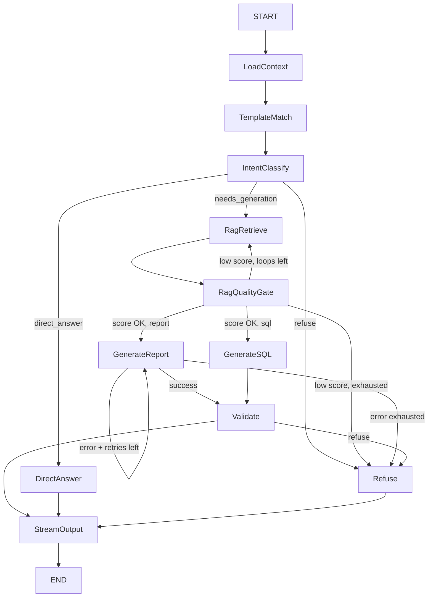

# Subagent 7d23ce25

- **来源**: `7d23ce25-0c80-4154-b87b-e80f471ec346.jsonl`

---

## 用户

Explore the nl-hermes codebase at /Users/dezliu/Documents/mine/repo/nl-hermes to find the main user query workflow/pipeline. Look for:
- Intent classification (chat/SQL/report)
- Security guards (sensitive words, SQL injection)
- Permission injection by User_ID
- RAG retrieval with HyDE, query rewriting
- LLM generation, SQL linter, validation loops
- User confirmation, execution tools
- Post-processing and quality checks/hallucination detection
Return: file paths, current flow steps implemented vs missing, loop limits, thresholds.

## 助手

正在探索 nl-hermes 代码库中的用户查询主流程，先从架构入口与关键模块入手。

[REDACTED]
<details>
<summary>Tool: UpdateCurrentStep</summary>

```json
{
  "current_step": "Exploring user query pipeline"
}
```
</details>
<details>
<summary>Tool: CallMcpTool</summary>

```json
{
  "server": "user-codegraph",
  "toolName": "codegraph_explore",
  "arguments": {
    "query": "main user query workflow pipeline intent classification chat SQL report security guards sensitive words SQL injection permission User_ID RAG HyDE query rewriting LLM SQL linter validation loops user confirmation execution hallucination detection"
  }
}
```
</details>
<details>
<summary>Tool: Glob</summary>

```json
{
  "glob_pattern": "**/*.{ts,tsx,js}",
  "target_directory": "/Users/dezliu/Documents/mine/repo/nl-hermes"
}
```
</details>
<details>
<summary>Tool: Grep</summary>

```json
{
  "pattern": "HyDE|hyde|intent.*classif|hallucin|sensitive.*word|sql.*inject",
  "path": "/Users/dezliu/Documents/mine/repo/nl-hermes",
  "-i": true
}
```
</details>

<details>
<summary>Tool: Read</summary>

```json
{
  "path": "/Users/dezliu/Documents/mine/repo/nl-hermes/packages/workflow/src/graph.ts"
}
```
</details>
<details>
<summary>Tool: Read</summary>

```json
{
  "path": "/Users/dezliu/Documents/mine/repo/nl-hermes/packages/workflow/src/nodes.ts"
}
```
</details>
<details>
<summary>Tool: Read</summary>

```json
{
  "path": "/Users/dezliu/Documents/mine/repo/nl-hermes/packages/workflow/src/types.ts"
}
```
</details>
<details>
<summary>Tool: Read</summary>

```json
{
  "path": "/Users/dezliu/Documents/mine/repo/nl-hermes/packages/workflow/src/nodes-constants.ts"
}
```
</details>
<details>
<summary>Tool: Grep</summary>

```json
{
  "pattern": "sensitive|inject|permission|User_ID|userId|HyDE|rewrite|hallucin|confirm|linter|validation|MAX_|THRESHOLD|loop|retry",
  "-i": true,
  "path": "/Users/dezliu/Documents/mine/repo/nl-hermes",
  "glob": "*.{ts,tsx,md}"
}
```
</details>

<details>
<summary>Tool: Read</summary>

```json
{
  "path": "/Users/dezliu/Documents/mine/repo/nl-hermes/packages/workflow/src/state.ts"
}
```
</details>
<details>
<summary>Tool: Read</summary>

```json
{
  "path": "/Users/dezliu/Documents/mine/repo/nl-hermes/apps/orchestrator/src/services/chat-service.ts"
}
```
</details>
<details>
<summary>Tool: Read</summary>

```json
{
  "path": "/Users/dezliu/Documents/mine/repo/nl-hermes/apps/rag-service/src/services/retrieve-service.ts"
}
```
</details>
<details>
<summary>Tool: Glob</summary>

```json
{
  "glob_pattern": "**/*",
  "target_directory": "/Users/dezliu/Documents/mine/repo/nl-hermes/packages/llm-tools"
}
```
</details>
<details>
<summary>Tool: Grep</summary>

```json
{
  "path": "/Users/dezliu/Documents/mine/repo/nl-hermes",
  "pattern": "classifyIntent|generateSql|generateReport|sensitive|guard|HyDE|hyde|rewrite|hallucin|confirm|validateSql"
}
```
</details>

<details>
<summary>Tool: Read</summary>

```json
{
  "path": "/Users/dezliu/Documents/mine/repo/nl-hermes/packages/llm-tools/src/llm/openai-style-provider.ts"
}
```
</details>
<details>
<summary>Tool: Read</summary>

```json
{
  "path": "/Users/dezliu/Documents/mine/repo/nl-hermes/apps/report-service/src/services/report-service.ts"
}
```
</details>
<details>
<summary>Tool: Read</summary>

```json
{
  "path": "/Users/dezliu/Documents/mine/repo/nl-hermes/apps/report-service/src/lib/sql-utils.ts"
}
```
</details>
<details>
<summary>Tool: Grep</summary>

```json
{
  "path": "/Users/dezliu/Documents/mine/repo/nl-hermes",
  "pattern": "permission|getUserPermissions|allowedTables|User_ID|user_id",
  "glob": "**/*.{ts,tsx}"
}
```
</details>
<details>
<summary>Tool: Grep</summary>

```json
{
  "path": "/Users/dezliu/Documents/mine/repo/nl-hermes",
  "pattern": "sensitive|guard|blocklist|denylist|forbidden|refuse|injection|sanitize",
  "glob": "**/*.{ts,tsx}"
}
```
</details>

<details>
<summary>Tool: Read</summary>

```json
{
  "path": "/Users/dezliu/Documents/mine/repo/nl-hermes/apps/report-service/src/services/sql-executor.ts"
}
```
</details>
<details>
<summary>Tool: Read</summary>

```json
{
  "path": "/Users/dezliu/Documents/mine/repo/nl-hermes/packages/llm-tools/src/llm/mock-provider.ts"
}
```
</details>
<details>
<summary>Tool: Grep</summary>

```json
{
  "path": "/Users/dezliu/Documents/mine/repo/nl-hermes/apps/metadata-service",
  "pattern": "permissions|/v1/permissions"
}
```
</details>
<details>
<summary>Tool: Read</summary>

```json
{
  "path": "/Users/dezliu/Documents/mine/repo/nl-hermes/apps/metadata-service/src/services/settings-service.ts"
}
```
</details>
<details>
<summary>Tool: Read</summary>

```json
{
  "path": "/Users/dezliu/Documents/mine/repo/nl-hermes/plan/灵析系统架构设计_86078467.plan.md",
  "offset": 170,
  "limit": 120
}
```
</details>

<details>
<summary>Tool: Read</summary>

```json
{
  "path": "/Users/dezliu/Documents/mine/repo/nl-hermes/apps/metadata-service/src/routes/index.ts"
}
```
</details>
<details>
<summary>Tool: Read</summary>

```json
{
  "path": "/Users/dezliu/Documents/mine/repo/nl-hermes/apps/orchestrator/src/routes/index.ts"
}
```
</details>
<details>
<summary>Tool: Read</summary>

```json
{
  "path": "/Users/dezliu/Documents/mine/repo/nl-hermes/apps/orchestrator/src/services/template-apply-service.ts"
}
```
</details>
<details>
<summary>Tool: Read</summary>

```json
{
  "path": "/Users/dezliu/Documents/mine/repo/nl-hermes/packages/observability/src/performance-budgets.ts"
}
```
</details>
<details>
<summary>Tool: Grep</summary>

```json
{
  "path": "/Users/dezliu/Documents/mine/repo/nl-hermes",
  "pattern": "HyDE|hyde|query.*rewrit|expandQuery|hallucin|User_ID|user_id.*inject|confirm|executeQuery"
}
```
</details>

<details>
<summary>Tool: Grep</summary>

```json
{
  "path": "/Users/dezliu/Documents/mine/repo/nl-hermes",
  "pattern": "getUserPermissions|UserPermissions|allowedTables|allowedFields|/v1/permissions"
}
```
</details>
<details>
<summary>Tool: Read</summary>

```json
{
  "path": "/Users/dezliu/Documents/mine/repo/nl-hermes/packages/contracts/src/index.ts",
  "limit": 250
}
```
</details>
<details>
<summary>Tool: Read</summary>

```json
{
  "path": "/Users/dezliu/Documents/mine/repo/nl-hermes/apps/gateway-api/src/index.ts",
  "limit": 200
}
```
</details>
<details>
<summary>Tool: Read</summary>

```json
{
  "path": "/Users/dezliu/Documents/mine/repo/nl-hermes/packages/llm-tools/src/clients.ts"
}
```
</details>

<details>
<summary>Tool: Read</summary>

```json
{
  "path": "/Users/dezliu/Documents/mine/repo/nl-hermes/apps/rag-service/src/services/fusion.ts"
}
```
</details>
<details>
<summary>Tool: Read</summary>

```json
{
  "limit": 150,
  "offset": 250,
  "path": "/Users/dezliu/Documents/mine/repo/nl-hermes/apps/web-user/app/page.tsx"
}
```
</details>
<details>
<summary>Tool: Grep</summary>

```json
{
  "path": "/Users/dezliu/Documents/mine/repo/nl-hermes",
  "pattern": "rolePrompt|permissions|saveCheckpoint|checkpoint",
  "glob": "**/*.{ts,tsx}"
}
```
</details>
<details>
<summary>Tool: Read</summary>

```json
{
  "path": "/Users/dezliu/Documents/mine/repo/nl-hermes/packages/llm-tools/src/registry.ts"
}
```
</details>
<details>
<summary>Tool: Read</summary>

```json
{
  "path": "/Users/dezliu/Documents/mine/repo/nl-hermes/apps/metadata-service/src/services/monitor-service.ts"
}
```
</details>

<details>
<summary>Tool: Read</summary>

```json
{
  "path": "/Users/dezliu/Documents/mine/repo/nl-hermes/packages/workflow/src/checkpoint.ts"
}
```
</details>
<details>
<summary>Tool: Read</summary>

```json
{
  "path": "/Users/dezliu/Documents/mine/repo/nl-hermes/packages/shared/src/redact.ts"
}
```
</details>
<details>
<summary>Tool: Read</summary>

```json
{
  "path": "/Users/dezliu/Documents/mine/repo/nl-hermes/packages/observability/src/sanitize-prompt.ts"
}
```
</details>
<details>
<summary>Tool: Read</summary>

```json
{
  "path": "/Users/dezliu/Documents/mine/repo/nl-hermes/apps/eval-service/src/services/eval-case-runner.ts",
  "limit": 80
}
```
</details>
<details>
<summary>Tool: Grep</summary>

```json
{
  "path": "/Users/dezliu/Documents/mine/repo/nl-hermes",
  "pattern": "rolePrompt|allowedTables|allowedFields|errorFeedback|sqlRetry|maxSql"
}
```
</details>

<details>
<summary>Tool: Read</summary>

```json
{
  "path": "/Users/dezliu/Documents/mine/repo/nl-hermes/apps/rag-service/src/routes/index.ts"
}
```
</details>
<details>
<summary>Tool: Read</summary>

```json
{
  "path": "/Users/dezliu/Documents/mine/repo/nl-hermes/apps/orchestrator/src/app.ts"
}
```
</details>
<details>
<summary>Tool: Read</summary>

```json
{
  "path": "/Users/dezliu/Documents/mine/repo/nl-hermes/apps/report-service/src/services/template-matcher.ts"
}
```
</details>
<details>
<summary>Tool: Read</summary>

```json
{
  "path": "/Users/dezliu/Documents/mine/repo/nl-hermes/plan/灵析系统架构设计_86078467.plan.md",
  "offset": 400,
  "limit": 80
}
```
</details>

<details>
<summary>Tool: Read</summary>

```json
{
  "path": "/Users/dezliu/Documents/mine/repo/nl-hermes/apps/orchestrator/src/lib/redis.ts"
}
```
</details>
<details>
<summary>Tool: Read</summary>

```json
{
  "path": "/Users/dezliu/Documents/mine/repo/nl-hermes/packages/llm-tools/src/llm/factory.ts"
}
```
</details>
<details>
<summary>Tool: Read</summary>

```json
{
  "path": "/Users/dezliu/Documents/mine/repo/nl-hermes/packages/workflow/src/index.ts"
}
```
</details>
<details>
<summary>Tool: Grep</summary>

```json
{
  "path": "/Users/dezliu/Documents/mine/repo/nl-hermes",
  "pattern": "expand|rewrit|HyDE|generate_then|queryExpand"
}
```
</details>

<details>
<summary>Tool: Grep</summary>

```json
{
  "path": "/Users/dezliu/Documents/mine/repo/nl-hermes/apps/web-user",
  "pattern": "execute|confirm|validate|hallucin"
}
```
</details>
<details>
<summary>Tool: Read</summary>

```json
{
  "path": "/Users/dezliu/Documents/mine/repo/nl-hermes/packages/contract-tests/src/workflow.contract.test.ts"
}
```
</details>
<details>
<summary>Tool: Read</summary>

```json
{
  "path": "/Users/dezliu/Documents/mine/repo/nl-hermes/apps/orchestrator/src/services/template-recommendation-service.ts"
}
```
</details>

<details>
<summary>Tool: UpdateCurrentStep</summary>

```json
{
  "current_step": "Summarizing pipeline findings",
  "final_summary": "nl-hermes 主查询链路以 LangGraph 工作流（`packages/workflow`）为核心，经 orchestrator SSE 驱动。意图分类、RAG（BM25+向量+RRF+词法 rerank）、报表执行重试已实现；HyDE/查询扩写、权限注入 SQL、SQL 模式校验/重试、幻觉检测、用户 SQL 执行确认等仍缺失或未接线。",
  "completed_subtitle": "Mapped query pipeline end-to-end"
}
```
</details>

## 主查询 Pipeline 总览

入口：**GraphQL Gateway** → **Orchestrator ChatService** → **LangGraph Workflow** → 各微服务（RAG / Report / Metadata / LLM）。

```
web-user / gateway-api
    ↓ startChat + SSE stream
apps/orchestrator/src/services/chat-service.ts
    ↓ runWorkflow()
packages/workflow/src/graph.ts  (LangGraph StateGraph)
    ↓
rag-service / report-service / metadata-service / LLM provider
```

---

## 当前已实现流程（按节点顺序）

| 步骤 | 节点 | 实现文件 | 行为 |
|------|------|----------|------|
| 1 | **LoadContext** | `packages/workflow/src/nodes.ts` | 拉取 `rolePrompt` + `permissions`；发 SSE phase `understanding` |
| 2 | **TemplateMatch** | 同上 + `apps/report-service/src/services/template-matcher.ts` | 向量匹配 SQL/报表模板，`topK=3`；SSE 推送 `templates` 事件 |
| 3 | **IntentClassify** | `nodes.ts` + `packages/llm-tools/src/llm/openai-style-provider.ts` | LLM JSON 输出：`direct_answer` / `needs_generation` / `refuse` |
| 4 | **RagRetrieve** | `nodes.ts` + `apps/rag-service/src/services/retrieve-service.ts` | 并行检索 3 库：metadata(8) / business(6) / templates(4) |
| 5 | **RagQualityGate** | `nodes.ts` | 加权评分；低分可循环重检索；耗尽则 refuse |
| 6a | **GenerateSQL** | `nodes.ts` + LLM provider | 生成 SQL + 说明；**不执行** |
| 6b | **GenerateReport** | `nodes.ts` | LLM 生成 SQL+图表 → **立即 executeQuery** |
| 7 | **ValidateResult** | `nodes.ts` + `apps/report-service/src/services/sql-executor.ts` | **仅 report 模式** 调 `validateSql` |
| 8 | **DirectAnswer / Refuse / StreamOutput** | `nodes.ts` | 直答或拒绝；SSE 结束 |

**模板套用旁路**（跳过 RAG 图）：`apps/orchestrator/src/services/template-apply-service.ts` — 用户在前端填参确认后直跑 SQL/报表。

**图定义**：`packages/workflow/src/graph.ts`



---

## 分项对照：已实现 vs 缺失

### 1. 意图分类（chat / SQL / report）

| 项 | 状态 | 说明 |
|----|------|------|
| 三态意图 | **部分** | `direct_answer` / `needs_generation` / `refuse`（`packages/workflow/src/state.ts`） |
| SQL vs Report 区分 | **靠 mode 参数** | 前端/请求传入 `mode: 'sql' \| 'report'`，意图分类器**不**单独判 SQL/报表 |
| Mock jailbreak 检测 | **仅 mock** | `packages/llm-tools/src/llm/mock-provider.ts` 正则拒绝；OpenAI provider 靠 prompt 语义拒绝 |
| rolePrompt 注入 LLM | **缺失** | `LoadContext` 加载了 `rolePrompt`，但 **generate/classify prompt 未使用** |

### 2. 安全守卫（敏感词 / SQL 注入）

| 项 | 状态 | 文件 |
|----|------|------|
| 敏感词 blocklist | **缺失** | 无独立模块 |
| Prompt 注入 / jailbreak | **部分** | Mock 正则；LLM system prompt 提及 refuse |
| SELECT-only 守卫 | **已实现** | `apps/report-service/src/lib/sql-utils.ts` → `isSelectOnly()` |
| 日志/Trace 脱敏 | **已实现** | `packages/observability/src/sanitize-prompt.ts`（邮箱/手机/512 截断）；`packages/shared/src/redact.ts` |
| 字段 `is_sensitive` 脱敏 | **Schema 有，执行未接** | `migrations/meta/...` 有字段；SQL 执行链路未 mask |

### 3. 权限注入（User_ID）

| 项 | 状态 | 说明 |
|----|------|------|
| 加载 permissions | **部分** | `nodes.ts` → `metadata.getUserPermissions(userId)` |
| Permissions API | **缺失** | `GET /v1/permissions/{userId}` **metadata-service 无此路由**；client fallback 空权限（`packages/llm-tools/src/clients.ts`） |
| 注入 LLM prompt | **缺失** | `allowedTables` / `allowedFields` **未传入** generateSql/generateReport |
| SQL 执行权限过滤 | **缺失** | `sql-executor.ts` 仅 EXPLAIN + COUNT，**不校验表/字段白名单** |
| datasourceId | **部分** | 从 permissions 取，fallback `'default'` |

DB 权限表已建：`migrations/meta/migrations/20260701000001_init.ts`（`role_table_permissions` / `role_field_permissions`）

### 4. RAG（HyDE / Query Rewriting）

| 项 | 状态 | 文件 |
|----|------|------|
| BM25 + Vector 双路 | **已实现** | `retrieve-service.ts`（OpenSearch + Qdrant） |
| RRF 融合 | **已实现** | `apps/rag-service/src/services/fusion.ts`，`k=60` |
| Rerank | **简化版** | 词法 overlap rerank（非 Cross-Encoder） |
| 三库并行检索 | **已实现** | metadata / business / templates |
| HyDE | **缺失** | 全库无实现 |
| Query 扩写 / rewrite | **缺失** | 架构 plan 有 `expand_query`；`RagQualityGate` 低分只**原 query 重检索**，不改写 |
| 动态读 settings | **部分** | `fetchSettings()` 存在，但 workflow **未调用**；阈值写死在 `DEFAULT_WORKFLOW_LIMITS` |

### 5. LLM 生成 / SQL Linter / 校验循环

| 项 | 状态 | 说明 |
|----|------|------|
| LLM SQL/Report 生成 | **已实现** | `openai-style-provider.ts` |
| Report 执行重试 | **已实现** | `generateReportNode` + `routeAfterReport`，错误喂 `errorFeedback` |
| SQL 模式重试 | **缺失** | SQL 模式无 validate→regenerate 环 |
| SQL Linter / validateSql | **部分** | `sql-executor.validate()`：EXPLAIN + 子查询 COUNT + 行数上限；**仅 report 模式触发** |
| SQL 模式 validate | **缺失** | `validateResultNode` 中 `if (state.mode === 'report' && ...)` |
| Tool 注册 | **契约层** | `packages/llm-tools/src/registry.ts` 定义 tools，**未接入 LangChain agent 调用** |

### 6. 用户确认 / 执行工具

| 项 | 状态 | 说明 |
|----|------|------|
| 模板套用确认 | **已实现** | `apps/web-user/app/page.tsx` 参数 Modal + `handleConfirmApply` |
| SQL 执行前用户确认 | **缺失** | SQL 模式只输出文本，无「确认执行」步骤 |
| Report 自动执行 | **已实现** | `generateReportNode` 内直接 `executeQuery` |
| 取消生成 | **已实现** | Redis 锁 + `InterruptRegistry` + GraphQL `cancelGeneration` |
| MCP 执行适配 | **可选路径** | `packages/report-mcp-adapter/`（非主链路） |

### 7. 后处理 / 质量检查 / 幻觉检测

| 项 | 状态 | 文件 |
|----|------|------|
| RAG 质量门控 | **已实现** | `ragQualityGateNode` |
| 幻觉 / grounding 校验 | **缺失** | 架构 plan 要求「仅引用 RAG 上下文」；代码无 LLM 自检或规则比对 |
| 用户反馈 | **已实现** | `apps/orchestrator/src/services/feedback-service.ts` |
| 离线评估 | **部分** | `apps/eval-service/src/services/eval-case-runner.ts`（检索命中 + 分数，非在线 hallucination） |
| 监控告警 | **部分** | `apps/metadata-service/src/services/monitor-service.ts`（检索低分占比告警） |

---

## 循环上限与阈值（当前硬编码默认值）

来源：`packages/workflow/src/state.ts` → `DEFAULT_WORKFLOW_LIMITS`

| 参数 | 默认值 | 用途 |
|------|--------|------|
| `maxRagLoops` | **3** | RAG 低分重检索上限 |
| `maxReportRetries` | **3** | 报表 SQL 执行失败重生成上限 |
| `minRagScore` | **0.35** | RAG 质量门控阈值 |
| `templateThreshold` | **0.72** | Workflow 内模板匹配（`templateMatchNode`） |

**RAG 服务默认**（`retrieve-service.ts` / `settings-service.ts`）：

| 参数 | 默认值 |
|------|--------|
| `rag.bm25.topK` | 20 |
| `rag.vector.topK` | 20 |
| `rag.rrf.k` | 60 |
| `rag.rerank.topK` | 10 |
| `enableRerank` | true |
| RAG 评分公式 | `metaScore * 0.7 + bizScore * 0.3`（`ragQualityGateNode`） |
| Rerank 词法权重 | RRF `0.7` + overlap `0.3`（`fusion.ts`） |
| scoreLevel | high ≥ **0.6**, medium ≥ **0.35** |

**Report 服务**：

| 参数 | 默认值 |
|------|--------|
| `report.maxRows` | **1000** |
| TemplateMatcher threshold（report-service 默认） | **0.3**（workflow 传入 0.72 覆盖） |

**并发 / 锁**：

| 参数 | 值 |
|------|-----|
| 单用户并发锁 TTL | **300s**（`apps/orchestrator/src/lib/redis.ts`） |
| Checkpoint Redis TTL | **3600s**（`packages/workflow/src/checkpoint.ts`） |

**监控**（`monitor-service.ts`）：

| 参数 | 默认 |
|------|------|
| `MONITOR_LOW_SCORE_THRESHOLD` | 0.35 |
| `MONITOR_LOW_SCORE_RATIO` | 0.4（6h 内低分占比告警） |

**性能预算**（`packages/observability/src/performance-budgets.ts`）：首 token ≤ **3s**，RAG 单次 ≤ **5s**

**Eval**（`eval-case-runner.ts`）：检索命中阈值 **0.35**

---

## 关键文件路径索引

| 层级 | 路径 |
|------|------|
| 工作流图 | `/Users/dezliu/Documents/mine/repo/nl-hermes/packages/workflow/src/graph.ts` |
| 节点逻辑 | `/Users/dezliu/Documents/mine/repo/nl-hermes/packages/workflow/src/nodes.ts` |
| 状态/阈值 | `/Users/dezliu/Documents/mine/repo/nl-hermes/packages/workflow/src/state.ts` |
| Orchestrator 入口 | `/Users/dezliu/Documents/mine/repo/nl-hermes/apps/orchestrator/src/services/chat-service.ts` |
| SSE 路由 | `/Users/dezliu/Documents/mine/repo/nl-hermes/apps/orchestrator/src/routes/index.ts` |
| Gateway GraphQL | `/Users/dezliu/Documents/mine/repo/nl-hermes/apps/gateway-api/src/index.ts` |
| 前端聊天 | `/Users/dezliu/Documents/mine/repo/nl-hermes/apps/web-user/app/page.tsx` |
| LLM Provider | `/Users/dezliu/Documents/mine/repo/nl-hermes/packages/llm-tools/src/llm/openai-style-provider.ts` |
| RAG 检索 | `/Users/dezliu/Documents/mine/repo/nl-hermes/apps/rag-service/src/services/retrieve-service.ts` |
| RAG 融合/评分 | `/Users/dezliu/Documents/mine/repo/nl-hermes/apps/rag-service/src/services/fusion.ts` |
| SQL 校验/执行 | `/Users/dezliu/Documents/mine/repo/nl-hermes/apps/report-service/src/services/sql-executor.ts` |
| SQL 工具函数 | `/Users/dezliu/Documents/mine/repo/nl-hermes/apps/report-service/src/lib/sql-utils.ts` |
| 模板匹配 | `/Users/dezliu/Documents/mine/repo/nl-hermes/apps/report-service/src/services/template-matcher.ts` |
| 模板套用 | `/Users/dezliu/Documents/mine/repo/nl-hermes/apps/orchestrator/src/services/template-apply-service.ts` |
| 契约类型 | `/Users/dezliu/Documents/mine/repo/nl-hermes/packages/contracts/src/index.ts` |
| 架构设计（目标态） | `/Users/dezliu/Documents/mine/repo/nl-hermes/plan/灵析系统架构设计_86078467.plan.md` |
| 工作流测试 | `/Users/dezliu/Documents/mine/repo/nl-hermes/packages/contract-tests/src/workflow.contract.test.ts` |

---

## 架构 Plan vs 代码差距（摘要）

架构文档（`plan/灵析系统架构设计_86078467.plan.md`）描述的目标态与当前实现的主要差距：

1. **RagQualityGate 低分策略**：plan 要求 query 扩写或 HyDE 反向匹配 → 代码仅重复相同 query 检索  
2. **权限链路**：plan 要求表/字段白名单注入 prompt + SQL 校验 → API 未实现，state 有字段但未消费  
3. **ValidateResult**：plan 要求幻觉/越权检测 → 仅 report 模式做 EXPLAIN 语法校验  
4. **SQL 模式**：plan 明确不执行、无重试 → 与实现一致，但缺少 validate 环  
5. **Checkpoint 续跑**：`continueConversation` 实际调用 `start()` 重新跑，**未从 LangGraph checkpoint 恢复**（`checkpoint.ts` 注释为 MemorySaver 占位）  
6. **TemplateMatch 时序**：plan 写「与用户输入并行」→ 实际在 IntentClassify **之前**串行执行  

---

## 结论

当前 **MVP 主链路已通**：LoadContext → TemplateMatch → IntentClassify → RAG（三库 hybrid）→ 质量门控（3 次循环）→ SQL 生成或 Report 生成+执行（3 次重试）→ 流式输出。

**尚未实现或未接线**的核心能力：HyDE、query rewriting、permissions API 与 prompt/SQL 注入、SQL 模式 validate/重试、幻觉 grounding 检测、SQL 执行前用户确认、rolePrompt 参与 LLM、settings 动态阈值、LangGraph Redis 真续跑。

[REDACTED]
