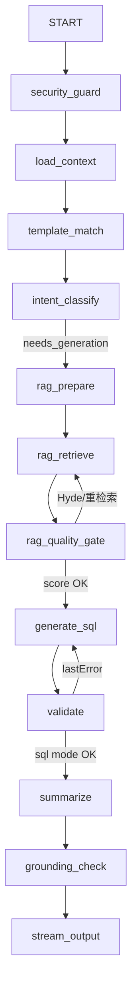

# Subagent a4fc8c2c

- **来源**: `a4fc8c2c-727c-42b4-816b-80b3b884b573.jsonl`

---

## 用户

Explore the nl-hermes codebase at /Users/dezliu/Documents/mine/repo/nl-hermes to understand how SQL is generated for user queries. Find:
1. Workflow nodes for generate_sql, validate, schema retrieval
2. Prompt templates for SQL generation - what schema/metadata is passed to LLM
3. SQL validation logic - how unknown columns are detected
4. Any retry/regeneration logic when validation fails
5. Language constraints in prompts (Chinese output)

Return file paths, key code snippets, and a summary of the flow.

## 助手

正在探索代码库中的 SQL 生成流程，先从工作流节点与相关模块入手。

[REDACTED]
<details>
<summary>Tool: UpdateCurrentStep</summary>

```json
{
  "current_step": "Exploring SQL generation workflow"
}
```
</details>
<details>
<summary>Tool: CallMcpTool</summary>

```json
{
  "server": "user-codegraph",
  "toolName": "codegraph_explore",
  "arguments": {
    "query": "SQL generation workflow nodes generate_sql validate schema retrieval for user queries LangChain LangGraph"
  }
}
```
</details>
<details>
<summary>Tool: Grep</summary>

```json
{
  "pattern": "generate_sql|generateSql|GenerateSql",
  "path": "/Users/dezliu/Documents/mine/repo/nl-hermes",
  "output_mode": "content",
  "head_limit": 50
}
```
</details>
<details>
<summary>Tool: Grep</summary>

```json
{
  "pattern": "validate.*sql|sql.*valid|unknown.*column",
  "path": "/Users/dezliu/Documents/mine/repo/nl-hermes",
  "-i": true,
  "output_mode": "content",
  "head_limit": 50
}
```
</details>
<details>
<summary>Tool: Glob</summary>

```json
{
  "glob_pattern": "**/*sql*",
  "target_directory": "/Users/dezliu/Documents/mine/repo/nl-hermes"
}
```
</details>

<details>
<summary>Tool: UpdateCurrentStep</summary>

```json
{
  "current_step": "Reading workflow and prompt files"
}
```
</details>
<details>
<summary>Tool: Read</summary>

```json
{
  "path": "/Users/dezliu/Documents/mine/repo/nl-hermes/packages/workflow/src/graph.ts"
}
```
</details>
<details>
<summary>Tool: Read</summary>

```json
{
  "path": "/Users/dezliu/Documents/mine/repo/nl-hermes/packages/workflow/src/nodes.ts"
}
```
</details>
<details>
<summary>Tool: Read</summary>

```json
{
  "path": "/Users/dezliu/Documents/mine/repo/nl-hermes/packages/workflow/src/grounding.ts"
}
```
</details>
<details>
<summary>Tool: Grep</summary>

```json
{
  "pattern": "schema|prompt|中文|Chinese|loadContext|retrieve",
  "-i": true,
  "glob": "**/llm-tools/**",
  "head_limit": 80
}
```
</details>
<details>
<summary>Tool: Grep</summary>

```json
{
  "pattern": "schema|retrieve|load_context|loadContext",
  "-i": true,
  "glob": "**/workflow/**",
  "head_limit": 50
}
```
</details>

<details>
<summary>Tool: Read</summary>

```json
{
  "path": "/Users/dezliu/Documents/mine/repo/nl-hermes/packages/llm-tools/src/llm/openai-style-provider.ts"
}
```
</details>
<details>
<summary>Tool: Read</summary>

```json
{
  "path": "/Users/dezliu/Documents/mine/repo/nl-hermes/apps/reporting-service/src/services/sql-executor.ts"
}
```
</details>
<details>
<summary>Tool: Read</summary>

```json
{
  "path": "/Users/dezliu/Documents/mine/repo/nl-hermes/packages/workflow/src/state.ts"
}
```
</details>
<details>
<summary>Tool: Read</summary>

```json
{
  "path": "/Users/dezliu/Documents/mine/repo/nl-hermes/apps/report-service/src/services/sql-executor.ts"
}
```
</details>
<details>
<summary>Tool: Grep</summary>

```json
{
  "-i": true,
  "head_limit": 40,
  "path": "/Users/dezliu/Documents/mine/repo/nl-hermes",
  "pattern": "中文|Chinese|简体|explanation",
  "glob": "**/*.{ts,tsx,md}"
}
```
</details>

<details>
<summary>Tool: Grep</summary>

```json
{
  "head_limit": 30,
  "output_mode": "files_with_matches",
  "path": "/Users/dezliu/Documents/mine/repo/nl-hermes",
  "pattern": "retrieve|RetrieveResult",
  "glob": "**/apps/**"
}
```
</details>
<details>
<summary>Tool: Read</summary>

```json
{
  "path": "/Users/dezliu/Documents/mine/repo/nl-hermes/packages/contracts/src/index.ts",
  "offset": 1,
  "limit": 120
}
```
</details>
<details>
<summary>Tool: Read</summary>

```json
{
  "path": "/Users/dezliu/Documents/mine/repo/nl-hermes/packages/contract-tests/src/workflow.contract.test.ts",
  "offset": 170,
  "limit": 100
}
```
</details>
<details>
<summary>Tool: Read</summary>

```json
{
  "path": "/Users/dezliu/Documents/mine/repo/nl-hermes/apps/report-service/src/lib/sql-utils.ts"
}
```
</details>

<details>
<summary>Tool: Read</summary>

```json
{
  "path": "/Users/dezliu/Documents/mine/repo/nl-hermes/apps/rag-service/src/services/retrieve-service.ts"
}
```
</details>
<details>
<summary>Tool: Read</summary>

```json
{
  "path": "/Users/dezliu/Documents/mine/repo/nl-hermes/packages/workflow/src/grounding.test.ts"
}
```
</details>
<details>
<summary>Tool: Grep</summary>

```json
{
  "glob": "**/*",
  "head_limit": 30,
  "output_mode": "content",
  "path": "/Users/dezliu/Documents/mine/repo/nl-hermes",
  "pattern": "formatMetadata|schema_context|content.*table|buildChunk"
}
```
</details>
<details>
<summary>Tool: Read</summary>

```json
{
  "path": "/Users/dezliu/Documents/mine/repo/nl-hermes/packages/contract-tests/src/workflow.contract.test.ts",
  "offset": 270,
  "limit": 80
}
```
</details>

<details>
<summary>Tool: Grep</summary>

```json
{
  "path": "/Users/dezliu/Documents/mine/repo/nl-hermes",
  "pattern": "content.*fund_flow|formatField|toChunk|indexDocument|metadata.*content",
  "head_limit": 40
}
```
</details>
<details>
<summary>Tool: Glob</summary>

```json
{
  "glob_pattern": "**/metadata-service/**",
  "target_directory": "/Users/dezliu/Documents/mine/repo/nl-hermes"
}
```
</details>
<details>
<summary>Tool: Read</summary>

```json
{
  "path": "/Users/dezliu/Documents/mine/repo/nl-hermes/apps/rag-service/src/services/fusion.ts",
  "limit": 80
}
```
</details>

<details>
<summary>Tool: Grep</summary>

```json
{
  "head_limit": 40,
  "path": "/Users/dezliu/Documents/mine/repo/nl-hermes",
  "pattern": "indexMetadata|syncToRag|buildContent|embedding.*content"
}
```
</details>
<details>
<summary>Tool: Glob</summary>

```json
{
  "glob_pattern": "**/scripts/settle/**",
  "target_directory": "/Users/dezliu/Documents/mine/repo/nl-hermes"
}
```
</details>

<details>
<summary>Tool: Read</summary>

```json
{
  "limit": 80,
  "offset": 340,
  "path": "/Users/dezliu/Documents/mine/repo/nl-hermes/scripts/seed-settle.ts"
}
```
</details>
<details>
<summary>Tool: Read</summary>

```json
{
  "limit": 60,
  "path": "/Users/dezliu/Documents/mine/repo/nl-hermes/scripts/settle/query-library.json"
}
```
</details>
<details>
<summary>Tool: Grep</summary>

```json
{
  "head_limit": 20,
  "path": "/Users/dezliu/Documents/mine/repo/nl-hermes",
  "pattern": "validateRetryCount|maxValidateRetries|lastError"
}
```
</details>

<details>
<summary>Tool: Read</summary>

```json
{
  "limit": 50,
  "offset": 310,
  "path": "/Users/dezliu/Documents/mine/repo/nl-hermes/scripts/seed-settle.ts"
}
```
</details>
<details>
<summary>Tool: Grep</summary>

```json
{
  "head_limit": 20,
  "path": "/Users/dezliu/Documents/mine/repo/nl-hermes",
  "pattern": "buildMetadataDocs|listFieldsForLibrary"
}
```
</details>
<details>
<summary>Tool: Read</summary>

```json
{
  "limit": 80,
  "path": "/Users/dezliu/Documents/mine/repo/nl-hermes/apps/metadata-service/src/services/prompt-service.ts"
}
```
</details>

<details>
<summary>Tool: Read</summary>

```json
{
  "limit": 90,
  "path": "/Users/dezliu/Documents/mine/repo/nl-hermes/apps/rag-service/src/services/index-pipeline.ts"
}
```
</details>
<details>
<summary>Tool: Grep</summary>

```json
{
  "head_limit": 15,
  "path": "/Users/dezliu/Documents/mine/repo/nl-hermes",
  "pattern": "runWorkflow|buildWorkflowGraph"
}
```
</details>
<details>
<summary>Tool: Read</summary>

```json
{
  "limit": 50,
  "path": "/Users/dezliu/Documents/mine/repo/nl-hermes/packages/llm-tools/src/llm/mock-provider.ts"
}
```
</details>

<details>
<summary>Tool: Grep</summary>

```json
{
  "head_limit": 15,
  "path": "/Users/dezliu/Documents/mine/repo/nl-hermes",
  "pattern": "checkColumnGrounding|unknownColumns|SQL 包含知识库"
}
```
</details>
<details>
<summary>Tool: Read</summary>

```json
{
  "limit": 50,
  "offset": 55,
  "path": "/Users/dezliu/Documents/mine/repo/nl-hermes/packages/llm-tools/src/llm/mock-provider.ts"
}
```
</details>

<details>
<summary>Tool: Grep</summary>

```json
{
  "head_limit": 10,
  "path": "/Users/dezliu/Documents/mine/repo/nl-hermes/packages/contract-tests",
  "pattern": "知识库外|trade_date|columnCheck"
}
```
</details>
<details>
<summary>Tool: Read</summary>

```json
{
  "limit": 40,
  "offset": 1,
  "path": "/Users/dezliu/Documents/mine/repo/nl-hermes/apps/report-service/src/services/report-service.ts"
}
```
</details>

<details>
<summary>Tool: UpdateCurrentStep</summary>

```json
{
  "current_step": "Summarizing SQL generation flow",
  "final_summary": "SQL 生成走 LangGraph 工作流：`rag_retrieve` 检索 schema/业务/模板 → `generate_sql` 调用 LLM → `validate` 先做本地列名校验再做 MySQL EXPLAIN，失败最多重试 2 次。Prompt 将检索到的 `RetrieveResult.content` 拼入 Schema/业务/示例块，系统约束为中文且禁止臆造字段。",
  "completed_subtitle": "Mapped full SQL workflow"
}
```
</details>

## SQL 生成流程总览

灵析的 SQL 生成由 **LangGraph 工作流**（`packages/workflow`）编排，LLM 调用在 **`packages/llm-tools`**，schema 检索走 **RAG 三集合**，校验分 **本地 grounding + report-service EXPLAIN** 两层。



---

## 1. 工作流节点（generate_sql / validate / schema 检索）

**图定义：** `/Users/dezliu/Documents/mine/repo/nl-hermes/packages/workflow/src/graph.ts`

| 图节点 ID | 实现函数 | 职责 |
|-----------|----------|------|
| `load_context` | `loadContextNode` | 加载角色 Prompt，检查数据源 |
| `rag_prepare` | `ragPrepareNode` | 查询改写（或跳过） |
| `rag_retrieve` | `ragRetrieveNode` | **Schema/业务/模板检索** |
| `rag_quality_gate` | `ragQualityGateNode` | RAG 分数门槛 + Hyde 重检索 |
| `generate_sql` | `generateSqlNode` | 调用 LLM 生成 SQL |
| `validate` | `validateResultNode` | 列名校验 + 远程 EXPLAIN |
| `grounding_check` | `groundingCheckNode` | 输出前二次 grounding |

**Schema 检索没有独立节点**，在 `rag_retrieve` 中并行检索三个 collection：

```54:72:/Users/dezliu/Documents/mine/repo/nl-hermes/packages/workflow/src/nodes.ts
async function retrieveAllCollections(
  deps: WorkflowDeps,
  query: string,
  mode: WorkflowGraphState['mode'],
): Promise<{
  metadata: RetrieveResult[];
  business: RetrieveResult[];
  templates: RetrieveResult[];
}> {
  const [metadata, business, templates] = await Promise.all([
    deps.rag.retrieve({ query, collection: 'metadata', mode, topK: 8 }),
    deps.rag.retrieve({ query, collection: 'business', mode, topK: 6 }),
    deps.rag.retrieve({ query, collection: 'templates', mode, topK: 4 }),
  ]);
  // ...
}
```

**图边（SQL 模式）：**

```91:98:/Users/dezliu/Documents/mine/repo/nl-hermes/packages/workflow/src/graph.ts
    .addEdge('generate_sql', 'validate')
    .addEdge('generate_report', 'validate')
    .addConditionalEdges('validate', (input: GraphUpdate) => routeAfterValidate(input.state), {
      generate_sql: 'generate_sql',
      generate_report: 'generate_report',
      execute_report: 'execute_report',
      summarize: 'summarize',
      refuse: 'refuse',
    })
```

**相关文件：**
- `/Users/dezliu/Documents/mine/repo/nl-hermes/packages/workflow/src/nodes.ts` — 所有节点实现
- `/Users/dezliu/Documents/mine/repo/nl-hermes/packages/workflow/src/state.ts` — 状态与重试上限
- `/Users/dezliu/Documents/mine/repo/nl-hermes/apps/orchestrator/src/services/chat-service.ts` — 调用 `runWorkflow`
- `/Users/dezliu/Documents/mine/repo/nl-hermes/apps/rag-service/src/services/retrieve-service.ts` — BM25 + 向量 + RRF 检索

---

## 2. Prompt 模板与传给 LLM 的 Schema/元数据

**主实现：** `/Users/dezliu/Documents/mine/repo/nl-hermes/packages/llm-tools/src/llm/openai-style-provider.ts`

### System Prompt（安全 + 字段约束）

```25:34:/Users/dezliu/Documents/mine/repo/nl-hermes/packages/llm-tools/src/llm/openai-style-provider.ts
function buildSystemPrompt(rolePrompt?: RolePromptInput): string {
  const parts = [
    '安全约束：仅生成 SELECT 查询；禁止 DDL/DML；仅引用上下文中的表与字段。',
    '字段约束：WHERE/SELECT/ORDER BY 中的列名必须出现在 Schema 上下文中；禁止臆造 trade_date、created_at 等上下文中不存在的列名。',
    '时间过滤：若用户指定时间范围，必须使用 Schema 中已有的日期/时间字段（如 gmt_create、finish_time）；若上下文无合适时间字段，在 explanation 中说明而非编造列名。',
  ];
  if (rolePrompt?.persona) parts.push(`角色设定: ${rolePrompt.persona}`);
  if (rolePrompt?.constraints) parts.push(`系统限制: ${rolePrompt.constraints}`);
  return parts.join('\n\n');
}
```

### User Prompt 结构（`generateSql`）

传给 LLM 的上下文块：

| 块 | 来源 | 内容 |
|----|------|------|
| `Schema` | `state.schemaContext` | RAG metadata 检索结果（最多 8 条） |
| `业务知识` | `state.businessKnowledge` | business collection（最多 8 条） |
| `示例` | `state.templateExamples` | templates collection（最多 8 条） |
| `上次错误` | `state.lastError` | 校验失败时的反馈（重试时） |
| 角色 | `loadContextNode` 加载 | persona + constraints |

```149:169:/Users/dezliu/Documents/mine/repo/nl-hermes/packages/llm-tools/src/llm/openai-style-provider.ts
    async generateSql(input) {
      // ...
        const messages = [
          {
            role: 'system' as const,
            content:
              `${buildSystemPrompt(input.rolePrompt)}\n\n你是 SQL 生成助手。仅返回 JSON：{"sql":"string","explanation":"string"}。SQL 须为 MySQL 方言，不要 markdown。`,
          },
          {
            role: 'user' as const,
            content: [
              `用户问题: ${input.query}`,
              `模式: ${input.mode}`,
              `Schema:\n${contextSummary(input.schemaContext)}`,
              `业务知识:\n${contextSummary(input.businessKnowledge)}`,
              `示例:\n${contextSummary(input.examples)}`,
              input.errorFeedback ? `上次错误: ${input.errorFeedback}` : '',
            ]
              .filter(Boolean)
              .join('\n\n'),
          },
        ];
```

### Schema 元数据的实际格式

索引时每条 metadata 文档的 `content` 由表/字段物理名、业务中文名、描述、类型、同义词拼接：

```43:54:/Users/dezliu/Documents/mine/repo/nl-hermes/apps/rag-service/src/services/index-pipeline.ts
  private buildMetadataDocs(fields: QueryLibraryField[]) {
    return fields.map((f) => {
      const synonymText = (f.synonyms ?? []).map((s) => s.synonym).join(' ');
      const content = [
        f.tablePhysicalName,
        f.tableBusinessName,
        f.physicalName,
        f.businessName,
        f.description,
        f.dataType,
        synonymText,
      ].filter(Boolean).join(' ');
```

示例（测试用）：

```4:9:/Users/dezliu/Documents/mine/repo/nl-hermes/packages/workflow/src/grounding.test.ts
const fundFlowSchema = [
  {
    id: '1',
    content: 'fund_flow 跨系统资金流水 business_id amount gmt_create datetime 创建时间',
    score: 0.9,
  },
];
```

**注意：** LLM 收到的是 `RetrieveResult.content` 纯文本列表，**不是结构化 JSON schema**；`contextSummary` 只取前 8 条、编号拼接。

---

## 3. SQL 校验与未知列检测

校验分 **两层**，都在 `validateResultNode`：

### 层 1：本地列 Grounding（workflow 内）

**文件：** `/Users/dezliu/Documents/mine/repo/nl-hermes/packages/workflow/src/grounding.ts`

逻辑：
1. 从 `schemaContext` 提取所有 token（`collectKnownTokens`）和表名（`collectKnownTables`）
2. 从 SQL 的 WHERE/JOIN/GROUP BY/ORDER BY/HAVING 子句提取列引用（`extractSqlColumnRefs`）
3. 过滤掉已知 token、已知表名、SQL 关键字、数字开头 token
4. 剩余即为 `unknownColumns`

```62:84:/Users/dezliu/Documents/mine/repo/nl-hermes/packages/workflow/src/grounding.ts
export function checkColumnGrounding(input: {
  sql?: string;
  schemaContext: RetrieveResult[];
}): { ok: boolean; unknownColumns?: string[] } {
  if (!input.sql?.trim()) return { ok: true };

  const known = collectKnownTokens(input.schemaContext);
  if (known.size === 0) return { ok: true };

  const knownTables = collectKnownTables(input.schemaContext);
  const refs = extractSqlColumnRefs(input.sql);
  const unknown = [...new Set(
    refs.filter(
      (col) =>
        !known.has(col) &&
        !knownTables.has(col) &&
        !SQL_KEYWORDS.has(col) &&
        !/^\d/.test(col),
    ),
  )];

  if (unknown.length === 0) return { ok: true };
  return { ok: false, unknownColumns: unknown };
}
```

**局限：** 基于正则 + RAG 文本 token 匹配，不是完整 SQL AST；SELECT 列表中的列不一定被检查（主要查 filter 子句）。

### 层 2：远程 MySQL EXPLAIN（report-service）

**文件：** `/Users/dezliu/Documents/mine/repo/nl-hermes/apps/report-service/src/services/sql-executor.ts`

- 先检查 `isSelectOnly`
- SQL 模式：`lightweight: true`，仅 `EXPLAIN`
- 报表模式：额外 `COUNT(*)` 子查询检查行数上限
- MySQL 报错 `Unknown column 'xxx'` 在执行阶段也会被捕获（`execute` 方法）

```71:108:/Users/dezliu/Documents/mine/repo/nl-hermes/apps/report-service/src/services/sql-executor.ts
  async validate(
    sql: string,
    ds: DatasourceConfig,
    maxRows = 1000,
    lightweight = false,
  ): Promise<ValidateSqlResponse> {
    // ...
      await conn.query(`EXPLAIN ${sql.replace(/;\s*$/, '')}`);
      if (!lightweight) {
        const countSql = `SELECT COUNT(*) AS cnt FROM (${sql.replace(/;\s*$/, '')}) AS _hermes_sub`;
        // ...
      }
    // catch -> buildSyntaxError(message)
  }
```

### 层 3：输出前二次 Grounding

`summarize` 之后还有 `grounding_check`，同时检查未知表（`checkGrounding`）和未知列（`checkColumnGrounding`），失败直接 refuse，**不再重试**。

---

## 4. 重试 / 再生逻辑

**状态字段与默认上限**（`/Users/dezliu/Documents/mine/repo/nl-hermes/packages/workflow/src/state.ts`）：

| 计数器 | 默认上限 | 触发场景 |
|--------|----------|----------|
| `validateRetryCount` | `maxValidateRetries: 2` | 列 grounding 或 EXPLAIN 失败 |
| `reportRetryCount` | `maxReportRetries: 3` | 报表执行失败 |
| `ragLoopCount` | `maxRagLoops: 2` | RAG 分数不足时重检索 |

### Validate 失败 → 重新 generate_sql

```330:340:/Users/dezliu/Documents/mine/repo/nl-hermes/packages/workflow/src/nodes.ts
  const columnCheck = checkColumnGrounding({ sql: state.generatedSql, schemaContext: state.schemaContext });
  if (!columnCheck.ok) {
    const unknown = columnCheck.unknownColumns?.join(', ') ?? '未知字段';
    const msg = `SQL 包含知识库外的字段：${unknown}`;
    // ...
    if (state.validateRetryCount < state.maxValidateRetries) {
      return {
        lastError: msg,
        validateRetryCount: state.validateRetryCount + 1,
        currentNode: 'ValidateResult',
      };
    }
```

路由：

```585:592:/Users/dezliu/Documents/mine/repo/nl-hermes/packages/workflow/src/nodes.ts
export function routeAfterValidate(state: WorkflowGraphState): string {
  if (state.intent === 'refuse') return 'refuse';
  if (state.lastError) {
    return state.mode === 'sql' ? 'generate_sql' : 'generate_report';
  }
  if (state.mode === 'report') return 'execute_report';
  return 'summarize';
}
```

**重试时错误反馈路径：** `lastError` → `generateSqlNode` 的 `errorFeedback: state.lastError` → LLM user prompt 中的 `上次错误: ...`

超过重试次数 → `intent: 'refuse'`，不再生成。

**不重试的情况：**
- `DATASOURCE_NOT_FOUND` — 直接 refuse
- `grounding_check` 失败 — 直接 refuse（无 regenerate）

### RAG 质量门控重检索（Hyde）

RAG 分数不足时，先用 Hyde 生成假设性草稿作为新检索 query，再回 `rag_retrieve`（最多 `maxRagLoops` 次）。

---

## 5. Prompt 中的语言约束（中文输出）

**没有显式写「explanation 必须用中文」**，但整体是中文系统：

| 位置 | 语言约束 |
|------|----------|
| `buildSystemPrompt` | 全中文安全/字段约束 |
| `classifyIntent` | 「你是意图分类器…」 |
| `rewriteQueries` | 「生成 3 条语义检索改写查询」 |
| `generateHydeDraft` | 「假设性业务分析草稿…100字内」 |
| `summarizeResult` | 「简短自然语言解读，80字内」 |
| `generateSql` 默认 explanation | `'已生成 SQL。'`（中文 fallback） |
| UI 流式输出 | `**分析**`、`**SQL 草案**`、`正在生成 SQL…` 等中文标签 |
| Mock provider | explanation 为中文，如「根据检索到的 schema 上下文生成查询」 |

角色 Prompt（persona/constraints）来自 metadata-service，由管理员配置，通常也是中文业务描述。

**SQL 本身：** 要求 MySQL 方言，列名用物理英文名（来自 schema context），explanation 面向用户的自然语言部分实际为中文。

---

## 关键文件索引

| 用途 | 绝对路径 |
|------|----------|
| 工作流图 | `/Users/dezliu/Documents/mine/repo/nl-hermes/packages/workflow/src/graph.ts` |
| 节点实现 | `/Users/dezliu/Documents/mine/repo/nl-hermes/packages/workflow/src/nodes.ts` |
| 列/表 Grounding | `/Users/dezliu/Documents/mine/repo/nl-hermes/packages/workflow/src/grounding.ts` |
| 状态/重试上限 | `/Users/dezliu/Documents/mine/repo/nl-hermes/packages/workflow/src/state.ts` |
| LLM Prompt | `/Users/dezliu/Documents/mine/repo/nl-hermes/packages/llm-tools/src/llm/openai-style-provider.ts` |
| Mock LLM（开发/降级） | `/Users/dezliu/Documents/mine/repo/nl-hermes/packages/llm-tools/src/llm/mock-provider.ts` |
| RAG 检索服务 | `/Users/dezliu/Documents/mine/repo/nl-hermes/apps/rag-service/src/services/retrieve-service.ts` |
| Metadata 索引格式 | `/Users/dezliu/Documents/mine/repo/nl-hermes/apps/rag-service/src/services/index-pipeline.ts` |
| MySQL EXPLAIN 校验 | `/Users/dezliu/Documents/mine/repo/nl-hermes/apps/report-service/src/services/sql-executor.ts` |
| SQL 工具函数 | `/Users/dezliu/Documents/mine/repo/nl-hermes/apps/report-service/src/lib/sql-utils.ts` |
| 契约测试（重试行为） | `/Users/dezliu/Documents/mine/repo/nl-hermes/packages/contract-tests/src/workflow.contract.test.ts` |
| Grounding 单元测试 | `/Users/dezliu/Documents/mine/repo/nl-hermes/packages/workflow/src/grounding.test.ts` |

---

## 流程摘要（SQL 模式）

1. **理解**：`load_context` 加载角色 Prompt；`intent_classify` 判断是否需要生成 SQL。
2. **检索**：`rag_retrieve` 从 metadata/business/templates 三集合检索，结果写入 `schemaContext`、`businessKnowledge`、`templateExamples`。
3. **质量门**：`rag_quality_gate` 评估 RAG 分数，必要时 Hyde 重检索。
4. **生成**：`generate_sql` 将上述上下文 + 用户问题 + 可选 `lastError` 发给 LLM，返回 `{sql, explanation}`。
5. **校验**：`validate` 先做本地列 grounding，再调 report-service `EXPLAIN`（SQL 模式 lightweight）。
6. **重试**：失败且 `validateRetryCount < 2` 时，`lastError` 回传 LLM，路由回 `generate_sql`。
7. **输出**：通过后 `summarize` → `grounding_check`（二次表/列检查）→ `stream_output` 流式返回中文分析 + SQL 代码块。

[REDACTED]
