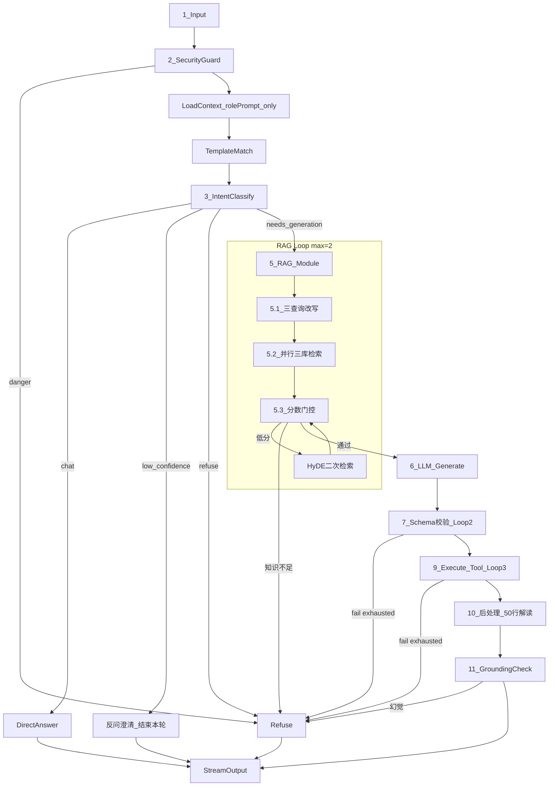

# 管理后台扩展 + Workflow 对齐确认

> **本期范围约束（2026-07-02 更新）**
> - **暂不实现 user 端功能**：用户确认环、web-user 交互改造等一律延后
> - **Prompt 去除 userId 相关**：不在 system/user prompt 中注入 `userId`、`allowedTables`、`allowedFields` 等用户权限上下文；`LoadContext` 本期仅加载 `rolePrompt`（按 `roleId`），不调用 `getUserPermissions`

---

## 一、当前现状摘要

### 1.1 管理后台（[`apps/web-admin`](apps/web-admin)）

| 菜单 | 状态 |
|------|------|
| 数据源 / 表元数据 / Prompt / 检索测试 / 评估 / 告警 | 已有页面 |
| **业务知识管理** | **缺失**（DB 表 `business_knowledge` 已建，无 API/UI/索引） |
| **模板管理（SQL/报表 Tab）** | **缺失**（后端 API 已有，无 Admin UI；[`web-admin/lib/api.ts`](apps/web-admin/lib/api.ts) 未封装 template 接口） |

当前导航见 [`AdminLayout.tsx`](apps/web-admin/components/AdminLayout.tsx)。

表元数据页 [`metadata/page.tsx`](apps/web-admin/app/metadata/page.tsx) 为只读列表（`inQueryLibrary` Switch 被 `disabled`），编辑能力未接通。

### 1.2 三库向量存储（已分离）

| 库 | Qdrant Collection | OpenSearch Index | 索引来源 | 当前索引状态 |
|----|-------------------|------------------|----------|--------------|
| metadata | `hermes_metadata` | `hermes_metadata` | `meta_fields` + 同义词 | **已实现** |
| business | `hermes_business` | `hermes_business` | `business_knowledge` | **空桩** |
| templates | `hermes_templates` | `hermes_templates` | `sql_templates` + `report_templates`（`in_library=true`） | **已实现** |

### 1.3 当前 Workflow（LangGraph）

核心文件：[`packages/workflow/src/graph.ts`](packages/workflow/src/graph.ts)、[`nodes.ts`](packages/workflow/src/nodes.ts)、[`state.ts`](packages/workflow/src/state.ts)

---

## 二、Workflow 逐步对照（11 步 vs 当前 vs 本期范围）

> **已确认决策**
> - 保留前端 `mode`（sql/report）；意图分类只做「闲聊 / 需生成 / 拒绝」
> - 本期不做 user 端能力与 userId prompt 注入

| 步骤 | 你的目标 | 当前实现 | 本期处理 |
|------|----------|----------|----------|
| **1 输入** | 用户输入 + User_ID | Gateway 传 `userId` + `query` + `mode` | **保留** `userId` 仅作会话/审计标识，**不进入 prompt** |
| **2 安全护栏** | 敏感词 + 危险 DDL | 无独立节点 | **本期实现** `SecurityGuardNode` |
| **3 意图识别** | 闲聊 / 生成；置信度&lt;80% 反问 | 三态，无 confidence | **本期实现** confidence + 澄清分支 |
| **4 权限注入** | 按 User_ID 取可见表 | API 未实现，未消费 | **本期暂缓**，留接口占位，后续 user 功能再做 |
| **5 RAG（Loop=2）** | 三改写 + 三库并行 + HyDE | 单 query，loop=3 | **本期实现**（**无权限过滤**） |
| **6 LLM 生成** | 结构化 Prompt | 三段式已有 | **本期接入 rolePrompt**；**不注入权限/userId** |
| **7 硬性校验** | validate Loop=2 | 仅 report 单次 | **本期实现** 统一 validate 重试环 |
| **8 用户确认环** | 可选确认 | 仅模板套用有 Modal | **本期暂缓**（属 user 端交互） |
| **9 执行 Tool** | execute Loop=3 | report 有重试 | **本期实现**（report 自动执行，无确认前置） |
| **10 结果后处理** | 50 行 + LLM 解读 | 未实现 | **本期实现** |
| **11 Grounding 检查** | NER/规则防幻觉 | 未实现 | **本期实现**（规则 + schema 比对） |

### 2.1 Prompt 拼装方案（已去除 userId/权限）

```text
[System]
  角色设定: {rolePrompt.persona}
  系统限制: {rolePrompt.constraints}
  安全约束: （硬编码 baseSystem，含禁止 DDL/DML、仅引用上下文等）

[User]
  用户问题: {query}
  模式: {mode}
  ── Schema（metadata 库检索结果）──
  {schemaContext}
  ── 业务口径（business 库检索结果）──
  {businessKnowledge}
  ── 参考示例（templates 库检索结果）──
  {templateExamples}
  [可选] 上次错误: {errorFeedback}
```

**明确去除**：
- ~~`userId`~~
- ~~`allowedTables` / `allowedFields`~~
- ~~权限白名单段落~~

**语义分工**（不变）：
- **metadata** → 表/字段结构
- **business** → 术语、指标口径、业务规则
- **templates** → Few-shot 示例

### 2.2 本期目标 Workflow



> 步骤 8「用户确认环」本期从图中移除；步骤 4「权限注入」本期跳过，RAG 检索全库（in_library 范围）。

### 2.3 参数对齐

| 参数 | 目标 | 当前默认 | 本期 |
|------|------|----------|------|
| RAG Loop | 2 | 3 | 改为 2 |
| Validate Loop | 2 | 无 | 新增 `maxValidateRetries: 2` |
| Execute Loop | 3 | 3 | 保持 |
| 意图置信度 | 80% | 无 | 新增 `minIntentConfidence: 0.8` |
| RAG 阈值 | — | 0.35 | 保持 |

### 2.4 暂缓项（后续 user 功能迭代）

| 能力 | 说明 |
|------|------|
| `GET /v1/permissions/{userId}` | permissions API |
| RAG `allowedTableIds` 硬过滤 | 检索层权限裁剪 |
| Prompt 权限白名单注入 | system prompt 段落 |
| SQL 执行前用户确认 | web-user SSE 暂停 + 确认 mutation |
| web-user 前端改造 | 确认 Modal、高风险检测 UI |

`LoadContext` 改造：本期 `getUserPermissions` 调用**移除或 no-op**，`state.permissions` 保留类型但不消费，便于后续接线。

---

## 三、管理后台实施计划（本期重点）

### 3.1 新增「业务知识」管理页

**后端**（[`metadata-service`](apps/metadata-service)）：
- `BusinessKnowledgeService` + Repository CRUD
- 路由：`GET/POST /v1/business-knowledge`、`PATCH /v1/business-knowledge/:id`
- 字段：`title`, `category`（glossary/metric/rule/faq）, `content`, `status`
- 变更后触发 `rebuildBusiness`

**索引**（[`index-pipeline.ts`](apps/rag-service/src/services/index-pipeline.ts)）：
- 实现 `rebuildBusiness()`：`status=active` → `hermes_business`

**前端**（[`web-admin`](apps/web-admin)）：
- [`app/business-knowledge/page.tsx`](apps/web-admin/app/business-knowledge/page.tsx)
- 列表 + 创建/编辑 Modal；category 筛选；启用/归档

### 3.2 新增「模板管理」页（SQL / 报表 Tab）

**后端**：复用已有 template API，可选补 `DELETE`

**前端**：
- [`app/templates/page.tsx`](apps/web-admin/app/templates/page.tsx)，Ant Design `Tabs`
- 列表 + 编辑 Drawer；收入模板库；保存后 `ragApi.rebuildIndex('templates')`
- [`api.ts`](apps/web-admin/lib/api.ts) 封装 template CRUD

### 3.3 导航更新

```
数据源管理 → 表元数据 → 业务知识 → 模板管理 → 系统 Prompt → 向量检索测试 → 离线评估 → 告警
```

---

## 四、Workflow 补齐实施计划（分期）

### Phase A — 管理侧 + RAG 数据闭环（优先）

1. business_knowledge CRUD + Admin UI + `rebuildBusiness`
2. templates Admin UI（Tab）+ api 封装
3. ~~permissions API + RAG 硬过滤~~ → **暂缓**

### Phase B — Workflow 对齐（无 user 依赖）

1. `SecurityGuardNode`
2. `IntentClassify` + confidence + `ClarifyNode`
3. RAG 子图：三查询改写 + HyDE；`maxRagLoops=2`；**全库检索**
4. `rolePrompt` 注入 system prompt；**去除 userId/permissions**
5. `ValidateLoop`（max=2）+ `ExecuteLoop`（max=3）；**跳过 UserConfirmNode**
6. `SummarizeResultNode` + `GroundingCheckNode`

`LoadContext` / `openai-style-provider` / `generateSql` / `generateReport` 改动时同步清理 permissions 相关参数传递。

每步补 [`workflow.contract.test.ts`](packages/contract-tests/src/workflow.contract.test.ts) 回归用例。

---

## 五、风险与假设

- **无权限过滤**：本期 RAG/生成可访问智能查询库全部表，仅适合内测/管理员环境；上线 user 功能前必须补回步骤 4
- **HyDE / 三查询改写** 增加 LLM 延迟；需 Langfuse 埋点
- **用户确认环暂缓**：report 模式仍自动执行 SQL
- **NER 幻觉检测** 首版用规则 grounding，NER 作增强
- `userId` 仍存在于 `WorkflowGraphState` 供审计，但**不得出现在任何 LLM prompt 文本中**

---

## 六、验证清单

**Admin**
- 业务知识 CRUD → `rebuildBusiness` → 检索测试 `collection=business` 命中
- SQL/报表模板 Tab 管理 → 收入库 → 检索测试 `collection=templates` 命中

**Workflow**
- `DROP TABLE` → SecurityGuard 拒绝
- 低置信度意图 → 澄清问句，不进入 RAG
- RAG 低分 → HyDE → 仍低分 →「知识不足」
- validate 失败 2 次 / execute 失败 3 次 → 友好提示
- Grounding 检出虚构字段 → 拒绝输出
- **Prompt 快照检查**：生成节点请求体不含 `userId`、不含 `allowedTables/Fields`

**暂缓（本期不验）**
- 权限表过滤
- 用户确认环
- web-user 交互改造
