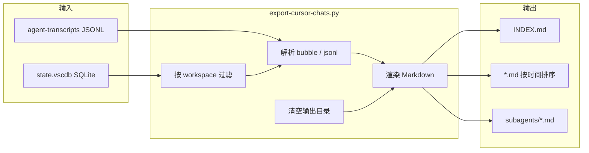

# Cursor 聊天批量导出脚本

## 背景与数据源

Cursor **没有**内置「按项目批量导出 MD」功能，但 nl-hermes 的聊天记录都在本机，已验证可用：

| 数据源 | 路径 | 用途 |
|--------|------|------|
| **主数据源（推荐）** | `~/Library/Application Support/Cursor/User/globalStorage/state.vscdb` | 完整会话：`composerData:<uuid>`（元数据 + 消息头）+ `bubbleId:<composerId>:<bubbleId>`（每条消息正文） |
| **补充数据源** | `~/.cursor/projects/Users-dezliu-Documents-mine-repo-nl-hermes/agent-transcripts/` | 子 agent 会话（`subagents/*.jsonl`），以及 SQLite 缺失时的兜底 |
| **Workspace 标识** | `workspaceStorage/89c8edc4502d68bba07fd3c5a50a3d47/workspace.json` | 过滤条件：`workspaceIdentifier.id == 89c8edc...` 或 `uri.path` 含 `nl-hermes` |

当前 nl-hermes 会话数量：**42 条**（23 Agent + 19 Chat/Ask），与 `agent-transcripts/` 主会话数基本一致。



## 交付物

新增两个文件：

1. [`scripts/export-cursor-chats.py`](scripts/export-cursor-chats.py) — 核心导出逻辑（Python 3 标准库，无第三方依赖）
2. [`scripts/export-cursor-chats.sh`](scripts/export-cursor-chats.sh) — 薄封装，方便直接执行

更新：

3. [`.gitignore`](.gitignore) — 增加 `.cursor/agent/chat/`，避免聊天内容（可能含业务/SQL/密钥片段）被误提交

## 脚本行为

### 运行方式

```bash
# 方式一：直接运行
python3 scripts/export-cursor-chats.py

# 方式二：shell 封装
./scripts/export-cursor-chats.sh
```

### 输出目录

- 目标：`<repo>/.cursor/agent/chat/`
- **每次运行**：`shutil.rmtree` 清空该目录后重建（满足「重复执行删除历史、重新导出」）
- 生成文件：
  - `INDEX.md` — 按 `createdAt` 时间升序列出所有会话链接
  - **主会话 MD 文件名带序号前缀**（用于文件系统排序）：
    - 所有主会话按 `createdAt` **升序**排列（最早 → 最晚）
    - 最早的一条命名为 **`00`**，第二条 **`01`**，第三条 **`02`** … 以此类推
    - 文件名格式：`{序号}_{标题slug}.md`，例如 `00_linganalytics-ai-agent-guidelines.md`、`01_sql-幻觉字段分析.md`
    - 序号至少 **2 位零填充**（`00`–`99`）；若会话数超过 100，自动扩展为 3 位（`000` 起），避免排序错乱
    - `INDEX.md` 中的链接顺序与序号一致，便于对照
  - `subagents/{父序号}_{子uuid8}_{标题slug}.md` — 子 agent 会话单独文件（前缀带上所属主会话序号，便于关联）

### 过滤逻辑（全部 42 条）

从 `cursorDiskKV` 读取 `composerData:%`，保留满足以下任一条件的会话：

- `workspaceIdentifier.id == <自动检测的 workspace id>`
- `workspaceIdentifier.uri.path` 包含项目绝对路径（脚本从 `__file__` 向上定位 repo 根目录，不硬编码用户名）

### 消息解析（完整模式）

对每条 `fullConversationHeadersOnly` 中的 bubble：

- `type == 1` → **用户**
- `type == 2` → **助手**
- 文本字段优先级：`text` → `rawText`
- `thinking` 字段 → `<details><summary>Thinking</summary>...</details>`
- **Tool calls**（jsonl 中 `type: tool_use`；SQLite bubble 中若存在 `toolFormerData` / 类似字段也一并处理）→ 折叠块：

```markdown
<details>
<summary>Tool: Read</summary>

```json
{ "path": "..." }
```
</details>
```

- 跳过 `turn_ended`、空消息、`[REDACTED]` 占位（jsonl 中 assistant 的 tool 中间轮次常被脱敏，以 SQLite bubble 为准）

### 子 agent 补充导出

扫描 `~/.cursor/projects/<project-slug>/agent-transcripts/*/subagents/*.jsonl`：

- 解析 jsonl 每行 JSON（`role` + `message.content[]`）
- 同样以完整模式渲染 tool_use
- 写入 `subagents/` 子目录
- 在 `INDEX.md` 中单独一节列出

### DB 并发安全

Cursor 运行时 SQLite 可能被锁。脚本策略：

1. 优先 `sqlite3.connect("file:...?mode=ro", uri=True)` 只读打开
2. 若失败，复制 DB 到 `/tmp/cursor-state-copy.vscdb` 再读取（`shutil.copy2`）
3. 控制台打印提示：「若导出不完整，可关闭 Cursor 后重试」

### Workspace ID 自动检测

不硬编码 `89c8edc...`，而是扫描：

`~/Library/Application Support/Cursor/User/workspaceStorage/*/workspace.json`

匹配 `"folder"` 字段等于当前 repo 的 `file://` URI，取父目录名作为 workspace id。这样换机器/路径变化时脚本仍可用（只要 Cursor 仍用该 workspace）。

## Markdown 文件格式示例

```markdown
# SQL 幻觉字段分析

- **ID**: `e073489b-bce4-4506-aa76-837d208c0b67`
- **创建时间**: 2026-07-02 14:30
- **模式**: agent
- **Agentic**: true

---

## 用户

帮我分析为什么生成的 sql 会有不存在的字段？

## 助手

正在分析 SQL 生成链路...

<details>
<summary>Tool: Grep</summary>

```json
{ "pattern": "order_type", "glob": "**/*" }
```
</details>

根因已定位：...
```

## 核心代码结构（`export-cursor-chats.py`）

```python
# 模块划分（单文件，约 250-350 行）
resolve_repo_root()          # 从脚本位置定位 nl-hermes 根
resolve_workspace_id()       # 扫描 workspaceStorage
load_composers(conn)         # 过滤 nl-hermes composerData
bubble_to_markdown(conn, cid, bid)  # 单条 bubble 渲染
composer_to_markdown(conn, composer) # 整会话渲染
jsonl_to_markdown(path)      # subagent jsonl 渲染
clean_output_dir(out_dir)    # 清空 .cursor/agent/chat
write_index(composers, subagents, out_dir)
main()
```

## 文件命名规则（重点）

```text
.cursor/agent/chat/
├── INDEX.md
├── 00_最早会话标题.md          ← createdAt 最小
├── 01_第二条会话.md
├── ...
├── 41_最新会话.md              ← 当前约 42 条时末位为 41
└── subagents/
    ├── 05_a4fc8c2c_explore-sql-flow.md   ← 属于主会话 05 的子 agent
    └── ...
```

实现要点：

```python
composers.sort(key=lambda c: c.get("createdAt") or 0)  # 升序
width = max(2, len(str(len(composers) - 1)))           # 至少 2 位
filename = f"{i:0{width}d}_{slug(name)}.md"            # i 从 0 开始
```

## 验证步骤（实现后执行）

1. `python3 scripts/export-cursor-chats.py` — 应输出 `Exported 42 chats`（数量可能随新聊天略增）
2. 检查 `.cursor/agent/chat/` 下主会话文件以 `00_`、`01_`… 开头，且 `00_` 对应最早会话
3. 检查 `INDEX.md` 条目顺序与文件名序号一致
3. 抽查 1 条 Agent 会话 MD：用户问题、助手回复、tool call 折叠块均可见
4. 检查 `subagents/` 下有子 agent 文件
5. **再次运行**脚本 — 确认旧文件被清除、重新生成（文件 mtime 更新）
6. `python3 -m py_compile scripts/export-cursor-chats.py` — 语法检查

## 风险与假设

- **假设**：Cursor 数据格式（`composerData` / `bubbleId` 键名、bubble `type` 枚举）在当前版本稳定；Cursor 大版本升级后可能需要微调解析逻辑
- **假设**：本机 macOS 路径 `~/Library/Application Support/Cursor/` 为标准 Cursor 数据目录
- **风险**：聊天内容可能含敏感业务数据；已通过 `.gitignore` 排除导出目录，脚本头部注释也会提醒勿提交
- **未覆盖**：`~/.cursor/chats/*/store.db` 是更早期的聊天存储，与当前 42 条 composer 数据重叠；不作为主数据源，避免重复

## 不做的事（控制范围）

- 不引入 npm 依赖或第三方 Python 包
- 不修改 Cursor 自身数据
- 不将导出目录纳入 git 跟踪
- 不新增 justfile 任务（仓库当前无 justfile；若后续需要可再加）
