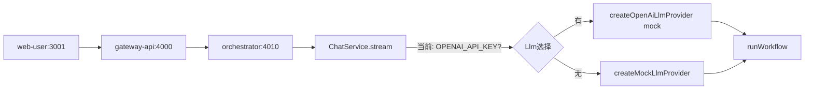
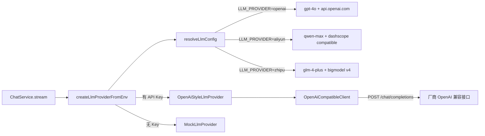

# LLM 多厂商适配器重构

## 现状

- LLM 接口 `LlmProvider` 定义在 [`packages/workflow/src/types.ts`](packages/workflow/src/types.ts)
- 实现在 [`packages/workflow/src/llm.ts`](packages/workflow/src/llm.ts)：`createOpenAiLlmProvider` **仍是 mock 桩**（内部直接调用 `createMockLlmProvider`）
- 入口在 [`apps/orchestrator/src/services/chat-service.ts`](apps/orchestrator/src/services/chat-service.ts) 第 99-101 行，仅判断 `OPENAI_API_KEY`



## 目标架构



## 新增文件（`packages/llm-tools/src/llm/`）

| 文件 | 职责 |
|------|------|
| `types.ts` | 从 workflow 迁移 `LlmProvider` 接口及相关输入类型 |
| `config.ts` | `resolveLlmConfig()`：读取 `LLM_PROVIDER`，映射各厂商 `apiKey` / `baseUrl` / `model` |
| `openai-compatible-client.ts` | 通用 HTTP 客户端，调用 `{baseUrl}/chat/completions`（Bearer Token + OpenAI 消息格式） |
| `mock-provider.ts` | 迁移现有 mock 逻辑（含 jailbreak 检测） |
| `openai-style-provider.ts` | 基于 client 实现 `classifyIntent` / `generateSql` / `generateReport`（prompt + JSON 解析，失败时降级 mock） |
| `factory.ts` | `createLlmProviderFromEnv()`：有 key 则返回真实 adapter，否则 mock |
| `config.test.ts` | 验证三厂商 env 解析与默认值 |
| `factory.test.ts` | 验证无 key 降级、provider 切换 |

## 修改文件

### 1. [`.env.example`](.env.example)

新增/调整：

```env
# LLM 厂商：openai | aliyun | zhipu
LLM_PROVIDER=openai

# OpenAI
OPENAI_API_KEY=
OPENAI_BASE_URL=https://api.openai.com/v1
OPENAI_MODEL=gpt-4o

# 阿里云百炼（OpenAI 兼容模式）
ALIYUN_API_KEY=
ALIYUN_BASE_URL=https://dashscope.aliyuncs.com/compatible-mode/v1
ALIYUN_MODEL=qwen-max

# 智谱 AI（OpenAI 兼容接口）
ZHIPU_API_KEY=
ZHIPU_BASE_URL=https://open.bigmodel.cn/api/paas/v4
ZHIPU_MODEL=glm-4-plus
```

保留 `OPENAI_MODEL` 以兼容现有配置，默认值从 `gpt-4o-mini` 改为 `gpt-4o`（符合需求）。

### 2. [`packages/llm-tools/src/index.ts`](packages/llm-tools/src/index.ts)

导出 `createLlmProviderFromEnv`、`createMockLlmProvider`、`LlmProvider` 类型。

### 3. [`packages/workflow/src/types.ts`](packages/workflow/src/types.ts)

改为从 `@hermes/llm-tools` re-export `LlmProvider`（保持 workflow 对外 API 不变）。

### 4. [`packages/workflow/src/llm.ts`](packages/workflow/src/llm.ts)

精简为 re-export（向后兼容 `createMockLlmProvider`）；移除 stub 版 `createOpenAiLlmProvider` 或标记 deprecated 并转发到 factory。

### 5. [`apps/orchestrator/src/services/chat-service.ts`](apps/orchestrator/src/services/chat-service.ts)

替换入口逻辑：

```typescript
// 之前
const llm = process.env.OPENAI_API_KEY
  ? createOpenAiLlmProvider(...)
  : createMockLlmProvider();

// 之后
const llm = createLlmProviderFromEnv();
```

`loadEnv()` 已在 `createServiceApp` 中调用，`.env` 会自动加载。

## 厂商配置映射（`config.ts`）

| `LLM_PROVIDER` | API Key 环境变量 | 默认 BASE_URL | 默认模型 |
|----------------|------------------|---------------|----------|
| `openai` | `OPENAI_API_KEY` | `https://api.openai.com/v1` | `gpt-4o` |
| `aliyun` | `ALIYUN_API_KEY` | `https://dashscope.aliyuncs.com/compatible-mode/v1` | `qwen-max` |
| `zhipu` | `ZHIPU_API_KEY` | `https://open.bigmodel.cn/api/paas/v4` | `glm-4-plus` |

- 未知 `LLM_PROVIDER` 值：记录 warn 日志，回退 `openai`
- 对应 API Key 为空：回退 `MockLlmProvider`（本地无 key 仍可开发）

## OpenAI 兼容实现要点

`OpenAiCompatibleClient.chat(messages, options?)`：
- `POST ${baseUrl}/chat/completions`
- Header: `Authorization: Bearer ${apiKey}`, `Content-Type: application/json`
- Body: `{ model, messages, temperature }`
- 三家均支持此格式（阿里百炼 compatible-mode、智谱 v4 接口）

三个 LlmProvider 方法使用不同 system/user prompt，要求模型返回 JSON，解析失败则 fallback mock 并打 warn 日志。

## 测试与验证

- 单元测试：`pnpm --filter @hermes/llm-tools test`（config + factory）
- 构建：`pnpm --filter @hermes/llm-tools build && pnpm --filter @hermes/workflow build`
- 现有 workflow 测试保持通过：`pnpm --filter @hermes/workflow test`（仍用 mock provider）
- 手动：设置 `LLM_PROVIDER=aliyun` + `ALIYUN_API_KEY`，重启 orchestrator，发送对话验证 LLM 被调用

## 风险与假设

- 假设三家厂商 OpenAI 兼容端点稳定可用；网络/API 异常时降级 mock，不阻断主流程
- 不引入新 npm 依赖（使用原生 `fetch`）
- 不修改 GraphQL schema 或前端调用方式
