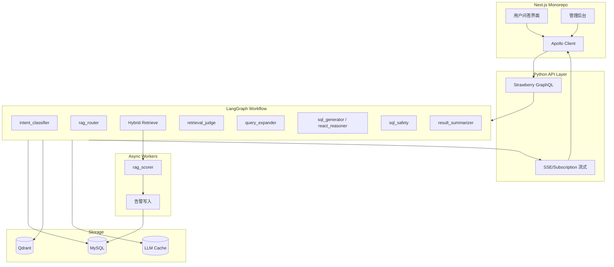
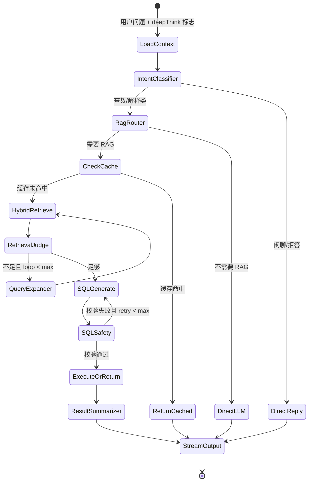

# NL2SQL 系统架构设计方案

## 已确认选型

| 维度 | 选择 |
|------|------|
| 多表 JOIN | **方案 A**：Schema + 外键图谱 + LLM 生成 SQL + 执行前校验 |
| 前端 | **Next.js + Apollo Client**（用户端 + 管理后台同 monorepo） |
| LLM 缓存 | **混合**：先精确 hash 命中，再 embedding 语义命中 |
| SQL 执行 | **双模式**：自动执行 / 仅生成（用户或管理员可配置） |
| Prompt 角色 | **默认 9 角色集**，管理后台可版本化编辑 |
| 管理后台 | **完整首期**：元数据、Prompt、模板、缓存监控、告警、权限 |

---

## 总体架构



**推荐目录结构**（新建）：

```
my-nl2sql/
├── apps/
│   ├── web/                 # Next.js 用户端
│   └── admin/               # Next.js 管理后台（或 web 内 /admin 路由）
├── packages/
│   └── graphql-schema/      # 共享 GraphQL schema/types
├── backend/
│   ├── api/                 # Strawberry GraphQL + FastAPI
│   ├── graph/               # LangGraph 工作流定义
│   ├── rag/                 # Qdrant 混合检索、索引构建
│   ├── sql/                 # Schema 解析、FK 图谱、SQL 校验/执行
│   ├── cache/               # LLM 混合缓存
│   ├── workers/             # Celery/ARQ 异步评分与告警
│   └── db/                  # SQLAlchemy models + migrations (Alembic)
├── docker-compose.yml       # MySQL + Qdrant + Redis
└── pyproject.toml
```

---

## LangGraph 工作流设计



**关键状态字段**（`GraphState`）：

- `question`, `expanded_question`, `deep_think: bool`
- `intent`, `need_rag`, `rag_chunks`, `loop_count`
- `system_prompts: dict[role, str]`（从 MySQL 加载，支持版本）
- `schema_context`（相关表/列/FK 路径）
- `generated_sql`, `sql_valid`, `execution_mode`
- `cache_hit_type: none | exact | semantic`
- `stream_events: list`

**深度思考（ReAct）**：当 `deep_think=true` 时，`sql_generator` 节点切换为 `react_reasoner` Prompt，LangGraph 内使用 `create_react_agent` 或自定义 ReAct loop（Thought → Action → Observation，Action 限定为 `query_schema` / `validate_sql` / `execute_sql` 三类工具），每步通过 SSE 流式推送。

**循环限制**（建议默认值，后台可配置）：

- RAG 重查：`max_rag_loops = 2`
- SQL 校验重生成：`max_sql_retries = 2`

---

## 9 角色 Prompt 体系（管理后台可编辑）

每个角色在 MySQL `system_prompts` 表中独立存储，字段：`role`, `version`, `content`, `is_active`, `variables_schema`。

| 角色 | 职责 | 输入变量 |
|------|------|----------|
| `intent_classifier` | 分类：query_data / explain_schema / chitchat / reject | `{question}` |
| `rag_router` | 判断是否需要 RAG（schema/模板/业务术语） | `{question, intent}` |
| `query_expander` | 扩写检索 query，补充同义词/业务术语 | `{question, intent, prev_chunks?}` |
| `retrieval_judge` | 判断 chunk 是否覆盖所需表/指标，输出 continue/sufficient | `{question, chunks, loop_count}` |
| `sql_generator` | 标准模式：基于 schema+chunks 生成 SQL | `{question, schema_context, chunks, safety_rules}` |
| `react_reasoner` | 深度思考 ReAct 模式 | 同上 + 工具描述 |
| `sql_safety` | 校验只读、表白名单、禁止 DDL/DML、LIMIT | `{sql, allowed_tables}` |
| `result_summarizer` | SQL 结果 → 自然语言 | `{question, sql, result_preview}` |
| `rag_scorer` | 异步评分 chunk 与问题相关性 0-1 | `{question, chunk}` |

**全局安全约束**（硬编码 + Prompt 注入，不可被后台关闭）：

- 仅允许 `SELECT`
- 强制 `LIMIT`（默认 1000，可配置）
- 表白名单 / 列黑名单
- 参数化防注入（LLM 输出经 SQL parser 校验，拒绝多语句）

---

## RAG：BM25 + 向量 + RRF

**索引内容**（写入 Qdrant，MySQL 存原文与版本）：

1. 表/列元数据（含中文描述、业务别名）
2. 历史 SQL 模板（用户问答 → SQL 对）
3. 业务术语表 / FAQ
4. FK 关系描述（辅助 JOIN 理解）

**Qdrant 混合检索实现**：

- **Dense**：`text-embedding-3-small` 或 BGE 等，768/1536 维
- **Sparse**：Qdrant 原生 sparse vector（BM25 权重）或外挂 `fastembed` BM25 稀疏向量
- **融合**：Qdrant `query_points` 的 `prefetch` + `fusion: rrf`（Reciprocal Rank Fusion），取 topK（默认 K=10，后台可配）

**索引更新**：管理后台修改元数据/模板 → 触发 Celery 任务重建 chunk → upsert Qdrant + 更新 MySQL `rag_documents`。

---

## 多表 JOIN 方案 A 实现细节

你选择的 **Schema + FK 图谱 + LLM + 校验** 落地步骤：

1. **元数据采集**：从 MySQL `INFORMATION_SCHEMA` 或管理后台手工录入，存入 `table_metadata` / `column_metadata` / `fk_relationships`。
2. **FK 图谱**：内存/networkx 构建有向图，边为外键关系；RAG 召回相关表后，用 BFS 求表间最短 JOIN 路径。
3. **Prompt 注入**：将「相关表 DDL 摘要 + 推荐 JOIN 路径（含 ON 条件）」注入 `sql_generator`，减少 LLM 臆造 JOIN。
4. **SQL 校验**（[`sqlglot`](https://github.com/tobymao/sqlglot)）：
   - 解析 AST，确认仅 SELECT
   - 校验引用表 ∈ 白名单
   - 校验 JOIN 边 ∈ FK 图谱（允许 FK 传递闭包内的 JOIN）
   - 无 LIMIT 则自动追加
5. **失败重试**：校验失败时将错误信息反馈给 `sql_generator` 重生成（最多 2 次）。

此方案在灵活性与精确度间平衡；若后续 JOIN 错误率偏高，可平滑升级到「方案 B（Join 路径硬注入）」而无需改整体架构。

---

## LLM 混合缓存

**表设计**（MySQL）：

- `llm_cache_entries`：`cache_key_hash`, `prompt_hash`, `model`, `response`, `token_saved`, `embedding`（语义缓存用）, `ttl`, `created_at`
- `llm_cache_hit_logs`：每次命中明细（session_id, hit_type, saved_tokens, latency_ms）

**命中流程**：

1. **精确**：`SHA256(model + role + normalized_prompt + params)` → 查 `llm_cache_entries`
2. **语义**：精确未命中 → 对 `question+context_summary` 做 embedding → Qdrant/MySQL 向量近邻，相似度 ≥ 0.95 且同一 `role+model` 则命中
3. **监控页**：管理后台展示命中率、节省 token 总量、明细表（时间/用户/命中类型/相似度）

缓存**不缓存**流式 ReAct 中间步骤，仅缓存最终 SQL 生成与 summarizer 结果（可配置 per-role）。

---

## 异步 RAG 评分与告警

检索完成后，Celery 任务异步调用 `rag_scorer` Prompt，对每个命中 chunk 打分 0-1，写入 `rag_quality_scores`。

- 任 chunk **score < 0.6** → 写入 `rag_alerts`（含 question、chunk_id、score、timestamp）
- 管理后台告警页：列表、筛选、标记已处理
- 可选：连续低分触发 Prometheus 指标 / Webhook

---

## GraphQL API 设计（Strawberry + FastAPI）

**核心 Mutation/Query**：

```graphql
type Mutation {
  askQuestion(input: AskInput!): AskSession!   # 返回 sessionId
}

type Subscription {
  askStream(sessionId: ID!): AskStreamEvent!     # 流式事件
}

input AskInput {
  question: String!
  deepThink: Boolean = false
  executionMode: ExecutionMode = AUTO          # AUTO | GENERATE_ONLY | EXECUTE
  datasourceId: ID!
}
```

`AskStreamEvent` 枚举：`INTENT`, `RAG_CHUNK`, `THOUGHT`, `SQL`, `RESULT`, `SUMMARY`, `ERROR`, `DONE`

管理后台 Query/Mutation：`prompts`, `metadata`, `templates`, `cacheStats`, `alerts`, `users/roles` 等 CRUD。

**流式实现**：LangGraph `astream_events` → asyncio Queue → GraphQL Subscription（或 SSE fallback），Next.js Apollo 使用 `@apollo/client` 的 subscription link。

---

## MySQL 核心表（节选）

- **元数据**：`datasources`, `table_metadata`, `column_metadata`, `fk_relationships`, `business_glossary`
- **模板**：`sql_templates`, `template_recommendations`
- **Prompt**：`system_prompts`, `prompt_versions`
- **会话**：`conversations`, `messages`, `message_sql`
- **RAG**：`rag_documents`, `rag_chunks`, `rag_quality_scores`, `rag_alerts`
- **缓存**：`llm_cache_entries`, `llm_cache_hit_logs`
- **权限**：`users`, `roles`, `permissions`, `role_permissions`
- **配置**：`system_configs`（loop 上限、LIMIT、缓存 TTL、相似度阈值等）

---

## 前端页面规划

**用户端**（`apps/web`）：

- 问答主界面（输入框 + **深度思考** 开关 + 执行模式选择）
- 流式展示：意图 → 检索片段 → SQL → 结果表格 → 自然语言总结
- 历史会话

**管理后台**（`apps/admin` 或 `/admin`）：

- 数据源 & 元数据管理（表/列/FK 同步）
- SQL 模板管理 & 推荐规则
- **Prompt 编辑器**（9 角色，版本对比/回滚）
- 缓存监控仪表盘（命中率、节省 token、明细）
- RAG 告警列表
- 用户/角色/权限
- 系统配置（loop 上限、执行模式默认值、RRF topK 等）

---

## 技术栈清单

| 层 | 技术 |
|----|------|
| 语言 | Python 3.11+ |
| 编排 | LangGraph + LangChain |
| API | FastAPI + Strawberry GraphQL |
| ORM | SQLAlchemy 2.0 + Alembic |
| 向量库 | Qdrant（hybrid search + RRF） |
| 关系库 | MySQL 8.0 |
| 队列 | Redis + Celery（或 ARQ） |
| SQL 解析 | sqlglot |
| FK 图谱 | networkx |
| 前端 | Next.js 14 App Router + Apollo Client |
| 部署 | Docker Compose（dev）→ K8s（prod 可选） |

---

## 分阶段实施建议

**Phase 1 — 基础骨架**：monorepo 初始化、Docker Compose、MySQL models、Strawberry GraphQL 健康检查、Next.js 空壳。

**Phase 2 — 元数据 & RAG**：元数据 CRUD、Qdrant 索引管道、BM25+向量+RRF 检索 API。

**Phase 3 — LangGraph 主流程**：9 节点工作流、流式输出、双模式 SQL 执行、sqlglot 校验。

**Phase 4 — 缓存 & 监控**：混合缓存、管理后台缓存页。

**Phase 5 — 异步评分 & 告警**：Celery worker、rag_scorer、告警表与后台页。

**Phase 6 — 管理后台完善**：Prompt 版本管理、权限、模板推荐、FK 同步。

---

## 风险与缓解

- **LLM JOIN 错误**：FK 路径注入 + sqlglot 校验 + 重试；告警页监控低分 chunk
- **缓存脏数据**：元数据/Prompt 变更时按 `prompt_version` 失效相关 cache
- **Token 成本**：混合缓存 + RAG topK 控制 + 标准/深度思考分流
- **SQL 安全**：只读 DB 账号 + AST 白名单 + 强制 LIMIT（硬编码兜底）
