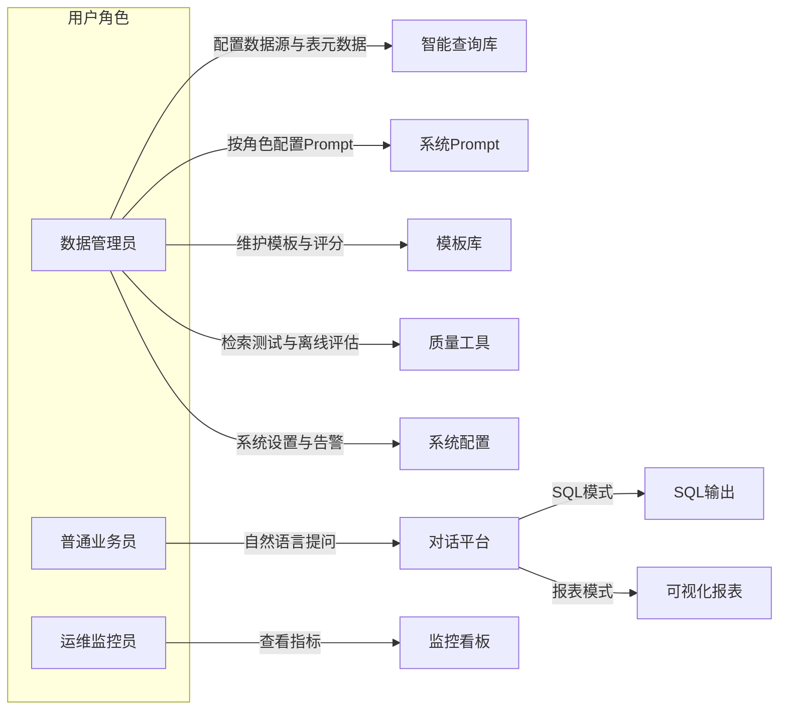
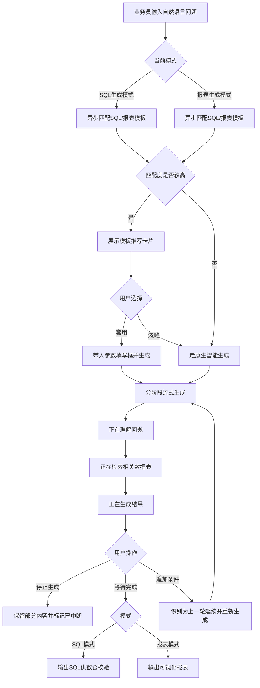
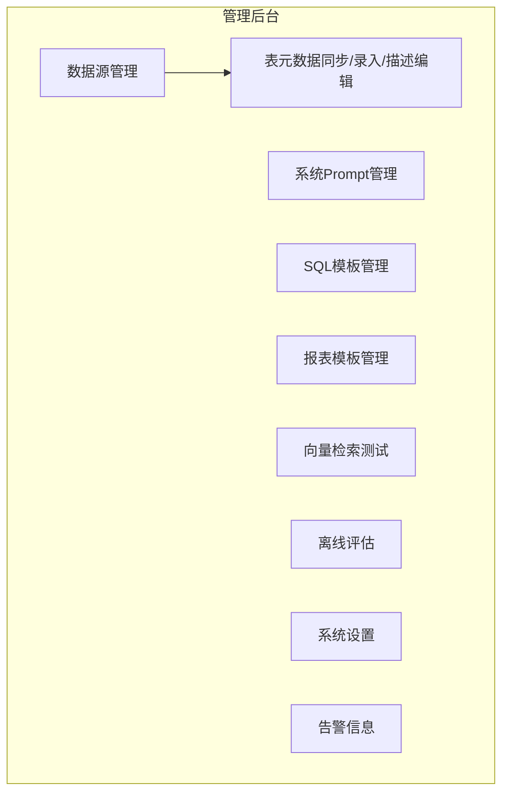

# 数据透视平台 PRD 撰写计划

## 目标与约束

- **产出物**：[`docs/PRD_业务需求文档_v1.0.md`](docs/PRD_业务需求文档_v1.0.md)（需新建 `docs/` 目录）
- **产品名称**：对齐项目既有命名——**灵析 (LingAnalytics)** / 智能数据透视平台
- **严格排除**：技术选型、API 定义、数据库表结构/ER 图、代码实现逻辑
- **聚焦**：用户行为、系统响应、业务流程、界面交互规则

---

## 文档结构（共 7 大章）

### 1. 文档修订记录与术语定义

**修订记录**（首版 v1.0）：

| 版本 | 日期 | 修订人 | 修订说明 |
|------|------|--------|----------|
| v1.0 | 2026-07-01 | — | 初稿，覆盖管理后台（8 子域）、用户前端、监控平台三大模块 |

**术语定义**（从业务诉求中提炼，预计 15~20 条）：

- 智能查询库、数据源、表元数据同步、业务中文名、字段同义词、系统 Prompt、角色 Prompt、SQL 模板、报表模板、占位符参数、模板匹配度、语义检索、离线评估集、评估报告、流式回复、会话延续、缓存命中、检索相似度评分、返回行数上限、告警事件、Token 消耗、满意度反馈等
- 每条术语给出**业务含义**与**使用场景**，不涉及底层实现
- **语义检索**：业务层表述为「根据用户自然语言问题，从已维护的表/字段知识中找出最相关的数据对象」；PRD 中统一用此表述，避免写「向量」等技术词汇（管理端菜单可保留用户原称「向量检索测试」，正文以业务语义描述其用途）

---

### 2. 用户角色定义

定义三类角色及其职责边界：

| 角色 | 核心诉求 | 可访问模块 |
|------|----------|------------|
| **数据管理员** | 接入数据源、同步/维护表元数据、按角色配置系统 Prompt、管理模板、执行检索测试与离线评估、管理系统策略与查看告警 | 管理后台 |
| **普通业务员** | 用大白话取数、做报表，无需懂 SQL | 用户前端平台 |
| **运维/监控员** | 关注系统运行质量、成本与用户满意度 | 监控平台 |

补充说明：数仓同事作为**外部协作角色**（校验 SQL），在流程图中体现但不在系统内建角色列表中。

---

### 3. 业务总体流程图

用 Mermaid flowchart 描述**从提问到拿到结果**的完整路径，覆盖双模式分支：

流程说明将用文字补充：历史会话管理、点赞/点踩反馈如何回流至监控看板（业务层面描述，不写埋点方案）。

---

### 4. 功能性需求详细说明

按三大模块逐一展开，每个功能点统一采用 **输入条件 → 处理规则 → 输出结果 → 界面交互规则** 四段式描述。

#### 模块一：管理后台（数据管理员）

管理后台扩展为 **8 大功能域**（数据源与表元数据合并为一域，内含同步/录入/描述三类能力）：

| 功能域 | 核心需求要点 |
|--------|-------------|
| **4.1.1 数据源与表元数据管理** | **数据源**：配置连接信息（地址、账号、库名）、测试连接；**表元数据同步**：连接成功后自动拉取表/字段清单；**手动录入**：支持补充手工新增表/字段；**编辑描述**：勾选纳入智能查询库的表；编辑表/字段业务中文名与字段描述；维护字段同义词（一对多，如 created_at →「下单时间」「注册日期」） |
| **4.1.2 系统 Prompt 管理** | 维护**角色设定**与**系统限制**；支持**按用户角色分别配置**不同 Prompt；支持预览、版本记录与回滚 |
| **4.1.3 SQL 模板管理** | 模板名称、适用业务场景描述、带占位符的 SQL；系统评分；高分模板可「收入模板库」 |
| **4.1.4 报表模板管理** | 模板名称、图表类型（折线/柱状/表格）、SQL 占位符、图表配置（横轴/纵轴）；评分与收入机制同 SQL 模板 |
| **4.1.5 向量检索测试**（业务表述：语义检索测试） | 输入模拟用户问题，展示匹配表/字段及相似度排序；验证元数据与同义词维护效果；可重复测试，无需完整生成 SQL/报表 |
| **4.1.6 离线评估** | 维护/使用评估问题集（含期望涉及表/期望要点）；批量运行输出评估报告（命中率、低分样本、一致性摘要）；支持导出 |
| **4.1.7 系统设置** | SQL 生成全局策略（业务规则级，如跨库限制、默认时间推断）；**返回数据行数上限**配置，超限须提示用户收窄条件 |
| **4.1.8 告警信息** | 集中展示业务告警（检索低分集中、连接失败、评估异常、行数超限频发等）；筛选、已读/已处理、跳转关联配置页 |

**管理后台导航结构（建议）**：

**界面交互规则补充**：
- 数据源 ↔ 元数据：以数据源为入口，进入后分 Tab「连接配置 / 表清单 / 字段详情」；同步与手动录入可并存，手动录入项需标记来源
- 连接测试：成功/失败即时反馈；失败不触发同步
- Prompt 管理：左侧角色列表，右侧编辑「角色设定」「系统限制」；未单独配置的角色继承默认 Prompt
- 语义检索测试：输入框 +「开始测试」；结果区展示 Top-N 表/字段卡片及相似度（业务可读等级：高/中/低）
- 离线评估：选择评估集 → 确认运行 → 进度条 → 报告页；运行中可取消
- 系统设置：行数限制需有默认值与上下界提示；修改需二次确认
- 告警：未处理告警在导航角标提示；与监控看板预警事件同源、管理端侧重处置闭环

#### 模块二：用户前端平台（普通业务员）

| 功能域 | 核心需求要点 |
|--------|-------------|
| **4.2.1 双模式切换** | 对话框顶部切换「SQL 生成模式」/「报表生成模式」，切换后上下文保持、生成逻辑按模式分流 |
| **4.2.2 智能输入与模板推荐** | 输入问题时异步匹配模板；高匹配度时以卡片提醒「检测到已有相似报表/SQL 模板，是否直接套用？」；套用→参数框；忽略→原生生成 |
| **4.2.3 流式交互** | 逐字流式推送；三阶段状态文案：理解问题 → 检索数据表 → 生成结果 |
| **4.2.4 中断与继续** | 生成中发送按钮变为「停止生成」；中断后保留已生成内容并标记「已中断」；任意历史气泡下可追加条件，系统识别为延续而非新话题 |
| **4.2.5 历史记录** | 左侧边栏按日期倒序；支持重命名标题、删除会话 |

**界面交互规则补充**：
- 模板推荐卡片位置：对话框上方或侧边，不遮挡输入区
- 停止按钮与发送按钮互斥切换，中断后恢复为发送
- 追加条件时，系统应在回复中体现对上一轮上下文的引用（业务层描述）

#### 模块三：监控平台（运维/管理层）

| 功能域 | 核心需求要点 |
|--------|-------------|
| **4.3.1 缓存命中看板** | 近 24 小时查询重复率图表 |
| **4.3.2 检索质量预警** | 相似度低分集中时高亮预警（业务含义：系统未找到合适表） |
| **4.3.3 Token 消耗统计** | 近一周/一月消耗趋势图 |
| **4.3.4 用户满意度** | 点赞/点踩统计展示 |

---

### 5. 非功能性业务需求

仅从业务层面描述，不涉及技术方案：

| 类别 | 业务要求 |
|------|----------|
| **响应体验** | 流式首字出现 ≤ 3 秒；模板匹配卡片在输入停顿后 ≤ 2 秒出现；完整 SQL/报表生成在常规模型下 ≤ 60 秒（超时需提示） |
| **可用性** | 工作时间（8:00–20:00）系统可用率 ≥ 99%；计划维护需提前通知 |
| **数据安全与权限** | 业务员仅能查询其权限范围内的表/字段；管理员操作需留痕；敏感字段（如手机号）查询结果需脱敏展示 |
| **并发与公平** | 单用户同时仅允许 1 个进行中的生成任务；中断后立即释放 |
| **审计** | 每次 SQL/报表生成需记录：提问人、时间、所用模板（若有）、满意度反馈；Prompt 变更、系统设置变更需记录操作人与时间 |
| **结果可控** | 查询返回行数不得超过管理员在系统设置中配置的上限；超限时须明确提示并建议收窄条件 |

---

### 6. 验收标准

每个模块 3~5 条**可测试的业务验收用例**（Given-When-Then 或步骤式）：

**模块一（管理后台）— 5 条核心用例**：
1. 管理员配置有效连接并测试通过 → 可触发元数据同步，展示该库全部表及字段清单；支持对手工补充的表/字段编辑业务描述
2. 管理员为「普通业务员」角色单独配置 Prompt 限制「不可查询薪资相关表」→ 该角色用户提问薪资时系统拒绝并说明原因
3. 管理员在语义检索测试中输入「上个月华东销售额」→ 展示匹配表/字段列表及相似度，与业务员实际提问检索结果一致
4. 管理员运行离线评估集（含 20 条标准问题）→ 生成命中率报告，低分样本可逐条查看
5. 管理员将返回行数上限设为 1000 → 业务员生成 SQL 执行后若结果超限，系统提示收窄条件；同时告警信息中出现「行数超限」类记录（若达预警阈值）
6. （备选）高分 SQL 模板被「收入」→ 用户端可被推荐卡片命中

**模块二（用户前端）— 示例**：
1. 切换至报表模式并输入「上个月华东区销售额」→ 流式三阶段展示后输出图表
2. 输入与已有模板高度相似的问题 → 2 秒内出现推荐卡片；点击「套用」→ 弹出参数框
3. 生成过程中点击「停止生成」→ 内容保留并标记「已中断」
4. 在历史回复下输入「把地区换成华北」→ 系统基于上一轮上下文重新生成
5. 左侧历史列表支持重命名与删除，删除后会话不可恢复

**模块三（监控平台）— 示例**：
1. 看板展示近 24 小时查询重复率折线图
2. 当低相似度评分占比超阈值 → 看板出现高亮预警
3. 可切换查看近一周/一月 Token 消耗趋势
4. 展示点赞/点踩数量及占比统计

---

## 撰写原则

1. **语言风格**：面向业务方可读，面向开发方可执行（规则明确、无歧义）
2. **编号体系**：章节 1~6；功能需求 4.x.x；验收用例 AC-Mx-y
3. **不越界**：凡涉及「如何实现」的内容一律不写；用「系统应」「用户可」等业务句式
4. **与项目对齐**：产品名使用「灵析」；不引用 [`AGENTS.md`](AGENTS.md) 中的技术栈内容

---

## 执行步骤

1. 创建目录 `docs/`
2. 按上述结构撰写完整 Markdown 文档（预计 550~750 行，管理后台章节占比提升）
3. 自检：全文检索是否误含 API、表结构、技术栈关键词
4. 保存至 [`docs/PRD_业务需求文档_v1.0.md`](docs/PRD_业务需求文档_v1.0.md)

## 风险与假设

- **假设**：公司已有统一账号体系，PRD 不展开登录/SSO 细节，仅在权限章节提及「按角色授权」
- **假设**：数仓同事通过线下或既有协作渠道校验 SQL，系统只负责输出 SQL 文本
- **未覆盖**：移动端适配、多语言等未在用户诉求中出现，首版 PRD 不展开
- **管理端与监控端边界**：监控看板侧重趋势与宏观指标；管理端「告警信息」侧重事件列表与处置闭环，二者事件类型对齐但展示粒度不同
