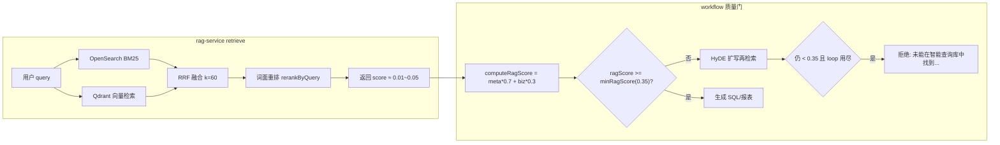

# RAG 检索评分尺度不一致 — 根因确认与修复计划

## 结论（先回答你的问题）

**你的猜测是对的，且这是主因。** 当前系统把 **RRF（Reciprocal Rank Fusion）排名分** 当作「相似度」返回并用于质量门控，但该分数天然落在 **~0.01–0.05** 区间，而门限与 UI 按 **0–1 余弦相似度** 设计（阈值 0.35 / 0.6）。因此：

- 管理端「向量检索测试」显示 0.0x 是 **RRF 分数的正常范围**，不代表「没有匹配」；
- 前端提问几乎必然触发 `RagQualityGate` 拒绝，与索引是否有数据、向量是否真的相关 **相对独立**——只要 RRF 分 < 0.35 就会拒绝。

**需要做归一化/换分，但不是简单 min-max 归一化 RRF，而是应改用 0–1 语义相似度作为对外 `score`。**

---

## 当前评分链路（问题在哪）



### 1. RRF 分数的取值范围

[`apps/rag-service/src/services/fusion.ts`](apps/rag-service/src/services/fusion.ts) 中 RRF 公式：`1 / (k + rank + 1)`，`k=60`。

| 场景 | 理论最高分 |
|------|-----------|
| 单路 rank=0 | 1/61 ≈ **0.016** |
| BM25 + Vector 双路 rank=0 同一文档 | 2/61 ≈ **0.033** |
| 再经 rerank（RRF×0.7 + 词面×0.3，词面=1） | ≈ **0.323** |

而 [`packages/workflow/src/state.ts`](packages/workflow/src/state.ts) 中 `minRagScore: 0.35`，[`apps/web-admin/lib/api.ts`](apps/web-admin/lib/api.ts) 的 `scoreLabel` 也用 0.35/0.6 分档。

**即使在最理想情况下（双路第一 + 完美词面匹配），融合分仍低于 0.35，质量门理论上无法通过。**

### 2. Qdrant 原始向量分被丢弃

[`apps/rag-service/src/lib/qdrant.ts`](apps/rag-service/src/lib/qdrant.ts) 返回的 `score` 是 **余弦相似度（0–1）**，但 [`reciprocalRankFusion`](apps/rag-service/src/services/fusion.ts) **只使用排名，不使用原始分数**。管理端看到的 0.0x 是 RRF 分，不是向量相似度。

### 3. Workflow 门限逻辑

[`packages/workflow/src/rag-utils.ts`](packages/workflow/src/rag-utils.ts)：

```typescript
export function computeRagScore(schemaContext, businessKnowledge) {
  const metaScore = schemaContext[0]?.score ?? 0;
  const bizScore = businessKnowledge[0]?.score ?? 0;
  return metaScore * 0.7 + bizScore * 0.3;
}
```

[`packages/workflow/src/nodes.ts`](packages/workflow/src/nodes.ts) `ragQualityGateNode`：`ragScore >= minRagScore(0.35)` 才放行，否则 HyDE → 循环 → 拒绝。

**没有「低于 X 就不返回结果」的过滤**；检索结果会返回，但门控用错误量纲的 score 判定失败。

### 4. 与模板匹配的一致性对比

[`apps/report-service/src/services/template-matcher.ts`](apps/report-service/src/services/template-matcher.ts) 使用 `cosineSimilarity(embedText(query), embedText(text))`，阈值 0.3，分数在 0–1。**RAG 检索路径与模板匹配路径的评分语义不一致**，这是设计/实现缺口。

### 5. 次要因素（非主因，但会影响修复后效果）

| 因素 | 影响 |
|------|------|
| **中文词面 rerank** | `rerankByQuery` 用 `split(/\s+/)` 分词，中文整句常被视为 1 个 token，词面加成几乎无效 |
| **本地 mock embedding** | [`apps/rag-service/src/lib/embedding.ts`](apps/rag-service/src/lib/embedding.ts) 为字符哈希式 64 维向量，语义能力弱于真实 embedding 模型；修复尺度后分数可能仍偏低，但应能过门限 |
| **索引未重建** | 若未执行「重建索引」，可能无结果或极低相关；你看到有 0.0x 分说明 **有命中**，主因仍是尺度 |
| **测试未覆盖真实检索** | [`packages/workflow/src/graph.test.ts`](packages/workflow/src/graph.test.ts) mock `score: 0.8`，未暴露 RRF 尺度 bug |

---

## 推荐修复方案（最小闭环）

### 核心原则

- **RRF / BM25 排名**：仅决定「谁排在前面」；
- **对外 `RetrieveResult.score`**：使用 **0–1 语义相似度**（与 PRD「相似度等级」、监控阈值、workflow 门限一致）；
- **不**对 RRF 做 min-max 归一化作为主方案（相对归一化会在「全是差结果」时虚高，误导门控）。

### 实现要点（[`apps/rag-service`](apps/rag-service)）

1. **扩展 `RankedDoc`**：在 RRF 融合时保留每文档的 `maxVectorScore`（来自 Qdrant hit.score，0–1）。
2. **最终 `score` 计算**（rerank 之后）：
   - 主分：`semanticScore = cosineSimilarity(embedText(query), embedText(doc.content))`
   - 可选轻量融合：`finalScore = semanticScore * 0.85 + min(vectorScore, 1) * 0.15`（当 vector hit 存在时）
   - 排序仍可按 RRF+词面，但 **返回的 score 用 semanticScore**
3. **更新 [`fusion.ts`](apps/rag-service/src/services/fusion.ts) 单测**：断言 RRF 排名分与对外 similarity 分离；相似文本 semanticScore > 0.35。
4. **（可选第二期）中文词面 rerank**：对 query/content 做字符 n-gram 或简单 CJK 切分，提升无空格中文的 rerank 效果。

### Workflow / 管理端（基本无需改阈值）

- `minRagScore: 0.35` 可保持（与 PRD、监控 [`LOW_SCORE_THRESHOLD`](apps/metadata-service/src/services/monitor-service.ts) 一致）。
- 管理端 [`search-test/page.tsx`](apps/web-admin/app/search-test/page.tsx) 无需改 UI，修复后 score 会自然显示 0.x–0.x 的合理相似度。
- 补充 **rag-service 集成测试**：模拟 retrieve → `computeRagScore` ≥ 0.35 可通过门控。

### 验证步骤（修复后）

1. 管理端：数据源同步 → 元数据「重建索引」→ 向量检索测试，确认 score 在 0–1 且相关命中 ≥ 0.35 显示「中/高」。
2. 前端：同类问题应通过 `RagQualityGate`，不再默认拒绝。
3. `just test -- apps/rag-service` + workflow 相关测试。

---

## 若修复尺度后仍偏低，再排查的环节

按优先级：

1. **索引内容**：`/v1/meta/query-library` 是否有字段；是否执行过 `POST /v1/index/rebuild`。
2. **Embedding 质量**：本地 mock embedding 对业务同义词/近义表述区分度有限 → 长期应接入真实 embedding API（架构文档已预留）。
3. **元数据丰富度**：表/字段业务名、同义词、描述是否维护充分（影响 BM25 与向量文本）。
4. **HyDE 扩写**：尺度修复后门控应能通过；HyDE 作为兜底增强，非主路径。

---

## 涉及文件

| 文件 | 改动 |
|------|------|
| [`apps/rag-service/src/services/fusion.ts`](apps/rag-service/src/services/fusion.ts) | 保留 vectorScore；输出 0–1 semantic score |
| [`apps/rag-service/src/services/retrieve-service.ts`](apps/rag-service/src/services/retrieve-service.ts) | 接入新 score 逻辑 |
| [`apps/rag-service/src/index.test.ts`](apps/rag-service/src/index.test.ts) | 补充尺度与门限回归测试 |
| （可选）[`packages/contracts/src/index.ts`](packages/contracts/src/index.ts) | 增加 `rankScore` / `similarityScore` 字段便于调试 |

**不改**：`minRagScore`、管理端阈值常量（修复后语义对齐即可）。
