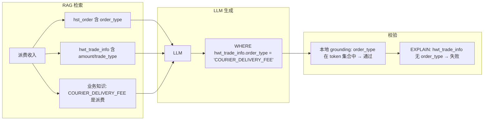
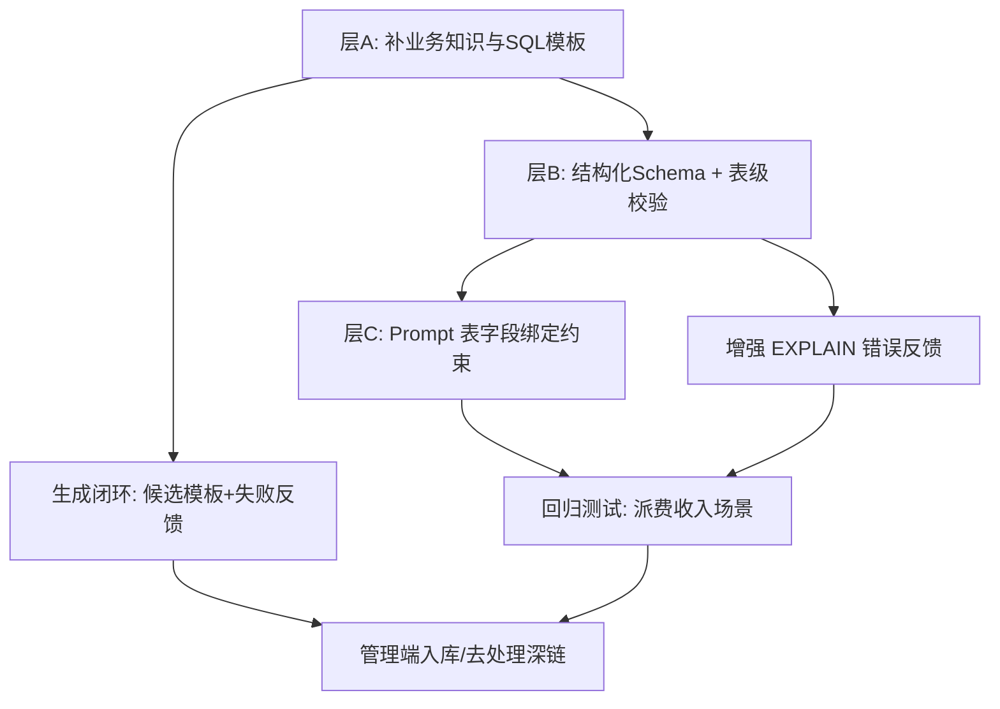
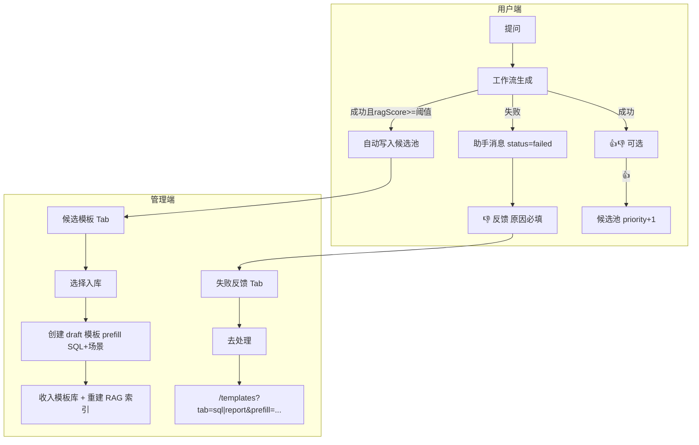

# SQL 不存在字段问题分析与改进方案

## 现象复盘

用户提问：**「业务员想要查看自己的派费收入」**

前端流式输出：
1. 正在理解问题…
2. 正在检索相关数据表…
3. 正在生成 SQL…（出现 **3 次** = 首次生成 + 最多 2 次校验重试，见 [`maxValidateRetries: 2`](packages/workflow/src/state.ts)）
4. 最终拒绝：`SQL 校验未通过：Unknown column 'hwt_trade_info.order_type' in 'where clause'`

**关键信号**：错误信息来自 MySQL `EXPLAIN`（report-service），而非本地 grounding 的 `SQL 包含知识库外的字段：...`。说明本地校验**已放行**，数据库校验才拦截。



---

## 根因分析（按优先级）

### 1. 跨表字段混用（主因）

结算 demo 数据中，**`order_type` 只属于 `hst_order`，不属于 `hwt_trade_info`**：

| 表 | 与「派费收入」相关字段 |
|---|---|
| [`hst_order`](scripts/settle/sql/02-schema.sql) | `order_type`（含 `COURIER_DELIVERY_FEE` 派费）、`order_amount`、`object_code` |
| [`hwt_trade_info`](scripts/settle/sql/02-schema.sql) | `trade_type`、`biz_type`、`amount`、`finish_time`（**无 order_type**） |
| [`hst_bill_item`](scripts/settle/query-library.json) | `amount`、`rec_object`（收款方=业务员） |
| [`nl_courier`](scripts/settle/query-library.json) | `staff_code`（业务员编号） |

业务知识明确写了 [`hst_order.order_type` 的派费枚举值](scripts/settle/business-knowledge.json)，但 LLM 很可能选了「钱包交易表」`hwt_trade_info` 来查「收入/金额」，并把 `order_type` 条件错误地贴到了该表上。

这是典型的 **Schema 幻觉**：字段在知识库里存在，但**用错了表**。

### 2. 本地 grounding 只做「全局 token 匹配」，不做「表-字段」绑定

[`packages/workflow/src/grounding.ts`](packages/workflow/src/grounding.ts) 的 `collectKnownTokens` 把 RAG 返回的所有 metadata 文档 token 合并成一个扁平 `Set`：

```13:21:packages/workflow/src/grounding.ts
function collectKnownTokens(schemaContext: RetrieveResult[]): Set<string> {
  const known = new Set<string>();
  for (const item of schemaContext) {
    const tokens = item.content.toLowerCase().match(/[a-z_][a-z0-9_]*/g) ?? [];
    for (const t of tokens) known.add(t);
  }
  return known;
}
```

因此：只要 RAG 同时检索到 `hst_order`（含 `order_type`）和 `hwt_trade_info`，`order_type` 就被视为「合法字段」，**无论它写在哪个表的 WHERE 里**。

本地校验对 `hwt_trade_info.order_type` 会 **误判为通过**；MySQL EXPLAIN 才会报真实错误。

### 3. Schema 上下文是非结构化纯文本，与设计文档有 gap

架构设计文档要求 [`<schema_context>` 为结构化 JSON，LLM 只能引用此处表/字段](docs/plans/灵析系统架构设计_86078467.plan.md)，但实际实现是 RAG 字段级文档拼接成编号列表：

- 索引：[`index-pipeline.ts`](apps/rag-service/src/services/index-pipeline.ts) 按**字段**建文档，`content = 表名 + 字段名 + 同义词 + 描述`
- 注入 LLM：[`contextSummary`](packages/llm-tools/src/llm/openai-style-provider.ts) 取 top 8 条纯文本

LLM 难以可靠推断「哪个字段属于哪张表」，尤其在多表 JOIN 场景。

### 4. 业务语义歧义 + 缺少 Few-shot 模板

「派费收入」在结算域有多条合理路径，当前 [`sql-templates.json`](scripts/settle/sql-templates.json) 只有「近 7 天 fund_flow」，**没有派费/业务员收入模板**。LLM 需自行推断 JOIN 路径（如 `hst_order → hst_pay_order → hst_bill_item → nl_courier`），容易选错表。

### 5. 仅优化 Prompt 不够

现有 Prompt **已有**字段约束（[`buildSystemPrompt`](packages/llm-tools/src/llm/openai-style-provider.ts)）：

> 字段约束：WHERE/SELECT/ORDER BY 中的列名必须出现在 Schema 上下文中；禁止臆造...

但约束是「字段名在上下文中出现即可」，**未要求表-字段对应关系**。单靠加强 Prompt 可降低概率，无法消除跨表混用；需配合结构化 Schema + 表级校验。

---

## 改进方案（建议分层实施）

### 层 A：数据与知识补全（低成本、立竿见影）

**适用**：当前 settle demo / 生产元数据维护

1. **补充业务指标知识**：在 [`business-knowledge.json`](scripts/settle/business-knowledge.json) 增加「业务员派费收入」标准口径，明确表路径与 JOIN，例如：
   - 推荐：`hst_order`（`order_type='COURIER_DELIVERY_FEE'`）+ `nl_courier`（`staff_code`/`object_code` 关联）
   - 或已结算：`hst_bill_item` + `hst_bill` + 收款方过滤
   - **显式说明**：`order_type` 仅在 `hst_order`，不可用于 `hwt_trade_info`

2. **补充 SQL 模板**：在 [`sql-templates.json`](scripts/settle/sql-templates.json) 增加「业务员派费收入」few-shot，标注字段必须来自 schema。

3. **元数据同义词**：为 `hst_order.order_type` 增加「派费类型」等同义词；为 `hwt_trade_info.trade_type` 区分「交易类型 ≠ 订单类型」。

### 层 B：工程化 Grounding（中成本、系统性修复）

**核心：把「字段在知识库存在」升级为「字段在该表存在」**

1. **结构化 Schema 注入**（改 [`openai-style-provider.ts`](packages/llm-tools/src/llm/openai-style-provider.ts)）
   - RAG 检索后，按 `table → columns[]` 聚合（可从 metadata-service 或检索结果重建）
   - Prompt 中改为 JSON 块，示例：
     ```json
     {"hst_order":["order_code","order_type","order_amount",...],"hwt_trade_info":["trade_code","amount","trade_type",...]}
     ```
   - 增加约束：`table.column` 中 column 必须属于该 table 的字段列表

2. **表级列校验**（改 [`grounding.ts`](packages/workflow/src/grounding.ts)）
   - 解析 SQL 中 `alias.column` / `table.column` 引用
   - 对照结构化 schema 校验；对无表前缀的裸列名，若出现在多张表则要求 LLM 加表前缀或拒绝
   - 现有 regex 仅覆盖 WHERE/JOIN/GROUP BY/ORDER BY/HAVING，**不检查 SELECT 列表**——应一并覆盖

3. **增强 EXPLAIN 失败反馈**（改 [`validateResultNode`](packages/workflow/src/nodes.ts) + [`sql-executor.ts`](apps/report-service/src/services/sql-executor.ts)）
   - 解析 `Unknown column 'table.col'` 时，若 schema 中该 col 属于其他表，生成定向反馈：
     > `order_type` 属于 `hst_order`，不属于 `hwt_trade_info`；请修正表引用或改用 JOIN
   - 比裸 MySQL 错误更利于 LLM 在 2 次重试内 Self-Correct

4. **（可选）SQL AST 解析**：用 `node-sql-parser` 等替代 regex，提升 JOIN/别名/子查询场景的列提取准确率。

### 层 C：Prompt 微调（低成本、配合 B 层）

在 [`buildSystemPrompt`](packages/llm-tools/src/llm/openai-style-provider.ts) 追加：

- **表-字段绑定**：`tableResponse` 必须属于所引用表的字段列表；禁止把 A 表字段写到 B 表
- **多表场景**：优先参考「业务知识」中的 JOIN 路径；无明确路径时在 explanation 说明假设
- **字段不存在时**：不得编造；应在 explanation 说明缺失并建议联系数据管理员

> 注意：Prompt 是必要补充，**不能替代**层 B 的表级校验。

---

## 关于「是否约束 LLM 返回中文」

**现状：无显式全局语言策略，但默认偏向中文。**

| 环节 | 语言约束 |
|------|----------|
| [`buildSystemPrompt`](packages/llm-tools/src/llm/openai-style-provider.ts) | 安全/字段约束为中文；**未写**「explanation 必须中文」 |
| `generateSql` | 要求 JSON `{sql, explanation}`；fallback explanation 为 `'已生成 SQL。'` |
| `summarizeResult` | 「简短自然语言解读」——中文语境，无 explicit locale |
| `explanation` / SQL | SQL 用物理英文字段名；说明性文字实际多为中文 |
| 角色 Prompt | 管理员配置，通常中文 |

**结论**：
- 当前是**隐式中文**（系统 Prompt 全中文 + 中文 UI），不是硬约束
- 若用户用英文提问，LLM **可能**用英文 explanation（无强制规则）
- 专业名词/SQL/表名字段名保持英文物理名——这是合理且已有的实践

**建议**（若需产品级明确）在 `buildSystemPrompt` 增加一条：

> 面向用户的 `explanation` 默认使用**简体中文**；SQL、表名、字段名、枚举值保持物理名不翻译。仅当用户明确要求其他语言时使用对应语言。

---

## 推荐实施顺序



1. **短期（1-2 天）**：层 A — 补 settle 派费收入业务知识与模板，验证该问题是否可稳定通过
2. **中期（3-5 天）**：层 B — 结构化 schema + 表级 grounding（根治跨表混用）
3. **同步**：层 C + 中文输出显式约束 + 跨表幻觉回归测试
4. **并行（3-4 天）**：生成闭环 — 候选池（自动+点赞优先）+ 失败 👎 反馈 + 管理端「生成闭环」页 + templates 预填深链

---

## 验证计划

针对「业务员查看自己的派费收入」：

- [ ] RAG 检索结果包含 `hst_order`、`hwt_trade_info`、派费业务知识
- [ ] 生成 SQL 不含 `hwt_trade_info.order_type`
- [ ] 本地表级 grounding 能拦截跨表字段（即使 token 全局存在）
- [ ] EXPLAIN 通过；或 2 次重试内 Self-Correct
- [ ] explanation 为中文（除非用户指定其他语言）

建议新增测试用例（[`grounding.test.ts`](packages/workflow/src/grounding.test.ts)）：

```typescript
// hst_order 上下文含 order_type，但 SQL 写在 hwt_trade_info 上 → 应 fail
checkColumnGrounding({
  sql: "SELECT amount FROM hwt_trade_info WHERE hwt_trade_info.order_type = 'COURIER_DELIVERY_FEE'",
  schemaContext: [
    { content: 'hst_order 结算主订单 order_type 订单类型', score: 0.9 },
    { content: 'hwt_trade_info 钱包交易 amount trade_type', score: 0.8 },
  ],
});
// 期望: ok=false, unknownColumns 含 order_type（表级校验后）
```

---

## 风险与假设

- 假设报错环境使用 settle demo 数据源（[`scripts/settle/`](scripts/settle/)）；若生产元数据不同，需核对实际 `hwt_trade_info` 是否确实无 `order_type`
- 表级校验需处理 SQL 别名（`FROM hwt_trade_info t WHERE t.order_type`）——实现时需 alias → table 映射
- 结构化 schema 聚合若仅依赖 RAG topK，可能漏字段；理想方案是从 metadata-service 按检索到的表名拉全量字段（需评估 API 是否已有）

---

## 新增功能：生成闭环（候选模板 + 失败反馈）

> 与 PRD [4.1.3 SQL 模板管理](docs/PRD_业务需求文档_v1.0.md)「管理员可筛选高分模板收入模板库」及 [4.2.6 满意度反馈](docs/PRD_业务需求文档_v1.0.md) 对齐，补齐**从用户生成到管理端沉淀/修复**的闭环。

### 现状与缺口

| 能力 | 现状 | 缺口 |
|------|------|------|
| 生成结果持久化 | [`chat-service.ts`](apps/orchestrator/src/services/chat-service.ts) 已在 `messages.metadata` 存 `sql`、`ragScore`、`chartConfig` | 失败时未存 `refuseReason`/`lastError`；未关联用户提问 |
| 满意度反馈 | [`message_feedback`](migrations/chat/migrations/20260701000001_init.ts) + 用户端 👍👎 | **仅 `status=completed` 显示反馈**；失败消息无法点踩 |
| 模板入库 | [`templates/page.tsx`](apps/web-admin/app/templates/page.tsx) 手动创建 +「收入库」开关 | 无「从成功生成自动候选」流程 |
| 失败处置 | [`alerts/page.tsx`](apps/web-admin/app/alerts/page.tsx) 告警列表 | 无「用户提问 + 失败 SQL + 反馈原因」专项队列 |
| 审计表 | `generation_audit` 已建表 | **未写入**，字段不足以支撑闭环 |

### 目标流程



### 入选规则（已确认）

**候选模板（成功路径）**——两者结合：
- **自动入池**：`status=completed`、非套用模板（`metadata.appliedTemplate !== true`）、有 `generatedSql`、`ragScore >= 阈值`（默认 0.7，可写入 `system_settings`）
- **点赞优先**：用户对同条消息 👍 后，`priority` 提升，管理端列表置顶展示
- **不入池**：已存在相同 message 的候选、或 SQL 为空

**失败反馈（失败路径）**——扩展现有 👎：
- `status=failed` 或 `status=interrupted` 且已有实质输出（含 refuseReason / 部分 SQL）的助手消息，展示 👎
- 点踩时**原因必填**（与成功结果的选填区分）
- 写入 `message_feedback` + 标记 `generation_feedback_items` 待处理

### 数据模型

**1. `template_candidates`（meta DB，新迁移）**

| 字段 | 说明 |
|------|------|
| id | UUID |
| source_message_id | 关联 chat.messages |
| conversation_id | 会话 ID |
| mode | sql / report |
| user_query | 用户原始提问（冗余，便于列表展示） |
| scenario_description | 默认 = 用户提问截断 |
| sql_body | 生成 SQL |
| chart_type / chart_config | 报表模式 |
| rag_score | 工作流 RAG 分数 |
| user_upvoted | 是否被点赞 |
| priority | 排序权重（upvote +10） |
| status | pending / approved / rejected |
| template_id | 入库后关联 sql_templates 或 report_templates |
| created_at | |

**2. `generation_feedback_items`（chat DB 或 meta DB）**

| 字段 | 说明 |
|------|------|
| id | UUID |
| message_id | 助手消息 ID |
| conversation_id | |
| mode | sql / report |
| user_query | 上一条 user 消息内容 |
| assistant_content | 拒绝/错误说明 |
| generated_sql | metadata.sql（最后一次尝试） |
| refuse_reason | metadata.refuseReason |
| rag_score | |
| feedback_reason | 用户点踩原因 |
| status | open / resolved |
| resolved_by / resolved_at | |
| result_template_id | 处理后创建的模板 ID（可选） |

**3. 增强 `messages.metadata`（[`chat-service.ts`](apps/orchestrator/src/services/chat-service.ts)）**

失败/成功均写入：

```json
{
  "sql": "...",
  "ragScore": 0.82,
  "chartConfig": {},
  "refuseReason": "SQL 校验未通过：...",
  "lastError": "...",
  "workflowNode": "ValidateResult",
  "userQuery": "业务员想要查看自己的派费收入"
}
```

**4. 复用 `generation_audit`**

在生成完成时写入：`user_id`、`mode`、`used_template`、`interrupted`、`trace_id`，并扩展 `message_id` 字段（需迁移）。

### 后端 API（metadata-service + orchestrator）

| 端点 | 职责 |
|------|------|
| `POST /internal/candidates`（orchestrator 内部） | 生成成功后异步创建候选 |
| `GET /v1/template-candidates?status=pending` | 管理端列表，按 priority DESC |
| `POST /v1/template-candidates/:id/approve` | 创建 draft 模板 + 可选直接 in_library |
| `POST /v1/template-candidates/:id/reject` | 拒绝候选 |
| `GET /v1/generation-feedback?status=open` | 失败/不满意反馈队列 |
| `PATCH /v1/generation-feedback/:id/resolve` | 标记已处理，关联 template_id |

orchestrator 侧：
- 扩展 [`FeedbackService`](apps/orchestrator/src/services/feedback-service.ts)：失败消息点踩校验 reason 必填；upvote 时回调 metadata-service 提升候选 priority
- 生成完成后调用候选创建（可 fire-and-forget）

### 管理端 UI

**新页面** [`apps/web-admin/app/generation-closed-loop/page.tsx`](apps/web-admin/app/generation-closed-loop/page.tsx)（或拆入 templates 页第二入口），两个 Tab：

**Tab 1 — 候选模板**
- 列：用户提问、模式、ragScore、是否点赞、SQL 预览、创建时间
- 操作：**入库**（打开 templates Drawer 预填 name/scenario/sql/chartConfig）、**拒绝**
- 入库后引导「收入模板库」+ 触发 [`ragApi.rebuildIndex('templates')`](apps/web-admin/app/templates/page.tsx)

**Tab 2 — 生成反馈**
- 列：用户提问、失败原因、最后 SQL 草案、用户反馈原因、模式、时间、状态
- 操作：**去处理** → 深链 `/templates?tab={mode}&prefill={base64}` 打开编辑 Drawer
- **标记已处理** + 可选备注

[`AdminLayout`](apps/web-admin/components/AdminLayout.tsx) 导航新增「生成闭环」。

[`templates/page.tsx`](apps/web-admin/app/templates/page.tsx) 支持 URL query 预填：

```typescript
// /templates?tab=sql&prefill=<base64({ name, scenarioDescription, sqlBody, sourceFeedbackId })>
```

### 用户端 UI

改 [`apps/web-user/app/page.tsx`](apps/web-user/app/page.tsx)：

- 当前仅 `m.status === 'completed'` 显示 👍👎 → 扩展为：
  - `completed`：👍👎，点踩原因选填（保持 PRD）
  - `failed` / `interrupted`（有 content）：仅 👎，**原因必填**（Modal 输入框）
- 点踩成功后 toast「感谢反馈，管理员将跟进优化」

### 与 SQL 幻觉修复的协同

- 失败反馈队列可直接消费「派费收入」类 case：管理员看到 `hwt_trade_info.order_type` 错误 + 用户提问，一键跳转模板页编写正确 JOIN SQL 并入库
- 成功高分候选可在 Grounding 修复后自动积累正确模板，减少同类幻觉复发

### 实施顺序（在层 A/B 之后或并行）

1. **数据层**：迁移 `template_candidates`、`generation_feedback_items`；增强 message metadata
2. **orchestrator**：生成完成写候选；反馈校验 + upvote 提权
3. **metadata-service**：候选/反馈 CRUD + approve 创建模板
4. **web-admin**：生成闭环页 + templates 预填深链
5. **web-user**：失败消息 👎 扩展
6. **测试**：候选入池条件、approve 创建模板、反馈 resolve 深链、upvote 排序

### 验证计划（生成闭环）

- [ ] 成功生成 ragScore=0.8 → 候选池出现记录
- [ ] 用户 👍 → 候选记录 priority 提升、列表置顶
- [ ] 管理员「入库」→ draft 模板创建，SQL/场景预填正确
- [ ] 生成失败 → 用户可 👎 填原因 → 管理端反馈 Tab 可见提问+SQL+原因
- [ ] 「去处理」→ 打开对应 sql/report 模板编辑页且字段预填
- [ ] 标记已处理 → 状态 resolved
