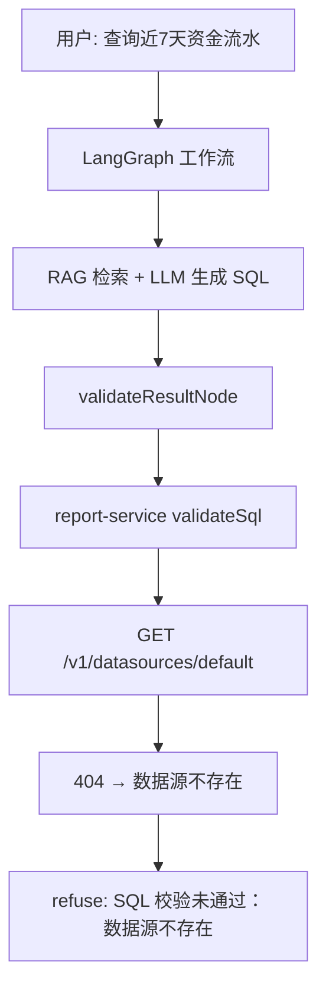

# SQL 生成失败与提速修复方案

## 问题诊断

### 你看到的错误从哪来



关键代码路径：

- [`packages/workflow/src/nodes.ts`](packages/workflow/src/nodes.ts) 第 266 行：`const datasourceId = deps.datasourceId ?? 'default'`
- [`apps/orchestrator/src/services/chat-service.ts`](apps/orchestrator/src/services/chat-service.ts) 第 166–174 行：调用 `runWorkflow` 时**未传入** `datasourceId`
- [`apps/report-service/src/services/report-service.ts`](apps/report-service/src/services/report-service.ts) 第 99–102 行：向 metadata 拉取数据源，找不到即返回 `DATASOURCE_NOT_FOUND`
- [`scripts/seed-settle.ts`](scripts/seed-settle.ts) 第 171–179 行：数据源 ID 为 `newId()` 生成的 **UUID**，不是 `'default'`

因此：**SQL 很可能已经生成**，但在校验阶段因数据源 ID 错误被整体拒绝；重试 `generateSql` 无法修复此问题（会白跑 2 轮 LLM，进一步拖慢）。

### 为什么一直慢

单次 SQL 模式请求的典型链路（串行为主）：

| 阶段 | 调用 | 预估耗时 |
|------|------|----------|
| 意图分类 | LLM ×1 | 2–8s |
| RAG 改写 | LLM ×1（生成 3 条 query） | 2–8s |
| RAG 检索 | 3 query × 3 collection = 9 次 HTTP（[`nodes.ts`](packages/workflow/src/nodes.ts) 第 156–161 行**串行**循环） | 1–5s |
| HyDE（RAG 分低时） | LLM ×1 + 再检索一轮 | +5–15s |
| 生成 SQL | LLM ×1 | 3–10s |
| 校验失败重试 | LLM ×2 + validate ×2（数据源错误时无效） | +10–20s |

额外因素：`gpt-4o` / `qwen-max` 等大模型、未配置 `OPENAI_API_KEY` 时 fallback mock 虽快但 RAG/校验仍走真实服务。

### 与业务数据的关系（次要）

「资金流水」在 seed 数据中有对应表（`fund_flow`、`nl_store_fund_account_log`），见 [`scripts/settle/query-library.json`](scripts/settle/query-library.json)。**前提是**已执行 `pnpm seed:settle` 且 RAG 索引已建立。即使 RAG 检索偏弱，修复 datasource 后也应能进入「SQL 语法/字段」类错误，而不是「数据源不存在」。

---

## 修复策略（按优先级）

### P0：打通 datasourceId（阻塞成功率）

**目标**：workflow 校验/执行时使用 metadata 中真实存在的数据源 ID。

**改动点**：

1. **[`packages/llm-tools/src/clients.ts`](packages/llm-tools/src/clients.ts)** — 扩展 `MetadataClient`：
   - `listDatasources(): Promise<{ items: { id: string; name: string }[] }>`
   - `resolveDatasourceId(preferred?: string): Promise<string>` 解析顺序：
     - `preferred`（请求传入）
     - `process.env.DEFAULT_DATASOURCE_ID`
     - metadata 列表中第一个数据源
     - 无数据源时抛明确错误

2. **[`apps/orchestrator/src/services/chat-service.ts`](apps/orchestrator/src/services/chat-service.ts)** — `stream()` 内在 `runWorkflow` 前：
   ```ts
   const datasourceId = await metadata.resolveDatasourceId(input.datasourceId);
   // ...
   finalState = await runWorkflow(initial, { ..., datasourceId });
   ```

3. **[`packages/contracts/src/index.ts`](packages/contracts/src/index.ts)** + **[`apps/gateway-api/src/index.ts`](apps/gateway-api/src/index.ts)** — `StartChatRequest` / `StartChatInput` 增加可选 `datasourceId`（为多数据源预留；单库环境可不传）。

4. **[`.env.example`](.env.example)** — 新增：
   ```env
   # seed:settle 完成后写入 .hermes/settle-seed.done 中的 datasourceId
   DEFAULT_DATASOURCE_ID=
   ```

5. **[`scripts/seed-settle.ts`](scripts/seed-settle.ts)** — 结束时打印建议：
   `请在 .env 设置 DEFAULT_DATASOURCE_ID=<id>`

6. **同步修复** [`apps/orchestrator/src/services/template-apply-service.ts`](apps/orchestrator/src/services/template-apply-service.ts) 第 55 行同类 `'default'` 硬编码。

**验证**：
- 管理后台「数据源」页能看到「结算演示库」
- 对 `查询近7天资金流水` 不再出现「数据源不存在」
- `pnpm test` 覆盖 orchestrator / workflow 契约测试

---

### P1：校验 fail-fast（避免无效重试）

**[`packages/workflow/src/nodes.ts`](packages/workflow/src/nodes.ts)** `validateResultNode`：

- 若 `validation.errors` 含 `DATASOURCE_NOT_FOUND`：**不重试** `generateSql`，直接返回可操作建议：
  > 「未配置有效数据源。请执行 pnpm seed:settle 并在 .env 设置 DEFAULT_DATASOURCE_ID。」
- 可选：在 `loadContextNode` 提前 resolve datasourceId，缺失时尽早 refuse（省去整段 RAG+LLM）

**[`packages/workflow/src/nodes.ts`](packages/workflow/src/nodes.ts)** `routeAfterValidate` 逻辑不变，但 infra 类错误与 SQL 语法错误应区分处理。

---

### P2：提速（在 P0 通过后实施）

#### 2a. RAG 检索并行化（低风险、收益明确）

[`packages/workflow/src/nodes.ts`](packages/workflow/src/nodes.ts) `ragRetrieveNode` 第 156–161 行：

```ts
// 现状：for (const q of searchQueries) { await retrieveAllCollections(...) }
// 改为：
const batches = await Promise.all(searchQueries.map((q) => retrieveAllCollections(deps, q, state.mode)));
```

可将 3 条改写 query 的检索从串行改为并行，RAG 阶段耗时约降为 1/3。

#### 2b. 减少不必要的 LLM 调用

| 优化 | 位置 | 说明 |
|------|------|------|
| 跳过 query 改写 | `ragPrepareNode` | 当 `query.length >= 8` 且含业务关键词时，直接用 `[state.query]`，省 1 次 LLM |
| HyDE 条件收紧 | `ragQualityGateNode` | `ragScore >= 0.25` 且 schema 非空时跳过 HyDE |
| 更快模型分流 | [`packages/llm-tools/src/llm/config.ts`](packages/llm-tools/src/llm/config.ts) | 为 classify/rewrite 增加 `LLM_FAST_MODEL`（如 `gpt-4o-mini` / `qwen-turbo`） |

#### 2c. SQL 模式轻量校验（可选，需产品确认）

[`apps/report-service/src/services/sql-executor.ts`](apps/report-service/src/services/sql-executor.ts) `validate()` 当前做 `EXPLAIN` + `COUNT(*)` 子查询（2 次 DB 往返）。

- SQL 模式（仅展示、不执行）：可只做 `EXPLAIN`，跳过 `COUNT`
- 通过 `ValidateSqlRequest.mode` 或 `lightweight: true` 区分

#### 2d. 开发环境开关

`.env.example` 增加可选：
```env
WORKFLOW_SKIP_RAG_REWRITE=true   # 跳过改写，直接用原 query
WORKFLOW_MAX_RAG_LOOPS=1         # 限制 HyDE 循环
```

---

## 环境自检清单（实施前建议你先确认）

1. **MySQL + 元数据库** 已 migrate：`make migrate` 或等价命令
2. **演示数据已 seed**：`pnpm seed:settle` 或 `pnpm seed:settle:if-needed`
3. **`.hermes/settle-seed.done`** 存在且含 `datasourceId`
4. **各服务运行中**：metadata (4050)、rag (4020)、report (4030)、orchestrator (4010)
5. **LLM API Key** 已配置（`OPENAI_API_KEY` 或 `ALIYUN_API_KEY` 等），否则走 mock，SQL 质量差但不应再报数据源错误
6. **`SERVICE_TOKEN`** 各服务一致（report → metadata 鉴权）

---

## 预期效果

| 指标 | 修复前 | P0 后 | P0+P2 后 |
|------|--------|-------|----------|
| 「数据源不存在」 | 100% 失败 | 应消除 | 同左 |
| 端到端耗时（有 LLM） | 30–60s+ | 20–40s（去掉无效重试） | 15–25s |
| SQL 生成成功率 | 0%（校验拦截） | 取决于 RAG/LLM 质量 | 进一步提升 |

修复 datasource 后，若仍失败，错误信息会变为更具体的 SQL 问题（未知表/字段、语法错误），届时再针对 RAG 召回或 prompt 调优。

---

## 建议实施顺序


**最小闭环**：仅做 P0 + P1 即可恢复基本可用；P2 作为性能迭代分批交付。
