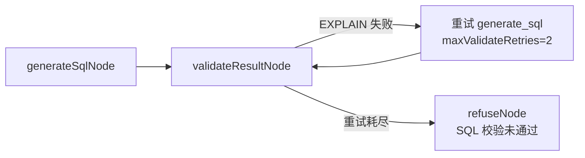

# SQL 校验失败、思考流展示与智谱 LLM 排查修复计划

## 问题诊断结论

### 1. `trade_date` 报错根因（已确认）

**实际表结构**：[`scripts/settle/sql/02-schema.sql`](scripts/settle/sql/02-schema.sql) 中 `fund_flow` 的时间字段是 `gmt_create`，仓库内**不存在** `trade_date` 列。

**元数据缺口**：[`scripts/settle/query-library.json`](scripts/settle/query-library.json) 中 `fund_flow` 仅启用了 4 个字段（`business_id`、`amount`、`in_ex_type`、`settlement_type_code`），**未包含 `gmt_create`**。RAG 索引只收录 `inQueryLibrary=true` 的字段（见 [`apps/rag-service/src/services/index-pipeline.ts`](apps/rag-service/src/services/index-pipeline.ts) `buildMetadataDocs`），因此 LLM 收到的 Schema 上下文里**没有时间字段可用**。

**LLM 幻觉**：用户问「最近 7 天」必须有时间列；上下文无日期字段时，模型倾向于臆造通用列名 `trade_date`（金融场景常见命名）。

**校验链路**（符合预期工作）：



- 校验在 [`apps/report-service/src/services/sql-executor.ts`](apps/report-service/src/services/sql-executor.ts) 通过 `EXPLAIN` 捕获 `Unknown column`
- 重试逻辑在 [`packages/workflow/src/nodes.ts`](packages/workflow/src/nodes.ts) `validateResultNode` + `routeAfterValidate`，最多 2 次
- **Grounding 只校验表名**（[`packages/workflow/src/grounding.ts`](packages/workflow/src/grounding.ts)），**不校验列名**，故 `trade_date` 无法被提前拦截

**为何重试仍失败**：错误反馈虽会传入 `errorFeedback`，但若 Schema 上下文仍缺少正确日期字段，LLM 可能反复幻觉同一列名。

---

### 2. 前端只显示「正在生成 SQL」的原因

当前 SSE 事件类型（[`packages/contracts/src/index.ts`](packages/contracts/src/index.ts)）仅有 `phase` / `chunk` / `templates` / `done` / `error`，**无 `thinking` 事件**。

工作流在 [`packages/workflow/src/nodes.ts`](packages/workflow/src/nodes.ts) 中写死占位文案：
- `正在理解问题…` / `正在检索相关数据表…` / `正在生成 SQL…`

LLM 调用在 [`packages/llm-tools/src/llm/openai-compatible-client.ts`](packages/llm-tools/src/llm/openai-compatible-client.ts) 为**非流式** `chat()`，等完整 JSON 返回后才解析 `{sql, explanation}`。

**SQL 模式下**，`explanation` 仅在 `summarizeResultNode`（校验通过之后）才通过 `chunk` 发出；校验失败走 `refuseNode`，用户只看到最终错误，**看不到 LLM 解释与中间 SQL**。

前端 [`apps/web-user/app/page.tsx`](apps/web-user/app/page.tsx) 已能拼接 `chunk` 内容，但后端几乎不推送实质思考内容。

---

### 3. 智谱 LLM 配置现状

| 项 | 状态 |
|---|---|
| 配置解析 | [`packages/llm-tools/src/llm/config.ts`](packages/llm-tools/src/llm/config.ts) 支持 `LLM_PROVIDER=zhipu`，读取 `ZHIPU_API_KEY` / `ZHIPU_BASE_URL` / `ZHIPU_MODEL` |
| 客户端 | [`OpenAiCompatibleClient`](packages/llm-tools/src/llm/openai-compatible-client.ts) 调用 `{baseUrl}/chat/completions`，与智谱 OpenAI 兼容接口一致 |
| 实例化位置 | [`apps/orchestrator/src/services/chat-service.ts`](apps/orchestrator/src/services/chat-service.ts) 每次 stream 调用 `createLlmProviderFromEnv()` |
| Docker | [`docker-compose.yml`](docker-compose.yml) orchestrator 使用 `env_file: .env` |
| 默认 | [`.env.example`](.env.example) 默认 `LLM_PROVIDER=openai`，`ZHIPU_API_KEY` 为空 |
| 无 Key 行为 | 回退 Mock LLM（[`factory.ts`](packages/llm-tools/src/llm/factory.ts)），Mock 生成 `WHERE 1=1`，**不会产生 trade_date 错误** → 用户报错说明**已在用真实 LLM**（可能是智谱或其他厂商） |

**待验证项**：`.env` 是否设置 `LLM_PROVIDER=zhipu` + 有效 `ZHIPU_API_KEY`；orchestrator 启动日志是否出现 `[llm] using provider=zhipu`；智谱 API 网络可达性。

---

## 修复方案

### Phase A：修复 SQL 生成质量（根因）

**A1. 补全 query-library 元数据**

修改 [`scripts/settle/query-library.json`](scripts/settle/query-library.json)：

- `fund_flow` 增加 `gmt_create`，同义词：`创建时间`、`流水时间`、`交易时间`
- 同类表补时间字段（可选但建议）：
  - `nl_store_fund_account_log` → `gmt_create`
  - `hwt_trade_info` 已有 `finish_time`，可加同义词 `交易时间`

**A2. 增加 few-shot SQL 模板**

在 seed 流程或 Admin 模板库中新增 SQL 模板，场景描述含「近 N 天资金流水」，示例 SQL：

```sql
SELECT business_id, amount, in_ex_type, gmt_create
FROM fund_flow
WHERE gmt_create >= DATE_SUB(CURDATE(), INTERVAL 7 DAY)
ORDER BY gmt_create DESC
```

**A3. 强化 Prompt 约束**

在 [`packages/llm-tools/src/llm/openai-style-provider.ts`](packages/llm-tools/src/llm/openai-style-provider.ts) `generateSql` system prompt 追加：
- 仅允许使用 Schema 上下文中出现的表名与字段名
- 时间范围过滤必须使用上下文中存在的日期/时间字段
- 若上下文无合适时间字段，在 `explanation` 中说明而非臆造列名

**A4. 列名校验（轻量 Grounding 增强）**

扩展 [`packages/workflow/src/grounding.ts`](packages/workflow/src/grounding.ts)：
- 从 `schemaContext` 收集已知字段名（含 `fieldName` metadata 或 content 解析）
- 从 SQL 的 WHERE/SELECT 提取标识符，与已知字段比对
- 未知列在 validate 之前即触发重试或拒绝（减少无效 EXPLAIN 往返）

**A5. 生成后立即推送中间结果**

在 `generateSqlNode` / `generateReportNode` 中，`deps.llm.generateSql` 返回后**立即**：

```typescript
deps.emit({ type: 'chunk', content: `**分析**\n${gen.explanation}\n\n**SQL 草案**\n\`\`\`sql\n${gen.sql}\n\`\`\`\n` });
```

校验失败重试时同样推送，使用户可见每次尝试（即使尚未实现 token 流式）。

**A6. 数据刷新（运维步骤，非代码）**

修改 query-library 后需：
1. 重新执行 selective sync（Admin 元数据页或 `pnpm seed:settle`）
2. 触发 RAG metadata rebuild（Admin 或 `POST /v1/index/rebuild?collection=metadata`）
3. 确认 Qdrant/OpenSearch 中 `fund_flow gmt_create` 可被检索

---

### Phase B：LLM 流式思考 + 分步展示（用户选择：两者都要）

**B1. 扩展 SSE 契约**

[`packages/contracts/src/index.ts`](packages/contracts/src/index.ts) 新增：

```typescript
| { type: 'thinking'; content: string; done?: boolean }
| { type: 'step'; step: string; detail?: string }  // 结构化分步
```

保留现有 `phase` 事件以兼容。

**B2. LLM 客户端支持 stream**

[`packages/llm-tools/src/llm/openai-compatible-client.ts`](packages/llm-tools/src/llm/openai-compatible-client.ts) 新增 `streamChat(messages, onDelta)`：
- 请求体加 `stream: true`
- 解析 SSE `data: {...}` delta chunks
- 兼容智谱 / OpenAI / 阿里云兼容接口

**B3. Provider 层接入流式回调**

扩展 [`packages/llm-tools/src/llm/types.ts`](packages/llm-tools/src/llm/types.ts) `generateSql` / `generateReport` 输入：

```typescript
onThinking?: (chunk: string) => void;
```

`openai-style-provider.ts` 在 stream 过程中调用 `onThinking`；Mock provider 模拟分片输出。

**B4. 工作流节点发射事件**

[`packages/workflow/src/nodes.ts`](packages/workflow/src/nodes.ts)：

| 节点 | 新增事件 |
|---|---|
| `loadContextNode` | `step: 理解问题` |
| `ragRetrieveNode` | `step: 检索表字段` + 列出 top schema 表名 |
| `generateSqlNode` | `thinking` 流式 + `step: 生成 SQL` |
| `validateResultNode` | `step: 校验 SQL` + 失败时推送 error |
| `summarizeResultNode` | 最终 `done` 内容 |

`generateSqlNode` 将 `onThinking` 映射为 `deps.emit({ type: 'thinking', content: chunk })`。

**B5. 前端 UI**

[`apps/web-user/app/page.tsx`](apps/web-user/app/page.tsx) + [`apps/web-user/app/chat-utils.ts`](apps/web-user/app/chat-utils.ts)：

- `ChatMessage` 增加 `thinking?: string` 字段
- 解析 `thinking` 事件追加到折叠面板（Ant Design `Collapse`，标题「思考过程」）
- 解析 `step` 事件渲染时间线（Steps 组件或简易列表）
- `chunk` 仍用于最终 SQL/解释正文
- 校验失败时保留已展示的思考内容与 SQL 草案，避免被 `done` 覆盖

**B6. Gateway 透传**

[`apps/gateway-api/src/index.ts`](apps/gateway-api/src/index.ts) SSE 代理已透传 body，新事件类型无需改动（验证契约测试即可）。

---

### Phase C：智谱 LLM 可达性验证

**C1. 配置检查清单**

`.env` 需设置：

```env
LLM_PROVIDER=zhipu
ZHIPU_API_KEY=<你的密钥>
ZHIPU_BASE_URL=https://open.bigmodel.cn/api/paas/v4
ZHIPU_MODEL=glm-4-plus
```

重启 orchestrator 后日志应出现：
`[llm] using provider=zhipu model=glm-4-plus baseUrl=...`

**C2. 新增连通性探测（建议）**

在 [`packages/llm-tools/src/llm/factory.ts`](packages/llm-tools/src/llm/factory.ts) 或 orchestrator 启动时增加可选 `LLM_HEALTHCHECK=true`：
- 发送最小 chat 请求 `"ping"` 
- 失败时 log error 而非静默 fallback mock

新增 [`packages/llm-tools/src/llm/config.test.ts`](packages/llm-tools/src/llm/config.test.ts) 同级集成测试（mock fetch）覆盖 zhipu URL 拼接。

**C3. 手动验证命令**（实现后可在本地执行）

```bash
# 在仓库根目录，加载 .env 后
node --import tsx -e "
  import { createLlmProviderFromEnv } from './packages/llm-tools/src/llm/factory.ts';
  const llm = createLlmProviderFromEnv();
  const r = await llm.classifyIntent({ query: '你好', mode: 'sql', history: [] });
  console.log(r);
"
```

---

## 关键文件清单

| 文件 | 改动 |
|---|---|
| [`scripts/settle/query-library.json`](scripts/settle/query-library.json) | 补 `gmt_create` 及同义词 |
| [`packages/llm-tools/src/llm/openai-compatible-client.ts`](packages/llm-tools/src/llm/openai-compatible-client.ts) | 新增 streamChat |
| [`packages/llm-tools/src/llm/openai-style-provider.ts`](packages/llm-tools/src/llm/openai-style-provider.ts) | 流式 + 强化 prompt |
| [`packages/llm-tools/src/llm/types.ts`](packages/llm-tools/src/llm/types.ts) | onThinking 回调 |
| [`packages/workflow/src/nodes.ts`](packages/workflow/src/nodes.ts) | step/thinking 事件 + 生成后立即推送 |
| [`packages/workflow/src/grounding.ts`](packages/workflow/src/grounding.ts) | 列名校验 |
| [`packages/contracts/src/index.ts`](packages/contracts/src/index.ts) | 新 SSE 事件类型 |
| [`apps/web-user/app/page.tsx`](apps/web-user/app/page.tsx) | 思考面板 + 步骤时间线 |
| [`.env.example`](.env.example) | 补充 zhipu 配置说明 |

---

## 验证计划

1. **元数据**：rebuild 后 RAG 检索「资金流水 7天」top 结果含 `fund_flow gmt_create`
2. **SQL 生成**：同问题生成 SQL 使用 `gmt_create >= DATE_SUB(...)`，`EXPLAIN` 通过
3. **重试回归**：contract test 覆盖 unknown column → 重试 → 修正后成功
4. **流式 UI**：发送问题后可见 Steps 进度 + 思考面板逐字增长 + 最终 SQL
5. **智谱**：orchestrator 日志 provider=zhipu；classifyIntent 返回非 mock 结果
6. **Lint/Test**：`pnpm test` 相关包 + `pnpm lint`

---

## 风险与假设

- 假设用户使用的是 settle 演示数据源（`fund_flow` 表存在且已通过 seed 同步）
- 修改 query-library 后**必须** re-sync + RAG rebuild，否则仅改 JSON 不生效
- 智谱 API 需外网可达；若 Key 无效会 fallback mock，表现为 SQL 质量异常但不会出现 `trade_date`（需通过日志区分）
- 流式 JSON 解析：LLM 流式输出可能分片截断 JSON，需在 provider 层缓冲完整响应后再 parse sql/explanation，thinking 流仅展示原始 token
