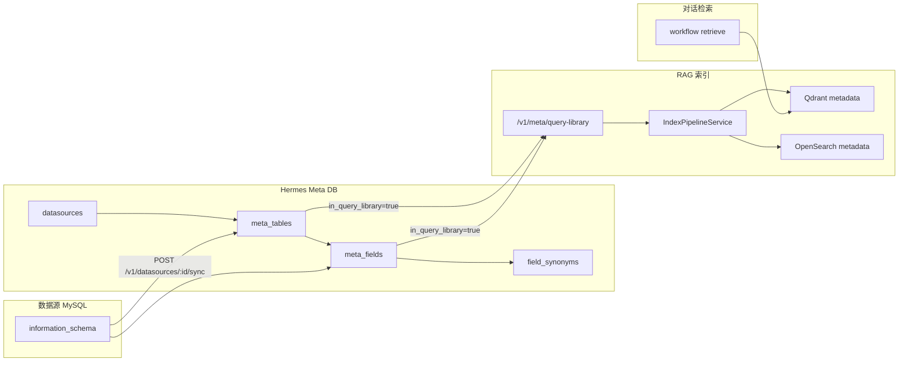
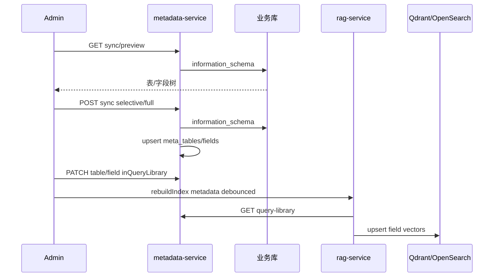

# 元数据管理改造计划

## 一、现状梳理：元数据如何保存与进入向量库



### 1. 关系型存储（MySQL meta 库）

| 表 | 关键字段 | 含义 |
|---|---|---|
| `datasources` | host/port/database_name | 业务库连接 |
| `meta_tables` | physical_name, business_name, **description**, **in_query_library**, source, source_status | 表级元数据 |
| `meta_fields` | physical_name, business_name, **description**, data_type, **in_query_library**, is_sensitive | 字段级元数据 |
| `field_synonyms` | synonym | 字段同义词 |

Schema 定义见 [`migrations/meta/migrations/20260701000001_init.ts`](migrations/meta/migrations/20260701000001_init.ts)。

### 2. 同步逻辑（后端已实现，Admin 未暴露）

[`apps/metadata-service/src/services/datasource-service.ts`](apps/metadata-service/src/services/datasource-service.ts) 中 `syncDatasourceMetadata`：

- 连接业务库，从 `information_schema.TABLES` / `COLUMNS` **全量**读取表与字段
- Upsert 到 `meta_tables` / `meta_fields`（新记录 `inQueryLibrary=false`）
- `TABLE_COMMENT` → `businessName`，`COLUMN_COMMENT` → 字段 `businessName`
- 全量同步后将不在源端的 sync 表标记为 `sourceStatus=removed_at_source`
- **缺口**：只 mark 了 removed tables，**未 mark removed fields**（全量同步后已删列仍可能保持 active）

数据源页「同步元数据」已调用 `POST /v1/datasources/:id/sync`，但 UI 只展示 `tablesSynced`，未展示 `fieldsSynced`（API 实际已返回两者）。

### 3. 查询库（纳入 RAG 的筛选条件）

[`MetaRepository.listFieldsForLibrary`](apps/metadata-service/src/repositories/index.ts) 要求**同时满足**：

- 表 `in_query_library = true` 且 `source_status = active`
- 字段 `in_query_library = true` 且 `source_status = active`

这与 seed 脚本 [`scripts/seed-settle.ts`](scripts/seed-settle.ts) 中 `applyQueryLibrary` 的行为一致：先 sync，再按 JSON 配置打开表/字段开关。

### 4. 向量索引（Qdrant + OpenSearch）

[`apps/rag-service/src/services/index-pipeline.ts`](apps/rag-service/src/services/index-pipeline.ts)：

- `rebuildMetadata()` → `GET /v1/meta/query-library` → 按**字段粒度**建文档
- 文档 content = 表名 + 业务名 + 字段名 + 描述 + 类型 + 同义词
- 向量 ID = **field.id**（非 table.id）
- 双写 Qdrant `metadata` collection + OpenSearch `metadata` index

对话链路：[`packages/workflow/src/nodes.ts`](packages/workflow/src/nodes.ts) 通过 RAG `collection: 'metadata'` 检索，结果作为 `schemaContext` 供 SQL 生成。

### 5. Admin 现状与问题根因

[`apps/web-admin/app/metadata/page.tsx`](apps/web-admin/app/metadata/page.tsx) 是**纯只读**：

```tsx
// Switch 写死 disabled；无 description 列；无字段展开；无保存逻辑
render: (v: boolean) => <Switch checked={v} disabled />
```

[`apps/web-admin/lib/api.ts`](apps/web-admin/lib/api.ts) 的 `metaApi` **缺少**：

- `getTable(id)` → `GET /v1/meta/tables/:id`（含 fields）
- `updateTable(id, body)` → `PATCH /v1/meta/tables/:id`
- `updateField(id, body)` → `PATCH /v1/meta/fields/:id`

后端 API 已就绪（[`apps/metadata-service/src/routes/index.ts`](apps/metadata-service/src/routes/index.ts) L79–106），问题在 **Admin 前端未接线**。

对比参考：[`apps/web-admin/app/business-knowledge/page.tsx`](apps/web-admin/app/business-knowledge/page.tsx) 已实现编辑 + 保存后 `ragApi.rebuildIndex('business')`。

---

## 二、改造目标（对齐你的需求）

| 需求 | 方案 |
|---|---|
| 表描述可编辑、开关可点 | 元数据页接线 PATCH API，内联/弹窗编辑 |
| 展示并管理字段 | 表行 expandable，展示字段列表（名称、类型、描述、开关、同义词） |
| 同步时可选表/字段（默认全选） | **保留**全量 sync + **新增** preview + selective sync |
| 保存到向量库 | 变更后 **3s 防抖** 调用 `ragApi.rebuildIndex('metadata')` |
| 两阶段都要 | 数据源页：全量/选择性同步；元数据页：查询库勾选与描述维护 |

---

## 三、后端改动（metadata-service）

### 3.1 补齐 sync 缺口

在 [`datasource-service.ts`](apps/metadata-service/src/services/datasource-service.ts) 全量 sync 末尾增加 `markRemovedFields`（mirror `markRemovedTables`），避免源端删列后仍被检索。

### 3.2 新增 Preview API

```
GET /v1/datasources/:id/sync/preview
```

- 连接测试通过后，只读 `information_schema`，返回：

```typescript
{
  tables: Array<{
    physicalName: string;
    tableComment?: string;
    fields: Array<{ physicalName: string; dataType: string; columnComment?: string }>;
  }>;
}
```

- **不写 DB**，供 Admin 同步弹窗渲染树形勾选。

### 3.3 扩展 Sync API（选择性导入）

```
POST /v1/datasources/:id/sync
Body（可选）:
{
  mode?: 'full' | 'selective';  // 默认 full
  tables?: Array<{
    physicalName: string;
    fields?: string[];  // 省略 = 该表全部字段
  }>;
  defaultInQueryLibrary?: boolean;  // 可选：同步后是否默认纳入查询库
}
```

行为约定：

| mode | 行为 |
|---|---|
| `full`（或无 body） | 现有逻辑 + markRemovedTables/Fields |
| `selective` | 仅 upsert 选中表/字段；**不** mark 未选中的为 removed |
| `defaultInQueryLibrary=true` | 新 upsert 的表/字段设 `inQueryLibrary=true`（表开关=true 时字段也=true） |

实现方式：将 `syncDatasourceMetadata` 拆为 `fetchSchemaFromSource` + `applySchemaSync`，复用 upsert 逻辑。

### 3.4 可选：批量更新 API（减少前端 N 次 PATCH）

```
PATCH /v1/datasources/:id/query-library
Body: { tables: [{ id, inQueryLibrary?, description?, fields?: [...] }] }
```

首版可不做，用现有单条 PATCH + 防抖 rebuild 即可；若字段多时再加。

---

## 四、Admin 前端改动（web-admin）

### 4.1 API 客户端 [`lib/api.ts`](apps/web-admin/lib/api.ts)

新增：

- `getTable(id)`, `updateTable(id, body)`, `updateField(id, body)`
- `previewSync(id)`, `syncDatasource(id, body?)`
- `useDebouncedMetadataRebuild()` 工具（3s debounce → `ragApi.rebuildIndex('metadata')`）

### 4.2 元数据页 [`app/metadata/page.tsx`](apps/web-admin/app/metadata/page.tsx)

**表列表增强：**

- 列：物理表名、业务名（可编辑 Input）、**描述（可编辑 TextArea）**、来源、智能查询库 Switch
- Switch `onChange` → `updateTable`；若开表则**级联**将该表所有 active 字段 `inQueryLibrary=true`（关表则级联 false）
- 展开行：字段 Table（物理名、类型、业务名、描述、敏感、查询库 Switch、同义词 Tag 编辑）
- 每次保存成功后触发 debounced rebuild
- 顶部按钮：「重建 metadata 索引」（手动兜底，参考业务知识页）

### 4.3 数据源页 [`app/datasources/page.tsx`](apps/web-admin/app/datasources/page.tsx)

「同步元数据」改为下拉或双按钮：

1. **快速全量同步** — 现有行为，成功提示 `tablesSynced / fieldsSynced`
2. **选择性同步** — Modal：
   - 调 `previewSync` 加载树（Table 嵌套 Checkbox，默认全选）
   - 可选「同步后默认纳入查询库」
   - 提交 `syncDatasource(id, { mode: 'selective', tables: [...] })`
   - 成功后 debounced rebuild（若勾了 defaultInQueryLibrary）

导航文案可考虑改为「元数据管理」（表 + 字段），与侧边栏 [`AdminLayout.tsx`](apps/web-admin/components/AdminLayout.tsx) 一致。

---

## 五、数据流（改造后）



---

## 六、测试与验证

| 层级 | 内容 |
|---|---|
| metadata-service 单测 | selective sync 只写入选中项；full sync mark removed fields |
| contract test | preview / selective sync 响应 shape |
| 手动 | Admin 编辑描述、开关 → 搜索测试页 metadata 检索命中变化 |

---

## 七、风险与假设

- **假设**：业务库均为 MySQL，`information_schema` 可用（与现 sync 一致）
- **假设**：向量索引仍以**字段**为粒度，表级开关通过级联字段 `inQueryLibrary` 生效（不改 RAG pipeline）
- **风险**：大批量 rebuild 耗时；3s debounce 可缓解，极端场景需手动按钮或后端异步 rebuild 任务（后续优化）
- **风险**：selective sync 不 mark removed，与 full sync 混用时需文档说明「全量同步才做源端删除检测」

---

## 八、建议实施顺序

1. **Quick win**：Admin 元数据页接线 + debounced rebuild（立刻解决「不能编辑/不能点开关」）
2. **后端**：markRemovedFields + preview + selective sync API
3. **Admin**：数据源选择性同步 Modal
4. **测试**：sync 单测 + 手动端到端

预估改动文件（最小闭环）：

- [`apps/web-admin/app/metadata/page.tsx`](apps/web-admin/app/metadata/page.tsx)
- [`apps/web-admin/lib/api.ts`](apps/web-admin/lib/api.ts)
- [`apps/web-admin/app/datasources/page.tsx`](apps/web-admin/app/datasources/page.tsx)
- [`apps/metadata-service/src/services/datasource-service.ts`](apps/metadata-service/src/services/datasource-service.ts)
- [`apps/metadata-service/src/routes/index.ts`](apps/metadata-service/src/routes/index.ts)
- 新增/扩展 metadata-service 测试
