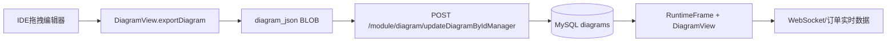
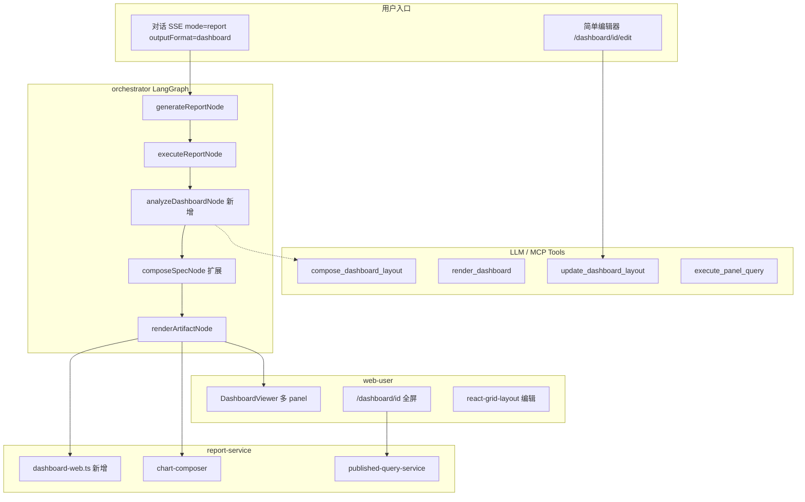
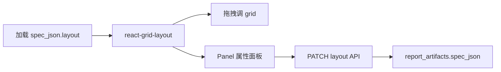

# 大屏生成功能设计方案

## 一、node-bg 项目梳理（参考，不引入代码）

[node-bg](/Users/dezliu/Downloads/node-bg) 是赛瓦（Serva）自研低代码可视化平台，核心链路：



**值得借鉴的概念**

| node-bg 概念 | 含义 | Hermes 对应设计 |
|---|---|---|
| `diagram_json` | 整页 JSON：画布尺寸 + VI 数组（位置/类型/数据源） | `DashboardLayoutSpec` |
| VI（ViewControl） | 图表/图片/KPI/文本等可绑定 DataSource 的组件 | `DashboardPanelSpec` |
| `deployDiagram` + `app_key` | 运行态访问 + 分享 | `shareToken` + `/dashboard/[id]` |
| `published_queries` 雏形 | 数据源绑定 + 刷新 | 每 panel 可挂 `publishedQueryId` |
| `isDragDashboard` | 运行态可拖拽调布局 | `react-grid-layout` 简单编辑器 |

**不宜直接引入的原因**

- 技术栈：jQuery/LayUI 自研 `IDE.*` 框架 vs Next.js 14 + React 18
- 存储：MySQL BLOB + 独立 `visulization` 库 vs 现有 `report_artifacts` + Objection
- 鉴权：独立 `resourcePermission` vs Hermes gateway 统一鉴权
- 维护成本：~108k 行 `t-app.js`，无 LLM 集成，编辑器页面 `edit.html`/`run.html` 不在仓库内

---

## 二、nl-hermes 现状与缺口

当前报表管线（[`packages/workflow/src/graph.ts`](packages/workflow/src/graph.ts)）：

```
generate_report → execute_report → analyze_report → compose_spec → render_artifact
```

**已有能力（可直接复用）**

- [`ReportSpec`](packages/contracts/src/index.ts)：已支持 `charts[]` 多图表
- [`chart-composer.ts`](apps/report-service/src/services/chart-composer.ts)：ECharts option 合成
- [`artifact-renderer.ts`](apps/report-service/src/services/artifact-renderer.ts)：inline/web/word 渲染 + `shareToken`
- [`published_queries`](packages/orm-schemas/src/models/published-query.ts)：分享时注册可刷新 SQL
- [`report-mcp-adapter`](packages/report-mcp-adapter/src/mcp-handler.ts)：对外 MCP 工具入口
- Gateway：`/api/public/r/:shareToken` 公开访问

**关键缺口**

- `ReportOutputFormat` 仅 `inline | web | word`，无 `dashboard`
- `ReportViewer` 只渲染 `echartsOptions[0]`（单图）
- `analyzeReportData` prompt 面向文档报告，无布局/grid 输出
- `report-web.ts` 是 960px 文档风，非全屏大屏
- 无布局编辑与持久化 API

---

## 三、目标架构（Hermes 原生 + 简单编辑器）



**设计原则**

1. **扩展 ReportSpec，不新建平行实体**：大屏仍是 `report_artifacts` 的一种 `output_format=dashboard`，分享/预览链路一致
2. **LLM 只生成结构化 JSON**：布局 + 图表绑定，不生成 HTML/JS 字符串（避免 XSS 与不可维护）
3. **渲染双轨**：对话内 `inline` payload（React 组件）+ 独立全屏页（分享/投屏）
4. **简单编辑器只改 layout**：图表数据与 SQL 仍由 LLM 生成，用户可调位置/大小/图表类型，不重做 node-bg 级 IDE

---

## 四、核心契约设计

在 [`packages/contracts/src/index.ts`](packages/contracts/src/index.ts) 扩展：

```typescript
export type ReportOutputFormat = 'inline' | 'web' | 'word' | 'dashboard';

export type DashboardTheme = 'dark' | 'light';

export type DashboardPanelType = 'chart' | 'kpi' | 'table' | 'text';

export type DashboardGridPosition = {
  x: number;  // 0-11，12 列栅格
  y: number;
  w: number;
  h: number;
};

export type DashboardPanelSpec = {
  id: string;
  type: DashboardPanelType;
  title?: string;
  grid: DashboardGridPosition;
  chartIndex?: number;        // 关联 ReportSpec.charts[index]
  kpiField?: string;          // KPI 取值列
  kpiFormat?: 'number' | 'currency' | 'percent';
  textContent?: string;       // 标题/摘要区
  publishedQueryId?: string;  // 分享后每 panel 独立刷新（Phase 2）
  refreshIntervalSec?: number;
};

export type DashboardLayoutSpec = {
  canvas: { width: number; height: number };  // 默认 1920x1080
  theme: DashboardTheme;
  panels: DashboardPanelSpec[];
  header?: { title: string; subtitle?: string; showClock?: boolean };
};

// ReportSpec 新增可选字段
export type ReportSpec = {
  // ...existing
  layout?: DashboardLayoutSpec;  // outputFormat=dashboard 时必填
};
```

**与 node-bg `diagram_json` 的映射关系**

```
node-bg.vis[]          →  DashboardLayoutSpec.panels[]
node-bg.location/size  →  panel.grid {x,y,w,h}
node-bg.DataSource     →  ReportSpec.sql + publishedQueryId
node-bg.size 1920x1080 →  layout.canvas
```

---

## 五、LLM 工作流改造

### 5.1 新增/改造节点

| 节点 | 文件 | 改动 |
|---|---|---|
| `analyzeDashboardNode` | [`packages/workflow/src/nodes.ts`](packages/workflow/src/nodes.ts) | `outputFormat=dashboard` 时调用 `llm.analyzeDashboardLayout()`，输出 panels + recommendedCharts |
| `composeSpecNode` | 同上 | dashboard 模式组装 `layout` + 多 `charts` |
| `renderArtifactNode` | 同上 | 发 SSE `正在生成数据大屏…` |
| `routeAfterSummarize` | [`packages/workflow/src/graph.ts`](packages/workflow/src/graph.ts) | 无需改路由，沿用 analyze 分支 |

### 5.2 LLM Prompt 策略（`analyzeDashboardLayout`）

输入：用户 query、SQL、rows 样本、schemaContext、canvas 约束

输出 JSON 示例：

```json
{
  "title": "近7日资金流水大屏",
  "summary": "...",
  "recommendedCharts": [
    { "chartType": "line", "chartConfig": { "xField": "date", "yField": "amount", "title": "日流水趋势" } },
    { "chartType": "bar", "chartConfig": { "xField": "channel", "yField": "amount", "title": "渠道分布" } }
  ],
  "layout": {
    "theme": "dark",
    "panels": [
      { "id": "kpi-total", "type": "kpi", "grid": { "x": 0, "y": 0, "w": 3, "h": 2 }, "kpiField": "total_amount", "title": "累计流水" },
      { "id": "chart-trend", "type": "chart", "grid": { "x": 0, "y": 2, "w": 8, "h": 4 }, "chartIndex": 0 },
      { "id": "chart-channel", "type": "chart", "grid": { "x": 8, "y": 2, "w": 4, "h": 4 }, "chartIndex": 1 }
    ]
  }
}
```

**约束写入 system prompt**：12 列 grid、panel 不重叠、至少 1 个 KPI + 1 个 chart、chartIndex 必须有效。

### 5.3 内部 Tool Registry 扩展

[`packages/llm-tools/src/registry.ts`](packages/llm-tools/src/registry.ts) 新增：

| Tool | 绑定 | 作用 |
|---|---|---|
| `compose_dashboard_layout` | AnalyzeDashboard | 根据数据特征生成 layout JSON |
| `validate_dashboard_layout` | ComposeSpec | 校验 grid 重叠、chartIndex 越界 |
| `render_dashboard` | RenderArtifact | 委托 `ReportClient.renderReport` |

---

## 六、MCP 对外工具设计

扩展 [`packages/report-mcp-adapter/src/mcp-handler.ts`](packages/report-mcp-adapter/src/mcp-handler.ts)：

```typescript
// 新增 MCP tools
{
  name: 'compose_dashboard_layout',
  description: '根据查询结果与业务意图生成大屏布局 spec（panels + charts）',
  inputSchema: { query, rows, schemaContext, theme?, canvasSize? }
}
{
  name: 'render_dashboard',
  description: '渲染大屏 artifact，返回 previewUrl / shareUrl',
  inputSchema: { spec: ReportSpec }  // outputFormat 必须为 dashboard
}
{
  name: 'update_dashboard_layout',
  description: '更新已存在大屏的 panel 布局或图表类型（编辑器保存）',
  inputSchema: { reportId, layout: DashboardLayoutSpec, charts?: ReportChartSpec[] }
}
{
  name: 'execute_panel_query',
  description: '执行单个 panel 关联 SQL 并返回刷新数据',
  inputSchema: { publishedQueryId, parameters? }
}
```

**典型 MCP 调用链（外部 Agent）**

```
match_template → generate_report → execute_report_query
  → compose_dashboard_layout → render_dashboard → (返回 shareUrl)
```

与 orchestrator 内部 LangGraph 共用 `report-service` REST，避免两套渲染逻辑。

---

## 七、渲染与访问链路

### 7.1 report-service 渲染

新增 [`apps/report-service/src/templates/dashboard-web.ts`](apps/report-service/src/templates/dashboard-web.ts)：

- 深色全屏主题（借鉴 node-bg 大屏视觉，用 CSS 实现）
- CSS Grid / 绝对定位按 `layout.panels[].grid` 排版
- 每 chart panel 嵌入 ECharts（复用 `composeAllEchartsOptions`）
- KPI panel：大号数字 + 标题
- 可选 `refreshIntervalSec`：轮询 `/api/published-queries/:id/data`
- `window.resize` + `ResizeObserver` 自适应

[`artifact-renderer.ts`](apps/report-service/src/services/artifact-renderer.ts) 新增分支：

```typescript
if (spec.outputFormat === 'dashboard') {
  const html = buildDashboardWebHtml(spec, echartsOptions);
  // storageKey: reports/{userId}/{id}/dashboard/index.html
  // inlinePayload: { layout, charts, echartsOptions, rows } 供 React Viewer
}
```

### 7.2 用户访问路径

| 场景 | URL | 说明 |
|---|---|---|
| 对话内预览 | `DashboardViewer` 组件 | 读取 SSE `artifact_ready` 的 inlinePayload |
| 全屏投屏 | `/dashboard/[reportId]` | web-user 新路由，dark 全屏 |
| 公开分享 | `/api/public/r/[shareToken]` | 复用现有分享；dashboard 格式渲染全屏 HTML |
| 简单编辑 | `/dashboard/[reportId]/edit` | react-grid-layout，需登录 |

Gateway 在 [`apps/gateway-api/src/index.ts`](apps/gateway-api/src/index.ts) 扩展：

- GraphQL `startChat` 的 `outputFormat` enum 加 `dashboard`
- 新增 `PATCH /api/dashboards/:id/layout`（代理 orchestrator）
- 预览路由对 dashboard 返回正确 Content-Type

### 7.3 分享流程（复用 + 小扩展）

```
用户点分享 → POST /api/reports/:id/share
  → shareToken + shareUrl
  → 为每个 chart panel 注册 published_query（Phase 2）
  → 公开页带自动刷新
```

---

## 八、简单编辑器设计

**技术选型**：[`react-grid-layout`](https://github.com/react-grid-layout/react-grid-layout)（与 Ant Design 兼容，社区成熟）

**组件**：[`apps/web-user/components/DashboardEditor.tsx`](apps/web-user/components/DashboardEditor.tsx)

功能范围（MVP）：

- 拖拽调整 panel 位置/大小
- 点击 panel 切换 `chartType`（line/bar/pie/table）
- 修改 panel 标题
- 保存 → `PATCH /api/dashboards/:id/layout` → 更新 `report_artifacts.spec_json`
- 「预览全屏」「复制分享链接」按钮

不做：新增数据源、复杂 VI 插件、3D/GIS、实时 WebSocket（留 Phase 3+）



---

## 九、数据持久化

**不新建表**，扩展 [`report_artifacts`](packages/orm-schemas/src/models/report-artifact.ts)：

- `output_format` enum 加 `dashboard`
- `spec_json` 内嵌 `layout: DashboardLayoutSpec`

Migration：[`migrations/chat/migrations/`](migrations/chat/migrations/) 新增 enum 扩展迁移。

编辑器保存只更新 `spec_json.layout`（及可选 `charts`），然后触发 re-render 或仅前端热更新（MVP 可前端直渲染，异步持久化）。

---

## 十、分阶段交付计划

### Phase 1 — 最小闭环（LLM 生成 + 查看 + 分享）

- 契约：`DashboardLayoutSpec` + `outputFormat=dashboard`
- LLM：`analyzeDashboardLayout` + `composeSpecNode` 扩展
- 渲染：`dashboard-web.ts` + `artifact-renderer` 分支
- 前端：`DashboardViewer`（多 panel grid）+ outputFormat 选项
- 分享：复用 `shareToken` + 公开预览
- 测试：contracts 校验、layout 校验单测、workflow 节点 mock 测试

### Phase 2 — 全屏路由 + 数据刷新

- `/dashboard/[id]` 全屏页
- 分享时注册 `published_queries`，HTML/Viewer 定时刷新
- MCP：`compose_dashboard_layout` + `render_dashboard`

### Phase 3 — 简单编辑器

- `DashboardEditor` + `react-grid-layout`
- `PATCH /api/dashboards/:id/layout`
- MCP：`update_dashboard_layout`
- GraphQL mutation `updateDashboardLayout`

---

## 十一、关键设计取舍

| 决策 | 选择 | 理由 |
|---|---|---|
| 是否引入 node-bg | 否，仅借鉴概念 | 栈差异大、维护成本高，与「最小闭环」冲突 |
| 大屏是否独立表 | 否，扩展 report_artifacts | 分享/预览/权限链路可复用 |
| 布局坐标系 | 12 列 grid | LLM 易生成整数、react-grid-layout 原生支持 |
| 渲染引擎 | ECharts（已有） | 不引入 node-bg VI 体系 |
| 实时性 | published-queries 轮询 | 现有基础设施，WebSocket 后续再加 |
| 编辑器粒度 | 布局 + 图表类型 | 满足「简单编辑」，避免重做 IDE |

---

## 十二、风险与未验证项

- LLM 生成的 grid 可能重叠或越界 → 需 `validate_dashboard_layout` 后处理（自动 compact / clamp）
- 多图表 SQL：MVP 共用单 SQL + 不同字段映射；复杂场景需多 SQL（Phase 2+ 每 panel 独立 query）
- `ReportViewer` 与 `DashboardViewer` 并存，需明确 `outputFormat` 路由，避免单图逻辑误用
- 公开分享页的自动刷新需评估数据源权限（`published_queries.authMode`）
- 全屏页在 4K/异形屏的 scale 策略需手动验证

---

## 十三、建议优先阅读/改动的文件

| 优先级 | 文件 |
|---|---|
| P0 | [`packages/contracts/src/index.ts`](packages/contracts/src/index.ts) |
| P0 | [`packages/workflow/src/nodes.ts`](packages/workflow/src/nodes.ts) |
| P0 | [`packages/llm-tools/src/llm/openai-style-provider.ts`](packages/llm-tools/src/llm/openai-style-provider.ts) |
| P0 | [`apps/report-service/src/services/artifact-renderer.ts`](apps/report-service/src/services/artifact-renderer.ts) |
| P1 | 新增 `apps/report-service/src/templates/dashboard-web.ts` |
| P1 | [`apps/web-user/components/ReportViewer.tsx`](apps/web-user/components/ReportViewer.tsx) → 拆出 `DashboardViewer` |
| P1 | [`packages/report-mcp-adapter/src/mcp-handler.ts`](packages/report-mcp-adapter/src/mcp-handler.ts) |
| P2 | 新增 `apps/web-user/app/dashboard/[id]/page.tsx` |
| P2 | 新增 `apps/web-user/components/DashboardEditor.tsx` |
