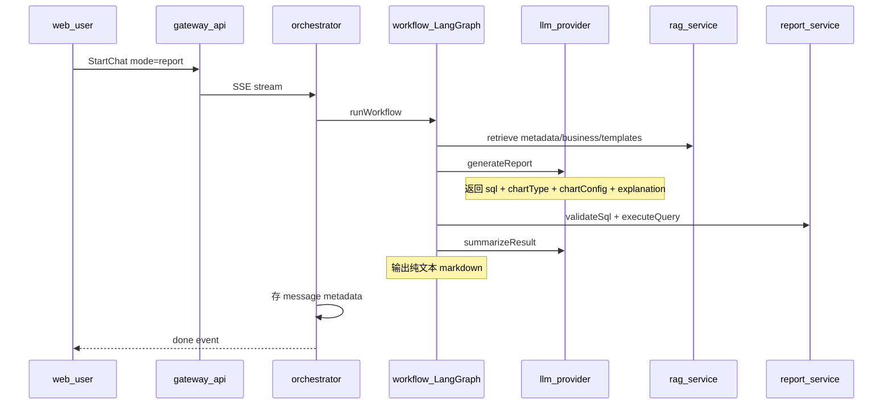
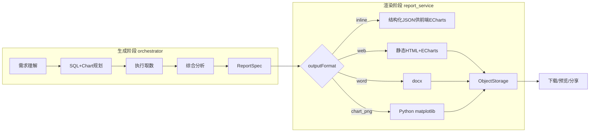
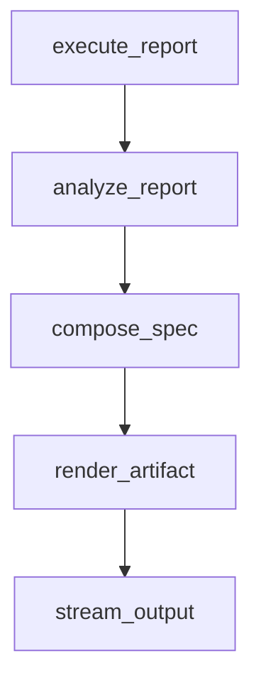
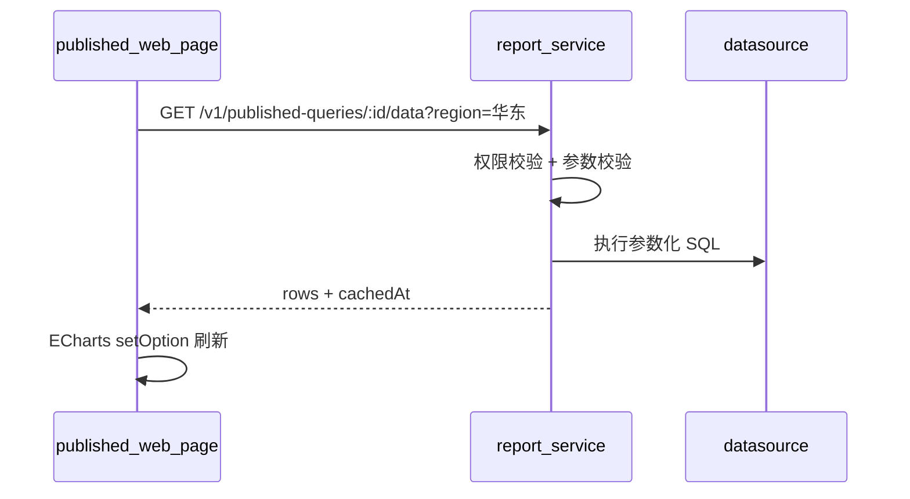

# 报表生成扩展设计方案

## 一、现状梳理（As-Is）

### 1.1 端到端链路



核心代码位置：

- 工作流编排：[`packages/workflow/src/graph.ts`](packages/workflow/src/graph.ts) — `generate_report → validate → execute_report → summarize → grounding_check → stream_output`
- 报表生成节点：[`packages/workflow/src/nodes.ts`](packages/workflow/src/nodes.ts) L288-493
- LLM 契约：[`packages/llm-tools/src/llm/types.ts`](packages/llm-tools/src/llm/types.ts) — `chartType: line|bar|table`，`chartConfig: {xField, yField}`
- 编排落库：[`apps/orchestrator/src/services/chat-service.ts`](apps/orchestrator/src/services/chat-service.ts) — metadata 存 `sql`、`chartConfig`，**不存 executionResult rows**
- 报表执行：[`apps/report-service/src/services/report-service.ts`](apps/report-service/src/services/report-service.ts) — 仅有 `executeQuery`/`validateSql`；`generateReport` 为占位实现
- 用户端：[`apps/web-user/app/page.tsx`](apps/web-user/app/page.tsx) — **纯文本气泡**，无图表组件、无下载/预览

### 1.2 与架构设计文档的差距

[`docs/plans/灵析系统架构设计_86078467.plan.md`](docs/plans/灵析系统架构设计_86078467.plan.md) 规划了 `ChartComposer`、多格式输出，但**均未落地**：

| 能力 | 设计 | 现状 |
|------|------|------|
| ChartComposer | report-service 模块 | 不存在 |
| 图表渲染 | 前端可视化 | 仅文本「图表类型：line」 |
| Word/网页导出 | 未细化 | 不存在 |
| 对象存储 | 未定义 | docker-compose 无 MinIO/S3 |
| 对外查询 API | fetchApiData 雏形 | 有 `/v1/query/fetch-api`，未接入工作流 |
| execute_report_query Tool | registry 已定义 | 工作流直接调 client，未走 Tool Calling |

### 1.3 关键缺口（阻碍你的目标）

1. **无结构化报表模型**：执行结果 `rows` 只在 workflow 内存中流转，会话结束后无法重渲染图表
2. **无 Artifact 层**：没有「文件/网页/分享链接」一等公民
3. **无格式选择入口**：`StartChatRequest` 仅有 `mode: sql|report`，无 `outputFormat`
4. **无 Python 渲染服务**：仓库内无图表绘制能力（仅 `scripts/export-cursor-chats.py`）
5. **分享与权限未建模**：gateway GraphQL 的 `ChatMessageRecord` 不含 `metadata`/artifact 字段

---

## 二、目标架构（To-Be）

### 2.1 核心抽象：ReportSpec → Artifact

引入两层分离，避免把「取数逻辑」和「呈现格式」绑死：



**ReportSpec**（新增公共类型，放 [`packages/contracts`](packages/contracts/src/index.ts)）：

```typescript
type ReportOutputFormat = 'inline' | 'web' | 'word';

type ReportChartSpec = {
  chartType: 'line' | 'bar' | 'table' | 'pie'; // 渐进扩展
  chartConfig: { xField: string; yField: string; seriesField?: string; title?: string };
};

type ReportSpec = {
  id: string;
  title: string;
  userQuery: string;
  sql: string;
  datasourceId: string;
  data: { rows: Record<string, unknown>[]; rowCount: number; truncated?: boolean };
  charts: ReportChartSpec[];           // 支持多图（综合分析）
  narrative: {
    summary: string;
    insights?: string[];               // LLM 提炼的要点
    dataSources?: string[];            // 引用的表/字段
    caveats?: string[];                // 数据局限说明
  };
  outputFormat: ReportOutputFormat;
  createdAt: string;
};
```

**ReportArtifact**（渲染产物）：

```typescript
type ReportArtifact = {
  reportId: string;
  format: 'inline' | 'web' | 'word' | 'png';
  status: 'pending' | 'ready' | 'failed';
  storageKey?: string;       // MinIO/S3 路径
  previewUrl?: string;       // 网关签名预览 URL
  downloadUrl?: string;
  shareToken?: string;       // 可选公开分享
  shareExpiresAt?: string;
  inlinePayload?: { charts: unknown[]; rows: unknown[] }; // inline 模式直接返回
};
```

### 2.2 服务职责重新划分

| 服务 | 职责变更 |
|------|----------|
| **orchestrator / workflow** | 需求分析、SQL 生成、执行、**综合分析**、组装 ReportSpec、触发渲染 |
| **report-service** | 取数（已有）+ **ChartComposer** + **ArtifactRenderer** + **PublishedQuery**（后续） |
| **render-worker（新，Python）** | matplotlib/plotly 静态图、Word 内嵌图、复杂版式；HTTP 内部调用 |
| **gateway-api** | 新增 artifact 下载/预览/分享路由；GraphQL 扩展 message artifacts |
| **web-user** | 生成前格式选择；ReportViewer（ECharts）；下载/预览/分享 UI |

---

## 三、工作流改造

### 3.1 新增/调整节点

在 [`packages/workflow/src/graph.ts`](packages/workflow/src/graph.ts) 的 `summarize` 之后插入：



| 节点 | 职责 | 实现要点 |
|------|------|----------|
| **analyze_report**（新） | 理解用户需求，产出全面分析 | 新 LLM 方法 `analyzeReportData`：输入 query + rows + schemaContext + businessKnowledge；输出 `insights[]`、`recommendedCharts[]`、`title` |
| **compose_spec**（新） | 合并 SQL/chart/数据/叙事为 ReportSpec | 纯 TS，无外部调用 |
| **render_artifact**（新） | 按 `state.outputFormat` 调 report-service | `POST /v1/reports/render` |

**WorkflowGraphState 扩展**（[`packages/workflow/src/state.ts`](packages/workflow/src/state.ts)）：

- `outputFormat: 'inline' | 'web' | 'word'`（来自 `StartChatRequest`）
- `reportSpec?: ReportSpec`
- `reportArtifact?: ReportArtifact`

**StartChatRequest 扩展**（[`packages/contracts`](packages/contracts/src/index.ts)）：

```typescript
outputFormat?: 'inline' | 'web' | 'word'; // report 模式必填，默认 inline
```

### 3.2 LLM Prompt 分层升级

现有 [`generateReport`](packages/llm-tools/src/llm/openai-style-provider.ts) 只产出单图配置。建议拆为两阶段：

1. **generateReport**（保留）：SQL + 主图表配置（快速闭环）
2. **analyzeReportData**（新）：基于执行结果做「全面报表」扩展
   - 判断是否需要多图（趋势 + 占比 + 明细表）
   - 生成业务语言摘要、洞察 bullet、数据口径说明
   - Word/网页模式时额外输出 `sections[]`（标题、段落、关联 chartId）

`outputFormat=word` 时 prompt 强调：章节结构、表格摘要、图表说明文字。

### 3.3 summarize 节点调整

[`summarizeResultNode`](packages/workflow/src/nodes.ts) 当前拼 markdown 文本。改为：

- `inline`：SSE 推送 `type: 'report_preview'` 事件（含 rows + chartConfig），文本仅保留摘要
- `web`/`word`：推送「正在生成网页/文档…」，完成后 `type: 'artifact_ready'`

扩展 [`ChatStreamEvent`](packages/contracts/src/index.ts)：

```typescript
| { type: 'report_preview'; spec: ReportSpec }
| { type: 'artifact_ready'; artifact: ReportArtifact }
```

---

## 四、report-service 改造

### 4.1 新增模块（[`apps/report-service/src/services/`](apps/report-service/src/services/)）

```
report-service/
  services/
    chart-composer.ts      # 数据 → ECharts option / table schema
    artifact-renderer.ts   # 调度 web/word/png 渲染
    published-query.ts     # 对外查询服务（Phase 2）
    storage-client.ts      # MinIO/S3 封装
  templates/
    report-web.html.ejs    # ECharts 单页模板
  routes/
    reports.ts             # /v1/reports/*
```

**关键 API**：

| 端点 | 用途 |
|------|------|
| `POST /v1/reports/render` | 入参 ReportSpec → 出参 ReportArtifact |
| `GET /v1/reports/:id` | 获取 Spec + Artifact 元数据（鉴权） |
| `GET /v1/reports/:id/preview` | 预览（inline HTML 或重定向） |
| `GET /v1/reports/:id/download` | 下载 docx / zip |
| `POST /v1/reports/:id/share` | 创建/刷新 shareToken + 过期时间 |
| `GET /v1/public/reports/:shareToken` | 公开分享页（无需登录，校验过期） |
| `POST /v1/published-queries` | （后续）注册可刷新查询 |
| `GET /v1/published-queries/:id/data` | （后续）对外数据 API |

### 4.2 ChartComposer 设计

```typescript
// chart-composer.ts
composeEchartsOption(spec: ReportChartSpec, rows: Row[]): EChartsOption;
composeTableColumns(spec: ReportChartSpec, rows: Row[]): AntdTableColumn[];
```

- **inline / web**：统一走 **ECharts option JSON**（满足你后续 ECharts 对接诉求）
- **word / 服务端静态图**：调 Python `render-worker` 生成 PNG，嵌入 docx

### 4.3 Python render-worker（新服务）

独立轻量 FastAPI 服务（`apps/render-worker/`）：

| 端点 | 技术 |
|------|------|
| `POST /render/chart` | matplotlib 或 plotly → PNG bytes |
| `POST /render/word` | python-docx：标题、段落、表格、嵌入 PNG |

report-service 通过 HTTP 调用，传 ReportSpec 子集。Docker Compose 增加 `render-worker` 服务。

**为何 Python 只做「离线渲染」、网页用 ECharts**：
- 网页需要交互、响应式、后续对接实时 API → 前端 ECharts 更合适
- Word/邮件/打印需要静态图 → Python 绘制更成熟

### 4.4 对象存储

docker-compose 增加 **MinIO**（开发环境），生产可换 S3/OSS。

存储路径约定：`reports/{userId}/{reportId}/{format}/{filename}`

预览/下载 URL 由 gateway 签发**短期签名**（如 15min），不直接暴露 MinIO。

---

## 五、数据持久化

### 5.1 新表（chat DB migration）

[`migrations/chat/`](migrations/chat/migrations/) 新增：

**`report_artifacts`**

| 字段 | 说明 |
|------|------|
| id | UUID |
| message_id | 关联 assistant message |
| user_id | 所有者 |
| spec_json | ReportSpec 快照 |
| output_format | inline/web/word |
| storage_key | 对象存储路径 |
| share_token | 可空，唯一索引 |
| share_expires_at | 可空 |
| status | pending/ready/failed |
| created_at | |

**`published_queries`**（Phase 2，可先建表不启用）

| 字段 | 说明 |
|------|------|
| id | 对外 queryId |
| report_id | |
| sql_template | 参数化 SQL |
| parameters_schema | JSON Schema |
| auth_mode | owner/token/api_key |

### 5.2 message metadata 扩展

[`chat-service.ts`](apps/orchestrator/src/services/chat-service.ts) 落库时增加：

```typescript
metadata: {
  reportId,
  outputFormat,
  artifact: { previewUrl, downloadUrl, shareUrl? },
  chartConfig,
  sql,
  // inline 模式可存 rows 摘要 hash + reportId，完整 rows 放 report_artifacts.spec_json
}
```

**重要**：必须把 `executionResult.rows` 写入 `spec_json`，否则历史会话无法重绘图表。

---

## 六、用户端改造

### 6.1 生成前格式选择（你的选择：pre_gen）

[`apps/web-user/app/page.tsx`](apps/web-user/app/page.tsx) 报表模式 Segmented 旁增加：

```
输出格式：[内嵌图表 ▼]  选项：内嵌图表 / 网页报告 / Word 文档
```

请求体增加 `outputFormat`，仅在 `mode=report` 时展示。

### 6.2 结果展示组件（新建）

`apps/web-user/components/ReportViewer.tsx`：

- 解析 `report_preview` SSE 或 message metadata
- **inline**：Ant Design Table + `echarts-for-react` 渲染
- 操作栏：**预览网页** | **下载 Word** | **复制分享链接** | **新窗口打开**

### 6.3 预览与下载

| 格式 | 预览 | 下载 |
|------|------|------|
| inline | 对话内 ECharts | 导出 PNG（前端 echarts.getDataURL）/ 触发 word 二次渲染 |
| web | iframe 或新标签打开 `/reports/:id/preview` | 下载 HTML zip |
| word | Office Online 可选 / 先提示下载 | `downloadUrl` 直接下 docx |

### 6.4 分享（你的选择：both）

- 默认：`/reports/:id/preview` 需登录 + 校验 userId/权限
- 用户点击「生成分享链接」→ 调 `POST /v1/reports/:id/share` → 返回 `https://.../r/{shareToken}`（7 天可配置）
- 公开页只读，不含 SQL 明细（可配置是否展示）

---

## 七、Gateway 扩展

[`apps/gateway-api/src/index.ts`](apps/gateway-api/src/index.ts)：

1. GraphQL `ChatMessageRecord` 增加 `metadata`、`artifacts` 字段
2. REST 代理路由（带用户鉴权）：
   - `GET /api/reports/:id/preview`
   - `GET /api/reports/:id/download`
   - `POST /api/reports/:id/share`
3. 公开路由（无鉴权，校验 token）：
   - `GET /api/public/r/:shareToken`

---

## 八、后续扩展：对外查询服务（Phase 2）

当网页报表需要「可刷新数据」时：



- 发布网页时可选「启用数据 API」
- API Key / shareToken 绑定，限流 + 行数上限沿用现有 `report.maxRows`
- ECharts 页面模板内置 `fetch('/v1/published-queries/...')` 钩子

---

## 九、分阶段实施建议

### Phase 1 — 最小可交付（MVP，约 2-3 周）

**目标**：生成前选格式；inline 图表可见；Word/网页可下载；数据可回溯。

| 任务 | 文件/服务 |
|------|-----------|
| contracts 增加 ReportSpec/Artifact/outputFormat | `packages/contracts` |
| workflow 持久化 rows + reportId | `packages/workflow`, `chat-service` |
| report-service ChartComposer + render API | `apps/report-service` |
| MinIO + storage-client | `docker-compose.yml` |
| web-user 格式选择 + ReportViewer(ECharts) | `apps/web-user` |
| migration report_artifacts | `migrations/chat` |
| inline 模式端到端测试 | `packages/workflow` 测试 |

**Phase 1 可暂缓**：Python worker（Word 可先用 Node `docx` 库不含图，或 HTML→docx 简单方案）、公开分享

### Phase 2 — 完整交付（约 2 周）

| 任务 | 说明 |
|------|------|
| render-worker Python 服务 | matplotlib + python-docx |
| 网页模板 + 发布 + 登录预览 | ECharts 单页 |
| 分享链接（双模式） | share_token + 过期 |
| analyze_report LLM 节点 | 多图 + 洞察 |
| gateway 代理路由 | 下载/预览/分享 |

### Phase 3 — 对外查询 API

| 任务 | 说明 |
|------|------|
| published_queries 表与服务 | 参数化查询 |
| 网页 ECharts 实时刷新 | 对接 API |
| API Key 管理（管理后台） | 可选 |

---

## 十、风险与约束

| 风险 | 缓解 |
|------|------|
| rows 体积大 | spec_json 存 DB 设上限（如 500 行）；超出只存 sample + reportId 可重新 execute |
| Word 版式复杂 | MVP 用固定模板；复杂版式后续 template 化 |
| Python 服务运维 | 独立容器、健康检查、超时熔断；失败降级为仅 inline |
| 分享泄露 | shareToken 随机 32+ 字节；默认 7 天过期；公开页隐藏 SQL |
| 权限 | 分享只读；重新执行查询仍走 datasource 权限 |
| 破坏性变更 | `ChatStreamEvent` 新增类型向后兼容；`outputFormat` 可选默认 `inline` |

---

## 十一、与现有代码的衔接点（改动清单）

| 层级 | 主要改动文件 |
|------|-------------|
| 契约 | [`packages/contracts/src/index.ts`](packages/contracts/src/index.ts) |
| 工作流 | [`packages/workflow/src/state.ts`](packages/workflow/src/state.ts), [`nodes.ts`](packages/workflow/src/nodes.ts), [`graph.ts`](packages/workflow/src/graph.ts) |
| LLM | [`packages/llm-tools/src/llm/types.ts`](packages/llm-tools/src/llm/types.ts), [`openai-style-provider.ts`](packages/llm-tools/src/llm/openai-style-provider.ts) |
| 编排 | [`apps/orchestrator/src/services/chat-service.ts`](apps/orchestrator/src/services/chat-service.ts) |
| 报表服务 | [`apps/report-service/src/services/report-service.ts`](apps/report-service/src/services/report-service.ts) + 新模块 |
| 网关 | [`apps/gateway-api/src/index.ts`](apps/gateway-api/src/index.ts) |
| 用户端 | [`apps/web-user/app/page.tsx`](apps/web-user/app/page.tsx) + 新组件 |
| 基础设施 | [`docker-compose.yml`](docker-compose.yml) + `apps/render-worker/` |
| 数据库 | 新 migration |

---

## 十二、验证计划

- 单元：`chart-composer` 对 line/bar/table 的 option 生成
- 契约：`POST /v1/reports/render` 请求/响应 schema 测试
- 工作流：report 模式三种 outputFormat 各一条集成测试
- 手动：web-user 选 Word → 下载 docx 可打开；选网页 → 新标签预览；分享链接匿名可访问、过期失效
