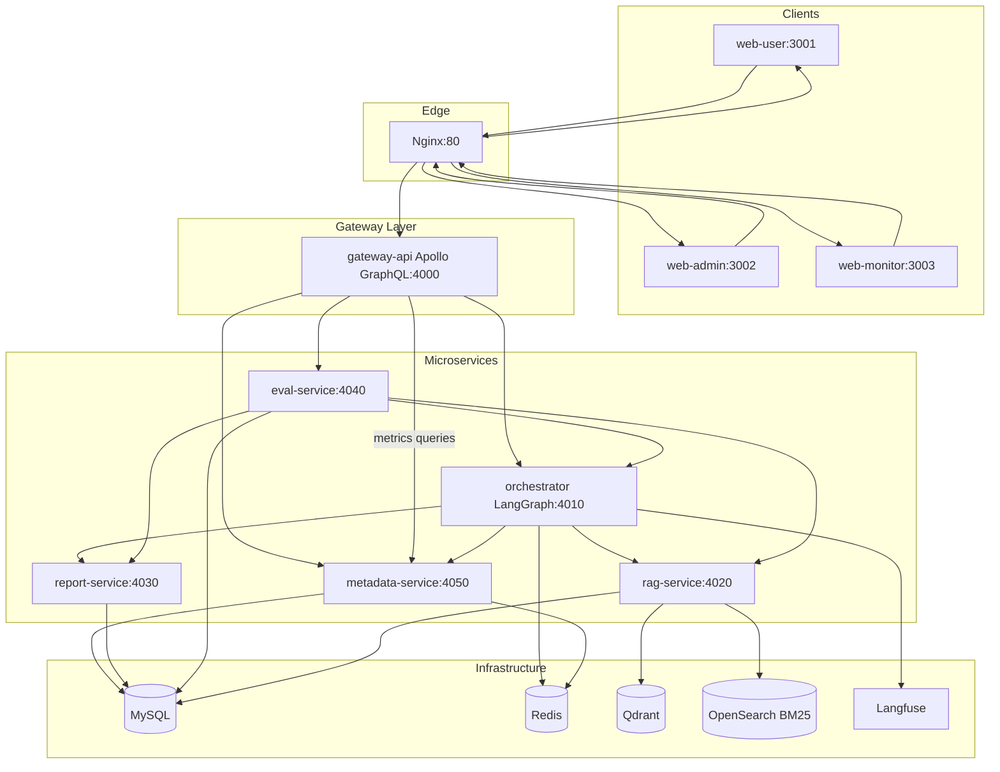
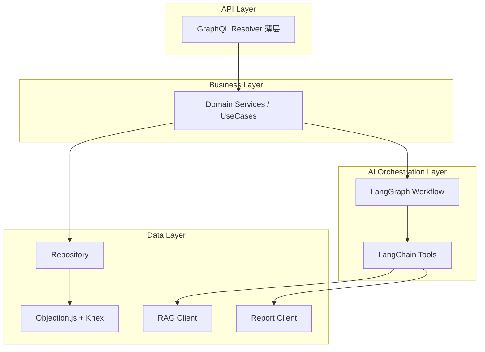
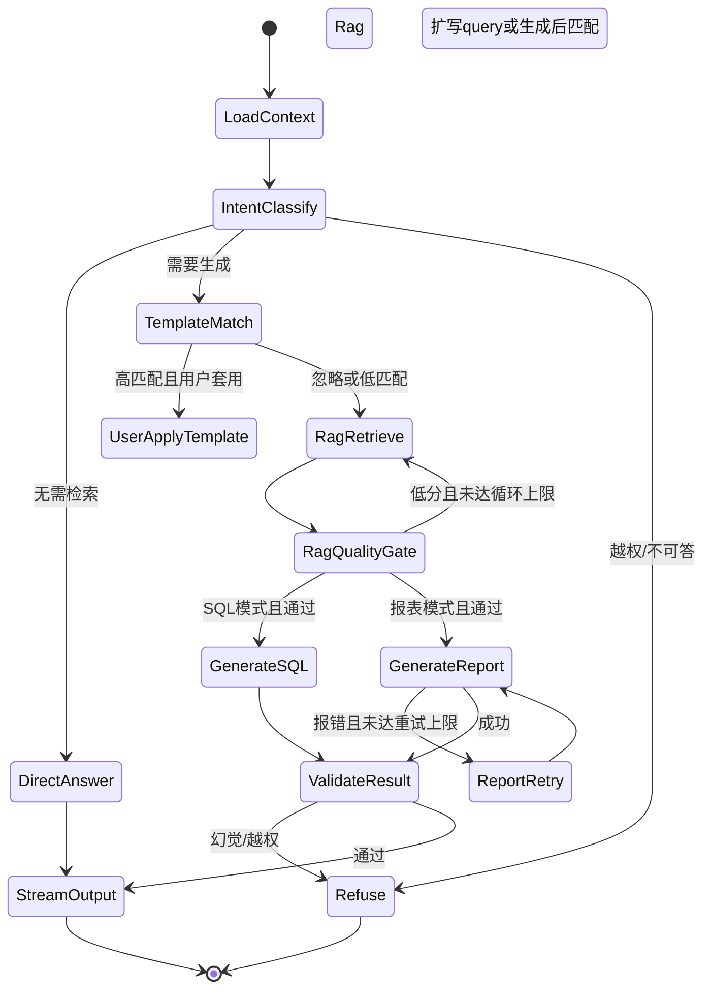
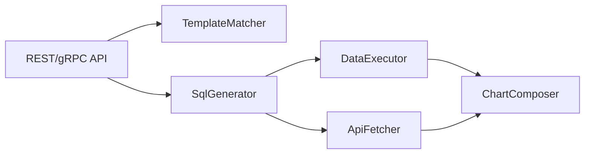
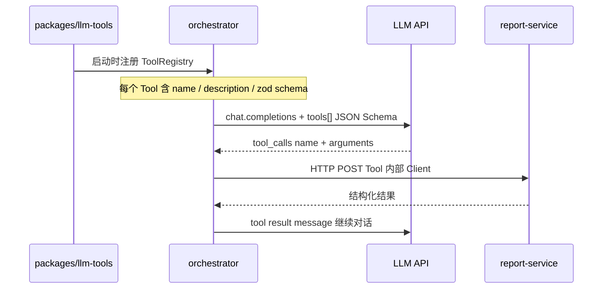
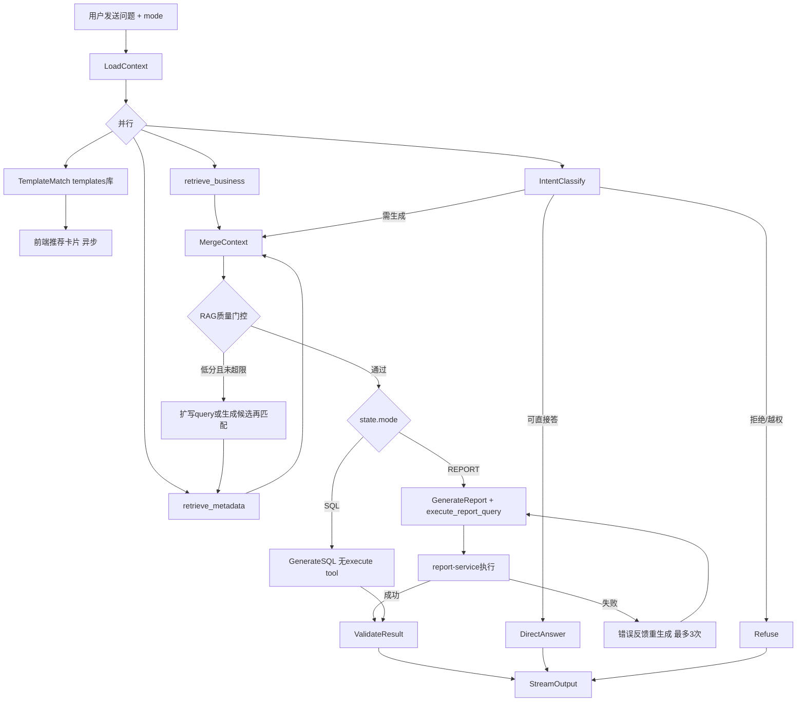

# 灵析（Hermes）系统整体架构设计

## 1. 架构总览

当前仓库为**绿场项目**（仅有 [docs/PRD_业务需求文档_v1.0.md](docs/PRD_业务需求文档_v1.0.md)、mockup、[AGENTS.md](AGENTS.md)），需从零搭建 monorepo 骨架与全部微服务。

### 1.1 已确认的关键决策

| 决策项 | 选择 |
|--------|------|
| 报表系统对接 | **内部 ReportService + LangChain Tool**（编排层通过 HTTP Client 封装为 Tool，非 MCP 主路径） |
| 后端形态 | **完全微服务**（API / RAG / Report / Orchestrator / Eval 独立进程） |
| 前端形态 | **三个独立 Next.js 14 应用**（user / admin / monitor） |
| 部署 | **Docker Compose + Makefile 一键启动** |

### 1.2 系统架构图



### 1.3 服务职责划分

| 服务 | 端口 | 职责 |
|------|------|------|
| **gateway-api** | 4000 | 对外唯一 GraphQL 入口；鉴权、参数校验、聚合子服务；SSE/Subscription 代理流式对话 |
| **metadata-service** | 4050 | 数据源/元数据/Prompt/模板/系统设置/告警/审计/监控指标聚合（ORM 主库） |
| **orchestrator** | 4010 | LangGraph 工作流：意图识别、RAG 调度、报表 Tool 调用、结果校验、中断/续跑 |
| **rag-service** | 4020 | BM25 + 向量检索、RRF 融合、TopK 重排、检索评分、query 扩写 |
| **report-service** | 4030 | 模板匹配、SQL/API 取数、行数上限校验、图表配置生成、错误结构化返回 |
| **eval-service** | 4040 | 离线评估集管理、批量跑批、报告生成、进度/取消 |
| **web-user/admin/monitor** | 3001-3003 | 三前端，均通过 Apollo Client 访问 gateway-api |

---

## 2. 分层设计（对齐 AGENTS.md）



- **Resolver**：只做 `requireAuth` → `validateInput` → `callService` → `mapResponse`
- **Service**：业务编排（权限、模板库、会话、审计）
- **Workflow**：AI 专用编排，不绕过权限直接查库
- **Repository**：复杂 SQL/事务边界，禁止拼接未参数化 SQL

---

## 3. LLM 编排工作流（LangGraph）

基于 PRD 3.1 主流程 + 用户补充需求，设计**可中断、可续跑**的状态机：



### 3.1 关键节点设计

| 节点 | 行为 | 配置项 |
|------|------|--------|
| **LoadContext** | 加载角色 Prompt（system 不可被 user 覆盖）、权限表/字段白名单、会话历史 | `promptVersion`, `roleId` |
| **IntentClassify** | 判断：直接回答 / 需 RAG / 需报表 / 拒绝 | LLM structured output |
| **TemplateMatch** | 异步向量匹配 SQL/报表模板（与用户输入并行） | `templateMatchThreshold` |
| **RagRetrieve** | 调用 rag-service：`bm25TopK` + `vectorTopK` → RRF → rerank | 全部可配置 |
| **RagQualityGate** | 评分低于阈值 → 扩写 query **或** LLM 生成候选答案再反向匹配；**maxLoops**（默认 3）跳出 | `minScore`, `maxRagLoops` |
| **GenerateSQL/Report** | Report 模式通过 **ReportTool** 调 report-service | — |
| **ReportRetry** | 将结构化错误（SQL 语法/字段不存在/行数超限）喂回 LLM 重生成；**maxRetries**（默认 3）后返回友好提示 | `maxReportRetries` |
| **ValidateResult** | 校验：仅引用 RAG 上下文、权限内字段、无编造表名 | 规则 + LLM 自检 |
| **StreamOutput** | SSE 分阶段推送：理解 → 检索 → 生成 | PRD 5.1 首字 ≤3s |

### 3.2 中断与续跑

- **Checkpoint**：LangGraph `RedisSaver`（key: `workflow:{sessionId}:{runId}`）
- **中断**：gateway 发 `cancelGeneration` mutation → orchestrator 设置 `interrupt signal` → 图在下一 safe node 暂停，标记「已中断」
- **续跑/追问**：`continueConversation` 携带 `checkpointId` + 追加条件 → 从 `LoadContext` 合并上下文重新进入（PRD 4.2.4）
- **并发约束**：Redis 分布式锁 `user:{id}:generating`，单用户同时 1 个任务（PRD 5.4）

### 3.3 Prompt 安全策略

- **System Prompt 分层**：`baseSystem`（硬编码，不可被 admin 删除的安全边界）+ `rolePrompt`（admin 可配）+ `sessionContext`
- **Anti-jailbreak**：user 消息不得覆盖 system；检测到 role-play 注入时走 Refuse 节点
- **Grounding 约束**：生成节点 prompt 强制引用 `ragContext` JSON，禁止未列出表/字段

---

## 4. RAG 系统设计

### 4.1 三库索引对象

| 库 | 来源表 | Chunk 粒度 |
|----|--------|------------|
| **metadata** | meta_tables + meta_fields + field_synonyms | 表级 + 字段级 |
| **business** | business_knowledge + field_samples | 文档级 + 字段样本级 |
| **templates** | sql_templates + report_templates（in_library=1） | 模板级 |

### 4.2 检索管线

```
User Query
  ├─ BM25 (OpenSearch) ──→ topK_bm25
  └─ Vector (Qdrant)   ──→ topK_vector
           ↓
      RRF Fusion (k=60, 权重可配)
           ↓
      Cross-Encoder Rerank (可选, topK_rerank)
           ↓
      Score + MatchReason
```

### 4.3 可配置参数（存 metadata-service `system_settings` + 环境变量默认值）

- `rag.bm25.topK`, `rag.vector.topK`, `rag.rrf.k`, `rag.rerank.topK`, `rag.minScore`, `rag.maxLoops`

### 4.4 索引更新

- 元数据变更 → Redis Stream 事件 → rag-service 增量 re-embed + BM25 更新

---

## 5. 报表生成系统设计（ReportService + LangChain Tool）

### 5.1 为何不用 MCP 作为主路径

- MCP 适合**外部 Agent 生态**（Cursor/Claude Desktop）接入；灵析 LLM 编排与报表生成同属产品内核，同集群内 **HTTP/gRPC + LangChain StructuredTool** 延迟更低、权限/审计/重试更可控
- 后续可在 `report-service` 增加 **可选 MCP Adapter** 暴露 `match_template` / `generate_report` tools，不影响主链路

### 5.2 Report Service 内部模块



| 能力 | 说明 |
|------|------|
| **matchTemplate** | 向量 + 场景描述相似度，返回模板推荐卡片数据 |
| **generateReport** | 入参：模式、RAG 上下文、用户问题、参数 → 输出 SQL + 图表配置 |
| **executeSql** | 连接用户权限内数据源，参数化执行，**行数上限强制校验**（PRD 5.6） |
| **fetchApiData** | 可插拔 `DataSourceAdapter`：HTTP REST 取数（配置化 URL/Auth/映射） |
| **错误结构化** | `{ code, field, message, suggestion }` 供 orchestrator 重试 |

### 5.3 不用 MCP 时，LLM 如何感知 Tool？

**核心结论：Tool 不是运行时「发现」的，而是编排层在代码中静态注册，通过 LLM Function Calling 协议注入。**

MCP 解决的是「外部 Agent 如何发现远程能力」；灵析内部走 **LangChain StructuredTool + OpenAI/兼容模型的 tools 参数**，机制如下：



| 机制 | 说明 |
|------|------|
| **Tool 定义** | 集中在 `packages/llm-tools/src/registry.ts`，每个 Tool 有 `name`、`description`（LLM 读此决定何时调用）、`schema`（Zod → JSON Schema） |
| **注册时机** | orchestrator 启动时 `buildToolRegistry(config)`，不是 DB 动态加载 |
| **可见性控制** | LangGraph **按节点绑定不同 Tool 子集**。`GenerateReportNode` 才 bind `execute_report_query`；`GenerateSQLNode` 不 bind 执行类 Tool |
| **调用方式** | LLM 返回 `tool_calls` → orchestrator 校验参数 → HTTP 调微服务 → 结果作为 `tool` role message 回传 LLM |
| **与 MCP 关系** | 语义等价于 MCP 的 tool descriptor，只是传输层是 HTTP 而非 MCP 协议；后续可加 MCP Adapter 复用同一套 schema |

**首版 Tool 清单（packages/llm-tools）：**

| Tool name | 绑定节点 | 后端 | 用途 |
|-----------|----------|------|------|
| `retrieve_metadata` | RagRetrieve | rag-service | 检索表/字段元数据 |
| `retrieve_business_knowledge` | RagRetrieve | rag-service | 检索业务知识/样本 |
| `retrieve_templates` | TemplateMatch / Generate* | rag-service | 检索相似模板作 few-shot |
| `execute_report_query` | GenerateReport | report-service | 执行 SQL/API 取数 + 图表配置 |
| `validate_sql` | ValidateResult | report-service | 语法/权限/行数预检（仅报表模式） |

---

## 6. 用户输入后的 LLM 编排设计（SQL / 报表分流 + 三向量库）

### 6.1 已确认：业务数据向量库 = 知识文档 + 数据样本

| 向量库 | Qdrant Collection | OpenSearch Index | 索引内容 | Prompt 中的角色 |
|--------|-------------------|------------------|----------|-----------------|
| **metadata** | `hermes_metadata` | `hermes_metadata` | 智能查询库内表/字段：物理名、中文名、描述、同义词、类型 | **Grounding 知识** — `<schema_context>` JSON，LLM 只能引用此处表/字段 |
| **business** | `hermes_business` | `hermes_business` | 业务知识文档 + 字段样本（枚举值、分布摘要） | **补充知识** — `<business_knowledge>`，不可替代 schema |
| **templates** | `hermes_templates` | `hermes_templates` | 已入库 SQL/报表模板：名称、场景描述、SQL、图表配置 | **Few-shot 示例** — `<examples>`，须标注「字段必须来自 schema_context」 |

### 6.2 模式由用户选择，不由 LLM 决定

前端 Tab 切换 `mode: SQL | REPORT`（PRD 4.2.1），作为 workflow **硬输入**写入 `WorkflowState.mode`。LLM 意图识别只判断「能否回答 / 是否需检索 / 是否拒绝」，**不切换模式**。

### 6.3 完整编排流程



### 6.4 Prompt 组装结构

```
[System - 不可覆盖]
  baseSystem（硬编码安全边界）
  + rolePrompt.persona + rolePrompt.constraints
  + mode 说明（SQL 只输出 SQL 文本 / 报表生成可视化）

[User Context]
  会话历史 + 用户追加条件

[Retrieved Context]
  <schema_context>      ← metadata TopK
  <business_knowledge>  ← business TopK
  <examples>            ← templates TopK（按 mode 过滤）

[Generation Instruction]
  SQL: "根据 schema_context 生成 SQL，禁止执行，禁止编造字段"
  REPORT: "生成 SQL + chartConfig，调用 execute_report_query"
```

### 6.5 SQL 模式 vs 报表模式

| 维度 | SQL 模式 | 报表模式 |
|------|----------|----------|
| 最终输出 | SQL 文本 + 说明 | 图表数据 + 配置 + 说明 |
| 是否执行查询 | **否**（交给数仓校验） | **是** |
| LLM Tools | 无执行类 Tool | `execute_report_query`, `validate_sql` |
| 模板 few-shot | 仅 sql_templates | 仅 report_templates |
| 失败重试 | LLM 自检语法/字段 | 执行错误回传 LLM，最多 3 次 |

### 6.6 套用模板分支

用户点击「套用」→ 跳过原生 RAG 循环 → `LoadTemplate` → `FillParameters` → 按 mode 进入 GenerateSQL / GenerateReport。

### 6.7 RAG 质量门控循环

```
loop_count < maxRagLoops(3):
  parallel retrieve(metadata, business)
  score = weighted(metadata_score, business_score)
  if score >= minScore: break
  else: expand_query 或 generate_then_match
score < minScore → Refuse 友好提示
```

---

## 7. 核心表设计（具体字段）

### 7.1 Schema 划分

| Schema | 归属服务 |
|--------|----------|
| `hermes_meta` | metadata-service |
| `hermes_chat` | orchestrator |
| `hermes_eval` | eval-service |

### 7.2 hermes_meta

#### users

| 字段 | 类型 | 说明 |
|------|------|------|
| id | CHAR(36) PK | UUID |
| username | VARCHAR(64) UNIQUE | 登录名 |
| email | VARCHAR(255) | 邮箱 |
| display_name | VARCHAR(128) | 显示名 |
| role_id | CHAR(36) FK | → roles.id |
| status | ENUM('active','disabled') | |
| created_at / updated_at | DATETIME(3) | |

#### roles

| 字段 | 类型 | 说明 |
|------|------|------|
| id | CHAR(36) PK | |
| code | VARCHAR(32) UNIQUE | admin / analyst / ops |
| name | VARCHAR(64) | |
| description | VARCHAR(512) | |
| created_at | DATETIME(3) | |

#### role_table_permissions / role_field_permissions

| 字段 | 说明 |
|------|------|
| role_id, table_id / field_id | 权限绑定 |
| can_query | TINYINT(1) |
| mask_type | ENUM('none','phone','id_card') 字段级 |

#### datasources

| 字段 | 类型 | 说明 |
|------|------|------|
| id | CHAR(36) PK | |
| name | VARCHAR(128) | |
| host, port, database_name | | 连接信息 |
| username, password_encrypted | TEXT | AES 加密 |
| connection_status | ENUM('unknown','ok','failed') | |
| last_tested_at, last_synced_at | DATETIME(3) | |
| created_by | CHAR(36) | |
| created_at / updated_at | DATETIME(3) | |

#### meta_tables

| 字段 | 类型 | 说明 |
|------|------|------|
| id | CHAR(36) PK | |
| datasource_id | CHAR(36) FK | |
| physical_name | VARCHAR(128) | 物理表名 |
| business_name | VARCHAR(128) | 业务中文名 |
| description | TEXT | |
| source | ENUM('sync','manual') | |
| source_status | ENUM('active','removed_at_source') | |
| in_query_library | TINYINT(1) | 纳入智能查询库 |
| created_at / updated_at | DATETIME(3) | |

#### meta_fields

| 字段 | 类型 | 说明 |
|------|------|------|
| id | CHAR(36) PK | |
| table_id | CHAR(36) FK | |
| physical_name, business_name | VARCHAR(128) | |
| description | TEXT | |
| data_type | VARCHAR(64) | |
| is_sensitive | TINYINT(1) | 脱敏标记 |
| source, source_status | ENUM | 同 meta_tables |
| in_query_library | TINYINT(1) | |
| created_at / updated_at | DATETIME(3) | |

#### field_synonyms

| 字段 | 说明 |
|------|------|
| id, field_id | |
| synonym | VARCHAR(128) | |

#### business_knowledge — 业务知识文档

| 字段 | 类型 | 说明 |
|------|------|------|
| id | CHAR(36) PK | |
| title | VARCHAR(256) | |
| category | ENUM('glossary','metric','rule','faq') | |
| content | TEXT | |
| status | ENUM('active','archived') | |
| vector_id | VARCHAR(128) | Qdrant point id |
| created_by, created_at, updated_at | | |

#### field_samples — 字段数据样本

| 字段 | 类型 | 说明 |
|------|------|------|
| id | CHAR(36) PK | |
| field_id | CHAR(36) FK | |
| sample_type | ENUM('distinct_values','value_range','distribution') | |
| sample_data | JSON | |
| synced_at | DATETIME(3) | |
| vector_id | VARCHAR(128) | |

#### prompt_versions

| 字段 | 类型 | 说明 |
|------|------|------|
| id | CHAR(36) PK | |
| role_id | CHAR(36) NULL | NULL=默认/global |
| persona | TEXT | 角色设定 |
| constraints | TEXT | 系统限制 |
| version | INT | 递增 |
| is_active | TINYINT(1) | |
| created_by, created_at | | |

#### sql_templates / report_templates

| 字段 | sql_templates | report_templates |
|------|---------------|------------------|
| id, name, scenario_description | ✓ | ✓ |
| sql_body | ✓ | ✓ |
| chart_type | — | ENUM('line','bar','table') |
| chart_config | — | JSON |
| placeholders | JSON | JSON |
| score, usage_count, success_rate, satisfaction_avg | ✓ | ✓ |
| in_library, status | ✓ | ✓ |
| vector_id | ✓ | ✓ |
| created_by, created_at, updated_at | ✓ | ✓ |

#### system_settings

| 字段 | 说明 |
|------|------|
| category | rag / sql / report / security |
| setting_key | 如 `rag.metadata.topK` |
| setting_value | JSON |
| updated_by, updated_at | |

#### alerts / audit_logs

见 PRD 4.1.8 / 5.5：type, level, title, message, ref_type, ref_id, status, resolved_* / actor_id, action, resource_*, before/after_snapshot, trace_id

### 7.3 hermes_chat

#### conversations

| 字段 | 类型 | 说明 |
|------|------|------|
| id | CHAR(36) PK | |
| user_id | CHAR(36) FK | |
| title | VARCHAR(256) | |
| mode | ENUM('sql','report') | |
| created_at, updated_at, last_active_at | DATETIME(3) | |

#### messages

| 字段 | 类型 | 说明 |
|------|------|------|
| id | CHAR(36) PK | |
| conversation_id | CHAR(36) FK | |
| role | ENUM('user','assistant','system') | |
| content | MEDIUMTEXT | |
| mode | ENUM('sql','report') | 生成时模式 |
| template_id, template_type | NULL | 套用模板 |
| status | ENUM('completed','interrupted','failed') | |
| metadata | JSON | phases/rag_scores/token_usage |
| created_at | DATETIME(3) | |

#### workflow_checkpoints

| 字段 | 说明 |
|------|------|
| conversation_id, run_id | |
| graph_state | JSON 或 Redis ref |
| status | running/interrupted/completed/failed |

#### message_feedback / generation_audit

rating(up/down), reason / user_id, mode, used_template, interrupted, trace_id

### 7.4 hermes_eval

eval_sets(name, description, is_preset) → eval_cases(question, mode, expected_tables JSON, expected_points) → eval_runs(status, progress, summary JSON) → eval_results(retrieval_hit, generate_success, score, actual_output, diff_notes)

### 7.5 ORM 技术栈

- **Knex** 迁移 + **Objection.js** Model/Repository（遵循 [.cursor/rules/database.mdc](.cursor/rules/database.mdc)）
- 共享包 `packages/orm-schemas` 导出类型；各服务独立 migration 目录

---

## 8. 前端三应用

| 应用 | 路由前缀 | 对应 PRD 模块 | 核心页面 |
|------|----------|---------------|----------|
| [apps/web-user](apps/web-user) | `/` | 4.2 用户平台 | 对话、模式切换、模板卡片、流式、历史会话、满意度 |
| [apps/web-admin](apps/web-admin) | `/admin` | 4.1 管理后台 | 数据源、元数据、Prompt、模板、检索测试、离线评估、设置、告警 |
| [apps/web-monitor](apps/web-monitor) | `/monitor` | 4.3 监控平台 | 缓存命中、检索预警、Token、满意度 |

- UI：Ant Design + 参考 [docs/mockup/](docs/mockup/) 视觉
- 流式：GraphQL Subscription 或 SSE（gateway 代理 orchestrator）
- 共享包 `packages/ui-shared`：通用 Layout、Auth、GraphQL fragments

---

## 9. 离线评估系统

- **eval-service** 独立进程，避免影响在线对话 SLA
- 流程：选评估集 → 批量调用 orchestrator（**mock 用户权限**）→ 收集检索命中 / 生成成功率 → LLM 或规则比对期望要点 → 生成报告
- 支持：进度条、取消、导出（PRD 4.1.6）
- 100 条 / 30 分钟目标：并发 worker 池 + 限流

---

## 10. 可观测性

- **Langfuse**：orchestrator 全链路 trace（每次 LLM/RAG/Report 调用）
- **结构化日志**：全服务统一 `traceId` / `sessionId` / `userId`
- **指标**：Prometheus 端点（可选）或写入 Redis → metadata-service 供 monitor 查询

---

## 11. Monorepo 目录结构

```
nl-hermes/
├── apps/
│   ├── gateway-api/          # Apollo Server, GraphQL schema, SSE proxy
│   ├── metadata-service/     # 管理域 CRUD + 监控指标 API
│   ├── orchestrator/         # LangGraph workflow service
│   ├── rag-service/          # BM25 + Vector + RRF + Rerank
│   ├── report-service/       # 模板/SQL/API/图表
│   ├── eval-service/         # 离线评估
│   ├── web-user/             # Next.js 14
│   ├── web-admin/            # Next.js 14
│   └── web-monitor/          # Next.js 14
├── packages/
│   ├── shared/               # 公共类型、错误码、常量
│   ├── contracts/            # OpenAPI/GraphQL 共享 schema 片段
│   ├── llm-tools/            # LangChain Tool 定义 + HTTP clients
│   ├── workflow/             # LangGraph 图定义、节点、状态类型
│   ├── orm-schemas/          # Objection models（按 schema 分包）
│   └── ui-shared/            # 前端共享组件
├── docker/
│   ├── nginx/nginx.conf
│   └── Dockerfile.*          # 各服务多阶段构建
├── migrations/
│   ├── meta/
│   ├── chat/
│   └── eval/
├── docker-compose.yml
├── docker-compose.dev.yml      # 仅基础设施（本地热重载开发）
├── Makefile
├── pnpm-workspace.yaml
├── turbo.json
├── .gitignore
├── .env.example
└── README.md
```

---

## 12. 技术栈汇总

| 层 | 技术 |
|----|------|
| 前端 | Next.js 14, React 18, Ant Design, Apollo Client |
| API | Apollo Server 4, GraphQL Subscriptions/SSE |
| 服务间通信 | REST + OpenAPI（首版）；内部 JWT/service token |
| ORM | Objection.js + Knex, MySQL 8 |
| 缓存/锁/Checkpoint | Redis 7 |
| 向量 | Qdrant |
| BM25 | OpenSearch 2.x |
| AI | LangChain + LangGraph |
| 监控 | Langfuse |
| 容器 | Docker Compose, Nginx 反向代理 |
| 包管理 | pnpm workspace + Turborepo |
| 测试 | Vitest（单元）, Supertest（API）, Testcontainers（集成） |

---

## 13. Docker 部署与 Makefile

### 12.1 docker-compose.yml 核心服务

`mysql`, `redis`, `qdrant`, `opensearch`, `langfuse`（可选 profile）, `gateway-api`, `metadata-service`, `orchestrator`, `rag-service`, `report-service`, `eval-service`, `web-user`, `web-admin`, `web-monitor`, `nginx`

### 12.2 Makefile 目标（一键启动）

```makefile
.PHONY: up down build migrate seed test lint dev logs

up:          ## docker compose up -d（全栈）
down:        ## docker compose down
build:       ## 构建全部镜像
migrate:     ## 执行全部 migration
seed:        ## 导入 demo 数据
dev:         ## 仅启动 infra + 本地 pnpm dev
test:        ## turbo test
lint:        ## turbo lint
logs:        ## docker compose logs -f
```

### 12.3 README.md 需包含

- 架构图、服务端口表、环境变量说明
- 快速开始：`cp .env.example .env && make up && make migrate && make seed`
- 开发模式：`make dev`（infra 容器 + 本地热重载）
- 三前端访问地址、默认账号
- 运行测试与离线评估命令

### 12.4 .gitignore 要点

`node_modules/`, `dist/`, `.next/`, `.env*`, `!.env.example`, `coverage/`, `.turbo/`, `docker/data/`, `*.log`, `.DS_Store`, IDE 目录

---

## 14. 服务间 API 契约（首版 REST）

| 调用方 | 被调方 | 关键端点 |
|--------|--------|----------|
| gateway | metadata | `/v1/datasources`, `/v1/prompts`, `/v1/templates`, `/v1/settings` |
| gateway | orchestrator | `/v1/chat/stream`, `/v1/chat/cancel`, `/v1/chat/continue` |
| orchestrator | rag | `POST /v1/retrieve`, `POST /v1/score` |
| orchestrator | report | `POST /v1/templates/match`, `POST /v1/reports/generate`, `POST /v1/query/execute` |
| orchestrator | metadata | `GET /v1/permissions/{userId}`, `GET /v1/prompts/{roleId}` |
| eval | orchestrator | `POST /v1/eval/run-case` |
| web-* | gateway | GraphQL `/graphql` |

---

## 15. 实施分期与待办

### Phase 0 — 工程脚手架（P0）
- 初始化 pnpm monorepo + Turborepo + 共享 tsconfig/eslint
- 生成 `.gitignore`, `README.md`, `Makefile`, `docker-compose.yml`, `.env.example`
- 各 app/package 空壳 + health check 端点
- Nginx 路由：`:80/admin`, `:80/monitor`, `:80/` → 三前端；`:80/graphql` → gateway

### Phase 1 — 基础设施（P0）
- MySQL 三 schema migration 骨架
- Redis / Qdrant / OpenSearch docker 配置
- 共享日志、traceId 中间件、service-to-service auth

### Phase 2 — metadata-service + web-admin 基础（P0）
- 数据源连接测试、元数据同步、智能查询库 CRUD
- Prompt 版本管理、系统设置、审计日志
- admin 前端：数据源 + 元数据 + Prompt 页面

### Phase 3 — rag-service（P0）
- 索引 pipeline（元数据 → Qdrant + OpenSearch）
- BM25 + Vector + RRF + Rerank API
- admin「向量检索测试」页对接

### Phase 4 — report-service（P0）
- SQL 模板 / 报表模板 CRUD（metadata 存定义，report 存执行逻辑）
- SQL 执行器 + 行数上限 + API DataFetcher 接口
- 模板匹配 API

### Phase 5 — orchestrator 工作流（P0）
- LangGraph 全节点实现 + Redis checkpoint
- LangChain Tools（RagTool, ReportTool, MetadataTool）
- 流式 SSE + 中断/续跑
- web-user 对话页 + 三阶段流式 UI

### Phase 6 — 模板推荐与用户闭环（P1）
- 异步模板匹配（输入停顿 2s 触发）
- 套用模板参数填写
- 满意度反馈、历史会话

### Phase 7 — web-monitor + 告警（P1）
- 缓存命中率、检索低分预警、Token 统计、满意度看板
- 告警事件列表（admin）与 monitor 联动

### Phase 8 — eval-service（P1）
- 评估集 CRUD、批量跑批、报告导出
- admin 离线评估全流程

### Phase 9 — 质量与生产化（P2）
- 单元/集成/契约测试补齐（各 service + workflow 节点）
- Langfuse 全链路
- 性能调优（RAG 5s、首字 3s、100 条评估 30min）
- 可选：report-service MCP adapter

---

## 16. 风险与假设

- **假设**：公司统一 SSO 后续接入；首版可用内置 JWT + 角色 mock
- **假设**：OpenSearch 作为 BM25 引擎；若运维偏好 Meilisearch 可替换
- **风险**：完全微服务首版运维复杂度较高；建议 Phase 0-5 先打通最小闭环再并行扩展
- **风险**：Cross-Encoder rerank 需 GPU 或外部 API；首版可先 RRF-only，rerank 作为可选增强
