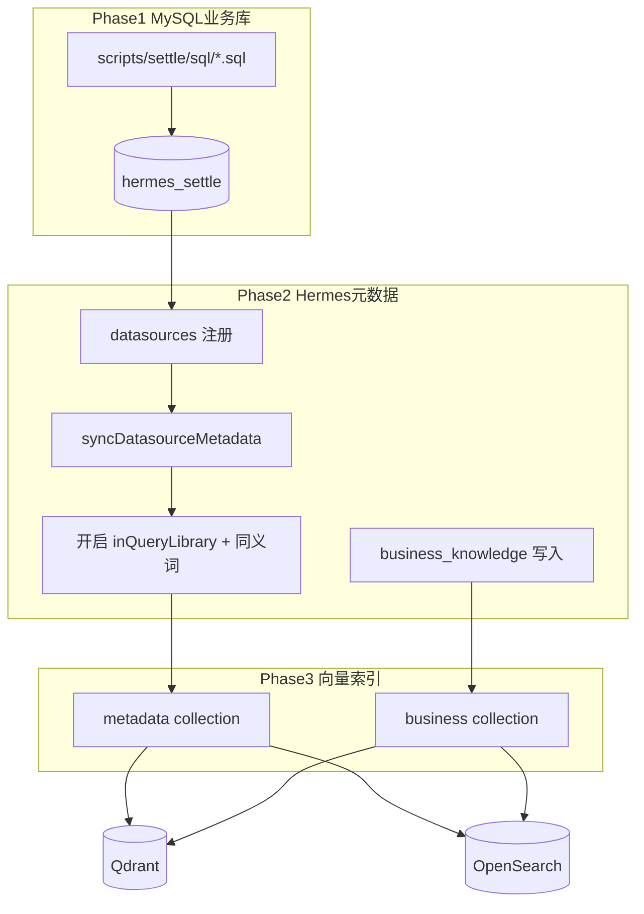

# 结算演示数据一键 Seed 脚本

## 目标

执行 `pnpm seed:settle`（或 `make seed`）后完成：

1. 在 Docker MySQL 中创建 `hermes_settle` 库、18 张核心结算表、关联模拟数据（**表名与 COMMENT 均不含 `tuxi`/`zto` 及品牌信息**）
2. 在 `hermes_meta` 中注册数据源、同步表结构元数据、开启查询库字段
3. 写入多条结算业务知识到 `business_knowledge` 表
4. 将元数据（query library 字段）与业务知识写入 Qdrant / OpenSearch 向量索引

**前置条件**（与 [Makefile](Makefile) 一致）：

```bash
make infra    # MySQL:3307 + Qdrant:6333 + OpenSearch:9200
make migrate  # hermes_meta 等 schema 就绪
pnpm seed:settle
```

---

## 架构与数据流



---

## 文件结构（新增）

| 路径 | 职责 |
|------|------|
| [`scripts/seed-settle.ts`](scripts/seed-settle.ts) | 主入口：编排三阶段、幂等检查、日志输出 |
| [`scripts/settle/sql/01-database.sql`](scripts/settle/sql/01-database.sql) | `CREATE DATABASE hermes_settle` |
| [`scripts/settle/sql/02-schema.sql`](scripts/settle/sql/02-schema.sql) | 18 张核心表 DDL（`TABLE_COMMENT`/`COLUMN_COMMENT` 通用中文，无 tuxi/zto） |
| [`scripts/settle/sql/03-seed-data.sql`](scripts/settle/sql/03-seed-data.sql) | 关联模拟数据 INSERT |
| [`scripts/settle/business-knowledge.json`](scripts/settle/business-knowledge.json) | 业务知识条目（glossary/metric/rule/faq） |
| [`scripts/settle/query-library.json`](scripts/settle/query-library.json) | 需加入查询库的表、字段及同义词配置 |

**修改现有文件**：

- [`package.json`](package.json) — 新增 `"seed:settle": "tsx scripts/seed-settle.ts"`
- [`Makefile`](Makefile) — 将 `seed` 目标从占位改为调用 `pnpm seed:settle`

---

## Phase 1：MySQL 业务库（hermes_settle）

### 命名规范

- **库名**：`hermes_settle`（与 `hermes_meta` 命名风格一致）
- **表名禁止项**：不得出现 `tuxi`、`zto` 子串（含前缀 `tuxi_`、`zto_`）
- **原 settle.md 中 `zto_*` 表**：统一改为 **`nl_*`** 前缀（本项目演示域）：
  - `zto_courier` → `nl_courier`
  - `zto_user_wallet` → `nl_courier_wallet`
  - `zto_store_fund_account` → `nl_store_fund_account`
  - `zto_store_fund_account_log` → `nl_store_fund_account_log`
- **其他表**：沿用 settle.md 域前缀（`hst_` / `hwt_` / `fund_flow` / `keeper_`），本身不含 tuxi/zto

### 注释规范（DDL + 元数据同步）

所有 `TABLE COMMENT`、`COLUMN COMMENT` 及后续 `query-library.json` 中的 `description`/`businessName`：

- **禁止**出现：`tuxi`、`zto`、`兔喜`、`中通` 等品牌/项目专有词
- **使用**通用业务表述，例如：「业务员」「门店资金账户」「结算账单」「派费库存记录」
- 注释会经 [`syncDatasourceMetadata`](apps/metadata-service/src/services/datasource-service.ts) 同步为 `meta_tables.business_name` / `meta_fields.business_name`，并进入向量索引，故须与表名规范一致

**COMMENT 示例**：

```sql
CREATE TABLE nl_courier (
  staff_code VARCHAR(32) NOT NULL COMMENT '业务员编号',
  ...
) COMMENT='业务员信息';
-- ❌ 禁止: COMMENT='中通业务员(zto_courier)'
```

### 核心表子集（18 张，参考 settle.md 4.1–4.6、4.10）

**账户域 `hwt_*`（4）**

- `hwt_user`, `hwt_account`, `hwt_sub_account`, `hwt_biz_user_relation`

**交易域（2）**

- `hwt_trade_info`, `hwt_account_change_log`

**结算域 `hst_*`（5）**

- `hst_stock_record`, `hst_order`, `hst_pay_order`, `hst_bill`, `hst_bill_item`

**账务域（1）**

- `fund_flow`

**业务员域 `nl_*`（2）**

- `nl_courier`, `nl_courier_wallet`

**门店资金域 `nl_*`（2）**

- `nl_store_fund_account`, `nl_store_fund_account_log`

**对账域（2，轻量）**

- `keeper_task_info`, `keeper_check_error_detail`

> 所有表使用 `utf8mb4`，字段类型与 settle.md 核心字段对齐；COMMENT 按上文规范填写，供元数据 sync 与 RAG 使用。

### 模拟数据规模（保证可 JOIN、可聚合）

| 实体 | 数量 | 说明 |
|------|------|------|
| 门店 depot | 5 | DEPOT001–DEPOT005（模拟编码，非品牌前缀） |
| 业务员 courier | 8 | 关联门店 |
| 用户/账户 | 10 | 含子账户余额 |
| 库存记录 hst_stock_record | 30 | 派费源数据 |
| 结算订单 hst_order | 20 | 含多种 order_type |
| 支付子单 hst_pay_order | 25 | 关联 order |
| 账单/明细 hst_bill + hst_bill_item | 8 + 40 | 覆盖 bill_status 0–13 多种状态 |
| 钱包交易 hwt_trade_info | 25 | 关联 bill_item.trade_code |
| 资金流水 fund_flow | 30 | 关联 trade_id |
| keeper 异常 | 5 | 对账演示 |

数据生成方式：SQL 文件内固定 INSERT（可读、可 review），主键/编码使用可预测前缀（如 `ORD20250601001`），外键关系在 SQL 中显式维护。

**幂等策略**：脚本启动时执行 `DROP DATABASE IF EXISTS hermes_settle` 后重建（可通过 `--keep-db` 跳过 drop，默认全量重置）。

---

## Phase 2：Hermes 元数据（直接 ORM，无需 HTTP）

复用现有服务层，与 [`scripts/migrate.ts`](scripts/migrate.ts) 同样 `loadEnv()` + mysql 连接：

```typescript
import { bindMetaDb } from '@hermes/orm-schemas';
import { createRepositories } from '../apps/metadata-service/src/repositories/index.js';
import { DatasourceService } from '../apps/metadata-service/src/services/datasource-app-service.js';
import { syncDatasourceMetadata } from '../apps/metadata-service/src/services/datasource-service.js';
import { BusinessKnowledgeService } from '../apps/metadata-service/src/services/business-knowledge-service.js';
```

步骤：

1. **注册/更新数据源** — 名称 `结算演示库`，host/port/user/password 读 `.env`（`localhost:3307`, `hermes`/`hermes_dev`），database=`hermes_settle`；若已存在同名数据源则 patch 连接信息并复用 id（[`encryptSecret`](apps/metadata-service/src/lib/crypto.ts) 加密密码）
2. **同步表结构** — 直接调用 `syncDatasourceMetadata()`（读取 `information_schema`，写入 `meta_tables` / `meta_fields`）
3. **开启查询库** — 按 [`query-library.json`](scripts/settle/query-library.json)：
   - 对配置的表 PATCH `inQueryLibrary=true` + `description`
   - 对配置的字段 PATCH `inQueryLibrary=true` + `businessName`/`description` + `synonyms`
   - 需满足 [`listFieldsForLibrary`](apps/metadata-service/src/repositories/index.ts) 的双层 `in_query_library=true` 条件
4. **写入业务知识** — 读取 `business-knowledge.json`，按 title 幂等 upsert 到 `business_knowledge`（category: glossary/metric/rule/faq）

### 业务知识内容（约 15–20 条，业务语义参考 settle.md，文案通用化）

示例条目（**正文不含 tuxi/zto/兔喜/中通**）：

- **glossary**：派费、bill 与 bill_item 区别、参与方角色（门店/业务员/老板/代理/网点/总部）、order_type 枚举
- **rule**：bill_status 状态流转（0→13）、幂等键（biz_order_code/pay_code/unique_code）
- **metric**：待结算金额、代扣成功率、对账异常笔数
- **faq**：结算模块与钱包模块关系、bill 何时生成、派费数据来源

---

## Phase 3：向量索引（直接 Qdrant/OpenSearch，无需 rag-service 进程）

从 seed 脚本内复用 rag-service 底层客户端（与 [`IndexPipelineService`](apps/rag-service/src/services/index-pipeline.ts) 相同逻辑，但不走 HTTP）：

```typescript
import { embedText } from '../apps/rag-service/src/lib/embedding.js';
import { QdrantClient } from '../apps/rag-service/src/lib/qdrant.js';
import { OpenSearchClient } from '../apps/rag-service/src/lib/opensearch.js';
import { QDRANT_COLLECTIONS, OPENSEARCH_INDICES } from '@hermes/shared';
```

1. **metadata 索引** — `metaRepo.listFieldsForLibrary()` 取字段 → 拼接 content（表名+字段名+同义词）→ `embedText` → upsert 到 `hermes_metadata`
2. **business 索引** — 读取刚写入的 `business_knowledge` active 条目 → upsert 到 `hermes_business`

索引前调用 `QdrantClient.ensureCollection()`；Qdrant/OpenSearch 不可达时输出明确错误并 exit 1。

---

## 脚本 CLI 与输出

```bash
pnpm seed:settle              # 全量重置并 seed
pnpm seed:settle --keep-db    # 保留已有 hermes_settle，仅重跑 Hermes 同步与索引
pnpm seed:settle --skip-index # 跳过向量索引（调试用）
```

执行日志按阶段打印，结束时输出摘要：

- 数据源 ID、同步表/字段数
- 查询库字段数、业务知识条数
- Qdrant metadata/business indexed 数量

---

## 验证步骤（实现后执行）

```bash
make infra && make migrate
pnpm seed:settle

# 验证 MySQL 业务数据
mysql -h127.0.0.1 -P3307 -uhermes -phermes_dev -e "USE hermes_settle; SELECT COUNT(*) FROM hst_bill;"

# 验证 Hermes 元数据（需 bindMetaDb 或管理后台）
# 管理后台 → 数据源 → 结算演示库 → 元数据同步成功
# 管理后台 → 业务知识 → 可见结算条目

# 验证 Qdrant
curl -s http://localhost:6333/collections/hermes_metadata | jq '.result.points_count'
curl -s http://localhost:6333/collections/hermes_business | jq '.result.points_count'
```

启动 `make dev` 后，在管理后台或用户对话中测试 NL 查询，例如：

- 「查询 6 月待结算账单金额按门店汇总」
- 「门店 DEPOT001 的派费库存记录有多少条」
- 「bill_status=13 的已结算账单有哪些」

---

## 设计取舍

| 决策 | 理由 |
|------|------|
| 18 张核心表而非 300+ | 用户确认接受核心子集；覆盖 NL 查询主链路且可维护 |
| 独立运行（ORM + 直连 Qdrant） | 用户确认；不依赖 `make dev` 启动 Node 服务 |
| SQL 文件 + TS 编排 | DDL/DML 可 review；TS 复用现有 encrypt/sync/index 逻辑 |
| DROP DATABASE 默认重置 | 保证幂等、关联数据一致；提供 `--keep-db` 逃生 |
| 表名/注释不含 tuxi/zto，zto_* → nl_* | 用户要求；COMMENT 与 business-knowledge 同步脱敏，避免进入向量库 |
| 不新增 GraphQL/API 契约 | 最小闭环，符合 change-control 规则 |

---

## 风险与未覆盖项

- **Embedding 质量**：当前使用 [`embedText`](apps/rag-service/src/lib/embedding.js) 本地 hash 向量（非真实 embedding 模型），与生产 RAG 行为一致但语义检索精度有限
- **权限**：seed 不写入 `role_table_permissions`；若后续启用表级权限需另补
- **OpenSearch**：与 Qdrant 双写；OpenSearch 未启动时 metadata 索引可能部分失败，脚本应分别检测并报告
- **Docker 首次 init**：`hermes_settle` 由脚本创建，不修改 [`docker/mysql/init/01-schemas.sql`](docker/mysql/init/01-schemas.sql)（避免仅首次生效的限制）
